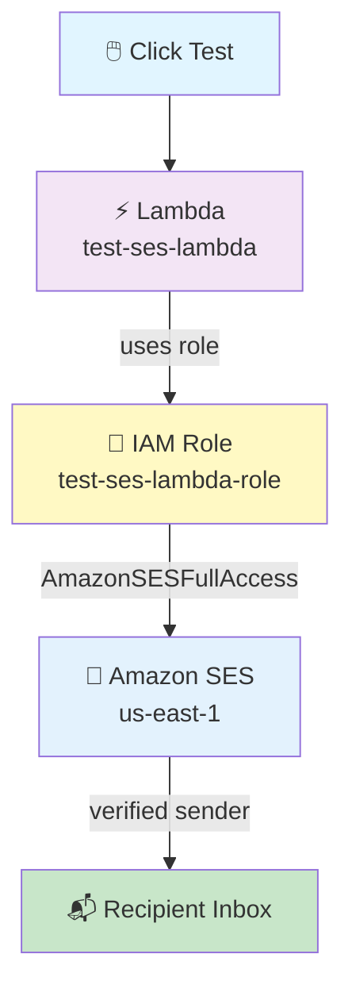

# Lambda → SES Email Pipeline

## One Lambda, One HTML, One CSS — Handles SUCCESS and FAILED Dynamically

## 📁 Files in This Folder

| File | What It Is |
| ---- | ---------- |
| [lambda_function.py](lambda_function.py) | The Lambda handler — config, the HTML/plain-text builders, and the `ses.send_email` call |
| [email.html](email.html) | The HTML email body — design only, with `{{PLACEHOLDER}}` tokens the handler fills in |
| [email.css](email.css) | The stylesheet for both themes. Injecting it into the HTML, not pasting it inline, is what keeps the design out of the Python |
| [trust_policy.json](trust_policy.json) | The IAM trust policy for the Lambda execution role (`lambda.amazonaws.com` only) |

This README explains the **theory** — how the pieces fit together and why. The code itself lives in the files above.

## 🎯 Goal

When you click **Test** on an AWS Lambda function, Lambda uses **Amazon SES** to send a **nice HTML email** to verified recipients.

The same Lambda sends **two completely different emails** depending on one value in the test JSON:

```json
{"status": "SUCCESS"}
```

```json
{"status": "FAILED"}
```

That single word switches the **subject, the colours, the status badge, the message, and whether the failure block appears at all**.

```text
Test Click
     ↓
Lambda
     ↓
Read event["status"]
     ├─────────────┐
     ▼             ▼
  SUCCESS       FAILED
  green UI      red UI
     │             │
     └──────┬──────┘
            ▼
       Amazon SES
            ▼
     Recipient Inbox 📬
```

### Why this matters

Before, testing the failure path meant editing the Python, or duplicating the whole function.

Now there is **one handler, one HTML file and one CSS file**, and the only thing that changes between the success email and the failure email is the test event.

```text
You change  : the test JSON
You never change : lambda_function.py, email.html, email.css
```

## 📋 What You Need Before Starting

- An AWS account (console access)
- One **verified sender email** — this project uses `no-reply@kshitijaws.site`
- One or more **recipient emails** (example: `kshitijjavir110@gmail.com`)
- Region: **`us-east-1` (N. Virginia)** — keep everything in one region

> ⚠️ **SES Sandbox Rule:** In sandbox mode, **both the sender AND every recipient must be verified** in SES.
>
> If you use `no-reply@kshitijaws.site`, you verify the **whole domain** `kshitijaws.site` in SES rather than a single address. That is the better option anyway — one verification covers every address at that domain.

## 🗺️ Pipeline Overview



---

## 🥇 STEP 1: Create the IAM Role

**Go to:** IAM Console → **Roles** → **Create role**

| Field | Value |
|---|---|
| Trusted entity type | **AWS service** |
| Use case | **Lambda** |
| Role name | `test-ses-lambda-role` |

### Trust Policy (auto-created — keep it exactly like this)

The trust policy this role uses is in [trust_policy.json](trust_policy.json) — it trusts `lambda.amazonaws.com` and nothing else.

> ❌ Do **NOT** add `ses.amazonaws.com` to the trust policy. SES is **not** assuming your role — Lambda is.

---

## 🥈 STEP 2: Attach Managed Policies to the Role

Attach **both** of these AWS-managed policies:

| # | Managed Policy | Its Job |
|---|---|---|
| 1 | `AWSLambdaBasicExecutionRole` | Write logs to CloudWatch |
| 2 | `AmazonSESFullAccess` | Send emails using SES |

**Where:** IAM → Roles → `test-ses-lambda-role` → **Add permissions → Attach policies** → search and select both → **Attach**

> 💡 For production, do not use full SES access. Make a custom policy with only `ses:SendEmail` and limit it to your sender address.

---

## 🥉 STEP 3: Verify Emails in Amazon SES

**Go to:** SES Console (us-east-1) → **Configuration** → **Identities** → **Create identity**

Do this for **the sender and every recipient**.

The sender and the recipients are verified in **two different ways**, because one is a whole domain and the others are individual inboxes.

### The sender — verify the domain

| Field | Value |
|---|---|
| Identity type | **Domain** |
| Domain | `kshitijaws.site` |

Verifying a domain issues **DNS records** (CNAMEs) instead of an email link:

```text
1. SES -> Identities -> Create identity -> Domain
2. Enter: kshitijaws.site
3. SES shows 3 CNAME records
4. Add all 3 to your domain's DNS (wherever the domain is hosted)
5. Wait for the status to show "Verified"
```

> 💡 DNS propagation can take a few minutes to an hour. Until the status is **Verified**, SES refuses to send from any address at that domain.

### Each recipient — verify the email address

| Field | Value |
|---|---|
| Identity type | **Email address** |
| Email address | `kshitijjavir110@gmail.com` (recipient #1) |
| Email address | *(any other recipient)* (recipient #2) |

**For each recipient:**

1. Click **Create identity**
2. Open that email inbox
3. Find the AWS verification email → click the verify link
4. Check the status shows **Verified** ✅ in the SES Identities list

**Target state:**

```
SES → Identities
┌────────────────────────────────┬───────────┐
│ kshitijaws.site                │ Verified  │   <- sender (domain)
│ kshitijjavir110@gmail.com      │ Verified  │   <- recipient
│ kshitijjavir111@gmail.com      │ Verified  │   <- recipient
└────────────────────────────────┴───────────┘
```

---

## 🏅 STEP 4: Create the Lambda Function

**Go to:** Lambda Console (us-east-1) → **Create function**

| Field | Value |
|---|---|
| Option | **Author from scratch** |
| Function name | `test-ses-lambda` |
| Runtime | **Python 3.12** |
| Architecture | x86_64 |
| Execution role | **Use an existing role** → `test-ses-lambda-role` |

Click **Create function**.

### Check the Handler Settings

**Go to:** Lambda → **Configuration** → **General configuration** → **Edit**

| Field | Value |
|---|---|
| Handler | `lambda_function.lambda_handler` |
| Runtime | Python 3.12 |
| Timeout | 10 seconds |
| Memory | 128 MB |

---

## 🏆 STEP 5: Add the Code in Lambda

**Go to:** Lambda Console → `test-ses-lambda` → **Code** tab

You will see the inline code editor. This pipeline needs **three files**, so it must be uploaded as a zip:

| File | Needed because |
|---|---|
| `lambda_function.py` | The handler itself |
| `email.html` | The email body — design only, no Python |
| `email.css` | The stylesheet for both themes |

> ⚠️ **This one cannot be pasted into the inline editor.** The handler reads `email.html` and `email.css` from disk at runtime, so all three files have to be deployed together. Earlier versions of this folder were paste-able because the HTML was embedded in the Python; adding the separate CSS file gave that up in exchange for keeping the design out of the code.

The handler locates the files relative to itself:

```python
BASE_DIR = os.path.dirname(__file__)

HTML_TEMPLATE_PATH = os.path.join(BASE_DIR, "email.html")
CSS_TEMPLATE_PATH  = os.path.join(BASE_DIR, "email.css")
```

On Lambda, `__file__` resolves inside `/var/task`, so **all three files must sit in the root of the zip, side by side** — not inside a sub-folder.

To build the zip (from inside this folder):

```bash
zip -r function.zip lambda_function.py email.html email.css
```

Then: **Upload from** → **.zip** → select `function.zip` → click **Deploy**.

Wait for the green **"Successfully updated"** message.

> 💡 The `.zip` itself is not committed to this repo — see `.gitignore`. Build it locally, upload it, and delete it.

### 🔍 What the Code Does (Simple Version)

| Part | What It Does |
|------|--------------|
| `SENDER` | The verified sender — `no-reply@kshitijaws.site` |
| `RECIPIENTS` | A **list** — you can send to more than one person |
| `LAMBDA_FUNCTION_NAME` | Printed in the email body, and in logs |
| `HTML_TEMPLATE_PATH` / `CSS_TEMPLATE_PATH` | Where `email.html` and `email.css` sit inside the deployment package |
| `load_html_template()` | Reads both files, injects the CSS into the HTML `<head>`, returns the finished page |
| `build_html_email()` | Picks the green or red copy based on `status`, then replaces every `{{PLACEHOLDER}}` |
| `build_text_fallback()` | A plain-text version for email apps that don't show HTML |
| `ses.send_email(...)` | Tells SES to send the email |
| `MessageId` | AWS's ID for that email — proof it was sent |

---

## 🎨 How One Template Produces Two Emails

There is no `if status == SUCCESS` anywhere in the HTML or the CSS. Both files are static.

Three separate mechanisms do the switching:

### 1. The theme class

The HTML has one placeholder where a *class name* goes:

```html
<div class="email-card {{STATUS_CLASS}}-theme">
```

`build_html_email()` replaces it with `success` or `failed`, producing:

```html
<div class="email-card success-theme">   <!-- green -->
<div class="email-card failed-theme">    <!-- red -->
```

The CSS then keys every colour off that one class:

```css
.success-theme .status-banner { border-left: 4px solid #16a34a; }  /* green */
.failed-theme  .status-banner { border-left: 4px solid #dc2626; }  /* red   */
```

That is why **one stylesheet serves both emails** — the whole colour scheme hangs off a single class on the top-level card.

### 2. The error section

Only the failure email has an error block, and it is not hidden with CSS — it is **not inserted at all**:

```python
if status == "SUCCESS":
    error_section = ""          # empty string
else:
    error_section = f"""...Failure Details card..."""
```

`{{ERROR_SECTION}}` in the HTML is replaced with either a full HTML block or nothing.

### 3. The subject line

```python
if status == "SUCCESS":
    subject = "AWS Lambda Notification - Execution Successful"
else:
    subject = "AWS Lambda Alert - Execution Failed"
```

### What changes between the two emails

| | SUCCESS | FAILED |
|---|---|---|
| Subject | `AWS Lambda Notification - Execution Successful` | `AWS Lambda Alert - Execution Failed` |
| Card class | `success-theme` | `failed-theme` |
| Status banner | Green, left border `#16a34a` | Red, left border `#dc2626` |
| Status icon | `✓` | `!` |
| Status badge | Green pill `SUCCESS` | Red pill `FAILED` |
| Headline | Lambda Execution Successful | Lambda Execution Failed |
| Failure Details block | absent | present, with Error Type + Error Message |
| Notification box | Standard grey | Red-tinted |
| Plain-text body | no FAILURE DETAILS section | includes FAILURE DETAILS section |

---

## 🏅 STEP 6: Test the Pipeline — SUCCESS 🟢

**Go to:** Lambda Console → **Test** tab → **Create new event**

### Event 1 — `success_test`

```json
{
    "status": "SUCCESS",
    "trigger": "Manual Test Invocation"
}
```

Click **Save**, then **Test**.

**You receive:**

```text
Subject:
AWS Lambda Notification - Execution Successful

✓ Lambda Execution Successful

Execution Details
──────────────────────────────────
Lambda Function   test-ses-lambda
AWS Region        us-east-1 (N. Virginia)
Service           Amazon SES
Trigger           Manual Test Invocation
Execution Time    2026-09-18 12:34:56 UTC
Status            SUCCESS 🟢
```

The UI renders **green**.

**CloudWatch logs:**

```text
Status          : SUCCESS
Lambda Function : test-ses-lambda
Region          : us-east-1
Trigger         : Manual Test Invocation
Sender          : no-reply@kshitijaws.site
Recipients      : ['kshitijjavir110@gmail.com', 'kshitijjavir111@gmail.com']
Subject         : AWS Lambda Notification - Execution Successful
======================================================================
EMAIL SENT SUCCESSFULLY
======================================================================
Notification Status : SUCCESS
SES MessageId       : 010001a0...
```

**Lambda response:**

```json
{
  "statusCode": 200,
  "body": {
    "message": "Email sent successfully through Amazon SES",
    "notificationStatus": "SUCCESS",
    "messageId": "010001a0..."
  }
}
```

---

## 🏅 STEP 7: Test the Pipeline — FAILED 🔴

Create a **second** test event.

### Event 2 — `failure_test`

```json
{
    "status": "FAILED",
    "trigger": "Manual Test Invocation",
    "errorType": "LambdaExecutionError",
    "errorMessage": "Test failure: Lambda was unable to complete the requested operation."
}
```

Click **Save**, then **Test**.

**You receive:**

```text
Subject:
AWS Lambda Alert - Execution Failed

! Lambda Execution Failed

Execution Details
──────────────────────────────────
Lambda Function   test-ses-lambda
AWS Region        us-east-1 (N. Virginia)
Service           Amazon SES
Trigger           Manual Test Invocation
Execution Time    2026-09-18 12:36:02 UTC
Status            FAILED 🔴

Failure Details
──────────────────────────────────
Error Type        LambdaExecutionError
Error Message     Test failure: Lambda was unable
                  to complete the requested operation.
```

The UI switches to **red** automatically — same HTML, same CSS, different data.

### The point of the whole exercise

```text
To test SUCCESS  ->  send {"status": "SUCCESS"}
To test FAILED   ->  send {"status": "FAILED"}

lambda_function.py  ->  never edited
email.html          ->  never edited
email.css           ->  never edited
```

### What the test JSON keys do

| Key | Required | Default if missing | Effect |
|---|---|---|---|
| `status` | No | `SUCCESS` | Picks the whole theme. Must be `SUCCESS` or `FAILED` — anything else raises |
| `trigger` | No | `Manual Test Invocation` | Shown in the Execution Details table |
| `errorType` | No | `LambdaExecutionError` | Shown in Failure Details (FAILED only) |
| `errorMessage` | No | A generic failure sentence | Shown in Failure Details (FAILED only) |

> 📌 `status` is uppercased before it is checked, so `"success"` and `"Success"` both work. An **invalid** value raises `ValueError` on purpose — the function fails loudly rather than silently defaulting to a success email, which would be actively misleading for an alerting pipeline.

---

## 🏅 STEP 8: Check That the Email Arrived

Open each recipient inbox and check:

| Where to Look | Notes |
|---|---|
| ✅ Inbox | Primary inbox |
| ⚠️ Spam / Promotions | First SES emails often land here |
| 🔍 Search | `from:no-reply@kshitijaws.site` |

The subject tells you which one you received:

- **Success email:** `AWS Lambda Notification - Execution Successful`
- **Failure email:** `AWS Lambda Alert - Execution Failed`
- **Sender:** `no-reply@kshitijaws.site via amazonses.com`

### If the Email Is in Spam

Click **"Report as not spam"** → future emails should go to the Inbox. ✅

> 💡 Verifying the **domain** rather than a single address helps here. SES adds SPF and DKIM DNS records when you verify a domain, which is what stops mailbox providers treating the mail as suspicious. An email verified as a single address does not give you that.

---

## 📊 Final Summary Table

| Item | Value |
|---|---|
| **Region** | `us-east-1` |
| **IAM Role** | `test-ses-lambda-role` |
| **Trust Policy** | `lambda.amazonaws.com` |
| **Managed Policy 1** | `AWSLambdaBasicExecutionRole` |
| **Managed Policy 2** | `AmazonSESFullAccess` |
| **Lambda Function** | `test-ses-lambda` |
| **Runtime** | Python 3.12 |
| **Handler** | `lambda_function.lambda_handler` |
| **SES Sender** | `no-reply@kshitijaws.site` (verified **domain**) |
| **SES Recipients** | All verified (sandbox rule) |
| **Deployment** | `function.zip` — 3 files, cannot be pasted inline |
| **Trigger** | Manual Test |
| **Success Subject** | `AWS Lambda Notification - Execution Successful` |
| **Failure Subject** | `AWS Lambda Alert - Execution Failed` |
| **Result** | Green or red HTML email, from one template |

---

## 🧩 Full Step List (Quick Reference)

| Step | What to Do |
|------|-----------|
| 1 | IAM → Roles → Create role → AWS service → **Lambda** |
| 2 | Role name: `test-ses-lambda-role` (keep trust policy as-is) |
| 3 | Attach `AWSLambdaBasicExecutionRole` + `AmazonSESFullAccess` |
| 4 | SES → Identities → Create identity → **Domain** `kshitijaws.site` → add the 3 CNAMEs to DNS |
| 5 | SES → Identities → Create identity → **Email address** for each recipient → click the verify link |
| 6 | Lambda → Create function → `test-ses-lambda`, Python 3.12 |
| 7 | Execution role: use existing → `test-ses-lambda-role` |
| 8 | Check handler: `lambda_function.lambda_handler` |
| 9 | Zip all 3 files → **Upload from** → **.zip** → **Deploy** |
| 10 | Test tab → event `success_test` with `{"status": "SUCCESS"}` → **Test** → green email ✅ |
| 11 | Test tab → event `failure_test` with `{"status": "FAILED", ...}` → **Test** → red email 🔴 |
| 12 | Open the recipient inbox → check Inbox and Spam |
| 13 | If in Spam → click "Report as not spam" |

---

## ⚠️ Important Points to Remember

| Point | Why It Matters |
|-------|----------------|
| **Sandbox mode** | Sender AND all recipients must be verified, or SES refuses to send |
| **`ses.amazonaws.com` in trust policy** | ❌ Not needed — SES does not assume your role, Lambda does |
| **Region must match** | SES identities, Lambda, and the code's region should all be `us-east-1` |
| **Verify first, send later** | New identities cannot send until the CNAMEs resolve / the link is clicked |
| **Check Spam** | First emails from a new SES sender often go to Spam |
| **Three files, one zip** | `email.html` and `email.css` are read from disk at runtime, so the zip must contain all three at its root |
| **Test with data, not edits** | Both themes come from the same files — change the test JSON, never the code |
| **Invalid `status` raises** | Deliberate. An alerting pipeline must not default to "success" |
| **Production** | Replace `AmazonSESFullAccess` with a small custom `ses:SendEmail` policy |

---

## ⚠️ Known Limitations

Worth knowing before reusing this template for something important.

### 1. Most of the CSS is in a `<style>` block, not inline

Email clients are stricter than browsers. **Gmail, Apple Mail and Outlook.com support `<style>` in the head**, but some other clients strip it — and then the email arrives as unstyled HTML.

The bulletproof approach is to put every style **inline**, as a `style="..."` attribute on each element. That is what a tool like [Premailer](https://github.com/peterbe/premailer) or an ESP's template builder does for you.

For this test project, the `<style>` block is fine and far easier to read. Just know what you are trading away.

### 2. `display: table` for the detail rows

The label/value rows use `display: table` / `display: table-cell` instead of a real `<table>`. That renders well in modern clients, but Outlook on Windows uses Word's rendering engine and is the usual casualty.

### 3. Multi-line error messages are not wrapped

If `errorMessage` comes from a real exception it can be long or contain a stack trace. The error card has no `word-break`, so a very long single-token string can overflow the card.

Everything interpolated into the HTML is inserted **without escaping**, so a message containing `<` or `&` will affect the markup. For internal alerting that is normally acceptable; for user-supplied text it is not — escape it first.

### 4. No retry or dead-letter handling

If `ses.send_email` throws, the handler logs the error and re-raises. There is no retry — and because a manual **Test** invocation is synchronous, a failure just shows up as a red `Test` result.

---

## 🎤 Interview Explanation

**Q: "Explain your Lambda to SES email pipeline."**

> **"I created an IAM role for Lambda with the AWSLambdaBasicExecutionRole policy for CloudWatch logging and the AmazonSESFullAccess policy for sending email. In Amazon SES, I verified the sender domain and all recipient emails, because SES is in sandbox mode. Then I created a Python 3.12 Lambda function that uses boto3 to call SES send_email. The email has an HTML body and a plain-text fallback."**
>
> **"The same function sends both a success and a failure email. The handler reads a status value from the event and switches the subject, the theme class on the card, and whether the failure-details block is inserted at all. The HTML and CSS stay static — the CSS keys every colour off a single theme class like success-theme or failed-theme, so one stylesheet produces both the green and the red design. I test both paths just by changing the test JSON, without touching the code. When I run it, SES returns a MessageId, which I can see in the response and in CloudWatch Logs."**

---

## Summary

| Component | What It Does |
|-----------|--------------|
| **IAM Role** (`test-ses-lambda-role`) | Lets Lambda write logs and send email through SES |
| **SES Identities** | Verified sender domain + verified recipients (sandbox rule) |
| **Lambda** (`test-ses-lambda`) | Reads `status`, builds the email, calls `ses.send_email` |
| **`email.html`** | The layout, with `{{PLACEHOLDER}}` tokens — never edited between tests |
| **`email.css`** | Both themes, switched by one class on the card — never edited between tests |
| **Amazon SES** | Actually sends the email |
| **CloudWatch Logs** | Shows the `MessageId` proof |
| **Recipient Inbox** | Where the green or red HTML email arrives 📬 |

This pipeline shows how **Lambda can send real emails** using Amazon SES — a common pattern for alerts, reports, and notifications. The one-template-two-outcomes trick is what makes it reusable: the same handler serves a success notification and a failure alert, and only the event data differs.
