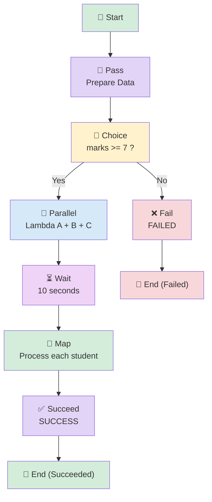

# Step Functions → All 7 States in One Pipeline

## Pass → Choice → Parallel → Wait → Map → Succeed / Fail

## 📁 Files in This Folder

| File | What It Is |
| ---- | ---------- |
| [lambda_a.py](lambda_a.py) | The handler for Lambda A — one of the three Parallel branches (function name `lambda-a`) |
| [lambda_b.py](lambda_b.py) | The handler for Lambda B — one of the three Parallel branches (function name `lambda-b`) |
| [lambda_c.py](lambda_c.py) | The handler for Lambda C — one of the three Parallel branches (function name `lambda-c`) |
| [lambda_map.py](lambda_map.py) | The Map state's Lambda — reads one student at a time from the list (function name `process-student`) |
| [state_machine.json](state_machine.json) | The complete Step Functions definition — all 7 states wired together |
| [trust_policy.json](trust_policy.json) | The IAM trust policy that lets Step Functions and Lambda assume the execution role |

This README explains the **theory** — how the pieces fit together and why. The code itself lives in the files above.

## 🎯 Goal

We want **one working pipeline** that uses **all 7 states** together:

```text
Pass → Choice → Parallel → Wait → Map → Succeed / Fail
```

This is the summary pipeline — after learning each state on its own, this shows how they work together in a real workflow.

## 📊 Pipeline Diagram

The flow as a diagram:



## 🧩 The 7 States Used Here

| State | What It Does in This Pipeline |
|-------|-------------------------------|
| **Pass** | Prepares the student data |
| **Choice** | Checks `marks >= 7` |
| **Parallel** | Runs Lambda A, B and C together |
| **Wait** | Pauses for 10 seconds |
| **Map** | Sends each student to the same Lambda |
| **Succeed** | Ends the workflow successfully |
| **Fail** | Ends the workflow as failed |

## 📦 What We Need

| Service | Resource |
| ------- | -------- |
| IAM | Step Functions execution role |
| Lambda | `lambda-a` |
| Lambda | `lambda-b` |
| Lambda | `lambda-c` |
| Lambda | `process-student` (for Map) |
| Step Functions | `all-states-combined-workflow` |
| CloudWatch | Lambda logs |

> 💡 **4 Lambdas total:** 3 for the Parallel state, 1 for the Map state.
>
> ✅ Using **different** Lambdas for Parallel and Map keeps the execution graph easy to read — you can instantly tell which Lambda belonged to which state.

## 🔐 IAM Role

We use **ONE IAM role**, and Step Functions plus all 4 Lambdas share it.

### 📍 Go to: IAM Console → Roles → Create role → **Custom trust policy**

### Role Name

```text
stepfunctions-combined-demo-role
```

### Trust Policy

The trust policy this role uses is in [trust_policy.json](trust_policy.json).

### 🧠 What This Trust Policy Means

| Service | Why It Is There |
|---------|-----------------|
| `states.amazonaws.com` | So **Step Functions** can invoke the Lambdas |
| `lambda.amazonaws.com` | So **Lambda** can run and write its logs |

> 💡 The trust policy is the **door**. The managed policies below are **what you can do after entering**.

### Attach Managed Policies

| # | Managed Policy | Its Job |
|---|----------------|---------|
| 1 | `AWSLambdaBasicExecutionRole` | Lets Lambda write logs to CloudWatch |
| 2 | `AWSLambdaRole` | Lets Step Functions invoke Lambda |

Click **Create role**.

> 💡 **Already built an earlier pipeline?** You can reuse that role instead of making a new one — just choose it from the *Use an existing role* dropdown.

---

## 🐍 Step 1: Create Lambda A

| Setting | Value |
|---------|-------|
| Function name | `lambda-a` |
| Runtime | Python 3.x (select latest available) |
| Execution role | Use an existing role → `stepfunctions-combined-demo-role` |

Copy the code from [lambda_a.py](lambda_a.py) into the Lambda A function code editor (function name `lambda-a`), replacing the default handler.

Click **Deploy**.

---

## 🐍 Step 2: Create Lambda B

| Setting | Value |
|---------|-------|
| Function name | `lambda-b` |
| Runtime | Python 3.x |
| Execution role | Use an existing role → `stepfunctions-combined-demo-role` |

Copy the code from [lambda_b.py](lambda_b.py) into the Lambda B function code editor (function name `lambda-b`), replacing the default handler.

Click **Deploy**.

---

## 🐍 Step 3: Create Lambda C

| Setting | Value |
|---------|-------|
| Function name | `lambda-c` |
| Runtime | Python 3.x |
| Execution role | Use an existing role → `stepfunctions-combined-demo-role` |

Copy the code from [lambda_c.py](lambda_c.py) into the Lambda C function code editor (function name `lambda-c`), replacing the default handler.

Click **Deploy**.

---

## 🐍 Step 4: Create the Map Lambda

This Lambda is called by the **Map** state — once per student.

| Setting | Value |
|---------|-------|
| Function name | `process-student` |
| Runtime | Python 3.x |
| Execution role | Use an existing role → `stepfunctions-combined-demo-role` |

Copy the code from [lambda_map.py](lambda_map.py) into the Map Lambda function code editor (function name `process-student`), replacing the default handler.

Click **Deploy**.

> 📌 **Notice the difference:** the Parallel Lambdas read `event["student"]` and `event["marks"]`, while the Map Lambda reads `event["name"]` and `event["marks"]`. That is because Map hands over **one item** from the list, and each item looks like `{"name": "Rahul", "marks": 8}`.

---

## 🛠️ Step 5: Create the Step Functions State Machine

| Setting | Value |
|---------|-------|
| Name | `all-states-combined-workflow` |
| Type | Standard |
| Option | **Write your workflow in code** |
| Execution role | Use an existing role → `stepfunctions-combined-demo-role` |

### 📝 Complete State Machine JSON

> ⚠️ Replace all **four** Lambda ARN placeholders first.

Copy the definition from [state_machine.json](state_machine.json) into the Step Functions **Definition** editor.

### ⚠️ Replace All Four Placeholders

```text
YOUR LAMBDA A ARN    →  arn:aws:lambda:us-east-1:YOUR_ACCOUNT_ID:function:lambda-a
YOUR LAMBDA B ARN    →  arn:aws:lambda:us-east-1:YOUR_ACCOUNT_ID:function:lambda-b
YOUR LAMBDA C ARN    →  arn:aws:lambda:us-east-1:YOUR_ACCOUNT_ID:function:lambda-c
YOUR MAP LAMBDA ARN  →  arn:aws:lambda:us-east-1:YOUR_ACCOUNT_ID:function:process-student
```

---

## 🧠 Important: Pass Does NOT Mean "Student Passed"

This is a common confusion. In Step Functions, **Pass** means:

> **Pass or prepare data and send it to the next state.**

It has **nothing to do** with the student passing or failing. It is only about moving data along.

Here we use it to create:

```json
"student_check": {
    "student": "Kshitij",
    "marks": 8
}
```

---

## 🧠 Why `ResultPath` Is Important

This is the single most important detail in this pipeline.

After the Parallel state, we get results from three branches. If that output simply **replaced** everything, we would lose:

```json
"students": [ ... ]
```

…which the **Map** state still needs!

So we use:

```json
"ResultPath": "$.parallel_results"
```

Which means:

> **Put the Parallel results inside `parallel_results`, but keep the original input.**

So the data stays roughly like this:

```json
{
  "student": "Kshitij",
  "marks": 8,
  "students": [ ... ],
  "student_check": {
    "student": "Kshitij",
    "marks": 8
  },
  "parallel_results": [ ... ]
}
```

Now Map can still read:

```text
$.students
```

✅ Without `ResultPath`, this pipeline would break at the Map state.

---

## 📥 Step 6: Execution Input

When you click **Start execution**, use this:

```json
{
  "student": "Kshitij",
  "marks": 8,
  "students": [
    {
      "name": "Rahul",
      "marks": 8
    },
    {
      "name": "Amit",
      "marks": 5
    },
    {
      "name": "Priya",
      "marks": 9
    }
  ]
}
```

### Why Do We Have These Fields?

| Field | Used By |
|-------|---------|
| `student` + `marks` | Choice (checks the marks) |
| `students[]` | Map (the list it repeats over) |

So **one input serves different states** — each state picks the part it needs.

---

## 🔄 What Happens Step by Step

### Step 1 — Pass

Input has `marks = 8`. Pass creates:

```json
"student_check": {
  "student": "Kshitij",
  "marks": 8
}
```

Then:

```text
PASS → CHOICE
```

### Step 2 — Choice

Choice checks:

```text
marks >= 7 ?
```

We have:

```text
8 >= 7  →  YES ✅
     ↓
  Parallel
```

If marks were `5`:

```text
5 >= 7  →  NO ❌
     ↓
   Fail
```

### Step 3 — Parallel

Step Functions starts all three branches:

```text
                 PARALLEL
                /    |    \
               ↓     ↓     ↓
          Lambda A Lambda B Lambda C
```

Each Lambda receives:

```json
{
  "lambda_name": "Lambda A",
  "student": "Kshitij",
  "marks": 8
}
```

> The `lambda_name` value changes to "Lambda B" / "Lambda C" for the other branches.

You should see the logs at almost the same time:

```text
Lambda A STARTED
Hitting Time (IST): 2026-09-12 19:50:10 IST
```

```text
Lambda B STARTED
Hitting Time (IST): 2026-09-12 19:50:10 IST
```

```text
Lambda C STARTED
Hitting Time (IST): 2026-09-12 19:50:11 IST
```

> 📌 The exact seconds do not have to be identical — near-identical times prove they ran together.

### Step 4 — Wait

After **all three** Lambdas finish:

```text
Parallel → WAIT → 10 seconds
```

Step Functions pauses for 10 seconds. Nothing is running during this time.

> 💡 We use **10 seconds** instead of 1 minute so testing is faster. Change `Seconds` to `60` when you want a full minute.

### Step 5 — Map

Map takes the list from `$.students`:

```text
Rahul
Amit
Priya
```

And runs the **same Lambda** for each:

```text
                 MAP
                  ↓
        ┌─────────┼─────────┐
        ↓         ↓         ↓
      Rahul      Amit      Priya
        ↓         ↓         ↓
    Same Lambda Same Lambda Same Lambda
```

Each Lambda call receives **one student**:

| Call | Event Received |
|------|----------------|
| 1st | `{"name": "Rahul", "marks": 8}` |
| 2nd | `{"name": "Amit", "marks": 5}` |
| 3rd | `{"name": "Priya", "marks": 9}` |

> 🔑 This is the key Map idea: **one Lambda, but a different event for each item.**

### Step 6 — Succeed

After every Map item is processed:

```text
Map → Succeed → SUCCESS ✅
```

---

## 🔴 Step 7: Test the Fail Path

Run **another execution** with `marks` changed to `5`:

```json
{
  "student": "Kshitij",
  "marks": 5,
  "students": [
    {
      "name": "Rahul",
      "marks": 8
    },
    {
      "name": "Amit",
      "marks": 5
    },
    {
      "name": "Priya",
      "marks": 9
    }
  ]
}
```

Now:

```text
Pass → Choice
         ↓
     5 >= 7 ?
         ↓
        NO
         ↓
       Fail
         ↓
     FAILED ❌
```

> ⚠️ The workflow **will not reach** Parallel, Wait, Map, or Succeed. It stops at Fail.
>
> ✅ That is actually useful — you can see **both paths** (success and failure) in the same state machine.

---

## ☁️ Step 8: Check CloudWatch Logs

### Parallel Lambdas

**Lambda** → `lambda-a` → **Monitor** → **View CloudWatch logs**

```text
====================================
          LAMBDA A STARTED
====================================

Received event:
{'lambda_name': 'Lambda A', 'student': 'Kshitij', 'marks': 8}

Lambda      : Lambda A
Student     : Kshitij
Marks       : 8
Hitting Time (IST): 2026-09-12 19:50:10 IST

Lambda A is processing the request...

Returning result:
{
    'lambda': 'Lambda A',
    'student': 'Kshitij',
    'status': 'SUCCESS',
    'time_ist': '2026-09-12 19:50:10 IST'
}

========== LAMBDA A FINISHED ==========
```

Do the same for `lambda-b` and `lambda-c` — the times should be very close.

### Map Lambda

**Lambda** → `process-student` → **Monitor** → **View CloudWatch logs**

You should see **three** runs:

```text
========== MAP LAMBDA STARTED ==========

Received student event: {'name': 'Rahul', 'marks': 8}

Student     : Rahul
Marks       : 8
Processing Time (IST): 2026-09-12 19:50:21 IST

Result: Rahul PASSED with 8 marks.

========== MAP LAMBDA FINISHED ==========
```

```text
========== MAP LAMBDA STARTED ==========

Received student event: {'name': 'Amit', 'marks': 5}

Student     : Amit
Marks       : 5
Processing Time (IST): 2026-09-12 19:50:21 IST

Result: Amit FAILED with 5 marks.

========== MAP LAMBDA FINISHED ==========
```

```text
========== MAP LAMBDA STARTED ==========

Received student event: {'name': 'Priya', 'marks': 9}

Student     : Priya
Marks       : 9
Processing Time (IST): 2026-09-12 19:50:21 IST

Result: Priya PASSED with 9 marks.

========== MAP LAMBDA FINISHED ==========
```

> 📌 Here the **Map Lambda** gets `name` + `marks`, while the **Parallel Lambdas** got `student` + `marks`. Same idea, different key names — always check what each state sends.

---

## 🧠 All 7 States in One Example

| State | What It Does Here | Easy Meaning |
|-------|-------------------|--------------|
| **Pass** | Prepares student data | Prepare data |
| **Choice** | Checks `marks >= 7` | Make a decision |
| **Parallel** | Runs Lambda A, B and C together | Run together |
| **Wait** | Waits 10 seconds | Pause |
| **Map** | Sends each student to the same Lambda | Repeat for each item |
| **Succeed** | Ends workflow successfully | Success + stop |
| **Fail** | Ends workflow as failed | Failed + stop |

### 🧠 Easiest Way to Remember

```text
PASS     → Prepare data
CHOICE   → Make decision
PARALLEL → Run multiple things together
WAIT     → Pause
MAP      → Repeat for every item
SUCCEED  → SUCCESS + STOP
FAIL     → FAILED + STOP
```

---

## ⭐ The Most Important Interview Concept

```text
Parallel = Multiple DIFFERENT branches
Map      = SAME processing repeated for MANY items
```

| | **Parallel** | **Map** |
|---|---|---|
| Branches | Fixed — you write them | One per list item |
| Each branch does | Can be different work | The **same** work |
| How many run | Exactly what you wrote | As many as the list has |
| Gets from the input | You choose with `Parameters` | One item from `ItemsPath` |

> Adding 100 students to the list requires **no change** to the state machine — Map just runs 100 times. ✅

---

## ⚠️ Common Mistakes

| Mistake | What Happens | Fix |
|---------|--------------|-----|
| Forgetting `ResultPath` on Parallel | Map fails — `$.students` is gone | Add `"ResultPath": "$.parallel_results"` |
| Only replacing some ARNs | Execution fails partway | Replace **all four** |
| Map Lambda reading `event["student"]` | `KeyError` — Map sends `name` | Use `event["name"]` for the Map Lambda |
| Sending `students` without the list | `$.students` not found | The input must have the `students` array |
| Thinking Pass means "student passed" | Confusion | Pass only means **prepare data** |
| Thinking Fail runs *and* Succeed runs | They are two separate paths | Only one path runs per execution |
| Expecting identical Lambda timestamps | You may see a 1-second difference | Normal — Parallel starts them together |

---

## 🧩 Full Step List (Quick Reference)

| Step | What to Do |
|------|-----------|
| 1 | IAM → Roles → Create role → **Custom trust policy** |
| 2 | Paste the trust policy, attach `AWSLambdaBasicExecutionRole` + `AWSLambdaRole` |
| 3 | Role name: `stepfunctions-combined-demo-role` |
| 4 | Lambda → Create function → `lambda-a` (Python 3.x, existing role) |
| 5 | Paste the Lambda A code → **Deploy** |
| 6 | Create `lambda-b` → paste the Lambda B code → **Deploy** |
| 7 | Create `lambda-c` → paste the Lambda C code → **Deploy** |
| 8 | Create `process-student` → paste the Map Lambda code → **Deploy** |
| 9 | Copy all **four** Lambda ARNs |
| 10 | Step Functions → State machines → Create state machine |
| 11 | Choose **Write your workflow in code** → type **Standard** |
| 12 | Name: `all-states-combined-workflow` |
| 13 | Paste the JSON → replace all four ARN placeholders |
| 14 | Execution role: existing → `stepfunctions-combined-demo-role` |
| 15 | Create the state machine |
| 16 | Start execution with the PASS input (`marks: 8`) |
| 17 | Watch: Pass → Choice → Parallel → Wait → Map → **Succeed** ✅ |
| 18 | Check CloudWatch logs for all 4 Lambdas |
| 19 | Start execution again with `marks: 5` → **Fail** ❌ |
| 20 | Compare the two executions in the console graph |

---

## 🎤 Interview Explanation

**Q: "Explain a Step Functions workflow that uses multiple state types."**

> **"I built one workflow that combines seven state types. It starts with a Pass state that prepares the student data and writes it to a student_check field using ResultPath. A Choice state then checks whether marks are greater than or equal to 7. If they are, the workflow moves to a Parallel state that invokes three Lambda functions concurrently, and I used ResultPath to store those results in parallel_results so the original input is preserved. After that, a Wait state pauses for ten seconds. Then a Map state reads a students list from ItemsPath and invokes one Lambda once per student, passing a different event to each invocation. Finally a Succeed state ends the workflow. If the marks are lower than 7, the Choice default path goes to a Fail state with an error and cause, so the execution stops as failed instead. The key detail was using ResultPath on the Parallel state — without it the students list would be replaced by the parallel results and the Map state would fail."**

---

## ⭐ One-Line Summary

```text
START
  ↓
Pass        → prepare data
  ↓
Choice      → marks >= 7 ?
  ↓ YES              ↘ NO
Parallel              Fail ❌
  ↓
Wait 10 seconds
  ↓
Map         → each student → same Lambda
  ↓
Succeed ✅
```

> **Main purpose: show all 7 Step Functions states working together in one real workflow, and prove you understand how data flows between them.**

---

## Summary

| Component | What It Does |
|-----------|--------------|
| **IAM Role** (`stepfunctions-combined-demo-role`) | One role for Step Functions + all 4 Lambdas |
| **Pass** (`PrepareStudentData`) | Writes student data into `$.student_check` |
| **Choice** (`CheckStudentMarks`) | `marks >= 7` → Parallel, otherwise → Fail |
| **Parallel** (`RunParallelLambdas`) | Runs `lambda-a`, `lambda-b`, `lambda-c` together |
| **Wait** (`Wait10Seconds`) | Pauses 10 seconds |
| **Map** (`ProcessStudents`) | Runs `process-student` once per student |
| **Succeed** (`WorkflowSucceeded`) | Ends successfully ✅ |
| **Fail** (`StudentFailed`) | Ends as FAILED ❌ |
| **CloudWatch Logs** | Shows all Lambda runs with IST timestamps |

This pipeline is the **summary of everything** — every state you learned separately now works together in one state machine.
