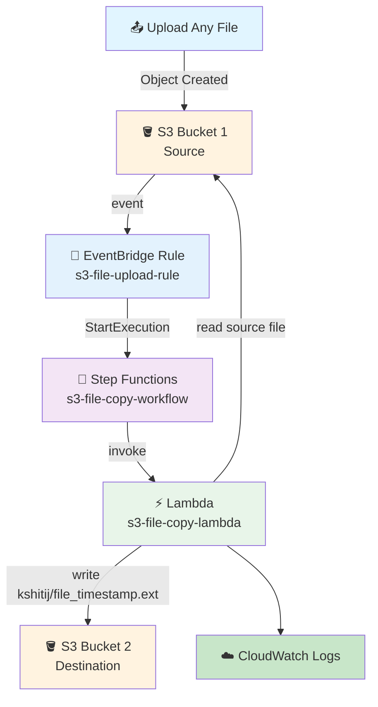

# S3 → EventBridge → Step Functions → Lambda → S3 Pipeline

## File Upload → EventBridge → Step Functions → Lambda → Copy to Second Bucket

## 📁 Files in This Folder

| File | What It Is |
| ---- | ---------- |
| [lambda_function.py](lambda_function.py) | The Lambda handler — reads the source file and copies it to the destination bucket with an IST timestamp |
| [state_machine.json](state_machine.json) | The complete Step Functions definition — a single Task that invokes Lambda |
| [trust_policy.json](trust_policy.json) | The IAM trust policy for the one shared role — trusts EventBridge, Step Functions and Lambda |

This README explains the **theory** — how the pieces fit together and why. The code itself lives in the files above.

## 🎯 Goal

Whenever **any file** is uploaded into the first S3 bucket:

1. S3 generates an event.
2. EventBridge receives the event.
3. EventBridge starts a Step Functions execution.
4. Step Functions invokes Lambda.
5. Lambda reads the source bucket name, file name and file size from the event.
6. Lambda creates (or reuses) the folder `kshitij/` in the destination bucket.
7. Lambda adds an **IST timestamp** to the original filename.
8. Lambda copies the file into that folder.
9. Lambda prints the source and destination details to CloudWatch.

The most important point: the Lambda **never hardcodes a file extension**. There is no `.csv`, `.txt`, `.json`, `.xlsx` or `.pdf` anywhere in the code — whatever you upload keeps its own extension, and a file with no extension at all is handled just as well.

## 🏢 Why This Pipeline?

A common job is "take whatever lands in one bucket and put a timestamped copy in another". Doing that by hand is slow, and doing it with a scheduled script means you are always running late.

With this pipeline the copy happens the moment the file arrives:

```text
File arrives
     ↓
Event generated automatically
     ↓
EventBridge matches the rule
     ↓
Step Functions starts
     ↓
Lambda copies the file
     ↓
Timestamped copy in Bucket 2
```

**No manual work after the upload.** ✅

## 🧠 What Each AWS Service Does

| AWS Service | Its Job |
| ----------- | ------- |
| **S3 Bucket 1** | Stores the uploaded file (source) |
| **S3 EventBridge setting** | Sends S3 events to EventBridge |
| **EventBridge** | Gets the event and checks the rule |
| **EventBridge Rule** | Decides when Step Functions should start |
| **Step Functions** | Orchestrates the workflow and invokes Lambda |
| **Lambda** | Reads the file details and copies the file |
| **S3 Bucket 2** | Stores the timestamped copy (destination) |
| **CloudWatch** | Stores the Lambda logs |
| **IAM** | Gives one shared role to EventBridge, Step Functions and Lambda |

## Architecture



---

## 🔐 IAM: One Shared Role

For this practice pipeline we use **one common IAM role** for all three services:

```text
EventBridge
Step Functions
Lambda
        ↓
S3-EventBridge-SFN-Lambda-Role
```

### Step 1: Create the Role

1. Go to **IAM** → **Roles** → **Create role**
2. Select **AWS service** → **Lambda** (we will adjust the trust policy next)
3. Attach the managed policies listed below
4. Role name: `S3-EventBridge-SFN-Lambda-Role`
5. Click **Create role**

### Step 2: Trust Policy

The role must be assumable by three different services. Replace the trust policy with the contents of [trust_policy.json](trust_policy.json):

| Service | Why it needs to assume the role |
| ------- | ------------------------------- |
| `events.amazonaws.com` | EventBridge assumes the role to start the Step Functions execution |
| `states.amazonaws.com` | Step Functions uses the role to run the workflow |
| `lambda.amazonaws.com` | Lambda uses the role to run the function |

### Step 3: Managed Policies

This pipeline uses **AWS managed policies only** — no inline policies. Attach all four:

```text
S3-EventBridge-SFN-Lambda-Role
│
├── AWSLambdaBasicExecutionRole
├── AWSLambdaRole
├── AmazonS3FullAccess
└── AWSStepFunctionsFullAccess
```

| Managed Policy | What It Gives |
| -------------- | ------------- |
| `AWSLambdaBasicExecutionRole` | Lambda → CloudWatch Logs |
| `AWSLambdaRole` | Step Functions → `lambda:InvokeFunction` |
| `AmazonS3FullAccess` | `GetObject` on the source bucket, `PutObject` on the destination |
| `AWSStepFunctionsFullAccess` | EventBridge → start the Step Functions execution |

> ⚠️ `AmazonS3FullAccess` and `AWSStepFunctionsFullAccess` are deliberately broad to keep this practice setup simple. In production you would replace them with least-privilege policies scoped to the two buckets and the one state machine.

---

## 🪣 Step 4: Create Two S3 Buckets

Create two buckets. Names must be globally unique.

| Bucket | Example Name | Purpose |
| ------ | ------------ | ------- |
| Bucket 1 | `kshitij-source-bucket` | Where you upload files |
| Bucket 2 | `kshitij-destination-bucket` | Where the timestamped copies land |

### Bucket 1 — Source

```text
kshitij-source-bucket
│
├── customer_data.csv
├── employee_data.txt
├── report.xlsx
└── invoice.pdf
```

### Bucket 2 — Destination

Initially empty. After the first file:

```text
kshitij-destination-bucket
│
└── kshitij/
      │
      └── customer_data_2026-09-14_19-35-42.csv
```

After a few more:

```text
kshitij-destination-bucket
│
└── kshitij/
      │
      ├── customer_data_2026-09-14_19-35-42.csv
      ├── employee_data_2026-09-14_20-10-21.txt
      ├── report_2026-09-14_20-25-33.xlsx
      └── invoice_2026-09-14_20-40-11.pdf
```

---

## 📁 Step 5: Enable EventBridge for the Source Bucket

S3 must be told to send its events to EventBridge.

1. Go to **S3** → `kshitij-source-bucket` → **Properties**
2. Find **Event Notifications** → **Amazon EventBridge**
3. Click **Edit**
4. Turn ON: **Send notifications to Amazon EventBridge for all events in this bucket**
5. Click **Save changes**

---

## ⚡ Step 6: Create the Lambda Function

1. Go to **Lambda** → **Functions** → **Create function**
2. Select **Author from scratch**

| Setting | Value |
| ------- | ----- |
| Function name | `s3-file-copy-lambda` |
| Runtime | Python 3.x (select the latest available) |
| Permissions | **Use an existing role** → `S3-EventBridge-SFN-Lambda-Role` |

3. Click **Create function**

## 🐍 Step 7: Add the Lambda Code

Copy the code from [lambda_function.py](lambda_function.py) into the Lambda code editor, replacing the default handler.

Click **Deploy**.

Two configuration values sit at the top of the file:

```python
DESTINATION_BUCKET = "kshitij-destination-bucket"
DESTINATION_FOLDER = "kshitij"
```

Change `DESTINATION_BUCKET` to your real destination bucket name.

### ⭐ No File Extension Is Hardcoded

This is the heart of the Lambda:

```python
file_name, file_extension = os.path.splitext(original_file_name)

new_file_name = f"{file_name}_{timestamp}{file_extension}"
```

`os.path.splitext()` splits whatever name arrives into two parts, and the timestamp is inserted **between them**. The extension is never named — it is simply carried across.

| Uploaded | `file_name` | `file_extension` | Copied as |
| -------- | ----------- | ---------------- | --------- |
| `customer_data.csv` | `customer_data` | `.csv` | `customer_data_2026-09-14_19-35-42.csv` |
| `employee_data.txt` | `employee_data` | `.txt` | `employee_data_2026-09-14_19-35-42.txt` |
| `sales_report.xlsx` | `sales_report` | `.xlsx` | `sales_report_2026-09-14_19-35-42.xlsx` |
| `myfile.pdf` | `myfile` | `.pdf` | `myfile_2026-09-14_19-35-42.pdf` |
| `README` | `README` | *(empty)* | `README_2026-09-14_19-35-42` |

Note the last row: a file with **no extension** produces an empty `file_extension`, and the result is still correct. Nothing to change, nothing to add. ✅

### 🇮🇳 The IST Timestamp

```python
ist = ZoneInfo("Asia/Kolkata")

timestamp = datetime.now(ist).strftime("%Y-%m-%d_%H-%M-%S")
```

Because the timezone is passed explicitly, the timestamp is **India Standard Time** no matter what timezone the Lambda runtime defaults to. The `strftime` pattern uses `-` instead of `:` in the time part, because colons in S3 object keys are legal but awkward to handle in URLs and some tools.

### 📊 File Size

The size comes from the EventBridge event — it is not looked up separately:

```python
file_size = detail["object"].get("size", 0)
file_size_kb = file_size / 1024
```

### 📁 Creating the `kshitij/` Folder

S3 has no real folders — `kshitij/file.csv` is just an object key that happens to contain a `/`, and the console draws it as a folder. To make the folder appear even before the first object lands in it, the Lambda writes a zero-byte marker object:

```python
s3.put_object(Bucket=DESTINATION_BUCKET, Key="kshitij/", Body=b"")
```

---

## 🔔 Step 8: Create the EventBridge Rule

1. Go to **EventBridge** → **Rules** → **Create rule**

| Setting | Value |
| ------- | ----- |
| Rule name | `s3-file-upload-rule` |
| Event bus | **default** |
| Rule type | **Rule with an event pattern** |
| Event source | **AWS events** |
| Service | **Amazon S3** |
| Event type | **Object Created** |

### Event Pattern

```json
{
  "source": ["aws.s3"],
  "detail-type": ["Object Created"],
  "detail": {
    "bucket": {
      "name": ["YOUR SOURCE BUCKET"]
    }
  }
}
```

Replace `YOUR SOURCE BUCKET` with your real source bucket name — the example used in this guide is `kshitij-source-bucket`.

### 🧠 What the Pattern Means

| Part | Means |
| ---- | ----- |
| `"source": ["aws.s3"]` | The event must come from S3 |
| `"detail-type": ["Object Created"]` | Only object creation events |
| `"detail": { "bucket": { "name": [...] } }` | Only events from our source bucket |

Note that the bucket name sits **inside an array**. EventBridge requires array values in patterns — a bare string will not match.

---

## 🎯 Step 9: Add the Step Functions Target

Under target selection:

| Setting | Value |
| ------- | ----- |
| Target type | **AWS service** |
| Select target | **Step Functions state machine** |
| State machine | `s3-file-copy-workflow` |
| Execution role | `S3-EventBridge-SFN-Lambda-Role` |

Click **Next** → review → **Create rule**.

EventBridge needs permission to start the execution, which is why the shared role carries `events.amazonaws.com` in its trust policy.

---

## 🔄 Step 10: Create the Step Functions State Machine

1. Go to **Step Functions** → **State machines** → **Create state machine**
2. Choose **Write workflow in code**

| Setting | Value |
| ------- | ----- |
| Name | `s3-file-copy-workflow` |
| Type | **Standard** |
| Permissions | **Use an existing role** → `S3-EventBridge-SFN-Lambda-Role` |

Copy the definition from [state_machine.json](state_machine.json) into the **Definition** editor, and replace `YOUR LAMBDA FUNCTION ARN` with your real Lambda ARN.

### 🧠 What the State Machine Does

It is deliberately tiny — one Task, no branches, no error handling:

```text
Start
  ↓
Copy File  (invoke Lambda)
  ↓
End
```

The `Payload.$: "$"` line is what makes it work:

```json
"Parameters": {
  "FunctionName": "YOUR LAMBDA FUNCTION ARN",
  "Payload.$": "$"
}
```

`"$"` means **the entire input**, so the complete EventBridge event is handed straight to Lambda:

```text
EventBridge
     ↓  whole event
Step Functions
     ↓  whole event
Lambda
```

Nothing has to be rebuilt or reshaped along the way — no picking out the bucket name or the object key in the state machine. Lambda receives exactly what EventBridge produced.

`"OutputPath": "$.Payload"` then unwraps Lambda's response, so the execution output is the Lambda return value rather than the `lambda:invoke` envelope around it.

---

## ⚡ Step 11: What Lambda Receives

The event that arrives at the handler:

```json
{
  "source": "aws.s3",
  "detail-type": "Object Created",
  "detail": {
    "bucket": {
      "name": "kshitij-source-bucket"
    },
    "object": {
      "key": "customer_data.csv",
      "size": 26042
    }
  }
}
```

And the three lines that pull it apart:

```python
source_bucket = detail["bucket"]["name"]
source_key    = urllib.parse.unquote_plus(detail["object"]["key"])
file_size     = detail["object"].get("size", 0)
```

`unquote_plus` matters because S3 URL-encodes object keys — a key containing a space arrives as `customer%20data.csv`, and without decoding you would copy a file whose name is literally `customer%20data.csv`.

---

## 🧪 Step 12: Test the Pipeline

Upload any file to `kshitij-source-bucket`. Then upload another of a different type. Then a third with no extension at all. **You never change the Lambda code.**

```text
test.csv     →  kshitij/test_2026-09-14_19-35-42.csv
test.txt     →  kshitij/test_2026-09-14_20-02-11.txt
report.xlsx  →  kshitij/report_2026-09-14_20-25-33.xlsx
photo.jpg    →  kshitij/photo_2026-09-14_20-40-11.jpg
notes        →  kshitij/notes_2026-09-14_20-55-04
```

### 🔄 What Happens After Upload?

```text
invoice.pdf arrives in Bucket 1
        ↓
S3 creates: Object Created
        ↓
EventBridge gets the event
        ↓
Rule checks: S3? YES — Object Created? YES — our bucket? YES
        ↓
EventBridge starts the Step Functions execution
        ↓
Step Functions passes the whole event to Lambda
        ↓
Lambda reads bucket + key + size
        ↓
Lambda writes the kshitij/ folder marker
        ↓
Lambda builds invoice_2026-09-14_19-35-42.pdf
        ↓
Lambda copies the object to Bucket 2
        ↓
CloudWatch stores the Lambda logs
```

---

## ☁️ Step 13: Check the Logs

Go to **Lambda** → `s3-file-copy-lambda` → **Monitor** → **View CloudWatch logs**

```text
==================================================
S3 FILE COPY STARTED
==================================================

Source Bucket : kshitij-source-bucket
File Name     : invoice.pdf
File Size     : 15.07 KB

Folder        : kshitij/

Destination Bucket : kshitij-destination-bucket
File Name          : invoice_2026-09-14_19-35-42.pdf
File Size          : 15.07 KB

==================================================
S3 FILE COPY COMPLETED
==================================================
```

You can also open **Step Functions** → `s3-file-copy-workflow` → **Executions** to see each run and its input and output.

---

## 🆚 How This Differs From the Glue Pipeline

The earlier pipeline in this repo (`11) step functions to glue to lambda`) routes through Glue:

```text
Step Functions → Glue → Catch → Lambda
```

This one does the data movement itself:

```text
S3 → EventBridge → Step Functions → Lambda → S3
```

| | Glue pipeline | This pipeline |
| --- | --- | --- |
| Data work done by | Glue (Spark) | Lambda (`copy_object`) |
| Trigger | manual / status input | S3 upload, automatically |
| Input to the workflow | `{"status": "SUCCESS"}` | the real S3 event |
| Good for | transforming data at scale | moving a file as-is |

**There is no Glue here, and no SUCCESS/FAILED status input.** The workflow is not told whether to run — the arrival of a file is the trigger. And `copy_object` is a server-side copy, so the file never passes through the Lambda's memory; the byte size has no bearing on whether the copy succeeds.

---

## ⭐ One-Line Summary

```text
A file lands in Bucket 1
     ↓
EventBridge matches the Object Created rule
     ↓
Step Functions starts and passes the whole event to Lambda
     ↓
Lambda reads the bucket, key and size
     ↓
Lambda writes kshitij/ and builds name_TIMESTAMP.ext
     ↓
The file is copied server-side into Bucket 2
     ↓
CloudWatch records both source and destination
```

> **Main purpose: any file uploaded to the source bucket is automatically copied to the destination bucket under `kshitij/`, with an IST timestamp inserted before its extension — whatever that extension happens to be.**

---

## 🧩 Full Step List (Quick Reference)

| Step | What to Do |
| ---- | ---------- |
| 1 | Create IAM role `S3-EventBridge-SFN-Lambda-Role` |
| 2 | Replace its trust policy with `trust_policy.json` (events + states + lambda) |
| 3 | Attach `AWSLambdaBasicExecutionRole`, `AWSLambdaRole`, `AmazonS3FullAccess`, `AWSStepFunctionsFullAccess` |
| 4 | Create `kshitij-source-bucket` and `kshitij-destination-bucket` |
| 5 | Source bucket → Properties → Event Notifications → Amazon EventBridge → ON |
| 6 | Lambda → Create function → `s3-file-copy-lambda`, use the shared role |
| 7 | Paste the code from `lambda_function.py` → **Deploy** |
| 8 | Set `DESTINATION_BUCKET` to your real destination bucket |
| 9 | EventBridge → Rules → Create rule → `s3-file-upload-rule` |
| 10 | Pattern: `aws.s3` + Object Created + your source bucket |
| 11 | Target: Step Functions state machine `s3-file-copy-workflow` |
| 12 | Step Functions → Create state machine → Standard → use the shared role |
| 13 | Paste `state_machine.json`, replace `YOUR LAMBDA FUNCTION ARN` |
| 14 | Upload any file to the source bucket |
| 15 | Check the destination bucket for `kshitij/name_TIMESTAMP.ext` |
| 16 | Check the Lambda logs in CloudWatch |
| 17 | Upload a different file type → same flow, no code change ✅ |

---

## 🎤 Interview Explanation

**Q: "Explain your S3 to EventBridge to Step Functions to Lambda to S3 pipeline."**

> **"I have two S3 buckets. EventBridge notifications are enabled on the source bucket, and an EventBridge rule matches Object Created events from that specific bucket. The rule's target is a Step Functions state machine, which assumes a single shared IAM role that trusts EventBridge, Step Functions and Lambda. The state machine is a single Lambda Task — it passes the entire EventBridge event through with `Payload.$: "$"`, so Lambda receives the real S3 event rather than a rebuilt one. The Lambda reads the bucket name, object key and size, writes a `kshitij/` folder marker into the destination bucket, and copies the object server-side with an IST timestamp inserted before the extension. It uses `os.path.splitext` to split the name, so no file extension is hardcoded — `.csv`, `.txt`, `.xlsx` or no extension at all all work unchanged. Both the source and destination details are logged to CloudWatch."**

---

## Summary

| Component | What It Does |
| --------- | ------------ |
| **S3 Bucket 1** | Stores the uploaded file, sends events to EventBridge |
| **EventBridge Rule** (`s3-file-upload-rule`) | Filters: aws.s3 + Object Created + the source bucket |
| **Step Functions** (`s3-file-copy-workflow`) | One Lambda Task, forwards the whole event |
| **Lambda** (`s3-file-copy-lambda`) | Reads the event, creates `kshitij/`, timestamps the name, copies the file |
| **S3 Bucket 2** | Receives `kshitij/name_TIMESTAMP.ext` |
| **IAM Role** | One shared role: trust policy + four managed policies |
| **CloudWatch Logs** | Shows the source and destination details |

This pipeline shows **event-driven file movement**: upload in, event out, orchestrated by Step Functions, executed by Lambda, with the file type left entirely to the caller.

---

## 📚 References

- [Starting state machine executions in Step Functions](https://docs.aws.amazon.com/step-functions/latest/dg/statemachine-starting.html)
- [Working with AWS managed policies in the execution role](https://docs.aws.amazon.com/lambda/latest/dg/permissions-managed-policies.html)
- [AWSLambdaRole — AWS managed policy](https://docs.aws.amazon.com/aws-managed-policy/latest/reference/AWSLambdaRole.html)
- [AWS managed policies for Amazon S3](https://docs.aws.amazon.com/AmazonS3/latest/userguide/security-iam-awsmanpol.html)
