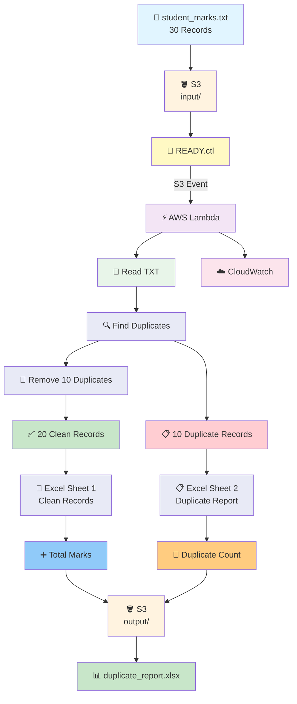

# 📄 Duplicate Removal & Excel Reporting Pipeline

`1 TXT (30 records) → .ctl → Lambda → Excel`

Lambda reads a pipe-delimited TXT file from the S3 `input/` folder after receiving the `.ctl` control file.

The Lambda function:

- Reads 30 records
- Identifies and removes 10 duplicate records
- Keeps 20 clean records
- Creates an Excel report
- Puts the 20 clean records in **Sheet 1**
- Puts the 10 duplicate records in **Sheet 2**
- Adds the total duplicate count in Sheet 2
- Adds Excel filters
- Adds a **Total Marks** row at the bottom of Sheet 1
- Formats the Total Marks row with a **blue background and bold text**
- Saves the final Excel file into the S3 `output/` folder

---

## 📁 Files in This Folder

| File | What It Is |
| ---- | ---------- |
| [01) README.md](01%29%20README.md) | Complete explanation of the duplicate removal and Excel reporting pipeline |
| [lambda_function.py](lambda_function.py) | Lambda function that removes duplicates and creates the Excel report |
| [trust_policy.json](trust_policy.json) | IAM trust policy that allows Lambda to assume its execution role |
| [input/student_marks.txt](input/student_marks.txt) | Input TXT file containing 30 records |
| [input/READY.ctl](input/READY.ctl) | Control file that triggers Lambda after the input file is ready |

---

# 🎯 Goal

The goal is to take one TXT file containing 30 records, remove duplicate records, and create a structured Excel report.

Input:

```text
30 records
```

After duplicate removal:

```text
20 clean records
```

Duplicates:

```text
10 duplicate records
```

Therefore:

```text
30 total records
      ↓
10 duplicates removed
      ↓
20 clean records
```

The final Excel file contains two sheets:

```text
duplicate_report.xlsx
│
├── Sheet 1 → Clean Records
│              20 records
│              + Total Marks
│
└── Sheet 2 → Duplicate Report
               10 duplicates
               + Duplicate Count
```

---

# 🏗️ Architecture



---

# 📌 AWS Resources We Need

| Resource | Purpose |
| -------- | ------- |
| 🪣 S3 Bucket | Stores the input TXT, control file and output Excel |
| ⚡ Lambda | Removes duplicates and creates the Excel report |
| 🔔 S3 Event Notification | Triggers Lambda when `.ctl` arrives |
| 🔐 IAM Role | Gives Lambda S3 and CloudWatch permissions |
| ☁️ CloudWatch | Stores Lambda execution logs |

---

# 🪣 1. Create S3 Bucket

1. Open **AWS Management Console**
2. Search for **S3**
3. Open **Amazon S3**
4. Click **Create bucket**
5. Enter a globally unique bucket name

Example:

```text
duplicate-excel-report-demo
```

6. Select your required AWS Region
7. Keep the remaining settings as default for this practice project
8. Click **Create bucket**

---

# 📂 2. Create Input and Output Folders

Inside the bucket create:

```text
duplicate-excel-report-demo
│
├── input/
│
└── output/
```

The final structure will become:

```text
duplicate-excel-report-demo
│
├── input/
│   ├── student_marks.txt
│   └── READY.ctl
│
└── output/
    └── duplicate_report.xlsx
```

---

# 📄 3. Input TXT File

The input file is:

```text
student_marks.txt
```

It contains exactly:

```text
30 records
```

The records consist of:

```text
20 unique records
+
10 duplicate records
```

Therefore:

```text
20 + 10 = 30 records
```

### How the sample file is built

```text
STU001 … STU020   → the 20 unique records (rows 1–20)
STU001 … STU010   → the 10 duplicates   (rows 21–30)
```

Each of `STU001`–`STU010` appears **twice**, which is why every row in the Sheet 2 duplicate table shows a `Duplicate Count` of `2`.

The 20 clean records' marks sum to **1716**, which is the Total Marks figure you should see at the bottom of Sheet 1.

---

# 📝 4. TXT File Format

The file uses the pipe character:

```text
|
```

as the delimiter.

Example:

```text
Student_ID|Student_Name|Department|Marks
STU001|Aarav Sharma|Data Engineering|88
STU002|Priya Mehta|Analytics|92
STU003|Rahul Verma|Cloud Computing|76
STU004|Sneha Iyer|Data Science|75
STU005|Arjun Rao|DevOps|91
```

The first line is the header.

The remaining lines are data records.

---

# 📂 5. Upload the Input File

Upload:

```text
student_marks.txt
```

to:

```text
input/
```

The structure should be:

```text
duplicate-excel-report-demo
│
├── input/
│   └── student_marks.txt
│
└── output/
```

---

# ⚠️ 6. Do NOT Upload READY.ctl Yet

First upload:

```text
student_marks.txt
```

Then verify that the file exists in:

```text
input/
```

Only after that upload:

```text
READY.ctl
```

The order is:

```text
1. student_marks.txt
2. READY.ctl       ← Upload LAST
```

---

# 📄 7. What Is READY.ctl?

`READY.ctl` is the **control file**.

It tells Lambda:

> "The input file is ready. Start processing."

The contents can simply be:

```text
READY
```

The important part is that the file has the:

```text
.ctl
```

extension.

---

# 💡 Why Use a Control File?

Instead of triggering Lambda when the TXT file arrives:

```text
student_marks.txt
       ↓
Lambda
```

we use:

```text
student_marks.txt
       ↓
Wait
       ↓
READY.ctl
       ↓
Lambda
```

This gives the upstream process control over when the batch is ready.

The `.ctl` file acts as a **processing signal**.

---

# ⚡ 8. Create Lambda Function

1. Open **AWS Management Console**
2. Search for **Lambda**
3. Open **AWS Lambda**
4. Click **Functions**
5. Click **Create function**
6. Select **Author from scratch**

Use:

| Setting | Value |
| ------- | ----- |
| Function name | `duplicate-removal-excel` |
| Runtime | Python 3.x |
| Architecture | `x86_64` |
| Permissions | Create a new role with basic Lambda permissions |

Click:

**Create function**

---

# 🔐 9. IAM Permissions

Attach these two AWS managed policies to the Lambda execution role.

### `AmazonS3FullAccess`

Allows Lambda to:

```text
Read student_marks.txt
Read READY.ctl
Write duplicate_report.xlsx
```

### `AWSLambdaBasicExecutionRole`

Allows Lambda to write logs to:

```text
Amazon CloudWatch Logs
```

The execution role should therefore have:

```text
Lambda Execution Role
│
├── AmazonS3FullAccess
└── AWSLambdaBasicExecutionRole
```

> ⚠️ These broad permissions are suitable for this practice project. For production, use a least-privilege S3 policy restricted to the required bucket and prefixes.
>
> `head_object` is authorised by `s3:GetObject`, not by `s3:ListBucket`.

---

# 🔑 10. Lambda Trust Policy

The trust policy is available in:

[trust_policy.json](trust_policy.json)

It allows the Lambda service to assume the IAM execution role.

```json
{
  "Version": "2012-10-17",
  "Statement": [
    {
      "Effect": "Allow",
      "Principal": {
        "Service": [
          "lambda.amazonaws.com"
        ]
      },
      "Action": "sts:AssumeRole"
    }
  ]
}
```

Remember:

```text
Trust Policy
     ↓
Who can assume the role?

Managed Policies
     ↓
What can the role do?
```

---

# 📦 11. Install `openpyxl`

The Lambda uses:

```text
openpyxl
```

to create and format the Excel workbook.

`openpyxl` must be included in the Lambda deployment package or provided through a Lambda Layer.

Make sure Lambda has:

```text
openpyxl
```

available before testing.

> 📎 Layer build instructions are in **[01)txt to excel](../01)txt%20to%20excel/01)%20README.md)**. `openpyxl` is pure Python, so a plain `pip install -t python openpyxl` works — Docker is not required.

---

# 💻 12. Lambda Code

Open the Lambda function and replace the default code with the code from:

[lambda_function.py](lambda_function.py)

The Lambda performs:

```text
1. Receive READY.ctl event
        ↓
2. Find student_marks.txt
        ↓
3. Read 30 records
        ↓
4. Identify duplicate rows
        ↓
5. Keep 20 unique records
        ↓
6. Store 10 duplicate records
        ↓
7. Create Excel workbook
        ↓
8. Create Sheet 1
        ↓
9. Create Sheet 2
        ↓
10. Add filters
        ↓
11. Add Total Marks row
        ↓
12. Format Total Marks row
        ↓
13. Upload Excel to S3
```

---

# 🔗 13. Connect S3 → Lambda

Go to:

```text
S3
 ↓
Your Bucket
 ↓
Properties
 ↓
Event notifications
 ↓
Create event notification
```

Create:

| Setting | Value |
| ------- | ----- |
| Event notification name | `duplicate-control-trigger` |
| Prefix | `input/` |
| Suffix | `.ctl` |
| Event type | All object create events |
| Destination | Lambda function |
| Lambda | `duplicate-removal-excel` |

---

# 🔍 14. Why Trigger Only on `.ctl`?

We don't want the TXT file to trigger Lambda.

Therefore:

```text
input/student_marks.txt
        ↓
Lambda ❌
```

But:

```text
input/READY.ctl
        ↓
Lambda ✅
```

This gives us a clean batch-processing flow.

---

# 🧪 15. Test the Pipeline

First upload:

```text
input/student_marks.txt
```

Then upload:

```text
input/READY.ctl
```

The `.ctl` file triggers Lambda.

---

# 🔄 16. What Happens After READY.ctl?

```text
📄 student_marks.txt
        ↓
30 records
        ↓
📄 READY.ctl
        ↓
🔔 S3 Event
        ↓
⚡ Lambda
        ↓
🔍 Find duplicates
        ↓
10 duplicates
        ↓
🧹 Remove duplicates
        ↓
20 clean records
        ↓
📊 Create Excel
        ↓
┌──────────────────────────────┐
│ Sheet 1                      │
│ 20 Clean Records             │
│ + Total Marks                │
├──────────────────────────────┤
│ Sheet 2                      │
│ 10 Duplicate Records         │
│ + Duplicate Count            │
└──────────────────────────────┘
        ↓
🪣 S3 output/
        ↓
📗 duplicate_report.xlsx
```

---

# 📗 17. Excel Sheet 1 — Clean Records

Sheet 1 will contain:

```text
20 clean records
```

The columns are:

| Student_ID | Student_Name | Department | Marks |
| ---------- | ------------ | ---------- | ----: |
| STU001 | Aarav Sharma | Data Engineering | 88 |
| STU002 | Priya Mehta | Analytics | 92 |
| STU003 | Rahul Verma | Cloud Computing | 76 |
| … | … | … | … |
| STU020 | Simran Kaur | DevOps | 93 |

An Excel filter is added to the header row.

The filter range is:

```text
A1:D21
```

That is **the header row plus the 20 data rows only** — it deliberately stops at row 21 and does not include the Total Marks row.

This matters: if the filter range covered the totals row, filtering or sorting the sheet would treat the total as just another data record.

The header row is also frozen:

```text
freeze_panes = A2
```

So the header stays visible while you scroll the records.

---

# ➕ 18. Total Marks Row

At the bottom of Sheet 1, Lambda adds:

```text
Total Marks
```

The total is calculated from the **20 clean records**.

For the sample input:

```text
Total Marks = 1716
```

The row is formatted with:

```text
Blue background  (5B9BD5)
+
Bold text
```

Example — note the worksheet layout:

```text
------------------------------------------------
Student_ID | Student_Name | Department | Marks
------------------------------------------------
STU001     | Aarav Sharma | ...        | 88
STU002     | Priya Mehta  | ...        | 92
...
STU020     | Simran Kaur  | ...        | 93
------------------------------------------------
           |              | Total Marks| 1716
------------------------------------------------
```

### Where the label and the value go

The label sits in the column **immediately left of** the Marks column, and the total sits **in** the Marks column.

For the sample header, `Marks` is column `D`, so:

```text
C22 = "Total Marks"
D22 = 1716
```

Both cells are filled blue and bolded, and the rest of the row is filled blue too.

> ⚠️ **This was a real bug in the first draft of this pipeline.** The original code wrote the label and the value to the *same* column:
>
> ```python
> clean_sheet.cell(row=total_row, column=max(1, marks_column or 1), value="Total Marks")
> clean_sheet.cell(row=total_row, column=marks_column or clean_sheet.max_column, value=total_marks)
> ```
>
> With `marks_column = 4`, both expressions evaluate to `4`. The second write overwrites the first, so the finished sheet showed a bare `1716` in `D22` with **no label at all** — directly contradicting this section of the README.
>
> The fixed code picks a different column for the label, and skips the row entirely if the header has no `Marks` column.

The values are read with `float(...)`, so text marks are parsed correctly, and the total is written back as an integer when it is a whole number — you get `1716`, not `1716.0`.

---

# 📋 19. Excel Sheet 2 — Duplicate Report

Sheet 2 contains the duplicate records that were removed from Sheet 1.

At the top:

```text
Duplicate Report
```

Then:

```text
Total Duplicate Records: 10
```

Below that, starting at row 4, is the duplicate table:

| Student_ID | Student_Name | Department | Marks | Duplicate Count |
| ---------- | ------------ | ---------- | ----: | --------------: |
| STU001 | Aarav Sharma | Data Engineering | 88 | 2 |
| STU002 | Priya Mehta | Analytics | 92 | 2 |
| STU003 | Rahul Verma | Cloud Computing | 76 | 2 |
| … | … | … | … | … |
| STU010 | Meera Joshi | DevOps | 90 | 2 |

In this sample, each duplicate record appears twice in the original input, so the duplicate count for each duplicated record is:

```text
2
```

The report also shows:

```text
Total Duplicate Records = 10
```

The duplicate table gets its own filter:

```text
A4:E14
```

and the header row is frozen:

```text
freeze_panes = A5
```

Freezing at `A5` keeps the title, the duplicate count **and** the table header visible while scrolling.

---

# 🔢 20. How Duplicate Detection Works

Lambda compares the complete record.

For example:

```text
STU001|Aarav Sharma|Data Engineering|88
```

appears twice.

Lambda keeps the first occurrence:

```text
STU001|Aarav Sharma|Data Engineering|88
```

and identifies the second occurrence as a duplicate.

Therefore:

```text
Original Records = 30

Duplicates = 10

Clean Records = 20
```

---

# 🛡️ 21. Duplicate Logic

The Lambda uses the complete row as the duplicate key.

Conceptually:

```python
row_tuple = tuple(row)
```

If the same complete row appears again:

```text
Already Seen?
     ↓
   YES
     ↓
Duplicate
```

Otherwise:

```text
Already Seen?
     ↓
    NO
     ↓
Clean Record
```

This means a record is considered duplicate only when all columns match.

Two students with the same `Student_ID` but a different `Marks` value would be treated as **two different records**, because the whole row differs.

---

# 📊 22. Expected Output

The final S3 structure becomes:

```text
duplicate-excel-report-demo
│
├── input/
│   ├── student_marks.txt
│   └── READY.ctl
│
└── output/
    └── duplicate_report.xlsx
```

---

# ☁️ 23. Check CloudWatch Logs

After Lambda executes:

1. Open **AWS Lambda**
2. Open:

```text
duplicate-removal-excel
```

3. Go to **Monitor**
4. Click **View CloudWatch logs**

Or:

```text
CloudWatch
 ↓
Logs
 ↓
Log groups
 ↓
/aws/lambda/duplicate-removal-excel
```

You should see messages similar to:

```text
Control file received: s3://duplicate-excel-report-demo/input/READY.ctl
Checking input file: s3://duplicate-excel-report-demo/input/student_marks.txt
Input TXT file downloaded successfully.
Total records read: 30
Unique records: 20
Duplicate records: 10
Total marks of clean records: 1716.0
Excel file created successfully: s3://duplicate-excel-report-demo/output/duplicate_report.xlsx
```

---

# 📥 24. Verify the Output

Go to:

```text
S3
 ↓
duplicate-excel-report-demo
 ↓
output/
```

You should see:

```text
duplicate_report.xlsx
```

Download and open it.

The workbook should contain:

```text
Sheet 1 → Clean Records
Sheet 2 → Duplicate Report
```

---

# 📊 25. Final Excel Structure

```text
duplicate_report.xlsx
│
├── 📗 Clean Records
│   │
│   ├── 20 clean records
│   ├── Excel filter A1:D21
│   ├── Frozen header row
│   └── Total Marks row (row 22)
│       ├── Blue background
│       └── Bold text
│
└── 📋 Duplicate Report
    │
    ├── Total Duplicate Records: 10
    ├── 10 duplicate records
    ├── Duplicate Count column
    ├── Excel filter A4:E14
    └── Frozen header row
```

---

# ⚠️ 26. Avoid Recursive Trigger

Lambda reads:

```text
input/
```

and writes:

```text
output/
```

The S3 event notification listens only for:

```text
input/*.ctl
```

Therefore:

```text
output/duplicate_report.xlsx
```

does not trigger Lambda again.

---

# 📌 27. Important Points

### 1️⃣ One input TXT

```text
student_marks.txt
```

### 2️⃣ 30 total records

```text
30 records
```

### 3️⃣ 10 duplicate records

```text
10 duplicates
```

### 4️⃣ 20 clean records

```text
30 - 10 = 20
```

### 5️⃣ `.ctl` triggers Lambda

Only:

```text
READY.ctl
```

triggers Lambda.

### 6️⃣ Sheet 1

Contains:

```text
20 clean records
+
Total Marks
```

### 7️⃣ Sheet 2

Contains:

```text
10 duplicate records
+
Duplicate Count
+
Total Duplicate Records
```

### 8️⃣ Excel filters

Filters are added to both tables, and both stop at the last **data** row so the totals row is never filtered in.

### 9️⃣ Total Marks

The Total Marks row is:

```text
Blue background
+
Bold text
```

### 🔟 Output

```text
output/duplicate_report.xlsx
```

### 1️⃣1️⃣ The input filename is hard-coded

```python
INPUT_FILE = "input/student_marks.txt"
```

So the pipeline always reads that exact key. The `.ctl` file is only a **trigger** — its name and contents are never used to decide which TXT file to read.

That means this function processes one specific file, not "whatever arrived last". To process a dated file you would parse the batch ID out of the control-file name:

```python
batch = os.path.basename(control_file_key).replace(".ctl", "")
input_key = f"input/student_marks_{batch}.txt"
```

### 1️⃣2️⃣ The Total Marks row is excluded from the filter on purpose

The filter range is set **before** the Total Marks row is written.

```text
A1:D21   ← header + 20 data rows   ✅
A1:D22   ← would include the totals row  ❌
```

### 1️⃣3️⃣ Only "file missing" is treated as missing

The `try/except` around `head_object` catches `ClientError` and only treats `404` / `NoSuchKey` / `NotFound` as a missing file.

Anything else — `AccessDenied`, throttling, KMS failure — is **re-raised**, so the invocation is correctly marked as failed.

A bare `except Exception:` would have reported an `AccessDenied` as *"Input TXT file is missing"*, sending you to look for a data problem that does not exist.

### 1️⃣4️⃣ Marks are stored as text

`csv.reader` returns strings, so the `Marks` values in Sheet 1 and Sheet 2 are written as **text**, not numbers. Excel will show the green "number stored as text" warning on that column.

The Total Marks calculation is unaffected — it parses with `float()` — but note the consequence:

```text
Sorting or filtering the Marks column sorts it as TEXT
  "75" < "88" < "9"   (not 9 < 75 < 88)
```

If you need real numeric marks, convert before writing:

```python
def convert(value):
    try:
        return int(value)
    except ValueError:
        return value

clean_sheet.append([convert(cell) for cell in row])
```

### 1️⃣5️⃣ Blank lines become empty records

`csv.reader` turns a blank line into `[]`, and an empty row is a perfectly valid "unique record" as far as the dedup logic is concerned.

If your real input can contain trailing blank lines, filter them first:

```python
data_rows = [row for row in rows[1:] if row and any(cell.strip() for cell in row)]
```

---

# 🧩 Complete Pipeline

```text
                    INPUT

             📄 student_marks.txt
                    │
                    │ 30 records
                    ▼
              🪣 S3 input/
                    │
                    │
              📄 READY.ctl
                    │
                    ▼
              🔔 S3 Event
                    │
                    ▼
              ⚡ AWS Lambda
                    │
                    ▼
             🔍 Duplicate Check
                    │
              ┌─────┴─────┐
              ▼           ▼
        20 Clean       10 Duplicate
         Records          Records
              │           │
              ▼           ▼
       📗 Sheet 1     📋 Sheet 2
              │           │
              ▼           ▼
       Total Marks    Duplicate Count
              │           │
              └─────┬─────┘
                    ▼
             📊 Excel Report
                    │
                    ▼
             🪣 S3 output/
                    │
                    ▼
        duplicate_report.xlsx
```

---

# 📊 Summary

| Component | What It Does |
| --------- | ------------ |
| **student_marks.txt** | Contains 30 input records |
| **READY.ctl** | Signals Lambda to start processing |
| **S3 `input/`** | Stores input files |
| **S3 Event Notification** | Triggers Lambda for `.ctl` |
| **AWS Lambda** | Removes duplicates and creates the report |
| **Sheet 1** | Contains 20 clean records |
| **Sheet 2** | Contains 10 duplicate records |
| **Duplicate Count** | Shows the duplicate count |
| **Excel Filters** | Allows filtering of report data |
| **Total Marks** | Shows total marks for the 20 clean records |
| **Blue + Bold Row** | Highlights Total Marks |
| **S3 `output/`** | Stores the final Excel report |
| **CloudWatch** | Stores Lambda execution logs |
| **AmazonS3FullAccess** | Allows Lambda S3 access |
| **AWSLambdaBasicExecutionRole** | Allows Lambda to write CloudWatch logs |

---

# 🎯 Final Flow

```text
1 TXT
   ↓
30 Records
   ↓
READY.ctl
   ↓
Lambda
   ↓
Remove 10 Duplicates
   ↓
20 Clean Records
   ↓
Excel
   ├── Sheet 1 → 20 Clean Records + Total Marks
   │
   └── Sheet 2 → 10 Duplicates + Duplicate Count
   ↓
output/duplicate_report.xlsx
```

**This is the complete Duplicate Removal & Excel Reporting Pipeline.**

---

## One important Lambda setting

Because the handler file is named:

```text
lambda_function.py
```

and the function is:

```python
lambda_handler
```

the Lambda **Handler** should be:

```text
lambda_function.lambda_handler
```
