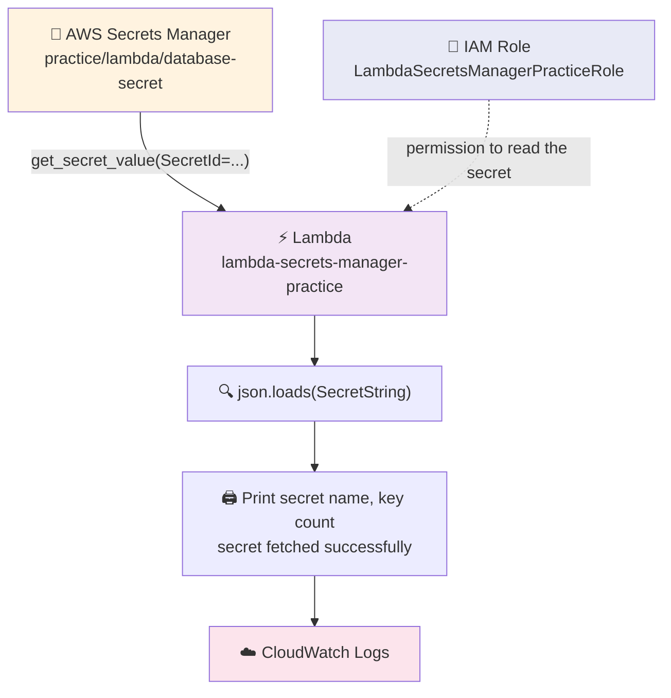

# 17) Lambda to Secrets Manager (Fetch Secret)

`Lambda → Secrets Manager → CloudWatch Logs`

A Lambda function gets a **secret** (a username and a password) from **AWS Secrets Manager**. It prints the secret **name** and the **number of keys** — never the secret values.

---

## 📁 Files in This Folder

| File | What It Is |
| ---- | ---------- |
| [01) README.md](01%29%20README.md) | Complete explanation of the Lambda → Secrets Manager pipeline |
| [lambda_function.py](lambda_function.py) | The Lambda handler that fetches the secret and prints the summary |
| [trust_policy.json](trust_policy.json) | The IAM trust policy that lets the Lambda service assume the execution role |

This README explains the **theory** — how the pieces fit together and why. The code itself lives in the files above.

---

## 🎯 Goal

A secret is stored once in **AWS Secrets Manager**. It holds two keys: `username` and `password`.

A Lambda function runs and does four things:

- Gets the secret from Secrets Manager
- Prints the **secret name**
- Prints the **number of keys** inside the secret
- Prints **"Secret fetched successfully"**

All of this output goes to **Amazon CloudWatch Logs**.

The point of this pipeline is the **pattern**: the password never sits inside the code. The code asks Secrets Manager for it at run time, using the permissions of its IAM role.

> 📌 There is **no trigger** in this pipeline. Nothing starts the Lambda automatically — you start it yourself with the **Test** button in the Lambda console.

---

## 🗺️ Architecture



Two things travel in this flow:

- **Permission** — the IAM role gives the Lambda the right to read the secret
- **Data** — the secret value travels back to the Lambda inside the response

The secret value is used in memory only. It is **not** printed, so it never lands in CloudWatch.

---

## 🔑 Step 1 — The Secret in Secrets Manager

**AWS Console → Secrets Manager → Store a new secret**

| Setting | Value |
| ------- | ----- |
| Secret type | **Other type of secret** |
| Secret name | **`practice/lambda/database-secret`** |
| Key 1 | `username` → `admin` |
| Key 2 | `password` → `MyPassword@123` |

Because we chose **Other type of secret**, we type the keys ourselves. Inside Secrets Manager, the secret is stored as a JSON string like this:

```json
{
  "username": "admin",
  "password": "MyPassword@123"
}
```

That is exactly why the code runs `json.loads(response["SecretString"])` — the secret comes back as one text string, and `json.loads` turns it into a Python dictionary. Only then can we count its keys with `len(secret.keys())`.

> ⚠️ In this practice pipeline we choose **not** to use automatic rotation. The secret stays as we typed it, so the printed key count always stays `2`.

> 📌 The name uses slashes — `practice/lambda/database-secret` — so it looks like a folder path. That is only a naming style. Secrets Manager does not create any folders; the whole name is just one secret name.

> ⚠️ The Lambda code ships with a **placeholder** — `secret_name = "YOUR SECRET MANAGER NAME"`. Replace it with the real name you typed here, which for this practice is `practice/lambda/database-secret`. The name in the code and the name in the console must match **exactly**, or you get `ResourceNotFoundException`.

---

## 🔐 Step 2 — IAM Role and Trust Policy

| Field | Value |
| ----- | ----- |
| Role name | **`LambdaSecretsManagerPracticeRole`** |
| Used by | `lambda-secrets-manager-practice` only |
| Trusted entity | AWS Service → **Lambda** (`lambda.amazonaws.com`) |

Attach these **two** AWS-managed policies:

| Managed policy | Purpose |
| -------------- | ------- |
| `AWSLambdaBasicExecutionRole` | Lets the Lambda write logs to CloudWatch |
| `SecretsManagerReadWrite` | Lets the Lambda read the secret from Secrets Manager |

```
LambdaSecretsManagerPracticeRole
│
├── AWSLambdaBasicExecutionRole
└── SecretsManagerReadWrite
```

The trust policy in [trust_policy.json](trust_policy.json) allows **only `lambda.amazonaws.com`** to assume the role. Secrets Manager is **not** in the trust policy, and that is correct — Secrets Manager never assumes this role. The Lambda *calls* Secrets Manager, the same way it calls any other AWS service.

> ⚠️ `SecretsManagerReadWrite` is **broader than we need**. It can create, change and delete secrets in the whole account, not just read this one. That is fine for practice. Production would use a small custom policy that allows only `secretsmanager:GetSecretValue` on that one secret ARN instead — same API call, tighter permission.

---

## 🧠 Step 3 — The Lambda Function

**`lambda-secrets-manager-practice`** · Runtime **Python 3.x** · Handler `lambda_function.lambda_handler`

| Step | What Happens |
| ---- | ------------ |
| 1 | Creates one Secrets Manager client **outside** the handler, so it is built once and reused |
| 2 | Stores the secret name in a variable — the placeholder `YOUR SECRET MANAGER NAME`, which you replace with your own secret name |
| 3 | Calls `get_secret_value(SecretId=secret_name)` inside a `try` |
| 4 | Reads `response["SecretString"]` — the one text string that holds the secret |
| 5 | Runs `json.loads` on it to get a Python dictionary |
| 6 | Counts the keys with `len(secret.keys())` |
| 7 | Prints the secret name, the key count and the success line |
| 8 | Returns `statusCode` **200** with the message **Secret fetched successfully** |
| 9 | If anything fails, the `except` block prints the error and returns `statusCode` **500** |

> 📌 The client is created **outside** `lambda_handler`. Lambda reuses the same container for a while, so building the client once saves time on every later run.

> 📌 The handler ignores the `event` and `context` arguments completely. That is why any test event works — even an empty one.

---

## 🖨️ Step 4 — Expected CloudWatch Output

After you click **Test**, open **CloudWatch → Log groups → /aws/lambda/lambda-secrets-manager-practice** and you should see:

```text
===================================
Secret Manager Pipeline
===================================
Secret Name        : practice/lambda/database-secret
Number of Keys     : 2
Secret fetched successfully
===================================
```

And the Lambda response in the console:

```json
{
  "statusCode": 200,
  "message": "Secret fetched successfully"
}
```

> ⚠️ You will **not** see `admin` or `MyPassword@123` anywhere in the logs. That is on purpose — see the section below.

---

## 🧪 Step 5 — Testing

In the Lambda console, open the **Test** tab, create a new test event, and use an empty JSON body:

```json
{}
```

| Test | What You Do | Expected Result |
| ---- | ----------- | --------------- |
| 1 | Run the function with `{}` | `statusCode 200`, key count `2` |
| 2 | Add a third key to the secret, then run again | Key count becomes `3` — the count comes from the secret, not from the code |
| 3 | Change the secret name in the code to a wrong name, then run | `statusCode 500` and `Failed to fetch secret` |
| 4 | Detach `SecretsManagerReadWrite` from the role, then run | `statusCode 500` with `AccessDeniedException` |

Test 2 is the proof that the code reads the secret **live**: change the secret in the console, run the function again, and the printed number changes with it. No redeploy needed.

---

## 🚀 Deployment Steps

1. Go to **Secrets Manager → Store a new secret**
2. Choose **Other type of secret**, add the keys `username` and `password`, and give the secret a name — for example `practice/lambda/database-secret`
3. Create the IAM role `LambdaSecretsManagerPracticeRole` — trusted entity **Lambda**
4. Attach `AWSLambdaBasicExecutionRole` and `SecretsManagerReadWrite`
5. Check that the trust policy matches [trust_policy.json](trust_policy.json)
6. Create the Lambda `lambda-secrets-manager-practice`, runtime **Python 3.x**, using that role
7. Paste the code from [lambda_function.py](lambda_function.py), replace `YOUR SECRET MANAGER NAME` with your secret name, and click **Deploy**
8. Create a test event with `{}` and click **Test**
9. Open the CloudWatch log group and check the four output lines

> ⚠️ Keep the **Lambda and the secret in the same Region**. If the secret is in `us-east-1` and the Lambda runs in `ap-south-1`, the call fails with `ResourceNotFoundException` even when the name is typed perfectly.

---

## 🔒 Why We Never Print the Secret Value

The code deliberately prints only two safe things:

- The **secret name** — that is just a label, not a secret
- The **number of keys** — just a count, like `2`

It never prints `secret["username"]` or `secret["password"]`.

That is the important habit in this pipeline. **CloudWatch logs are not private.** Anyone in the account who can read the log group can read every line, and logs are kept for as long as the retention setting says. A password printed once is a password leaked forever — you cannot take it back. If a real password ever lands in a log, the fix is to rotate it in Secrets Manager, not just to delete the log line.

If you ever need to prove the value really arrived, print something harmless instead — for example `print(f"Keys found: {list(secret.keys())}")`, which shows the key **names** but no values.

---

## 🚨 Common Errors

| Error | Why it happens | How to fix it |
| ----- | -------------- | ------------- |
| `ResourceNotFoundException` | The secret name in the code does not match the real name, or the two are in different Regions | Compare the name character by character, and check the Region shown in the console |
| `AccessDeniedException` | The role is missing `SecretsManagerReadWrite` | Attach the `SecretsManagerReadWrite` managed policy to the execution role |
| `json.JSONDecodeError` | The secret was stored as a **plaintext** secret or a plain string, so it is not JSON | Store it as a key/value secret, or skip `json.loads` if you really stored plain text |
| Key count is `1` instead of `2` | Both values were typed into one key, or a key was removed | Open the secret and check that there are exactly two keys |
| Key count is `3` instead of `2` | An extra key was added to the secret | Remove the extra key, or update the README's expected output |
| Nothing in CloudWatch | The role lacks `AWSLambdaBasicExecutionRole`, or you are looking at the wrong log group | Attach the policy, and open `/aws/lambda/lambda-secrets-manager-practice` |

---

## ⚠️ Things to Know

1. **The Lambda response is not a secret.** The returned JSON holds only a status code and a fixed message — safe to show anywhere.
2. **Secrets Manager costs money per secret.** A stored secret has a small monthly charge, so delete the secret when you finish practising.
3. **The container is reused.** Because the client is created outside the handler, a warm container skips the setup work on the next run.
4. **There is no caching in this code.** Every run calls `get_secret_value` again and picks up the newest version of the secret immediately.
5. **This is the pattern to reuse.** Database passwords, API keys and third-party tokens all belong in Secrets Manager with a role that can only read them — exactly like this pipeline.

---

## 🎤 How to Explain This in an Interview

> **"This pipeline shows how a Lambda reads a secret from AWS Secrets Manager without ever hard-coding it. My secret holds two keys, `username` and `password`, under the name `practice/lambda/database-secret`."**
>
> **"The Lambda creates a Secrets Manager client, calls `get_secret_value`, and then runs `json.loads` on `SecretString`, because Secrets Manager returns the secret as one JSON text string. Only the secret name and the number of keys are printed — never the values, because CloudWatch logs are readable by anyone with log access, and a printed password cannot be un-printed."**
>
> **"Permissions come from the execution role, with the Lambda service as the trusted entity. For practice I attached the managed policy `SecretsManagerReadWrite`, but for production I would swap it for a custom policy that allows only `secretsmanager:GetSecretValue` on that one secret ARN — least privilege, and no code change, because the API call stays the same."**

This pipeline shows the safe way to handle credentials in a serverless setup: **the password lives in Secrets Manager, the permission lives in the IAM role, and the code only ever reads — it never prints.**
