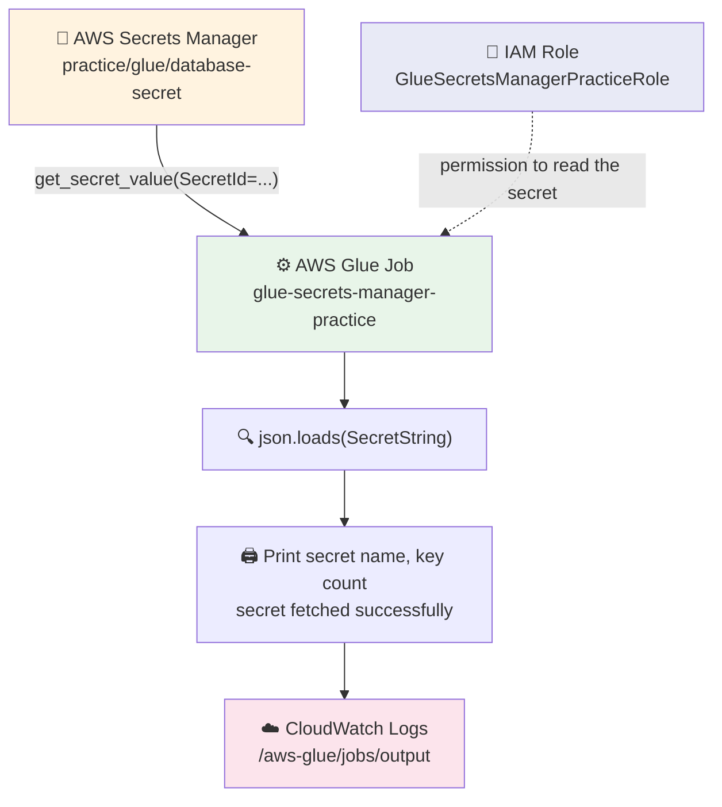

# 18) Glue to Secrets Manager (Fetch Secret)

`Glue Job → Secrets Manager → CloudWatch Logs`

An **AWS Glue job** gets a **secret** (a username and a password) from **AWS Secrets Manager**. It prints the secret **name** and the **number of keys** — never the secret values.

---

## 📁 Files in This Folder

| File | What It Is |
| ---- | ---------- |
| [01) README.md](01%29%20README.md) | Complete explanation of the Glue → Secrets Manager pipeline |
| [glue_job.py](glue_job.py) | The Glue job script that fetches the secret and prints the summary |
| [trust_policy.json](trust_policy.json) | The IAM trust policy that lets the Glue service assume the job role |

This README explains the **theory** — how the pieces fit together and why. The code itself lives in the files above.

This is the **Glue version of pipeline 17** (which does the same thing with Lambda). Same secret, same two keys, same three printed lines — only the compute service changes.

---

## 🎯 Goal

A secret is stored once in **AWS Secrets Manager**. It holds two keys: `username` and `password`.

A **Glue job** runs and does four things:

- Gets the secret from Secrets Manager
- Prints the **secret name**
- Prints the **number of keys** inside the secret
- Prints **"Secret fetched successfully"**

All of this output goes to **Amazon CloudWatch Logs**, in the log group `/aws-glue/jobs/output`.

The point of this pipeline is the **pattern**: the password never sits inside the script. The script asks Secrets Manager for it at run time, using the permissions of the Glue job's IAM role.

> 📌 There is **no trigger** in this pipeline. Nothing starts the job automatically — you start it yourself with the **Run** button in the Glue console.

---

## 🗺️ Architecture



Two things travel in this flow:

- **Permission** — the IAM role gives the Glue job the right to read the secret
- **Data** — the secret value travels back to the job inside the response

The secret value is used in memory only. It is **not** printed, so it never lands in CloudWatch.

---

## 🔄 Glue vs Lambda — What Changed

| Piece | Pipeline 17 (Lambda) | Pipeline 18 (Glue) |
| ----- | -------------------- | ------------------ |
| Compute service | `lambda-secrets-manager-practice` | `glue-secrets-manager-practice` |
| Trust policy service | `lambda.amazonaws.com` | `glue.amazonaws.com` |
| Code file | `lambda_function.py` with `lambda_handler` | `glue_job.py` — a plain script, no handler |
| How it reports failure | Returns `statusCode` 500 | **Raises** an exception — nothing to return |
| How you start it | The **Test** button | The **Run** button |
| Log group | `/aws/lambda/<function-name>` | `/aws-glue/jobs/output` |
| Start-up time | Milliseconds | A few minutes — Glue starts a Spark cluster |

The middle four rows are the whole difference. The secret, the two keys and the printed lines are identical.

---

## 🔑 Step 1 — The Secret in Secrets Manager

**AWS Console → Secrets Manager → Store a new secret**

| Setting | Value |
| ------- | ----- |
| Secret type | **Other type of secret** |
| Secret name | **`practice/glue/database-secret`** |
| Key 1 | `username` → `admin` |
| Key 2 | `password` → `MyPassword@123` |

Because we chose **Other type of secret**, we type the keys ourselves. Inside Secrets Manager, the secret is stored as a JSON string like this:

```json
{
  "username": "admin",
  "password": "MyPassword@123"
}
```

That is exactly why the script runs `json.loads(response["SecretString"])` — the secret comes back as one text string, and `json.loads` turns it into a Python dictionary. Only then can we count its keys with `len(secret.keys())`.

> ⚠️ The Glue script ships with a **placeholder** — `secret_name = "YOUR SECRET MANAGER NAME"`. Replace it with the real name you typed here, which for this practice is `practice/glue/database-secret`. The name in the script and the name in the console must match **exactly**, or you get `ResourceNotFoundException`.

> 📌 You can **reuse the secret you already made for pipeline 17** instead of creating a new one. Just put that name in the script — the code does not care which secret it reads, only that the role may read it.

> 📌 The name uses slashes — `practice/glue/database-secret` — so it looks like a folder path. That is only a naming style. Secrets Manager does not create any folders; the whole name is just one secret name.

---

## 🔐 Step 2 — IAM Role and Trust Policy

| Field | Value |
| ----- | ----- |
| Role name | **`GlueSecretsManagerPracticeRole`** |
| Used by | `glue-secrets-manager-practice` only |
| Trusted entity | AWS Service → **Glue** (`glue.amazonaws.com`) |

Attach these **two** AWS-managed policies:

| Managed policy | Purpose |
| -------------- | ------- |
| `AWSGlueConsoleFullAccess` | Lets the Glue job run, and read its own logs |
| `SecretsManagerReadWrite` | Lets the Glue job read the secret from Secrets Manager |

```
GlueSecretsManagerPracticeRole
│
├── AWSGlueConsoleFullAccess
└── SecretsManagerReadWrite
```

The trust policy in [trust_policy.json](trust_policy.json) allows **only `glue.amazonaws.com`** to assume the role. Secrets Manager is **not** in the trust policy, and that is correct — Secrets Manager never assumes this role. The Glue job *calls* Secrets Manager, the same way it calls any other AWS service.

> ⚠️ **Logs need one more permission.** `AWSGlueConsoleFullAccess` only allows `logs:GetLogEvents` — that is **reading** logs, not **writing** them. A Glue job writes its run output using its role's permissions, and the AWS documentation lists `logs:CreateLogGroup`, `logs:CreateLogStream` and `logs:PutLogEvents` on `/aws-glue/*` as required. With only the two policies above, the job can finish but the log group may stay empty.
>
> **How to fix it — pick one:**
> - Attach the managed policy **`AWSGlueServiceRole`** as well. It brings those three log actions with it
> - Or add those three actions to the role yourself, on `arn:aws:logs:*:*:log-group:/aws-glue/*:*`

> ⚠️ Both policies are **broader than we need**. `AWSGlueConsoleFullAccess` allows almost every Glue action, and `SecretsManagerReadWrite` can create, change and delete secrets in the whole account, not just read this one. That is fine for practice. Production would use a small custom policy that allows only `secretsmanager:GetSecretValue` on that one secret ARN instead — same API call, tighter permission.

> 📌 **Pick the role name with care.** `AWSGlueConsoleFullAccess` includes `iam:PassRole`, but only for roles whose name starts with `AWSGlueServiceRole`. If the account user you create the job with has *only* that policy, a role named `GlueSecretsManagerPracticeRole` cannot be attached to the job. Either name the role `AWSGlueServiceRole-SecretsManagerPractice`, or give yourself `iam:PassRole` on the role you use.

---

## 🧠 Step 3 — The Glue Job

**`glue-secrets-manager-practice`** · Type **Spark** · Glue version **4.0** (Python 3) · Worker type **G.1X**

| Step | What Happens |
| ---- | ------------ |
| 1 | Imports `boto3` and `json`, then creates one Secrets Manager client at the top of the script |
| 2 | Stores the secret name in a variable — the placeholder `YOUR SECRET MANAGER NAME`, which you replace with your own secret name |
| 3 | Prints the start banner, then calls `get_secret_value(SecretId=secret_name)` inside a `try` |
| 4 | Reads `response["SecretString"]` — the one text string that holds the secret |
| 5 | Runs `json.loads` on it to get a Python dictionary |
| 6 | Counts the keys with `len(secret.keys())` |
| 7 | Prints the secret name, the key count and the success line |
| 8 | Prints the closing banner — the job run finishes as **SUCCEEDED** |
| 9 | If anything fails, the `except` block prints the error and **re-raises** it, so Glue marks the run as **FAILED** |

> 📌 There is **no handler and no return value**. A Glue script is just a script that runs from the first line to the last. That is why the failure path uses `raise` instead of returning `statusCode 500` like the Lambda version — a raised exception is the only way a Glue script can say "I failed".

> 📌 The secret is fetched **once**, at the start, on the Glue driver. There is no Spark data here, so nothing is distributed to executors — this pipeline is about permissions, not about data volume.

---

## 🖨️ Step 4 — Expected CloudWatch Output

After you click **Run**, open the job's **Run details** and then **CloudWatch logs** — or go straight to **CloudWatch → Log groups → /aws-glue/jobs/output** and pick the stream whose name starts with the job run ID.

```text
===================================
Glue Job Started
===================================
-----------------------------------
Secret Manager Pipeline
-----------------------------------
Secret Name        : practice/glue/database-secret
Number of Keys     : 2
Secret fetched successfully
-----------------------------------
===================================
Glue Job Completed Successfully
===================================
```

And on the job's **Runs** tab:

| Column | Value |
| ------ | ----- |
| Status | **Succeeded** |
| Error message | *(empty)* |

> ⚠️ You will **not** see `admin` or `MyPassword@123` anywhere in the logs. That is on purpose — see the section below.

> 📌 Nothing is printed if the run stops before the first `print`. Open `/aws-glue/jobs/error` instead — Spark and permission errors land there.

---

## 🧪 Step 5 — Testing

| Test | What You Do | Expected Result |
| ---- | ----------- | --------------- |
| 1 | Run the job with the correct secret name | Status **Succeeded**, key count `2` |
| 2 | Add a third key to the secret, then run again | Key count becomes `3` — the count comes from the secret, not from the script |
| 3 | Change the secret name in the script to a wrong name, then run | Status **Failed**, `ResourceNotFoundException` in the error log |
| 4 | Detach `SecretsManagerReadWrite` from the role, then run | Status **Failed**, `AccessDeniedException` in the error log |
| 5 | Run once with only the two managed policies, then check the log group | Status may be **Succeeded** but the output log is empty — this is the logs-permission gap above |
| 6 | Attach `AWSGlueServiceRole` and run again | Status **Succeeded** and the six banner lines appear in `/aws-glue/jobs/output` |

Test 2 is the proof that the script reads the secret **live**: change the secret in the console, run the job again, and the printed number changes with it. No code change needed.

---

## 🚀 Deployment Steps

1. Go to **Secrets Manager → Store a new secret**
2. Choose **Other type of secret**, add the keys `username` and `password`, and give the secret a name — for example `practice/glue/database-secret`
3. Create the IAM role `GlueSecretsManagerPracticeRole` — trusted entity **AWS service → Glue**
4. Attach `AWSGlueConsoleFullAccess` and `SecretsManagerReadWrite`, plus `AWSGlueServiceRole` if you want the run logs
5. Check that the trust policy matches [trust_policy.json](trust_policy.json)
6. Go to **AWS Glue → ETL jobs → Script editor** (or **Author from scratch**), name the job `glue-secrets-manager-practice`, and choose **Spark**, Glue version **4.0**
7. Select the role from step 3 — the console creates the S3 script location and temp folder for you
8. Paste the script from [glue_job.py](glue_job.py), replace `YOUR SECRET MANAGER NAME` with your secret name, and click **Save**
9. Click **Run**, wait for the Spark cluster to start, then open the **Runs** tab and the CloudWatch logs

> ⚠️ Keep the **job and the secret in the same Region**. A Glue job cannot read a secret from another Region with this code, so a secret in `us-east-1` and a job in `ap-south-1` fails with `ResourceNotFoundException` even when the name is typed perfectly.

> ⚠️ Do **not** press **Run** twice while a run is still starting. Glue charges for every run, and a second run only proves the same thing twice.

---

## 🔒 Why We Never Print the Secret Value

The script deliberately prints only two safe things:

- The **secret name** — that is just a label, not a secret
- The **number of keys** — just a count, like `2`

It never prints `secret["username"]` or `secret["password"]`.

That is the important habit in this pipeline. **CloudWatch logs are not private.** Anyone in the account who can read the log group can read every line, and logs are kept for as long as the retention setting says. A password printed once is a password leaked forever — you cannot take it back. If a real password ever lands in a log, the fix is to rotate it in Secrets Manager, not just to delete the log line.

If you ever need to prove the value really arrived, print something harmless instead — for example `print(f"Keys found: {list(secret.keys())}")`, which shows the key **names** but no values.

---

## 🚨 Common Errors

| Error | Why it happens | How to fix it |
| ----- | -------------- | ------------ |
| `ResourceNotFoundException` | The secret name in the script does not match the real name, or the two are in different Regions | Compare the name character by character, and check the Region shown in the console |
| `AccessDeniedException` | The role is missing `SecretsManagerReadWrite` | Attach the `SecretsManagerReadWrite` managed policy to the job role |
| Job **Succeeded** but the log group is empty | `AWSGlueConsoleFullAccess` allows reading logs (`logs:GetLogEvents`) but not writing them | Attach `AWSGlueServiceRole`, or add `logs:CreateLogGroup`, `logs:CreateLogStream` and `logs:PutLogEvents` on `/aws-glue/*` |
| `json.JSONDecodeError` | The secret was stored as **plaintext** or a plain string, so it is not JSON | Store it as a key/value secret, or skip `json.loads` if you really stored plain text |
| `Role ... is not authorized to be passed` when saving or running the job | The user's policy can pass only roles named `AWSGlueServiceRole*` | Rename the role to start with `AWSGlueServiceRole`, or give your user `iam:PassRole` on this role |
| Key count is `1` instead of `2` | Both values were typed into one key, or a key was removed | Open the secret and check that there are exactly two keys |
| Key count is `3` instead of `2` | An extra key was added to the secret | Remove the extra key, or update the README's expected output |
| Job fails in a few seconds with a Spark or bootstrap error | Not a permission problem — the job could not start | Read `/aws-glue/jobs/error`; usually the role, the Glue version or the temp folder |

---

## ⚠️ Things to Know

1. **Glue has no return value.** Unlike the Lambda version, the script cannot hand back a `statusCode`. It either finishes normally (Succeeded) or raises (Failed).
2. **A Glue job costs more than a Lambda call.** The Spark cluster takes a few minutes to start, and Glue is billed by run time with a minimum charge per run. Delete the job and the secret when you finish practising.
3. **The script still needs somewhere to live.** Every Glue job needs an S3 script location and a temp folder — the console creates both when you author the job, so you do not have to make buckets yourself.
4. **One API call, one region.** `boto3.client("secretsmanager")` uses the Region the job runs in. The secret must be there too.
5. **The pattern is the same everywhere.** Database passwords, API keys and third-party tokens all belong in Secrets Manager with a role that can only read them — whether the caller is a Lambda, a Glue job, an EC2 instance or a container.

---

## 🎤 How to Explain This in an Interview

> **"This pipeline shows how a Glue job reads a secret from AWS Secrets Manager without ever hard-coding it. My secret holds two keys, `username` and `password`, under the name `practice/glue/database-secret`."**
>
> **"The Glue script creates a Secrets Manager client, calls `get_secret_value`, and then runs `json.loads` on `SecretString`, because Secrets Manager returns the secret as one JSON text string. Only the secret name and the number of keys are printed — never the values, because CloudWatch logs are readable by anyone with log access, and a printed password cannot be un-printed."**
>
> **"The difference from the Lambda version is that a Glue script has no handler and no return value, so the failure path raises an exception instead of returning a status code — in Glue, a raised exception is what marks the run as FAILED."**
>
> **"Permissions come from the job role, with the Glue service as the trusted entity. For practice I attached `AWSGlueConsoleFullAccess` and `SecretsManagerReadWrite`, and I added `AWSGlueServiceRole` because the console policy only allows reading CloudWatch logs, not writing them — the job writes its own run log with the role's permissions. In production I would replace `SecretsManagerReadWrite` with a custom policy that allows only `secretsmanager:GetSecretValue` on that one secret ARN."**

This pipeline shows the safe way to handle credentials from a Glue job: **the password lives in Secrets Manager, the permission lives in the IAM role, and the script only ever reads — it never prints.**
