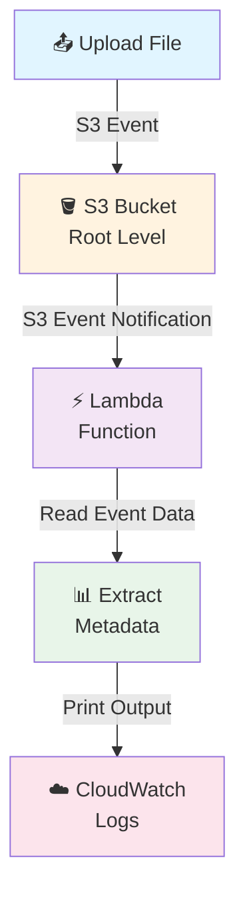
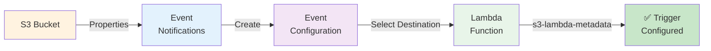
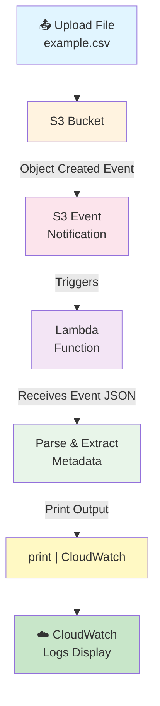

# S3 → Lambda Event-Driven Pipeline

## 🎯 Goal

As soon as a file is uploaded into the root level of an S3 bucket, an S3 Event Notification should be generated.

This event will trigger an AWS Lambda function.

The Lambda function will read the event information and print the file metadata, such as:
- Bucket name
- File name
- File size
- Event type
- Event time

The output will be available in Amazon CloudWatch Logs.

## Architecture



---

## 📌 Required AWS Resources

### 🪣 S3 Bucket Configuration

#### Step 1: Create S3 Bucket
1. Open AWS Management Console
2. Search for **S3**
3. Open **Amazon S3**
4. Click **Create bucket**
5. Enter a globally unique bucket name
   - Example: `s3-lambda-metadata-demo`
6. Select your required AWS Region
7. Keep the remaining settings as default for this practice project
8. Click **Create bucket**

✅ The S3 bucket is now ready.

#### Step 2: Understand Root-Level File Upload

For this project, we want the Lambda function to trigger when a file is uploaded directly into the root level of the bucket.

**Example Structure:**
```
s3-lambda-metadata-demo
│
├── example.csv        ✅ Root-level (will trigger Lambda)
├── example.json       ✅ Root-level (will trigger Lambda)
├── test.txt           ✅ Root-level (will trigger Lambda)
└── sample.xlsx        ✅ Root-level (will trigger Lambda)
```

**Important Notes:**
- `example.csv` is a root-level object
- We are **NOT** using:
  - `input/example.csv` (inside folder)
  - `files/example.csv` (inside folder)
  
For this simple project, we will leave the **Prefix** configuration blank.

### ⚡ S3 Event Notification Configuration

#### Step 3: Open Event Notification
1. Open **Amazon S3**
2. Click your bucket: `s3-lambda-metadata-demo`
3. Go to the **Properties** tab
4. Scroll down to **Event notifications**
5. Click **Create event notification**

#### Step 4: Configure Event Notification

| Setting | Value | Notes |
|---------|-------|-------|
| Event notification name | `s3-lambda-file-upload` | Descriptive name for the event |
| Prefix | Leave blank | For files at bucket root |
| Suffix | Leave blank | Allows all file types |

**Supported file types (examples):**
- `.csv`
- `.txt`
- `.json`
- `.xlsx`
- `.parquet`

#### Step 5: Select Event Type

Under **Event types**, select the appropriate Object Created event:
- **All object create events**
  - This means the event can be generated when an object is created through supported S3 upload operations

---

## 🐍 Lambda Function Creation

### Step 6: Create Lambda Function
1. Open AWS Management Console
2. Search for **Lambda**
3. Open **AWS Lambda**
4. Click **Functions**
5. Click **Create function**
6. Select: **Author from scratch**

### Step 7: Configure Lambda

Configure the following:

| Setting | Value |
|---------|-------|
| Function name | `s3-lambda-metadata` |
| Runtime | Python 3.x (select latest available) |
| Permissions | Use default settings |

Click **Create function**. The Lambda function will now be created.

---

## 💻 Lambda Code

### Step 8: Write Lambda Function

Open the Lambda function and go to the **Code** section.

Replace the existing code with:

```python
import json
from urllib.parse import unquote_plus


def lambda_handler(event, context):

    print("===== S3 FILE UPLOAD EVENT =====")

    print("Full Event:")
    print(json.dumps(event, indent=2))

    for record in event.get("Records", []):

        bucket_name = record["s3"]["bucket"]["name"]

        raw_key = record["s3"]["object"]["key"]
        file_name = unquote_plus(raw_key)

        file_size = record["s3"]["object"].get("size")

        event_name = record.get("eventName")

        event_time = record.get("eventTime")

        print("----- File Metadata -----")

        print(f"Bucket Name : {bucket_name}")
        print(f"File Name   : {file_name}")
        print(f"File Size   : {file_size} bytes")
        print(f"Event Name  : {event_name}")
        print(f"Event Time  : {event_time}")

    return {
        "statusCode": 200,
        "body": json.dumps("S3 event processed successfully")
    }
```

Click **Deploy**.

### 🔍 What This Lambda Code Does

When S3 invokes Lambda, S3 sends an event JSON payload to Lambda.

The Lambda receives it through: `event`

The event contains information about the S3 object.

#### Bucket Name
```python
bucket_name = record["s3"]["bucket"]["name"]
```
- **Example:** `s3-lambda-metadata-demo`

#### File Name
```python
raw_key = record["s3"]["object"]["key"]
file_name = unquote_plus(raw_key)
```
- The S3 object key is extracted and decoded
- **Example:** `example.csv`

#### File Size
```python
file_size = record["s3"]["object"].get("size")
```
- **Example:** `12345 bytes`

#### Event Name
```python
event_name = record.get("eventName")
```
- The event type extracted
- **Example:** `ObjectCreated:Put`

#### Event Time
```python
event_time = record.get("eventTime")
```
- The event timestamp
- **Example:** `2026-09-01T12:30:15.000Z`

---

## 🔗 Configure S3 → Lambda Trigger

### Step 9: Add Lambda as S3 Event Destination



**Configuration Steps:**

1. Go back to your S3 bucket
2. Navigate to: **S3** → **Bucket** → **Properties** → **Event notifications**
3. Click **Create event notification**
4. Configure:
   - **Event name:** `s3-lambda-file-upload`
   - **Event types:** All object create events
   - **Destination:** Lambda function
   - **Lambda function:** `s3-lambda-metadata`
   - **Prefix:** blank
   - **Suffix:** blank
5. Click **Save changes**

✅ Now the S3 bucket is configured to send the Object Created event to Lambda.

---

## 🧪 Test the Pipeline

### Step 10: Upload a File

1. Go to: **S3** → **s3-lambda-metadata-demo** → **Objects**
2. Click **Upload**
3. Click **Add files**
4. Select a test file (example: `example.csv`)
5. Make sure the file is uploaded directly into the bucket root
6. Click **Upload**

### 🔄 What Happens After Upload?



**Key Point:** You don't need to manually execute the Lambda function. The S3 upload automatically triggers Lambda.

---

## ☁️ CloudWatch Logs Verification

### Step 11: Open CloudWatch

After uploading the file:

1. Open **AWS Lambda**
2. Open: `s3-lambda-metadata`
3. Go to the **Monitor** tab
4. Click **View CloudWatch logs**

**Alternative Path:**
1. Open **CloudWatch**
2. Navigate to: **Logs** → **Log groups**
3. Open: `/aws/lambda/s3-lambda-metadata`
4. Open the latest **Log stream**

✅ You should see the metadata output from your Lambda function!

---

## Summary

| Component | Purpose |
|-----------|---------|
| **S3 Bucket** | Stores files and generates events |
| **S3 Event Notification** | Detects file uploads and triggers Lambda |
| **Lambda Function** | Processes events and extracts metadata |
| **CloudWatch Logs** | Displays Lambda output and debugging info |

This is a complete event-driven pipeline that demonstrates AWS S3 and Lambda integration!
