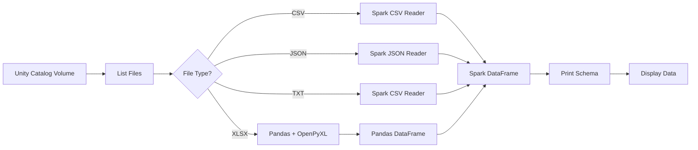

# 📌 Databricks — Read Multiple File Formats from Unity Catalog Volume

## 📁 Files in This Folder

| File | What It Is |
| ---- | ---------- |
| [01) README.md](01%29%20README.md) | Complete explanation of the multi-format read notebook |
| [notebook.py](notebook.py) | The full Databricks notebook code — each `# COMMAND ----------` block is one cell |

> 📌 This folder is the **Databricks side only**. There is no AWS component here — no Lambda, no trust policy. The notebook reads whatever files are already sitting in the Unity Catalog Volume.

---

## 1. Purpose

The purpose of this pipeline is to **read different file formats dynamically** from a Databricks Unity Catalog Volume.

It supports:

| Format | Reader | Example file |
| ------ | ------ | ------------ |
| CSV | Spark CSV reader | `employee.csv` |
| JSON | Spark JSON reader | `employee.json` |
| TXT | Spark CSV reader | `employee.txt` |
| XLSX / Excel | Pandas + OpenPyXL | `employee.xlsx` |

The notebook automatically checks the file extension and uses the appropriate reader.

Any other file type is skipped, and the run continues with the next file.

### Pipeline Flow



---

## 2. The Notebook Has Three Cells

```text
CELL 1  →  # MAGIC %pip install openpyxl
CELL 2  →  # MAGIC %restart_python
CELL 3  →  imports + volume path + list files + the whole for loop
```

Only the `%pip` install and the Python restart need their own cells.

Everything else runs as **one single cell**, because it is one continuous piece of logic: import, find the path, list the files, then loop over them.

Run them **top to bottom, in order**. Cell 1 must run before Cell 3, because Cell 3 needs `openpyxl` to read the `.xlsx` file.

The full notebook code lives in:

[notebook.py](notebook.py)

---

## 3. Cell 1 — Install OpenPyXL

Spark has no built-in reader for Excel files, so the `openpyxl` library has to be installed first.

```python
%pip install openpyxl
```

`%pip` is a Databricks **magic command**. Inside a `.py` file, Databricks writes magics with a `# MAGIC` prefix:

```python
# MAGIC %pip install openpyxl
```

This is not the command being commented out. Databricks strips the `# MAGIC` when it reads the file and runs the command for real. The prefix exists only so the file is also valid Python.

---

## 4. Cell 2 — Restart Python

A notebook-scoped `%pip` install only takes effect after Python restarts.

```python
%restart_python
```

> Without this cell, Cell 3 can fail with `ModuleNotFoundError: No module named 'openpyxl'` — the package is installed but the running interpreter has not picked it up yet.

---

## 5. Cell 3 — Read the Files

This one cell does four things in order.

### 5.1 Import Pandas

```python
import pandas as pd
```

Pandas is only needed for the Excel branch, but it is imported up front at the top of the cell.

### 5.2 Define the Volume Path

```python
path = "/Volumes/lambda-to-databricks/default/structured-2026"
```

Change this line to point at your own volume.

### 5.3 List the Files

```python
files = dbutils.fs.ls(path)
```

`dbutils.fs.ls()` returns an entry for every object in the volume. Each entry has a `.name`, a `.path` and a `.size`.

### 5.4 Loop Over Every File

```python
for file in files:

    # dbutils returns paths as "dbfs:/Volumes/...". pandas cannot open a
    # "dbfs:/..." URI, so drop the prefix and keep the plain /Volumes/ path.
    # Spark understands both forms, so this line is safe for every branch.
    file_path = file.path.replace("dbfs:", "")

    # Compare against the lowercased name so ".CSV" and ".csv" both match.
    file_name = file.name.lower()
```

The `dbfs:` strip is needed for the Excel branch specifically — pandas works with `/Volumes/...` paths, but not with a `dbfs:/...` URI.

Then one branch per format:

| Branch | Reader | Why |
| ------ | ------ | --- |
| `.csv` | `spark.read.csv(header=True, inferSchema=True)` | The first row holds the column names; Spark works out the types |
| `.json` | `spark.read.option("multiLine", True).json(...)` | `multiLine` is needed when a file holds one nested JSON document instead of one object per line |
| `.txt` | `spark.read.csv(header=True, inferSchema=True)` | Same shape as CSV, so the CSV reader handles it |
| `.xlsx` | `pd.read_excel(engine="openpyxl")` then `spark.createDataFrame(...)` | Spark cannot read Excel, so pandas does the read and the result is converted back to Spark |
| anything else | none | Prints `Skipping unsupported file: <name>` and moves to the next file |

### 5.5 Print and Display

```python
df.printSchema()
display(df)
```

These two lines run **after** the `if/elif` chain, so they apply to every format.

That works only because every branch produces a Spark DataFrame — including the Excel branch, which converts the pandas DataFrame back to Spark. That is the whole point of the conversion: it lets the rest of the notebook treat all four formats identically.

> ⚠️ `display()` renders one output type per cell. In a loop like this you will typically see the **last** file's table, even though `printSchema` output appears for every file. That is expected Databricks behaviour, not a bug.

---

## 6. What This Pipeline Does

| Step | Action |
| ---- | ------ |
| 1 | Install `openpyxl` for Excel support |
| 2 | Restart Python |
| 3 | Import Pandas |
| 4 | Define Unity Catalog Volume path |
| 5 | List all files from the Volume |
| 6 | Loop through each file and identify its format |
| 7 | Read the file using the appropriate reader |
| 8 | Print schema and display the data |

---

## 7. Unity Catalog Volumes and DBFS Paths

Worth knowing, because it is the single most common source of confusion when moving code from DBFS to a volume:

| Path form | Spark | pandas |
| --------- | ----- | ------ |
| `/Volumes/catalog/schema/volume/file.csv` | ✅ | ✅ |
| `dbfs:/Volumes/catalog/schema/volume/file.csv` | ✅ | ❌ |
| `dbfs:/FileStore/file.csv` | ✅ | ❌ (must be `/dbfs/FileStore/...`) |

`dbutils.fs.ls()` returns the `dbfs:/` form because it goes through the DBFS API, which is why the `.replace("dbfs:", "")` line exists.

---

### 🎯 Interview Explanation

> **"I created a dynamic Databricks notebook that reads multiple file formats from a Unity Catalog Volume. The notebook lists all files, identifies the file type based on the extension, and dynamically uses the appropriate reader. I use Spark for CSV, JSON and TXT files, while Excel files are read using Pandas with OpenPyXL and then converted into a Spark DataFrame. Finally, I print the schema and display the data."**
