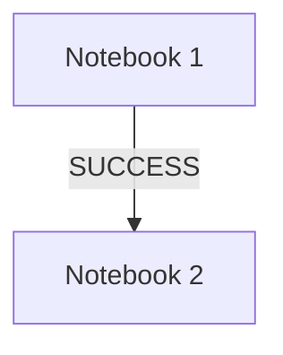

# 📘 Databricks Job — Notebook Dependency

## 📁 Files in This Folder

| File | What It Is |
| ---- | ---------- |
| [01) README.md](01%29%20README.md) | Complete explanation of the notebook dependency job |
| [notebook_1.py](notebook_1.py) | Notebook 1 — the first task, runs on its own |
| [notebook_2.py](notebook_2.py) | Notebook 2 — the second task, depends on Notebook 1 |

> 📌 This folder is the **Databricks side only**. There is no AWS component here — no Lambda, no trust policy. It is a Databricks Job made of two notebook tasks.

---

## 1. Purpose

The purpose of this setup is to **test the dependency between two Databricks notebooks**.

There is:

* No data processing
* No input files
* No output files
* No transformations

We are only testing whether **Notebook 2 starts after Notebook 1 completes successfully**.

Both notebooks are deliberately trivial — two `print()` statements each. That is the point: with nothing to fail and no data to move, any behaviour you see in the job run is caused by the **dependency**, not by the code.

---

## 2. Notebook 1

Create a Databricks notebook with the name:

```text
notebook_1
```

### Code

[notebook_1.py](notebook_1.py)

```python
print("Notebook 1 started")

print("Notebook 1 completed successfully")
```

### Expected Output

```text
Notebook 1 started
Notebook 1 completed successfully
```

---

## 3. Notebook 2

Create another Databricks notebook with the name:

```text
notebook_2
```

### Code

[notebook_2.py](notebook_2.py)

```python
print("Notebook 2 started")

print("Notebook 2 completed successfully")
```

### Expected Output

```text
Notebook 2 started
Notebook 2 completed successfully
```

---

## 4. Create Databricks Job

Create a new **Job** in Databricks.

### Task 1

```text
Task name: notebook_1
Type: Notebook
Notebook: notebook_1
```

### Task 2

```text
Task name: notebook_2
Type: Notebook
Notebook: notebook_2
```

---

## 5. Configure Dependency

For **Task 2 (`notebook_2`)**, configure:

```text
Depends on: notebook_1
```

This means:

> `notebook_2` will execute only after `notebook_1` completes successfully.

### Where to click in the Databricks UI

Everything below is done from the Databricks UI. No code or config file is needed.

```text
1. Left sidebar
2. Click "Workflows"  (older workspaces call it "Jobs")
3. Click "Create job"

   The canvas opens with the first task box already on it.

4. Click that first task box and fill in:
      Task name : notebook_1
      Type      : Notebook          <- this is the default
      Source    : Workspace
      Path      : browse and select notebook_1
      Compute   : pick your cluster (or Serverless)

5. Click "+ Add task"  (top left of the canvas)
   A second task box appears, joined to the first one by an arrow.

6. Click the new second task box and fill in:
      Task name : notebook_2
      Type      : Notebook
      Source    : Workspace
      Path      : browse and select notebook_2
      Compute   : pick your cluster (or Serverless)

7. Still on the notebook_2 task box, look at the panel on the RIGHT.
   Find the "Depends on" section and open the dropdown.
   Select: notebook_1

8. Click "Run now"  (top right)
```

That is the whole dependency. Step 7 is the only step that creates it — Steps 4 to 6 just create two independent tasks.

### How to confirm it worked

Open the run and look at the graph:

```text
  ┌──────────────┐         ┌──────────────┐
  │  notebook_1  │ ──────► │  notebook_2  │
  └──────────────┘         └──────────────┘
```

`notebook_1` turns green **first**. Only then does `notebook_2` start.

If both boxes start at the same time, the dependency was not applied — go back to Step 7 and check the **Depends on** field on the `notebook_2` task.

---

## 6. Job Dependency Flow



### Complete Flow

```text
Notebook 1
    ↓
Notebook 1 started
    ↓
Notebook 1 completed successfully
    ↓
Notebook 2 starts
    ↓
Notebook 2 started
    ↓
Notebook 2 completed successfully
```

---

## 7. Expected Job Execution

When you run the Job:

### Step 1

```text
Notebook 1 starts
```

Output:

```text
Notebook 1 started
Notebook 1 completed successfully
```

### Step 2

After Notebook 1 succeeds:

```text
Notebook 2 starts
```

Output:

```text
Notebook 2 started
Notebook 2 completed successfully
```

In the **Runs** view you will see the two tasks as two boxes joined by an arrow. Notebook 1 turns green first, then Notebook 2 starts — never at the same time.

---

## 8. Key Point

The dependency is:

```text
Notebook 1 → Notebook 2
```

**Notebook 2 does not start until Notebook 1 finishes successfully.**

---

## 9. What If Notebook 1 Fails?

This is the part worth testing, since it is the whole reason a dependency exists.

Add a line to Notebook 1 that raises an error:

```python
raise Exception("Notebook 1 failed on purpose")
```

Then run the job again:

```text
Notebook 1  →  FAILED
Notebook 2  →  UPSTREAM_FAILED
```

Notebook 2 never ran. Its result state is **Upstream failed** (`UPSTREAM_FAILED`) — *"the run was skipped because of an upstream failure."* The **Run if** condition was left at its default, **All succeeded**, which was never satisfied.

You see this in the UI by opening the run: `notebook_1` shows as Failed, and `notebook_2` shows as skipped — click either task box to see its state.

Notebook 2 is **not** reported as Failed, and that distinction matters when you read a failed run, because these two mean very different things:

| Result state | Meaning |
| ------------ | ------- |
| `FAILED` | The task **ran** and threw an error. The problem is inside this task |
| `UPSTREAM_FAILED` | The task **never ran**. Something it depends on failed — look upstream |
| `UPSTREAM_CANCELED` | The task never ran, because an upstream task was canceled |
| `EXCLUDED` | The task never ran, and a failure-handling condition was not met. Treated as successful |
| `DISABLED` | The task never ran, because it was disabled in the job config |

So if you see a task in a failed run, the first question is whether it says `FAILED` or `UPSTREAM_FAILED`. Only the first one is worth debugging in that task.

### Running a task even when an upstream task fails

A common need: run a cleanup or alerting notebook **whatever** happens upstream.

In the UI, this is the **Run if** dropdown, sitting in the same right-hand panel as **Depends on** (Step 7 above).

```text
Click the notebook_2 task box
   ↓
Right-hand panel
   ↓
"Run if"  ->  change it from "All succeeded" to "All done"
```

**All done** runs the task once all its dependencies have finished, **regardless of whether they succeeded or failed**. That is the correct choice for a failure-notification task.

> ⚠️ Do **not** pick **At least one succeeded** for this. It means exactly what it says — at least one dependency succeeded. With a single dependency that failed, that condition is still not satisfied, so the task gets skipped again. It looks like the right option and is not.

The **Run if** dropdown options:

| Dropdown option | The task runs when… |
| --------------- | ------------------- |
| All succeeded | every dependency succeeded *(default)* |
| At least one succeeded | at least one dependency succeeded |
| All done | all dependencies finished, success or failure |
| At least one failed | at least one dependency failed |
| All failed | every dependency failed |

Remove the `raise` line before moving on.

---

## 10. Why Chain Notebooks at All?

The same pattern is used for real pipelines where each step must finish before the next starts:

```text
Notebook 1  →  ingest raw files
Notebook 2  →  clean and validate
Notebook 3  →  aggregate and write gold tables
```

Without dependencies, Databricks would run all three at once and the clean step would read files the ingest step had not written yet.

Each task's result also becomes visible separately in the Runs view, so you can see exactly which step failed instead of debugging one large notebook.

---

### 🎯 Interview Explanation

> **"I created a Databricks Job with two notebook tasks. Notebook 2 has a dependency on Notebook 1, so Notebook 2 executes only after Notebook 1 completes successfully. This allows us to create sequential notebook workflows in Databricks Jobs."**
