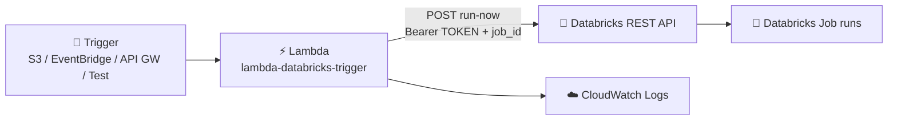

# Lambda → Databricks

## AWS Lambda Triggers a Databricks Job (Run Now API)

## 📁 Files in This Folder

| File | What It Is |
| ---- | ---------- |
| [lambda_function.py](lambda_function.py) | Lambda handler — calls the Databricks **Run Now** API to start a job |
| [trust_policy.json](trust_policy.json) | IAM trust policy that lets **Lambda** assume the execution role |

## 🎯 Goal

Lambda does **not** run Spark. It just tells Databricks to start a job:

```text
S3 / EventBridge / API Gateway / Step Functions → Lambda → POST https://<host>/api/2.2/jobs/run-now
```

## Architecture



## 🔐 Step 1: IAM Role

IAM → Roles → Create role → **Custom trust policy** → paste [trust_policy.json](trust_policy.json) (only `lambda.amazonaws.com` can use the role).

Attach `AWSLambdaBasicExecutionRole` (lets Lambda write CloudWatch logs). Role name: `lambda-databricks-demo-role`

> ⚠️ There is **no** "run Databricks job" IAM permission — Databricks is an **external HTTPS API**. Access is controlled by the **Databricks token**, not IAM.

## 🐍 Step 2: Create the Lambda

Lambda → Functions → Create function → **Author from scratch**

| Setting | Value |
|---------|-------|
| Function name | `lambda-databricks-trigger` |
| Runtime | Python 3.x |
| Permissions | Use an existing role → `lambda-databricks-demo-role` |

## 📦 Step 3: Add `requests` as a Layer

`requests` is **not** in the Lambda Python runtime. Build the layer in Git Bash:

```bash
mkdir -p /d/requests-layer/python
pip install --no-cache-dir -t /d/requests-layer/python requests
cd /d/requests-layer && zip -r requests-layer.zip python
```

Lambda → **Layers** → Create layer → upload the zip → match your Python version → then function → **Add a layer** → Custom layers → `requests-layer`.

> 📌 The `python/` folder must be the zip root, and the layer runtime must match the function runtime.

## 💻 Step 4: Lambda Code

Paste [lambda_function.py](lambda_function.py) → **Deploy**. Replace **three** placeholders:

| Placeholder | Where to Get It | Example |
|-------------|-----------------|---------|
| `"DATABRICKS HOST"` | Workspace URL **without** `https://` and no trailing `/` | `adb-1234567890.4.azuredatabricks.net` |
| `"DATABRICKS TOKEN"` | Databricks → Settings → Developer → Access tokens → Generate new token | `dapiabcdef...` |
| `job_id` | Number in the job URL `.../jobs/123456789` | `123456789` |

How it works:

```python
url     = f"https://{databricks_host}/api/2.2/jobs/run-now"   # endpoint
headers = {"Authorization": f"Bearer {databricks_token}"}     # who is calling
payload = {"job_id": job_id}                                  # which job to run
```

## ⭐ `run-now` Is Asynchronous

Lambda gets its reply in ~1 second, but the job keeps running in Databricks.

| You get | It does **not** mean |
|---------|----------------------|
| `200` | the job succeeded |
| `run_id` | the job finished |

```json
{"run_id": 123456789012345, "number_in_job": 42}
```

Need to wait for the job? Poll with the `run_id`:

```text
GET https://<host>/api/2.2/jobs/runs/get?run_id=<run_id>
```

Check `state.life_cycle_state` (`PENDING` / `RUNNING` / `TERMINATED`), then `state.result_state` (`SUCCESS` / `FAILED`).

## 🧪 Step 5: Test

Lambda → **Test** with input `{}` → **Test**. Expected output:

```text
========================================
Triggering Databricks job: 123456789
URL: https://adb-1234567890.4.azuredatabricks.net/api/2.2/jobs/run-now
========================================
Status Code: 200
Response: {"run_id":123456789012345,"number_in_job":42}
```

## ☁️ Step 6: Check CloudWatch Logs

Lambda → **Monitor** → **View CloudWatch logs** — the same output appears there.

---

## 🔄 Complete Pipeline

```text
Trigger (test / S3 / EventBridge / API GW)
   ↓
Lambda reads host, token, job_id
   ↓
POST https://<host>/api/2.2/jobs/run-now  →  Bearer token + {"job_id": <id>}
   ↓
Databricks validates token → accepts job → returns run_id
   ↓
Lambda returns 200 + run_id  (done ✅)
   ↓
Databricks runs the notebook / Spark job in the background → Succeeded / Failed
```

---

## ✅ Step 7: Verify Inside Databricks

Databricks → **Workflows** → your job → **Runs** → a new run with the same `run_id` Lambda printed.

| Column | Expected |
|--------|----------|
| Trigger | `Run now` / `API` |
| Status | `Succeeded` ✅ |
| Run ID | same as Lambda printed |

---

## ⚠️ Common Mistakes

| ❌ Mistake | ✅ Fix |
|-----------|-------|
| `requests` not found | Attach the layer, then **Deploy** |
| Forgot to click **Deploy** | Lambda still runs the old code |
| `https://` in the host, or a trailing `/` | Use only `adb-....azuredatabricks.net` |
| `401 Unauthorized` | Token wrong, expired, or has extra characters |
| `403 Forbidden` | The token's user has no permission on that job |
| `404 Not Found` | Wrong host or wrong `job_id` |
| `429 Too Many Requests` | Rate limit — retry |
| Thinking `200` = job succeeded | `run-now` is async — check the run in Databricks |

Error bodies tell you which one it is:

```json
{"error_code": "PERMISSION_DENIED", "message": "User does not have permission to run job 123456789"}
```

---

## 🔒 Security

The token is inline in the code only to keep testing easy — **do not ship it like that**.

Lambda → Configuration → **Environment variables**:

| Key | Value |
|-----|-------|
| `DATABRICKS_HOST` | `adb-....azuredatabricks.net` |
| `DATABRICKS_TOKEN` | `dapi...` |

```python
import os
databricks_host = os.environ["DATABRICKS_HOST"]
databricks_token = os.environ["DATABRICKS_TOKEN"]
```

Best: keep the token in **AWS Secrets Manager** and fetch it at runtime.

> 📌 Host and `job_id` can live in code. The **token should not**.

## 🎤 Interview Explanation

> **"My Lambda starts a Databricks job from AWS. It POSTs to `https://<host>/api/2.2/jobs/run-now` with a Bearer token and the job ID, and Databricks returns a run ID. I attached a layer for `requests` because the Lambda runtime does not include it. The key point is that `run-now` is asynchronous — a `200` only means Databricks accepted the request, so to wait for completion I would poll the `runs/get` endpoint and check the life cycle state. In production the token lives in an environment variable or Secrets Manager, not in the code."**

---

## ⭐ One-Line Summary

```text
AWS event → Lambda → POST /api/2.2/jobs/run-now (Bearer token + job_id)
          → Databricks accepts → run_id → job runs async → verify in Databricks
```

## Summary

| Component | What It Does |
|-----------|--------------|
| **IAM Role** (`lambda-databricks-demo-role`) | Lets Lambda run and log (trust: `lambda.amazonaws.com`) |
| **Lambda** (`lambda-databricks-trigger`) | Calls the Databricks Run Now API |
| **Layer** (`requests-layer`) | Adds the `requests` library |
| **Databricks API** | Validates the token and starts the job |
| **CloudWatch Logs** | Status code + response |

AWS decides **when** something should run; Databricks does the **heavy data work**.
