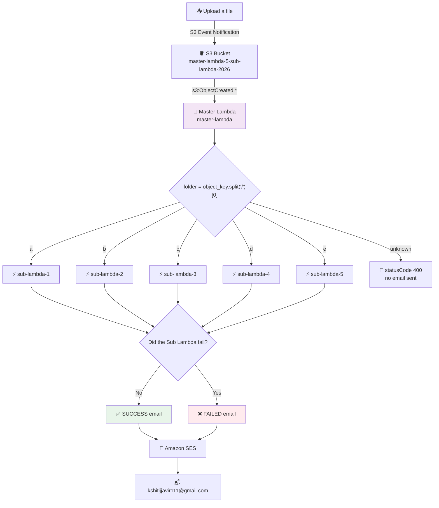

# 20) S3 Folder Based Lambda Processing with Master Lambda, Sub Lambdas and SES Notification

## 📁 Files in This Folder

| File | What It Is |
| ---- | ---------- |
| [lambda_function.py](lambda_function.py) | The **Master Lambda** — finds the folder, calls the right Sub Lambda, sends the email |
| [config.json](config.json) | The folder → Sub Lambda mapping, plus the SES sender and recipient |
| [trust_policy.json](trust_policy.json) | The IAM trust policy that lets the Lambda service assume the execution role |
| [email/](email/) | `email.html` (the shell + all the CSS) with the success and failure templates |
| [sub-lambda-1/](sub-lambda-1/) … [sub-lambda-5/](sub-lambda-5/) | The five Sub Lambdas, one folder each |

This README explains the **theory** — how the pieces fit together and why. The code itself lives in the files above.

## 🎯 Goal

One S3 bucket has five folders — `a`, `b`, `c`, `d`, `e`. A file is uploaded into one of them.

- S3 sends an Event Notification, which starts **only one** Lambda — the Master Lambda
- The Master reads the folder from the file path and looks it up in `config.json`
- That lookup gives exactly one Sub Lambda name, so the Master calls **only that one** and waits for it
- When the Sub Lambda finishes, the Master sends a **SUCCESS** or **FAILED** email through Amazon SES

The mapping, from `config.json`:

`a` → `sub-lambda-1` · `b` → `sub-lambda-2` · `c` → `sub-lambda-3` · `d` → `sub-lambda-4` · `e` → `sub-lambda-5`

> ⚠️ **Only the Master Lambda is attached to the S3 bucket.** The five Sub Lambdas have no S3 trigger — nothing can start them except the Master Lambda.

## 🗺️ Architecture

The folder is the first part of the file path — `c/input_c.csv` → folder `c`, file `input_c.csv`. No database, no lookup service.

> ⚠️ A file at the bucket root (`input.csv`) gives folder `input.csv`, which is not in `config.json` — that returns a 400 error and sends **no email**.

## 🔐 IAM Role and Trust Policy

| Field | Value |
| ----- | ----- |
| Role name | **`master-lambda-5-sub-lambda-2026`** |
| Used by | `master-lambda` only |
| Trusted entity | AWS Lambda (`lambda.amazonaws.com`) |

| Managed policy | Purpose |
| -------------- | ------- |
| `AmazonS3FullAccess` | S3 access |
| `AmazonSESFullAccess` | Lets the Lambda call `ses.send_email` |
| `AWSLambda_FullAccess` | Lets the Master invoke the Sub Lambdas |
| `AWSLambdaBasicExecutionRole` | Lets the Lambda write CloudWatch logs |

All four are AWS-managed policies — no inline policy is used. The trust policy in [trust_policy.json](trust_policy.json) allows **only `lambda.amazonaws.com`** to assume the role: Lambda calls `sts:AssumeRole`, gets temporary credentials, and those are what the boto3 clients use. SES is not in the trust policy, because SES never assumes this role — the Lambda *calls* SES.

> ⚠️ These are **broad** managed policies, not least privilege. `AmazonS3FullAccess` allows every S3 action on every bucket, and `AWSLambda_FullAccess` allows managing any Lambda function. Fine for practice; production would scope them to the five Sub Lambda ARNs and one bucket.

## ⚙️ config.json

| Field | Example | What It Means |
| ----- | ------- | ------------- |
| `bucket_name` | `master-lambda-5-sub-lambda-2026` | The bucket this pipeline works with |
| `email.sender` / `email.recipient` | `no-reply@kshitijaws.site` / `kshitijjavir111@gmail.com` | The verified SES sender and who gets the email |
| `email.subject_prefix` | `AWS Pipeline Notification` | The fixed start of the subject line |
| `folders.<x>.s3_path` | `c/` | The prefix the Sub Lambda works with |
| `folders.<x>.lambda_name` | `sub-lambda-3` | **Which function to invoke** |

Keeping the mapping in a file means adding a folder is a JSON edit, not a Python change — the same handler serves all five folders.

> 📌 The trade-off: `config.json` ships **inside** the Master's deployment package, so changing it means redeploying the function.

## 🧠 Master Lambda

**`master-lambda`** · handler `lambda_function.lambda_handler`

| Step | What Happens |
| ---- | ------------ |
| 1 | Starts from the S3 event and reads `config.json` from its own package |
| 2 | Reads `event["Records"][0]`, gets the bucket name (logged, then not used again) and the object key |
| 3 | Detects the folder — `object_key.split("/")[0]` — and the file name (the last part of the key) |
| 4 | Looks the folder up in `config.json` — **not found → returns 400, no email** |
| 5 | Gets the mapped Sub Lambda name |
| 6 | Builds the payload: bucket, folder, s3_path, file_key, file_name |
| 7 | Invokes the Sub Lambda with **`RequestResponse`** and waits |
| 8 | Checks `FunctionError` in the response |
| 9 | Sends a SUCCESS or FAILED email through SES and returns `statusCode` 200, 500 or 400 |

> 📌 Steps 7–9 sit inside a `try`. If anything unexpected breaks, the `except` block tries once more to send a FAILED email, then re-raises so the error is not hidden.

## ⚡ Sub Lambda

The Master sends `bucket_name`, `folder`, `s3_path`, `file_key` and `file_name` — for example `master-lambda-5-sub-lambda-2026`, `c`, `c/`, `c/input_c.csv`, `input_c.csv`.

**On success** it returns `{"status": "SUCCESS", "message": "...", "bucket": ..., "folder": ..., "file": ...}`.

**On failure** it raises an exception, exactly as the comment in the code shows: `raise Exception("File validation failed")`. Lambda then sets **`FunctionError`** on the response — and that is the only thing the Master checks.

> ⚠️ The Master does **not** read the `status` field the Sub Lambda returns, so a Sub Lambda that returns `{"status": "FAILED"}` without raising would be reported as SUCCESS. That is why the code is written to `raise`.

> 📌 **The same code is deployed to all five Sub Lambdas.** The Master decides which one is invoked, based on the folder.

## ⏳ Why RequestResponse?

The Master invokes the Sub Lambda with `InvocationType="RequestResponse"` — meaning **synchronous**. It waits for the Sub Lambda and gets its result back, including `FunctionError`.

**Why not `Event`?** Because `Event` is fire-and-forget: the Master would not wait and would get no result, so it would send the email before the processing had even started. Every email would claim SUCCESS, even for files that failed.

## ✉️ Email Templates

Three HTML files sit inside the Master's package under `email/`. `email.html` is the shell with the header, footer and all the CSS, holding one `{{EMAIL_CONTENT}}` slot. `success_template.html` is the green content that fills that slot on success, and `failure_template.html` is the red content that fills it on failure.

The handler does plain text replacement — `template.replace("{{BUCKET_NAME}}", bucket_name)` — then injects the result into `{{EMAIL_CONTENT}}`. The placeholders are `{{BUCKET_NAME}}`, `{{FOLDER_NAME}}`, `{{FILE_NAME}}`, `{{LAMBDA_NAME}}`, `{{MESSAGE}}` (the returned JSON, or the raw error) and `{{COMPLETED_TIME}}` (a UTC timestamp generated at send time). All the styling lives in a `<style>` block inside `email.html` — there is no separate CSS file.

## 📧 Amazon SES

Sender `no-reply@kshitijaws.site` → recipient `kshitijjavir111@gmail.com`, subject prefix `AWS Pipeline Notification`. Region: **[VALUE TO BE PROVIDED]** — Lambda and SES must match.

**Success email** → subject `AWS Pipeline Notification - SUCCESS - sub-lambda-3`: green card with the returned JSON.

**Failure email** → subject `AWS Pipeline Notification - FAILED - sub-lambda-3`: red card with the raw error payload in an Error Details box.

SES needs the sender verified, and while the account is in the **SES sandbox** the recipient must be verified too, or SES refuses to send.

## 🧪 Testing

| Test | Upload | Expected |
| ---- | ------ | -------- |
| 1 | `a/input_a.csv` | `sub-lambda-1` only → SUCCESS email |
| 2 | `b/input_b.csv` | `sub-lambda-2` only → SUCCESS email |
| 3 | `c/input_c.csv` | `sub-lambda-3` only → SUCCESS email |
| 4 | `d/input_d.csv` | `sub-lambda-4` only → SUCCESS email |
| 5 | `e/input_e.csv` | `sub-lambda-5` only → SUCCESS email |
| 6 | `c/input_c.csv` after uncommenting the `raise` | FAILED email with the error message |
| 7 | `input.csv` at the bucket root | 400 error, **no email** |

**Uploading into one folder does NOT trigger the other Sub Lambdas** — one upload gives one Sub Lambda call and one email. In CloudWatch, after five uploads there is one new log stream in each of the five Sub Lambda log groups and **five** in the Master's.

## 🚀 Deployment Steps

1. Create the S3 bucket `master-lambda-5-sub-lambda-2026`, then the folders `a/` to `e/`
2. Create the IAM role `master-lambda-5-sub-lambda-2026` — trusted entity: **Lambda** — and attach the four managed policies
3. Check the trust policy matches [trust_policy.json](trust_policy.json)
4. Create the Master Lambda `master-lambda`, runtime Python 3.x, using that role
5. Add `config.json` and the `email/` folder with its three HTML files
6. Paste the Master code from [lambda_function.py](lambda_function.py) and **Deploy**
7. Create the five Sub Lambdas — name them **exactly** `sub-lambda-1` … `sub-lambda-5`
8. Paste the Sub Lambda code into each one and **Deploy**
9. Give the Sub Lambdas a role that can read the bucket and write logs — **[VALUE TO BE PROVIDED]**
10. Add a trigger on **`master-lambda` only** — S3, event type **All object create events**, prefix blank, suffix blank
11. Verify the SES sender and recipient in the same Region as the Lambdas, then upload one test file into each folder

> ⚠️ Do **not** set a prefix like `a/` on the trigger — that would stop files in `b`–`e` from ever starting the function. And make the Master's timeout **longer** than the Sub Lambdas', because the Master waits for them.

## 🚨 Error Handling

| Situation | What Happens | Email Sent |
| --------- | ------------ | ---------- |
| Folder not in `config.json` | Returns 400 immediately | ❌ None |
| Sub Lambda raises | FAILED email with the raw error | ✅ FAILED |
| Wrong Sub Lambda name in config | `except` block → FAILED email → re-raises | ✅ FAILED |
| Broken or missing `config.json` | Fails before the `try`, so no email | ❌ None |
| SES rejects the send | The failure email fails too — logs only | ❌ None |

> ⚠️ An unknown folder fails **silently** from the inbox's point of view — the 400 path needs its own email if you want to know about stray files. Also note the S3 trigger is asynchronous, so a failure that re-raises can send the same FAILED email up to **three times**.

## 🎤 How to Explain This in an Interview

> **"This pipeline processes files by folder in one S3 bucket, using a router Lambda in front of five worker Lambdas. The bucket has folders `a` to `e`, and only the Master Lambda is attached to the S3 trigger. When a file lands, the Master reads its own `config.json` — that holds the routing table — detects the folder from the first part of the file path, and invokes only the one Sub Lambda mapped to that folder."**
>
> **"It uses `InvocationType='RequestResponse'`, so it waits for the Sub Lambda and gets the result back. That is the key decision: the Master must know the real outcome before it notifies anyone. With `Event` it would send the email before the work had even started, and every email would falsely say SUCCESS."**
>
> **"The result is decided by `FunctionError`. If it is absent the Sub Lambda succeeded, and the Master sends a green SES email with the bucket, folder, file, Lambda name and timestamp. If it is present the Sub Lambda raised, and the Master sends a red email with the raw error payload. Adding a new folder is just a config edit plus one more function — the routing code never changes."**

## ⚠️ Things to Know
1. **The Master waits.** `RequestResponse` blocks it for the whole Sub Lambda run, so the Master's timeout must be longer than the Sub Lambdas'
2. **Long jobs need a different shape.** Once processing takes many minutes, Step Functions is the better fit — it can invoke asynchronously and poll
3. **Only `event["Records"][0]` is processed.** Extra records in one notification are silently ignored
4. **The event bucket is ignored.** The payload and the email both use `config["bucket_name"]`, even if the file came from a different bucket

This pipeline shows how **one Lambda can route work to other Lambdas** using nothing but the file path and a JSON config file — and how a synchronous `RequestResponse` call is what makes an honest success or failure notification possible.
