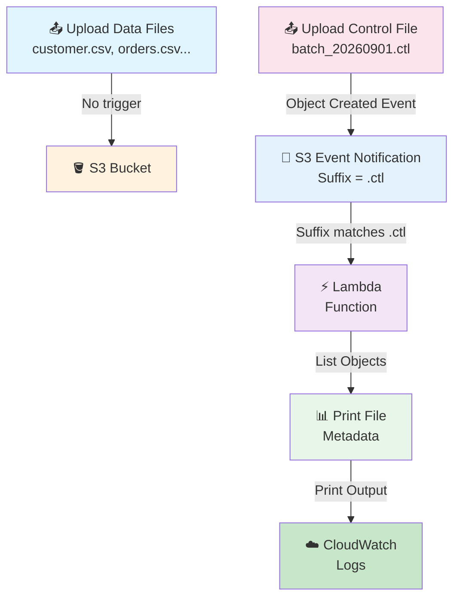
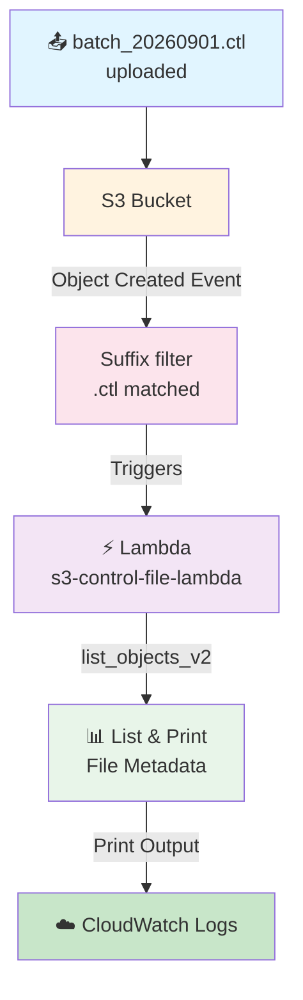

# S3 → Lambda Pipeline — Control File (`.ctl`) Approach

## 🎯 Goal

Suppose one outside system sends **many files as one batch** to an S3 bucket:

```text
customer.csv
orders.csv
products.csv
transactions.csv
payments.csv
```

The files do **not** come at the same time. They come one by one, like this:

```text
10:00 AM → customer.csv
10:01 AM → orders.csv
10:02 AM → products.csv
10:03 AM → transactions.csv
10:04 AM → payments.csv
```

The main question is:

> **How does Lambda know that the whole batch has arrived?**

If S3 starts Lambda for **every file upload**, Lambda can run 5 times — but maybe we only want: *"Run once, after all files are there."*

So we use the **Control File (`.ctl`) method**:

> **First upload all data files → then upload the `.ctl` file → only the `.ctl` file starts Lambda → Lambda knows the batch is complete and can start work.**

## 📌 What Is a Control File?

A control file is a special file. It is a **signal** that says:

> **"All files of this batch are uploaded. Now you can start work."**

Example batch flow:

```text
customer.csv
orders.csv
products.csv
transactions.csv
        ↓
   All uploaded
        ↓
batch_20260901.ctl      ← this file says "batch is done"
        ↓
    "Batch complete"
        ↓
      Lambda
```

### 🚦 Think of `.ctl` as a Green Signal

| File | Meaning |
|------|---------|
| `customer.csv`<br>`orders.csv`<br>`products.csv`... | "Here is the data." |
| `batch_20260901.ctl` | **"The data upload is complete. Start work."** (GREEN SIGNAL) |

## Architecture



---

## ❌ What Happens Without a Control File?

Suppose S3 is set to trigger on **every object created** and 10 files come:

```text
file1.csv → Lambda
file2.csv → Lambda
file3.csv → Lambda
    ...
file10.csv → Lambda
```

### Problem 1 — Lambda may work on an incomplete batch
When `file1.csv` arrives, Lambda does not know if `file2.csv`, `file3.csv`... are still coming.

### Problem 2 — Lambda runs many times without need
50 files → 50 S3 events → maybe 50 Lambda runs. But the real need is: *"Run the whole batch once."*

### Problem 3 — Next step may start too early
If the next step needs `customer.csv` + `orders.csv` + `products.csv`, but only `customer.csv` has arrived, the work fails with a **missing file**.

### Problem 4 — "Wait some time" is not a good fix
"Wait 10 minutes after the first file" fails if files take 15 minutes (batch still not complete), and wastes time if files come in 2 minutes. Fixed waiting is not a good way to know when a batch is done.

---

## 📌 AWS Resources We Need

| Sr. No. | AWS Service | Resource |
| ------- | ----------- | -------- |
| 1 | IAM | Lambda execution role |
| 2 | S3 | One bucket |
| 3 | Lambda | One Lambda function |
| 4 | S3 | Event notification (suffix `.ctl`) |
| 5 | CloudWatch | Lambda logs |

> ⚠️ **Order matters:** first IAM role → then S3 bucket → then Lambda → then Event Notification.

---

## 🔐 Step 1: Create IAM Role (Lambda Execution Role)

1. Open **AWS Management Console**
2. Search for **IAM**
3. Open **IAM** → **Roles**
4. Click **Create role**

### Select Trusted Entity
- Select: **AWS service**
- Use case: **Lambda**
- Click **Next**

### Attach Policies

| Policy | What It Does |
|--------|--------|
| `AmazonS3FullAccess` | Lets Lambda read files from S3 (managed policy, fine for this practice project) |
| `AWSLambdaBasicExecutionRole` | Lets Lambda write its logs to CloudWatch |

### Name the Role
- Role name: `s3-lambda-control-file-role`
- Click **Create role**

✅ The IAM role is ready.

---

## 🪣 Step 2: Create S3 Bucket

1. Open **AWS Management Console**
2. Search for **S3** → **Amazon S3**
3. Click **Create bucket**
4. Enter a globally unique name
   - Example: `s3-control-file-demo`
5. Select your required AWS Region
6. Keep other settings as default for this practice project
7. Click **Create bucket**

### Bucket Structure (after all uploads)

```
s3-control-file-demo
│
├── customer.csv
├── orders.csv
├── products.csv
├── payments.csv
├── transactions.csv
└── batch_20260901.ctl     ← uploaded LAST
```

> The main point: `batch_20260901.ctl` is uploaded **after** all data files.

---

## 🐍 Step 3: Create Lambda Function

1. Open **AWS Management Console**
2. Search for **Lambda** → **AWS Lambda**
3. Click **Functions** → **Create function**
4. Select: **Author from scratch**

### Lambda Settings

| Setting | Value |
|---------|-------|
| Function name | `s3-control-file-lambda` |
| Runtime | Python 3.x (select latest available) |
| Permissions | **Use an existing role** |

- Execution role: `s3-lambda-control-file-role`
- Click **Create function**

✅ Lambda is created with the IAM role attached.

---

## 💻 Step 4: Lambda Code

The Lambda does two things:

1. Find out **which `.ctl` file** started it
2. **List all files** in the bucket and print their details

Open the Lambda function → **Code** section, replace the existing code with:

```python
import json
import boto3
from urllib.parse import unquote_plus

s3 = boto3.client("s3")


def lambda_handler(event, context):

    print("===== CONTROL FILE RECEIVED =====")

    # Get bucket name from S3 event
    bucket_name = event["Records"][0]["s3"]["bucket"]["name"]

    # Get control file name
    raw_key = event["Records"][0]["s3"]["object"]["key"]
    control_file = unquote_plus(raw_key)

    print(f"Bucket Name  : {bucket_name}")
    print(f"Control File : {control_file}")

    print("===== FILES IN BUCKET =====")

    # List objects in the bucket
    response = s3.list_objects_v2(
        Bucket=bucket_name
    )

    if "Contents" in response:

        for obj in response["Contents"]:

            file_name = obj["Key"]
            file_size = obj["Size"]

            print(f"File Name : {file_name}")
            print(f"File Size : {file_size} bytes")
            print("-------------------------")

    else:
        print("No files found in bucket.")

    return {
        "statusCode": 200,
        "body": json.dumps("Control file processed successfully")
    }
```

Click **Deploy**.

### 🔍 What This Lambda Code Does

When the `.ctl` file arrives (`batch_20260901.ctl`), S3 sends an event to Lambda.

| Part | Code | What It Does |
|------|------|--------|
| Bucket name | `event["Records"][0]["s3"]["bucket"]["name"]` | Gets the bucket → `s3-control-file-demo` |
| Control file | `unquote_plus(event["Records"][0]["s3"]["object"]["key"])` | Gets + decodes the file key → `batch_20260901.ctl` |
| List objects | `s3.list_objects_v2(Bucket=bucket_name)` | Lists every file in the bucket |
| Print details | `obj["Key"]`, `obj["Size"]` | Prints each file name and size |

---

## ⚡ Step 5: S3 Event Notification (Most Important Setting)

1. Open **Amazon S3**
2. Click your bucket: `s3-control-file-demo`
3. Go to the **Properties** tab
4. Scroll down to **Event notifications**
5. Click **Create event notification**

### Event Notification Settings

| Setting | Value | Notes |
|---------|-------|-------|
| Event name | `control-file-trigger` | Name of the notification |
| Prefix | Leave blank | Applies to the whole bucket |
| Suffix | `.ctl` | **Most important setting** |
| Event types | **All object create events** | Fires when an object is created |
| Destination | **Lambda function** | |
| Lambda function | `s3-control-file-lambda` | |

Click **Save changes**.

### 🤔 Why Suffix = `.ctl`?

This tells S3:

> **Only send the event when the uploaded file name ends with `.ctl`.**

| Uploaded file | Ends with `.ctl`? | Lambda starts? |
|---------------|-------------------|-------------------|
| `customer.csv` | ❌ NO | ❌ No |
| `orders.csv` | ❌ NO | ❌ No |
| `products.csv` | ❌ NO | ❌ No |
| `payments.csv` | ❌ NO | ❌ No |
| `transactions.csv` | ❌ NO | ❌ No |
| `batch_20260901.ctl` | ✅ YES | ✅ **YES** |

✅ This is the **main idea** of the `.ctl` pipeline: data files do not start Lambda, only the `.ctl` file does.

---

## 🧪 Step 6: Test the Pipeline

### Part 1 — Upload Data Files (Lambda should NOT run)

1. Go to: **S3** → **s3-control-file-demo** → **Objects**
2. Upload files **one by one**:

```text
customer.csv
orders.csv
products.csv
payments.csv
transactions.csv
```

For every file, S3 checks: *"Does the file end with `.ctl`?"* → **NO** → Lambda **does not run**. ✅ This is correct.

### Part 2 — Upload the Control File (Lambda should run)

1. Now upload:

```text
batch_20260901.ctl
```

2. S3 checks: *"Does the file end with `.ctl`?"* → **YES** ✅



**Key Point:** You do not run the Lambda yourself. The `.ctl` upload automatically starts it.

---

## ☁️ Step 7: See the Output in CloudWatch Logs

1. Open **CloudWatch**
2. Go to: **Logs** → **Log groups**
3. Open: `/aws/lambda/s3-control-file-lambda`
4. Open the latest **Log stream**

Expected output:

```text
===== CONTROL FILE RECEIVED =====

Bucket Name  : s3-control-file-demo
Control File : batch_20260901.ctl

===== FILES IN BUCKET =====

File Name : customer.csv
File Size : 12500 bytes
-------------------------

File Name : orders.csv
File Size : 25000 bytes
-------------------------

File Name : products.csv
File Size : 18000 bytes
-------------------------

File Name : payments.csv
File Size : 32000 bytes
-------------------------

File Name : transactions.csv
File Size : 45000 bytes
-------------------------

File Name : batch_20260901.ctl
File Size : 120 bytes
-------------------------
```

✅ The control file was received, and Lambda checked that the whole batch is there.

---

## ⚖️ Without Control File vs With Control File

| Without Control File | With Control File |
|----------------------|-------------------|
| Every file can start Lambda | Only `.ctl` starts Lambda |
| Lambda may run for every upload | Lambda runs once when `.ctl` comes |
| Hard to know when batch is done | `.ctl` says batch is done |
| Can work on incomplete batch | Work starts only after the signal |
| More Lambda runs | Fewer useless runs |
| Timing/order needs extra handling | Source system clearly says "batch done" |

---

## 🎤 Interview Explanation

**Q: "Why did you use a control file?"**

> **"We get many files as one batch in an S3 bucket. We do not want Lambda to start for every single file, because the batch may not be complete yet. So we use a control file with a `.ctl` extension. The source system uploads all the data files first and uploads the `.ctl` file at the end to say the batch is complete. In S3 Event Notifications, we set the suffix filter to `.ctl`, so only the control file upload starts Lambda. Lambda then gets the S3 event and can list and process the files of that batch."**

### ⭐ Key Concept (One Sentence)

> **The `.ctl` file is a "batch complete" signal, and S3 has a `.ctl` suffix filter, so Lambda starts only when the control file is uploaded.**

### ⚠️ Important Practical Point (Next Level)

The `.ctl` file tells Lambda **that the batch is complete**, but S3 does **not** know which files belong to that batch. In a real production pipeline, the `.ctl` file often contains details like:
- Expected file names
- File count
- Batch ID
- Date

Lambda can then **check** that the expected files are really there before starting work. That is the next level of this pipeline.

---

## Summary

| Component | What It Does |
|-----------|---------|
| **IAM Role** | Gives Lambda permission for S3 and CloudWatch logs |
| **S3 Bucket** | Saves the data files and the `.ctl` file |
| **S3 Event Notification** | Suffix filter `.ctl` — fires only for control file uploads |
| **Lambda Function** | Reads the `.ctl` event, lists bucket files, prints details |
| **CloudWatch Logs** | Shows the Lambda output |

This pipeline shows how a **control file (green signal)** solves the **"when is the batch complete?"** problem in AWS.
