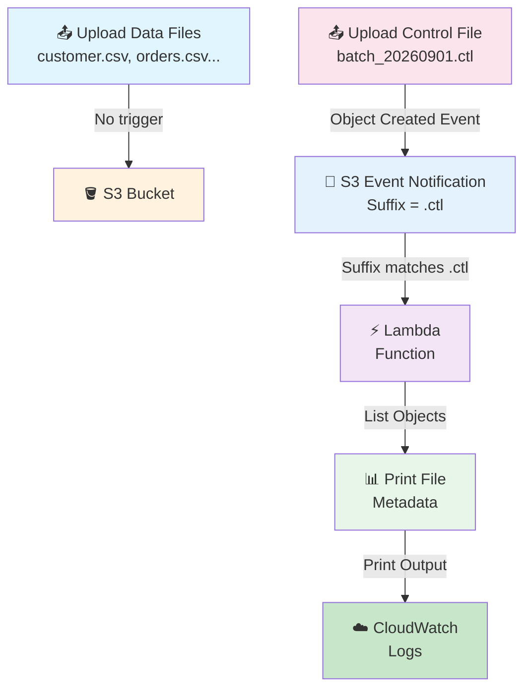
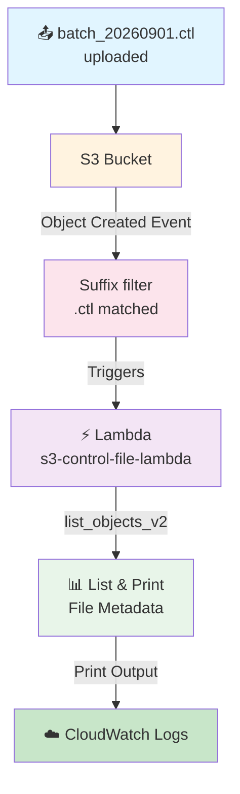

# S3 → Lambda Pipeline — Control File (`.ctl`) Approach

## 🎯 Goal

Suppose an external source system sends **multiple files as one batch** to an S3 bucket:

```text
customer.csv
orders.csv
products.csv
transactions.csv
payments.csv
```

The files do **not** arrive at exactly the same time:

```text
10:00 AM → customer.csv
10:01 AM → orders.csv
10:02 AM → products.csv
10:03 AM → transactions.csv
10:04 AM → payments.csv
```

The main problem:

> **How does Lambda know when the complete batch has arrived?**

If S3 triggers Lambda for **every file upload**, Lambda could be invoked 5 times — even though the requirement is: *"Process the entire batch once, only after all files are present."*

So we use the **Control File (`.ctl`) approach**:

> **Upload all data files first → upload `.ctl` file last → only the `.ctl` upload triggers Lambda → Lambda knows the batch is complete and can start processing.**

## 📌 What Is a Control File?

A control file is a special file that acts as a **signal / flag**:

> **"The files for this batch have been uploaded. You can start processing now."**

Example batch flow:

```text
customer.csv
orders.csv
products.csv
transactions.csv
        ↓
   All uploaded
        ↓
batch_20260901.ctl      ← completion signal (not business data)
        ↓
    "Batch complete"
        ↓
      Lambda
```

### 🚦 Think of `.ctl` as a Green Signal

| File | Meaning |
|------|---------|
| `customer.csv`<br>`orders.csv`<br>`products.csv`... | "Here is the data." |
| `batch_20260901.ctl` | **"The data upload is complete. Start processing."** (GREEN SIGNAL) |

## Architecture



---

## ❌ What Happens Without a Control File?

Suppose S3 is configured for **every object-created event** and 10 files arrive:

```text
file1.csv → Lambda
file2.csv → Lambda
file3.csv → Lambda
    ...
file10.csv → Lambda
```

### Problem 1 — Lambda may process an incomplete batch
When `file1.csv` arrives, Lambda does not know whether `file2.csv`, `file3.csv`... are still coming.

### Problem 2 — Multiple unnecessary Lambda executions
50 files → 50 S3 events → potentially 50 Lambda invocations, when the requirement is: *"Process the entire batch once."*

### Problem 3 — Downstream processing starts too early
If processing needs `customer.csv` + `orders.csv` + `products.csv`, but only `customer.csv` has arrived, processing fails with a **missing file**.

### Problem 4 — Timing-based solutions are unreliable
"Wait 10 minutes after the first file" fails if files take 15 minutes (incomplete batch) or 2 minutes (unnecessary wait). A fixed wait is not a reliable batch-completion signal.

---

## 📌 Required AWS Resources

| Sr. No. | AWS Service | Resource |
| ------- | ----------- | -------- |
| 1 | IAM | Lambda execution role |
| 2 | S3 | One bucket |
| 3 | Lambda | One Lambda function |
| 4 | S3 | Event notification (suffix `.ctl`) |
| 5 | CloudWatch | Lambda logs |

> ⚠️ **Order of creation matters:** IAM role first → S3 bucket → Lambda → Event Notification.

---

## 🔐 Step 1: Create IAM Role (Lambda Execution Role)

1. Open **AWS Management Console**
2. Search for **IAM**
3. Open **IAM** → **Roles**
4. Click **Create role**

### Select Trusted Entity
- Select: **AWS service**
- Use case: **Lambda**
- Click **Next**

### Attach Policies

| Policy | Purpose |
|--------|---------|
| `AmazonS3FullAccess` | Allows Lambda to access objects in S3 (managed policy, fine for this learning project) |
| `AWSLambdaBasicExecutionRole` | Allows Lambda to write execution logs to CloudWatch |

### Name the Role
- Role name: `s3-lambda-control-file-role`
- Click **Create role**

✅ The IAM role is now ready.

---

## 🪣 Step 2: Create S3 Bucket

1. Open **AWS Management Console**
2. Search for **S3** → **Amazon S3**
3. Click **Create bucket**
4. Enter a globally unique name
   - Example: `s3-control-file-demo`
5. Select your required AWS Region
6. Keep remaining settings as default for this practice project
7. Click **Create bucket**

### Expected Bucket Structure (after uploads)

```
s3-control-file-demo
│
├── customer.csv
├── orders.csv
├── products.csv
├── payments.csv
├── transactions.csv
└── batch_20260901.ctl     ← uploaded LAST
```

> The important thing: `batch_20260901.ctl` is uploaded **after** all data files.

---

## 🐍 Step 3: Create Lambda Function

1. Open **AWS Management Console**
2. Search for **Lambda** → **AWS Lambda**
3. Click **Functions** → **Create function**
4. Select: **Author from scratch**

### Configure Lambda

| Setting | Value |
|---------|-------|
| Function name | `s3-control-file-lambda` |
| Runtime | Python 3.x (select latest available) |
| Permissions | **Use an existing role** |

- Execution role: `s3-lambda-control-file-role`
- Click **Create function**

✅ Lambda is created with the IAM role attached.

---

## 💻 Step 4: Lambda Code

The Lambda needs to do two things:

1. Understand **which `.ctl` file** triggered it
2. **List the files** currently in the bucket and print their metadata

Open the Lambda function → **Code** section, replace the existing code with:

```python
import json
import boto3
from urllib.parse import unquote_plus

s3 = boto3.client("s3")


def lambda_handler(event, context):

    print("===== CONTROL FILE RECEIVED =====")

    # Get bucket name from S3 event
    bucket_name = event["Records"][0]["s3"]["bucket"]["name"]

    # Get control file name
    raw_key = event["Records"][0]["s3"]["object"]["key"]
    control_file = unquote_plus(raw_key)

    print(f"Bucket Name  : {bucket_name}")
    print(f"Control File : {control_file}")

    print("===== FILES IN BUCKET =====")

    # List objects in the bucket
    response = s3.list_objects_v2(
        Bucket=bucket_name
    )

    if "Contents" in response:

        for obj in response["Contents"]:

            file_name = obj["Key"]
            file_size = obj["Size"]

            print(f"File Name : {file_name}")
            print(f"File Size : {file_size} bytes")
            print("-------------------------")

    else:
        print("No files found in bucket.")

    return {
        "statusCode": 200,
        "body": json.dumps("Control file processed successfully")
    }
```

Click **Deploy**.

### 🔍 What This Lambda Code Does

When the `.ctl` file arrives (`batch_20260901.ctl`), S3 sends an event to Lambda.

| Part | Code | Purpose |
|------|------|---------|
| Bucket name | `event["Records"][0]["s3"]["bucket"]["name"]` | Extracts bucket → `s3-control-file-demo` |
| Control file | `unquote_plus(event["Records"][0]["s3"]["object"]["key"])` | Extracts + decodes object key → `batch_20260901.ctl` |
| List objects | `s3.list_objects_v2(Bucket=bucket_name)` | Lists every file currently in the bucket |
| Print metadata | `obj["Key"]`, `obj["Size"]` | Prints each file name and size |

---

## ⚡ Step 5: Configure S3 Event Notification (Most Important Configuration)

1. Open **Amazon S3**
2. Click your bucket: `s3-control-file-demo`
3. Go to the **Properties** tab
4. Scroll down to **Event notifications**
5. Click **Create event notification**

### Event Notification Configuration

| Setting | Value | Notes |
|---------|-------|-------|
| Event name | `control-file-trigger` | Descriptive name |
| Prefix | Leave blank | Applies to the whole bucket |
| Suffix | `.ctl` | **Key configuration** |
| Event types | **All object create events** | Reacts to object creation |
| Destination | **Lambda function** | |
| Lambda function | `s3-control-file-lambda` | |

Click **Save changes**.

### 🤔 Why Suffix = `.ctl`?

This tells S3:

> **Only trigger this notification when the uploaded object's name ends with `.ctl`.**

| Uploaded file | Ends with `.ctl`? | Lambda triggered? |
|---------------|-------------------|-------------------|
| `customer.csv` | ❌ NO | ❌ NOT triggered |
| `orders.csv` | ❌ NO | ❌ NOT triggered |
| `products.csv` | ❌ NO | ❌ NOT triggered |
| `payments.csv` | ❌ NO | ❌ NOT triggered |
| `transactions.csv` | ❌ NO | ❌ NOT triggered |
| `batch_20260901.ctl` | ✅ YES | ✅ **TRIGGERED** |

✅ This is the **core** of the control-file pipeline — this is what makes data-file uploads silent and the `.ctl` upload the single trigger.

---

## 🧪 Step 6: Test the Pipeline

### Part 1 — Upload Data Files (no trigger expected)

1. Go to: **S3** → **s3-control-file-demo** → **Objects**
2. Upload files **one by one**:

```text
customer.csv
orders.csv
products.csv
payments.csv
transactions.csv
```

For each file, S3 checks *"Does the file end with `.ctl`?"* → **NO** → Lambda **NOT triggered**. ✅ Expected behavior.

### Part 2 — Upload the Control File (trigger expected)

1. Finally upload:

```text
batch_20260901.ctl
```

2. S3 checks: *"Does the file end with `.ctl`?"* → **YES** ✅



**Key Point:** You don't manually run Lambda — the `.ctl` upload automatically triggers it.

---

## ☁️ Step 7: CloudWatch Logs Verification

1. Open **CloudWatch**
2. Navigate to: **Logs** → **Log groups**
3. Open: `/aws/lambda/s3-control-file-lambda`
4. Open the latest **Log stream**

Expected output:

```text
===== CONTROL FILE RECEIVED =====

Bucket Name  : s3-control-file-demo
Control File : batch_20260901.ctl

===== FILES IN BUCKET =====

File Name : customer.csv
File Size : 12500 bytes
-------------------------

File Name : orders.csv
File Size : 25000 bytes
-------------------------

File Name : products.csv
File Size : 18000 bytes
-------------------------

File Name : payments.csv
File Size : 32000 bytes
-------------------------

File Name : transactions.csv
File Size : 45000 bytes
-------------------------

File Name : batch_20260901.ctl
File Size : 120 bytes
-------------------------
```

✅ The control file was received and Lambda confirmed the full batch is available.

---

## ⚖️ Without Control File vs With Control File

| Without Control File | With Control File |
|----------------------|-------------------|
| Every file can trigger Lambda | Only `.ctl` triggers Lambda |
| Lambda may run for every upload | Lambda runs once when `.ctl` arrives |
| Difficult to know batch completion | `.ctl` indicates batch completion |
| Can process incomplete batch | Processing starts after control signal |
| More Lambda invocations | Fewer unnecessary invocations |
| Timing/order needs extra handling | Source system explicitly signals completion |

---

## 🎤 Interview Explanation

**Q: "Why did you use a control file?"**

> **"We receive multiple files as a batch in an S3 bucket. We don't want Lambda to trigger for every individual file because the batch may still be incomplete. So we use a control file with a `.ctl` extension. The source system uploads all the data files first and uploads the `.ctl` file at the end to indicate that the batch is complete. In S3 Event Notifications, we configure a suffix filter of `.ctl`, so only the control file upload triggers Lambda. Lambda then receives the S3 event and can list and process the files belonging to that batch."**

### ⭐ Key Concept (One Sentence)

> **The `.ctl` file acts as a completion signal for a batch of files, and S3 is configured with a `.ctl` suffix filter so that Lambda is triggered only when the control file is uploaded.**

### ⚠️ Important Practical Point (Next Level)

The `.ctl` file tells Lambda **that the batch is complete**, but S3 itself does **not** know which files belong to that batch. In a real production pipeline, the `.ctl` file often contains information such as:
- Expected file names
- File count
- Batch ID
- Date

Lambda can then **validate** that the expected files actually exist before processing them. That is the natural next level of this pipeline.

---

## Summary

| Component | Purpose |
|-----------|---------|
| **IAM Role** | Gives Lambda permissions for S3 and CloudWatch logs |
| **S3 Bucket** | Stores the data files and the `.ctl` control file |
| **S3 Event Notification** | Suffix filter `.ctl` — fires only on control-file uploads |
| **Lambda Function** | Reads the `.ctl` event, lists bucket files, prints metadata |
| **CloudWatch Logs** | Displays Lambda output and debugging info |

This pipeline demonstrates how a **control file (`green signal`)** solves the **batch-completion detection** problem in event-driven AWS architectures.
