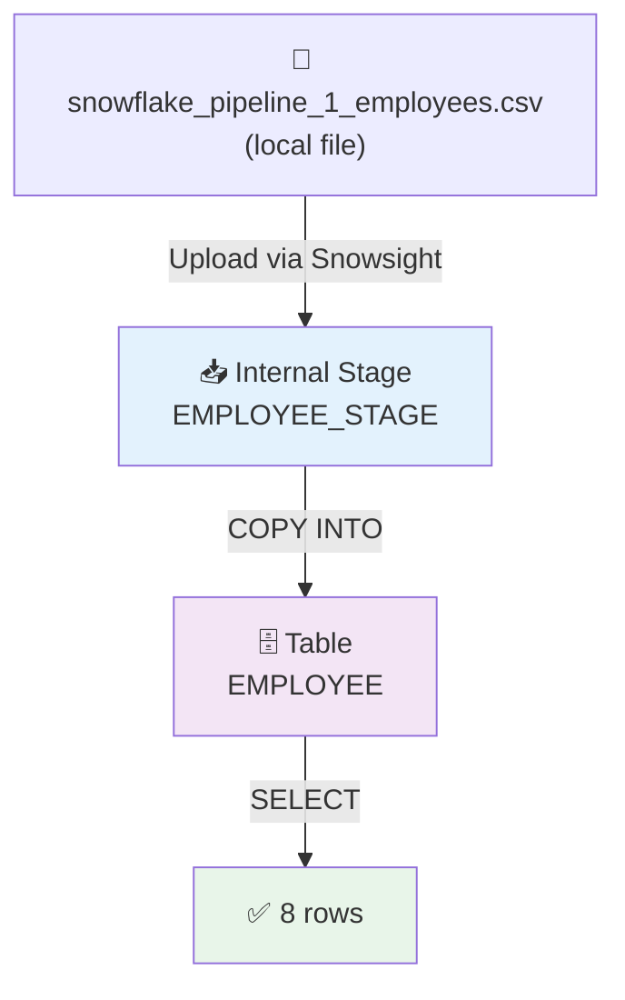

# 50) Snowflake — Basic CSV Batch Load Pipeline

## 📁 Files in This Folder

| File | What It Is |
| ---- | ---------- |
| [00) README.md](00%29%20README.md) | This explanation |
| [input file/snowflake_pipeline_1_employees.csv](input%20file/snowflake_pipeline_1_employees.csv) | The 8-row source CSV loaded into Snowflake |
| [snowflake.sql](snowflake.sql) | Every SQL statement for this pipeline in one file, ready to paste into a Snowflake worksheet |

This pipeline uses **only Snowflake**. There is no AWS, no Lambda and no IAM role here.

## 🎯 Goal

You have one CSV file on your computer. This pipeline puts that file into a real Snowflake table. This is the normal way to do it:



## 🧱 The Objects We Create

| Object | Name | What it is for |
| ------ | ---- | ------------- |
| Database | `SNOWFLAKE_PRACTICE` | The big box that holds everything below |
| Schema | `EMPLOYEE_SCHEMA` | A folder that keeps this project's objects together |
| Warehouse | `PRACTICE_WH` | The machine that runs the SQL and does the loading |
| Table | `EMPLOYEE` | Where the rows end up |
| File Format | `EMPLOYEE_CSV_FORMAT` | Tells Snowflake how to read the CSV |
| Stage | `EMPLOYEE_STAGE` | A landing spot for the file *inside* Snowflake |

Do it in this order: **Database → Schema → Warehouse → Table → File Format → Stage → Upload → COPY INTO → Verify**

---

## 🗄️ Step 1 — Create the Database

```sql
CREATE DATABASE SNOWFLAKE_PRACTICE;

USE DATABASE SNOWFLAKE_PRACTICE;
```

---

## 📂 Step 2 — Create the Schema

```sql
CREATE SCHEMA EMPLOYEE_SCHEMA;

USE SCHEMA EMPLOYEE_SCHEMA;
```

The hierarchy so far:

```text
SNOWFLAKE_PRACTICE
└── EMPLOYEE_SCHEMA
```

---

## ⚙️ Step 3 — Create the Warehouse

The warehouse is the machine that runs your SQL. Without it, nothing runs. If you already have one, you can skip this step.

```sql
CREATE WAREHOUSE PRACTICE_WH
    WAREHOUSE_SIZE = XSMALL
    AUTO_SUSPEND = 60
    AUTO_RESUME = TRUE;

USE WAREHOUSE PRACTICE_WH;
```

| Setting | What it does |
| -------- | ------ |
| `WAREHOUSE_SIZE = XSMALL` | The smallest and cheapest size. It is enough for practice |
| `AUTO_SUSPEND = 60` | It goes to sleep after 60 seconds of no use, so you stop paying |
| `AUTO_RESUME = TRUE` | It wakes up by itself the next time you run a query |

> 📌 The warehouse is **not** inside the database. It sits at the account level, and its job is to run queries on your data.

---

## 📋 Step 4 — Create the Table

The table columns must match the CSV columns:

| CSV column | Table column | Data Type |
| ---------- | ------------ | --------- |
| `employee_id` | `EMPLOYEE_ID` | `NUMBER(10,0)` |
| `employee_name` | `EMPLOYEE_NAME` | `VARCHAR(100)` |
| `email` | `EMAIL` | `VARCHAR(200)` |
| `country` | `COUNTRY` | `VARCHAR(50)` |
| `joining_date` | `JOINING_DATE` | `DATE` |
| `salary` | `SALARY` | `NUMBER(12,2)` |

```sql
CREATE TABLE EMPLOYEE (
    EMPLOYEE_ID   NUMBER(10,0),
    EMPLOYEE_NAME VARCHAR(100),
    EMAIL         VARCHAR(200),
    COUNTRY       VARCHAR(50),
    JOINING_DATE  DATE,
    SALARY        NUMBER(12,2)
);
```

Check it:

```sql
DESC TABLE EMPLOYEE;
```

You should see six rows, one for each column:

```text
EMPLOYEE_ID
EMPLOYEE_NAME
EMAIL
COUNTRY
JOINING_DATE
SALARY
```

---

## 📄 Step 5 — Create the File Format

The file format tells Snowflake how to read the CSV. You write the rules once here, instead of repeating them in every `COPY INTO`.

```sql
CREATE FILE FORMAT EMPLOYEE_CSV_FORMAT
    TYPE = CSV
    FIELD_DELIMITER = ','
    SKIP_HEADER = 1
    FIELD_OPTIONALLY_ENCLOSED_BY = '"'
    DATE_FORMAT = 'YYYY-MM-DD';
```

| Option | What it means |
| ------ | ------------- |
| `TYPE = CSV` | The file is plain text with separators |
| `FIELD_DELIMITER = ','` | Commas separate the columns |
| `SKIP_HEADER = 1` | Skip the first line. `employee_id,employee_name,…` is only a title line, not real data |
| `FIELD_OPTIONALLY_ENCLOSED_BY = '"'` | A value may be wrapped in double quotes. This matters when the value itself contains a comma |
| `DATE_FORMAT = 'YYYY-MM-DD'` | Read `2026-09-01` as a date |

Check it:

```sql
DESC FILE FORMAT EMPLOYEE_CSV_FORMAT;
```

---

## 📥 Step 6 — Create the Internal Stage

A stage is a landing spot for files **inside** Snowflake. This stage is an *internal* stage, so the file stays in Snowflake's own storage and never leaves your account.

```sql
CREATE STAGE EMPLOYEE_STAGE
    FILE_FORMAT = EMPLOYEE_CSV_FORMAT;
```

Check it:

```sql
SHOW STAGES;
```

The moving parts are now in place:

```text
EMPLOYEE_SCHEMA
│
├── EMPLOYEE_STAGE        ← the file lands here
├── EMPLOYEE_CSV_FORMAT   ← the rules for reading it
└── EMPLOYEE              ← the data lands here

PRACTICE_WH               ← account-level compute, outside the schema
```

> 📌 The `FILE_FORMAT` on the stage is only a default. `LIST @EMPLOYEE_STAGE` and `COPY INTO` use it by themselves, so you do not have to type it again every time.

---

## ⬆️ Step 7 — Upload the CSV to the Stage

Source file: [input file/snowflake_pipeline_1_employees.csv](input%20file/snowflake_pipeline_1_employees.csv)

In Snowsight:

```text
Data → Databases → SNOWFLAKE_PRACTICE → EMPLOYEE_SCHEMA → Stages → EMPLOYEE_STAGE → Upload
```

Upload `snowflake_pipeline_1_employees.csv`. Then check that it arrived:

```sql
LIST @EMPLOYEE_STAGE;
```

You should see the file in the list, with its size and a hash value. The `_staged` path next to it is the real place where the file is kept inside Snowflake.

---

## 🚚 Step 8 — Load the CSV into the Table

This is the main command of the whole pipeline:

```sql
COPY INTO EMPLOYEE
FROM @EMPLOYEE_STAGE
FILE_FORMAT = (FORMAT_NAME = 'EMPLOYEE_CSV_FORMAT');
```

Snowflake reads every file in the stage and adds the rows:

```text
@EMPLOYEE_STAGE (CSV)  →  COPY INTO  →  EMPLOYEE table
```

The output tells you exactly what happened:

| Column | What it tells you |
| ------ | ------- |
| `file` | Which file from the stage was read |
| `status` | `LOADED` means it worked |
| `rows_parsed` | How many rows Snowflake read from the file |
| `rows_loaded` | How many rows were really saved into the table |
| `errors_seen` | If this is not `0`, some rows were rejected |

> ⚠️ `COPY INTO` is **not** a normal insert that you can run again and again. Snowflake remembers the files it has already loaded, for about 64 days. So if you run the same command again, it loads **0 rows**. To load the same file again, add `FORCE = TRUE`, or upload the file with a new name.

Other useful versions:

```sql
-- read the file and show errors, but save no rows
COPY INTO EMPLOYEE
FROM @EMPLOYEE_STAGE
VALIDATION_MODE = RETURN_ERRORS;

-- load the rows, and delete the file from the stage at the same time
COPY INTO EMPLOYEE
FROM @EMPLOYEE_STAGE
FILE_FORMAT = (FORMAT_NAME = 'EMPLOYEE_CSV_FORMAT')
PURGE = TRUE;
```

---

## ✅ Step 9 — Verify the Load

```sql
SELECT * FROM EMPLOYEE;
```

You should see all 8 rows:

```text
EMPLOYEE_ID | EMPLOYEE_NAME | EMAIL                    | COUNTRY | JOINING_DATE | SALARY
------------+---------------+--------------------------+---------+--------------+-------
1001        | Rahul Sharma  | rahul.sharma@example.com | India   | 2026-09-01   | 75000
1002        | Priya Patil   | priya.patil@example.com  | India   | 2026-09-03   | 62000
1003        | Amit Verma    | amit.verma@example.com   | India   | 2026-09-05   | 58000
1004        | Sneha Joshi   | sneha.joshi@example.com  | India   | 2026-09-07   | 91000
1005        | Vikas Kumar   | vikas.kumar@example.com  | India   | 2026-09-10   | 67000
1006        | Neha Singh    | neha.singh@example.com   | India   | 2026-09-12   | 83000
1007        | Arjun Mehta   | arjun.mehta@example.com  | India   | 2026-09-15   | 54000
1008        | Pooja Desai   | pooja.desai@example.com  | India   | 2026-09-18   | 72000
```

Row count:

```sql
SELECT COUNT(*) FROM EMPLOYEE;
```

Expected:

```text
8
```

> 📌 If `COUNT(*)` returns `0`, it usually means `COPY INTO` found no files. Run `LIST @EMPLOYEE_STAGE` to check the file is really there.

---

## 📦 Step 10 — The Stage Still Holds the File

```sql
LIST @EMPLOYEE_STAGE;
```

The file is still in the stage after a successful load. Remember this:

> **`COPY INTO` copies data from the stage into the table. It never deletes the staged file.**

That is why a stage is safe to keep: if you ever drop the table, the file is still there and you can load it again. Add `PURGE = TRUE` to `COPY INTO` when you *do* want the file deleted after loading.

---

## 🕘 Step 11 — Check the Load History

Snowflake records every `COPY INTO`. So you can always check what was loaded, and when:

```sql
SELECT *
FROM TABLE(
    INFORMATION_SCHEMA.COPY_HISTORY(
        TABLE_NAME => 'SNOWFLAKE_PRACTICE.EMPLOYEE_SCHEMA.EMPLOYEE',
        START_TIME => DATEADD(DAY, -1, CURRENT_TIMESTAMP())
    )
);
```

The most useful columns are `FILE_NAME`, `STATUS`, `ROW_COUNT`, `ROW_PARSED` and `FIRST_ERROR_MESSAGE`.

> 📌 `COPY_HISTORY` shows only the time range you give it. If you did the load on an earlier day, make the range bigger — for example `-7` or `-30` days.

---

## ⚠️ Common Errors

| Error | Why it happens | How to fix it |
| ----- | ----- | --- |
| `Object does not exist` on `COPY INTO` | Snowflake is not pointed at the right database or schema | Run the `USE DATABASE` / `USE SCHEMA` lines again |
| `No files were found` | No file was uploaded, or the file went into a sub-folder of the stage | Run `LIST @EMPLOYEE_STAGE` to see the real path |
| `Number of columns in file does not match the table` | The table and the CSV do not have the same columns | Compare them with the table in Step 4 |
| Date parsing error | The dates in the CSV do not match the file format | Check `DATE_FORMAT = 'YYYY-MM-DD'` in Step 5 |
| `rows_loaded = 0` on a second run | Snowflake already loaded that file before | Use `FORCE = TRUE`, or a new file name |
| `Insufficient privileges` | Your role is not allowed to work on this database or schema | Use a role with `USAGE`/`CREATE` rights, for example `ACCOUNTADMIN` |

When something looks wrong, this is the fastest way to find out why. It reads the file and shows the errors, but **saves no rows**:

```sql
COPY INTO EMPLOYEE
FROM @EMPLOYEE_STAGE
VALIDATION_MODE = RETURN_ERRORS;
```

---

## ⭐ What to Take Away

| Object | What it does |
| ------ | ---- |
| **Database** | The big box that holds all your objects |
| **Schema** | A folder inside the database, for tables, stages and formats |
| **Warehouse** | The machine that runs the SQL. It is the only part you pay for |
| **Table** | Where the rows finally live |
| **File Format** | The reading rules for the CSV, written once |
| **Stage** | A landing spot for files inside Snowflake |
| **COPY INTO** | Moves the file's data from the stage into the table |

The mental model to keep:

```text
Warehouse  = the machine that runs SQL
Database   = the big box
Schema     = a folder
Stage      = an inbox
Table      = the final place for the data
COPY INTO  = the loader that moves data from the stage into the table
```

The next pipeline is [51) Snowflake — Multi-File CSV Batch Load Pipeline](../51%29%20Snowflake%20Multi-File%20CSV%20Batch%20Load%20Pipeline/00%29%20README.md). It loads five CSV files using this exact same setup.
