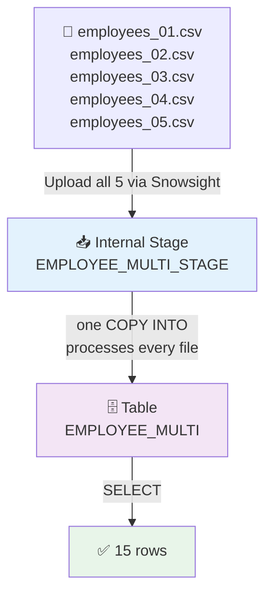

# 51) Snowflake — Multi-File CSV Batch Load Pipeline

## 📁 Files in This Folder

| File | What It Is |
| ---- | ---------- |
| [00) README.md](00%29%20README.md) | This explanation |
| [input file/](input%20file/) | Five CSVs — `employees_01.csv` … `employees_05.csv` |

## 🎯 Goal

Pipeline 50 loaded **one** CSV file. Here the same idea is used with **five** CSV files. One single `COPY INTO` loads all five, which is 15 rows in one command.

## 📦 The Input Files

Five files, three employees in each file = **15 rows**:

```text
employees_01.csv   →   2001–2003
employees_02.csv   →   2004–2006
employees_03.csv   →   2007–2009
employees_04.csv   →   2010–2012
employees_05.csv   →   2013–2015
```

All five files have the same first line and the same columns:

```text
employee_id, employee_name, email, country, department, joining_date, salary
```

The only differences from Pipeline 50 are the extra `department` column and the number of files.

> 📌 We build a **completely new** setup here (database, schema, warehouse, table, format, stage), instead of reusing Pipeline 50's objects. This way you practise the whole setup a second time, and the two pipelines never mix.

## 🧱 The Objects We Create

| Object | Name | What it is for |
| ------ | ---- | ------------- |
| Database | `SNOWFLAKE_MULTI_FILE_PRACTICE` | The big box that holds everything below |
| Schema | `MULTI_FILE_SCHEMA` | A folder that keeps this pipeline's objects together |
| Warehouse | `MULTI_FILE_WH` | The machine that runs the load |
| Table | `EMPLOYEE_MULTI` | Where all 15 rows end up |
| File Format | `EMPLOYEE_MULTI_CSV_FORMAT` | Tells Snowflake how to read the CSV files |
| Stage | `EMPLOYEE_MULTI_STAGE` | Holds all five files at the same time |

Do it in this order: **Database → Schema → Warehouse → Table → File Format → Stage → Upload ×5 → COPY INTO → Verify**



---

## 🗄️ Step 1 — Create the Database

```sql
CREATE DATABASE SNOWFLAKE_MULTI_FILE_PRACTICE;

USE DATABASE SNOWFLAKE_MULTI_FILE_PRACTICE;
```

---

## 📂 Step 2 — Create the Schema

```sql
CREATE SCHEMA MULTI_FILE_SCHEMA;

USE SCHEMA MULTI_FILE_SCHEMA;
```

The hierarchy so far:

```text
SNOWFLAKE_MULTI_FILE_PRACTICE
└── MULTI_FILE_SCHEMA
```

---

## ⚙️ Step 3 — Create the Warehouse

```sql
CREATE WAREHOUSE MULTI_FILE_WH
    WAREHOUSE_SIZE = XSMALL
    AUTO_SUSPEND = 60
    AUTO_RESUME = TRUE;

USE WAREHOUSE MULTI_FILE_WH;
```

> 📌 A warehouse sits at the account level, not inside the database. One warehouse can serve many pipelines. This exercise creates its own just so you practise the full setup.

---

## 📋 Step 4 — Create the Table

Notice the extra `DEPARTMENT` column, which Pipeline 50 did not have:

| CSV column | Table column | Data Type |
| ---------- | ------------ | --------- |
| `employee_id` | `EMPLOYEE_ID` | `NUMBER(10,0)` |
| `employee_name` | `EMPLOYEE_NAME` | `VARCHAR(100)` |
| `email` | `EMAIL` | `VARCHAR(200)` |
| `country` | `COUNTRY` | `VARCHAR(50)` |
| `department` | `DEPARTMENT` | `VARCHAR(50)` |
| `joining_date` | `JOINING_DATE` | `DATE` |
| `salary` | `SALARY` | `NUMBER(12,2)` |

```sql
CREATE TABLE EMPLOYEE_MULTI (
    EMPLOYEE_ID   NUMBER(10,0),
    EMPLOYEE_NAME VARCHAR(100),
    EMAIL         VARCHAR(200),
    COUNTRY       VARCHAR(50),
    DEPARTMENT    VARCHAR(50),
    JOINING_DATE  DATE,
    SALARY        NUMBER(12,2)
);
```

Check it:

```sql
DESC TABLE EMPLOYEE_MULTI;
```

---

## 📄 Step 5 — Create the File Format

One file format is enough for all five files, because they all have the same columns and the same first line:

```sql
CREATE FILE FORMAT EMPLOYEE_MULTI_CSV_FORMAT
    TYPE = CSV
    FIELD_DELIMITER = ','
    SKIP_HEADER = 1
    FIELD_OPTIONALLY_ENCLOSED_BY = '"'
    DATE_FORMAT = 'YYYY-MM-DD';
```

Check it:

```sql
DESC FILE FORMAT EMPLOYEE_MULTI_CSV_FORMAT;
```

> 📌 `SKIP_HEADER = 1` matters even more here than in Pipeline 50. All five files have a first line with column names, and Snowflake skips it in **each** file. That is why you get 15 rows and not 20.

---

## 📥 Step 6 — Create the Internal Stage

```sql
CREATE STAGE EMPLOYEE_MULTI_STAGE
    FILE_FORMAT = EMPLOYEE_MULTI_CSV_FORMAT;
```

Check it:

```sql
SHOW STAGES;
```

The layout inside the schema:

```text
MULTI_FILE_SCHEMA
│
├── EMPLOYEE_MULTI_STAGE        ← all 5 files land here
├── EMPLOYEE_MULTI_CSV_FORMAT   ← the rules for reading them
└── EMPLOYEE_MULTI              ← all 15 rows land here

MULTI_FILE_WH                   ← account-level compute
```

---

## ⬆️ Step 7 — Upload All 5 CSV Files

Source folder: [input file/](input%20file/)

In Snowsight:

```text
Data → Databases → SNOWFLAKE_MULTI_FILE_PRACTICE → MULTI_FILE_SCHEMA → Stages → EMPLOYEE_MULTI_STAGE → Upload
```

Upload **all five** files: `employees_01.csv` … `employees_05.csv`.

> ⚠️ Upload the files into the stage **root**. If they go into a sub-folder such as `employees/`, the plain `COPY INTO` in Step 9 will not find them. You would need `FROM @EMPLOYEE_MULTI_STAGE/employees/` instead.

---

## 🔍 Step 8 — Verify All 5 Files

```sql
LIST @EMPLOYEE_MULTI_STAGE;
```

You should see five lines, one for each file:

```text
employees_01.csv
employees_02.csv
employees_03.csv
employees_04.csv
employees_05.csv
```

Now the stage holds a **list of files** instead of one file. That is the whole difference from Pipeline 50:

```text
Pipeline 50                       Pipeline 51
───────────                       ───────────
   1 file                            5 files
     ↓                                 ↓
   Stage                             Stage
     ↓                                 ↓
 COPY INTO                         COPY INTO   ← still one call
     ↓                                 ↓
  8 rows                            15 rows
```

---

## 🚚 Step 9 — Load All 5 Files

Now run:

```sql
COPY INTO EMPLOYEE_MULTI
FROM @EMPLOYEE_MULTI_STAGE
FILE_FORMAT = (
    FORMAT_NAME = 'EMPLOYEE_MULTI_CSV_FORMAT'
);
```

Snowflake finds the CSV files in the stage and loads them into the table.

---

## ✅ Step 10 — Verify the Data

```sql
SELECT * FROM EMPLOYEE_MULTI ORDER BY EMPLOYEE_ID;
```

You should see all 15 rows, exactly as they are in the five input files:

```text
EMPLOYEE_ID | EMPLOYEE_NAME | EMAIL                     | COUNTRY | DEPARTMENT | JOINING_DATE | SALARY
------------+---------------+---------------------------+---------+------------+--------------+-------
2001        | Aarav Shah    | aarav.shah@example.com    | India   | IT         | 2026-09-01   | 70000
2002        | Isha Kulkarni | isha.kulkarni@example.com | India   | HR         | 2026-09-02   | 62000
2003        | Rohan Patil   | rohan.patil@example.com   | India   | Finance    | 2026-09-03   | 68000
2004        | Ananya Joshi  | ananya.joshi@example.com  | India   | IT         | 2026-09-04   | 82000
2005        | Vivek Singh   | vivek.singh@example.com   | India   | Sales      | 2026-09-05   | 59000
2006        | Meera Desai   | meera.desai@example.com   | India   | HR         | 2026-09-06   | 65000
2007        | Karan Mehta   | karan.mehta@example.com   | India   | Finance    | 2026-09-07   | 76000
2008        | Neha Verma    | neha.verma@example.com    | India   | IT         | 2026-09-08   | 88000
2009        | Aditya Rao    | aditya.rao@example.com    | India   | Sales      | 2026-09-09   | 61000
2010        | Sneha Nair    | sneha.nair@example.com    | India   | HR         | 2026-09-10   | 67000
2011        | Manish Gupta  | manish.gupta@example.com  | India   | IT         | 2026-09-11   | 91000
2012        | Pooja Patil   | pooja.patil@example.com   | India   | Finance    | 2026-09-12   | 73000
2013        | Rahul More    | rahul.more@example.com    | India   | Sales      | 2026-09-13   | 64000
2014        | Priya Shah    | priya.shah@example.com    | India   | IT         | 2026-09-14   | 85000
2015        | Sagar Joshi   | sagar.joshi@example.com   | India   | Finance    | 2026-09-15   | 79000
```

Row count:

```sql
SELECT COUNT(*) FROM EMPLOYEE_MULTI;
```

Expected:

```text
15
```

> 📌 The answer is `15` (5 files × 3 rows), not `20`. This proves that `SKIP_HEADER = 1` was used on **every** file, and not only on the first one.

---

## 🏷️ Step 11 — Which File Did Each Row Come From?

Every loaded row remembers which file it came from. This is the most useful trick when you need to debug a multi-file load:

```sql
SELECT
    METADATA$FILENAME        AS SOURCE_FILE,
    METADATA$FILE_ROW_NUMBER AS ROW_IN_FILE,
    EMPLOYEE_ID,
    EMPLOYEE_NAME
FROM EMPLOYEE_MULTI
ORDER BY SOURCE_FILE, EMPLOYEE_ID;
```

That shows you which row came from which file:

```text
SOURCE_FILE        | EMPLOYEE_ID | EMPLOYEE_NAME
-------------------+-------------+--------------
employees_01.csv   | 2001        | Aarav Shah
employees_01.csv   | 2002        | Isha Kulkarni
employees_01.csv   | 2003        | Rohan Patil
employees_02.csv   | 2004        | Ananya Joshi
employees_02.csv   | 2005        | Vivek Singh
employees_02.csv   | 2006        | Meera Desai
...
```

You can also read the same details straight from the stage, before you load anything at all:

```sql
SELECT METADATA$FILENAME, METADATA$FILE_ROW_NUMBER
FROM @EMPLOYEE_MULTI_STAGE;
```

| Metadata column | What it tells you |
| --------------- | --------- |
| `METADATA$FILENAME` | The full path of the file the row came from |
| `METADATA$FILE_ROW_NUMBER` | The row's position inside that file |
| `METADATA$FILE_LAST_MODIFIED` | When that file was last changed |
| `METADATA$FILE_CONTENT_KEY` | A checksum of that file |

> 📌 `FILE_ROW_NUMBER` is the row's position in the file, and the first line is the header. So do not assume that the first data row is `1`. Read the value instead of guessing a fixed number.

---

## 🕘 Step 12 — Check the COPY History

```sql
SELECT
    FILE_NAME,
    STATUS,
    ROW_COUNT,
    ROW_PARSED,
    FIRST_ERROR_MESSAGE
FROM TABLE(
    INFORMATION_SCHEMA.COPY_HISTORY(
        TABLE_NAME => 'SNOWFLAKE_MULTI_FILE_PRACTICE.MULTI_FILE_SCHEMA.EMPLOYEE_MULTI',
        START_TIME => DATEADD(HOUR, -1, CURRENT_TIMESTAMP())
    )
)
ORDER BY LAST_LOAD_TIME;
```

You should see **five rows**, one for each file. Each row should have `STATUS = LOADED` and `ROW_COUNT = 3`. This proves that one single `COPY INTO` really did load all five files.

> 📌 `COPY_HISTORY` shows only the time range you give it. If you did the load more than an hour ago, make the range bigger — for example `-7` or `-30` days.

---

## ⚠️ Common Errors

| Error | Why it happens | How to fix it |
| ----- | ----- | --- |
| `rows_loaded = 0` | `COPY INTO` found no files. Usually they were uploaded into a sub-folder | Run `LIST @EMPLOYEE_MULTI_STAGE` and fix the upload location or the stage path |
| Only 3 of 5 files loaded | The other files were uploaded after `COPY INTO` ran | Just run `COPY INTO` again. New files get loaded, old ones are skipped |
| `COUNT(*)` = 20 instead of 15 | `SKIP_HEADER = 1` is missing from the file format | Add it, then load again with `FORCE = TRUE` |
| The load stops because of one bad row | The default setting is `ON_ERROR = 'ABORT_STATEMENT'` | Use `VALIDATION_MODE = RETURN_ERRORS` to find the row, or `ON_ERROR = 'CONTINUE'` to skip it |
| `Number of columns in file does not match the table` | One file has different columns. The extra `department` column is the usual reason | Compare it with the table in Step 4 |
| The second run loads nothing | Snowflake already loaded those exact files | Use `FORCE = TRUE`, or upload the files with new names |

---

## ⭐ What to Take Away

| Idea | What to remember |
| ------- | ----- |
| **One stage, many files** | A stage is like a folder. `COPY INTO` reads every file inside it |
| **One `COPY INTO`, many files** | You need no loop. Snowflake reads all the files in the stage for you |
| **One file format for all** | This is safe only because all the files have the same columns and the same first line |
| **`SKIP_HEADER = 1`** | It is used for each file, which is why the count stays at 15 |
| **Load memory** | Snowflake remembers the files it loaded, so a second run skips them instead of adding the rows twice |
| **`METADATA$FILENAME`** | Tells you exactly which file each row came from |
| **`COPY_HISTORY`** | Shows what was loaded, when, and whether any rows failed |

The two pipelines side by side:

```text
Pipeline 50                        Pipeline 51
───────────                        ───────────
1 file  → stage                    5 files → stage
        → COPY INTO                        → COPY INTO
        → 8 rows                           → 15 rows
```

The next step after this is automating the file arriving in the stage, instead of uploading it by hand — for example an external stage pointing at S3.
