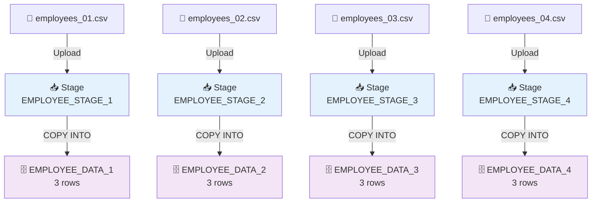

# 51) Snowflake — Multiple CSV to Multiple Tables

## 📁 Files in This Folder

| File | What It Is |
| ---- | ---------- |
| [00) README.md](00%29%20README.md) | This explanation |
| [input file/](input%20file/) | Four CSVs — `employees_01.csv` … `employees_04.csv` |
| [snowflake.sql](snowflake.sql) | Every SQL statement for this pipeline in one file, ready to paste into a Snowflake worksheet |

## 🎯 Goal

The other demo in this folder (`01) Multiple CSV into 1 table`) put **five** files into **one** stage and loaded all of them into **one** table with **one** `COPY INTO`.

Here only one thing changes: **every file gets its own stage, and every stage gets its own table.**

```text
4 files   →   4 stages   →   4 tables
4 stages  →   4 COPY INTO statements
3 rows per file   →   12 rows in total
```

> 📌 Use this pattern when the files hold **different kinds of data** that must stay apart — for example `employees.csv`, `salaries.csv`, `departments.csv` and `attendance.csv`. When each file has its own stage, the files can never get mixed up.

## 📦 The Input Files

Four files, three employees in each file:

```text
employees_01.csv   →   EMPLOYEE_STAGE_1   →   EMPLOYEE_DATA_1   →   3001–3003
employees_02.csv   →   EMPLOYEE_STAGE_2   →   EMPLOYEE_DATA_2   →   3004–3006
employees_03.csv   →   EMPLOYEE_STAGE_3   →   EMPLOYEE_DATA_3   →   3007–3009
employees_04.csv   →   EMPLOYEE_STAGE_4   →   EMPLOYEE_DATA_4   →   3010–3012
```

All four files have the same first line and the same columns:

```text
employee_id, employee_name, email, country, department, joining_date, salary
```

> 📌 The files look exactly like the ones in `01)`, but they hold different rows. The lesson in this demo is **where each file goes**, not what is inside it.

## 🧱 The Objects We Create

| Object | Name | What it is for |
| ------ | ---- | ------------- |
| Database | `MULTI_TABLE_LOAD_DB` | The big box that holds everything below |
| Schema | `EMPLOYEE_LOAD_SCHEMA` | A folder that keeps this pipeline's objects together |
| Warehouse | `EMPLOYEE_LOAD_WH` | The machine that runs the loads |
| Table | `EMPLOYEE_DATA_1` … `EMPLOYEE_DATA_4` | Four tables — one for each file |
| File Format | `EMPLOYEE_CSV_FORMAT` | Tells Snowflake how to read the CSV files. One format is enough for all four |
| Stage | `EMPLOYEE_STAGE_1` … `EMPLOYEE_STAGE_4` | Four landing spots — one for each file |

> 📌 The numbers line up on purpose: `employees_0N.csv` goes into `EMPLOYEE_STAGE_N`, and then into `EMPLOYEE_DATA_N`. One look at a name tells you which file it belongs to.

Do it in this order: **Database → Schema → Warehouse → Table ×4 → File Format → Stage ×4 → Upload ×4 → COPY INTO ×4 → Verify**



---

## 🗄️ Step 1 — Create the Database

```sql
CREATE DATABASE MULTI_TABLE_LOAD_DB;

USE DATABASE MULTI_TABLE_LOAD_DB;
```

---

## 📂 Step 2 — Create the Schema

```sql
CREATE SCHEMA EMPLOYEE_LOAD_SCHEMA;

USE SCHEMA EMPLOYEE_LOAD_SCHEMA;
```

The hierarchy so far:

```text
MULTI_TABLE_LOAD_DB
└── EMPLOYEE_LOAD_SCHEMA
```

---

## ⚙️ Step 3 — Create the Warehouse

```sql
CREATE WAREHOUSE EMPLOYEE_LOAD_WH
    WAREHOUSE_SIZE = XSMALL
    AUTO_SUSPEND = 60
    AUTO_RESUME = TRUE;

USE WAREHOUSE EMPLOYEE_LOAD_WH;
```

> 📌 A warehouse sits at the account level, not inside the database. One warehouse can serve many pipelines. The same `EMPLOYEE_LOAD_WH` runs all four loads in this demo.

---

## 📋 Step 4 — Create the Four Tables

All four tables have the same columns, because all four files have the same columns:

| CSV column | Table column | Data Type |
| ---------- | ------------ | --------- |
| `employee_id` | `EMPLOYEE_ID` | `NUMBER(10,0)` |
| `employee_name` | `EMPLOYEE_NAME` | `VARCHAR(100)` |
| `email` | `EMAIL` | `VARCHAR(200)` |
| `country` | `COUNTRY` | `VARCHAR(50)` |
| `department` | `DEPARTMENT` | `VARCHAR(50)` |
| `joining_date` | `JOINING_DATE` | `DATE` |
| `salary` | `SALARY` | `NUMBER(12,2)` |

```sql
CREATE TABLE EMPLOYEE_DATA_1 (
    EMPLOYEE_ID   NUMBER(10,0),
    EMPLOYEE_NAME VARCHAR(100),
    EMAIL         VARCHAR(200),
    COUNTRY       VARCHAR(50),
    DEPARTMENT    VARCHAR(50),
    JOINING_DATE  DATE,
    SALARY        NUMBER(12,2)
);

SELECT * FROM EMPLOYEE_DATA_1;
```

The same statement three more times. Only the last character of the name changes:

```sql
CREATE TABLE EMPLOYEE_DATA_2 (
    EMPLOYEE_ID   NUMBER(10,0),
    EMPLOYEE_NAME VARCHAR(100),
    EMAIL         VARCHAR(200),
    COUNTRY       VARCHAR(50),
    DEPARTMENT    VARCHAR(50),
    JOINING_DATE  DATE,
    SALARY        NUMBER(12,2)
);

SELECT * FROM EMPLOYEE_DATA_2;
```

```sql
CREATE TABLE EMPLOYEE_DATA_3 (
    EMPLOYEE_ID   NUMBER(10,0),
    EMPLOYEE_NAME VARCHAR(100),
    EMAIL         VARCHAR(200),
    COUNTRY       VARCHAR(50),
    DEPARTMENT    VARCHAR(50),
    JOINING_DATE  DATE,
    SALARY        NUMBER(12,2)
);

SELECT * FROM EMPLOYEE_DATA_3;
```

```sql
CREATE TABLE EMPLOYEE_DATA_4 (
    EMPLOYEE_ID   NUMBER(10,0),
    EMPLOYEE_NAME VARCHAR(100),
    EMAIL         VARCHAR(200),
    COUNTRY       VARCHAR(50),
    DEPARTMENT    VARCHAR(50),
    JOINING_DATE  DATE,
    SALARY        NUMBER(12,2)
);

SELECT * FROM EMPLOYEE_DATA_4;
```

---

## 📄 Step 5 — Create the File Format

```sql
CREATE FILE FORMAT EMPLOYEE_CSV_FORMAT
    TYPE = CSV
    FIELD_DELIMITER = ','
    SKIP_HEADER = 1
    FIELD_OPTIONALLY_ENCLOSED_BY = '"'
    DATE_FORMAT = 'YYYY-MM-DD';
```

Check it:

```sql
DESC FILE FORMAT EMPLOYEE_CSV_FORMAT;
```

> 📌 One file format is shared by all four stages. That is safe only because all four files have the same columns and the same first line. If one file had a different shape, it would need its own file format.

---

## 📥 Step 6 — Create the Four Stages

```sql
CREATE STAGE EMPLOYEE_STAGE_1
    FILE_FORMAT = EMPLOYEE_CSV_FORMAT;

CREATE STAGE EMPLOYEE_STAGE_2
    FILE_FORMAT = EMPLOYEE_CSV_FORMAT;

CREATE STAGE EMPLOYEE_STAGE_3
    FILE_FORMAT = EMPLOYEE_CSV_FORMAT;

CREATE STAGE EMPLOYEE_STAGE_4
    FILE_FORMAT = EMPLOYEE_CSV_FORMAT;
```

Check it:

```sql
SHOW STAGES;
```

The layout inside the schema:

```text
EMPLOYEE_LOAD_SCHEMA
│
├── EMPLOYEE_STAGE_1    ← file 1 lands here
├── EMPLOYEE_STAGE_2    ← file 2 lands here
├── EMPLOYEE_STAGE_3    ← file 3 lands here
├── EMPLOYEE_STAGE_4    ← file 4 lands here
├── EMPLOYEE_CSV_FORMAT ← the rules for reading all four files
├── EMPLOYEE_DATA_1     ← 3 rows land here
├── EMPLOYEE_DATA_2     ← 3 rows land here
├── EMPLOYEE_DATA_3     ← 3 rows land here
└── EMPLOYEE_DATA_4     ← 3 rows land here

EMPLOYEE_LOAD_WH        ← account-level compute
```

---

## ⬆️ Step 7 — Upload the Four CSV Files

Source folder: [input file/](input%20file/)

Upload **one file per stage**:

| Upload this file | Into this stage |
| ---------------- | --------------- |
| `employees_01.csv` | `EMPLOYEE_STAGE_1` |
| `employees_02.csv` | `EMPLOYEE_STAGE_2` |
| `employees_03.csv` | `EMPLOYEE_STAGE_3` |
| `employees_04.csv` | `EMPLOYEE_STAGE_4` |

In Snowsight:

```text
Data → Databases → MULTI_TABLE_LOAD_DB → EMPLOYEE_LOAD_SCHEMA → Stages → <stage name> → Upload
```

> ⚠️ Two things matter here. Put each file in the **root of its own stage**, not in a sub-folder. And put it in the **right** stage — a file in the wrong stage means the wrong table gets the rows.

---

## 🔍 Step 8 — Verify the Files in All Four Stages

```sql
LIST @EMPLOYEE_STAGE_1;

LIST @EMPLOYEE_STAGE_2;

LIST @EMPLOYEE_STAGE_3;

LIST @EMPLOYEE_STAGE_4;
```

Each `LIST` should show **one** file. That is the big difference from `01)`, where a single `LIST` showed five files:

```text
01) Multiple CSV into 1 table        02) Multiple CSV to Multiple Tables
─────────────────────────────        ────────────────────────────────────
LIST @one_stage                      LIST @EMPLOYEE_STAGE_1      → 1 file
  → 5 files                          LIST @EMPLOYEE_STAGE_2      → 1 file
                                     LIST @EMPLOYEE_STAGE_3      → 1 file
                                     LIST @EMPLOYEE_STAGE_4      → 1 file
```

---

## 🚚 Step 9 — Load Each Stage into Its Own Table

Four short statements, one per stage:

```sql
COPY INTO EMPLOYEE_DATA_1
FROM @EMPLOYEE_STAGE_1
FILE_FORMAT = (
    FORMAT_NAME = 'EMPLOYEE_CSV_FORMAT'
);
```

```sql
COPY INTO EMPLOYEE_DATA_2
FROM @EMPLOYEE_STAGE_2
FILE_FORMAT = (
    FORMAT_NAME = 'EMPLOYEE_CSV_FORMAT'
);
```

```sql
COPY INTO EMPLOYEE_DATA_3
FROM @EMPLOYEE_STAGE_3
FILE_FORMAT = (
    FORMAT_NAME = 'EMPLOYEE_CSV_FORMAT'
);
```

```sql
COPY INTO EMPLOYEE_DATA_4
FROM @EMPLOYEE_STAGE_4
FILE_FORMAT = (
    FORMAT_NAME = 'EMPLOYEE_CSV_FORMAT'
);
```

> 📌 The `COPY INTO` shape is exactly the same as in `01)`. Only the stage name and the table name change from one statement to the next. There is no loop — you simply run four statements, or paste all four at once.

---

## ✅ Step 10 — Verify the Data

Count the rows in each table:

```sql
SELECT COUNT(*) FROM EMPLOYEE_DATA_1;

SELECT COUNT(*) FROM EMPLOYEE_DATA_2;

SELECT COUNT(*) FROM EMPLOYEE_DATA_3;

SELECT COUNT(*) FROM EMPLOYEE_DATA_4;
```

Expected:

```text
3
3
3
3
```

That is **12 rows in total**, spread over four tables. The rows are the ones in the four input files:

```text
TABLE 1 — EMPLOYEE_DATA_1
EMPLOYEE_ID | EMPLOYEE_NAME  | EMAIL                        | COUNTRY | DEPARTMENT | JOINING_DATE | SALARY
------------+----------------+------------------------------+---------+------------+--------------+-------
3001        | Nisha Rane     | nisha.rane@example.com       | India   | IT         | 2026-09-01   | 71000
3002        | Omkar Deshmukh | omkar.deshmukh@example.com   | India   | HR         | 2026-09-02   | 63000
3003        | Tanvi Bhat     | tanvi.bhat@example.com       | India   | Finance    | 2026-09-03   | 69000
```

```text
TABLE 2 — EMPLOYEE_DATA_2
EMPLOYEE_ID | EMPLOYEE_NAME  | EMAIL                        | COUNTRY | DEPARTMENT | JOINING_DATE | SALARY
------------+----------------+------------------------------+---------+------------+--------------+-------
3004        | Harsh Vardhan  | harsh.vardhan@example.com    | India   | Sales      | 2026-09-04   | 60000
3005        | Kavya Menon    | kavya.menon@example.com      | India   | IT         | 2026-09-05   | 83000
3006        | Nikhil Rane    | nikhil.rane@example.com      | India   | Finance    | 2026-09-06   | 74500
```

```text
TABLE 3 — EMPLOYEE_DATA_3
EMPLOYEE_ID | EMPLOYEE_NAME | EMAIL                        | COUNTRY | DEPARTMENT | JOINING_DATE | SALARY
------------+---------------+------------------------------+---------+------------+--------------+-------
3007        | Shreya Iyer   | shreya.iyer@example.com      | India   | HR         | 2026-09-07   | 66500
3008        | Yash Thakur   | yash.thakur@example.com      | India   | IT         | 2026-09-08   | 89000
3009        | Diya Kapoor   | diya.kapoor@example.com      | India   | Sales      | 2026-09-09   | 62500
```

```text
TABLE 4 — EMPLOYEE_DATA_4
EMPLOYEE_ID | EMPLOYEE_NAME  | EMAIL                        | COUNTRY | DEPARTMENT | JOINING_DATE | SALARY
------------+----------------+------------------------------+---------+------------+--------------+-------
3010        | Arjun Nambiar  | arjun.nambiar@example.com    | India   | Finance    | 2026-09-10   | 77500
3011        | Riya Bose      | riya.bose@example.com        | India   | IT         | 2026-09-11   | 86000
3012        | Kunal Shetty   | kunal.shetty@example.com     | India   | HR         | 2026-09-12   | 68000
```

> 📌 Every table shows `3`, not `4`. This proves that `SKIP_HEADER = 1` was used on **each** file, and not only on the first one.

---

## 🕘 Step 11 — Check the COPY History

```sql
SELECT
    FILE_NAME,
    STATUS,
    ROW_COUNT,
    ROW_PARSED,
    FIRST_ERROR_MESSAGE
FROM TABLE(
    INFORMATION_SCHEMA.COPY_HISTORY(
        TABLE_NAME => 'MULTI_TABLE_LOAD_DB.EMPLOYEE_LOAD_SCHEMA.EMPLOYEE_DATA_1',
        START_TIME => DATEADD(HOUR, -1, CURRENT_TIMESTAMP())
    )
)
ORDER BY LAST_LOAD_TIME;
```

```sql
SELECT
    FILE_NAME,
    STATUS,
    ROW_COUNT,
    ROW_PARSED,
    FIRST_ERROR_MESSAGE
FROM TABLE(
    INFORMATION_SCHEMA.COPY_HISTORY(
        TABLE_NAME => 'MULTI_TABLE_LOAD_DB.EMPLOYEE_LOAD_SCHEMA.EMPLOYEE_DATA_2',
        START_TIME => DATEADD(HOUR, -1, CURRENT_TIMESTAMP())
    )
)
ORDER BY LAST_LOAD_TIME;
```

```sql
SELECT
    FILE_NAME,
    STATUS,
    ROW_COUNT,
    ROW_PARSED,
    FIRST_ERROR_MESSAGE
FROM TABLE(
    INFORMATION_SCHEMA.COPY_HISTORY(
        TABLE_NAME => 'MULTI_TABLE_LOAD_DB.EMPLOYEE_LOAD_SCHEMA.EMPLOYEE_DATA_3',
        START_TIME => DATEADD(HOUR, -1, CURRENT_TIMESTAMP())
    )
)
ORDER BY LAST_LOAD_TIME;
```

```sql
SELECT
    FILE_NAME,
    STATUS,
    ROW_COUNT,
    ROW_PARSED,
    FIRST_ERROR_MESSAGE
FROM TABLE(
    INFORMATION_SCHEMA.COPY_HISTORY(
        TABLE_NAME => 'MULTI_TABLE_LOAD_DB.EMPLOYEE_LOAD_SCHEMA.EMPLOYEE_DATA_4',
        START_TIME => DATEADD(HOUR, -1, CURRENT_TIMESTAMP())
    )
)
ORDER BY LAST_LOAD_TIME;
```

Each query returns **one row**, because each table received exactly one file:

```text
Table                  | FILE_NAME        | STATUS | ROW_COUNT
-----------------------+------------------+--------+----------
EMPLOYEE_DATA_1        | employees_01.csv | LOADED | 3
EMPLOYEE_DATA_2        | employees_02.csv | LOADED | 3
EMPLOYEE_DATA_3        | employees_03.csv | LOADED | 3
EMPLOYEE_DATA_4        | employees_04.csv | LOADED | 3
```

> 📌 This is the fastest way to prove that file 2 did not end up in table 1. `COPY_HISTORY` lists one line per file loaded into that table, so the file name in the row must match the stage you uploaded it into.

> 📌 `COPY_HISTORY` shows only the time range you give it. If you did the load more than an hour ago, make the range bigger — for example `-7` or `-30` days.

---

## ⚠️ Common Errors

| Error | Why it happens | How to fix it |
| ----- | ----- | --- |
| `rows_loaded = 0` for one table | That stage has no file, or the file went into a sub-folder | Run `LIST @<that stage>` and fix the upload location |
| A file landed in the wrong table | The file was uploaded into the wrong stage | Upload each file into its own stage, then load that stage into its own table |
| `COUNT(*)` = 4 instead of 3 | `SKIP_HEADER = 1` is missing from the file format | Add it, then load again with `FORCE = TRUE` |
| Two tables hold the same rows | The same file was uploaded into two different stages | Keep one file per stage, then load each stage once |
| The load stops because of one bad row | The default setting is `ON_ERROR = 'ABORT_STATEMENT'` | Use `VALIDATION_MODE = RETURN_ERRORS` to find the row, or `ON_ERROR = 'CONTINUE'` to skip it |
| `Number of columns in file does not match the table` | One file has different columns | Compare it with the table in Step 4 |
| `Table does not exist or not authorized` | The session is on another database or schema | Run `USE DATABASE MULTI_TABLE_LOAD_DB;` and `USE SCHEMA EMPLOYEE_LOAD_SCHEMA;` again |
| The second run loads nothing | Snowflake already loaded those exact files | Use `FORCE = TRUE`, or upload the files with new names |

---

## ⭐ What to Take Away

| Idea | What to remember |
| ------- | ----- |
| **One stage per file** | A stage is like a folder. Four files that must stay apart get four stages |
| **One `COPY INTO` per table** | Each stage is loaded with its own statement. Four tables need four `COPY INTO` calls |
| **One file format for many stages** | All four stages here share `EMPLOYEE_CSV_FORMAT`, because all four files look the same |
| **The `COPY INTO` shape does not change** | Only the stage name and the table name change from statement to statement |
| **`SKIP_HEADER = 1`** | It is used for every file, which is why each table holds 3 rows and not 4 |
| **Load memory** | Snowflake remembers the files it loaded, so a second run skips them instead of adding the rows twice |
| **`COPY_HISTORY`** | Shows which file went into which table, when, and whether any rows failed |

The two demos in this folder side by side:

```text
01) Multiple CSV into 1 table          02) Multiple CSV to Multiple Tables
─────────────────────────────          ────────────────────────────────────
5 files  → 1 stage                     4 files  → 4 stages
         → 1 COPY INTO                          → 4 COPY INTO
         → 1 table                              → 4 tables
         → 15 rows                              → 3 rows each (12 in total)
```
