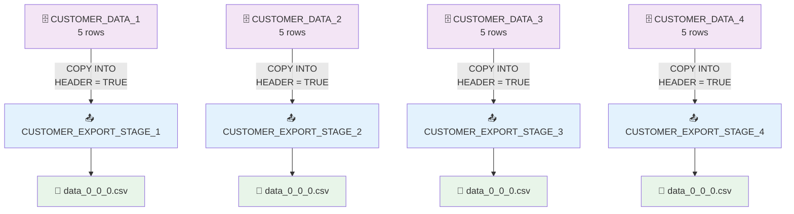

# 52) Snowflake — Multiple Table export to Multiple Stage

## 📁 Files in This Folder

| File | What It Is |
| ---- | ---------- |
| [00) README.md](00%29%20README.md) | This explanation |
| [snowflake.sql](snowflake.sql) | Every SQL statement for this pipeline in one file, ready to paste into a Snowflake worksheet |

## 🎯 Goal

The other demo in this folder (`01) Single Table export to Single Stage`) sent **one** table into **one** stage. Here the same idea is used with **four** tables and **four** stages:

```text
4 tables   →   4 stages   →   4 CSV files
4 tables   →   4 COPY INTO statements
5 rows per table   →   20 rows in total
```

Every table gets its own stage. So every table is exported with its own command, and no two tables can ever end up in the same file.

> 📌 Use this pattern when different groups of data must land in different files — for example one file per region, per month or per department. If you put all four tables into one stage, the files would mix together and you could not tell which file came from which table.

| Pipeline | Which Way the Data Goes |
| -------- | --------- |
| 50 / 51 | CSV → Stage → Table |
| 52 | Table → Stage → CSV |

## 📦 The Data We Export

Four tables, five customers in each table = **20 rows**:

```text
CUSTOMER_DATA_1   →   CUSTOMER_EXPORT_STAGE_1   →   data_0_0_0.csv   →   3001–3005
CUSTOMER_DATA_2   →   CUSTOMER_EXPORT_STAGE_2   →   data_0_0_0.csv   →   4001–4005
CUSTOMER_DATA_3   →   CUSTOMER_EXPORT_STAGE_3   →   data_0_0_0.csv   →   5001–5005
CUSTOMER_DATA_4   →   CUSTOMER_EXPORT_STAGE_4   →   data_0_0_0.csv   →   6001–6005
```

All four tables have the same columns:

```text
customer_id, customer_name, email, city, country, total_purchase
```

> 📌 The four tables look the same, but they hold different rows. The lesson in this demo is **where each table goes**, not what is inside it.

## 🧱 The Objects We Create

| Object | Name | What it is for |
| ------ | ---- | ------------- |
| Database | `CUSTOMER_EXPORT_DB` | The big box that holds everything below |
| Schema | `CUSTOMER_EXPORT_SCHEMA` | A folder that keeps this pipeline's objects together |
| Warehouse | `CUSTOMER_EXPORT_WH` | The machine that runs the export |
| Table | `CUSTOMER_DATA_1` … `CUSTOMER_DATA_4` | Four source tables — one for each file |
| File Format | `CUSTOMER_CSV_EXPORT_FORMAT` | Tells Snowflake how to write the CSV files. One format is enough for all four |
| Stage | `CUSTOMER_EXPORT_STAGE_1` … `CUSTOMER_EXPORT_STAGE_4` | Four landing spots — one for each table |

> 📌 The numbers line up on purpose: `CUSTOMER_DATA_N` is exported into `CUSTOMER_EXPORT_STAGE_N`. One look at a name tells you which table it belongs to.

Do it in this order: **Database → Schema → Warehouse → Table ×4 → File Format → Stage ×4 → Check → COPY INTO ×4 → Check → Download**



---

## 🗄️ Step 1 — Create the Database

```sql
CREATE DATABASE CUSTOMER_EXPORT_DB;

USE DATABASE CUSTOMER_EXPORT_DB;
```

---

## 📂 Step 2 — Create the Schema

```sql
CREATE SCHEMA CUSTOMER_EXPORT_SCHEMA;

USE SCHEMA CUSTOMER_EXPORT_SCHEMA;
```

The hierarchy so far:

```text
CUSTOMER_EXPORT_DB
└── CUSTOMER_EXPORT_SCHEMA
```

---

## ⚙️ Step 3 — Create the Warehouse

```sql
CREATE WAREHOUSE CUSTOMER_EXPORT_WH
    WAREHOUSE_SIZE = XSMALL
    AUTO_SUSPEND = 60
    AUTO_RESUME = TRUE;

USE WAREHOUSE CUSTOMER_EXPORT_WH;
```

> 📌 A warehouse sits at the account level, not inside the database. One warehouse can serve many pipelines. The same `CUSTOMER_EXPORT_WH` runs all four exports in this demo.

---

## 📋 Step 4 — Create and Fill Table 1

This table holds the data we want to send out. It is the first **source** for the export.

```sql
CREATE TABLE CUSTOMER_DATA_1 (
    CUSTOMER_ID    NUMBER,
    CUSTOMER_NAME  VARCHAR(100),
    EMAIL          VARCHAR(200),
    CITY           VARCHAR(100),
    COUNTRY        VARCHAR(50),
    TOTAL_PURCHASE NUMBER
);
```

Add five rows:

```sql
INSERT INTO CUSTOMER_DATA_1 VALUES
(3001, 'Rahul Sharma', 'rahul@example.com', 'Mumbai', 'India', 75000),
(3002, 'Priya Patil', 'priya@example.com', 'Pune', 'India', 62000),
(3003, 'Amit Verma', 'amit@example.com', 'Delhi', 'India', 58000),
(3004, 'Sneha Joshi', 'sneha@example.com', 'Bengaluru', 'India', 91000),
(3005, 'Vikas Kumar', 'vikas@example.com', 'Hyderabad', 'India', 67000);
```

Verify:

```sql
SELECT * FROM CUSTOMER_DATA_1;
```

Expected:

```text
CUSTOMER_ID | CUSTOMER_NAME | EMAIL                  | CITY      | COUNTRY | TOTAL_PURCHASE
------------+---------------+------------------------+-----------+---------+---------------
3001        | Rahul Sharma  | rahul@example.com      | Mumbai    | India   | 75000
3002        | Priya Patil   | priya@example.com      | Pune      | India   | 62000
3003        | Amit Verma    | amit@example.com       | Delhi     | India   | 58000
3004        | Sneha Joshi   | sneha@example.com      | Bengaluru | India   | 91000
3005        | Vikas Kumar   | vikas@example.com      | Hyderabad | India   | 67000
```

---

## 📋 Step 5 — Create and Fill Table 2

The same columns as table 1, but its own rows:

```sql
CREATE TABLE CUSTOMER_DATA_2 (
    CUSTOMER_ID    NUMBER,
    CUSTOMER_NAME  VARCHAR(100),
    EMAIL          VARCHAR(200),
    CITY           VARCHAR(100),
    COUNTRY        VARCHAR(50),
    TOTAL_PURCHASE NUMBER
);

INSERT INTO CUSTOMER_DATA_2 VALUES
(4001, 'Arjun Mehta', 'arjun@example.com', 'Chennai', 'India', 82000),
(4002, 'Neha Singh', 'neha@example.com', 'Kolkata', 'India', 71000),
(4003, 'Rohit Gupta', 'rohit@example.com', 'Noida', 'India', 65000),
(4004, 'Pooja Shah', 'pooja@example.com', 'Ahmedabad', 'India', 89000),
(4005, 'Karan Rao', 'karan@example.com', 'Bengaluru', 'India', 76000);

SELECT * FROM CUSTOMER_DATA_2;
```

Expected: **5 rows**, ids `4001–4005`.

---

## 📋 Step 6 — Create and Fill Table 3

```sql
CREATE TABLE CUSTOMER_DATA_3 (
    CUSTOMER_ID    NUMBER,
    CUSTOMER_NAME  VARCHAR(100),
    EMAIL          VARCHAR(200),
    CITY           VARCHAR(100),
    COUNTRY        VARCHAR(50),
    TOTAL_PURCHASE NUMBER
);

INSERT INTO CUSTOMER_DATA_3 VALUES
(5001, 'Sanjay Kumar', 'sanjay@example.com', 'Jaipur', 'India', 55000),
(5002, 'Anjali Nair', 'anjali@example.com', 'Kochi', 'India', 68000),
(5003, 'Manish Yadav', 'manish@example.com', 'Lucknow', 'India', 72000),
(5004, 'Divya Iyer', 'divya@example.com', 'Coimbatore', 'India', 93000),
(5005, 'Nikhil Jain', 'nikhil@example.com', 'Indore', 'India', 61000);

SELECT * FROM CUSTOMER_DATA_3;
```

Expected: **5 rows**, ids `5001–5005`.

---

## 📋 Step 7 — Create and Fill Table 4

```sql
CREATE TABLE CUSTOMER_DATA_4 (
    CUSTOMER_ID    NUMBER,
    CUSTOMER_NAME  VARCHAR(100),
    EMAIL          VARCHAR(200),
    CITY           VARCHAR(100),
    COUNTRY        VARCHAR(50),
    TOTAL_PURCHASE NUMBER
);

INSERT INTO CUSTOMER_DATA_4 VALUES
(6001, 'Varun Kapoor', 'varun@example.com', 'Gurugram', 'India', 88000),
(6002, 'Meera Reddy', 'meera@example.com', 'Hyderabad', 'India', 79000),
(6003, 'Akash Malhotra', 'akash@example.com', 'Mumbai', 'India', 69000),
(6004, 'Riya Desai', 'riya@example.com', 'Pune', 'India', 97000),
(6005, 'Suresh Babu', 'suresh@example.com', 'Chennai', 'India', 73000);

SELECT * FROM CUSTOMER_DATA_4;
```

Expected: **5 rows**, ids `6001–6005`.

---

## 📄 Step 8 — Create the Export File Format

Here the data moves from **Snowflake into a CSV file**.

```sql
CREATE FILE FORMAT CUSTOMER_CSV_EXPORT_FORMAT
    TYPE = 'CSV'
    FIELD_DELIMITER = ','
    COMPRESSION = 'NONE'
    FIELD_OPTIONALLY_ENCLOSED_BY = '"';
```

> 📌 One file format is shared by all four stages. That is safe only because all four tables have the same columns.

### 💡 Why `COMPRESSION = 'NONE'`?

Snowflake compresses exported files by default. You would get `data_0_0_0.csv.gz`, and you would have to unzip it before opening it in Excel. `COMPRESSION = 'NONE'` keeps the file as a plain `.csv`, so you can open it straight away. The file is bigger, but for practice that is fine.

---

## 📥 Step 9 — Create the Four Export Stages

```sql
CREATE STAGE CUSTOMER_EXPORT_STAGE_1
    FILE_FORMAT = CUSTOMER_CSV_EXPORT_FORMAT;

CREATE STAGE CUSTOMER_EXPORT_STAGE_2
    FILE_FORMAT = CUSTOMER_CSV_EXPORT_FORMAT;

CREATE STAGE CUSTOMER_EXPORT_STAGE_3
    FILE_FORMAT = CUSTOMER_CSV_EXPORT_FORMAT;

CREATE STAGE CUSTOMER_EXPORT_STAGE_4
    FILE_FORMAT = CUSTOMER_CSV_EXPORT_FORMAT;
```

Check it:

```sql
SHOW STAGES;
```

The layout inside the schema:

```text
CUSTOMER_EXPORT_SCHEMA
│
├── CUSTOMER_DATA_1            ← 5 rows to send out
├── CUSTOMER_DATA_2            ← 5 rows to send out
├── CUSTOMER_DATA_3            ← 5 rows to send out
├── CUSTOMER_DATA_4            ← 5 rows to send out
├── CUSTOMER_CSV_EXPORT_FORMAT ← the rules for writing all four files
├── CUSTOMER_EXPORT_STAGE_1    ← file 1 lands here
├── CUSTOMER_EXPORT_STAGE_2    ← file 2 lands here
├── CUSTOMER_EXPORT_STAGE_3    ← file 3 lands here
└── CUSTOMER_EXPORT_STAGE_4    ← file 4 lands here

CUSTOMER_EXPORT_WH             ← account-level compute
```

---

## 🔍 Step 10 — Check the Stages Before the Export

```sql
LIST @CUSTOMER_EXPORT_STAGE_1;

LIST @CUSTOMER_EXPORT_STAGE_2;

LIST @CUSTOMER_EXPORT_STAGE_3;

LIST @CUSTOMER_EXPORT_STAGE_4;
```

Each `LIST` shows **nothing**. The four stages are empty, because no export has run yet. Keep this in mind: after Step 11 you run the same four `LIST` commands again, and this time each one shows a file. That is how you prove the export worked.

---

## 🚚 Step 11 — Export Each Table Into Its Own Stage

Four commands. Only the table name and the stage name change from one command to the next:

```sql
COPY INTO @CUSTOMER_EXPORT_STAGE_1
FROM CUSTOMER_DATA_1
HEADER = TRUE;
```

```sql
COPY INTO @CUSTOMER_EXPORT_STAGE_2
FROM CUSTOMER_DATA_2
HEADER = TRUE;
```

```sql
COPY INTO @CUSTOMER_EXPORT_STAGE_3
FROM CUSTOMER_DATA_3
HEADER = TRUE;
```

```sql
COPY INTO @CUSTOMER_EXPORT_STAGE_4
FROM CUSTOMER_DATA_4
HEADER = TRUE;
```

> 📌 `HEADER = TRUE` puts the column names in the first line of every file. Without it you get only the data rows, and the file has no column names at all.

> 📌 The command looks the same as the load command in pipelines 50 and 51. The only difference is the `@` in `@CUSTOMER_EXPORT_STAGE_1`. With `@`, the stage is the destination, so data goes **out**. Without `@`, the stage is the source, so data comes **in**.

---

## ✅ Step 12 — Check the Exported Files

Run the same four `LIST` commands again:

```sql
LIST @CUSTOMER_EXPORT_STAGE_1;

LIST @CUSTOMER_EXPORT_STAGE_2;

LIST @CUSTOMER_EXPORT_STAGE_3;

LIST @CUSTOMER_EXPORT_STAGE_4;
```

Each `LIST` now shows **one** file:

```text
name           | size | status
---------------+------+---------
data_0_0_0.csv | 250  | UPLOADED
```

Four stages, four files. Each stage holds only the file of its own table:

```text
CUSTOMER_EXPORT_STAGE_1   →   data_0_0_0.csv   ← the rows of CUSTOMER_DATA_1
CUSTOMER_EXPORT_STAGE_2   →   data_0_0_0.csv   ← the rows of CUSTOMER_DATA_2
CUSTOMER_EXPORT_STAGE_3   →   data_0_0_0.csv   ← the rows of CUSTOMER_DATA_3
CUSTOMER_EXPORT_STAGE_4   →   data_0_0_0.csv   ← the rows of CUSTOMER_DATA_4
```

> 📌 All four files have the same name, `data_0_0_0.csv`. That is normal, because each one sits in its own stage. If all four tables had gone into one stage, you could not tell them apart.

---

## ⬇️ Step 13 — Download the Files

In Snowsight:

```text
Data → Databases → CUSTOMER_EXPORT_DB → CUSTOMER_EXPORT_SCHEMA → Stages → CUSTOMER_EXPORT_STAGE_1
```

You should see the exported CSV file. Download it, then open it in Excel.

Open the file and you will see the column names on the first line, because of `HEADER = TRUE`:

```text
CUSTOMER_ID,CUSTOMER_NAME,EMAIL,CITY,COUNTRY,TOTAL_PURCHASE
3001,Rahul Sharma,rahul@example.com,Mumbai,India,75000
3002,Priya Patil,priya@example.com,Pune,India,62000
...
```

Do the same for stages 2, 3 and 4 to get the other three files.

---

## ⚠️ Common Errors

| Error | Why it happens | How to fix it |
| ----- | ----- | --- |
| `Files already existing at the unload destination` | That stage already holds a file with the same name from an earlier export | Empty the stage with `REMOVE @CUSTOMER_EXPORT_STAGE_1;` and export again |
| Two stages hold the same rows | The same table was exported into two different stages | Keep one table per stage, then export each table once |
| The downloaded file ends in `.csv.gz` | `COMPRESSION = 'NONE'` is missing from the file format | Add it, or unzip the file before opening it |
| The file has no column names | `HEADER = TRUE` is missing from that export | Add it, empty the stage, export again |
| `rows_exported = 0` | The table is empty, or the session is on another database or schema | Run `SELECT COUNT(*) FROM CUSTOMER_DATA_1;` and check `USE DATABASE` / `USE SCHEMA` |
| `Table does not exist or not authorized` | The session is on another database or schema | Run `USE DATABASE CUSTOMER_EXPORT_DB;` and `USE SCHEMA CUSTOMER_EXPORT_SCHEMA;` again |
| The old file is still in the stage | Snowflake does not replace a file automatically | Run `REMOVE @<stage>;` first, then export again |

---

## ⭐ What to Take Away

| Idea | What to remember |
| ------- | ----- |
| **One stage per table** | A stage is like a folder. Four tables that must stay apart get four stages |
| **One `COPY INTO` per stage** | Each table is exported with its own command. Four tables need four `COPY INTO` calls |
| **`COPY INTO @stage`** | The `@` makes the stage the destination, so the data goes out of Snowflake |
| **One file format for many stages** | All four stages here share `CUSTOMER_CSV_EXPORT_FORMAT`, because all four tables look the same |
| **`HEADER = TRUE`** | Puts the column names in the first line of the file |
| **`COMPRESSION = 'NONE'`** | Keeps the file as a plain `.csv` instead of a `.csv.gz` |
| **`LIST @stage`** | Run it before the export to see an empty stage, and after the export to see the file |
| **`REMOVE @stage`** | Empties a stage when Snowflake complains that a file already exists |

The two demos in this folder side by side:

```text
01) Single Table export to Single Stage     02) Multiple Table export to Multiple Stage
──────────────────────────────────────      ───────────────────────────────────────────
1 table  → 1 stage                          4 tables → 4 stages
         → 1 COPY INTO                               → 4 COPY INTO
         → 1 CSV file                                → 4 CSV files
         → 5 rows                                    → 5 rows each (20 in total)
```

---

## 🎯 Complete Architecture

```text
                        SNOWFLAKE
                            │
        ┌───────────┬───────┴───────┬───────────┐
        │           │               │           │
 CUSTOMER_DATA_1  CUSTOMER_DATA_2  CUSTOMER_DATA_3  CUSTOMER_DATA_4
        │           │               │           │
        │  COPY INTO @stage   (4 commands, HEADER = TRUE)
        ▼           ▼               ▼           ▼
 EXPORT_STAGE_1  EXPORT_STAGE_2  EXPORT_STAGE_3  EXPORT_STAGE_4
        │           │               │           │
        ▼           ▼               ▼           ▼
 data_0_0_0.csv  data_0_0_0.csv  data_0_0_0.csv  data_0_0_0.csv
        │           │               │           │
        └───────────┴───────┬───────┴───────────┘
                            ▼
                        Download
                            │
                            ▼
                         Your PC
```
