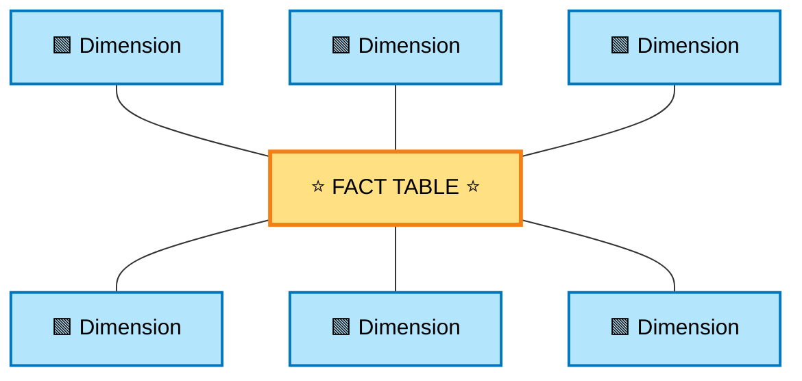
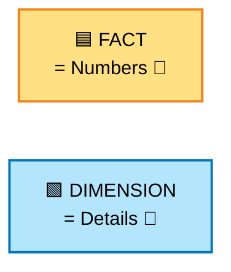
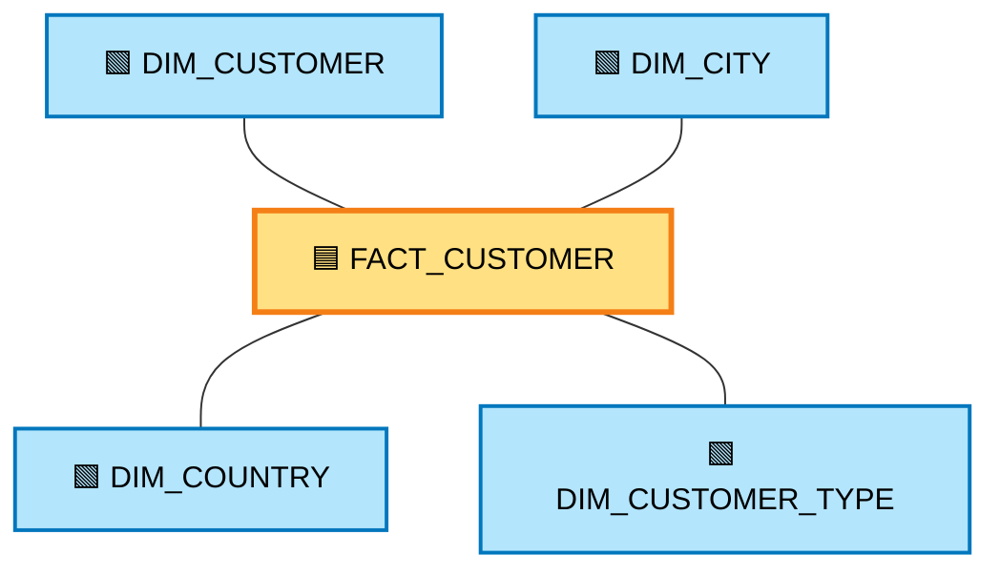
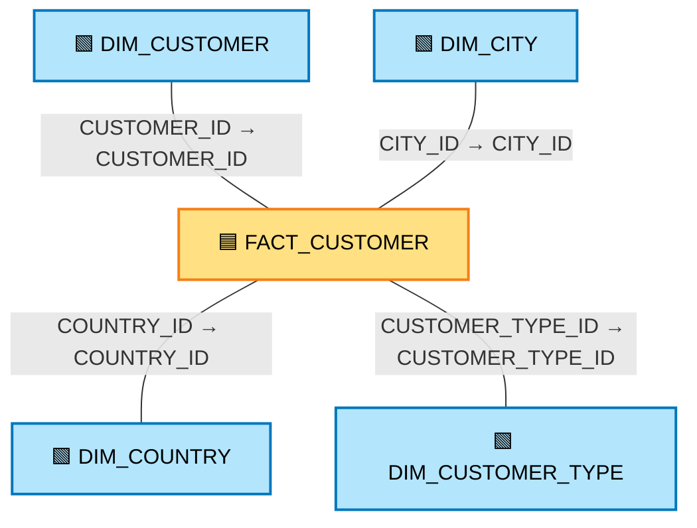
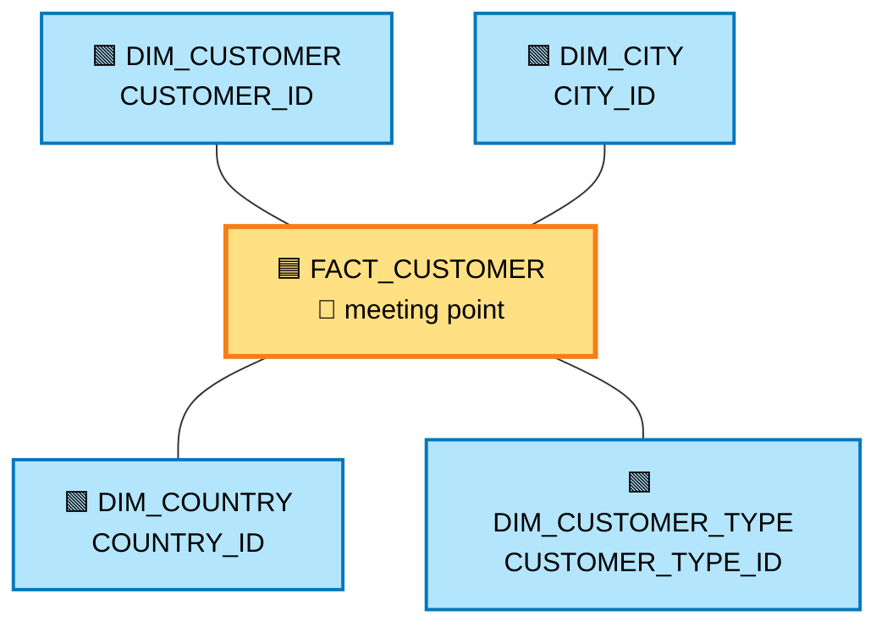
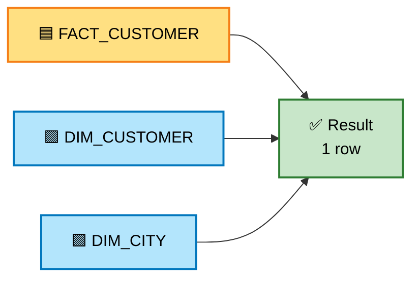
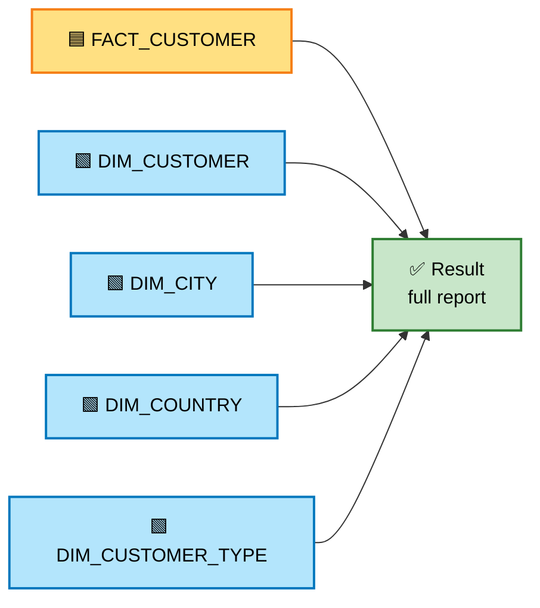
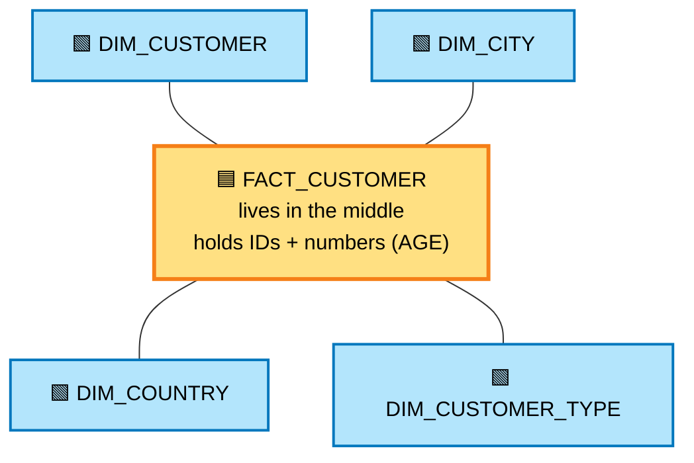
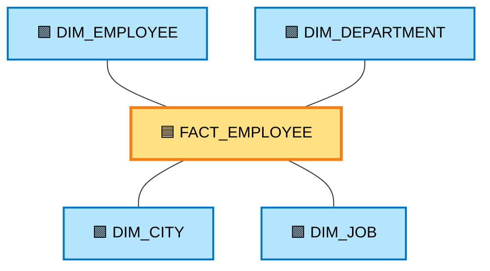

# ⭐ 02) STAR Schema — Customer Practice

> 📌 This file explains the idea in simple words.
> All the SQL lives in [snowflake.sql](snowflake.sql). Nothing to copy from here.

## 📁 Files in This Folder

| File | What It Is |
| ---- | ---------- |
| [02) STAR schema.md](02%29%20STAR%20schema.md) | This explanation |
| [snowflake.sql](snowflake.sql) | Every SQL statement for this practice, ready to paste into a Snowflake worksheet |
| [cleanup.md](cleanup.md) | Deletes everything this practice creates |

## 🎯 Goal

Build one small Star Schema with customers.

By the end you will know:

- what a Star Schema is
- where the Fact table goes
- where the Dimension tables go
- how they connect using IDs

---

## 1️⃣ What is a Star Schema?

A Star Schema is a simple way to arrange tables in a data warehouse.

Nothing more than that.

It uses only two kinds of tables:

- 🟦 One **Fact** table in the middle
- 🟩 Many **Dimension** tables around it

One table in the center. Other tables around it. That is all.

---

## 2️⃣ Why is it called "Star"?

Because when you draw it on paper, it looks like a star ⭐.

The Fact table is the center.
The Dimension tables are the points of the star.

---

## 3️⃣ Quick reminder — Fact vs Dimension

If you want the long version, read
[01) Data Modelling Basics](../01%29%20Data%20Modelling%20Basics/01%29%20Data%20Modelling%20Basics.md).

| 🟦 Fact Table | 🟩 Dimension Table |
| ------------- | ------------------ |
| Holds numbers | Holds details |
| Things we measure | Things that describe |
| "How much?" | "Who? What? Where?" |
| salary, age, quantity, price | name, city, country, type |

Simple way to remember:

---

## 4️⃣ Our example — one customer table

We start with a normal table. All the data sits in one place.

### 📋 NORMAL_CUSTOMER

| CUSTOMER_ID | CUSTOMER_NAME | CITY | COUNTRY | CUSTOMER_TYPE | AGE |
| --- | --- | --- | --- | --- | --- |
| 101 | Rahul Sharma | Bangalore | India | Premium | 30 |
| 102 | Priya Singh | Mumbai | India | Regular | 27 |
| 103 | Amit Kumar | Delhi | India | Premium | 35 |

This is our **source table**. Three customers.

Now we split it into a Star Schema.

---

## 5️⃣ What we will build

We look at the columns and sort them by meaning:

- 👤 Who is the customer? → `CUSTOMER_NAME`
- 📍 Which city? → `CITY`
- 🌍 Which country? → `COUNTRY`
- 🏷️ Which type? → `CUSTOMER_TYPE`
- 🔢 What number? → `AGE`

So we create four dimensions and one fact:

| Table | Kind | Holds |
| ----- | ---- | ----- |
| `NORMAL_CUSTOMER` | source | everything (before splitting) |
| `DIM_CUSTOMER` | 🟩 dimension | customer id + name |
| `DIM_CITY` | 🟩 dimension | city id + city |
| `DIM_COUNTRY` | 🟩 dimension | country id + country |
| `DIM_CUSTOMER_TYPE` | 🟩 dimension | type id + type |
| `FACT_CUSTOMER` | 🟦 fact | the IDs + age |

---

## 6️⃣ The center table — FACT_CUSTOMER

This is the heart of the star.

It does **not** store names or cities.
It stores **IDs** that point to the dimension tables.

| CUSTOMER_ID | CITY_ID | COUNTRY_ID | CUSTOMER_TYPE_ID | AGE |
| --- | --- | --- | --- | --- |
| 101 | C01 | CY01 | CT01 | 30 |
| 102 | C02 | CY02 | CT02 | 27 |
| 103 | C03 | CY03 | CT03 | 35 |

See? No "Rahul". No "Bangalore".

Just IDs and one number (`AGE`).

The number is what we measure.
The IDs are the links to the other tables.

---

## 7️⃣ The arms of the star — the dimensions

### 👤 DIM_CUSTOMER

| CUSTOMER_ID | CUSTOMER_NAME |
| --- | --- |
| 101 | Rahul Sharma |
| 102 | Priya Singh |
| 103 | Amit Kumar |

### 📍 DIM_CITY

| CITY_ID | CITY |
| --- | --- |
| C01 | Bangalore |
| C02 | Mumbai |
| C03 | Delhi |

### 🌍 DIM_COUNTRY

| COUNTRY_ID | COUNTRY |
| --- | --- |
| CY01 | India |
| CY02 | India |
| CY03 | India |

### 🏷️ DIM_CUSTOMER_TYPE

| CUSTOMER_TYPE_ID | CUSTOMER_TYPE |
| --- | --- |
| CT01 | Premium |
| CT02 | Regular |
| CT03 | Premium |

> ⚠️ In `DIM_COUNTRY` the value "India" appears 3 times.
> In `DIM_CUSTOMER_TYPE` the value "Premium" appears 2 times.
> This is **on purpose**, only for practice.
> A real dimension table should keep each value only once.

---

## 8️⃣ How the tables connect

This part is easy. The IDs are the same in both tables.

Picture it like this:

The fact table is the meeting point. Every dimension connects here.

---

## 9️⃣ The steps in the SQL file

We do everything in this order:

| Step | What we do | Result |
| ---- | ---------- | ------ |
| 1 | Create the database | The big box that holds everything |
| 2 | Create the schema | A folder inside the box |
| 3 | Create `NORMAL_CUSTOMER` | The source table |
| 4 | Add the 3 customers | 3 rows in the source table |
| 5 | Create and fill `DIM_CUSTOMER` | 3 rows |
| 6 | Create and fill `DIM_CITY` | 3 rows |
| 7 | Create and fill `DIM_COUNTRY` | 3 rows |
| 8 | Create and fill `DIM_CUSTOMER_TYPE` | 3 rows |
| 9 | Create and fill `FACT_CUSTOMER` | 3 rows |
| 10 | Check all tables | You see the data |
| 11 | Run 4 practice queries | You get answers |
| 12 | Create the load procedure | A small robot for loading |

> 📌 We do **not** create a warehouse here.
> Snowflake's default one is fine.
> So there is nothing extra to stop or drop later.

---

## 🔟 Practice query 1 — Customers from Bangalore

We ask a simple question: **"Who lives in Bangalore?"**

To answer it, we join the fact table with two dimensions:

Result:

| CUSTOMER_ID | CUSTOMER_NAME | CITY |
| --- | --- | --- |
| 101 | Rahul Sharma | Bangalore |

Only one customer lives in Bangalore.

---

## 1️⃣1️⃣ Practice query 2 — Full report for Bangalore

Now we want the full picture for Bangalore.

So we join **all** the dimensions:

Result:

| CUSTOMER_ID | CUSTOMER_NAME | CITY | COUNTRY | CUSTOMER_TYPE | AGE |
| --- | --- | --- | --- | --- | --- |
| 101 | Rahul Sharma | Bangalore | India | Premium | 30 |

---

## 1️⃣2️⃣ Practice query 3 — Full report for everyone

Same query as above, but we remove the city filter.

Now we see all three customers:

| CUSTOMER_ID | CUSTOMER_NAME | CITY | COUNTRY | CUSTOMER_TYPE | AGE |
| --- | --- | --- | --- | --- | --- |
| 101 | Rahul Sharma | Bangalore | India | Premium | 30 |
| 102 | Priya Singh | Mumbai | India | Regular | 27 |
| 103 | Amit Kumar | Delhi | India | Premium | 35 |

---

## 1️⃣3️⃣ Practice query 4 — Count customers per city

Now a small summary: **"How many customers in each city?"**

We join the fact with `DIM_CITY` and group the rows by city.

Result:

| CITY | CUSTOMER_COUNT |
| --- | --- |
| Bangalore | 1 |
| Delhi | 1 |
| Mumbai | 1 |

One customer in each city.

---

## 1️⃣4️⃣ Bonus — load the data automatically

Writing many `INSERT` lines by hand is slow.

So we also create a **stored procedure** called `SP_LOAD_CUSTOMER_DATA()`.

Think of it like a small robot 🤖. You press start, and it:

1. reads the source table `NORMAL_CUSTOMER`
2. fills `DIM_CUSTOMER`
3. fills `DIM_CITY`
4. fills `DIM_COUNTRY`
5. fills `DIM_CUSTOMER_TYPE`
6. fills `FACT_CUSTOMER`

It even makes the IDs by itself, using a counter called `ROW_NUMBER()`.

> ⚠️ Important: the procedure **adds rows**.
> If the tables already have data, running it again creates duplicate rows.
> So run it only on empty tables.
> That is why the `CALL` line is left switched off (commented out) in the SQL file.

---

## 1️⃣5️⃣ Two things kept on purpose

This practice is different from a real warehouse in two ways.
Both are on purpose, so you can see the difference.

### 1. No Primary Key and no Foreign Key

In a real warehouse you usually add:

- a **Primary Key** 🔑 on a dimension ID (each ID is unique)
- a **Foreign Key** 🔗 on the fact ID (it must match a dimension ID)

Here we skip both. The tables still work.
But a real system adds them to stop bad data.

### 2. Repeating values

`DIM_COUNTRY` has "India" three times.
`DIM_CUSTOMER_TYPE` has "Premium" twice.

In a real dimension table, each value should appear **once**.
Here we repeat them on purpose, just for practice.

---

## 1️⃣6️⃣ Quick revision

**⭐ STAR SCHEMA = 1 Fact table + many Dimension tables**

🟩 The dimension tables hold the details (names, cities, countries, types).
🔗 They connect through IDs.

---

## 📌 What to Take Away

- A Star Schema is just one center table with tables around it.
- The **Fact** table holds the numbers and the IDs.
- The **Dimension** tables hold the details.
- The **IDs** are the glue that joins them.
- Joining the fact with the dimensions gives you a full report.

## 🚀 Next Step

Try the same idea with a bigger table.
For example, take an **employee** table and build:

When a dimension table is broken into more and more smaller tables,
that shape is called a **Snowflake Schema** ❄️.
