# 🧩 03) Stored Procedure Basics

> 📌 This file explains the idea in simple words.
> All the SQL lives in [snowflake.sql](snowflake.sql). Nothing to run from here.

## 📁 Files in This Folder

| File | What It Is |
| ---- | ---------- |
| [03) Stored Procedure Basics.md](03%29%20Stored%20Procedure%20Basics.md) | This explanation |
| [snowflake.sql](snowflake.sql) | Every SQL statement for this practice, ready to paste into a Snowflake worksheet |
| [cleanup.md](cleanup.md) | Deletes everything this practice creates |

## 🎯 Goal

Learn what a **Stored Procedure** is, and why we use it.

By the end you will know:

- what a Stored Procedure (SP) is
- why we use one
- how to run one
- what happens when you run the same SP twice

---

## 1️⃣ What is a Stored Procedure?

A **Stored Procedure (SP)** is a group of SQL statements saved inside the database.

Instead of writing the same SQL again and again, we write it **once inside the SP**.

Then we run the SP whenever we need it.

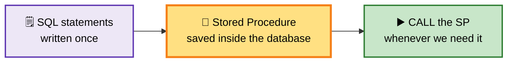

| ❌ Without SP | ✅ With SP |
| ------------ | --------- |
| You write the full SQL every time | You write the SQL only once |
| You run the full SQL every time | You just CALL the SP |
| Easy to forget a step | Nothing to remember |

The SQL logic is already inside the SP. You only type one short line.

---

## 2️⃣ Why do we need Stored Procedures?

Think about two tables:

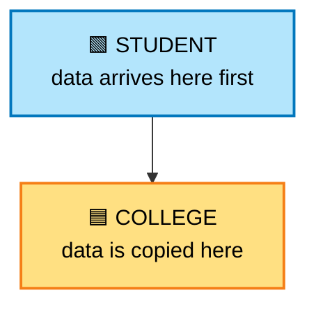

Data comes into `STUDENT` first.
Then we copy it into `COLLEGE`.

**Without an SP**, we write the copy logic by hand every single time:

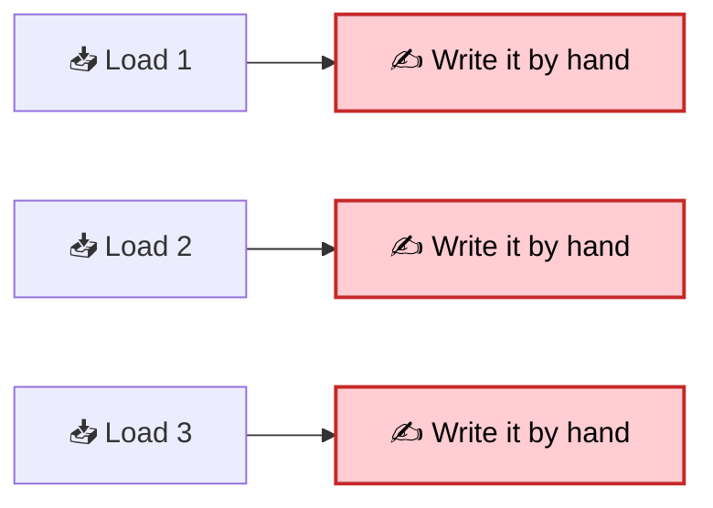

**With an SP**, we write the logic once, and then we just call it:

If there are many tables and many statements, doing it by hand becomes hard to manage.

---

## 3️⃣ Our Simple Example

We create two tables. Both have the same five columns.

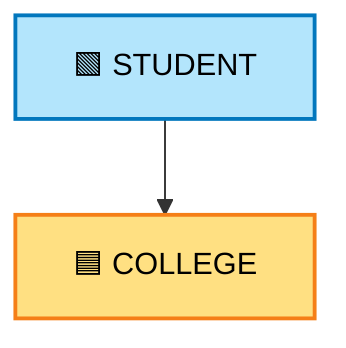

For now we keep it very simple.
We do **not** use:

- Primary Key
- Foreign Key
- Duplicate checking
- Error handling
- Validation

The only goal is to understand the **Stored Procedure**.

---

## 4️⃣ The Two Tables

### 🟩 STUDENT — the data arrives here

| Column | What it holds |
| ------ | ------------- |
| `STUDENT_ID` | The student number |
| `STUDENT_NAME` | The student name |
| `AGE` | The student age |
| `COLLEGE_NAME` | The college name |
| `COURSE` | The course name |

### 🟦 COLLEGE — the data is copied here

`COLLEGE` has the same five columns as `STUDENT`.

Both tables are created in `snowflake.sql` (Step 3 and Step 4).

---

## 5️⃣ We Load 30 Records

We do **6 loads**.
Each load has **5 records**.

| Load | Records | Total in STUDENT |
| ---- | ------- | ---------------- |
| Load 1 | 5 | 5 |
| Load 2 | 5 | 10 |
| Load 3 | 5 | 15 |
| Load 4 | 5 | 20 |
| Load 5 | 5 | 25 |
| Load 6 | 5 | 30 |

After all 6 loads:

- `STUDENT` = **30 rows**
- `COLLEGE` = **0 rows** (nothing copied yet)

---

## 6️⃣ The Data — Load 1 to Load 6

### 📥 Load 1

| STUDENT_ID | STUDENT_NAME | AGE | COLLEGE_NAME | COURSE |
| --- | --- | --- | --- | --- |
| 1 | Rahul | 20 | ABC College | BCA |
| 2 | Amit | 21 | XYZ College | BSc IT |
| 3 | Priya | 20 | ABC College | BCA |
| 4 | Sneha | 22 | PQR College | BCom |
| 5 | Rohit | 21 | XYZ College | BSc IT |

### 📥 Load 2

| STUDENT_ID | STUDENT_NAME | AGE | COLLEGE_NAME | COURSE |
| --- | --- | --- | --- | --- |
| 6 | Karan | 20 | ABC College | BCA |
| 7 | Neha | 21 | PQR College | BCom |
| 8 | Akash | 22 | XYZ College | BSc IT |
| 9 | Pooja | 20 | ABC College | BCA |
| 10 | Vikas | 21 | PQR College | BCom |

### 📥 Load 3

| STUDENT_ID | STUDENT_NAME | AGE | COLLEGE_NAME | COURSE |
| --- | --- | --- | --- | --- |
| 11 | Anjali | 20 | ABC College | BCA |
| 12 | Suresh | 22 | XYZ College | BSc IT |
| 13 | Meena | 21 | PQR College | BCom |
| 14 | Arjun | 20 | ABC College | BCA |
| 15 | Nisha | 22 | XYZ College | BSc IT |

### 📥 Load 4

| STUDENT_ID | STUDENT_NAME | AGE | COLLEGE_NAME | COURSE |
| --- | --- | --- | --- | --- |
| 16 | Manoj | 21 | PQR College | BCom |
| 17 | Divya | 20 | ABC College | BCA |
| 18 | Ramesh | 22 | XYZ College | BSc IT |
| 19 | Kavya | 21 | PQR College | BCom |
| 20 | Ajay | 20 | ABC College | BCA |

### 📥 Load 5

| STUDENT_ID | STUDENT_NAME | AGE | COLLEGE_NAME | COURSE |
| --- | --- | --- | --- | --- |
| 21 | Varun | 22 | XYZ College | BSc IT |
| 22 | Swati | 20 | ABC College | BCA |
| 23 | Naveen | 21 | PQR College | BCom |
| 24 | Riya | 20 | ABC College | BCA |
| 25 | Deepak | 22 | XYZ College | BSc IT |

### 📥 Load 6

| STUDENT_ID | STUDENT_NAME | AGE | COLLEGE_NAME | COURSE |
| --- | --- | --- | --- | --- |
| 26 | Pavan | 21 | PQR College | BCom |
| 27 | Asha | 20 | ABC College | BCA |
| 28 | Vijay | 22 | XYZ College | BSc IT |
| 29 | Isha | 21 | PQR College | BCom |
| 30 | Sameer | 20 | ABC College | BCA |

After Load 6:

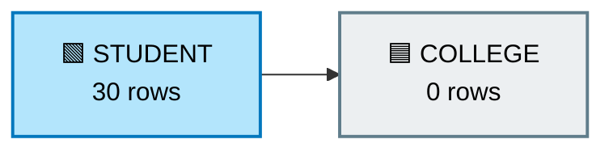

---

## 7️⃣ Scenario 1 — Without a Stored Procedure

Now the 30 rows are in `STUDENT`.
We want them in `COLLEGE`.

We write the copy logic by hand in the worksheet, and then we run it.

The copy logic says: **take every row from `STUDENT` and put it into `COLLEGE`.**

After that:

- `STUDENT` = **30 rows**
- `COLLEGE` = **30 rows**

This is **Step 11** in `snowflake.sql`.

---

## 8️⃣ Tomorrow — 5 More Records

Tomorrow, 5 new students arrive.

| STUDENT_ID | STUDENT_NAME | AGE | COLLEGE_NAME | COURSE |
| --- | --- | --- | --- | --- |
| 31 | Raj | 21 | ABC College | BCA |
| 32 | Priti | 20 | XYZ College | BSc IT |
| 33 | Mohit | 22 | PQR College | BCom |
| 34 | Sakshi | 21 | ABC College | BCA |
| 35 | Nitin | 20 | XYZ College | BSc IT |

We put them into `STUDENT`.
Now we must **remember** and run the copy logic again by hand.

If there are many tables, it looks like this:

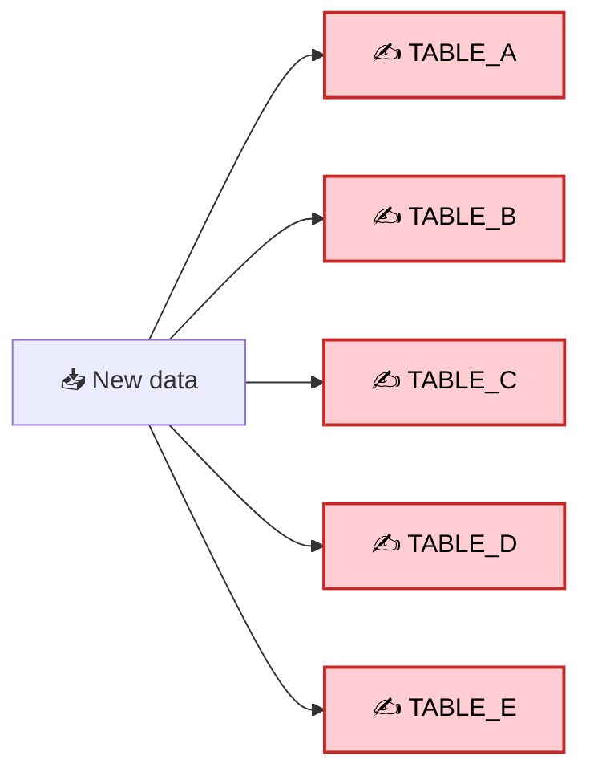

Every time, you have to run all of those statements yourself.

---

## 9️⃣ Scenario 2 — With a Stored Procedure

Now we create **one** Stored Procedure.

The SP holds the copy logic, so we never type that logic again.

The SP is created in `snowflake.sql` (**Step 13**).

What the SP does:

1. copies every row from `STUDENT` into `COLLEGE`
2. sends back a short message: `STUDENT DATA LOADED INTO COLLEGE`

The logic is now stored inside the SP.

---

## 🔟 How to Run the SP?

We do not write the full SQL again.

We type one short line:

`CALL SP_LOAD_STUDENT_TO_COLLEGE();`

That is it. The saved SQL does the work.

This is **Step 14** in `snowflake.sql`.

---

## 1️⃣1️⃣ The Main Difference

| | ❌ Without SP | ✅ With SP |
| --- | --- | --- |
| What you type | The full copy SQL | One short line |
| How often | Every single time | Every single time, but only one line |
| Who remembers the logic | You | The database |
| To change the logic | Change it everywhere | Change the SP once |

---

## 1️⃣2️⃣ A Real-Life Example — 5 Tables

Imagine one staging table that must feed 5 tables.

**Without SP** — you run 5 statements by hand, every time:

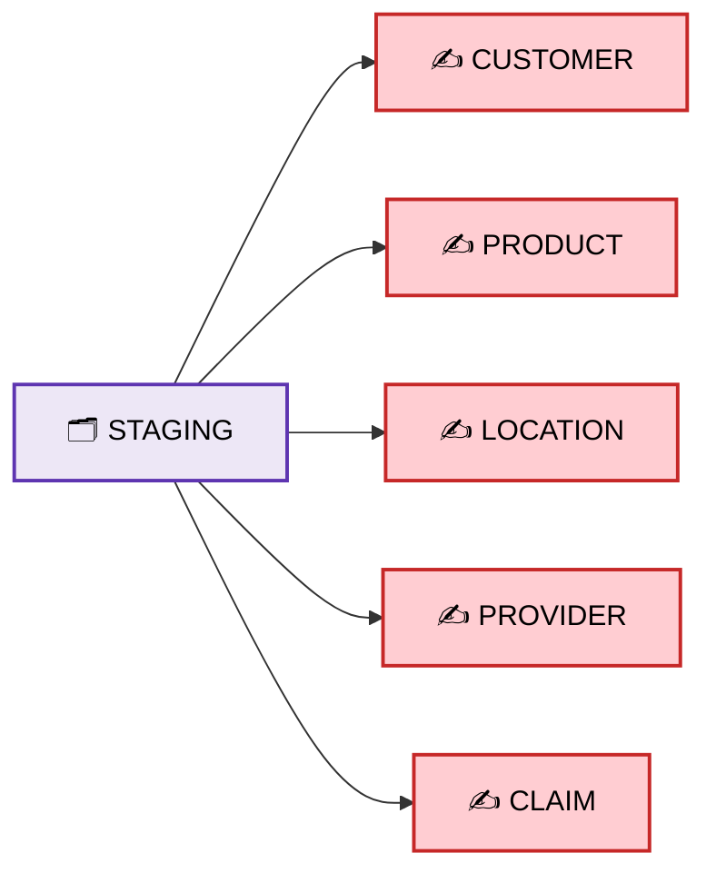

**With SP** — one short line does all 5:

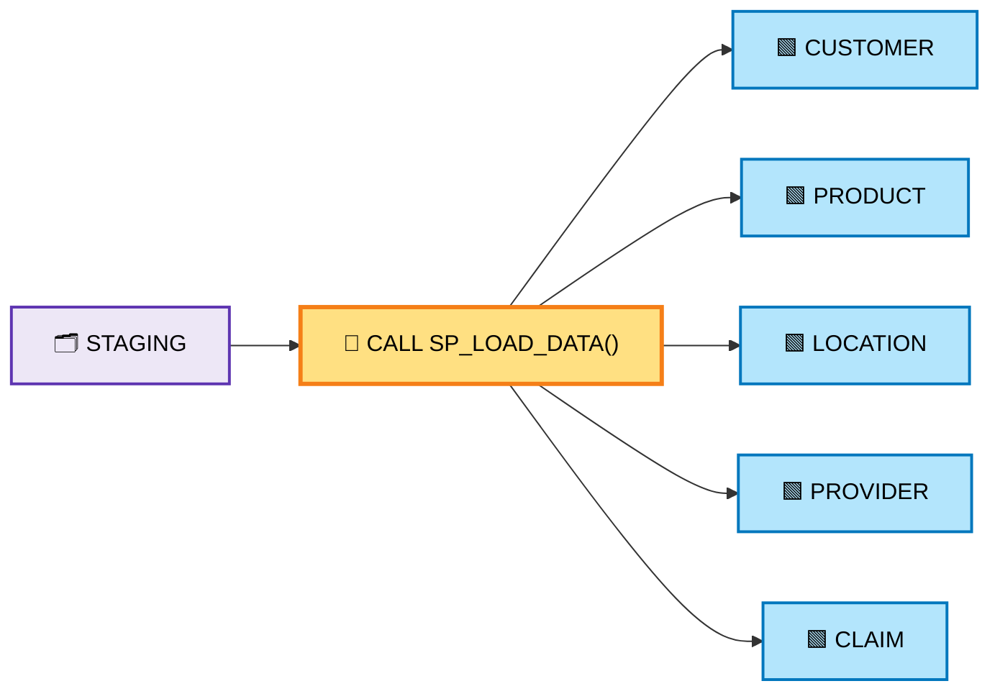

The SP can hold all the required SQL statements.

---

## 1️⃣3️⃣ Very Important Point

Do **not** think:

> "A Stored Procedure automatically moves data."

Think like this instead:

> "A Stored Procedure **stores a group of SQL statements** inside the database, so we can run that logic whenever we need it."

The SP does nothing on its own. It runs **only when we CALL it**.

---

## 1️⃣4️⃣ One Important Thing About Our Example

Our SP copies **all** rows from `STUDENT` into `COLLEGE`.

So if `STUDENT` has 30 rows:

| Call | STUDENT | COLLEGE |
| ---- | ------- | ------- |
| First call | 30 | 30 |
| Second call | 30 | 60 ⚠️ |

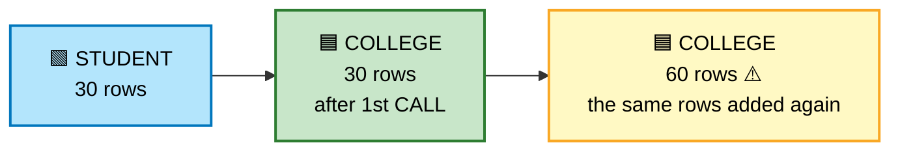

It happens because the SP inserts the same 30 rows a second time.

For **this practice**, that is fine. We are learning only this:

`SQL statements` → `Stored Procedure` → `CALL`

Later we can make the SP smarter and handle:

- new records
- existing records
- duplicates
- updates
- errors
- audit

But **not now**. Keep it simple.

---

## 1️⃣5️⃣ Final Simple Understanding

### ❌ Without SP

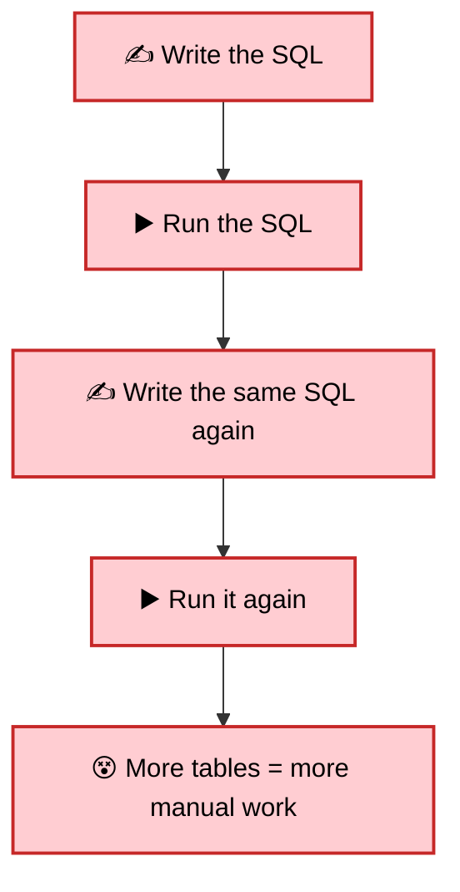

### ✅ With SP

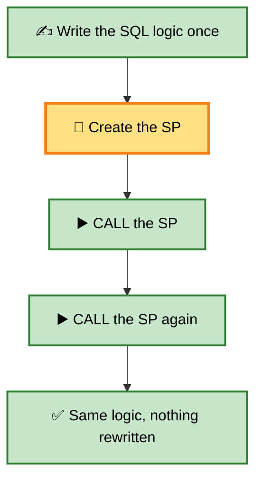

### One-line definition

> **Stored Procedure = a group of SQL statements saved in the database that we can run whenever we need it.**

### One-line reason

> **We use Stored Procedures so we do not write and run the same SQL again and again.**

---

## 📌 What to Take Away

- A Stored Procedure is a **saved group of SQL statements**.
- We write the logic **once**, then run it as many times as we want.
- We run it with the short `CALL` line.
- The SP does nothing by itself. It runs **only when we call it**.
- Our simple SP copies all rows again if you call it twice. That is why real SPs add checks later.

## 🚀 Next Step

Once this is clear, we can make the SP smarter.
For example, a real SP can:

- load only the **new** rows
- skip rows that already exist
- log every load in an **audit** table
- stop and report an **error**

Those come later. First, get the basic idea right. 🧩
