# 🧩 04) SP – Staging to Multiple Tables

> 📌 This file explains the idea in simple words.
> All the SQL lives in [snowflake.sql](snowflake.sql). Nothing to run from here.

## 📁 Files in This Folder

| File | What It Is |
| ---- | ---------- |
| [04) SP – Staging to Multiple Tables.md](04%29%20SP%20%E2%80%93%20Staging%20to%20Multiple%20Tables.md) | This explanation |
| [snowflake.sql](snowflake.sql) | Every SQL statement for this practice, ready to paste into a Snowflake worksheet |
| [cleanup.md](cleanup.md) | Deletes everything this practice creates |

## 🎯 Goal

Last time we did this:

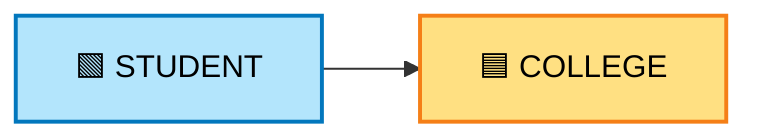

**One table → one table.**

This time we do this:


**One table → five tables.**

By the end you will know:

- how one main table can feed many tables
- why that becomes hard without a Stored Procedure
- how one Stored Procedure makes it easy

---

## 1️⃣ What We Are Going to Learn

We have **one main table**: `STAGING`.

From that one table, we load data into **five** tables:

- `CUSTOMER`
- `PRODUCT`
- `LOCATION`
- `PROVIDER`
- `CLAIM`

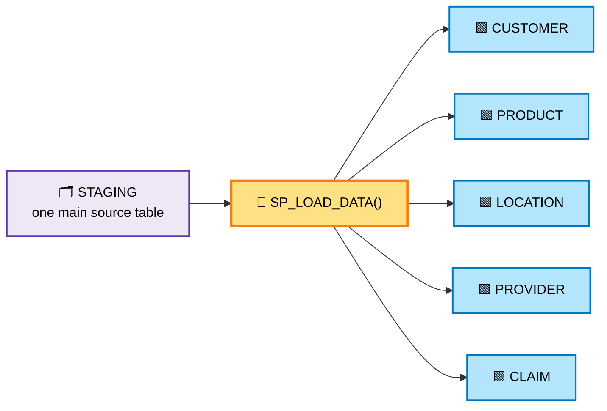

The idea is very simple:

> **One `STAGING` table contains the main data. From this one table, we load data into multiple tables.**

We use **6 loads × 5 records = 30 records**, same as the last practice.

We keep everything simple.

---

## 2️⃣ The 6 Tables

### 🗂️ STAGING — the main source table

| Column | What it holds |
| ------ | ------------- |
| `CUSTOMER_ID` | Customer number |
| `CUSTOMER_NAME` | Customer name |
| `PRODUCT_ID` | Product number |
| `PRODUCT_NAME` | Product name |
| `LOCATION_ID` | Location number |
| `LOCATION_NAME` | Location name |
| `PROVIDER_ID` | Provider number |
| `PROVIDER_NAME` | Provider name |
| `CLAIM_ID` | Claim number |
| `CLAIM_AMOUNT` | Claim amount |

All the data sits here first. All 10 columns in one place.

### 🟩 The 5 target tables

| Table | Columns |
| ----- | ------- |
| `CUSTOMER` | `CUSTOMER_ID`, `CUSTOMER_NAME` |
| `PRODUCT` | `PRODUCT_ID`, `PRODUCT_NAME` |
| `LOCATION` | `LOCATION_ID`, `LOCATION_NAME` |
| `PROVIDER` | `PROVIDER_ID`, `PROVIDER_NAME` |
| `CLAIM` | `CLAIM_ID`, `CUSTOMER_ID`, `PRODUCT_ID`, `LOCATION_ID`, `PROVIDER_ID`, `CLAIM_AMOUNT` |

Two things to notice:

- `CUSTOMER`, `PRODUCT`, `LOCATION` and `PROVIDER` each take only **2 columns** from `STAGING`.
- `CLAIM` takes the **IDs from all of them**, plus the amount.

All 6 tables are created in `snowflake.sql` (**Step 3 to Step 8**).
No keys and no checks, on purpose.

---

## 3️⃣ Complete Structure

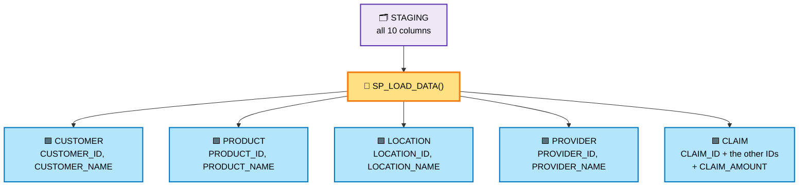

---

## 4️⃣ The 30 Records — 6 Loads

We insert the data into `STAGING`.
Each load has **5 records**.

| Load | Records | Total in STAGING |
| ---- | ------- | ---------------- |
| Load 1 | 5 | 5 |
| Load 2 | 5 | 10 |
| Load 3 | 5 | 15 |
| Load 4 | 5 | 20 |
| Load 5 | 5 | 25 |
| Load 6 | 5 | 30 |

After all 6 loads:

- `STAGING` = **30 rows**
- `CUSTOMER`, `PRODUCT`, `LOCATION`, `PROVIDER`, `CLAIM` = **0 rows each**

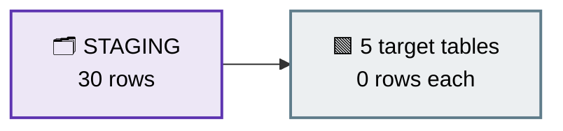

---

## 5️⃣ The Data — Load 1 to Load 6

### 📥 Load 1

| CUSTOMER_ID | CUSTOMER_NAME | PRODUCT_ID | PRODUCT_NAME | LOCATION_ID | LOCATION_NAME | PROVIDER_ID | PROVIDER_NAME | CLAIM_ID | CLAIM_AMOUNT |
| --- | --- | --- | --- | --- | --- | --- | --- | --- | --- |
| 1 | Rahul | 101 | Laptop | 1 | Bangalore | 201 | Apollo Hospital | 1001 | 5000 |
| 2 | Amit | 102 | Mobile | 2 | Mumbai | 202 | Fortis Hospital | 1002 | 7000 |
| 3 | Priya | 103 | Tablet | 3 | Pune | 203 | Manipal Hospital | 1003 | 4500 |
| 4 | Sneha | 104 | Monitor | 1 | Bangalore | 204 | Max Hospital | 1004 | 6000 |
| 5 | Rohit | 105 | Keyboard | 4 | Delhi | 205 | Apollo Hospital | 1005 | 3000 |

### 📥 Load 2

| CUSTOMER_ID | CUSTOMER_NAME | PRODUCT_ID | PRODUCT_NAME | LOCATION_ID | LOCATION_NAME | PROVIDER_ID | PROVIDER_NAME | CLAIM_ID | CLAIM_AMOUNT |
| --- | --- | --- | --- | --- | --- | --- | --- | --- | --- |
| 6 | Karan | 106 | Mouse | 5 | Chennai | 206 | Fortis Hospital | 1006 | 2500 |
| 7 | Neha | 107 | Laptop | 6 | Hyderabad | 207 | Manipal Hospital | 1007 | 8000 |
| 8 | Akash | 108 | Mobile | 7 | Kolkata | 208 | Max Hospital | 1008 | 5500 |
| 9 | Pooja | 109 | Tablet | 8 | Jaipur | 209 | Apollo Hospital | 1009 | 4000 |
| 10 | Vikas | 110 | Monitor | 9 | Delhi | 210 | Fortis Hospital | 1010 | 6500 |

### 📥 Load 3

| CUSTOMER_ID | CUSTOMER_NAME | PRODUCT_ID | PRODUCT_NAME | LOCATION_ID | LOCATION_NAME | PROVIDER_ID | PROVIDER_NAME | CLAIM_ID | CLAIM_AMOUNT |
| --- | --- | --- | --- | --- | --- | --- | --- | --- | --- |
| 11 | Anjali | 111 | Keyboard | 10 | Mumbai | 211 | Manipal Hospital | 1011 | 2800 |
| 12 | Suresh | 112 | Mouse | 11 | Pune | 212 | Max Hospital | 1012 | 2200 |
| 13 | Meena | 113 | Laptop | 12 | Bangalore | 213 | Apollo Hospital | 1013 | 9000 |
| 14 | Arjun | 114 | Mobile | 13 | Chennai | 214 | Fortis Hospital | 1014 | 7500 |
| 15 | Nisha | 115 | Tablet | 14 | Hyderabad | 215 | Manipal Hospital | 1015 | 5000 |

### 📥 Load 4

| CUSTOMER_ID | CUSTOMER_NAME | PRODUCT_ID | PRODUCT_NAME | LOCATION_ID | LOCATION_NAME | PROVIDER_ID | PROVIDER_NAME | CLAIM_ID | CLAIM_AMOUNT |
| --- | --- | --- | --- | --- | --- | --- | --- | --- | --- |
| 16 | Manoj | 116 | Monitor | 15 | Kolkata | 216 | Max Hospital | 1016 | 6200 |
| 17 | Divya | 117 | Keyboard | 16 | Jaipur | 217 | Apollo Hospital | 1017 | 3200 |
| 18 | Ramesh | 118 | Mouse | 17 | Delhi | 218 | Fortis Hospital | 1018 | 2700 |
| 19 | Kavya | 119 | Laptop | 18 | Mumbai | 219 | Manipal Hospital | 1019 | 9500 |
| 20 | Ajay | 120 | Mobile | 19 | Pune | 220 | Max Hospital | 1020 | 6800 |

### 📥 Load 5

| CUSTOMER_ID | CUSTOMER_NAME | PRODUCT_ID | PRODUCT_NAME | LOCATION_ID | LOCATION_NAME | PROVIDER_ID | PROVIDER_NAME | CLAIM_ID | CLAIM_AMOUNT |
| --- | --- | --- | --- | --- | --- | --- | --- | --- | --- |
| 21 | Varun | 121 | Tablet | 20 | Bangalore | 221 | Apollo Hospital | 1021 | 4200 |
| 22 | Swati | 122 | Monitor | 21 | Chennai | 222 | Fortis Hospital | 1022 | 5800 |
| 23 | Naveen | 123 | Keyboard | 22 | Hyderabad | 223 | Manipal Hospital | 1023 | 3100 |
| 24 | Riya | 124 | Mouse | 23 | Kolkata | 224 | Max Hospital | 1024 | 2400 |
| 25 | Deepak | 125 | Laptop | 24 | Delhi | 225 | Apollo Hospital | 1025 | 8800 |

### 📥 Load 6

| CUSTOMER_ID | CUSTOMER_NAME | PRODUCT_ID | PRODUCT_NAME | LOCATION_ID | LOCATION_NAME | PROVIDER_ID | PROVIDER_NAME | CLAIM_ID | CLAIM_AMOUNT |
| --- | --- | --- | --- | --- | --- | --- | --- | --- | --- |
| 26 | Pavan | 126 | Mobile | 25 | Mumbai | 226 | Fortis Hospital | 1026 | 7200 |
| 27 | Asha | 127 | Tablet | 26 | Pune | 227 | Manipal Hospital | 1027 | 4600 |
| 28 | Vijay | 128 | Monitor | 27 | Bangalore | 228 | Max Hospital | 1028 | 6100 |
| 29 | Isha | 129 | Keyboard | 28 | Chennai | 229 | Apollo Hospital | 1029 | 2900 |
| 30 | Sameer | 130 | Mouse | 29 | Hyderabad | 230 | Fortis Hospital | 1030 | 2600 |

Now `STAGING` has 30 records.
All 5 target tables still have 0 records.

---

## 6️⃣ Scenario 1 — Without a Stored Procedure

The 30 rows are in `STAGING`.
Now we want them in the 5 tables.

Without an SP, we must write **5 separate statements**, one for each table:

- 1 statement copies `CUSTOMER_ID` and `CUSTOMER_NAME` into `CUSTOMER`
- 1 statement copies `PRODUCT_ID` and `PRODUCT_NAME` into `PRODUCT`
- 1 statement copies `LOCATION_ID` and `LOCATION_NAME` into `LOCATION`
- 1 statement copies `PROVIDER_ID` and `PROVIDER_NAME` into `PROVIDER`
- 1 statement copies the claim columns into `CLAIM`

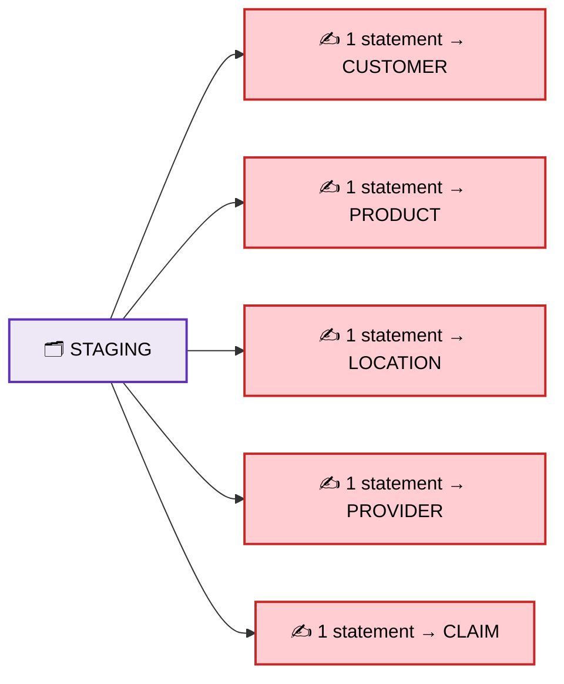

So we have:

```text
1 STAGING table
      ↓
5 SQL statements
      ↓
5 target tables
```

This is **Step 15** in `snowflake.sql`.

---

## 7️⃣ Every New Load Needs the Same Work

Suppose tomorrow 5 new records arrive.

We put them into `STAGING`.
Then we must **remember and run all 5 statements again**, by hand.

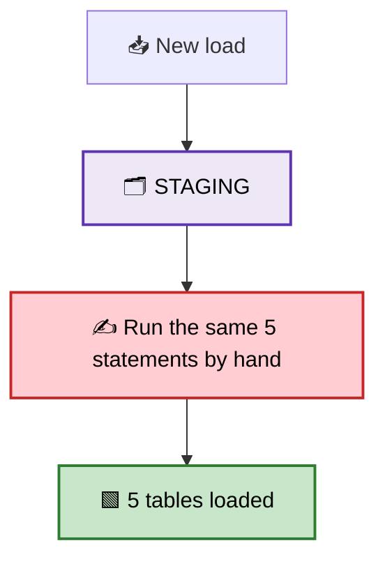

And if there are more tables, there will be more statements to remember.

This is where it starts becoming difficult to manage.

---

## 8️⃣ Scenario 2 — With a Stored Procedure

Now we create **one** Stored Procedure.

It holds all 5 statements inside it. So we never type them again.

The SP is created in `snowflake.sql` (**Step 16**).

What the SP does, in order:

1. loads `CUSTOMER`
2. loads `PRODUCT`
3. loads `LOCATION`
4. loads `PROVIDER`
5. loads `CLAIM`
6. sends back a short message: `DATA LOADED SUCCESSFULLY`

That's our SP.

---

## 9️⃣ How to Run the SP?

We do not run 5 different statements.
We type one short line:

`CALL SP_LOAD_DATA();`

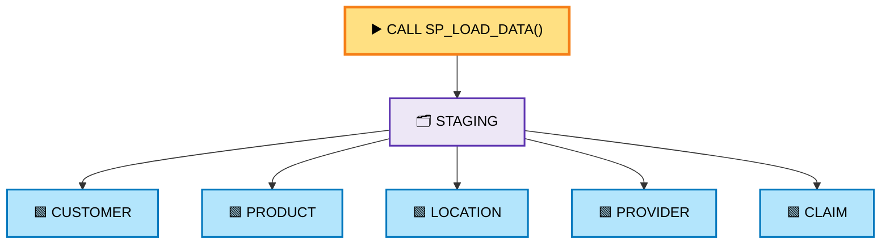

That's it. The SP runs all 5 statements for us.

This is **Step 17** in `snowflake.sql`.

---

## 🔟 The Difference

**Without SP**

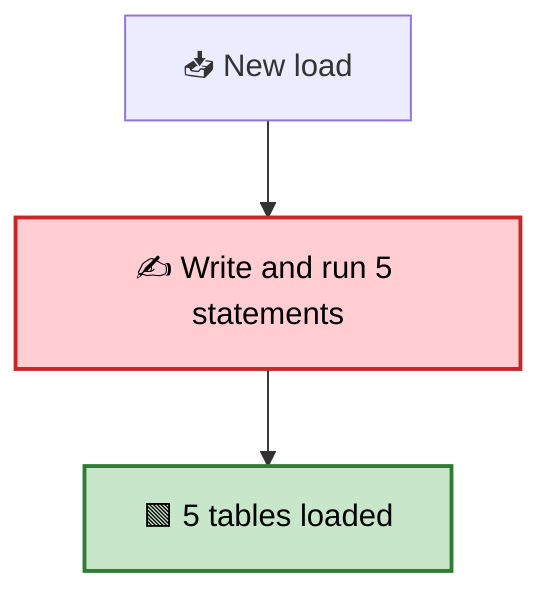

**With SP**

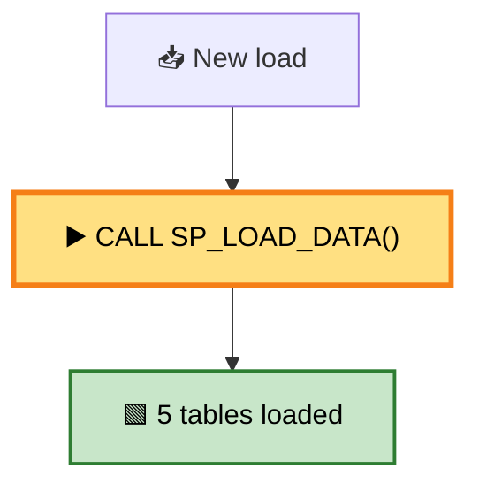

| ❌ Without SP | ✅ With SP |
| --- | --- |
| The SQL statements are run by you | The SQL statements are stored in the SP |
| You remember many statements | You just call the SP |
| More manual work | Less manual work |
| The logic is spread across many statements | The logic sits in one place |
| Harder when the tables increase | Easier to manage |
| 5 tables → 5 statements | 5 tables → 1 SP call |

The important difference is:

> **Without SP, we manage the SQL statements manually.**
> **With SP, we put the SQL statements in one place and call the SP.**

---

## 1️⃣1️⃣ The Main Idea of This Example

The important thing is **not** the 5 tables.

The important thing is this pattern:

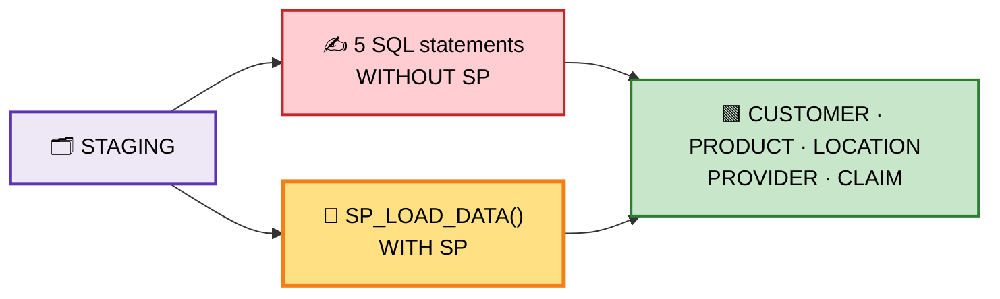

```text
1 Main Table
      ↓
Multiple Tables
      ↓
Without SP = many SQL statements
      ↓
With SP    = one SP call
```

---

## 1️⃣2️⃣ Important — We Are Not Handling Duplicates Yet

Just like the last practice, this SP copies **all** rows every time.

So if `STAGING` has 30 rows:

| Call | Each of the 5 tables |
| ---- | -------------------- |
| First call | 30 rows |
| Second call | 60 rows ⚠️ |

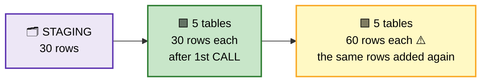

It happens because the SP inserts the same rows a second time.

That is okay for this practice.
Right now our goal is only to understand this:

```text
1 Main Table   →   Multiple Tables
Without SP     →   Multiple SQL statements
With SP        →   One SP call
```

Later we can improve this same example to:

- check for new records
- load only the new records
- use `MERGE`
- add validation
- add an audit table
- handle errors

**But for now, keep it exactly this simple.**

---

## 📌 What to Take Away

- One `STAGING` table can feed **many** tables.
- Without an SP, that means **many statements** to remember and run.
- With an SP, all of them live in **one place**.
- We run the SP with one short **`CALL`** line.
- Our simple SP copies all rows again if you call it twice. Real SPs add checks later.

## 🚀 Next Step

Once this is clear, we can make the SP smarter.
For example, a real SP can:

- load only the **new** records from `STAGING`
- skip records that already exist
- use `MERGE` to update or insert
- log every load in an **audit** table
- stop and report an **error**

Those come later. First, get the basic idea right. 🧩
