# 🧩 05) SP + Audit – Staging to Multiple Tables

> 📌 This file explains the idea in simple words.
> All the SQL lives in [snowflake.sql](snowflake.sql). Nothing to run from here.

## 📁 Files in This Folder

| File | What It Is |
| ---- | ---------- |
| [05) SP + Audit – Staging to Multiple Tables.md](05%29%20SP%20%2B%20Audit%20%E2%80%93%20Staging%20to%20Multiple%20Tables.md) | This explanation |
| [snowflake.sql](snowflake.sql) | Every SQL statement for this practice, ready to paste into a Snowflake worksheet |
| [cleanup.md](cleanup.md) | Deletes everything this practice creates |

## 🎯 Goal

Last time we had this:

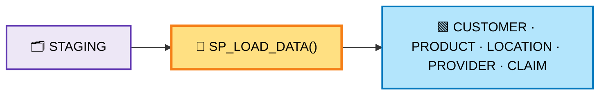

That works. But it has two problems:

1. We cannot easily see **what came in** and **what was loaded**.
2. Every time we call the SP, it loads **everything again**.

This time we fix both:

- add **2 audit tables** → we can see what happened
- add **`LOAD_ID` + `PROCESSED_FLAG`** → the SP loads only **new** records

---

## 1️⃣ Why Do We Need an Audit Table?

Right now we have only 5 target tables, so we can check them by hand:

```text
STAGING   → 30 records
CUSTOMER  → 30 records
PRODUCT   → 30 records
LOCATION  → 30 records
PROVIDER  → 30 records
CLAIM     → 30 records
```

But a real project can have **200 to 300 tables**:

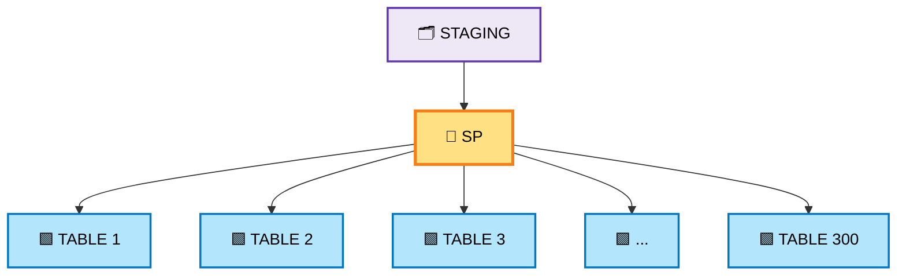

Then checking by hand looks like this:

```text
STAGING  = 10,000 records

TABLE 1   = 10,000
TABLE 2   = 10,000
TABLE 3   =  9,800   ← something is wrong here
TABLE 4   = 10,000
TABLE 5   =  9,950
...
TABLE 300 = ?
```

Checking all 300 tables by hand is very hard.

That is where **audit tables** become very useful.

---

## 2️⃣ What Will Our Audit Tables Do?

We will have **2 audit tables**.

### Audit Table 1 — what came into STAGING

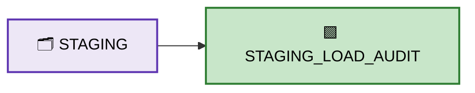

### Audit Table 2 — what the SP loaded


So the complete flow becomes:

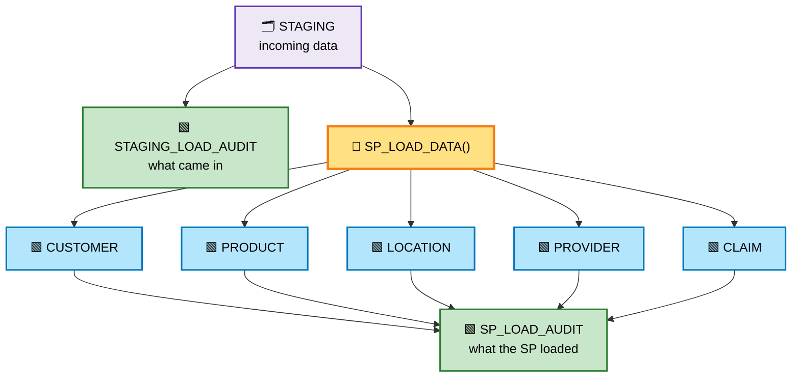

---

## 3️⃣ Audit Table 1 — `STAGING_LOAD_AUDIT`

This table answers:

> **"What came into `STAGING`?"**

| Column | What it holds |
| ------ | ------------- |
| `LOAD_ID` | Which load it was (1, 2, 3 …) |
| `RECORD_COUNT` | How many records came in |
| `LOAD_TIME` | When it came |
| `STATUS` | `SUCCESS` or `FAILED` |
| `COMMENTS` | A short note |

Example rows:

| LOAD_ID | RECORD_COUNT | LOAD_TIME | STATUS | COMMENTS |
| --- | --- | --- | --- | --- |
| 1 | 5 | 2026-10-02 08:00 | SUCCESS | Load 1 inserted into STAGING |
| 2 | 5 | 2026-10-02 08:10 | SUCCESS | Load 2 inserted into STAGING |
| 3 | 5 | 2026-10-02 08:20 | SUCCESS | Load 3 inserted into STAGING |

Now we know exactly what came into `STAGING`.

This table is created in `snowflake.sql` (**Step 4**).

---

## 4️⃣ Small Change to STAGING

This is the important change from the last practice.

We add **2 simple columns**:

- `LOAD_ID`
- `PROCESSED_FLAG`

### Why `LOAD_ID`?

It tells us which records belong to which load:

```text
These 5 records = Load 1
These 5 records = Load 2
These 5 records = Load 3
```

### Why `PROCESSED_FLAG`?

```text
N = Not processed yet  ⏳
Y = Already processed  ✅
```

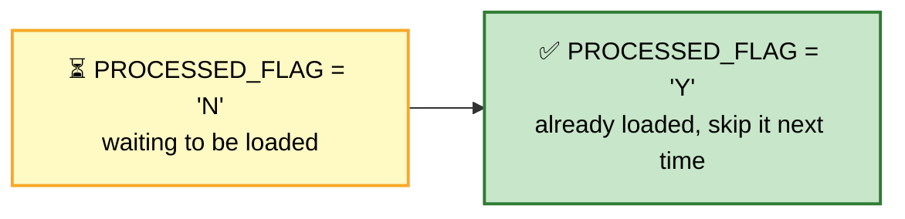

> ⚠️ This is **not** duplicate handling.
> It only answers one simple question: *have we already processed this record or not?*

---

## 5️⃣ Target Tables

The 5 target tables stay exactly the same as the last practice:

| Table | Columns |
| ----- | ------- |
| `CUSTOMER` | `CUSTOMER_ID`, `CUSTOMER_NAME` |
| `PRODUCT` | `PRODUCT_ID`, `PRODUCT_NAME` |
| `LOCATION` | `LOCATION_ID`, `LOCATION_NAME` |
| `PROVIDER` | `PROVIDER_ID`, `PROVIDER_NAME` |
| `CLAIM` | `CLAIM_ID`, `CUSTOMER_ID`, `PRODUCT_ID`, `LOCATION_ID`, `PROVIDER_ID`, `CLAIM_AMOUNT` |

All tables are created in `snowflake.sql` (**Step 3 to Step 10**).

---

## 6️⃣ Six Loads

Same as last time: **6 loads × 5 records = 30 records**.

The only difference: every record now has a `LOAD_ID`, and it starts with `PROCESSED_FLAG = 'N'`.

| Load | Records | Total in STAGING | PROCESSED_FLAG |
| ---- | ------- | ---------------- | -------------- |
| Load 1 | 5 | 5 | N (waiting) |
| Load 2 | 5 | 10 | N (waiting) |
| Load 3 | 5 | 15 | N (waiting) |
| Load 4 | 5 | 20 | N (waiting) |
| Load 5 | 5 | 25 | N (waiting) |
| Load 6 | 5 | 30 | N (waiting) |

### 📥 Load 1

| LOAD_ID | CUSTOMER_ID | CUSTOMER_NAME | PRODUCT_ID | PRODUCT_NAME | LOCATION_ID | LOCATION_NAME | PROVIDER_ID | PROVIDER_NAME | CLAIM_ID | CLAIM_AMOUNT | PROCESSED_FLAG |
| --- | --- | --- | --- | --- | --- | --- | --- | --- | --- | --- | --- |
| 1 | 1 | Rahul | 101 | Laptop | 1 | Bangalore | 201 | Apollo Hospital | 1001 | 5000 | N |
| 1 | 2 | Amit | 102 | Mobile | 2 | Mumbai | 202 | Fortis Hospital | 1002 | 7000 | N |
| 1 | 3 | Priya | 103 | Tablet | 3 | Pune | 203 | Manipal Hospital | 1003 | 4500 | N |
| 1 | 4 | Sneha | 104 | Monitor | 1 | Bangalore | 204 | Max Hospital | 1004 | 6000 | N |
| 1 | 5 | Rohit | 105 | Keyboard | 4 | Delhi | 205 | Apollo Hospital | 1005 | 3000 | N |

### 📥 Load 2

| LOAD_ID | CUSTOMER_ID | CUSTOMER_NAME | PRODUCT_ID | PRODUCT_NAME | LOCATION_ID | LOCATION_NAME | PROVIDER_ID | PROVIDER_NAME | CLAIM_ID | CLAIM_AMOUNT | PROCESSED_FLAG |
| --- | --- | --- | --- | --- | --- | --- | --- | --- | --- | --- | --- |
| 2 | 6 | Karan | 106 | Mouse | 5 | Chennai | 206 | Fortis Hospital | 1006 | 2500 | N |
| 2 | 7 | Neha | 107 | Laptop | 6 | Hyderabad | 207 | Manipal Hospital | 1007 | 8000 | N |
| 2 | 8 | Akash | 108 | Mobile | 7 | Kolkata | 208 | Max Hospital | 1008 | 5500 | N |
| 2 | 9 | Pooja | 109 | Tablet | 8 | Jaipur | 209 | Apollo Hospital | 1009 | 4000 | N |
| 2 | 10 | Vikas | 110 | Monitor | 9 | Delhi | 210 | Fortis Hospital | 1010 | 6500 | N |

### 📥 Load 3

| LOAD_ID | CUSTOMER_ID | CUSTOMER_NAME | PRODUCT_ID | PRODUCT_NAME | LOCATION_ID | LOCATION_NAME | PROVIDER_ID | PROVIDER_NAME | CLAIM_ID | CLAIM_AMOUNT | PROCESSED_FLAG |
| --- | --- | --- | --- | --- | --- | --- | --- | --- | --- | --- | --- |
| 3 | 11 | Anjali | 111 | Keyboard | 10 | Mumbai | 211 | Manipal Hospital | 1011 | 2800 | N |
| 3 | 12 | Suresh | 112 | Mouse | 11 | Pune | 212 | Max Hospital | 1012 | 2200 | N |
| 3 | 13 | Meena | 113 | Laptop | 12 | Bangalore | 213 | Apollo Hospital | 1013 | 9000 | N |
| 3 | 14 | Arjun | 114 | Mobile | 13 | Chennai | 214 | Fortis Hospital | 1014 | 7500 | N |
| 3 | 15 | Nisha | 115 | Tablet | 14 | Hyderabad | 215 | Manipal Hospital | 1015 | 5000 | N |

### 📥 Load 4

| LOAD_ID | CUSTOMER_ID | CUSTOMER_NAME | PRODUCT_ID | PRODUCT_NAME | LOCATION_ID | LOCATION_NAME | PROVIDER_ID | PROVIDER_NAME | CLAIM_ID | CLAIM_AMOUNT | PROCESSED_FLAG |
| --- | --- | --- | --- | --- | --- | --- | --- | --- | --- | --- | --- |
| 4 | 16 | Manoj | 116 | Monitor | 15 | Kolkata | 216 | Max Hospital | 1016 | 6200 | N |
| 4 | 17 | Divya | 117 | Keyboard | 16 | Jaipur | 217 | Apollo Hospital | 1017 | 3200 | N |
| 4 | 18 | Ramesh | 118 | Mouse | 17 | Delhi | 218 | Fortis Hospital | 1018 | 2700 | N |
| 4 | 19 | Kavya | 119 | Laptop | 18 | Mumbai | 219 | Manipal Hospital | 1019 | 9500 | N |
| 4 | 20 | Ajay | 120 | Mobile | 19 | Pune | 220 | Max Hospital | 1020 | 6800 | N |

### 📥 Load 5

| LOAD_ID | CUSTOMER_ID | CUSTOMER_NAME | PRODUCT_ID | PRODUCT_NAME | LOCATION_ID | LOCATION_NAME | PROVIDER_ID | PROVIDER_NAME | CLAIM_ID | CLAIM_AMOUNT | PROCESSED_FLAG |
| --- | --- | --- | --- | --- | --- | --- | --- | --- | --- | --- | --- |
| 5 | 21 | Varun | 121 | Tablet | 20 | Bangalore | 221 | Apollo Hospital | 1021 | 4200 | N |
| 5 | 22 | Swati | 122 | Monitor | 21 | Chennai | 222 | Fortis Hospital | 1022 | 5800 | N |
| 5 | 23 | Naveen | 123 | Keyboard | 22 | Hyderabad | 223 | Manipal Hospital | 1023 | 3100 | N |
| 5 | 24 | Riya | 124 | Mouse | 23 | Kolkata | 224 | Max Hospital | 1024 | 2400 | N |
| 5 | 25 | Deepak | 125 | Laptop | 24 | Delhi | 225 | Apollo Hospital | 1025 | 8800 | N |

### 📥 Load 6

| LOAD_ID | CUSTOMER_ID | CUSTOMER_NAME | PRODUCT_ID | PRODUCT_NAME | LOCATION_ID | LOCATION_NAME | PROVIDER_ID | PROVIDER_NAME | CLAIM_ID | CLAIM_AMOUNT | PROCESSED_FLAG |
| --- | --- | --- | --- | --- | --- | --- | --- | --- | --- | --- | --- |
| 6 | 26 | Pavan | 126 | Mobile | 25 | Mumbai | 226 | Fortis Hospital | 1026 | 7200 | N |
| 6 | 27 | Asha | 127 | Tablet | 26 | Pune | 227 | Manipal Hospital | 1027 | 4600 | N |
| 6 | 28 | Vijay | 128 | Monitor | 27 | Bangalore | 228 | Max Hospital | 1028 | 6100 | N |
| 6 | 29 | Isha | 129 | Keyboard | 28 | Chennai | 229 | Apollo Hospital | 1029 | 2900 | N |
| 6 | 30 | Sameer | 130 | Mouse | 29 | Hyderabad | 230 | Fortis Hospital | 1030 | 2600 | N |

After every load, one row is written into `STAGING_LOAD_AUDIT`.

At the end:

- `STAGING` = **30 rows**, all with `PROCESSED_FLAG = 'N'`
- `STAGING_LOAD_AUDIT` = **6 rows** (Load 1 to Load 6)
- all 5 target tables = **0 rows**

---

## 7️⃣ Audit Table 2 — `SP_LOAD_AUDIT`

This is the important table.

It answers:

> **"What did the SP do with those records?"**

| Column | What it holds |
| ------ | ------------- |
| `RUN_ID` | Which SP run it was (1, 2, 3 …) |
| `LOAD_ID` | Which load was processed |
| `SOURCE_TABLE` | Always `STAGING` here |
| `TARGET_TABLE` | Which table got the rows |
| `SOURCE_RECORD_COUNT` | How many records were **read** |
| `TARGET_RECORD_COUNT` | How many records were **written** |
| `RUN_TIME` | When it ran |
| `STATUS` | `SUCCESS` or `COUNT_MISMATCH` |
| `COMMENTS` | A short note |

Suppose the SP processes **Load 1**. It writes 5 rows (one per target table):

| RUN_ID | LOAD_ID | SOURCE_TABLE | TARGET_TABLE | SOURCE_RECORD_COUNT | TARGET_RECORD_COUNT | STATUS | COMMENTS |
| --- | --- | --- | --- | --- | --- | --- | --- |
| 1 | 1 | STAGING | CUSTOMER | 5 | 5 | SUCCESS | STAGING -> CUSTOMER |
| 1 | 1 | STAGING | PRODUCT | 5 | 5 | SUCCESS | STAGING -> PRODUCT |
| 1 | 1 | STAGING | LOCATION | 5 | 5 | SUCCESS | STAGING -> LOCATION |
| 1 | 1 | STAGING | PROVIDER | 5 | 5 | SUCCESS | STAGING -> PROVIDER |
| 1 | 1 | STAGING | CLAIM | 5 | 5 | SUCCESS | STAGING -> CLAIM |

Now you do not have to open all 5 tables.
You just look at `SP_LOAD_AUDIT` and you immediately see what happened.

This table is created in `snowflake.sql` (**Step 5**).

---

## 8️⃣ The Most Important Audit Check

This is the check you asked for.

After the SP runs, we compare two numbers:

> **How many records were read from `STAGING`?**
> **How many records were written into the target table?**

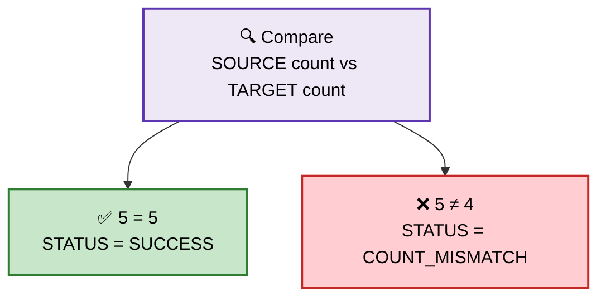

So:

- the two counts match → `SUCCESS` ✅
- the two counts do not match → `COUNT_MISMATCH` ⚠️

This gives you a quick way to see where the problem is, without opening every table.

---

## 9️⃣ Loading All 30 Records at Once

Suppose we load all 6 loads first.

```text
STAGING
Load 1 → 5
Load 2 → 5
Load 3 → 5
Load 4 → 5
Load 5 → 5
Load 6 → 5
----------------
Total    30
```

Then we call the SP: `CALL SP_LOAD_DATA();`

The SP looks only for rows like this:

```text
PROCESSED_FLAG = 'N'   →  30 records found
```

So it loads 30 rows into each target table, writes the audit rows, and then flips the flag:

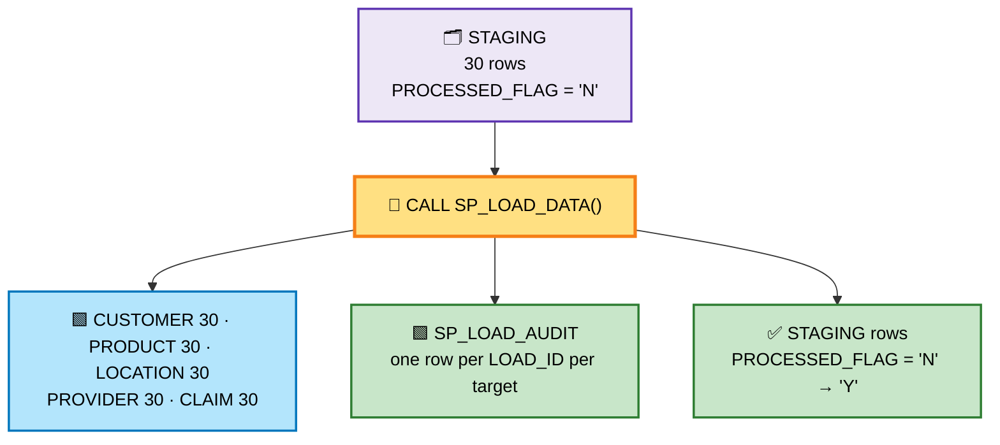

---

## 🔟 Next Load — Only the New Records

Now suppose **Load 7** arrives with 5 new records.

`STAGING` now holds:

```text
Old records = 30   →  PROCESSED_FLAG = 'Y'
New records =  5   →  PROCESSED_FLAG = 'N'
---------------------------------------
Total       = 35
```

Now we call the SP again:

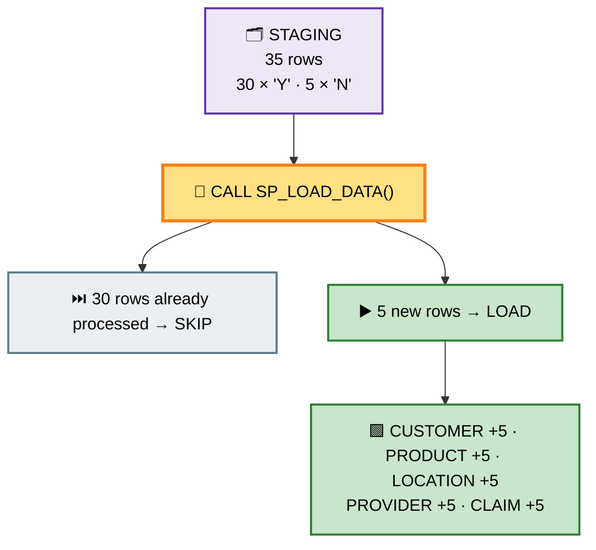

So:

```text
CUSTOMER → +5
PRODUCT  → +5
LOCATION → +5
PROVIDER → +5
CLAIM    → +5
```

**This is exactly what you want.** 🎯

---

## 1️⃣1️⃣ Why This Is Better

### ❌ Without the flag (the old way)

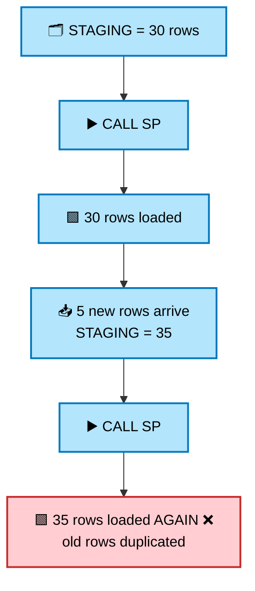

### ✅ With `PROCESSED_FLAG` (this practice)

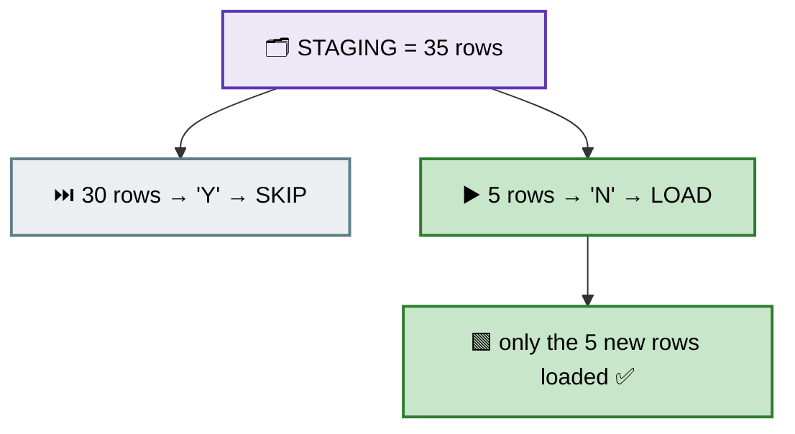

So the old rows are **skipped**, and only the new rows are processed.

---

## 1️⃣2️⃣ Final Pipeline

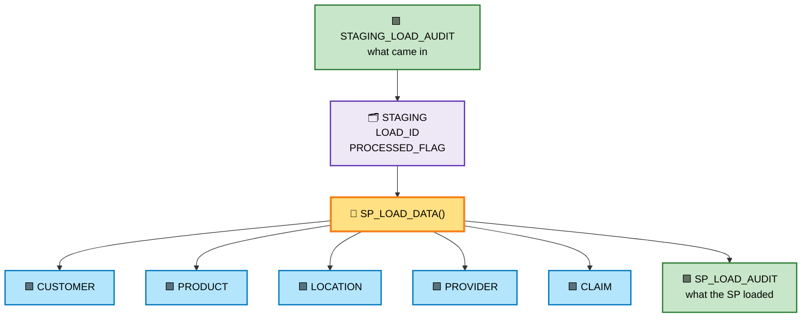

---

## 1️⃣3️⃣ What Each Audit Table Tells Us

### `STAGING_LOAD_AUDIT`

Answers:

> **"What came into `STAGING`?"**

```text
LOAD 1
5 records
08:00 AM
SUCCESS
```

### `SP_LOAD_AUDIT`

Answers:

> **"What did the SP do with those records?"**

```text
RUN 1 · LOAD 1
STAGING → CUSTOMER
Source = 5
Target = 5
SUCCESS
```

```text
RUN 1 · LOAD 1
STAGING → PRODUCT
Source = 5
Target = 5
SUCCESS
```

And so on for the other tables.

| Audit table | The one question it answers |
| ----------- | --------------------------- |
| `STAGING_LOAD_AUDIT` | What came **in**? |
| `SP_LOAD_AUDIT` | What did the SP **load**? |

---

## 1️⃣4️⃣ The Complete Flow

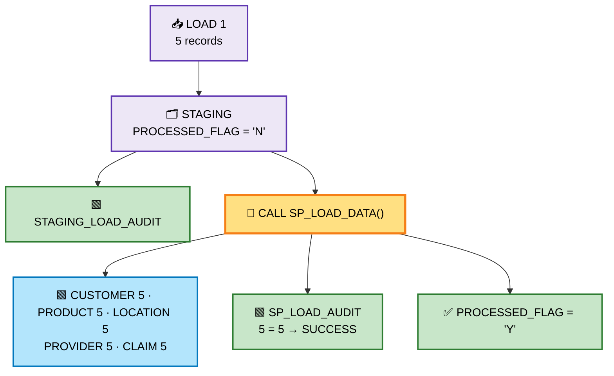

Then Load 2:

```text
LOAD 2
   ↓
5 new records
   ↓
STAGING
   ↓
SP
   ↓
Only LOAD 2 is processed
   ↓
LOAD 1 is skipped ⏭️
```

---

## 1️⃣5️⃣ One Important Correction About "30 = 30"

Your idea is correct for this practice, but there is one thing to remember.

Here we make:

```text
1 STAGING record
      ↓
1 CUSTOMER record
1 PRODUCT record
1 LOCATION record
1 PROVIDER record
1 CLAIM record
```

So:

```text
STAGING  = 30
CUSTOMER = 30
PRODUCT  = 30
...
```

Therefore `30 = 30` makes sense **here**.

In a real project, this may not always happen.

For example, 30 staging records may contain only **10 unique products**:

```text
STAGING = 30
PRODUCT = 10
```

That does **not** automatically mean the load failed.

So for this learning pipeline we keep the simple one-to-one flow, so the audit idea is easy to see.
Later we can change the audit logic to match the real business rule.

---

## 1️⃣6️⃣ Final Concept You Should Remember

You now have **three important concepts together**:

| Concept | its job |
| ------- | ------- |
| `STAGING` | Holds the incoming data |
| Stored Procedure | Loads data from `STAGING` into multiple tables |
| Audit tables | Tell us what came in and what was loaded |

```text
                STAGING
                   ↓
          STAGING_LOAD_AUDIT
                   ↓
             CALL SP_LOAD_DATA()
                   ↓
       ┌───────────┼───────────┐
       ↓           ↓           ↓
   CUSTOMER     PRODUCT     LOCATION
       ↓           ↓           ↓
   PROVIDER       CLAIM       ...
                   ↓
             SP_LOAD_AUDIT
                   ↓
          Source Count = Target Count
                   ↓
          PROCESSED_FLAG = 'Y'
```

> ✅ Your idea is correct: use **`LOAD_ID` + `PROCESSED_FLAG`** so the SP processes only new records.
> That is much better than doing `SELECT * FROM STAGING` every time.

> 🚧 **Next step (not now):** if all 5 target loads must succeed or fail **together**, we need **transactions**.
> Snowflake stored procedures are **not** automatically atomic.
> We will add that in a later practice. For now we keep it simple.

---

## 📌 What to Take Away

- An audit table tells you **what happened**, without opening every table.
- `STAGING_LOAD_AUDIT` = what came **in**.
- `SP_LOAD_AUDIT` = what the SP **loaded** (source count vs target count).
- `LOAD_ID` tells us which records belong to which load.
- `PROCESSED_FLAG` tells us if a record is already processed (`Y`) or still waiting (`N`).
- The SP loads only `PROCESSED_FLAG = 'N'`, then marks those rows as `'Y'`.
- So the next run **skips** the old rows and loads only the new ones.
- Comparing **source count** with **target count** gives a quick `SUCCESS` / `COUNT_MISMATCH` check.
