# 🧩 06) SP Task-Based Data Load

> 📌 This file explains the idea in simple words.
> All the SQL lives in [snowflake.sql](snowflake.sql). Nothing to run from here.

## 📁 Files in This Folder

| File | What It Is |
| ---- | ---------- |
| [06) SP Task-Based Data Load.md](06%29%20SP%20Task-Based%20Data%20Load.md) | This explanation |
| [snowflake.sql](snowflake.sql) | Every SQL statement for this practice, ready to paste into a Snowflake worksheet |
| [cleanup.md](cleanup.md) | Deletes everything this practice creates |

## 🎯 Goal

In the last practice we still had to type `CALL SP_LOAD_DATA();` by hand.

This time we want the SP to run **by itself**.
But only when the incoming data has **stopped coming**.

So a **Snowflake Task** will:

1. wake up **every 1 minute**
2. check if new records are still arriving
3. if nothing new arrives for **3 checks in a row** → call the SP

> **One correction to the first idea:** SP 1 should **not** "wait for 3 minutes".
> The **Task** does the waiting. The SP only runs once, at the end.

---

## 1️⃣ What We Have Currently

Our previous pipeline was:

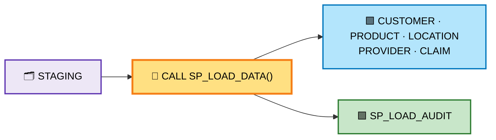

And we had two audit tables:

```text
STAGING  →  STAGING_LOAD_AUDIT      (what came in)
SP       →  SP_LOAD_AUDIT           (what the SP loaded)
```

So the only problem left is this:

```text
New records come
       ↓
STAGING
       ↓
We manually run
CALL SP_LOAD_DATA()
       ↓
Derived tables
```

**We do not want to call the SP by hand any more.**

---

## 2️⃣ New Requirement

Now we want this:

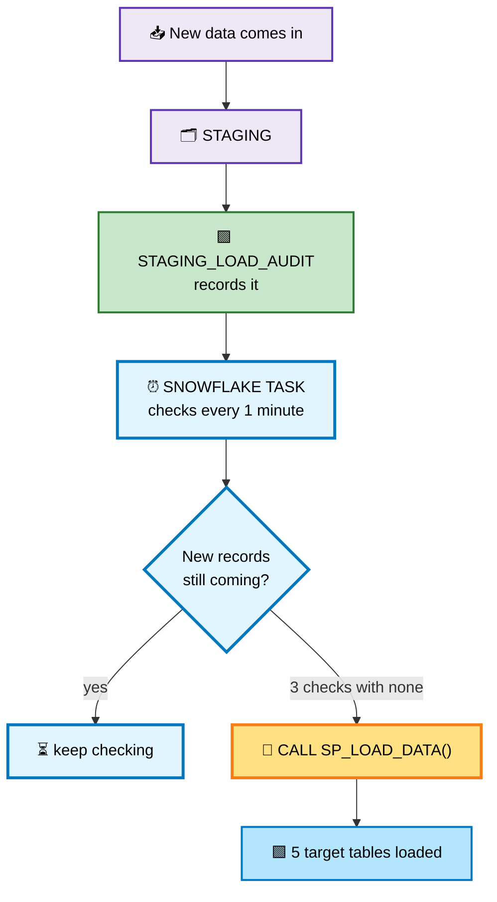

So the Task is basically asking one question, again and again:

> **"Are new records still coming?"**

- **Yes** → keep waiting
- **No, for 3 checks in a row** → the data has settled → call the SP

---

## 3️⃣ Simple Example

Suppose Load 1 comes:

```text
10:00  →  STAGING receives 5 records
```

Then the Task checks:

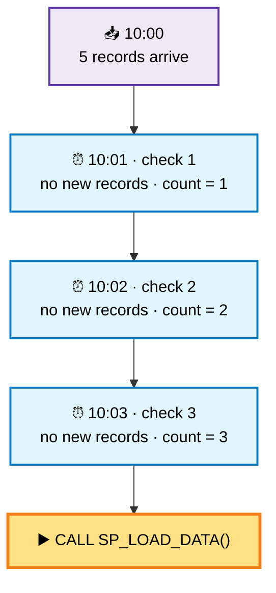

Three checks with nothing new → the data is stable → **now** call the SP.

This is exactly the table our `TASK_CHECK_AUDIT` will show:

| CHECK_ID | CHECK_TIME | RECORD_COUNT | NEW_RECORD_FOUND | CONSECUTIVE_NO_DATA_COUNT | ACTION |
| --- | --- | --- | --- | --- | --- |
| 1 | 10:01 | 5 | N | 1 | WAIT |
| 2 | 10:02 | 5 | N | 2 | WAIT |
| 3 | 10:03 | 5 | N | 3 | CALL SP |

---

## 4️⃣ What If New Data Comes During the Waiting Time?

This is very important.
Suppose 5 more records arrive **in the middle** of the counting.

Then the counter goes back to **0** and we start again.

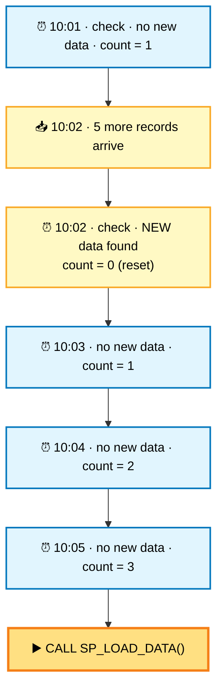

So the rule is simple:

```text
New records found  →  reset the counter  →  start counting again
No new records     →  counter + 1
Counter reaches 3  →  CALL SP_LOAD_DATA()
```

---

## 5️⃣ New Complete Architecture

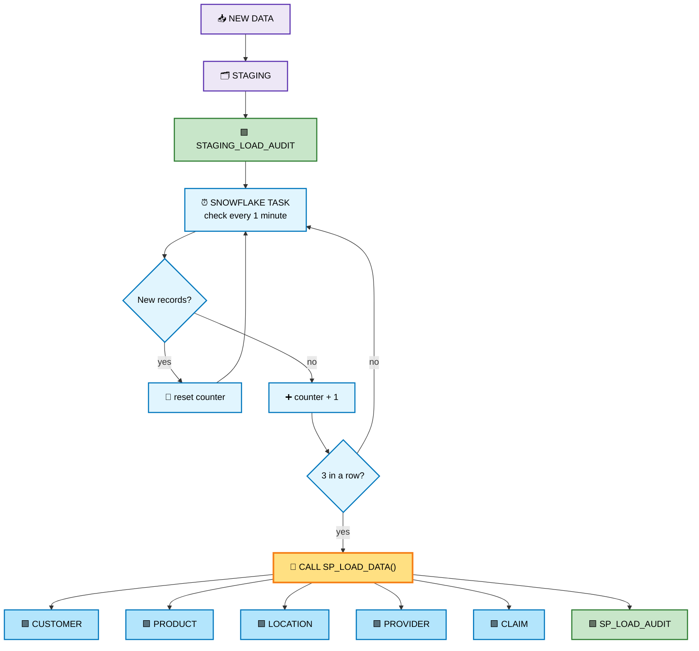

> 📌 A Task needs **compute** to run.
> So this practice creates its own warehouse: `TASK_LOAD_WH`.
> This is the first practice in this folder that needs one.

---

## 6️⃣ Very Important Point

We now have **three different things**, each with one job:

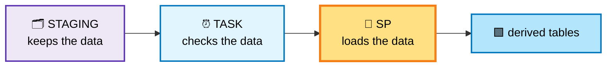

| Thing | Its only job |
| ----- | ------------ |
| `STAGING` | Stores the incoming data |
| Snowflake Task | Checks whether new data is still coming |
| Stored Procedure | Loads the data into the derived tables |

**The Task does not load anything.** It only decides **when** to load.

---

## 7️⃣ Audit Table 1 — `STAGING_LOAD_AUDIT`

This is the same table as the last practice.
It records when data comes into `STAGING`.

| LOAD_ID | RECORD_COUNT | LOAD_TIME | STATUS | COMMENTS |
| --- | --- | --- | --- | --- |
| 1 | 5 | 10:00 | SUCCESS | Load 1 inserted into STAGING |
| 2 | 5 | 10:02 | SUCCESS | Load 2 inserted into STAGING |
| 3 | 5 | 10:04 | SUCCESS | Load 3 inserted into STAGING |

So we know:

```text
Load 1 → 5
Load 2 → 5
Load 3 → 5
```

---

## 8️⃣ New Audit Table — `TASK_CHECK_AUDIT`

This is the **new** table in this practice.

It answers:

> **"What did the Task check, and why did it call the SP?"**

| Column | What it holds |
| ------ | ------------- |
| `CHECK_ID` | Which check it was (1, 2, 3 …) |
| `CHECK_TIME` | When the Task checked |
| `RECORD_COUNT` | How many records were waiting |
| `NEW_RECORD_FOUND` | `Y` = more records came since the last check, `N` = none |
| `CONSECUTIVE_NO_DATA_COUNT` | How many checks in a row had nothing new |
| `ACTION` | `IDLE`, `WAIT` or `CALL SP` |
| `COMMENTS` | A short note |

Example:

| CHECK_ID | CHECK_TIME | RECORD_COUNT | NEW_RECORD_FOUND | CONSECUTIVE_NO_DATA_COUNT | ACTION |
| --- | --- | --- | --- | --- | --- |
| 1 | 10:01 | 5 | N | 1 | WAIT |
| 2 | 10:02 | 5 | N | 2 | WAIT |
| 3 | 10:03 | 5 | N | 3 | CALL SP |

Now you can clearly see **why** the SP was called.

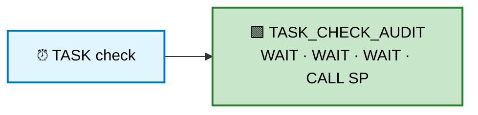

---

## 9️⃣ SP Audit Table

Then we still have `SP_LOAD_AUDIT` from the last practice.
It tells us what happened **after** the SP started.

| RUN_ID | LOAD_ID | SOURCE_TABLE | TARGET_TABLE | SOURCE_RECORD_COUNT | TARGET_RECORD_COUNT | STATUS |
| --- | --- | --- | --- | --- | --- | --- |
| 1 | 1 | STAGING | CUSTOMER | 5 | 5 | SUCCESS |
| 1 | 1 | STAGING | PRODUCT | 5 | 5 | SUCCESS |
| 1 | 1 | STAGING | LOCATION | 5 | 5 | SUCCESS |
| 1 | 1 | STAGING | PROVIDER | 5 | 5 | SUCCESS |
| 1 | 1 | STAGING | CLAIM | 5 | 5 | SUCCESS |

So together we get the **full story** of one load.

---

## 🔟 Full Audit Flow

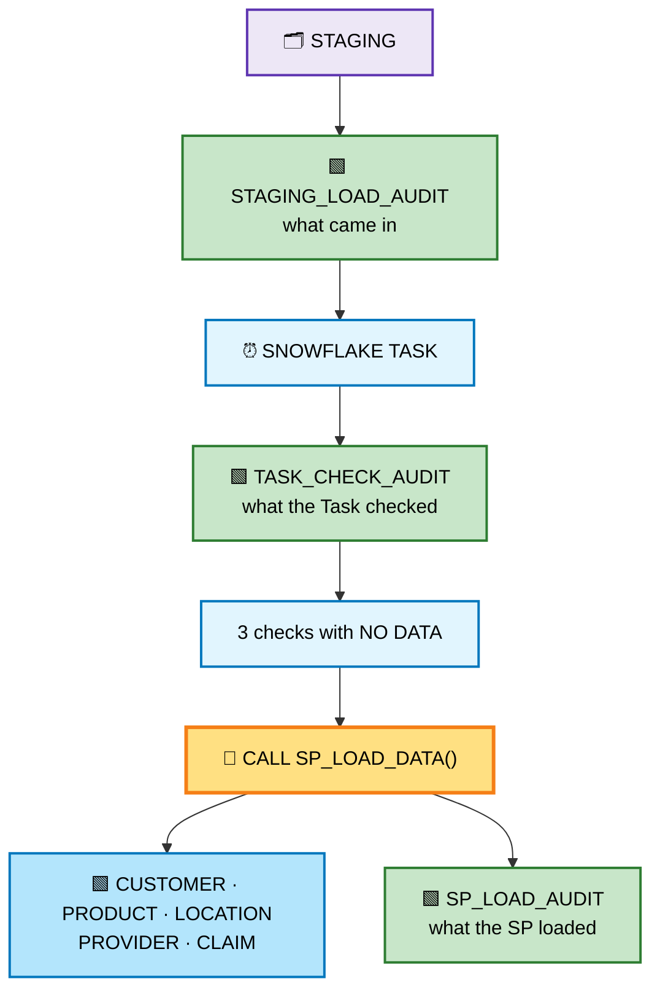

Three audit tables → three clear answers:

| Audit table | The question it answers |
| ----------- | ----------------------- |
| `STAGING_LOAD_AUDIT` | What **came in**? |
| `TASK_CHECK_AUDIT` | What did the **Task** check, and why did it call the SP? |
| `SP_LOAD_AUDIT` | What did the **SP** load? |

This is much easier to monitor when something looks wrong.

---

## 1️⃣1️⃣ What Happens With Our 6 Loads?

We still keep 6 loads × 5 records = 30 records.

Suppose all 6 loads arrive within a few minutes:

```text
Load 1 → 5
Load 2 → 5
Load 3 → 5
Load 4 → 5
Load 5 → 5
Load 6 → 5
----------------
Total    30
```

The Task keeps checking.
While new records are still arriving, the counter keeps getting reset and the Task keeps saying `WAIT`.

Once there are **3 checks in a row with nothing new**:

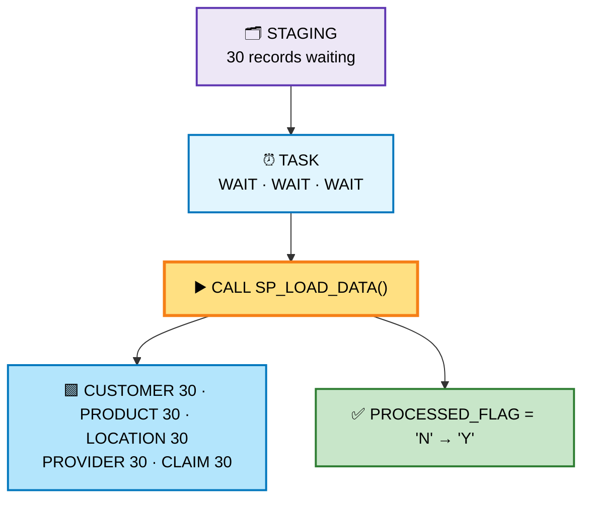

The SP then processes only the rows where `PROCESSED_FLAG = 'N'` — exactly like the last practice.

---

## 1️⃣2️⃣ What Happens When Another Load Comes Later?

Suppose after the SP finishes, another **5 records** arrive.

```text
Old records = 30   →  PROCESSED_FLAG = 'Y'
New records =  5   →  PROCESSED_FLAG = 'N'
---------------------------------------
Total       = 35
```

The Task sees the new records, and waits for:

```text
no · no · no
```

for three checks.

Then:

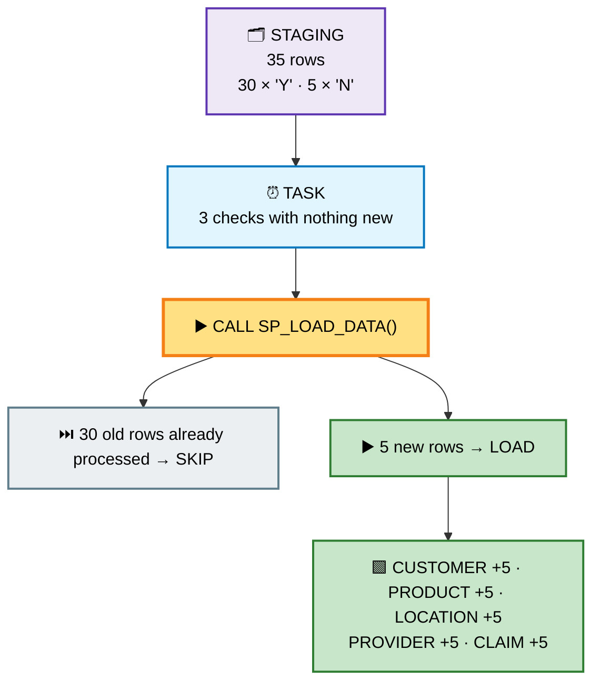

Then `PROCESSED_FLAG` becomes `'Y'` for those 5 rows again.

So every load is handled **automatically**, and no row is loaded twice.

---

## 1️⃣3️⃣ The Complete Final Pipeline

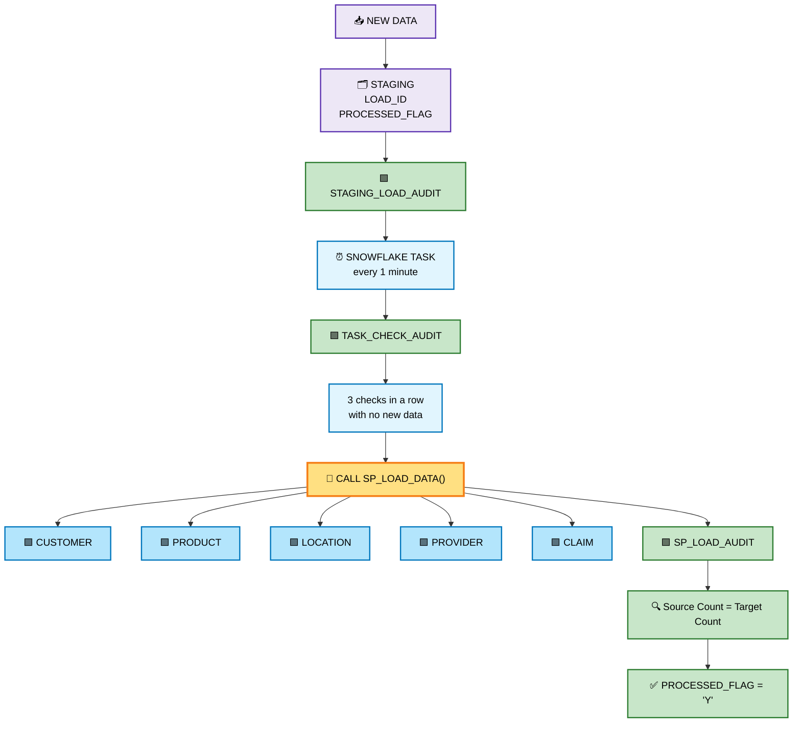

---

## 1️⃣4️⃣ One Important Technical Point

There is a **more Snowflake-native option** than checking the table every minute: a **Stream + Task**.

A Stream remembers what changed in a table, and a Task can look at it:

```text
WHEN SYSTEM$STREAM_HAS_DATA('my_stream')
```

Then the Task only runs when the stream really has something.

> ⚠️ But that does **not** give us the exact rule we want here:
> **"check 3 times, one minute apart, and only after 3 quiet checks call the SP"**.
> That is a **custom waiting rule**, so we keep our own counter in `TASK_CHECK_AUDIT`.

So the learning plan is:

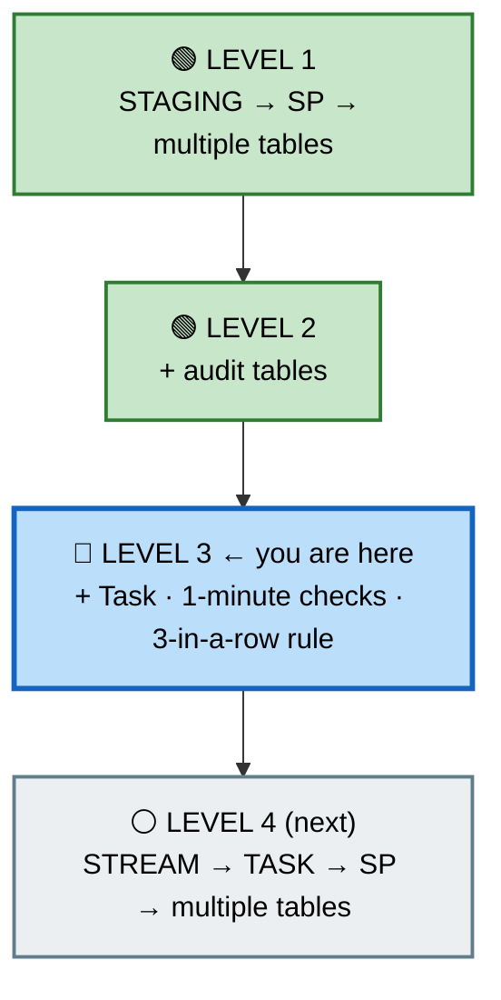

Doing **Stream + Task** as its own practice keeps the two ideas separate and easy to understand.

---

## 📌 What to Take Away

- A **Snowflake Task** runs SQL or calls a procedure on a **schedule** (here: every 1 minute).
- The Task does **not** load data. It only decides **when** to load.
- We keep a **counter**: no new data → `+1`; new data → reset to `0`.
- When the counter reaches **3**, the data has settled, and the Task calls the SP.
- `TASK_CHECK_AUDIT` shows **every check** and **why** the SP was called.
- Newly created Tasks are **suspended**. They only run after `ALTER TASK ... RESUME`.
- A Task needs a **warehouse** for compute — so this practice creates `TASK_LOAD_WH`.
- To try it without waiting, run the check by hand:
  `CALL SP_TASK_CHECK();` three times.
- **Remember to suspend the Task when you finish**, otherwise it keeps running every minute.
