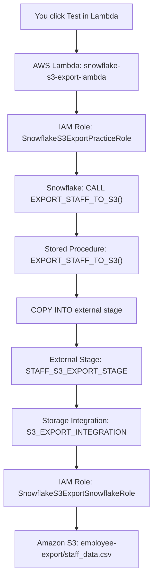

# 63) Snowflake to S3 Export Pipeline

> **Lambda Trigger → Stored Procedure → External Stage → Storage Integration → Amazon S3**

## 📁 Files in This Folder

| File | What It Is |
| ---- | ---------- |
| [01) README.md](01%29%20README.md) | This explanation |
| [snowflake.sql](snowflake.sql) | All Snowflake objects — database, schema, warehouse, table, file format, storage integration, external stage and stored procedure |
| [lambda_function.py](lambda_function.py) | AWS Lambda handler — connects to Snowflake, calls the stored procedure, verifies the file in S3 and logs to CloudWatch |
| [trust_policy_lambda_role.json](trust_policy_lambda_role.json) | Trust policy for `SnowflakeS3ExportPracticeRole` — lets `lambda.amazonaws.com` assume the role |
| [trust_policy_snowflake_role.json](trust_policy_snowflake_role.json) | Trust policy for `SnowflakeS3ExportSnowflakeRole` — lets Snowflake's IAM identity assume the role |

## 🎯 Goal

> 📌 **AWS Lambda triggers a Snowflake Stored Procedure. The procedure unloads `STAFF_DATA` with `COPY INTO` through a storage integration and an external stage, landing the data in Amazon S3 as a single named CSV file — `staff_data.csv`. Lambda then verifies the file with `LIST` and writes a structured execution log to CloudWatch.**

| Item | Value |
| ---- | ----- |
| Source table | `SNOWFLAKE_S3_EXPORT_PRACTICE.S3_EXPORT_SCHEMA.STAFF_DATA` |
| AWS destination | `s3://snowflake-s3-export-practice-2026/employee-export/staff_data.csv` |
| Trigger | AWS Lambda `snowflake-s3-export-lambda` (Python 3.12) |
| Lambda role | `SnowflakeS3ExportPracticeRole` |
| Snowflake role | `SnowflakeS3ExportSnowflakeRole` |

---

## 🧭 1. The Complete Picture



---

## 💡 2. First Understand the Business Idea

Snowflake contains:

```text
STAFF_DATA

STAFF_ID | STAFF_NAME | DEPARTMENT       | CITY      | SALARY
---------|------------|------------------|-----------|---------
201      | Kshitij    | Data Engineering | Pune      | 1200000
202      | Rahul      | AWS Engineering  | Mumbai    | 1000000
203      | Amit       | Data Analytics   | Bangalore | 900000
204      | Sneha      | Data Engineering | Pune      | 1100000
205      | Priya      | Cloud Engineering| Hyderabad | 1050000
```

A downstream process needs this data as a **CSV file in Amazon S3**.

Instead of a person logging into Snowflake and running `COPY INTO` by hand, we let **AWS Lambda** trigger the export:

```text
Lambda
   ↓
"Snowflake, please export STAFF_DATA to S3."
   ↓
Snowflake does the export
```

This is the same idea as pipeline **62**, with one important upgrade: the file does not stop inside Snowflake — it lands in **Amazon S3**.

| Pipeline | Destination of the exported file |
| -------- | -------------------------------- |
| 52 | Table → **Internal Stage** → CSV |
| 62 | Lambda → SP → **Internal Stage** → CSV |
| **63** | Lambda → SP → **External Stage → S3** → CSV |

---

## ⚡ 3. Why Do We Use Lambda?

Lambda is only the **external trigger / orchestrator**. It does not move the data itself.

```text
Lambda
   │  "Run the export"
   ▼
Snowflake Stored Procedure
   │  "Okay, I'll handle it"
   ▼
Data export
```

### 🧩 The Four Roles

| Component | Responsibility |
| --------- | -------------- |
| **Lambda** | Orchestration / trigger / verification / logging |
| **Stored Procedure** | Database-side export logic |
| **External Stage** | Named S3 location that Snowflake writes to |
| **Storage Integration** | Trust between Snowflake and the IAM role — no access keys |

---

## 📦 4. Why Use a Stored Procedure?

Instead of embedding SQL inside Python, the export logic lives in Snowflake:

```sql
CREATE OR REPLACE PROCEDURE EXPORT_STAFF_TO_S3()
```

and internally:

```sql
COPY INTO @STAFF_S3_EXPORT_STAGE/staff_data.csv
FROM STAFF_DATA
FILE_FORMAT = (FORMAT_NAME = 'STAFF_CSV_FORMAT')
HEADER = TRUE
SINGLE = TRUE
OVERWRITE = TRUE;
```

So Lambda only ever needs to know:

```sql
CALL EXPORT_STAFF_TO_S3();
```

```text
Lambda                Stored Procedure
   │                        │
   │ Trigger only           │ Validation / transformation /
   └───────────────────────▶│ export / audit / status
```

---

## 🔐 5. Why Do We Need TWO IAM Roles?

**This is the most important concept in the pipeline.**

There are two different AWS identities that need to assume a role, and their **trust relationships are different** — so they cannot be the same role.

### Role 1 — `SnowflakeS3ExportPracticeRole`

The **Lambda execution role**.

```text
AWS Lambda
     │ AssumeRole
     ▼
SnowflakeS3ExportPracticeRole
```

Its trust policy says:

```json
"Principal": { "Service": "lambda.amazonaws.com" }
```

Meaning:

> **The Lambda service is allowed to assume this role.**

Attached policies:

| Policy | Needed? | Why |
| ------ | ------- | --- |
| `AWSLambdaBasicExecutionRole` | ✅ Yes | Lets Lambda write `print()` output to CloudWatch Logs |
| `AmazonS3FullAccess` | ⚠️ Not by this code | Lambda never touches S3 directly — it only calls Snowflake. Kept here because this is a practice setup |

### Role 2 — `SnowflakeS3ExportSnowflakeRole`

The **Snowflake → S3 role**. This one is **never attached to Lambda**.

```text
Snowflake
     │ Storage Integration
     ▼
SnowflakeS3ExportSnowflakeRole
     │
     ▼
Amazon S3
```

Its trust policy says:

```json
"Principal": { "AWS": "arn:aws:iam::715831355129:user/une52000-s" }
```

Meaning:

> **Snowflake's IAM identity is allowed to assume this role** — but only when the request carries the matching external ID.

Attached policy:

```text
SnowflakeS3ExportSnowflakeRole
        │
        └── AmazonS3FullAccess
```

| | Role 1 | Role 2 |
| ---- | ------ | ------ |
| Used by | Lambda | Snowflake |
| Attached to Lambda? | ✅ Yes | ❌ No |
| Trust principal | `lambda.amazonaws.com` | Snowflake IAM user |
| `AWSLambdaBasicExecutionRole` | ✅ Yes | ❌ No |
| `AmazonS3FullAccess` | ✅ Attached | ✅ Attached |
| Used by the storage integration? | ❌ No | ✅ Yes |

> 🔑 **Remember it like this**
> Role 1 = *Lambda's identity*.
> Role 2 = *Snowflake's identity for reaching S3*.

### Why can't we use one role?

Because IAM trust policies decide **who may assume the role**, and these two callers are different:

```text
Role 1 trusts:  lambda.amazonaws.com        → Lambda
Role 2 trusts:  arn:aws:iam::715831355129:user/une52000-s → Snowflake
```

A role cannot sensibly trust "Lambda" *and* be assumed by Snowflake for S3 access without breaking least privilege. Two identities → two roles.

---

## 🏗️ 6. Correct Creation Order

There is a hard dependency: **the storage integration needs the AWS role ARN**, and the **AWS role needs the values that `DESC INTEGRATION` returns**. So the order below matters.

```text
 1. Create the S3 bucket + employee-export/ prefix
        ↓
 2. Create Snowflake database, schema, warehouse, table, data, file format
        ↓
 3. Create the AWS role  SnowflakeS3ExportSnowflakeRole
        ↓
 4. Copy its Role ARN
        ↓
 5. Create the Snowflake storage integration
        ↓
 6. DESC INTEGRATION
        ↓
 7. Copy STORAGE_AWS_IAM_USER_ARN + STORAGE_AWS_EXTERNAL_ID
        ↓
 8. Paste them into the AWS trust policy (edit trust relationship)
        ↓
 9. Create the external stage
        ↓
10. LIST the stage  (proves Snowflake can reach S3)
        ↓
11. Create the stored procedure
        ↓
12. Create the Lambda function + role + Snowflake connector layer
```

---

## 🪣 Step 1 — Create the S3 Bucket

In the AWS Console:

```text
S3
 └── Create bucket
        Bucket name : snowflake-s3-export-practice-2026
        Region      : same region as your Snowflake account, if possible
```

Then create the prefix (folder):

```text
snowflake-s3-export-practice-2026
│
└── employee-export/
        │
        └── staff_data.csv        ← created later by Snowflake
```

> 📌 You do **not** need to make the bucket public. Only the IAM role gets access, and only through the storage integration.

---

## 🗄️ Step 2 — Create the Database

```sql
CREATE DATABASE SNOWFLAKE_S3_EXPORT_PRACTICE;

USE DATABASE SNOWFLAKE_S3_EXPORT_PRACTICE;
```

---

## 📂 Step 3 — Create the Schema

```sql
CREATE SCHEMA S3_EXPORT_SCHEMA;

USE SCHEMA S3_EXPORT_SCHEMA;
```

---

## ⚙️ Step 4 — Create the Warehouse

```sql
CREATE WAREHOUSE S3_EXPORT_WH
WITH
    WAREHOUSE_SIZE = 'XSMALL'
    AUTO_SUSPEND = 60
    AUTO_RESUME = TRUE;

USE WAREHOUSE S3_EXPORT_WH;
```

| Parameter | Meaning |
| --------- | ------- |
| `WAREHOUSE_SIZE = 'XSMALL'` | Cheapest compute size — fine for practice |
| `AUTO_SUSPEND = 60` | Suspends after 60 seconds of inactivity, so you are not billed while idle |
| `AUTO_RESUME = TRUE` | Starts automatically again when a query needs it |

---

## 📋 Step 5 — Create the Source Table

```sql
CREATE TABLE STAFF_DATA (
    STAFF_ID NUMBER,
    STAFF_NAME VARCHAR(100),
    DEPARTMENT VARCHAR(100),
    CITY VARCHAR(100),
    SALARY NUMBER
);

DESC TABLE STAFF_DATA;
```

---

## 📝 Step 6 — Insert Sample Data

```sql
INSERT INTO STAFF_DATA
    (STAFF_ID, STAFF_NAME, DEPARTMENT, CITY, SALARY)
VALUES
    (201, 'Kshitij', 'Data Engineering', 'Pune', 1200000),
    (202, 'Rahul', 'AWS Engineering', 'Mumbai', 1000000),
    (203, 'Amit', 'Data Analytics', 'Bangalore', 900000),
    (204, 'Sneha', 'Data Engineering', 'Pune', 1100000),
    (205, 'Priya', 'Cloud Engineering', 'Hyderabad', 1050000);

SELECT *
FROM STAFF_DATA;
```

Expected:

```text
+----------+------------+-------------------+-----------+---------+
| STAFF_ID | STAFF_NAME | DEPARTMENT        | CITY      | SALARY  |
|----------+------------+-------------------+-----------+---------|
|      201 | Kshitij    | Data Engineering  | Pune      | 1200000 |
|      202 | Rahul      | AWS Engineering   | Mumbai    | 1000000 |
|      203 | Amit       | Data Analytics    | Bangalore |  900000 |
|      204 | Sneha      | Data Engineering  | Pune      | 1100000 |
|      205 | Priya      | Cloud Engineering | Hyderabad | 1050000 |
+----------+------------+-------------------+-----------+---------+
```

---

## 📄 Step 7 — Create the CSV File Format

```sql
CREATE FILE FORMAT STAFF_CSV_FORMAT
    TYPE = 'CSV'
    FIELD_OPTIONALLY_ENCLOSED_BY = '"'
    SKIP_HEADER = 1
    COMPRESSION = 'NONE';

SHOW FILE FORMATS;
```

The generated file looks like:

```text
STAFF_ID,STAFF_NAME,DEPARTMENT,CITY,SALARY
201,Kshitij,Data Engineering,Pune,1200000
202,Rahul,AWS Engineering,Mumbai,1000000
...
```

> 📌 `SKIP_HEADER = 1` applies when **reading** a file back with this format. The header for the **unloaded** file is controlled by `HEADER = TRUE` in the `COPY INTO` statement.

---

## 🔐 Step 8 — Create the AWS Role for Snowflake

Create a role with:

```text
Trusted entity type : AWS account
Role name           : SnowflakeS3ExportSnowflakeRole
```

Use a temporary trust policy — it will be replaced in Step 12:

```json
{
  "Version": "2012-10-17",
  "Statement": [
    {
      "Effect": "Allow",
      "Principal": { "AWS": "arn:aws:iam::715831355129:user/une52000-s" },
      "Action": "sts:AssumeRole",
      "Condition": {
        "StringEquals": { "sts:ExternalId": "XGC76761_SFCRole=4_j3ikOEOAHaRpt6s48NPBw54IHlA=" }
      }
    }
  ]
}
```

Attach `AmazonS3FullAccess` to this role so Snowflake can read and write the bucket.

Copy the **role ARN**:

```text
arn:aws:iam::772346609795:role/SnowflakeS3ExportSnowflakeRole
```

---

## 🔐 Step 9 — Create the AWS Lambda Execution Role

Create a second role:

```text
Trusted entity type : AWS service → Lambda
Role name           : SnowflakeS3ExportPracticeRole
Attached policies   : AWSLambdaBasicExecutionRole
                      AmazonS3FullAccess   (not required by this code)
```

Trust policy — see [trust_policy_lambda_role.json](trust_policy_lambda_role.json):

```json
{
  "Version": "2012-10-17",
  "Statement": [
    {
      "Effect": "Allow",
      "Principal": { "Service": "lambda.amazonaws.com" },
      "Action": "sts:AssumeRole"
    }
  ]
}
```

> ⚠️ `AmazonS3FullAccess` is **not used by this Lambda code**. Lambda calls Snowflake, and Snowflake writes to S3. Keep it only because this is a managed-policy practice setup; in production, remove it.

---

## 🔗 Step 10 — Create the Storage Integration

```sql
CREATE OR REPLACE STORAGE INTEGRATION S3_EXPORT_INTEGRATION
    TYPE = EXTERNAL_STAGE
    STORAGE_PROVIDER = S3
    ENABLED = TRUE
    STORAGE_AWS_ROLE_ARN =
        'arn:aws:iam::772346609795:role/SnowflakeS3ExportSnowflakeRole'
    STORAGE_ALLOWED_LOCATIONS = (
        's3://snowflake-s3-export-practice-2026/employee-export/'
    );
```

This tells Snowflake:

> "You may use this AWS IAM role, but only for this S3 location."

| Parameter | Meaning |
| --------- | ------- |
| `TYPE = EXTERNAL_STAGE` | The integration is used by external stages |
| `STORAGE_PROVIDER = S3` | The cloud storage is Amazon S3 |
| `STORAGE_AWS_ROLE_ARN` | The role Snowflake will assume |
| `STORAGE_ALLOWED_LOCATIONS` | The only path Snowflake is allowed to touch |

> 📌 No AWS access keys are stored anywhere. That is the whole point of a storage integration.

---

## 🔍 Step 11 — Describe the Integration

```sql
DESC INTEGRATION S3_EXPORT_INTEGRATION;
```

Look at two rows:

```text
+----------------------------+-----------------------------------------------------------+
| property                   | property_value                                            |
|----------------------------+-----------------------------------------------------------|
| STORAGE_AWS_IAM_USER_ARN   | arn:aws:iam::715831355129:user/une52000-s                 |
| STORAGE_AWS_EXTERNAL_ID    | XGC76761_SFCRole=4_j3ikOEOAHaRpt6s48NPBw54IHlA=           |
+----------------------------+-----------------------------------------------------------+
```

Where do these come from?

```text
Snowflake
   │
   │ DESC INTEGRATION
   ▼
IAM user ARN + External ID
   │
   ▼
AWS trust policy
```

> ⚠️ The IAM **user** ARN lives in Snowflake's AWS account — a *different* account (`715831355129`) from your role (`772346609795`). That is expected: Snowflake's identity assumes a role **inside your account**.

---

## 🔐 Step 12 — Update the AWS Trust Policy

```text
AWS Console → IAM → Roles → SnowflakeS3ExportSnowflakeRole
            → Trust relationships → Edit trust policy
```

Paste — see [trust_policy_snowflake_role.json](trust_policy_snowflake_role.json):

```json
{
  "Version": "2012-10-17",
  "Statement": [
    {
      "Effect": "Allow",
      "Principal": { "AWS": "arn:aws:iam::715831355129:user/une52000-s" },
      "Action": "sts:AssumeRole",
      "Condition": {
        "StringEquals": { "sts:ExternalId": "XGC76761_SFCRole=4_j3ikOEOAHaRpt6s48NPBw54IHlA=" }
      }
    }
  ]
}
```

Click **Update policy**.

> 📌 The `sts:ExternalId` condition is what stops another AWS account from tricking Snowflake into handing over data — Snowflake generates it, you copy it, and only requests carrying it can assume the role.

---

## 📥 Step 13 — Create the External Stage

```sql
CREATE OR REPLACE STAGE STAFF_S3_EXPORT_STAGE
    URL = 's3://snowflake-s3-export-practice-2026/employee-export/'
    STORAGE_INTEGRATION = S3_EXPORT_INTEGRATION
    FILE_FORMAT = STAFF_CSV_FORMAT;
```

Verify:

```sql
SHOW STAGES;

DESC STAGE STAFF_S3_EXPORT_STAGE;
```

`DESC STAGE` should show the S3 URL and:

```text
STORAGE_INTEGRATION = S3_EXPORT_INTEGRATION
```

---

## 🧪 Step 14 — Test S3 Connectivity

```sql
LIST @STAFF_S3_EXPORT_STAGE;
```

First run:

```text
+------+------+-----+---------------+
| name | size | md5 | last_modified |
|------+------+-----+---------------|
+------+------+-----+---------------+
```

Interpretation:

| Result | Meaning |
| ------ | ------- |
| **0 rows** | ✅ Normal — nothing has been exported yet |
| **Access Denied** | ❌ The trust policy, role ARN or S3 permissions are wrong |
| **A file listed** | ✅ The export already ran |

> 📌 The goal of this step is simply: **no "Access Denied"**. That proves Snowflake → AWS authentication works.

---

## ⚙️ Step 15 — Create the Stored Procedure

```sql
CREATE OR REPLACE PROCEDURE EXPORT_STAFF_TO_S3()
RETURNS STRING
LANGUAGE SQL
AS
$$
BEGIN

    COPY INTO @STAFF_S3_EXPORT_STAGE/staff_data.csv
    FROM STAFF_DATA
    FILE_FORMAT = (
        FORMAT_NAME = 'STAFF_CSV_FORMAT'
    )
    HEADER = TRUE
    SINGLE = TRUE
    OVERWRITE = TRUE;

    RETURN 'SUCCESS: Staff data successfully exported to S3 as staff_data.csv';

END;
$$;
```

The important parts:

| Clause | Meaning |
| ------ | ------- |
| `@STAFF_S3_EXPORT_STAGE/staff_data.csv` | Write the output **with this exact filename** |
| `HEADER = TRUE` | Write the column names as the first row |
| `SINGLE = TRUE` | Create **one** file instead of many part files |
| `OVERWRITE = TRUE` | Replace the file if it already exists |

### 💡 Why is the filename written explicitly?

Because the target path ends with a name, not just a folder:

```text
@STAFF_S3_EXPORT_STAGE/staff_data.csv
                       ^^^^^^^^^^^^^^^
                       exact file name
```

That gives you a predictable name and extension instead of a generated part-file name.

### 🚨 Do NOT run `CALL` here

```sql
-- CALL EXPORT_STAFF_TO_S3();
```

Lambda executes the procedure:

```python
cursor.execute("CALL EXPORT_STAFF_TO_S3()")
```

---

## 🐍 Step 16 — Create the Lambda Function

| Setting | Value |
| ------- | ----- |
| Function name | `snowflake-s3-export-lambda` |
| Runtime | Python 3.12 |
| Handler | `lambda_function.lambda_handler` |
| Execution role | `SnowflakeS3ExportPracticeRole` |

Code: [lambda_function.py](lambda_function.py)

> ⚠️ **The handler matters.** The file must be called `lambda_function.py` and contain `def lambda_handler(event, context):` — otherwise Lambda cannot find your function.

> ✅ Do **not** select `SnowflakeS3ExportSnowflakeRole` here. That role belongs to Snowflake, not Lambda.

### 📦 Snowflake connector layer

The standard Python runtime does **not** include the Snowflake connector. Attach a layer that provides it, because the code imports:

```python
import snowflake.connector
```

```text
Lambda
 │
 ├── lambda_function.py
 │
 └── Snowflake Connector Layer
          │
          └── snowflake.connector
```

### 🔐 Password

```python
password="<YOUR_SNOWFLAKE_PASSWORD>"
```

> ⚠️ The placeholder is deliberate — **never commit a real Snowflake password**. For anything beyond practice, store it in AWS Secrets Manager and read it at runtime.

---

## ▶️ Step 17 — What Happens When You Click Test

```text
1. You click TEST
        ↓
2. lambda_handler() starts and logs the request ID
        ↓
3. Lambda connects to Snowflake with the Python connector
        ↓
4. Lambda executes:  CALL EXPORT_STAFF_TO_S3()
        ↓
5. The stored procedure runs COPY INTO @STAFF_S3_EXPORT_STAGE/staff_data.csv
        ↓
6. Snowflake assumes SnowflakeS3ExportSnowflakeRole via the storage integration
        ↓
7. Snowflake writes staff_data.csv to S3
        ↓
8. Lambda runs LIST @STAFF_S3_EXPORT_STAGE and prints the file name, size and MD5
        ↓
9. Lambda closes the cursor and connection
        ↓
10. All print() output appears in CloudWatch Logs
```

Expected CloudWatch output:

```text
======================================================================
SNOWFLAKE -> S3 EXPORT PIPELINE
======================================================================

[1/4] Connecting to Snowflake...
      Snowflake connection : SUCCESS
      Database             : SNOWFLAKE_S3_EXPORT_PRACTICE
      Schema               : S3_EXPORT_SCHEMA
      Warehouse            : S3_EXPORT_WH

[2/4] Executing Snowflake Stored Procedure...
      Procedure            : EXPORT_STAFF_TO_S3
      Stored Procedure     : SUCCESS
      SP Result            : SUCCESS: Staff data successfully exported to S3 as staff_data.csv

[3/4] Checking the S3 export location...
      Stage                : @STAFF_S3_EXPORT_STAGE
      Files Found          : 1
      File Name            : s3://snowflake-s3-export-practice-2026/employee-export/staff_data.csv
      File Size            : 342 bytes
      MD5                  : 0a1b2c3d4e5f6a7b8c9d0e1f2a3b4c5d6

[4/4] PIPELINE COMPLETED SUCCESSFULLY

------------------------------------------------------------------
EXPORT SUMMARY
------------------------------------------------------------------
Source Table              : STAFF_DATA
Stored Procedure          : EXPORT_STAFF_TO_S3
Export Stage              : @STAFF_S3_EXPORT_STAGE
Export Format             : CSV
Files Generated           : 1
Execution Time            : 3.12 seconds
Final Status              : SUCCESS
------------------------------------------------------------------
```

And in S3:

```text
snowflake-s3-export-practice-2026
└── employee-export/
        └── staff_data.csv
```

---

## 📊 Roles Comparison

| Item | `SnowflakeS3ExportPracticeRole` | `SnowflakeS3ExportSnowflakeRole` |
| ---- | ------------------------------- | -------------------------------- |
| Used by | Lambda | Snowflake |
| Attached to Lambda? | ✅ YES | ❌ NO |
| Purpose | Lambda execution | Snowflake → S3 access |
| `AWSLambdaBasicExecutionRole` | ✅ Yes | ❌ No |
| `AmazonS3FullAccess` | ✅ Currently attached | ✅ Yes |
| Trust principal | `lambda.amazonaws.com` | Snowflake IAM user |
| Used for CloudWatch logs | ✅ | ❌ |
| Used for S3 by the current Lambda code | ❌ Not actually required | ✅ Yes |
| Used by the storage integration | ❌ | ✅ Yes |

---

## 🗂️ Final Snowflake Objects

```text
SNOWFLAKE_S3_EXPORT_PRACTICE
│
└── S3_EXPORT_SCHEMA
    │
    ├── STAFF_DATA
    ├── STAFF_CSV_FORMAT
    ├── S3_EXPORT_INTEGRATION
    ├── STAFF_S3_EXPORT_STAGE
    └── EXPORT_STAFF_TO_S3()

S3_EXPORT_WH
```

---

## ☁️ Final AWS Objects

```text
AWS
│
├── S3
│   └── snowflake-s3-export-practice-2026
│       └── employee-export/
│           └── staff_data.csv
│
├── IAM Role
│   └── SnowflakeS3ExportPracticeRole
│       ├── AWSLambdaBasicExecutionRole
│       └── AmazonS3FullAccess
│
├── IAM Role
│   └── SnowflakeS3ExportSnowflakeRole
│       └── AmazonS3FullAccess
│
└── Lambda
    └── snowflake-s3-export-lambda
        └── Layer: Snowflake Python Connector
```

---

## 🧹 Cleanup

```sql
-- Snowflake
DROP PROCEDURE IF EXISTS EXPORT_STAFF_TO_S3();
DROP STAGE IF EXISTS STAFF_S3_EXPORT_STAGE;
DROP STORAGE INTEGRATION IF EXISTS S3_EXPORT_INTEGRATION;
DROP FILE FORMAT IF EXISTS STAFF_CSV_FORMAT;
DROP TABLE IF EXISTS STAFF_DATA;
DROP SCHEMA IF EXISTS S3_EXPORT_SCHEMA;
DROP DATABASE IF EXISTS SNOWFLAKE_S3_EXPORT_PRACTICE;
DROP WAREHOUSE IF EXISTS S3_EXPORT_WH;
```

```text
AWS
 ├── Delete the Lambda function snowflake-s3-export-lambda
 ├── Delete the role SnowflakeS3ExportPracticeRole
 ├── Delete the role SnowflakeS3ExportSnowflakeRole
 ├── Empty the bucket snowflake-s3-export-practice-2026
 └── Delete the bucket snowflake-s3-export-practice-2026
```

> 📌 Drop the stage and integration **before** deleting the IAM role, otherwise Snowflake may still reference a role that no longer exists.

---

## 🚨 Common Errors

| Error | Cause | Fix |
| ----- | ----- | --- |
| `Access Denied` on `LIST @stage` | Trust policy does not match the integration | Re-run `DESC INTEGRATION` and paste both values into the role trust policy |
| `Access Denied` even with the right trust policy | Role cannot write to the bucket | Attach `AmazonS3FullAccess` to the role |
| `Insufficient privileges to operate on integration` | The role creating the stage has no rights on the integration | `GRANT USAGE ON INTEGRATION S3_EXPORT_INTEGRATION TO ROLE <your_role>;` |
| `Storage integration ... is not enabled` | `ENABLED = TRUE` was missed or set to false | `ALTER STORAGE INTEGRATION S3_EXPORT_INTEGRATION SET ENABLED = TRUE;` |
| `Failure using stage area. Cause: Access Denied` during `COPY INTO` | The allowed location does not include the path being written | Add the path to `STORAGE_ALLOWED_LOCATIONS` |
| Lambda: `Unable to import module 'lambda_function'` | Wrong handler or file name | File must be `lambda_function.py`, handler `lambda_function.lambda_handler` |
| Lambda: `No module named 'snowflake'` | Connector layer not attached | Attach the Snowflake connector layer |
| Lambda: `250001: Could not connect to Snowflake backend` | Wrong account identifier or no network access to Snowflake | Verify `account="XLTGLZP-IZC37171"` and the account is not blocked |
| Extra part files in S3 instead of one file | `SINGLE = TRUE` missing | Recreate the procedure with `SINGLE = TRUE` |
| File has no header row | `HEADER = TRUE` missing in `COPY INTO` | Add `HEADER = TRUE` |

---

## 🎓 What to Take Away

**Snowflake**

```text
CREATE DATABASE / SCHEMA / WAREHOUSE
CREATE TABLE / INSERT / SELECT
CREATE FILE FORMAT
CREATE STORAGE INTEGRATION   ← Snowflake → AWS trust
DESC INTEGRATION
CREATE STAGE (external)
SHOW STAGES / DESC STAGE / LIST @stage
COPY INTO @stage   ← the actual unload
CREATE PROCEDURE / CALL
SINGLE / HEADER / OVERWRITE
```

**AWS**

```text
S3 bucket + prefix
IAM role + trust policy
External ID condition
Managed policies
Lambda + handler + runtime
Lambda layers
CloudWatch Logs
```

**Integration**

```text
Lambda
   ↓ Snowflake Connector
Snowflake
   ↓ CALL
Stored Procedure
   ↓ COPY INTO
External Stage
   ↓ Storage Integration
IAM Role
   ↓
Amazon S3
```

---

## 🗣️ Interview Explanation

> "I built a Snowflake-to-S3 export pipeline where AWS Lambda acts as the external orchestrator. Lambda connects to Snowflake using the Snowflake Python Connector and calls a stored procedure. The procedure runs `COPY INTO` against an external stage, which is secured by a Snowflake **storage integration** — so no AWS keys are stored in Snowflake; instead Snowflake assumes an IAM role with an external ID condition. The data is unloaded to Amazon S3 as a single CSV file using `HEADER = TRUE`, `SINGLE = TRUE` and an explicit target filename. After the procedure returns, Lambda verifies the file with `LIST`, logs file name, size and MD5 to CloudWatch, and returns a structured success or failure response. The design uses **two IAM roles** because the two callers are different AWS identities: one role is assumed by the Lambda service, and the other is assumed by Snowflake's IAM user for S3 access."
