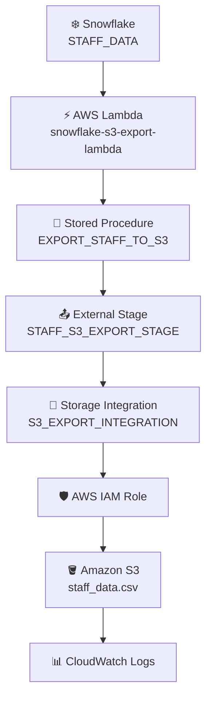

# 🚀 Snowflake → Amazon S3 Export Pipeline

## 📌 1. Pipeline Overview
**Pipeline:** ⚡ AWS Lambda → ❄️ Snowflake Stored Procedure → 📤 External Stage → 🔐 Storage Integration → 🪣 Amazon S3

**Purpose:**
To export data from a Snowflake table into Amazon S3 as a CSV file using AWS Lambda to trigger and verify the process.

---

## 🎯 2. Pipeline Goal
The goal is to achieve the following:

- ❄️ Keep source data in Snowflake.
- ⚡ Trigger the export through AWS Lambda.
- 🧩 Use a Snowflake Stored Procedure for the export logic.
- 🔐 Securely connect Snowflake to S3 using Storage Integration and IAM.
- 📄 Generate a CSV file in S3.
- ✅ Verify the exported file.
- 📣 Return a clear **SUCCESS / FAILED** status.

---

## 🏗️ 3. Architecture Diagram



---

# 🔄 4. End-to-End Flow

### 📥 Step 1 — Source Data
The source data is stored in the Snowflake table:

**`STAFF_DATA`**

This table contains the staff information that needs to be exported.

### ⚡ Step 2 — Lambda Trigger
The AWS Lambda function:

**`snowflake-s3-export-lambda`**

starts the pipeline.

### 🔌 Step 3 — Connect to Snowflake
Lambda establishes a connection to the configured Snowflake database, schema, and warehouse.

### 📞 Step 4 — Call Stored Procedure
Lambda invokes:

**`EXPORT_STAFF_TO_S3`**

The Lambda does not directly export the data.

### ❄️ Step 5 — Snowflake Starts Export
The Stored Procedure instructs Snowflake to export the data from `STAFF_DATA`.

### 📤 Step 6 — External Stage
Snowflake uses:

**`STAFF_S3_EXPORT_STAGE`**

as the destination reference for Amazon S3.

### 🔐 Step 7 — Storage Integration
The External Stage uses:

**`S3_EXPORT_INTEGRATION`**

to establish secure access between Snowflake and AWS.

### 🛡️ Step 8 — IAM Authentication
The Storage Integration uses the configured AWS IAM role to authorize Snowflake's access to the S3 location.

### ☁️ Step 9 — Export to S3
Snowflake writes the exported data to:

```
s3://snowflake-s3-export-practice-2026/employee-export/
```

### 📄 Step 10 — CSV File Creation
The pipeline generates:

```
staff_data.csv
```

### ✅ Step 11 — File Verification
After the Stored Procedure finishes, Lambda checks the External Stage to verify that the exported file is available.

### 🔍 Step 12 — File Information
Lambda can retrieve information such as:

- 📄 File name
- 📏 File size
- 🔢 Number of files
- 🏷️ File metadata

### 🎉 Step 13 — Successful Execution
If the export and verification are successful, Lambda marks the pipeline as:

**SUCCESS**

### 🚨 Step 14 — Failure Handling
If any major step fails, Lambda captures the error and returns:

**FAILED**

### 📊 Step 15 — Logging
Lambda execution details and errors are available in **Amazon CloudWatch Logs**.

### 📁 Step 16 — Final Data Location
The final file is available at:

```
Amazon S3
└── snowflake-s3-export-practice-2026
    └── employee-export
        └── staff_data.csv
```

---

# 🧩 5. Component Responsibilities

| 🧩 Component | 📋 Responsibility |
| ------------ | ----------------- |
| `STAFF_DATA` | Source data |
| AWS Lambda | Trigger and orchestration |
| Stored Procedure | Export logic |
| External Stage | S3 destination reference |
| Storage Integration | Snowflake → AWS connection |
| IAM Role | Authorization |
| Amazon S3 | Stores CSV file |
| CloudWatch | Lambda monitoring and logs |

---

# 🧵 6. Complete Flow in One Line

```
STAFF_DATA
    ↓
AWS Lambda
    ↓
Snowflake Stored Procedure
    ↓
External Stage
    ↓
Storage Integration
    ↓
AWS IAM Role
    ↓
Amazon S3
    ↓
staff_data.csv
```

### 🔑 Key Point
**Lambda triggers the process, but Snowflake performs the actual data export to S3.**