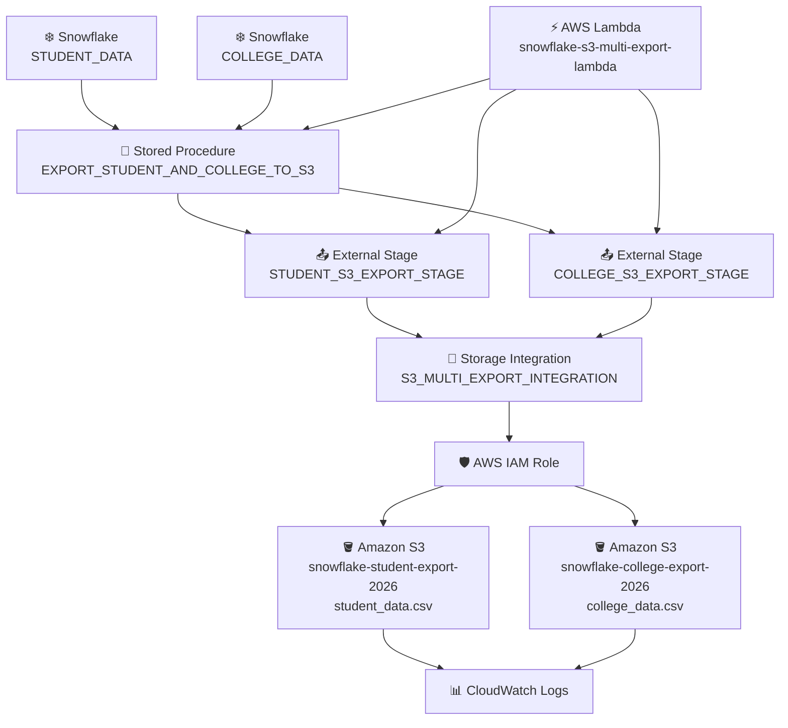

# 🚀 Snowflake → Amazon S3 Export Pipeline

## 📌 1. Pipeline Overview
**Pipeline:** ⚡ AWS Lambda → ❄️ Snowflake Stored Procedure → 📤 External Stage → 🔐 Storage Integration → 🪣 Amazon S3

**Purpose:**
To export data from multiple Snowflake tables into multiple Amazon S3 buckets as CSV files using AWS Lambda to trigger and verify the process.

---

## 🎯 2. Pipeline Goal
The goal is to achieve the following:

- ❄️ Keep source data in Snowflake.
- ⚡ Trigger the export through AWS Lambda.
- 🧩 Use one Snowflake Stored Procedure for the export logic of both tables.
- 🔐 Securely connect Snowflake to both S3 buckets using one Storage Integration and IAM.
- 🪣 Export each table into its own Amazon S3 bucket.
- 📄 Generate a CSV file in each S3 bucket.
- ✅ Verify the exported files.
- 📣 Return a clear **SUCCESS / FAILED** status.

---

## 🏗️ 3. Architecture Diagram



---

# 🔄 4. End-to-End Flow

### 📥 Step 1 — Source Data
The source data is stored in two Snowflake tables:

**`STUDENT_DATA`**

**`COLLEGE_DATA`**

These tables contain the student and college information that needs to be exported.

### ⚡ Step 2 — Lambda Trigger
The AWS Lambda function:

**`snowflake-s3-multi-export-lambda`**

starts the pipeline.

### 🔌 Step 3 — Connect to Snowflake
Lambda establishes a connection to the configured Snowflake database, schema, and warehouse.

### 📞 Step 4 — Call Stored Procedure
Lambda invokes:

**`EXPORT_STUDENT_AND_COLLEGE_TO_S3`**

The Lambda does not directly export the data.

### ❄️ Step 5 — Snowflake Starts Export
The Stored Procedure instructs Snowflake to export the data from `STUDENT_DATA` and `COLLEGE_DATA`.

### 📤 Step 6 — External Stage
Snowflake uses:

**`STUDENT_S3_EXPORT_STAGE`**

for the student bucket and:

**`COLLEGE_S3_EXPORT_STAGE`**

for the college bucket, as the destination references for Amazon S3.

### 🔐 Step 7 — Storage Integration
Both External Stages use the same:

**`S3_MULTI_EXPORT_INTEGRATION`**

to establish secure access between Snowflake and AWS.

### 🛡️ Step 8 — IAM Authentication
The Storage Integration uses the configured AWS IAM role to authorize Snowflake's access to both S3 locations.

### ☁️ Step 9 — Export to S3
Snowflake writes the exported data to:

```
s3://snowflake-student-export-2026/student-export/
```

and to:

```
s3://snowflake-college-export-2026/college-export/
```

### 📄 Step 10 — CSV File Creation
The pipeline generates:

```
student_data.csv
```

and:

```
college_data.csv
```

### ✅ Step 11 — File Verification
After the Stored Procedure finishes, Lambda checks both External Stages to verify that the exported files are available.

### 🔍 Step 12 — File Information
Lambda can retrieve information such as:

- 📄 File name
- 📏 File size
- 🔢 Number of files
- 🏷️ File metadata

### 🎉 Step 13 — Successful Execution
If both exports and verifications are successful, Lambda marks the pipeline as:

**SUCCESS**

### 🚨 Step 14 — Failure Handling
If any major step fails, Lambda captures the error and returns:

**FAILED**

### 📊 Step 15 — Logging
Lambda execution details and errors are available in **Amazon CloudWatch Logs**.

### 📁 Step 16 — Final Data Location
The final files are available at:

```
Amazon S3
├── snowflake-student-export-2026
│   └── student-export
│       └── student_data.csv
└── snowflake-college-export-2026
    └── college-export
        └── college_data.csv
```

---

# 🧩 5. Component Responsibilities

| 🧩 Component | 📋 Responsibility |
| ------------ | ----------------- |
| `STUDENT_DATA`, `COLLEGE_DATA` | Source data |
| AWS Lambda | Trigger and orchestration |
| Stored Procedure | Export logic for both tables |
| External Stage (2) | S3 destination reference, one per bucket |
| Storage Integration (1) | Snowflake → AWS connection for both buckets |
| IAM Role | Authorization |
| Amazon S3 (2) | Stores the CSV files |
| CloudWatch | Lambda monitoring and logs |

---

# 🧵 6. Complete Flow in One Line

```
STUDENT_DATA                    COLLEGE_DATA
     ↓                                ↓
     └──────────> AWS Lambda <────────┘
                      ↓
      Snowflake Stored Procedure
                      ↓
        External Stage (2)
                      ↓
     Storage Integration (1)
                      ↓
              AWS IAM Role
                      ↓
   Amazon S3 (student + college)
                      ↓
student_data.csv, college_data.csv
```

### 🔑 Key Point
**Lambda triggers the process, but Snowflake performs the actual data export to S3.**
