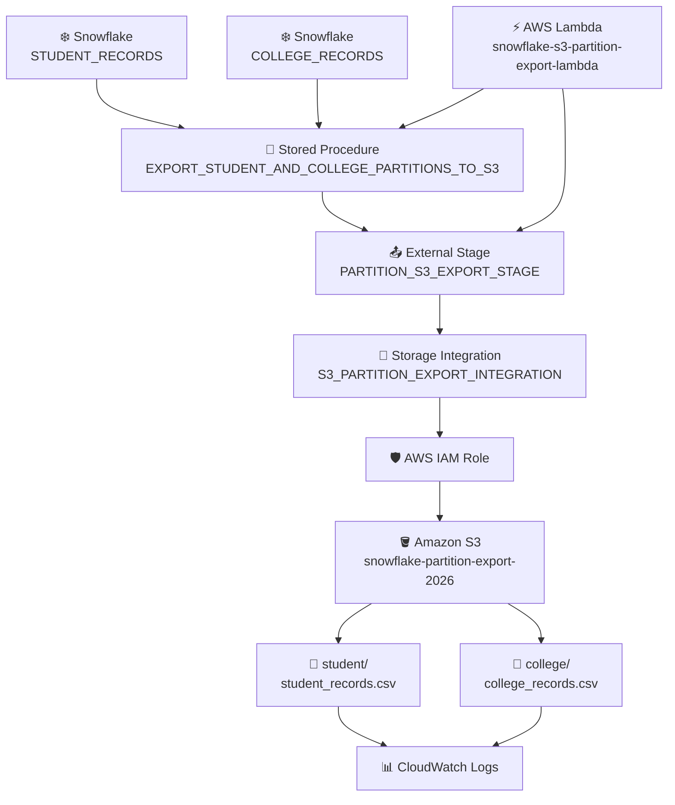

# 🚀 Snowflake → Amazon S3 Export Pipeline

## 📌 1. Pipeline Overview
**Pipeline:** ⚡ AWS Lambda → ❄️ Snowflake Stored Procedure → 📤 External Stage → 🔐 Storage Integration → 🪣 Amazon S3

**Purpose:**
To export data from multiple Snowflake tables into a single Amazon S3 bucket, each table into its own folder (partition), as CSV files using AWS Lambda to trigger and verify the process.

---

## 🎯 2. Pipeline Goal
The goal is to achieve the following:

- ❄️ Keep source data in Snowflake.
- ⚡ Trigger the export through AWS Lambda.
- 🧩 Use one Snowflake Stored Procedure for the export logic of both tables.
- 🔐 Securely connect Snowflake to the S3 bucket using one Storage Integration and IAM.
- 🪣 Export every table into one single Amazon S3 bucket.
- 📂 Keep each table inside its own folder (partition) in that bucket.
- 📄 Generate one CSV file per folder.
- ✅ Verify the exported files.
- 📣 Return a clear **SUCCESS / FAILED** status.

---

## 🏗️ 3. Architecture Diagram



---

# 🔄 4. End-to-End Flow

### 📥 Step 1 — Source Data
The source data is stored in two Snowflake tables:

**`STUDENT_RECORDS`**

**`COLLEGE_RECORDS`**

These tables contain the student and college information that needs to be exported.

### ⚡ Step 2 — Lambda Trigger
The AWS Lambda function:

**`snowflake-s3-partition-export-lambda`**

starts the pipeline.

### 🔌 Step 3 — Connect to Snowflake
Lambda establishes a connection to the configured Snowflake database, schema, and warehouse.

### 📞 Step 4 — Call Stored Procedure
Lambda invokes:

**`EXPORT_STUDENT_AND_COLLEGE_PARTITIONS_TO_S3`**

The Lambda does not directly export the data.

### ❄️ Step 5 — Snowflake Starts Export
The Stored Procedure instructs Snowflake to export the data from `STUDENT_RECORDS` and `COLLEGE_RECORDS`.

### 📤 Step 6 — External Stage
Snowflake uses the single stage:

**`PARTITION_S3_EXPORT_STAGE`**

which points at the root of the bucket, as the destination reference for Amazon S3.

### 🔐 Step 7 — Storage Integration
The External Stage uses:

**`S3_PARTITION_EXPORT_INTEGRATION`**

to establish secure access between Snowflake and AWS.

### 🛡️ Step 8 — IAM Authentication
The Storage Integration uses the configured AWS IAM role to authorize Snowflake's access to the S3 location.

### ☁️ Step 9 — Export to S3
Snowflake writes the exported data to the same bucket, each table into its own folder:

```
s3://snowflake-partition-export-2026/student/
```

and to:

```
s3://snowflake-partition-export-2026/college/
```

### 📄 Step 10 — CSV File Creation
The pipeline generates one CSV file per folder:

```
student_records.csv
```

inside the `student/` folder, and:

```
college_records.csv
```

inside the `college/` folder.

### ✅ Step 11 — File Verification
After the Stored Procedure finishes, Lambda checks both folders of the bucket to verify that the exported files are available.

### 🔍 Step 12 — File Information
Lambda can retrieve information such as:

- 📄 File name
- 📏 File size
- 🔢 Number of files
- 🏷️ File metadata

### 🎉 Step 13 — Successful Execution
If both exports and verifications are successful, Lambda marks the pipeline as:

**SUCCESS**

### 🚨 Step 14 — Failure Handling
If any major step fails, Lambda captures the error and returns:

**FAILED**

### 📊 Step 15 — Logging
Lambda execution details and errors are available in **Amazon CloudWatch Logs**.

### 📁 Step 16 — Final Data Location
The final files are available at:

```
Amazon S3
└── snowflake-partition-export-2026
    ├── student
    │   └── student_records.csv
    └── college
        └── college_records.csv
```

---

# 🧩 5. Component Responsibilities

| 🧩 Component | 📋 Responsibility |
| ------------ | ----------------- |
| `STUDENT_RECORDS`, `COLLEGE_RECORDS` | Source data |
| AWS Lambda | Trigger and orchestration |
| Stored Procedure | Export logic for both tables |
| External Stage (1) | S3 destination reference for the whole bucket |
| Storage Integration (1) | Snowflake → AWS connection for the bucket |
| IAM Role | Authorization |
| Amazon S3 bucket (1) | Stores the CSV files |
| Folders `student/`, `college/` | Partitions that keep each table separate |
| CloudWatch | Lambda monitoring and logs |

---

# 🧵 6. Complete Flow in One Line

```
STUDENT_RECORDS             COLLEGE_RECORDS
       ↓                            ↓
       └────────> AWS Lambda <───────┘
                     ↓
     Snowflake Stored Procedure
                     ↓
       External Stage (1)
                     ↓
    Storage Integration (1)
                     ↓
            AWS IAM Role
                     ↓
  Amazon S3 — snowflake-partition-export-2026
          ├── student/
          │     └── student_records.csv
          └── college/
                └── college_records.csv
```

### 🔑 Key Point
**Lambda triggers the process, but Snowflake performs the actual data export to S3.**
