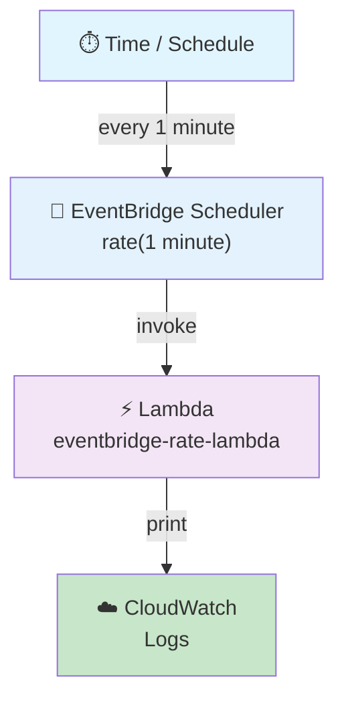
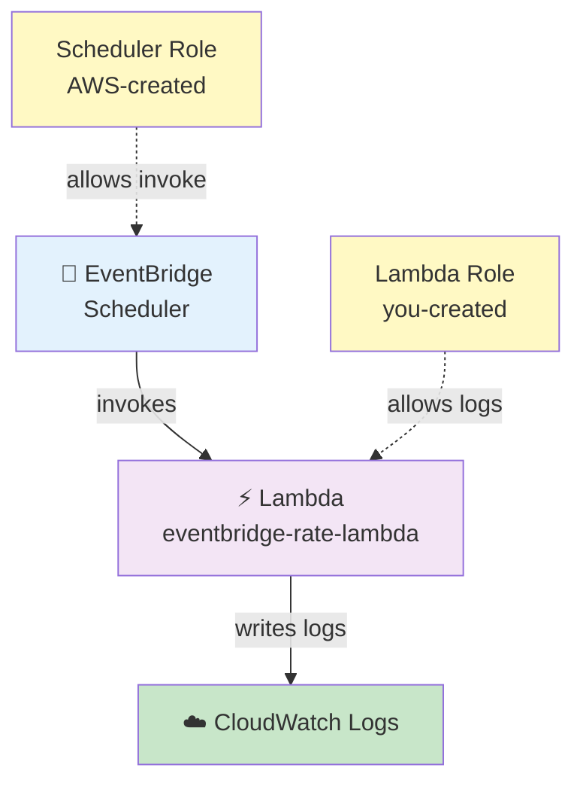

# Amazon EventBridge Scheduler → Lambda Pipeline

## Rate-Based Schedule — Lambda Runs Every 1 Minute

## 🎯 Goal

We want to make a simple serverless pipeline where **Amazon EventBridge Scheduler starts an AWS Lambda function every 1 minute**. Lambda prints a message, and we see the output in **CloudWatch Logs**.

AWS now suggests **EventBridge Scheduler** for scheduled work. `rate(1 minute)` is a recurring schedule.

### 🤔 Why This Pipeline? (Time is the Trigger)

In the last pipelines, **S3 was the source of the event**:

```text
File Upload
     ↓
S3
     ↓
S3 Event
     ↓
Lambda
```

Here, there is **no file upload** and no S3 event. Here, **time itself is the trigger**:

```text
Every 1 minute
      ↓
EventBridge Scheduler
      ↓
Lambda
      ↓
print()
      ↓
CloudWatch Logs
```

### What Problem Does This Pipeline Solve?

Think of a job that must run again and again, like:

- Check if a file has arrived
- Check an S3 folder for new files
- Run a small data check
- Check the status of another process
- Run a cleanup job
- Start a data job
- Do a health check
- Run some Python code again and again

We do not want a person to open Lambda and click **Test** every time:

```text
Human → Open Lambda → Click Test → Lambda runs   (repeat forever...)
```

That is not automation. **Lambda does not know to "run again after 1 minute"** — Lambda only runs when something starts it. So we need another service to tell Lambda *"run now"* on time. That service is **EventBridge Scheduler**.

## Architecture



---

## 🕐 What Is `rate(1 minute)`?

Our schedule text will be:

```text
rate(1 minute)
```

This means:

> **Run again and again, one time every minute.**

AWS rate text has this shape: `rate(value unit)`

```text
rate(1 minute)
rate(5 minutes)
rate(1 hour)
rate(1 day)
```

> ⚠️ For the value `1`, the unit is **one (singular)**: `rate(1 minute)` — **not** `rate(1 minutes)`.

---

## 📌 AWS Resources We Need

| Sr. No. | AWS Service | Resource |
| ------- | ----------- | -------- |
| 1 | IAM | Lambda execution role |
| 2 | AWS Lambda | `eventbridge-rate-lambda` |
| 3 | EventBridge Scheduler | `lambda-every-1-minute` |
| 4 | CloudWatch | Lambda log group |

> ℹ️ **We do not need an S3 bucket** in this pipeline.

---

## 🔐 Step 1: Create IAM Role for Lambda

Why we need this role:

> **So Lambda can write its logs to CloudWatch.**

### 1.1 Open IAM
1. Open **AWS Management Console**
2. Search for **IAM** → **IAM** → **Roles**
3. Click **Create role**

### 1.2 Select Trusted Entity
- Trusted entity type: **AWS service**
- Service: **Lambda**
- Click **Next**

### 1.3 Attach Policy

| Policy | What It Does |
|--------|--------|
| `AWSLambdaBasicExecutionRole` | Basic permission for Lambda to write logs to CloudWatch |

> For this practice pipeline, this is the **only** policy the Lambda function needs.

### 1.4 Name the Role
- Role name: `eventbridge-lambda-execution-role`
- Click **Create role**

✅ The Lambda role is ready.

---

## 🐍 Step 2: Create Lambda Function

1. Open **AWS Management Console**
2. Search for **Lambda** → **AWS Lambda** → **Functions**
3. Click **Create function**
4. Select: **Author from scratch**

### Lambda Settings

| Setting | Value |
|---------|-------|
| Function name | `eventbridge-rate-lambda` |
| Runtime | Python 3.x (select latest available) |
| Permissions | **Use an existing role** → `eventbridge-lambda-execution-role` |

**Role link:**
```text
Lambda (eventbridge-rate-lambda)
   ↓ uses
eventbridge-lambda-execution-role
   ↓ has
AWSLambdaBasicExecutionRole
```

Click **Create function**.

---

## 💻 Step 3: Write Lambda Code

Open the Lambda function → **Code** section, replace the existing code with:

```python
import json
from datetime import datetime, timezone


def lambda_handler(event, context):

    current_time = datetime.now(timezone.utc)

    print("===== EVENTBRIDGE SCHEDULE TRIGGERED =====")
    print(f"Lambda execution time : {current_time}")
    print("Message               : Lambda executed successfully")
    print("Trigger               : EventBridge Scheduler")
    print("Schedule              : rate(1 minute)")

    print("Event received from EventBridge:")
    print(json.dumps(event, indent=2))

    return {
        "statusCode": 200,
        "body": json.dumps("Lambda executed successfully")
    }
```

Click **Deploy**.

### 🔍 What This Lambda Code Does

This Lambda does not do any big work. Its only job is to **show that EventBridge → Lambda is working**.

Every time it runs, it prints:

```text
===== EVENTBRIDGE SCHEDULE TRIGGERED =====
Lambda execution time   (for example: 2026-09-06 13:15:00+00:00)
Trigger : EventBridge Scheduler
Schedule: rate(1 minute)
```

plus the full JSON **event** that EventBridge sent.

---

## 🧪 Step 4: Test Lambda by Hand First

Before we set up EventBridge, make sure the Lambda itself works:

1. Inside Lambda: click **Test** → **Create new event**
2. Event name: `manual-test`
3. Event JSON: `{}`
4. Click **Save** → **Test**

✅ A good run means the Lambda code is fine. Now we add the scheduler.

---

## ⏰ Step 5: Create EventBridge Scheduler

1. Open **AWS Management Console**
2. Search for **EventBridge** → **Amazon EventBridge**
3. Go to: **Scheduler** → **Schedules**
4. Click **Create schedule**

### Schedule Details

| Setting | Value |
|---------|-------|
| Schedule name | `lambda-every-1-minute` |
| Description (optional) | `Invoke Lambda every 1 minute for testing` |
| Schedule group | `default` |

### Select Schedule Type

| Setting | Select |
|---------|-----------|
| Schedule type | **Recurring schedule** (not one-time — we want it again and again) |
| Schedule | **Rate-based schedule** |

### Set the Rate

| Field | Value |
|-------|-------|
| Value | `1` |
| Unit | `minute` |

Final schedule text: **`rate(1 minute)`**

### Flexible Time Window
Set it to: **Off**

> Why? For a simple practice pipeline we want simple behavior: every 1 minute → start Lambda. If the window is On, Scheduler can start the Lambda anywhere *inside* that window, not exactly at the time.

### Timeframe
Keep it simple. A recurring schedule with no start date starts as soon as it is created and turned on.

---

## 🎯 Step 6: Choose the Target

Under **Target**:

| Setting | Value |
|---------|-------|
| Target type | **AWS Lambda** |
| Function | `eventbridge-rate-lambda` |

```text
EventBridge Scheduler (lambda-every-1-minute)
        ↓
sends to
        ↓
eventbridge-rate-lambda
```

---

## 🔐 Step 7: EventBridge Execution Role — ⚠️ Two Roles, Do Not Mix Them

The scheduler setup needs a different role than Lambda. There are **two separate jobs**:

### Role 1 — Lambda Execution Role (you make it yourself)

```text
eventbridge-lambda-execution-role
             ↓
AWSLambdaBasicExecutionRole
             ↓
CloudWatch Logs
```

Job: lets **Lambda** write its logs.

### Role 2 — EventBridge Scheduler Execution Role (AWS makes it for you)

```text
eventbridge-scheduler-lambda-role
             ↓
Permission to start Lambda
             ↓
eventbridge-rate-lambda
```

Job: lets **EventBridge Scheduler** start the Lambda.

### How to Set It Up

In the Scheduler execution role section, select:

```text
Create new role for this schedule
```

If the console asks for a role name, use for example `eventbridge-scheduler-lambda-role` — AWS adds the needed permissions for the target by itself.



**Do not mix these two roles** — one is for Lambda (you made it), the other is for Scheduler (AWS makes it).

---

## 📦 Optional: Input / Payload

The Scheduler may ask for an input. For this practice pipeline use:

```json
{
    "source": "eventbridge",
    "schedule": "rate(1 minute)"
}
```

Lambda gets this JSON as its `event` — so we can clearly see what EventBridge sent. (If we give no input, Scheduler starts Lambda with an empty event.)

---

## 👀 Step 8: Check Everything Before You Create

| Setting | Value |
|---------|-------|
| Schedule name | `lambda-every-1-minute` |
| Schedule type | Recurring |
| Schedule | Rate-based |
| Rate | 1 minute |
| Flexible time window | Off |
| Target | AWS Lambda |
| Lambda function | `eventbridge-rate-lambda` |
| Execution role | Create new role for this schedule |

Click **Create schedule**.

---

## 🚀 What Happens Now?

The scheduler is on, and it keeps running:

```text
EventBridge Scheduler ──1 minute──→ Lambda ──→ print() ──→ CloudWatch Logs
EventBridge Scheduler ──1 minute──→ Lambda ──→ print() ──→ CloudWatch Logs
EventBridge Scheduler ──1 minute──→ Lambda ──→ print() ──→ CloudWatch Logs
                    ... keeps going while the schedule is on
```

---

## ☁️ Step 9: See the Output in CloudWatch Logs

1. Open **CloudWatch** → **Logs** → **Log groups**
2. Open: `/aws/lambda/eventbridge-rate-lambda`
3. Open the latest **Log stream**

Expected output:

```text
===== EVENTBRIDGE SCHEDULE TRIGGERED =====

Lambda execution time : 2026-09-06 13:15:00+00:00
Message               : Lambda executed successfully
Trigger               : EventBridge Scheduler
Schedule              : rate(1 minute)

Event received from EventBridge:
{
    "source": "eventbridge",
    "schedule": "rate(1 minute)"
}
```

✅ After one more minute you should see a new Lambda run — this proves the schedule repeats.

---

## 🧩 Full Step List (Quick Reference)

| Step | What to Do |
|------|--------|
| 1 | Open **IAM** → **Roles** → **Create role** |
| 2 | Trusted entity: **AWS service** → **Lambda** |
| 3 | Attach: **AWSLambdaBasicExecutionRole** |
| 4 | Role name: `eventbridge-lambda-execution-role` |
| 5 | Open **Lambda** → **Functions** → **Create function** → **Author from scratch** |
| 6 | Name: `eventbridge-rate-lambda` → Runtime: Python 3.x |
| 7 | Execution role: **Use an existing role** → `eventbridge-lambda-execution-role` |
| 8 | Create the Lambda → paste the Python code → **Deploy** |
| 9 | **Test by hand first** (event `{}`) ✅ |
| 10 | Open **EventBridge** → **Scheduler** → **Schedules** → **Create schedule** |
| 11 | Name: `lambda-every-1-minute` |
| 12 | Schedule type: **Recurring** → **Rate-based** |
| 13 | Rate: Value `1`, Unit `minute` → `rate(1 minute)` |
| 14 | Flexible time window: **Off** |
| 15 | Target: **AWS Lambda** → `eventbridge-rate-lambda` |
| 16 | Scheduler execution role: **Create new role for this schedule** |
| 17 | Optional input: `{"source": "eventbridge", "schedule": "rate(1 minute)"}` |
| 18 | Check everything → **Create schedule** |
| 19 | Open **CloudWatch** → `/aws/lambda/eventbridge-rate-lambda` → see the runs again and again |

---

## 🎤 Interview Explanation

**Q: "Explain the EventBridge → Lambda pipeline you made."**

> **"I made a serverless scheduled pipeline using Amazon EventBridge Scheduler and AWS Lambda. I made a Lambda execution role with the AWSLambdaBasicExecutionRole managed policy so that Lambda could write its logs to CloudWatch. Then I made a Python Lambda function. In EventBridge Scheduler, I made a recurring rate-based schedule with `rate(1 minute)` and set Lambda as the target. For the EventBridge Scheduler execution role, I let AWS create the role by itself. When the schedule is on, EventBridge starts the Lambda every minute. Lambda prints the run time and the event it got, and I check the repeated runs in CloudWatch Logs."**
