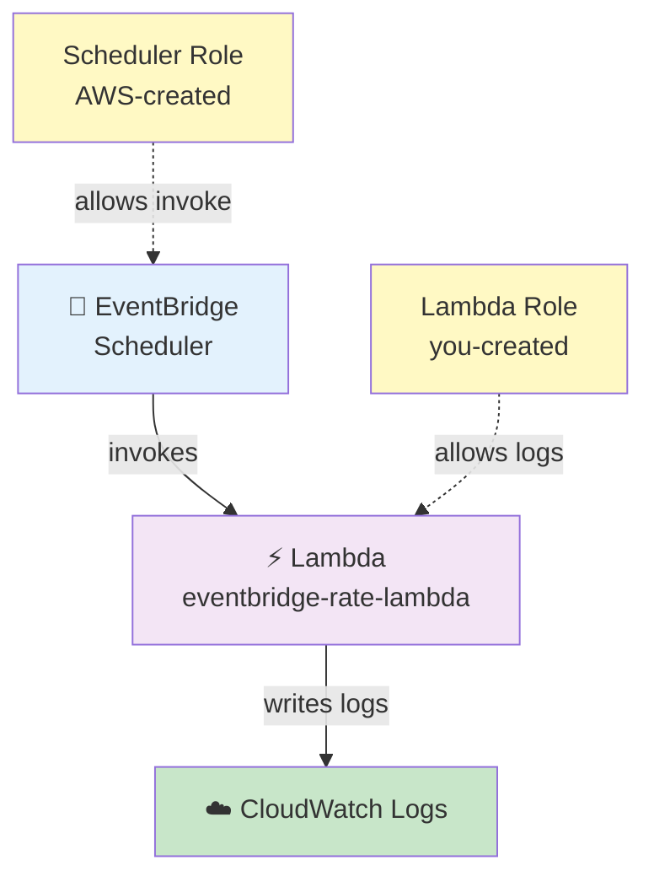

# Amazon EventBridge Scheduler → Lambda Pipeline

## Rate-Based Schedule — Lambda Triggered Every 1 Minute

## 🎯 Goal

Create a simple serverless scheduling pipeline where **Amazon EventBridge Scheduler invokes an AWS Lambda function every 1 minute**. Lambda will print a message, and the execution output will be visible in **CloudWatch Logs**.

AWS currently recommends **EventBridge Scheduler** for scheduled invocations. A rate expression such as `rate(1 minute)` is a recurring schedule.

### 🤔 Why This Pipeline? (Time as the Trigger)

In the previous pipelines, **S3 was the event source**:

```text
File Upload
     ↓
S3
     ↓
S3 Event
     ↓
Lambda
```

Here, there is **no file upload** and no S3 event. Instead, **time itself is the trigger**:

```text
Every 1 minute
      ↓
EventBridge Scheduler
      ↓
Lambda
      ↓
print()
      ↓
CloudWatch Logs
```

### What Problem Does This Pipeline Solve?

Imagine a task that must happen repeatedly:

- Check whether a file has arrived
- Check an S3 location for new files
- Run a small data-validation task
- Check the status of another process
- Run a cleanup operation
- Start a data-processing job
- Perform a health check
- Execute some Python code periodically

You don't want a person to manually open Lambda and click **Test** every time:

```text
Human → Open Lambda → Click Test → Lambda runs   (repeat forever...)
```

That is not an automated system. **Lambda does not know to "run again after one minute"** — it only executes when something invokes it. You need another service to tell Lambda *"run now"* on a schedule — that service is **EventBridge Scheduler**.

## Architecture

```mermaid
graph TD
    A["⏱️ Time / Schedule<br/>Every 1 minute"] -->|rate(1 minute)| B["📅 EventBridge<br/>Scheduler"]
    B -->|Invoke| C["⚡ Lambda<br/>eventbridge-rate-lambda"]
    C -->|print()| D["☁️ CloudWatch<br/>Logs"]

    style A fill:#e1f5ff
    style B fill:#e3f2fd
    style C fill:#f3e5f5
    style D fill:#c8e6c9
```

---

## 🕐 Understanding `rate(1 minute)`

Our schedule expression will be:

```text
rate(1 minute)
```

This means:

> **Run the target repeatedly at a one-minute rate.**

AWS rate expressions use the format `rate(value unit)`:

```text
rate(1 minute)
rate(5 minutes)
rate(1 hour)
rate(1 day)
```

> ⚠️ For the value `1`, the unit is **singular**: `rate(1 minute)` — **not** `rate(1 minutes)`.

---

## 📌 Required AWS Resources

| Sr. No. | AWS Service | Resource |
| ------- | ----------- | -------- |
| 1 | IAM | Lambda execution role |
| 2 | AWS Lambda | `eventbridge-rate-lambda` |
| 3 | EventBridge Scheduler | `lambda-every-1-minute` |
| 4 | CloudWatch | Lambda log group |

> ℹ️ **No S3 bucket is required** for this pipeline.

---

## 🔐 Step 1: Create IAM Role for Lambda

The purpose of this role:

> **Allow the Lambda function to write its execution logs to CloudWatch.**

### 1.1 Open IAM
1. Open **AWS Management Console**
2. Search for **IAM** → **IAM** → **Roles**
3. Click **Create role**

### 1.2 Select Trusted Entity
- Trusted entity type: **AWS service**
- Service: **Lambda**
- Click **Next**

### 1.3 Attach Policy

| Policy | Purpose |
|--------|---------|
| `AWSLambdaBasicExecutionRole` | Basic permissions for Lambda to write execution logs to CloudWatch |

> For this practice pipeline, this is the **only** managed policy the Lambda function needs.

### 1.4 Name the Role
- Role name: `eventbridge-lambda-execution-role`
- Click **Create role**

✅ The Lambda role is now ready.

---

## 🐍 Step 2: Create Lambda Function

1. Open **AWS Management Console**
2. Search for **Lambda** → **AWS Lambda** → **Functions**
3. Click **Create function**
4. Select: **Author from scratch**

### Configure Lambda

| Setting | Value |
|---------|-------|
| Function name | `eventbridge-rate-lambda` |
| Runtime | Python 3.x (select latest available) |
| Permissions | **Use an existing role** → `eventbridge-lambda-execution-role` |

**Role relationship:**
```text
Lambda (eventbridge-rate-lambda)
   ↓ uses
eventbridge-lambda-execution-role
   ↓ contains
AWSLambdaBasicExecutionRole
```

Click **Create function**.

---

## 💻 Step 3: Write Lambda Code

Open the Lambda function → **Code** section, replace the existing code with:

```python
import json
from datetime import datetime, timezone


def lambda_handler(event, context):

    current_time = datetime.now(timezone.utc)

    print("===== EVENTBRIDGE SCHEDULE TRIGGERED =====")
    print(f"Lambda execution time : {current_time}")
    print("Message               : Lambda executed successfully")
    print("Trigger               : EventBridge Scheduler")
    print("Schedule              : rate(1 minute)")

    print("Event received from EventBridge:")
    print(json.dumps(event, indent=2))

    return {
        "statusCode": 200,
        "body": json.dumps("Lambda executed successfully")
    }
```

Click **Deploy**.

### 🔍 What This Lambda Code Does

The Lambda doesn't perform complex processing — its purpose is simply to **prove the EventBridge → Lambda trigger works**. Every run prints:

```text
===== EVENTBRIDGE SCHEDULE TRIGGERED =====
Lambda execution time   (e.g. 2026-09-06 13:15:00+00:00)
Trigger : EventBridge Scheduler
Schedule: rate(1 minute)
```

plus the full JSON **event payload** EventBridge sent.

---

## 🧪 Step 4: Test Lambda Manually First

Before configuring EventBridge, verify the Lambda itself works:

1. Inside Lambda: click **Test** → **Create new event**
2. Event name: `manual-test`
3. Event JSON: `{}`
4. Click **Save** → **Test**

✅ A successful execution proves the Lambda code works. Next, wire up the scheduler.

---

## ⏰ Step 5: Create EventBridge Scheduler

1. Open **AWS Management Console**
2. Search for **EventBridge** → **Amazon EventBridge**
3. Go to: **Scheduler** → **Schedules**
4. Click **Create schedule**

### Configure Schedule Details

| Setting | Value |
|---------|-------|
| Schedule name | `lambda-every-1-minute` |
| Description (optional) | `Invoke Lambda every 1 minute for testing` |
| Schedule group | `default` |

### Select Schedule Type

| Setting | Selection |
|---------|-----------|
| Schedule type / occurrence | **Recurring schedule** (not one-time — we want repeated runs) |
| Schedule | **Rate-based schedule** |

### Configure the Rate

| Field | Value |
|-------|-------|
| Value | `1` |
| Unit | `minute` |

Resulting schedule expression: **`rate(1 minute)`**

### Flexible Time Window
Set: **Off**

> Why? For a simple learning pipeline we want predictable behavior: every 1 minute → invoke Lambda. A flexible time window would let Scheduler invoke the target anywhere *within* a window instead of at the scheduled point.

### Timeframe
Keep it simple — a recurring schedule with no start date begins once created and enabled.

---

## 🎯 Step 6: Select the Target

Under **Target**:

| Setting | Value |
|---------|-------|
| Target type | **AWS Lambda** |
| Function | `eventbridge-rate-lambda` |

```text
EventBridge Scheduler (lambda-every-1-minute)
        ↓
targets
        ↓
eventbridge-rate-lambda
```

---

## 🔐 Step 7: EventBridge Scheduler Execution Role — ⚠️ Two Roles, Don't Confuse Them

The scheduler setup is different from Lambda's role. There are **two separate responsibilities**:

### Role 1 — Lambda Execution Role (you create manually)

```text
eventbridge-lambda-execution-role
             ↓
AWSLambdaBasicExecutionRole
             ↓
CloudWatch Logs
```

Purpose: lets **Lambda** write its logs.

### Role 2 — EventBridge Scheduler Execution Role (AWS creates it for you)

```text
eventbridge-scheduler-lambda-role
             ↓
Permission to invoke Lambda
             ↓
eventbridge-rate-lambda
```

Purpose: lets **EventBridge Scheduler** invoke the Lambda.

### Configuration

In the Scheduler execution role section, select:

```text
Create new role for this schedule
```

Provide a role name if the console asks, e.g. `eventbridge-scheduler-lambda-role` — AWS automatically attaches the invoke permissions needed for the selected target.



**Do not confuse these two roles** — one is for Lambda (you made it), the other is for the Scheduler (AWS makes it).

---

## 📦 Optional: Input / Payload

The Scheduler may offer an input payload option. For this learning pipeline use:

```json
{
    "source": "eventbridge",
    "schedule": "rate(1 minute)"
}
```

Lambda receives this JSON as its `event` — so you can clearly see what EventBridge sent. (Without a payload, Scheduler invokes Lambda with an empty event.)

---

## 👀 Step 8: Review the Schedule

Final verification checklist:

| Setting | Value |
|---------|-------|
| Schedule name | `lambda-every-1-minute` |
| Schedule type | Recurring |
| Schedule | Rate-based |
| Rate | 1 minute |
| Flexible time window | Off |
| Target | AWS Lambda |
| Lambda function | `eventbridge-rate-lambda` |
| Execution role | Create new role for this schedule |

Click **Create schedule**.

---

## 🚀 What Happens Now?

The enabled scheduler runs indefinitely:

```text
EventBridge Scheduler ──1 minute──→ Lambda ──→ print() ──→ CloudWatch Logs
EventBridge Scheduler ──1 minute──→ Lambda ──→ print() ──→ CloudWatch Logs
EventBridge Scheduler ──1 minute──→ Lambda ──→ print() ──→ CloudWatch Logs
                    ... continues while the schedule is enabled
```

---

## ☁️ Step 9: Check CloudWatch Logs

1. Open **CloudWatch** → **Logs** → **Log groups**
2. Open: `/aws/lambda/eventbridge-rate-lambda`
3. Open the latest **Log stream**

Expected output:

```text
===== EVENTBRIDGE SCHEDULE TRIGGERED =====

Lambda execution time : 2026-09-06 13:15:00+00:00
Message               : Lambda executed successfully
Trigger               : EventBridge Scheduler
Schedule              : rate(1 minute)

Event received from EventBridge:
{
    "source": "eventbridge",
    "schedule": "rate(1 minute)"
}
```

✅ After another minute you should see another Lambda execution — proof the schedule is recurring.

---

## 🧩 Complete Sequential Procedure (Quick Reference)

| Step | Action |
|------|--------|
| 1 | Open **IAM** → **Roles** → **Create role** |
| 2 | Trusted entity: **AWS service** → **Lambda** |
| 3 | Attach: **AWSLambdaBasicExecutionRole** |
| 4 | Role name: `eventbridge-lambda-execution-role` |
| 5 | Open **Lambda** → **Functions** → **Create function** → **Author from scratch** |
| 6 | Name: `eventbridge-rate-lambda` → Runtime: Python 3.x |
| 7 | Execution role: **Use an existing role** → `eventbridge-lambda-execution-role` |
| 8 | Create the Lambda → paste the Python code → **Deploy** |
| 9 | **Test manually first** (event `{}`) ✅ |
| 10 | Open **EventBridge** → **Scheduler** → **Schedules** → **Create schedule** |
| 11 | Name: `lambda-every-1-minute` |
| 12 | Schedule type: **Recurring** → **Rate-based** |
| 13 | Rate: Value `1`, Unit `minute` → `rate(1 minute)` |
| 14 | Flexible time window: **Off** |
| 15 | Target: **AWS Lambda** → `eventbridge-rate-lambda` |
| 16 | Scheduler execution role: **Create new role for this schedule** |
| 17 | Optional input: `{"source": "eventbridge", "schedule": "rate(1 minute)"}` |
| 18 | Review → **Create schedule** |
| 19 | Open **CloudWatch** → `/aws/lambda/eventbridge-rate-lambda` → verify repeated executions |

---

## 🎤 Interview Explanation

**Q: "Explain the EventBridge → Lambda pipeline you implemented."**

> **"I implemented a serverless scheduled pipeline using Amazon EventBridge Scheduler and AWS Lambda. I created a Lambda execution role with the AWSLambdaBasicExecutionRole managed policy so that Lambda could write its execution logs to CloudWatch. I then created a Python Lambda function. Using EventBridge Scheduler, I created a recurring rate-based schedule with `rate(1 minute)` and configured Lambda as the target. For the EventBridge Scheduler execution role, I allowed AWS to create the required role automatically. Once the schedule is enabled, EventBridge invokes the Lambda every minute. Lambda prints the execution time and received event, and I verify the repeated executions through CloudWatch Logs."**

---

## ⭐ Main Concept to Remember

| S3 → Lambda | EventBridge → Lambda |
| ----------- | -------------------- |
| S3 is the event source | EventBridge Scheduler is the event source |
| Triggered by file/object activity | Triggered by **time** |
| S3 Event Notification | Rate-based schedule |
| Example: file uploaded | Example: every 1 minute |
| Lambda receives S3 event | Lambda receives Scheduler input/event |
| Good for event-driven processing | Good for scheduled/periodic processing |

> ⚠️ **Accuracy point:** `rate(1 minute)` means a recurring one-minute rate; it is **not** a guarantee that Lambda starts at the exact same second every minute. Scheduled invocations can have some delay because the service is distributed.

---

## Summary

| Component | Purpose |
|-----------|---------|
| **IAM Role** (`eventbridge-lambda-execution-role`) | Lets Lambda write logs to CloudWatch |
| **Lambda** (`eventbridge-rate-lambda`) | Prints execution time + received event |
| **EventBridge Scheduler** (`lambda-every-1-minute`) | Time source — invokes Lambda every minute via `rate(1 minute)` |
| **Scheduler Role** (AWS-created) | Lets Scheduler invoke the Lambda |
| **CloudWatch Logs** | Shows repeated Lambda executions for verification |

This pipeline demonstrates how **time itself can be the trigger** in a serverless event-driven AWS architecture.

---

## References

- [Using Amazon EventBridge Scheduler](https://docs.aws.amazon.com/eventbridge/latest/userguide/using-eventbridge-scheduler.html)
- [Invoke a Lambda function on a schedule](https://docs.aws.amazon.com/lambda/latest/dg/with-eventbridge-scheduler.html)
- [CreateSchedule — EventBridge Scheduler API](https://docs.aws.amazon.com/scheduler/latest/APIReference/API_CreateSchedule.html)
- [Getting started with EventBridge Scheduler](https://docs.aws.amazon.com/scheduler/latest/UserGuide/getting-started.html)
