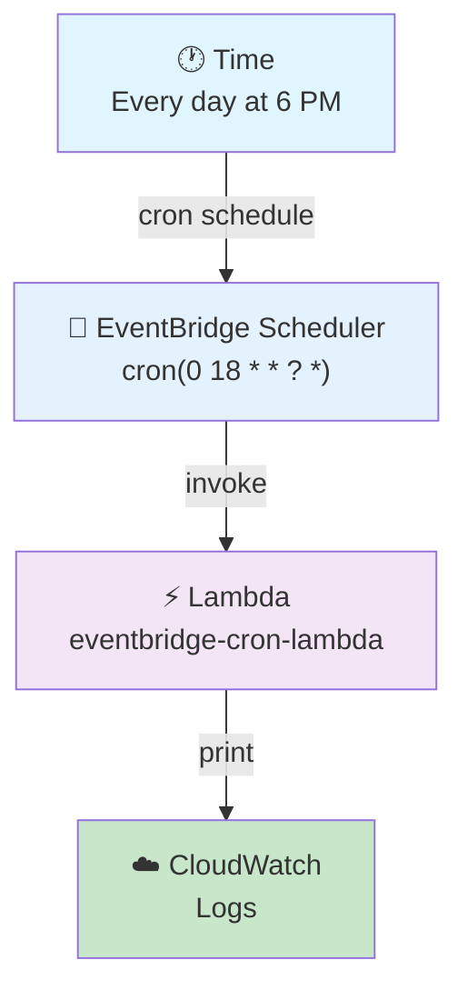
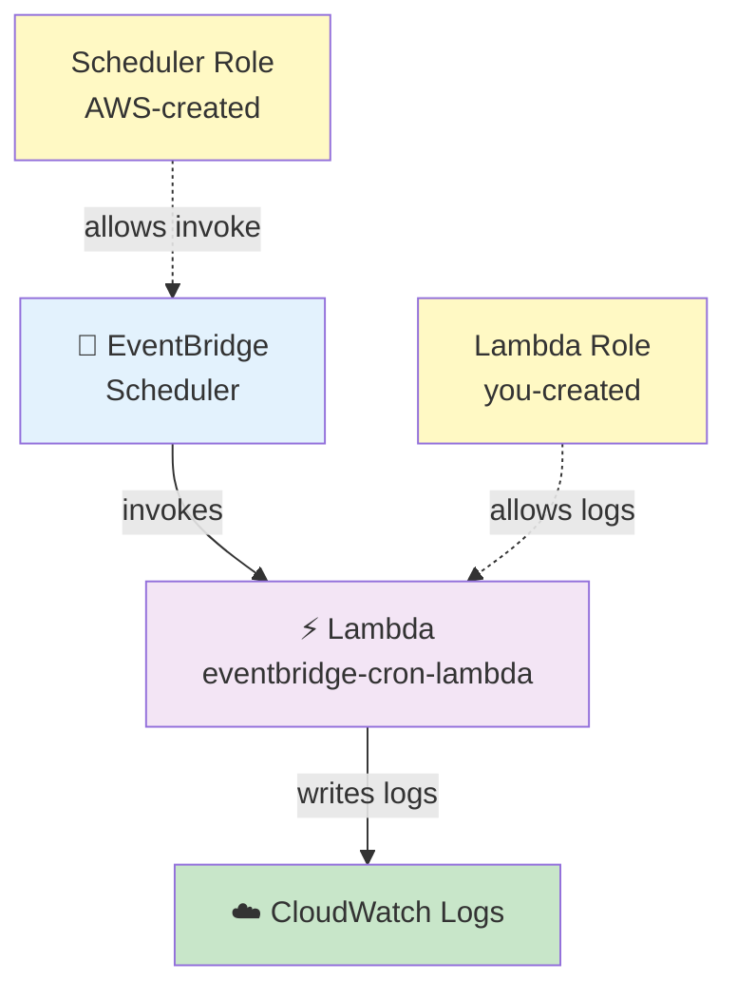
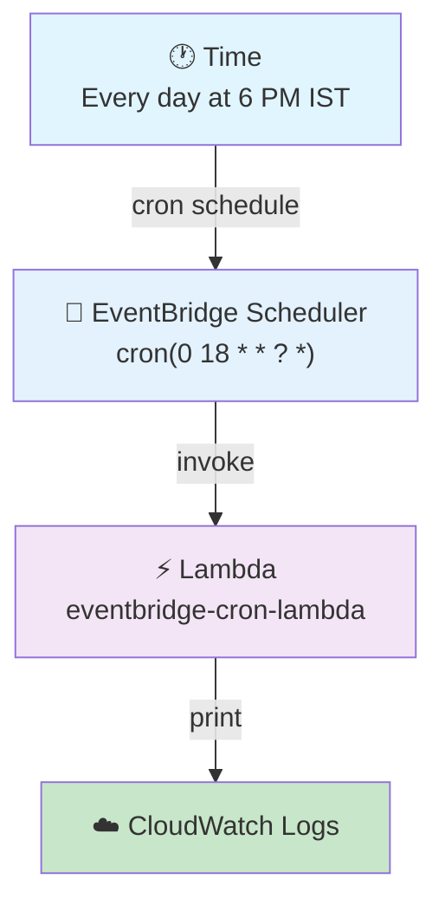

# EventBridge Scheduler → Lambda Pipeline — Cron

## Daily Schedule — Lambda Runs Every Day at 6:00 PM

## 🎯 Goal

We want to make an AWS pipeline where **EventBridge Scheduler starts a Lambda function every day at 6:00 PM**. Lambda prints a message, and we see the output in **CloudWatch Logs**.

Flow:

```text
Time
 ↓
Every Day
 ↓
6:00 PM
 ↓
EventBridge Scheduler
 ↓
Lambda
 ↓
print()
 ↓
CloudWatch Logs
```

## 🤔 Why This Pipeline?

Sometimes we need to run a job at a **fixed time**. Examples:

```text
Every day at 6 PM
Every day at 12 AM
Every Monday at 9 AM
Every Sunday at 10 PM
First day of every month
```

For these jobs we can use a **cron schedule**.

Without EventBridge, a person has to do this manually:

```text
Person → Open Lambda → Click Test → Lambda runs
```

Not practical if the job must run every day at 6 PM. With EventBridge:

```text
EventBridge → 6 PM → Lambda runs by itself
```

> **Main point: automate jobs that must run at a fixed time.**

## 🕐 Rate vs Cron

You already did the **rate-based** pipeline (folder 03). Let's compare:

### Rate-based

```text
rate(1 minute)
```

Meaning: run again and again after a fixed gap.

```text
10:01 → 10:02 → 10:03 → 10:04 → ...
```

### Cron-based

Cron is for a **fixed time or date pattern**. Example: every day at 6 PM.

```text
cron(0 18 * * ? *)
```

So:

| Rate | Cron |
|------|------|
| Fixed interval | Fixed time / date pattern |

## Architecture



---

## 📌 AWS Resources We Need

| Sr. No. | Service | Resource |
| ------- | ------- | -------- |
| 1 | IAM | Lambda execution role |
| 2 | Lambda | `eventbridge-cron-lambda` |
| 3 | EventBridge Scheduler | `lambda-daily-6pm` |
| 4 | CloudWatch | Lambda logs |

---

## 🔐 Step 1: Create IAM Role for Lambda

Same as the last pipeline. We make the role ourselves. Lambda will use it.

### 1.1 Open IAM
1. Open **AWS Management Console**
2. Search for **IAM** → **IAM** → **Roles**
3. Click **Create role**

### 1.2 Select Trusted Entity
- Select: **AWS service**
- Service: **Lambda**
- Click **Next**

### 1.3 Attach Policy
- Search: `AWSLambdaBasicExecutionRole`
- Select it

Purpose:

```text
Lambda
   ↓
CloudWatch Logs
```

This lets Lambda write its logs. Click **Next**.

### 1.4 Name the Role
- Role name: `eventbridge-cron-lambda-role`
- Click **Create role**

✅ Role is ready.

---

## 🐍 Step 2: Create Lambda Function

1. Open **AWS Management Console**
2. Search for **Lambda** → **AWS Lambda** → **Functions**
3. Click **Create function**
4. Select: **Author from scratch**

### Lambda Settings

| Setting | Value |
|---------|-------|
| Function name | `eventbridge-cron-lambda` |
| Runtime | Python 3.x (select latest available) |
| Permissions | **Use an existing role** → `eventbridge-cron-lambda-role` |

Click **Create function**.

---

## 💻 Step 3: Add Lambda Code

Open: **Lambda** → `eventbridge-cron-lambda` → **Code**

Replace the existing code with:

```python
import json
from datetime import datetime, timezone


def lambda_handler(event, context):

    current_time = datetime.now(timezone.utc)

    print("===== EVENTBRIDGE CRON TRIGGERED =====")

    print(f"Lambda execution time : {current_time}")

    print("Trigger  : EventBridge Scheduler")

    print("Schedule : Every day at 6 PM")

    print("Message  : Lambda executed successfully")

    print("Event received:")
    print(json.dumps(event, indent=2))

    return {
        "statusCode": 200,
        "body": json.dumps("Lambda executed successfully")
    }
```

Click **Deploy**.

### 🔍 What This Lambda Code Does

Every time it runs, it prints:
- The run time
- That the trigger came from **EventBridge Scheduler**
- That the schedule is **Every day at 6 PM**
- The full JSON **event** it got

---

## 🧪 Step 4: Test Lambda First

Test the Lambda once before we add the schedule:

1. Click **Test** → **Create new event**
2. Event name: `manual-test`
3. Event JSON: `{}`
4. Click **Save** → **Test**

✅ If it runs fine, the Lambda is good. The real trigger will come from EventBridge.

---

## ⏰ Step 5: Create EventBridge Schedule

1. Open **AWS Management Console**
2. Search for **EventBridge** → **Amazon EventBridge**
3. Go to: **Scheduler** → **Schedules**
4. Click **Create schedule**

### Schedule Details

| Setting | Value |
|---------|-------|
| Schedule name | `lambda-daily-6pm` |
| Description | `Trigger Lambda every day at 6 PM` |

### Select Schedule Type

| Setting | Select |
|---------|--------|
| Schedule type | **Recurring schedule** (not one-time — Lambda runs every day) |
| Schedule | **Cron-based schedule** |

Now we give the cron text. For **every day at 6:00 PM** use:

```text
cron(0 18 * * ? *)
```

---

## 📖 Understand Cron (6 Parts)

AWS cron has **6 fields**:

```text
cron(Minutes  Hours  Day-of-month  Month  Day-of-week  Year)
```

Our text:

```text
cron(0 18 * * ? *)
```

part by part:

```text
0      ← Minutes
18     ← Hours
*      ← Day-of-month
*      ← Month
?      ← Day-of-week
*      ← Year
```

### Part 1 — Minutes = `0`

Means minute 0. So time is `18:00`, not `18:30`.

(`cron(30 18 * * ? *)` would mean **6:30 PM**.)

### Part 2 — Hours = `18`

AWS cron uses **24-hour time**. So `18` = **6 PM**.

| Time | Cron Hour |
| ----- | --------: |
| 12 AM |         0 |
| 1 AM  |         1 |
| 10 AM |        10 |
| 12 PM |        12 |
| 1 PM  |        13 |
| 5 PM  |        17 |
| 6 PM  |        18 |
| 10 PM |        22 |
| 11 PM |        23 |

So `0 18` = **6:00 PM**.

### Part 3 — Day-of-month = `*`

`*` means **any value**. So every day of the month.

### Part 4 — Month = `*`

`*` = any value. So every month.

### Part 5 — Day-of-week = `?`

`?` means **no special value** (we already picked every day of the month, so we do not pick any one weekday).

### Part 6 — Year = `*`

`*` = every year.

### ✅ Full Breakdown

```text
cron(0 18 * * ? *)
```

| Field | Value | Meaning |
| ----- | ----- | ------- |
| Minutes | `0` | At minute 0 |
| Hours | `18` | At 6 PM |
| Day-of-month | `*` | Every day |
| Month | `*` | Every month |
| Day-of-week | `?` | No specific day |
| Year | `*` | Every year |

So `cron(0 18 * * ? *)` = **every day at 6:00 PM**.

### 🧠 Easy Way to Remember

```text
6 PM          → hour = 18
exact minute  → minute = 0
every day     → *
every month   → *
no weekday    → ?
every year    → *
```

Final: `cron(0 18 * * ? *)`

### ⭐ More Cron Examples

| Schedule | Cron |
|----------|------|
| Every day at 6 PM | `cron(0 18 * * ? *)` |
| Every day at 6:30 PM | `cron(30 18 * * ? *)` |
| Every day at 8 AM | `cron(0 8 * * ? *)` |
| Every day at 11 PM | `cron(0 23 * * ? *)` |
| Every Monday at 9 AM | `cron(0 9 ? * MON *)` |
| First day of every month at 6 AM | `cron(0 6 1 * ? *)` |

**Monday example**, part by part:

```text
Minute = 0
Hour = 9
Day-of-month = ?
Month = *
Day-of-week = MON
Year = *
```

---

## ⚠️ Very Important — Time Zone

When we say **6 PM**, we must say **which time zone**.

You want:

```text
6:00 PM India Standard Time (IST)
```

In the EventBridge Scheduler console, find the **Time zone** setting and choose:

```text
Asia/Kolkata
```

Then:

```text
cron(0 18 * * ? *)
```

means **every day at 6:00 PM India time**. This is easier than converting 6 PM India time into UTC by hand.

---

## 🎯 Step 6: Select Lambda Target

Under **Target**:

| Setting | Value |
|---------|-------|
| Target type | **AWS Lambda** |
| Function | `eventbridge-cron-lambda` |

```text
EventBridge Scheduler
        ↓
eventbridge-cron-lambda
```

---

## 🔐 Step 7: EventBridge Role — Two Roles, Do Not Mix Them

Let AWS create the Scheduler role. Select:

```text
Create new role for this schedule
```

Remember, there are **two separate roles**:

### Role 1 — Lambda role (you made it)

```text
eventbridge-cron-lambda-role
        ↓
AWSLambdaBasicExecutionRole
        ↓
CloudWatch Logs
```

Purpose: **Lambda → CloudWatch**

### Role 2 — EventBridge role (AWS makes it)

Purpose: **EventBridge Scheduler → Lambda**



**Do not mix these two roles.**

---

## 📦 Optional: Input / Payload

You can give an input. For example:

```json
{
    "source": "eventbridge",
    "schedule_type": "cron",
    "schedule": "daily-6-pm"
}
```

Lambda gets this JSON in its `event`. Good for testing and for seeing what the scheduler sends.

---

## ⚙️ Flexible Time Window

If you see **Flexible time window**, set it to:

```text
Off
```

We want simple behavior:

```text
Every day → 6 PM → Lambda
```

---

## 👀 Step 8: Review Before Creating

| Setting | Value |
|---------|-------|
| Schedule name | `lambda-daily-6pm` |
| Schedule | Recurring |
| Schedule type | Cron-based |
| Cron | `cron(0 18 * * ? *)` |
| Time zone | `Asia/Kolkata` |
| Target | AWS Lambda |
| Lambda | `eventbridge-cron-lambda` |
| Flexible time window | Off |
| Execution role | Create new role |

Click **Create schedule**.

---

## 🔄 Complete Pipeline Flow

Once the schedule is on:



EventBridge waits for **every day → 6 PM IST**. At 6 PM it starts Lambda, Lambda runs the Python code and prints the message, and CloudWatch saves the logs.

---

## ☁️ Step 9: See the Output in CloudWatch Logs

1. Open **CloudWatch** → **Logs** → **Log groups**
2. Open: `/aws/lambda/eventbridge-cron-lambda`
3. Open the latest **Log stream**

Expected output:

```text
===== EVENTBRIDGE CRON TRIGGERED =====

Lambda execution time : 2026-09-06 12:30:00+00:00

Trigger  : EventBridge Scheduler

Schedule : Every day at 6 PM

Message  : Lambda executed successfully

Event received:
{
    "source": "eventbridge",
    "schedule_type": "cron",
    "schedule": "daily-6-pm"
}
```

(The time you see is in UTC. Since the schedule is set to **Asia/Kolkata**, it runs at the real 6 PM India time.)

---

## 🧪 How to Test Without Waiting Until 6 PM

If you create the schedule at 3 PM, you don't need to wait until tomorrow 6 PM to test it.

**Trick:** change the cron to a few minutes in the future.

Example: if India time is now about 6:41 PM, make a test schedule for 6:45 PM:

```text
cron(45 18 * * ? *)
```

with time zone:

```text
Asia/Kolkata
```

Wait for it to run. After the test, change it back to:

```text
cron(0 18 * * ? *)
```

Good while practicing.

---

## 🆚 Rate-Based vs Cron-Based (Interview Favourite)

| Rate Based | Cron Based |
| ---------- | ---------- |
| Fixed interval | Fixed time / date |
| `rate(1 minute)` | `cron(0 18 * * ? *)` |
| Every 1 minute | Every day at 6 PM |
| Interval based | Time / calendar based |
| Good for regular checks | Good for fixed schedules |

### Rate example

```text
rate(1 minute)
```

= Run every 1 minute

### Cron example

```text
cron(0 18 * * ? *)
```

= Run every day at 6 PM

---

## ⭐ The 3 Pipelines — 3 Different Triggers

| # | Pipeline | Trigger |
|---|----------|---------|
| 1 | S3 Event → Lambda | **File upload** (folder 01, 02) |
| 2 | EventBridge Rate → Lambda | **Fixed interval**, every 1 minute (folder 03) |
| 3 | EventBridge Cron → Lambda | **Fixed time**, every day at 6 PM (folder 04) |

Simple rule:

> **S3** → trigger when a file/event comes
> **Rate** → trigger after a fixed gap
> **Cron** → trigger at a fixed time/date

---

## 🧩 Full Step List (Quick Reference)

| Step | What to Do |
|------|-----------|
| 1 | Open **IAM** → **Roles** → **Create role** |
| 2 | Trusted entity: **AWS service** → **Lambda** |
| 3 | Attach: `AWSLambdaBasicExecutionRole` |
| 4 | Role name: `eventbridge-cron-lambda-role` |
| 5 | Open **Lambda** → **Functions** → **Create function** → **Author from scratch** |
| 6 | Name: `eventbridge-cron-lambda` → Runtime: Python 3.x |
| 7 | Execution role: **Use an existing role** → `eventbridge-cron-lambda-role` |
| 8 | Create Lambda → paste the code → **Deploy** |
| 9 | Test by hand (event `{}`) ✅ |
| 10 | Open **EventBridge** → **Scheduler** → **Schedules** → **Create schedule** |
| 11 | Name: `lambda-daily-6pm` |
| 12 | Schedule type: **Recurring** |
| 13 | Schedule: **Cron-based** |
| 14 | Cron: `cron(0 18 * * ? *)` |
| 15 | Time zone: `Asia/Kolkata` |
| 16 | Flexible time window: **Off** |
| 17 | Target: **AWS Lambda** → `eventbridge-cron-lambda` |
| 18 | Execution role: **Create new role** (let AWS make it) |
| 19 | Optional input: `{"source": "eventbridge", "schedule_type": "cron", "schedule": "daily-6-pm"}` |
| 20 | Check everything → **Create schedule** |
| 21 | At 6 PM: EventBridge starts Lambda |
| 22 | Open **CloudWatch** → `/aws/lambda/eventbridge-cron-lambda` → see the logs |

---

## 🎤 Interview Explanation

**Q: "Explain the EventBridge cron-based Lambda pipeline."**

> **"I created a Lambda function with an execution role that has AWSLambdaBasicExecutionRole for CloudWatch logging. Then I created an EventBridge Scheduler with a recurring cron-based schedule. I set the cron text `cron(0 18 * * ? *)`, which means every day at 6 PM. I set the time zone to Asia/Kolkata because the requirement was 6 PM India time. Lambda was the target, and I let AWS create the Scheduler execution role. At 6 PM every day, EventBridge automatically starts the Lambda function, and I check the output in CloudWatch Logs."**

---

## Summary

| Component | What It Does |
|-----------|--------------|
| **IAM Role** | Lets Lambda write logs to CloudWatch |
| **Lambda** (`eventbridge-cron-lambda`) | Prints the run time and the event |
| **EventBridge Scheduler** (`lambda-daily-6pm`) | Cron `cron(0 18 * * ? *)` — starts Lambda daily at 6 PM IST |
| **Scheduler Role** (AWS-created) | Lets Scheduler start the Lambda |
| **CloudWatch Logs** | Saves the Lambda output |

This pipeline shows how **cron** is used when we need to run a job at a **fixed time every day**.
