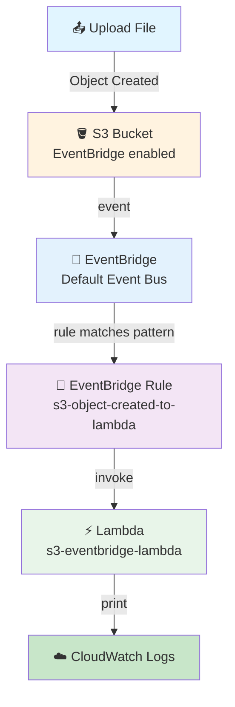
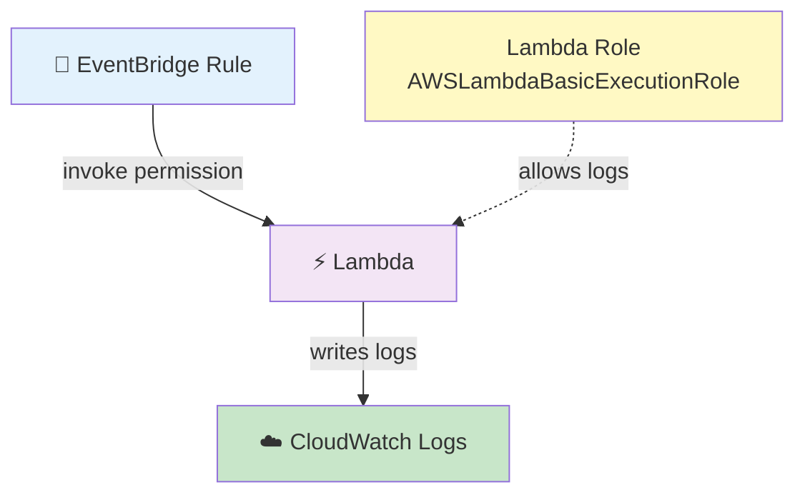
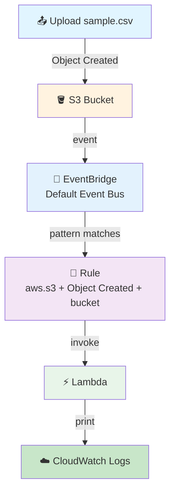

# S3 → EventBridge → Lambda Pipeline

## S3 Object Created Event Sent Through EventBridge

## 🎯 Goal

This pipeline is a bit different from your first **S3 → Lambda** pipeline (folder 01).

In that pipeline:

```text
File Upload
     ↓
S3
     ↓
S3 Event Notification
     ↓
Lambda
```

Now we put **EventBridge in the middle**:

```text
File Upload
     ↓
S3 Bucket
     ↓
Object Created Event
     ↓
EventBridge (Event Bus)
     ↓
Event Rule matches
     ↓
Lambda
     ↓
print()
     ↓
CloudWatch Logs
```

The main idea:

> **When something happens in S3, EventBridge gets the event, checks it against our rule, and sends it to Lambda only if it matches.**

Our practice event: **a file is uploaded to the S3 bucket.**

Full flow:

```text
File uploaded
     ↓
S3 creates an Object Created event
     ↓
EventBridge receives the event
     ↓
EventBridge checks our rule
     ↓
Rule matches
     ↓
Lambda is triggered
     ↓
Lambda prints event details
     ↓
CloudWatch Logs
```

## 🤔 Why Do We Need EventBridge Here?

Good question! You already made S3 → Lambda directly. For a simple pipeline:

```text
S3 → Lambda
```

is totally fine.

But when the setup gets bigger, EventBridge gives us a **middle layer** that can **check and route events**.

Example: one S3 bucket sends many event types:

```text
S3
 │
 ├── Object Created
 ├── Object Deleted
 ├── Object Restored
 └── Object Tagged
```

EventBridge can look at each event and decide:

```text
Object Created  → Lambda A
Object Deleted  → Lambda B
Object Restored → SNS
Object Tagged   → SQS
```

So EventBridge works like an **event router**.

### 🧠 Simple Real-Life Example — Courier Office

```text
S3         = Courier office
Packages   = Events
Counter person = EventBridge
```

Packages (events) arrive one by one. The counter person (EventBridge) checks each one:

> "Is this a new package?"

- If YES → send to the right place (Lambda)
- If NO → ignore / send somewhere else

So:

```text
S3 → EventBridge → check event → route event → Lambda
```

---

## 🆚 S3 → Lambda vs S3 → EventBridge → Lambda

| S3 → Lambda | S3 → EventBridge → Lambda |
| ----------- | ------------------------- |
| Direct connection | EventBridge is in the middle |
| S3 directly starts Lambda | S3 sends the event to EventBridge |
| Simple | More flexible |
| Good for simple triggers | Good for event routing |
| S3 Event Notification | EventBridge rule |
| Lambda is direct destination | Lambda is EventBridge target |

## Architecture



---

## 📦 AWS Resources We Need

| No. | AWS Service | Resource |
| --- | ----------- | -------- |
| 1 | S3 | S3 bucket |
| 2 | IAM | Lambda execution role |
| 3 | Lambda | Lambda function |
| 4 | EventBridge | EventBridge rule |
| 5 | CloudWatch | Lambda logs |

> ⚠️ **We are NOT using EventBridge Scheduler here.**

| Scheduler | EventBridge Event Bus |
|-----------|----------------------|
| For **time** → Lambda | For **AWS events** → Lambda |
| Every day at 6 PM | S3 Object Created → Lambda |

---

## Step 1: Create S3 Bucket

1. Open **AWS Management Console**
2. Search for **S3** → **Amazon S3**
3. Go to: **General purpose buckets** → **Create bucket**
4. Enter a globally unique name
   - Example: `s3-eventbridge-lambda-demo-123`
   - Or: `kshitij-s3-eventbridge-demo-2026`
   - (Your name must be unique)
5. Select a Region
   - Example: **Asia Pacific (Mumbai)** `ap-south-1`
   - Tip: keep S3 and Lambda in the **same Region** — it makes the setup simple
6. Keep other settings as default
7. Click **Create bucket**

### Bucket Structure

Keep files at the bucket root:

```
s3-eventbridge-lambda-demo
│
├── sample.csv
├── sales.json
└── test.txt
```

We are not using `input/sample.csv` for this basic demo.

---

## 🔐 Step 2: Create IAM Role for Lambda

Lambda needs permission to write logs to CloudWatch.

1. Open **AWS Management Console**
2. Search for **IAM** → **IAM** → **Roles**
3. Click **Create role**

### Trusted Entity
- Select: **AWS service**
- Service: **Lambda**
- Click **Next**

### Attach Policy
- Search: `AWSLambdaBasicExecutionRole`
- Select it

This gives Lambda basic permission for CloudWatch Logs.

> Our Lambda only **reads the event and prints info**. It is **not** downloading the S3 file — so we don't need S3 read permission for this demo.

### Role Name
- Role name: `s3-eventbridge-lambda-role`
- Click **Create role**

✅ Role is ready.

---

## 🐍 Step 3: Create Lambda Function

1. Open **AWS Management Console**
2. Search for **Lambda** → **AWS Lambda** → **Functions**
3. Click **Create function**
4. Select: **Author from scratch**

### Lambda Settings

| Setting | Value |
|---------|-------|
| Function name | `s3-eventbridge-lambda` |
| Runtime | Python 3.x (select latest available) |
| Permissions | **Use an existing role** → `s3-eventbridge-lambda-role` |

Click **Create function**.

---

## 💻 Step 4: Add Lambda Code

Open: **Lambda** → `s3-eventbridge-lambda` → **Code**

Replace the existing code with:

```python
import json


def lambda_handler(event, context):

    print("===== S3 EVENT THROUGH EVENTBRIDGE =====")

    print("Full Event:")
    print(json.dumps(event, indent=2))

    print("----- Event Details -----")

    print(f"Event Type : {event.get('detail-type')}")
    print(f"Source     : {event.get('source')}")
    print(f"Event Time : {event.get('time')}")

    detail = event.get("detail", {})

    bucket = detail.get("bucket", {})
    obj = detail.get("object", {})

    print("----- S3 File Details -----")

    print(f"Bucket Name : {bucket.get('name')}")
    print(f"File Name   : {obj.get('key')}")
    print(f"File Size   : {obj.get('size')} bytes")

    return {
        "statusCode": 200,
        "body": json.dumps("S3 EventBridge event processed successfully")
    }
```

Click **Deploy**.

### 🔍 What This Lambda Does

This Lambda is **not downloading the file**. It only reads the event that EventBridge sends.

The event looks like:

```json
{
  "detail-type": "Object Created",
  "source": "aws.s3",
  "detail": {
    "bucket": {
      "name": "my-bucket"
    },
    "object": {
      "key": "sample.csv",
      "size": 2456
    }
  }
}
```

Lambda prints:

```text
Event Type
Source
Event Time
Bucket Name
File Name
File Size
```

---

## 🧪 Step 5: Test Lambda Manually

1. Click **Test** → **Create new event**
2. Event name: `manual-test`
3. Event JSON: `{}`
4. Click **Save** → **Test**

✅ If Lambda runs fine, the code is good. The real event will later come from S3 → EventBridge.

---

## 🔔 Step 6: Enable EventBridge in S3 (Most Important S3 Step)

We are **not** creating a normal S3 → Lambda notification here.

We tell S3:

> **"Send S3 events to EventBridge."**

1. Open **S3** → **General purpose buckets**
2. Click your bucket
3. Go to the **Properties** tab
4. Scroll down to **Event Notifications**
5. Find: **Amazon EventBridge**
6. Click **Edit**
7. Turn ON: **Send notifications to Amazon EventBridge for all events in this bucket**
8. Click **Save changes**

> ⏳ Note: after turning it on, it can take around **five minutes** to take effect.

### ⚠️ Difference From Your First S3 Pipeline

**Folder 01 (S3 → Lambda):**

```text
S3 → Properties → Event Notifications → Create event notification → Lambda
```

**This pipeline (S3 → EventBridge → Lambda):**

```text
S3 → Properties → Event Notifications → Amazon EventBridge → ON
```

👉 We do **NOT select Lambda here**. Lambda gets connected later through the **EventBridge Rule**.

**Important:** do not create an S3 Event Notification with Lambda as the destination in this pipeline — otherwise you can accidentally make two paths and get **double Lambda runs** (duplicate executions).

---

## 🚌 Step 7: Understand the Default Event Bus

When a file is uploaded, S3 makes an **Object Created** event. Because EventBridge is ON for the bucket:

```text
S3
 ↓
EventBridge (default event bus)
 ↓
Does any rule match?
 ↓
YES
 ↓
Send to target
```

AWS service events from your account go to your account's **default event bus**.

---

## 📝 Step 8: Create EventBridge Rule

1. Open **AWS Management Console**
2. Search for **EventBridge** → **Amazon EventBridge**
3. Go to: **Rules** → **Create rule**

### Rule Details

| Setting | Value |
|---------|-------|
| Rule name | `s3-object-created-to-lambda` |
| Description | `Route S3 Object Created events to Lambda` |
| Event bus | **default** |

Why `default`? Because the S3 event goes to the account's default event bus:

```text
S3 → Default Event Bus → Rule
```

### Rule Type

Select: **Rule with an event pattern**

We are **not** making a schedule here:

| Schedule (cron/rate) | Event pattern |
|----------------------|---------------|
| ❌ not for us | ✅ yes — we wait for an event |

Click **Next**.

---

## 🎯 Step 9: Create the Event Pattern

Now we tell EventBridge: *"Which events should go to Lambda?"*

We want:
- Source = S3
- Event type = Object Created
- Bucket = our bucket

### Event Pattern

```json
{
  "source": ["aws.s3"],
  "detail-type": ["Object Created"],
  "detail": {
    "bucket": {
      "name": [
        "YOUR-BUCKET-NAME"
      ]
    }
  }
}
```

Replace `YOUR-BUCKET-NAME` with your real bucket name. Example:

```json
{
  "source": ["aws.s3"],
  "detail-type": ["Object Created"],
  "detail": {
    "bucket": {
      "name": [
        "s3-eventbridge-lambda-demo-123"
      ]
    }
  }
}
```

### 🧠 Understand the Event Pattern

| Part | Means |
|------|-------|
| `"source": ["aws.s3"]` | The event must come from S3 |
| `"detail-type": ["Object Created"]` | Only Object Created events (file uploaded) |
| `"detail": { "bucket": { "name": [...] } }` | The event must belong to this one bucket |

### Simple Check Examples

**Event 1:** S3 + Object Created + my-bucket

```text
Source = S3?        YES
Object Created?     YES
Bucket = my-bucket? YES
        ↓
MATCH → Lambda ✅
```

**Event 2:** S3 + Object Deleted + my-bucket

```text
Source = S3?        YES
Object Created?     NO
        ↓
NO MATCH → Lambda NOT triggered ❌
```

This is the power of EventBridge filtering.

---

## 🎯 Step 10: Select Lambda as Target

Click **Next** → target section:

| Setting | Value |
|---------|-------|
| Target type | **AWS service** |
| Select target | **Lambda function** |
| Function | `s3-eventbridge-lambda` |

So now:

```text
S3 → EventBridge → Rule → s3-eventbridge-lambda
```

---

## 🔐 Step 11: EventBridge → Lambda Permission (Important Concept)

EventBridge needs permission to **invoke** Lambda.

When you pick the Lambda as target in the AWS console, AWS automatically adds the required **Lambda resource-based permission** for EventBridge.

Concept:

```text
EventBridge
     ↓
"Can I invoke Lambda?"
     ↓
Lambda permission
     ↓
YES
```

### ⚠️ Two Different Permission Ideas — Do Not Mix Them

**1. Lambda Execution Role** (you created it)

```text
s3-eventbridge-lambda-role
        ↓
AWSLambdaBasicExecutionRole
        ↓
CloudWatch Logs
```

Purpose: lets **Lambda** write logs.

**2. Lambda Resource-Based Permission** (AWS adds it)

```text
EventBridge
     ↓
invoke permission
     ↓
Lambda
```

Purpose: lets **EventBridge** start Lambda.



---

## 📦 Step 12: Input / Event

No custom input needed here.

Why? EventBridge sends the **real S3 event** to Lambda:

```json
{
  "source": "aws.s3",
  "detail-type": "Object Created",
  "detail": {
    "bucket": {
      "name": "my-bucket"
    },
    "object": {
      "key": "sample.csv",
      "size": 2456
    }
  }
}
```

So:

```text
S3 → event → EventBridge → Lambda → event variable
```

---

## 👀 Step 13: Review the Rule

| Setting | Value |
|---------|-------|
| Rule name | `s3-object-created-to-lambda` |
| Event bus | default |
| Rule type | Rule with an event pattern |
| Event pattern | source = aws.s3, detail-type = Object Created, bucket = your bucket |
| Target | Lambda |
| Function | `s3-eventbridge-lambda` |

Click **Create rule**.

---

## 🧪 Step 14: Test the Complete Pipeline

1. Go to: **S3** → your bucket → **Objects** → **Upload**
2. Click **Add files**
3. Select a small test file, e.g. `sample.csv`
4. Make sure it goes to the bucket root:

```text
sample.csv        ✅
input/sample.csv  ❌
```

5. Click **Upload**

### 🔄 What Happens After Upload? (Step by Step)

```text
sample.csv uploaded
        ↓
S3 creates: Object Created
        ↓
EventBridge is ON → S3 sends event to EventBridge
        ↓
EventBridge checks rule: source = aws.s3? YES
        ↓
detail-type = Object Created? YES
        ↓
bucket = our bucket? YES
        ↓
RULE MATCHES → Lambda invoked
        ↓
Lambda prints event details
        ↓
CloudWatch saves the logs
```



---

## ☁️ Step 15: Check CloudWatch Logs

1. Open **CloudWatch** → **Logs** → **Log groups**
2. Open: `/aws/lambda/s3-eventbridge-lambda`
3. Open the latest **Log stream**

You should see something like:

```text
===== S3 EVENT THROUGH EVENTBRIDGE =====

Full Event:
{
    "version": "0",
    "id": "...",
    "detail-type": "Object Created",
    "source": "aws.s3",
    ...
}

----- Event Details -----

Event Type : Object Created
Source     : aws.s3
Event Time : ...

----- S3 File Details -----

Bucket Name : s3-eventbridge-lambda-demo-123
File Name   : sample.csv
File Size   : 2456 bytes
```

The real event has more fields. Main point: Lambda receives the **EventBridge S3 event** (with `source` / `detail-type` / `detail`), not the old direct S3 notification format.

---

## 🧠 Important: The Two Event Formats Are Different

### Direct S3 → Lambda event (folder 01)

```json
{
  "Records": [
    {
      "eventName": "ObjectCreated:Put",
      "s3": {
        "bucket": {
          "name": "my-bucket"
        },
        "object": {
          "key": "sample.csv"
        }
      }
    }
  ]
}
```

### S3 → EventBridge → Lambda event (this pipeline)

```json
{
  "detail-type": "Object Created",
  "source": "aws.s3",
  "detail": {
    "bucket": {
      "name": "my-bucket"
    },
    "object": {
      "key": "sample.csv",
      "size": 2456
    }
  }
}
```

The JSON structure is **different** → that is why the Lambda code is different too.

---

## 🔍 What Does EventBridge Actually Do?

EventBridge does **not** process the file. It does not download it. It does not change it.

It only:

```text
Receive Event
     ↓
Check Event Pattern
     ↓
Find Matching Rule
     ↓
Send Event to Target
```

### 🚫 What If a File Is Deleted?

Delete `sample.csv` → S3 creates **Object Deleted**.

Our rule says `detail-type = Object Created`, so:

```text
Object Deleted
     ↓
Rule does NOT match
     ↓
Lambda NOT triggered
```

Simple example of EventBridge filtering. ✅

### 🚫 What If Another Bucket Sends an Event?

Rule has `"name": ["bucket-A"]`. If an object is created in `bucket-B`:

```text
Rule → bucket does not match → no Lambda trigger
```

Lambda only gets the events we want. ✅

---

## ⭐ Why EventBridge Is Useful (Bigger Setup)

Later you can have many rules and many targets:

```text
                 S3
                  ↓
            EventBridge
                  │
      ┌───────────┼───────────┐
      ↓           ↓           ↓
   Rule 1      Rule 2      Rule 3
      ↓           ↓           ↓
   Lambda       SQS         SNS
```

Example:

```text
Object Created  → Lambda
Object Deleted  → SNS
Object Restored → SQS
```

This is why EventBridge helps when your setup grows.

---

## 🆚 When to Use Which Pipeline?

### Use S3 → Lambda (folder 01) when:
- Simple need: file uploaded → Lambda
- No complex routing

### Use S3 → EventBridge → Lambda when:
- You want S3 → EventBridge → filter event → route to target
- Many event types and many targets

### ⚠️ One Important Setup Note

Enabling **"Send notifications to Amazon EventBridge for all events"** means S3 sends **all supported events** to EventBridge. The filter for Object Created happens in the **EventBridge Rule**, not at the S3 setting.

```text
S3 → (all events) → EventBridge → Rule filters Object Created → Lambda
```

---

## 🧩 Full Step List (Quick Reference)

| Step | What to Do |
|------|-----------|
| 1 | Create S3 bucket (`s3-eventbridge-lambda-demo-123`) |
| 2 | Keep test file at bucket root (`sample.csv`) |
| 3 | IAM → Roles → Create role |
| 4 | Trusted entity: AWS service → Lambda |
| 5 | Attach `AWSLambdaBasicExecutionRole` |
| 6 | Role name: `s3-eventbridge-lambda-role` |
| 7 | Lambda → Functions → Create function → Author from scratch |
| 8 | Name: `s3-eventbridge-lambda`, Python 3.x |
| 9 | Use existing role: `s3-eventbridge-lambda-role` |
| 10 | Paste the Python code → **Deploy** |
| 11 | Test by hand (event `{}`) ✅ |
| 12 | S3 → bucket → Properties → Event Notifications → Amazon EventBridge |
| 13 | Turn ON: send notifications to EventBridge (all events) |
| 14 | Save changes (takes ~5 minutes) |
| 15 | EventBridge → Rules → Create rule |
| 16 | Rule name: `s3-object-created-to-lambda` |
| 17 | Event bus: default |
| 18 | Rule type: **Rule with an event pattern** |
| 19 | Event pattern: aws.s3 + Object Created + your bucket |
| 20 | Target: Lambda → `s3-eventbridge-lambda` |
| 21 | Create the rule |
| 22 | Upload `sample.csv` to the bucket |
| 23 | S3 creates Object Created → sends to EventBridge |
| 24 | Rule matches → EventBridge invokes Lambda |
| 25 | Lambda prints the event |
| 26 | CloudWatch saves the logs |

---

## 🎤 Interview Explanation

**Q: "Explain your S3 to EventBridge to Lambda pipeline."**

> **"I created an S3 bucket and enabled Amazon EventBridge event delivery on the bucket. When an object is created in the bucket, S3 sends the event to the EventBridge default event bus. Then I created an EventBridge rule with an event pattern that matches S3 events — specifically the Object Created event from my particular bucket. Lambda is the target of the rule. When a file is uploaded, EventBridge checks the event pattern, and if it matches, it invokes the Lambda function. Lambda reads the EventBridge event and prints details like the bucket name, file name, file size, event type, and event time. The Lambda logs are stored in CloudWatch."**

---

## ⭐ The Most Important Concept

```text
FILE UPLOAD
     ↓
    S3
     ↓
"Object Created"
     ↓
EventBridge
     ↓
"Does my rule match?"
     ↓
    YES
     ↓
  Lambda
     ↓
  print()
     ↓
CloudWatch
```

### Your Pipelines So Far

| # | Pipeline | What triggers it |
|---|----------|------------------|
| 1️⃣ | S3 → Lambda | **Direct trigger** — file upload → Lambda |
| 2️⃣ | EventBridge Scheduler → Lambda | **Time-based** — rate/cron schedule → Lambda |
| 3️⃣ | S3 → EventBridge → Lambda | **Routing + filtering** — event → rule check → Lambda |

Pipeline 3️⃣ is very useful when **one event source must go to different targets** based on event type or event details.

---

## Summary

| Component | What It Does |
|-----------|--------------|
| **S3 Bucket** | Saves files and sends events to EventBridge |
| **EventBridge (default bus)** | Receives all S3 events |
| **EventBridge Rule** | Filters: aws.s3 + Object Created + your bucket |
| **Lambda** (`s3-eventbridge-lambda`) | Reads the event and prints details |
| **CloudWatch Logs** | Shows the Lambda output |

This pipeline shows how **EventBridge filters and routes events** before Lambda runs.
