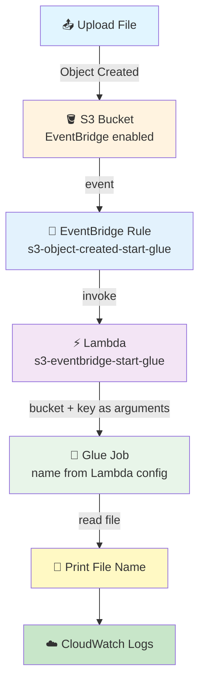
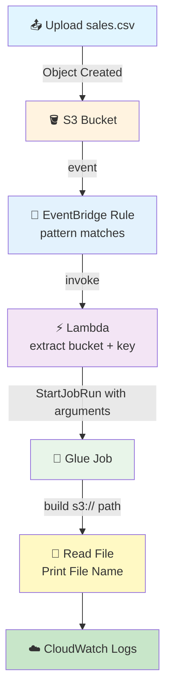

# S3 → EventBridge → Lambda → Glue Pipeline

## File Upload → EventBridge → Lambda → Start Glue Job → Read File → Print File Name

## 📁 Files in This Folder

| File | What It Is |
| ---- | ---------- |
| [lambda_function.py](lambda_function.py) | The Lambda code — reads the S3 event and starts the Glue job |
| [glue_job.py](glue_job.py) | The Glue job script — reads the file from S3 and prints its name |
| [eventbridge_pattern.json](eventbridge_pattern.json) | The EventBridge rule's event pattern — decides which S3 events trigger the pipeline |
| [trust_policy_lambda.json](trust_policy_lambda.json) | The IAM trust policy for the Lambda execution role |
| [trust_policy_glue.json](trust_policy_glue.json) | The IAM trust policy for the Glue execution role |

This README explains the **theory** — how the pieces fit together and why. The code itself lives in the files above.

## 🎯 Goal

We want to make an **automatic data pipeline**:

```text
File Upload
     ↓
S3 Bucket
     ↓
EventBridge
     ↓
Lambda
     ↓
Glue Job
     ↓
Read S3 File
     ↓
Print File Name
```

The most important point: **nothing is hardcoded** — not the bucket name, not the file name, and not the Glue job name.

- The **bucket name and object key** come from the S3 event.
- The **Glue job name** comes from a Lambda **environment variable**, so the same Lambda can start any Glue job.

So if we upload:

```text
sales.csv
```

Lambda gets the bucket name and object key from the event and passes them to Glue.

And if tomorrow we upload:

```text
customer.csv
```

the same pipeline works — **without changing any code**.

## 🏢 Why This Pipeline?

Instead of a person manually starting a Glue job when a file arrives, everything becomes automatic:

```text
File arrives
     ↓
Event generated automatically
     ↓
EventBridge gets the event
     ↓
Lambda starts
     ↓
Lambda starts Glue
     ↓
Glue reads the file
```

**No manual work after the file upload.** ✅

## 🤔 What Problem Does This Solve?

Imagine a company gets files every day:

```text
sales.csv
customer.csv
product.csv
```

Without this pipeline, someone might have to:

```text
1. Check S3
2. See if a file arrived
3. Start Glue by hand
4. Give Glue the correct file location
```

That is slow and boring work.

With this pipeline:

```text
File arrives
     ↓
Everything happens automatically
```

The user only uploads the file.

## 🧠 What Each AWS Service Does

| AWS Service | Its Job |
| ----------- | ------- |
| **S3** | Stores the uploaded file |
| **S3 EventBridge setting** | Sends S3 events to EventBridge |
| **EventBridge** | Gets the event and checks the rule |
| **EventBridge Rule** | Decides when Lambda should run |
| **Lambda** | Gets S3 details and starts Glue |
| **Glue** | Reads the file from S3 |
| **CloudWatch** | Stores Lambda and Glue logs |
| **IAM** | Gives permissions to Lambda and Glue |

## Architecture



---

## 🔐 IAM Roles We Need

AWS services need permission before they can do things. So we need:

### Role 1 — Lambda Execution Role

Lambda needs to:

```text
Write logs to CloudWatch
+
Start the Glue job
```

So the Lambda role needs:
- `AWSLambdaBasicExecutionRole` (for logs)
- Permission to start the Glue job (`glue:StartJobRun`)

> For practice: attach the Glue permission policy that allows starting the job. For production: make a custom policy with **only** the needed permission and limit it to the one Glue job.

### Role 2 — Glue Execution Role

Glue needs to:

```text
Read the file from S3
+
Write logs
```

### EventBridge Permission

EventBridge needs permission to invoke Lambda. When you pick Lambda as the target in the console, AWS adds this permission.

## 📦 AWS Resources We Will Create

```text
1. S3 Bucket
2. IAM Role for Lambda
3. Lambda Function
4. IAM Role for Glue
5. Glue Job
6. EventBridge Rule
```

---

## Step 1: Create S3 Bucket

1. Open **AWS Management Console**
2. Search for **S3** → **Amazon S3**
3. Go to: **General purpose buckets** → **Create bucket**
4. Bucket name (example): `s3-eventbridge-glue-demo-123`

> Remember: S3 bucket names must be **globally unique**.

5. Select your Region
   - Example: **Asia Pacific (Mumbai)** `ap-south-1`
6. Keep other settings as default for this practice
7. Click **Create bucket**

### Bucket Structure

For this basic pipeline, upload files at the bucket root:

```
s3-eventbridge-glue-demo-123
│
├── sales.csv
├── customer.csv
└── product.csv
```

---

## 🔐 Step 2: Create IAM Role for Lambda

1. Go to **IAM** → **Roles** → **Create role**
2. Select: **AWS service** → **Lambda**
3. Click **Next**

### Attach Policies
1. Search: `AWSLambdaBasicExecutionRole` → select it
   - This lets Lambda send logs to CloudWatch
2. Also attach the Glue permission that allows Lambda to **start the Glue job**
   - Needed action: `glue:StartJobRun`

### Role Name
- Role name: `s3-eventbridge-glue-lambda-role`
- Click **Create role**

> 🔐 The trust policy this role uses — the one that lets the Lambda service assume it — is in [trust_policy_lambda.json](trust_policy_lambda.json).

---

## 🐍 Step 3: Create Lambda Function

1. Go to **Lambda** → **Functions** → **Create function**
2. Select: **Author from scratch**

| Setting | Value |
|---------|-------|
| Function name | `s3-eventbridge-start-glue` |
| Runtime | Python 3.x (select latest available) |
| Permissions | **Use an existing role** → `s3-eventbridge-glue-lambda-role` |

Click **Create function**.

---

## 💻 Step 4: Add Lambda Code

The Lambda will:

```text
1. Receive the EventBridge event
2. Extract bucket name
3. Extract object key
4. Read the Glue job name from its environment variable
5. Start the Glue job
6. Pass bucket name and object key to Glue
```

Copy the code from [lambda_function.py](lambda_function.py) into the Lambda code editor, replacing the default handler.

Click **Deploy**.

### ⚙️ Set the Glue Job Name (Environment Variable)

The Glue job name is **not written inside the code**. Lambda reads it from an environment variable:

```python
GLUE_JOB_NAME = os.environ.get("GLUE_JOB_NAME")
```

So we tell Lambda which job to start, without touching the code:

1. Go to **Lambda** → `s3-eventbridge-start-glue` → **Configuration** → **Environment variables**
2. Click **Edit** → **Add environment variable**

| Key | Value |
|-----|-------|
| `GLUE_JOB_NAME` | the name of your Glue job (example: `glue-lambda-pipline1`) |

3. Click **Save**

Now the same Lambda works with **any** Glue job: create another job, change this one value, done. **No code change.** ✅

> ⚠️ **The `GLUE_JOB_NAME` value must match your Glue job name exactly**, otherwise Glue returns `EntityNotFoundException`. The rest of this guide uses the example name `glue-lambda-pipline1`.

### 🧠 What Is Lambda Doing?

Lambda is **not** processing the file. Lambda is only a **bridge** between EventBridge and Glue:

```text
EventBridge
     ↓
Lambda
     ↓
Get Bucket Name
     ↓
Get Object Key
     ↓
Start Glue
     ↓
Pass the arguments
```

### 📌 Why "Object Key" and Not Just "File Name"?

Because an S3 object key can have a folder path:

```text
sales.csv
```

or:

```text
input/2026/sales.csv
```

If the key is `input/2026/sales.csv`, Glue can build:

```text
s3://my-bucket/input/2026/sales.csv
```

This makes the pipeline flexible.

---

## 🚌 Step 5: Enable EventBridge for S3

Now S3 must send events to EventBridge.

1. Go to **S3** → your bucket → **Properties**
2. Find: **Event Notifications**
3. Look for: **Amazon EventBridge**
4. Click **Edit**
5. Turn ON: **Send notifications to Amazon EventBridge for all events in this bucket**
6. Click **Save changes**

### 🔔 What Happens After Enabling?

Upload `sales.csv` → S3 creates **Object Created** → the event goes to EventBridge:

```text
sales.csv → S3 → Object Created Event → EventBridge
```

---

## Step 6: Create EventBridge Rule

1. Go to **EventBridge** → **Rules** → **Create rule**

| Setting | Value |
|---------|-------|
| Rule name | `s3-object-created-start-glue` |
| Description | `Start Glue job when an object is created in S3` |
| Event bus | **default** |
| Rule type | **Rule with an event pattern** (not a schedule) |

### 🎯 Event Pattern

We want to match: **Source = S3**, **Event = Object Created**, **Bucket = our bucket**.

Copy the pattern from [eventbridge_pattern.json](eventbridge_pattern.json) into the **Event pattern** box and replace `YOUR BUCKET NAME` with your real bucket name (the example used in this guide is `s3-eventbridge-glue-demo-123`).

### 🧠 Understand the Pattern

| Part | Means |
|------|-------|
| `"source": ["aws.s3"]` | The event must come from S3 |
| `"detail-type": ["Object Created"]` | Only object creation events |
| `"detail": { "bucket": { "name": [...] } }` | Only events from our bucket |

So the rule means:

```text
IF event comes from S3
AND event is Object Created
AND event belongs to our bucket
THEN trigger Lambda
```

---

## 🎯 Step 7: Add Lambda as Target

Under target selection:

| Setting | Value |
|---------|-------|
| Target type | **AWS service** |
| Select target | **Lambda function** |
| Function | `s3-eventbridge-start-glue` |

Click **Next** → review → **Create rule**.

---

## 🔐 Step 8: Create IAM Role for Glue

1. Go to **IAM** → **Roles** → **Create role**
2. Select: **AWS service** → **Glue**
3. Click **Next**

Attach permissions for Glue to:
- **Read S3**
- **Write CloudWatch logs**

> For a simple learning setup, use the appropriate AWS-managed policies. For production, use a custom least-privilege policy.

- Role name: `s3-read-file-glue-role`
- Click **Create role**

> 🔐 The trust policy this role uses — the one that lets the Glue service assume it — is in [trust_policy_glue.json](trust_policy_glue.json).

---

## 🧪 Step 9: Create Glue Job

1. Go to **AWS Glue** → **ETL jobs** → **Create job**
2. Choose the visual/script editor option available in your console
3. Job name: **any name you like** — this guide uses `glue-lambda-pipline1`
   - ⚠️ Whatever name you pick, put the **same** name in the Lambda `GLUE_JOB_NAME` environment variable (Step 4)
4. IAM role: `s3-read-file-glue-role`

This role lets Glue read the S3 file and write logs.

---

## ⚙️ Step 10: Configure Glue Job Arguments

This is an important part of this pipeline.

We use two arguments:

```text
--bucket_name
--object_key
```

These are **not fixed values**. Lambda gives their values when it starts the job:

```text
Lambda
   ↓
bucket_name = my-demo-bucket
object_key  = sales.csv
   ↓
Glue gets:
--bucket_name = my-demo-bucket
--object_key  = sales.csv
```

> ⚠️ Do not put fixed values in the job expecting them to change by themselves. The values come from Lambda **at runtime**.

The important Lambda code:

```python
Arguments={
    "--bucket_name": bucket_name,
    "--object_key": object_key
}
```

---

## 🐍 Step 11: Add Glue Code

Glue needs to read the arguments passed by Lambda.

Copy the code from [glue_job.py](glue_job.py) into the Glue job's script editor.

Glue reads the two arguments Lambda sent, builds the S3 path at runtime, reads the file and prints its name. The job name is not written down anywhere — Glue tells the script its own name through `JOB_NAME`.

### 🧠 What Is `getResolvedOptions()`?

This code:

```python
args = getResolvedOptions(
    sys.argv,
    ["JOB_NAME", "bucket_name", "object_key"]
)
```

means:

> Get the values passed to this Glue job for `JOB_NAME`, `bucket_name` and `object_key`.

`JOB_NAME` is special: **we never send it ourselves.** Glue fills it in automatically with the name of the job that is running, so `job.init()` can use it without anyone hardcoding a job name.

If Lambda sends:

```text
--bucket_name = my-demo-bucket
--object_key  = sales.csv
```

Then Glue gets:

```python
args["bucket_name"]   # my-demo-bucket
args["object_key"]    # sales.csv
args["JOB_NAME"]      # glue-lambda-pipline1 — added by Glue, not by Lambda
```

### 🔄 Dynamic S3 Path

Glue builds:

```python
s3_path = f"s3://{bucket_name}/{object_key}"
```

Example:

```text
bucket_name = my-demo-bucket
object_key  = sales.csv
     ↓
s3_path = s3://my-demo-bucket/sales.csv
```

Next upload is `customer.csv` → Glue automatically gets:

```text
s3://my-demo-bucket/customer.csv
```

**No code change needed.** ✅

---

## 🧪 Step 12: Test the Complete Pipeline

1. Go to **S3** → your bucket → **Upload**
2. Upload `sales.csv`

### 🔄 What Happens After Upload? (Step by Step)

```text
sales.csv arrives in S3
        ↓
S3 creates: Object Created
        ↓
EventBridge gets the event
        ↓
Rule checks: S3? YES — Object Created? YES — our bucket? YES
        ↓
EventBridge invokes Lambda
        ↓
Lambda extracts: bucket_name + object_key
        ↓
Lambda calls glue.start_job_run() with the two arguments
        ↓
Glue receives the arguments
        ↓
Glue builds: s3://my-demo-bucket/sales.csv
        ↓
Glue reads the file
        ↓
Glue prints the file name
        ↓
CloudWatch stores the logs of Lambda and Glue
```



---

## ☁️ Step 13: Check Lambda Logs

Go to: **Lambda** → `s3-eventbridge-start-glue` → **Monitor** → **View CloudWatch logs**

You should see:

```text
===== EVENTBRIDGE EVENT RECEIVED =====

===== S3 DETAILS =====

Bucket Name : my-demo-bucket
Object Key  : sales.csv

===== GLUE JOB STARTED =====

Glue Job Name  : glue-lambda-pipline1
Glue Job Run ID: ...
```

---

## ☁️ Step 14: Check Glue Logs

Go to: **Glue** → **ETL jobs** → `glue-lambda-pipline1` → **Runs**

Open the latest run and check the logs:

```text
===== GLUE JOB STARTED =====

Bucket Name : my-demo-bucket
Object Key  : sales.csv
S3 Path     : s3://my-demo-bucket/sales.csv

===== READING FILE =====

File read successfully

File Name / Object Key: sales.csv
```

---

## 🧪 Step 15: Test With Another File

Now upload:

```text
customer.csv
```

You do **not** change Lambda. You do **not** change EventBridge. You do **not** change Glue code.

The same pipeline runs:

```text
customer.csv
    ↓
S3 → EventBridge → Lambda
    ↓
bucket_name + customer.csv
    ↓
Glue reads customer.csv
    ↓
Prints customer.csv
```

This proves the pipeline is **dynamic**. 🎯

---

## ❌ What We Are NOT Doing

We are **not** writing:

```python
bucket_name = "my-demo-bucket"
file_name = "sales.csv"
job_name = "glue-lambda-pipline1"
```

That is **hardcoding** — the code would only ever work for one file and one job.

Instead:

```python
bucket_name = event["detail"]["bucket"]["name"]
object_key = event["detail"]["object"]["key"]
job_name = os.environ["GLUE_JOB_NAME"]
```

The bucket and key come **from the event**. The job name comes **from configuration**. Nothing is baked into the code.

---

## 🔑 Most Important Part of the Pipeline

```text
EventBridge
      ↓
    Lambda
      ↓
Extract: Bucket Name + Object Key
      ↓
Read: Glue Job Name (environment variable)
      ↓
Start Glue
      ↓
Pass Arguments
      ↓
Glue
      ↓
getResolvedOptions()
      ↓
Read S3 File
```

Lambda reads which job to start from its own configuration:

```python
GLUE_JOB_NAME = os.environ.get("GLUE_JOB_NAME")
```

Lambda sends:

```python
Arguments={
    "--bucket_name": bucket_name,
    "--object_key": object_key
}
```

Glue reads:

```python
args = getResolvedOptions(
    sys.argv,
    ["JOB_NAME", "bucket_name", "object_key"]
)
```

**This is what makes the pipeline dynamic.**

---

## 🆚 Why Not Directly S3 → Glue?

This pipeline is for learning **event routing and orchestration**:

```text
S3         → stores the file
EventBridge → handles the event (check + route)
Lambda      → handles the orchestration
Glue        → handles the real data work
```

Each service has a **clear, separate job**.

### 🎯 Why Use Lambda Between EventBridge and Glue?

Lambda is a place to add logic before starting Glue. Later, Lambda could:

```text
Receive S3 event
       ↓
Check file type
       ↓
Check file name
       ↓
Check folder
       ↓
Start the right Glue job
```

For this practice, Lambda simply:

```text
Receive event → Extract bucket + key → Start Glue
```

---

## ⭐ One-Line Summary

```text
S3 stores the file
     ↓
EventBridge detects the event
     ↓
Lambda extracts S3 details
     ↓
Lambda starts Glue + passes bucket + object key
     ↓
Glue reads the arguments
     ↓
Glue reads the S3 file
     ↓
Glue prints the file name
     ↓
CloudWatch stores the logs
```

> **Main purpose: a fully automatic pipeline where the uploaded file's S3 location is passed dynamically from S3 → EventBridge → Lambda → Glue.**

---

## 🧩 Full Step List (Quick Reference)

| Step | What to Do |
|------|-----------|
| 1 | Create S3 bucket (`s3-eventbridge-glue-demo-123`) |
| 2 | Upload a sample CSV for testing (later) |
| 3 | Create Lambda IAM role: `AWSLambdaBasicExecutionRole` + Glue start permission |
| 4 | Lambda → Functions → Create function → Author from scratch |
| 5 | Name: `s3-eventbridge-start-glue`, Python 3.x, use existing role |
| 6 | Paste the Lambda code from `lambda_function.py` → **Deploy** |
| 7 | Lambda → Configuration → Environment variables → add `GLUE_JOB_NAME` |
| 8 | Create Glue IAM role: read S3 + write logs → `s3-read-file-glue-role` |
| 9 | Glue → ETL jobs → Create job → any name (example: `glue-lambda-pipline1`) |
| 10 | Attach the Glue role to the job |
| 11 | Job accepts `--bucket_name` and `--object_key` (values come from Lambda) |
| 12 | Paste the Glue code from `glue_job.py` (uses `getResolvedOptions()`) |
| 13 | S3 bucket → Properties → Event Notifications → Amazon EventBridge → ON |
| 14 | EventBridge → Rules → Create rule |
| 15 | Rule name: `s3-object-created-start-glue` |
| 16 | Event bus: default |
| 17 | Rule type: Rule with an event pattern |
| 18 | Pattern: paste `eventbridge_pattern.json`, replace `YOUR BUCKET NAME` |
| 19 | Target: Lambda → `s3-eventbridge-start-glue` |
| 20 | Create the rule |
| 21 | Upload `sales.csv` to S3 |
| 22 | S3 creates Object Created → EventBridge → rule matches |
| 23 | Lambda extracts bucket name + object key |
| 24 | Lambda reads `GLUE_JOB_NAME` and calls `start_job_run` with `--bucket_name` + `--object_key` |
| 25 | Glue builds `s3://bucket/key` and reads the file |
| 26 | Glue prints the file name |
| 27 | Check Lambda logs in CloudWatch |
| 28 | Check Glue job logs (Glue → ETL jobs → Runs) |
| 29 | Upload `customer.csv` → same flow, no code change ✅ |

---

## 🎤 Interview Explanation

**Q: "Explain your S3 to EventBridge to Lambda to Glue pipeline."**

> **"I created an S3 bucket and enabled EventBridge notifications for the bucket. Whenever an object is created, S3 sends the event to EventBridge. I created an EventBridge rule that filters Object Created events from my specific bucket and set Lambda as the target. Lambda receives the event and dynamically extracts the S3 bucket name and object key. The Glue job name is not hardcoded in Lambda — I pass it in through the `GLUE_JOB_NAME` environment variable, so the same function can start any Glue job. Lambda then calls StartJobRun and passes the bucket name and object key as job arguments. The Glue job uses getResolvedOptions to read these arguments, dynamically builds the S3 path, reads the file, and prints the file name. Lambda and Glue logs are available in CloudWatch."**

---

## Summary

| Component | What It Does |
|-----------|--------------|
| **S3 Bucket** | Stores files, sends events to EventBridge |
| **EventBridge Rule** | Filters: aws.s3 + Object Created + your bucket |
| **Lambda** (`s3-eventbridge-start-glue`) | Extracts bucket + key, starts Glue with arguments |
| **Glue Job** (name set by `GLUE_JOB_NAME`, e.g. `glue-lambda-pipline1`) | Reads arguments, builds S3 path, reads the file, prints the name |
| **IAM Roles** | Lambda role (logs + start Glue), Glue role (read S3 + logs) |
| **CloudWatch Logs** | Shows Lambda and Glue output |

This pipeline shows **event-driven orchestration**: file in → event → Lambda → Glue, with everything passed **dynamically**.
