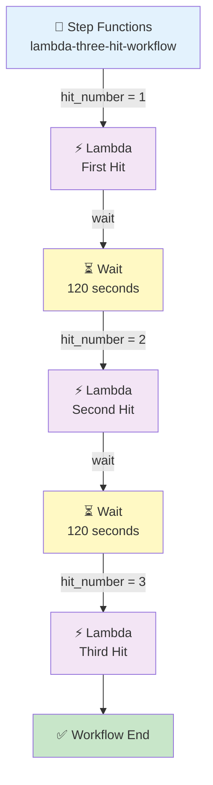

# Step Functions → Lambda (3 Hits with Wait)

## The Same Lambda Runs 3 Times, with a 2-Minute Wait Between Each Run

## 🎯 Goal

We want to make a **Step Functions workflow that calls one Lambda function 3 times**.

There is a **2-minute wait between each Lambda run**.

Lambda prints a different message each time:

```text
First run  → First Hit
Second run → Second Hit
Third run  → Third Hit
```

Full flow:

```text
Step Functions
      ↓
Lambda → First Hit
      ↓
Wait 2 Minutes
      ↓
Lambda → Second Hit
      ↓
Wait 2 Minutes
      ↓
Lambda → Third Hit
      ↓
Workflow Completed
```

## 🏆 Why This Pipeline?

This pipeline shows how **Step Functions controls a workflow**. Step Functions decides:

- Which Lambda runs
- How many times Lambda runs
- The order of runs
- The waiting time between runs

Lambda only does the actual work. Here the work is simple:

```text
Print First Hit
Print Second Hit
Print Third Hit
```

## ❓ What Problem Does This Solve?

Suppose you need to run the same Lambda many times, but **not one right after another**:

```text
Run Lambda
↓
Wait 2 minutes
↓
Run Lambda again
↓
Wait 2 minutes
↓
Run Lambda again
```

A **bad** way is to keep Lambda running and use:

```python
time.sleep(120)
```

Then Lambda stays running (and you pay) while it just waits. ❌

A **good** way is a **Step Functions Wait state**:

```text
Step Functions
      ↓
Lambda
      ↓
Wait State
      ↓
Lambda
```

Step Functions does the waiting — Lambda is **not running** during the wait. ✅

## Architecture



---

## 🔐 IAM Role — Only ONE Role

We use **only one IAM role**. The same role is used by both:

```text
Step Functions
      ↓
Lambda
```

### Role Name

```text
stepfunctions-lambda-demo-role
```

## Step 1: Create the IAM Role

1. Go to **AWS Console** → **IAM** → **Roles**
2. Click **Create role**
3. Choose: **Custom trust policy**

### IAM Trust Policy

```json
{
  "Version": "2012-10-17",
  "Statement": [
    {
      "Effect": "Allow",
      "Principal": {
        "Service": [
          "states.amazonaws.com",
          "lambda.amazonaws.com"
        ]
      },
      "Action": "sts:AssumeRole"
    }
  ]
}
```

**What this means:** both `states.amazonaws.com` (Step Functions) and `lambda.amazonaws.com` (Lambda) can use this role.

### Attach Managed Policies

| Policy | Why |
|--------|-----|
| `AWSLambdaBasicExecutionRole` | Lets **Lambda** write logs to CloudWatch |
| `AWSLambdaRole` | Lets **Step Functions** invoke Lambda |

Our role now has:

```text
stepfunctions-lambda-demo-role

Managed Policies:
1. AWSLambdaBasicExecutionRole
2. AWSLambdaRole
```

Click **Create role**.

---

## 🐍 Step 2: Create Lambda Function

1. Go to **AWS Console** → **Lambda** → **Functions** → **Create function**
2. Choose: **Author from scratch**

| Setting | Value |
|---------|-------|
| Function name | `stepfunctions-three-hit-lambda` |
| Runtime | Python 3.x (select latest available) |
| Permissions | **Use an existing role** → `stepfunctions-lambda-demo-role` |

Click **Create function**.

### 💻 Lambda Code

Open the function → **Code** → **Code source**. Replace the code with:

```python
def lambda_handler(event, context):

    hit_number = event.get("hit_number")

    if hit_number == 1:
        message = "First Hit"

    elif hit_number == 2:
        message = "Second Hit"

    elif hit_number == 3:
        message = "Third Hit"

    else:
        message = "Unknown Hit"

    print("================================")
    print(f"Lambda executed: {message}")
    print(f"Hit Number: {hit_number}")
    print("================================")

    return {
        "statusCode": 200,
        "hit_number": hit_number,
        "message": message
    }
```

Click **Deploy**.

### 🧠 How the Lambda Code Works

Lambda gets an input from Step Functions, for example:

```json
{
  "hit_number": 1
}
```

Lambda reads:

```python
hit_number = event.get("hit_number")
```

The value is `1`, so this part runs:

```python
if hit_number == 1:
```

And Lambda prints:

```text
First Hit
```

### 🔑 Why We Pass `hit_number`

We want Lambda to know **which run** it is. We are **not** keeping a counter inside Lambda.

Instead, Step Functions sends the number:

```text
Step Functions → hit_number = 1 → Lambda → First Hit
Step Functions → hit_number = 2 → Lambda → Second Hit
Step Functions → hit_number = 3 → Lambda → Third Hit
```

This is more reliable, because each Lambda run gets the information it needs directly. ✅

---

## 🛠️ Step 3: Create Step Functions State Machine

1. Go to **AWS Console** → **Step Functions** → **State machines**
2. Click **Create state machine**
3. Choose: **Write your workflow in code**
4. Type: **Standard**

### 📝 Step Functions Code

One important point: the state machine uses **`QueryLanguage = JSONPath`**.

For JSONPath we must use **`Parameters`** — **not** `Arguments`.

```json
{
  "Comment": "Invoke Lambda three times with a 2 minute interval",
  "StartAt": "FirstLambdaHit",
  "States": {

    "FirstLambdaHit": {
      "Type": "Task",
      "Resource": "arn:aws:states:::lambda:invoke",
      "Parameters": {
        "FunctionName": "arn:aws:lambda:us-east-1:455626929414:function:stepfunctions-three-hit-lambda",
        "Payload": {
          "hit_number": 1
        }
      },
      "Next": "WaitTwoMinutesAfterFirstHit"
    },

    "WaitTwoMinutesAfterFirstHit": {
      "Type": "Wait",
      "Seconds": 120,
      "Next": "SecondLambdaHit"
    },

    "SecondLambdaHit": {
      "Type": "Task",
      "Resource": "arn:aws:states:::lambda:invoke",
      "Parameters": {
        "FunctionName": "arn:aws:lambda:us-east-1:455626929414:function:stepfunctions-three-hit-lambda",
        "Payload": {
          "hit_number": 2
        }
      },
      "Next": "WaitTwoMinutesAfterSecondHit"
    },

    "WaitTwoMinutesAfterSecondHit": {
      "Type": "Wait",
      "Seconds": 120,
      "Next": "ThirdLambdaHit"
    },

    "ThirdLambdaHit": {
      "Type": "Task",
      "Resource": "arn:aws:states:::lambda:invoke",
      "Parameters": {
        "FunctionName": "arn:aws:lambda:us-east-1:455626929414:function:stepfunctions-three-hit-lambda",
        "Payload": {
          "hit_number": 3
        }
      },
      "End": true
    }
  }
}
```

> ⚠️ The Lambda ARN above is an example. **Replace it with your real Lambda ARN.**

### 🧠 Why We Use `Parameters` (Not `Arguments`)

The state machine uses **JSONPath**. For JSONPath, the Lambda task uses `Parameters`.

| ❌ Do not use | ✅ Use |
|--------------|-------|
| `"Arguments": {` | `"Parameters": {` |

Using `Arguments` with JSONPath gives this error:

```text
Field is not supported when QueryLanguage is JSONPath
```

---

## 🔍 Understand Each Part of the Workflow

### First Lambda State

```json
"FirstLambdaHit": {
  "Type": "Task",
  "Resource": "arn:aws:states:::lambda:invoke",
  "Parameters": {
    "FunctionName": "...",
    "Payload": {
      "hit_number": 1
    }
  }
}
```

Means:

```text
Step Functions → invoke Lambda → send hit_number = 1 → Lambda prints "First Hit"
```

### First Wait State

```json
"WaitTwoMinutesAfterFirstHit": {
  "Type": "Wait",
  "Seconds": 120
}
```

`120 seconds` = **2 minutes**.

```text
First Lambda → Wait → 2 Minutes
```

> Lambda is **not running** during this wait.

### Second Lambda State

After the 2-minute wait, `SecondLambdaHit` runs and sends:

```json
{ "hit_number": 2 }
```

Lambda prints **Second Hit**.

### Third Lambda State

After the second 2-minute wait, `ThirdLambdaHit` runs and sends:

```json
{ "hit_number": 3 }
```

Lambda prints **Third Hit**. Then:

```json
"End": true
```

means the workflow is complete. ✅

---

## 🔐 Step 4: Set the Step Functions Role

When creating the state machine, AWS asks for the execution role.

- Select: **Use an existing role**
- Choose: `stepfunctions-lambda-demo-role`

> We use the **same IAM role** here.

## Step 5: Create the State Machine

| Setting | Value |
|---------|-------|
| State machine name | `lambda-three-hit-workflow` |
| Type | Standard |
| Definition | the JSON code above |
| Execution role | `stepfunctions-lambda-demo-role` |

Click **Create**.

---

## ▶️ Step 6: Start an Execution

1. Go to **Step Functions** → **State machines** → `lambda-three-hit-workflow`
2. Click **Start execution**
3. Input:

```json
{}
```

4. Click **Start execution**

### 🔄 What Happens During Execution?

```text
Step Functions → FirstLambdaHit → Lambda → First Hit
                        ↓
                 Wait 2 minutes
                        ↓
Step Functions → SecondLambdaHit → Lambda → Second Hit
                        ↓
                 Wait 2 minutes
                        ↓
Step Functions → ThirdLambdaHit → Lambda → Third Hit
                        ↓
                Workflow Completed
```

### 📊 Execution Timeline

If the workflow starts at **6:00 PM**:

| Time | What Happens |
|------|--------------|
| 6:00 PM | Lambda → **First Hit** |
| 6:00 → 6:02 PM | Step Functions waits 2 minutes |
| 6:02 PM | Lambda → **Second Hit** |
| 6:02 → 6:04 PM | Step Functions waits 2 minutes |
| 6:04 PM | Lambda → **Third Hit** |
| 6:04 PM | Workflow Completed |

So the hits happen at about:

```text
1st Hit → 0 minutes
2nd Hit → 2 minutes
3rd Hit → 4 minutes
```

---

## ☁️ Step 7: Check Lambda CloudWatch Logs

Go to: **Lambda** → `stepfunctions-three-hit-lambda` → **Monitor** → **View CloudWatch logs**

You should see **three** runs:

**First run**

```text
================================
Lambda executed: First Hit
Hit Number: 1
================================
```

**Second run**

```text
================================
Lambda executed: Second Hit
Hit Number: 2
================================
```

**Third run**

```text
================================
Lambda executed: Third Hit
Hit Number: 3
================================
```

---

## 📊 Step 8: Check the Step Functions Execution

Go to: **Step Functions** → `lambda-three-hit-workflow` → **Executions**

Open the execution and you should see this chain:

```text
FirstLambdaHit
       ↓
WaitTwoMinutesAfterFirstHit
       ↓
SecondLambdaHit
       ↓
WaitTwoMinutesAfterSecondHit
       ↓
ThirdLambdaHit
       ↓
Succeeded ✅
```

---

## 🧪 Expected Result

Lambda runs exactly **3 times**:

| Run | Prints | Hit Number |
|-----|--------|-----------|
| 1 | First Hit | 1 |
| 2 | Second Hit | 2 |
| 3 | Third Hit | 3 |

With a **2-minute gap** between each run.

---

## ❌ Why We Don't Use a Counter Inside Lambda

We do **not** want this:

```python
count = count + 1
```

Why? Because Lambda runs in separate, fresh executions. One run should not depend on the previous run's memory.

Instead, Step Functions clearly sends:

```text
hit_number = 1
hit_number = 2
hit_number = 3
```

So the workflow state is controlled by **Step Functions**, not inside Lambda. ✅

---

## 🔐 IAM Summary

Only **one** IAM role is used:

```text
stepfunctions-lambda-demo-role
```

**Trust policy:**

```json
{
  "Version": "2012-10-17",
  "Statement": [
    {
      "Effect": "Allow",
      "Principal": {
        "Service": [
          "states.amazonaws.com",
          "lambda.amazonaws.com"
        ]
      },
      "Action": "sts:AssumeRole"
    }
  ]
}
```

**Managed policies:**

```text
AWSLambdaBasicExecutionRole
AWSLambdaRole
```

---

## 🧩 Full Step List (Quick Reference)

| Step | What to Do |
|------|-----------|
| 1 | IAM → Roles → Create role → **Custom trust policy** |
| 2 | Paste trust policy with `states.amazonaws.com` + `lambda.amazonaws.com` |
| 3 | Attach `AWSLambdaBasicExecutionRole` + `AWSLambdaRole` |
| 4 | Role name: `stepfunctions-lambda-demo-role` |
| 5 | Lambda → Functions → Create function → Author from scratch |
| 6 | Name: `stepfunctions-three-hit-lambda`, Python 3.x, use existing role |
| 7 | Paste the Lambda code → **Deploy** |
| 8 | Step Functions → State machines → Create state machine |
| 9 | Choose **Write your workflow in code** → type **Standard** |
| 10 | Paste the state machine JSON (use `Parameters`, not `Arguments`) |
| 11 | Replace the Lambda ARN with your real ARN |
| 12 | Execution role: **Use an existing role** → `stepfunctions-lambda-demo-role` |
| 13 | Name: `lambda-three-hit-workflow` → **Create** |
| 14 | **Start execution** with input `{}` |
| 15 | Wait ~4 minutes for all 3 hits to finish |
| 16 | Check Lambda CloudWatch logs → see First / Second / Third Hit |
| 17 | Check the execution graph → **Succeeded** |

---

## 🎤 Interview Explanation

**Q: "Explain your Step Functions → Lambda pipeline."**

> **"I created a Step Functions workflow that invokes the same Lambda function three times. The first Lambda execution receives a hit number of 1 and prints First Hit. Step Functions then enters a Wait state for 120 seconds. After the wait, it invokes the same Lambda with hit number 2, which prints Second Hit. It waits another 120 seconds and invokes Lambda with hit number 3, which prints Third Hit. I used Step Functions Wait states instead of using sleep inside Lambda, so Lambda is only running when it is actually doing its task. The hit number is passed from Step Functions to Lambda, so Lambda does not need to keep its own execution counter."**

---

## ⭐ One-Line Summary

```text
Step Functions
      ↓
Lambda — First Hit
      ↓
Wait — 2 Minutes
      ↓
Lambda — Second Hit
      ↓
Wait — 2 Minutes
      ↓
Lambda — Third Hit
      ↓
Completed
```

> **Main purpose: Step Functions controls the workflow — it decides how many times Lambda runs, in what order, and how long to wait between runs. Lambda only prints its message.**

---

## Summary

| Component | What It Does |
|-----------|--------------|
| **IAM Role** (`stepfunctions-lambda-demo-role`) | One role for both Step Functions and Lambda (trust: `states.amazonaws.com` + `lambda.amazonaws.com`) |
| **Lambda** (`stepfunctions-three-hit-lambda`) | Reads `hit_number` and prints First / Second / Third Hit |
| **Step Functions** (`lambda-three-hit-workflow`) | Runs Lambda 3 times with 120-second Wait states between runs |
| **CloudWatch Logs** | Shows the three Lambda runs |

This pipeline shows how **Step Functions works like a manager** — it controls the order, the count, and the waiting — while Lambda just does the small job it is told to do.
