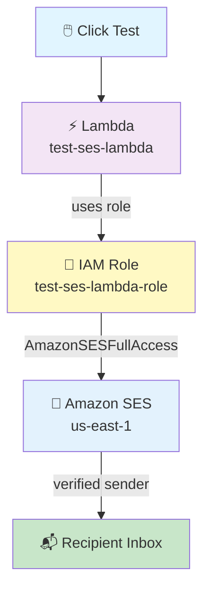

# Lambda → SES Email Pipeline

## Click Test on Lambda → Amazon SES Sends a Professional HTML Email

## 📁 Files in This Folder

| File | What It Is |
| ---- | ---------- |
| [lambda_function.py](lambda_function.py) | The Lambda handler — config, the HTML/plain-text builders, and the `ses.send_email` call |
| [email.html](email.html) | The HTML email body — design only, loaded at runtime by the handler |
| [trust_policy.json](trust_policy.json) | The IAM trust policy for the Lambda execution role (`lambda.amazonaws.com` only) |

This README explains the **theory** — how the pieces fit together and why. The code itself lives in the files above.

## 🎯 Goal

When you click **Test** on an AWS Lambda function, Lambda uses **Amazon SES** to send a **nice HTML email** to verified recipients.

```text
Test Click
     ↓
Lambda
     ↓
Amazon SES
     ↓
Recipient Inbox 📬
```

## 📋 What You Need Before Starting

- An AWS account (console access)
- One **verified sender email** (example: `kshitijjavir@outlook.com`)
- One or more **recipient emails** (example: `kshitijjavir110@gmail.com`)
- Region: **`us-east-1` (N. Virginia)** — keep everything in one region

> ⚠️ **SES Sandbox Rule:** In sandbox mode, **both the sender AND every recipient must be verified** in SES.

## 🗺️ Pipeline Overview



---

## 🥇 STEP 1: Create the IAM Role

**Go to:** IAM Console → **Roles** → **Create role**

| Field | Value |
|---|---|
| Trusted entity type | **AWS service** |
| Use case | **Lambda** |
| Role name | `test-ses-lambda-role` |

### Trust Policy (auto-created — keep it exactly like this)

The trust policy this role uses is in [trust_policy.json](trust_policy.json) — it trusts `lambda.amazonaws.com` and nothing else.

> ❌ Do **NOT** add `ses.amazonaws.com` to the trust policy. SES is **not** assuming your role — Lambda is.

---

## 🥈 STEP 2: Attach Managed Policies to the Role

Attach **both** of these AWS-managed policies:

| # | Managed Policy | Its Job |
|---|---|---|
| 1 | `AWSLambdaBasicExecutionRole` | Write logs to CloudWatch |
| 2 | `AmazonSESFullAccess` | Send emails using SES |

**Where:** IAM → Roles → `test-ses-lambda-role` → **Add permissions → Attach policies** → search and select both → **Attach**

> 💡 For production, do not use full SES access. Make a custom policy with only `ses:SendEmail` and limit it to your sender address.

---

## 🥉 STEP 3: Verify Emails in Amazon SES

**Go to:** SES Console (us-east-1) → **Configuration** → **Identities** → **Create identity**

Do this for **the sender and every recipient**:

| Field | Value |
|---|---|
| Identity type | **Email address** |
| Email address | `kshitijjavir@outlook.com` (sender) |
| Email address | `kshitijjavir110@gmail.com` (recipient #1) |
| Email address | *(any other recipient)* (recipient #2) |

**For each one:**

1. Click **Create identity**
2. Open that email inbox
3. Find the AWS verification email → click the verify link
4. Check the status shows **Verified** ✅ in the SES Identities list

**Target state:**

```
SES → Identities
┌────────────────────────────────┬───────────┐
│ kshitijjavir@outlook.com       │ Verified  │
│ kshitijjavir110@gmail.com      │ Verified  │
│ ...                            │ Verified  │
└────────────────────────────────┴───────────┘
```

---

## 🏅 STEP 4: Create the Lambda Function

**Go to:** Lambda Console (us-east-1) → **Create function**

| Field | Value |
|---|---|
| Option | **Author from scratch** |
| Function name | `test-ses-lambda` |
| Runtime | **Python 3.12** |
| Architecture | x86_64 |
| Execution role | **Use an existing role** → `test-ses-lambda-role` |

Click **Create function**.

### Check the Handler Settings

**Go to:** Lambda → **Configuration** → **General configuration** → **Edit**

| Field | Value |
|---|---|
| Handler | `lambda_function.lambda_handler` |
| Runtime | Python 3.12 |
| Timeout | 10 seconds |
| Memory | 128 MB |

---

## 🏆 STEP 5: Add the Code in Lambda

**Go to:** Lambda Console → `test-ses-lambda` → **Code** tab

You will see the inline code editor. What you put in it depends on the approach you pick:

> 📝 **Two ways to package this code — both send the exact same email.**

| Approach | Files needed | How you deploy it | Use it when |
|---|---|---|---|
| **A — HTML embedded in Python** | `lambda_function.py` only | Paste straight into the Lambda inline editor — **no zip upload needed** ✅ | Learning / quick test |
| **B — HTML in a separate file** | `lambda_function.py` + `email.html` | Zip both files, then **Upload from** → `.zip` in the Code tab | Real projects — HTML lives outside Python |

Approach B reads the template at runtime with:

```python
TEMPLATE_PATH = os.path.join(os.path.dirname(__file__), "email.html")
```

On Lambda, `__file__` resolves inside `/var/task`, so **both files must sit in the root of the zip, side by side** — not inside a sub-folder.

To build the zip (from inside this folder):

```bash
zip -r function.zip lambda_function.py email.html
```

| Difference | Approach A (embedded) | Approach B (separate file) |
|---|---|---|
| Number of files | 1 | 2 |
| Deployment | Paste in the console | Zip upload (or CI/CD / CDK / Terraform) |
| Edit the email design | Change the Python string | Change `email.html` only |
| Risk of breaking the code | Higher — escaping and quotes | Lower — HTML is never inside a Python string |
| Lines of Python | ~150 | ~80 |

> ⬆️ The single-file version is easier to paste, but the two-file version is what you'd actually ship. Same `ses.send_email` call, same `MessageId` response — only the way the HTML is loaded changes.

The full source for **Approach B** lives in this folder — **there is no code to copy out of this README**:

| File | What it holds |
|---|---|
| [`lambda_function.py`](lambda_function.py) | Config, the two helper functions, and `lambda_handler` — loads `email.html` at runtime |
| [`email.html`](email.html) | The HTML email body — design only, no Python |

**Approach A** is the same handler with one change: no `email.html`, no `load_html_template()`. Instead the HTML from `email.html` is pasted into a Python string at the top of the file and passed to `ses.send_email` directly:

```python
EMAIL_HTML = """<!DOCTYPE html>
...contents of email.html...
"""
```

Everything else — the config, the plain-text fallback, `lambda_handler` — stays exactly the same.

**After adding the code:**

- **Approach A** — paste the single file into the editor, then click **Deploy** (top-right of the Code editor)
- **Approach B** — upload `function.zip` via **Upload from** → **.zip**, then click **Deploy**

Wait for the green **"Successfully updated"** message.

### 🔍 What the Code Does (Simple Version)

| Part | What It Does |
|------|--------------|
| `SENDER` | The verified sender email |
| `RECIPIENTS` | A **list** — you can send to more than one person |
| `SUBJECT` | The email subject |
| `TEMPLATE_PATH` | Where `email.html` sits inside the deployment package |
| `load_html_template()` | Reads `email.html` and returns the nice HTML email |
| `build_text_fallback()` | A plain-text version for email apps that don't show HTML |
| `ses.send_email(...)` | Tells SES to send the email |
| `MessageId` | AWS's ID for that email — proof it was sent |

---

## 🏅 STEP 6: Test the Pipeline

**Go to:** Lambda Console → **Test** tab

1. Click **Create new event**
2. Event name: `test1`
3. Event body (leave as-is):

```json
{}
```

4. Click **Save**
5. Click **Test** (orange button)

### ✅ Expected Output (green success)

```text
Status: Succeeded
Response:
{
  "statusCode": 200,
  "body": "Email sent! MessageId: 010001a0..."
}
```

### 📜 CloudWatch Logs Should Show

```text
Email sent successfully! MessageId: 010001a0...
```

---

## 🏅 STEP 7: Check That the Email Arrived

Open each recipient inbox and check:

| Where to Look | Notes |
|---|---|
| ✅ Inbox | Primary inbox |
| ⚠️ Spam / Promotions | First SES emails often land here |
| 🔍 Search | `from:kshitijjavir@outlook.com` or `subject:AWS Lambda Notification` |

- **Subject:** `AWS Lambda Notification - SES Trigger Successful`
- **Sender:** `kshitijjavir@outlook.com via amazonses.com`

### If the Email Is in Spam

Click **"Report as not spam"** → future emails should go to the Inbox. ✅

---

## 📊 Final Summary Table

| Item | Value |
|---|---|
| **Region** | `us-east-1` |
| **IAM Role** | `test-ses-lambda-role` |
| **Trust Policy** | `lambda.amazonaws.com` |
| **Managed Policy 1** | `AWSLambdaBasicExecutionRole` |
| **Managed Policy 2** | `AmazonSESFullAccess` |
| **Lambda Function** | `test-ses-lambda` |
| **Runtime** | Python 3.12 |
| **Handler** | `lambda_function.lambda_handler` |
| **SES Sender** | Verified email |
| **SES Recipients** | All verified (sandbox rule) |
| **Trigger** | Manual Test |
| **Result** | HTML email delivered |

---

## 🧩 Full Step List (Quick Reference)

| Step | What to Do |
|------|-----------|
| 1 | IAM → Roles → Create role → AWS service → **Lambda** |
| 2 | Role name: `test-ses-lambda-role` (keep trust policy as-is) |
| 3 | Attach `AWSLambdaBasicExecutionRole` + `AmazonSESFullAccess` |
| 4 | SES → Identities → Create identity for **sender** and **each recipient** |
| 5 | Click the verify link in each inbox → status must be **Verified** |
| 6 | Lambda → Create function → `test-ses-lambda`, Python 3.12 |
| 7 | Execution role: use existing → `test-ses-lambda-role` |
| 8 | Check handler: `lambda_function.lambda_handler` |
| 9 | Paste the Python code (HTML is inside it) → **Deploy** |
| 10 | Test tab → create event `test1` with body `{}` → **Test** |
| 11 | See `statusCode: 200` and a `MessageId` ✅ |
| 12 | Open the recipient inbox → check Inbox and Spam |
| 13 | If in Spam → click "Report as not spam" |

---

## ⚠️ Important Points to Remember

| Point | Why It Matters |
|-------|----------------|
| **Sandbox mode** | Sender AND all recipients must be verified, or SES refuses to send |
| **`ses.amazonaws.com` in trust policy** | ❌ Not needed — SES does not assume your role, Lambda does |
| **Region must match** | SES identities, Lambda, and the code's region should all be `us-east-1` |
| **Verify first, send later** | New identities cannot send until the link is clicked |
| **Check Spam** | First emails from a new SES sender often go to Spam |
| **Where the HTML lives** | Approach A keeps it inside Python — paste-and-go, no zip. Approach B keeps it in its own `email.html` — easier to edit the design |
| **Production** | Replace `AmazonSESFullAccess` with a small custom `ses:SendEmail` policy |

---

## 🎤 Interview Explanation

**Q: "Explain your Lambda to SES email pipeline."**

> **"I created an IAM role for Lambda with the AWSLambdaBasicExecutionRole policy for CloudWatch logging and the AmazonSESFullAccess policy for sending email. In Amazon SES, I verified the sender email and all recipient emails, because SES is in sandbox mode. Then I created a Python 3.12 Lambda function that uses boto3 to call SES send_email. The email has an HTML body and a plain-text fallback. When I run the function with a test event, SES sends the email and returns a MessageId, which I can see in the response and in CloudWatch Logs. The recipient receives a formatted HTML email from the verified sender."**

---

## Summary

| Component | What It Does |
|-----------|--------------|
| **IAM Role** (`test-ses-lambda-role`) | Lets Lambda write logs and send email through SES |
| **SES Identities** | Verified sender + verified recipients (sandbox rule) |
| **Lambda** (`test-ses-lambda`) | Builds the email and calls `ses.send_email` |
| **Amazon SES** | Actually sends the email |
| **CloudWatch Logs** | Shows the `MessageId` proof |
| **Recipient Inbox** | Where the HTML email arrives 📬 |

This pipeline shows how **Lambda can send real emails** using Amazon SES — a common pattern for alerts, reports, and notifications.
