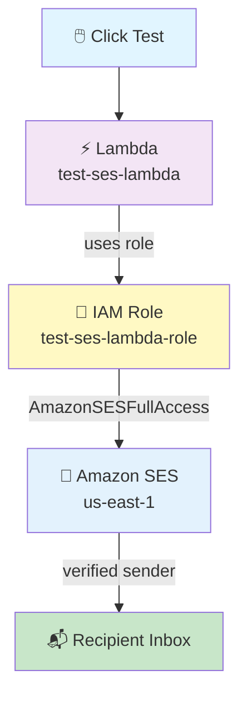

# Lambda → SES Email Pipeline

## Click Test on Lambda → Amazon SES Sends a Professional HTML Email

## 🎯 Goal

When you click **Test** on an AWS Lambda function, Lambda uses **Amazon SES** to send a **nice HTML email** to verified recipients.

```text
Test Click
     ↓
Lambda
     ↓
Amazon SES
     ↓
Recipient Inbox 📬
```

## 📋 What You Need Before Starting

- An AWS account (console access)
- One **verified sender email** (example: `kshitijjavir@outlook.com`)
- One or more **recipient emails** (example: `kshitijjavir110@gmail.com`)
- Region: **`us-east-1` (N. Virginia)** — keep everything in one region

> ⚠️ **SES Sandbox Rule:** In sandbox mode, **both the sender AND every recipient must be verified** in SES.

## 🗺️ Pipeline Overview



---

## 🥇 STEP 1: Create the IAM Role

**Go to:** IAM Console → **Roles** → **Create role**

| Field | Value |
|---|---|
| Trusted entity type | **AWS service** |
| Use case | **Lambda** |
| Role name | `test-ses-lambda-role` |

### Trust Policy (auto-created — keep it exactly like this)

```json
{
    "Version": "2012-10-17",
    "Statement": [
        {
            "Effect": "Allow",
            "Action": [
                "sts:AssumeRole"
            ],
            "Principal": {
                "Service": [
                    "lambda.amazonaws.com"
                ]
            }
        }
    ]
}
```

> ❌ Do **NOT** add `ses.amazonaws.com` to the trust policy. SES is **not** assuming your role — Lambda is.

---

## 🥈 STEP 2: Attach Managed Policies to the Role

Attach **both** of these AWS-managed policies:

| # | Managed Policy | Its Job |
|---|---|---|
| 1 | `AWSLambdaBasicExecutionRole` | Write logs to CloudWatch |
| 2 | `AmazonSESFullAccess` | Send emails using SES |

**Where:** IAM → Roles → `test-ses-lambda-role` → **Add permissions → Attach policies** → search and select both → **Attach**

> 💡 For production, do not use full SES access. Make a custom policy with only `ses:SendEmail` and limit it to your sender address.

---

## 🥉 STEP 3: Verify Emails in Amazon SES

**Go to:** SES Console (us-east-1) → **Configuration** → **Identities** → **Create identity**

Do this for **the sender and every recipient**:

| Field | Value |
|---|---|
| Identity type | **Email address** |
| Email address | `kshitijjavir@outlook.com` (sender) |
| Email address | `kshitijjavir110@gmail.com` (recipient #1) |
| Email address | *(any other recipient)* (recipient #2) |

**For each one:**

1. Click **Create identity**
2. Open that email inbox
3. Find the AWS verification email → click the verify link
4. Check the status shows **Verified** ✅ in the SES Identities list

**Target state:**

```
SES → Identities
┌────────────────────────────────┬───────────┐
│ kshitijjavir@outlook.com       │ Verified  │
│ kshitijjavir110@gmail.com      │ Verified  │
│ ...                            │ Verified  │
└────────────────────────────────┴───────────┘
```

---

## 🏅 STEP 4: Create the Lambda Function

**Go to:** Lambda Console (us-east-1) → **Create function**

| Field | Value |
|---|---|
| Option | **Author from scratch** |
| Function name | `test-ses-lambda` |
| Runtime | **Python 3.12** |
| Architecture | x86_64 |
| Execution role | **Use an existing role** → `test-ses-lambda-role` |

Click **Create function**.

### Check the Handler Settings

**Go to:** Lambda → **Configuration** → **General configuration** → **Edit**

| Field | Value |
|---|---|
| Handler | `lambda_function.lambda_handler` |
| Runtime | Python 3.12 |
| Timeout | 10 seconds |
| Memory | 128 MB |

---

## 🏆 STEP 5: Add the Code in Lambda

**Go to:** Lambda Console → `test-ses-lambda` → **Code** tab

You will see the inline code editor. Replace the default code with the code below.

> 📝 **Note:** This pipeline needs two files in real life (`lambda_function.py` + `email.html`). To keep it easy, we put the HTML **inside** the Python file as a string. That way you can paste it straight into the Lambda editor — **no zip upload needed**. ✅

### 📄 `lambda_function.py`

```python
import boto3

# ─── Configuration ────────────────────────────────────────────────────────────
REGION = "us-east-1"
SENDER = "kshitijjavir@outlook.com"

# Multiple recipients - as a list
RECIPIENTS = [
    "kshitijjavir110@gmail.com",
    # "kshitijjavir111@gmail.com",   # uncomment + verify in SES first
]

SUBJECT = "AWS Lambda Notification - SES Trigger Successful"

ses = boto3.client("ses", region_name=REGION)


# ─── HTML Email Template (embedded) ───────────────────────────────────────────
EMAIL_HTML = """<!DOCTYPE html>
<html>
<head>
  <meta charset="UTF-8">
  <meta name="viewport" content="width=device-width, initial-scale=1.0">
  <title>AWS Lambda Notification</title>
</head>
<body style="margin:0; padding:0; background-color:#f4f6f8;
             font-family: 'Segoe UI', Arial, sans-serif; color:#333333;">
  <table role="presentation" width="100%" cellspacing="0" cellpadding="0"
         style="background-color:#f4f6f8; padding:24px 0;">
    <tr>
      <td align="center">
        <table role="presentation" width="600" cellspacing="0" cellpadding="0"
               style="background:#ffffff; border-radius:8px; overflow:hidden;
                      box-shadow:0 2px 8px rgba(0,0,0,0.06);">

          <!-- Header -->
          <tr>
            <td style="background:#232f3e; padding:24px 32px;">
              <h1 style="margin:0; color:#ffffff; font-size:20px;
                         font-weight:600; letter-spacing:0.3px;">
                AWS Notification
              </h1>
              <p style="margin:4px 0 0; color:#d5dbdb; font-size:13px;">
                Automated message from AWS Lambda
              </p>
            </td>
          </tr>

          <!-- Body -->
          <tr>
            <td style="padding:32px;">
              <p style="margin:0 0 16px; font-size:15px; line-height:1.6;">
                Hello,
              </p>
              <p style="margin:0 0 24px; font-size:15px; line-height:1.6;">
                This is an automated notification confirming that your
                <strong>AWS Lambda</strong> function was triggered successfully
                and has dispatched this email through
                <strong>Amazon SES</strong>.
              </p>

              <!-- Status box -->
              <table role="presentation" width="100%" cellspacing="0"
                     cellpadding="0"
                     style="background:#e8f5e9; border-left:4px solid #2e7d32;
                            border-radius:4px; margin-bottom:24px;">
                <tr>
                  <td style="padding:16px 20px;">
                    <p style="margin:0; font-size:14px; color:#2e7d32;
                              font-weight:600;">
                      &#9989; Status: Lambda hit SES successfully
                    </p>
                  </td>
                </tr>
              </table>

              <!-- Details -->
              <h2 style="margin:0 0 12px; font-size:15px; color:#232f3e;
                         font-weight:600;">
                Execution Details
              </h2>
              <table role="presentation" width="100%" cellspacing="0"
                     cellpadding="0"
                     style="border:1px solid #e1e4e8; border-radius:6px;
                            font-size:14px;">
                <tr>
                  <td style="padding:10px 16px; background:#fafbfc;
                             border-bottom:1px solid #e1e4e8;
                             width:40%; color:#586069;">
                    Lambda Function
                  </td>
                  <td style="padding:10px 16px; border-bottom:1px solid #e1e4e8;">
                    test-ses-lambda
                  </td>
                </tr>
                <tr>
                  <td style="padding:10px 16px; background:#fafbfc;
                             border-bottom:1px solid #e1e4e8; color:#586069;">
                    AWS Region
                  </td>
                  <td style="padding:10px 16px; border-bottom:1px solid #e1e4e8;">
                    us-east-1 (N. Virginia)
                  </td>
                </tr>
                <tr>
                  <td style="padding:10px 16px; background:#fafbfc;
                             border-bottom:1px solid #e1e4e8; color:#586069;">
                    Service
                  </td>
                  <td style="padding:10px 16px; border-bottom:1px solid #e1e4e8;">
                    Amazon SES
                  </td>
                </tr>
                <tr>
                  <td style="padding:10px 16px; background:#fafbfc;
                             color:#586069;">
                    Trigger
                  </td>
                  <td style="padding:10px 16px;">Manual Test Invocation</td>
                </tr>
              </table>

              <p style="margin:24px 0 0; font-size:14px; color:#586069;
                        line-height:1.6;">
                No action is required. This message is sent for verification
                purposes only.
              </p>
            </td>
          </tr>

          <!-- Footer -->
          <tr>
            <td style="background:#fafbfc; padding:20px 32px;
                       border-top:1px solid #e1e4e8;">
              <p style="margin:0; font-size:12px; color:#8a94a0;
                        line-height:1.6;">
                This is an automated email generated by AWS Lambda and
                delivered via Amazon SES. Please do not reply to this message.
              </p>
              <p style="margin:8px 0 0; font-size:12px; color:#8a94a0;">
                &copy; 2026 &middot; Sent from us-east-1
              </p>
            </td>
          </tr>

        </table>
      </td>
    </tr>
  </table>
</body>
</html>
"""


# ─── Plain-text fallback ──────────────────────────────────────────────────────
EMAIL_TEXT = (
    "Hello,\n\n"
    "This is an automated notification confirming that your AWS Lambda "
    "function was triggered successfully and has dispatched this email "
    "through Amazon SES.\n\n"
    "STATUS: Lambda hit SES successfully\n\n"
    "EXECUTION DETAILS\n"
    "-----------------\n"
    "Lambda Function : test-ses-lambda\n"
    "AWS Region      : us-east-1 (N. Virginia)\n"
    "Service         : Amazon SES\n"
    "Trigger         : Manual Test Invocation\n\n"
    "No action is required. This message is sent for verification "
    "purposes only.\n\n"
    "--\n"
    "This is an automated email generated by AWS Lambda and delivered "
    "via Amazon SES.\n"
    "Please do not reply to this message.\n"
)


# ─── Handler ──────────────────────────────────────────────────────────────────
def lambda_handler(event, context):
    try:
        response = ses.send_email(
            Source=SENDER,
            Destination={"ToAddresses": RECIPIENTS},
            Message={
                "Subject": {
                    "Data": SUBJECT,
                    "Charset": "UTF-8"
                },
                "Body": {
                    "Text": {
                        "Data": EMAIL_TEXT,
                        "Charset": "UTF-8"
                    },
                    "Html": {
                        "Data": EMAIL_HTML,
                        "Charset": "UTF-8"
                    }
                }
            }
        )

        message_id = response["MessageId"]
        print(f"Email sent successfully! MessageId: {message_id}")

        return {
            "statusCode": 200,
            "body": f"Email sent! MessageId: {message_id}"
        }

    except Exception as e:
        print(f"Error sending email: {e}")
        raise
```

**After pasting the code:**

1. Click **Deploy** (top-right of the Code editor)
2. Wait for the green **"Successfully updated"** message

### 🔍 What the Code Does (Simple Version)

| Part | What It Does |
|------|--------------|
| `SENDER` | The verified sender email |
| `RECIPIENTS` | A **list** — you can send to more than one person |
| `SUBJECT` | The email subject |
| `EMAIL_HTML` | The nice HTML email (kept inside the Python file) |
| `EMAIL_TEXT` | A plain-text version for email apps that don't show HTML |
| `ses.send_email(...)` | Tells SES to send the email |
| `MessageId` | AWS's ID for that email — proof it was sent |

---

## 🏅 STEP 6: Test the Pipeline

**Go to:** Lambda Console → **Test** tab

1. Click **Create new event**
2. Event name: `test1`
3. Event body (leave as-is):

```json
{}
```

4. Click **Save**
5. Click **Test** (orange button)

### ✅ Expected Output (green success)

```text
Status: Succeeded
Response:
{
  "statusCode": 200,
  "body": "Email sent! MessageId: 010001a0..."
}
```

### 📜 CloudWatch Logs Should Show

```text
Email sent successfully! MessageId: 010001a0...
```

---

## 🏅 STEP 7: Check That the Email Arrived

Open each recipient inbox and check:

| Where to Look | Notes |
|---|---|
| ✅ Inbox | Primary inbox |
| ⚠️ Spam / Promotions | First SES emails often land here |
| 🔍 Search | `from:kshitijjavir@outlook.com` or `subject:AWS Lambda Notification` |

- **Subject:** `AWS Lambda Notification - SES Trigger Successful`
- **Sender:** `kshitijjavir@outlook.com via amazonses.com`

### If the Email Is in Spam

Click **"Report as not spam"** → future emails should go to the Inbox. ✅

---

## 📊 Final Summary Table

| Item | Value |
|---|---|
| **Region** | `us-east-1` |
| **IAM Role** | `test-ses-lambda-role` |
| **Trust Policy** | `lambda.amazonaws.com` |
| **Managed Policy 1** | `AWSLambdaBasicExecutionRole` |
| **Managed Policy 2** | `AmazonSESFullAccess` |
| **Lambda Function** | `test-ses-lambda` |
| **Runtime** | Python 3.12 |
| **Handler** | `lambda_function.lambda_handler` |
| **SES Sender** | Verified email |
| **SES Recipients** | All verified (sandbox rule) |
| **Trigger** | Manual Test |
| **Result** | HTML email delivered |

---

## 🧩 Full Step List (Quick Reference)

| Step | What to Do |
|------|-----------|
| 1 | IAM → Roles → Create role → AWS service → **Lambda** |
| 2 | Role name: `test-ses-lambda-role` (keep trust policy as-is) |
| 3 | Attach `AWSLambdaBasicExecutionRole` + `AmazonSESFullAccess` |
| 4 | SES → Identities → Create identity for **sender** and **each recipient** |
| 5 | Click the verify link in each inbox → status must be **Verified** |
| 6 | Lambda → Create function → `test-ses-lambda`, Python 3.12 |
| 7 | Execution role: use existing → `test-ses-lambda-role` |
| 8 | Check handler: `lambda_function.lambda_handler` |
| 9 | Paste the Python code (HTML is inside it) → **Deploy** |
| 10 | Test tab → create event `test1` with body `{}` → **Test** |
| 11 | See `statusCode: 200` and a `MessageId` ✅ |
| 12 | Open the recipient inbox → check Inbox and Spam |
| 13 | If in Spam → click "Report as not spam" |

---

## ⚠️ Important Points to Remember

| Point | Why It Matters |
|-------|----------------|
| **Sandbox mode** | Sender AND all recipients must be verified, or SES refuses to send |
| **`ses.amazonaws.com` in trust policy** | ❌ Not needed — SES does not assume your role, Lambda does |
| **Region must match** | SES identities, Lambda, and the code's region should all be `us-east-1` |
| **Verify first, send later** | New identities cannot send until the link is clicked |
| **Check Spam** | First emails from a new SES sender often go to Spam |
| **HTML inside Python** | Keeps it simple — no zip file upload needed |
| **Production** | Replace `AmazonSESFullAccess` with a small custom `ses:SendEmail` policy |

---

## 🎤 Interview Explanation

**Q: "Explain your Lambda to SES email pipeline."**

> **"I created an IAM role for Lambda with the AWSLambdaBasicExecutionRole policy for CloudWatch logging and the AmazonSESFullAccess policy for sending email. In Amazon SES, I verified the sender email and all recipient emails, because SES is in sandbox mode. Then I created a Python 3.12 Lambda function that uses boto3 to call SES send_email. The email has an HTML body and a plain-text fallback. When I run the function with a test event, SES sends the email and returns a MessageId, which I can see in the response and in CloudWatch Logs. The recipient receives a formatted HTML email from the verified sender."**

---

## Summary

| Component | What It Does |
|-----------|--------------|
| **IAM Role** (`test-ses-lambda-role`) | Lets Lambda write logs and send email through SES |
| **SES Identities** | Verified sender + verified recipients (sandbox rule) |
| **Lambda** (`test-ses-lambda`) | Builds the email and calls `ses.send_email` |
| **Amazon SES** | Actually sends the email |
| **CloudWatch Logs** | Shows the `MessageId` proof |
| **Recipient Inbox** | Where the HTML email arrives 📬 |

This pipeline shows how **Lambda can send real emails** using Amazon SES — a common pattern for alerts, reports, and notifications.
