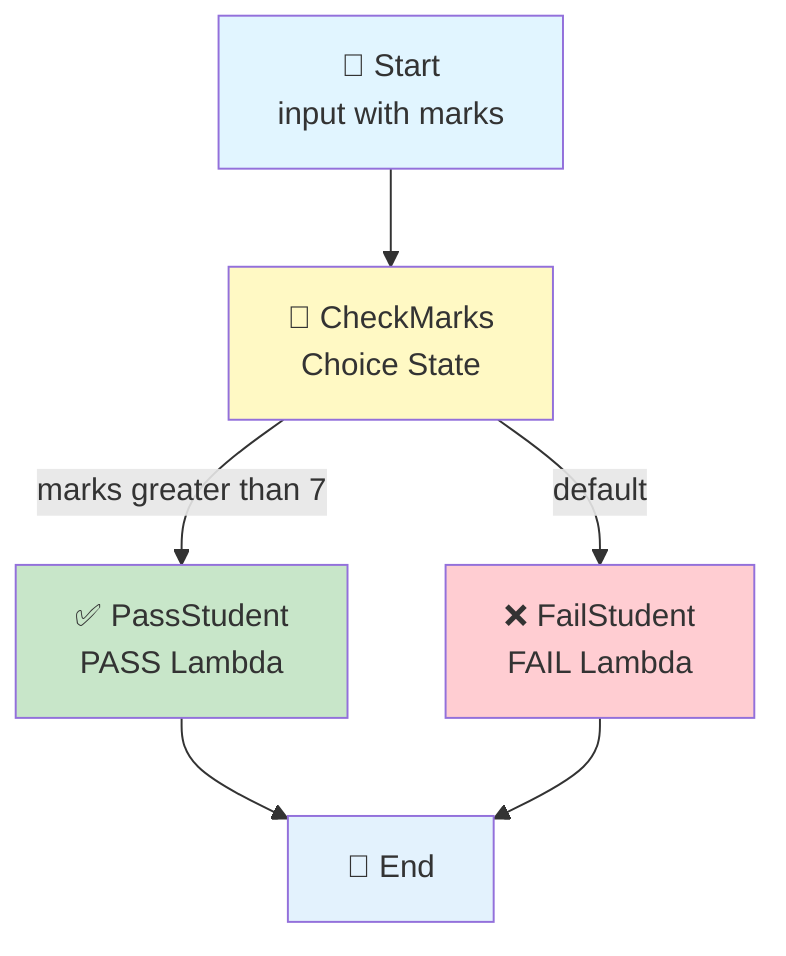

# Step Functions → Choice State → Lambda (Pass or Fail)

## Step Functions Decides Which Lambda to Run

## 🎯 Goal

We want a Step Functions workflow that **looks at a student's marks** and then sends the work to **one of two Lambda functions**:

```text
Marks > 7  → PASS Lambda → "student passed"
Marks ≤ 7  → FAIL Lambda → "student failed"
```

So there are **two Lambda functions**, but only **one of them runs** each time.

The full flow:

```text
Step Functions
      ↓
  Choice State
   (check marks)
      ↓
  ┌───┴────┐
  ↓        ↓
PASS      FAIL
Lambda    Lambda
  ↓        ↓
Done      Done
```

## 🤔 What Is a Choice State?

A **Choice state** is a Step Functions state that asks a question and goes to a different path based on the answer.

Think of it like an `if / else` in normal programming:

```python
if marks > 7:
    # PASS path
else:
    # FAIL path
```

In Step Functions, it looks like this:

```text
Choice State
     ↓
"Is marks greater than 7?"
     ↓
YES → PassStudent
NO  → FailStudent
```

This is the **first branch in a workflow** we have built — earlier pipelines just ran straight from one step to the next.

## 🏆 Why Use This?

| Without Choice State | With Choice State |
|----------------------|-------------------|
| Everything must run in one line | Workflow can split into paths |
| Lambda must decide everything | Step Functions decides the path |
| Hard to see the logic | The decision is visible in the workflow diagram |
| One Lambda does all the work | Each Lambda does one clear job |

**Main idea:** Step Functions makes the decision. Lambda just does the small job it is given.

## Architecture



---

## 📦 What We Need to Create

| No. | AWS Service | Resource |
|-----|-------------|----------|
| 1 | IAM | One role for both Step Functions and Lambda |
| 2 | Lambda | `pass-lambda` |
| 3 | Lambda | `fail-lambda` |
| 4 | Step Functions | `student-result-workflow` |
| 5 | CloudWatch | Logs for both Lambdas |

---

## 🔐 Step 1: Create the IAM Role

We use **only ONE IAM role**, and both Step Functions and Lambda will share it.

### 📍 Go to: IAM Console → Roles → Create role → **Custom trust policy**

### Role Name

```text
stepfunctions-choice-demo-role
```

### Trust Policy

```json
{
    "Version": "2012-10-17",
    "Statement": [
        {
            "Sid": "",
            "Effect": "Allow",
            "Principal": {
                "Service": [
                    "states.amazonaws.com",
                    "lambda.amazonaws.com"
                ]
            },
            "Action": "sts:AssumeRole"
        }
    ]
}
```

### 🧠 What This Trust Policy Means

This allows **two services** to use this role:

| Service | Why |
|---------|-----|
| `states.amazonaws.com` | So **Step Functions** can invoke the Lambdas |
| `lambda.amazonaws.com` | So **Lambda** can run and write logs |

> 💡 The trust policy is the **door**. The policies below are **what you can do after entering**.

### Attach Managed Policies

| # | Managed Policy | Its Job |
|---|----------------|---------|
| 1 | `AWSLambdaBasicExecutionRole` | Lets Lambda write logs to CloudWatch |
| 2 | `AWSLambdaRole` | Lets Step Functions invoke Lambda |

Click **Create role**.

---

## 🐍 Step 2: Create the PASS Lambda

### 📍 Go to: Lambda Console → Functions → Create function → **Author from scratch**

| Field | Value |
|-------|-------|
| Function name | `pass-lambda` |
| Runtime | Python 3.x (select latest available) |
| Execution role | **Use an existing role** → `stepfunctions-choice-demo-role` |

Click **Create function**.

### 💻 PASS Lambda Code

Open the function → **Code** → **Code source**. Replace the code with:

```python
def lambda_handler(event, context):

    print("========== PASS LAMBDA STARTED ==========")

    print(f"Received event: {event}")

    student = event["student"]
    marks = event["marks"]

    print(f"Student Name : {student}")
    print(f"Student Marks: {marks}")

    print(f"Checking PASS condition...")
    print(f"Marks received = {marks}")

    print(f"Student {student} has PASSED.")

    result = {
        "student": student,
        "status": "PASS",
        "message": f"{student} passed with {marks} marks"
    }

    print(f"Returning result: {result}")

    print("========== PASS LAMBDA FINISHED ==========")

    return result
```

Click **Deploy**.

---

## 🐍 Step 3: Create the FAIL Lambda

Same steps as above, but a different name and code.

| Field | Value |
|-------|-------|
| Function name | `fail-lambda` |
| Runtime | Python 3.x |
| Execution role | **Use an existing role** → `stepfunctions-choice-demo-role` |

### 💻 FAIL Lambda Code

```python
def lambda_handler(event, context):

    print("========== FAIL LAMBDA STARTED ==========")

    print(f"Received event: {event}")

    student = event["student"]
    marks = event["marks"]

    print(f"Student Name : {student}")
    print(f"Student Marks: {marks}")

    print(f"Checking PASS condition...")
    print(f"Marks received = {marks}")

    print(f"Student {student} has FAILED.")

    result = {
        "student": student,
        "status": "FAIL",
        "message": f"{student} failed with {marks} marks"
    }

    print(f"Returning result: {result}")

    print("========== FAIL LAMBDA FINISHED ==========")

    return result
```

Click **Deploy**.

### 🔍 What Both Lambdas Do

| Step | What Happens |
|------|--------------|
| 1 | Read the event (the input from Step Functions) |
| 2 | Take `student` and `marks` out of the event |
| 3 | Print the details to CloudWatch |
| 4 | Print the result message (PASS or FAIL) |
| 5 | Return a `result` dictionary back to Step Functions |

> ⚠️ Notice: **neither Lambda checks the marks**. Step Functions already decided the path. Each Lambda just reports its own result. This keeps each function small and simple. ✅

---

## 🔗 Step 4: Get Both Lambda ARNs

You need the ARN of each Lambda for the Step Functions code.

### 📍 Go to: Lambda → `pass-lambda` → **copy the ARN** at the top right

It looks like:

```text
arn:aws:lambda:us-east-1:123456789012:function:pass-lambda
```

Do the same for `fail-lambda`:

```text
arn:aws:lambda:us-east-1:123456789012:function:fail-lambda
```

> 📌 Keep both ARNs ready — you paste them in the next step.
> The part that changes is only the last piece: `pass-lambda` vs `fail-lambda`.

---

## 🛠️ Step 5: Create the Step Functions State Machine

### 📍 Go to: Step Functions Console → State machines → Create state machine

| Field | Value |
|-------|-------|
| Option | **Write your workflow in code** |
| Type | **Standard** |
| Name | `student-result-workflow` |
| Execution role | **Use an existing role** → `stepfunctions-choice-demo-role` |

### 📝 State Machine Code

```json
{
  "StartAt": "CheckMarks",
  "States": {
    "CheckMarks": {
      "Type": "Choice",
      "Choices": [
        {
          "Variable": "$.marks",
          "NumericGreaterThan": 7,
          "Next": "PassStudent"
        }
      ],
      "Default": "FailStudent"
    },
    "PassStudent": {
      "Type": "Task",
      "Resource": "LAMBDA PASS ARN",
      "End": true
    },
    "FailStudent": {
      "Type": "Task",
      "Resource": "LAMBDA FAIL ARN",
      "End": true
    }
  }
}
```

> ⚠️ **Replace** `LAMBDA PASS ARN` and `LAMBDA FAIL ARN` with your real Lambda ARNs (with the quotes kept).

### ✅ After Replacing the ARNs

```json
{
  "StartAt": "CheckMarks",
  "States": {
    "CheckMarks": {
      "Type": "Choice",
      "Choices": [
        {
          "Variable": "$.marks",
          "NumericGreaterThan": 7,
          "Next": "PassStudent"
        }
      ],
      "Default": "FailStudent"
    },
    "PassStudent": {
      "Type": "Task",
      "Resource": "arn:aws:lambda:us-east-1:123456789012:function:pass-lambda",
      "End": true
    },
    "FailStudent": {
      "Type": "Task",
      "Resource": "arn:aws:lambda:us-east-1:123456789012:function:fail-lambda",
      "End": true
    }
  }
}
```

Click **Create**.

---

## 🧠 Understand the State Machine (Line by Line)

### `StartAt: CheckMarks`

```text
The workflow starts at the CheckMarks state.
```

### The Choice State

```json
"CheckMarks": {
  "Type": "Choice",
  "Choices": [
    {
      "Variable": "$.marks",
      "NumericGreaterThan": 7,
      "Next": "PassStudent"
    }
  ],
  "Default": "FailStudent"
}
```

| Part | What It Means |
|------|---------------|
| `"Type": "Choice"` | This state makes a decision |
| `"Variable": "$.marks"` | Look at the `marks` value in the input |
| `"NumericGreaterThan": 7` | Is that number **greater than 7**? |
| `"Next": "PassStudent"` | If YES → go to the PASS Lambda |
| `"Default": "FailStudent"` | If NO → go to the FAIL Lambda |

> 📌 `$.marks` is **JSONPath**. The `$.` means "from the top of the input".

### The Two Task States

| State | Runs | Ends |
|-------|------|------|
| `PassStudent` | PASS Lambda | ✅ Yes |
| `FailStudent` | FAIL Lambda | ✅ Yes |

`"End": true` means the workflow finishes after that Lambda returns.

> 💡 **Only one path runs.** If marks are greater than 7, the FAIL Lambda is never called at all.

---

## 📥 Understand the Input

Step Functions needs an input with two values: `student` and `marks`.

```json
{
  "student": "Kshitij",
  "marks": 9
}
```

Then:

```text
$.student = "Kshitij"
$.marks   = 9
```

The Choice state looks only at `$.marks`.

### 🧠 The Rule

| Marks | Path | Which Lambda Runs |
|-------|------|-------------------|
| 8, 9, 10 | `marks > 7` is TRUE | ✅ PASS Lambda |
| 7 | `marks > 7` is FALSE | ❌ FAIL Lambda |
| 5, 6 | `marks > 7` is FALSE | ❌ FAIL Lambda |

> ⚠️ **Very important:** the check is **greater than 7**, not "greater than or equal to 7".
> So marks = **7 goes to FAIL**. Many people get this wrong!

---

## ▶️ Step 6: Test with a PASS Case

### 📍 Go to: Step Functions → `student-result-workflow` → **Start execution**

Input:

```json
{
  "student": "Kshitij",
  "marks": 9
}
```

Click **Start execution**.

### 🔄 What Happens

```text
Step Functions
     ↓
CheckMarks
     ↓
"Is 9 > 7?"
     ↓
YES
     ↓
PassStudent
     ↓
PASS Lambda runs
     ↓
Returns:
{
  "student": "Kshitij",
  "status": "PASS",
  "message": "Kshitij passed with 9 marks"
}
     ↓
Workflow Succeeded ✅
```

### 🖼️ What the Diagram Shows

```text
CheckMarks ✅
     ↓
PassStudent ✅
     ↓
(picture of the green path lighting up)
```

> 📌 The **FailStudent** box stays grey — it was skipped. This is the best part of a Choice state: you can *see* which path was taken.

---

## ▶️ Step 7: Test with a FAIL Case

Start a new execution with:

```json
{
  "student": "Rahul",
  "marks": 4
}
```

### 🔄 What Happens

```text
CheckMarks
     ↓
"Is 4 > 7?"
     ↓
NO
     ↓
FailStudent (the Default path)
     ↓
FAIL Lambda runs
     ↓
Returns:
{
  "student": "Rahul",
  "status": "FAIL",
  "message": "Rahul failed with 4 marks"
}
```

Now the **PassStudent** box stays grey instead. ✅

---

## ▶️ Step 8: Test the Edge Case (marks = 7)

Run one more time with:

```json
{
  "student": "Priya",
  "marks": 7
}
```

**Result:**

```text
"Is 7 > 7?"  →  NO
        ↓
FailStudent path
```

Because `NumericGreaterThan: 7` means **strictly greater**, 7 does **not** pass.

> 💡 If you wanted 7 to pass, you would change the condition to `"NumericGreaterThanEquals": 7`.

---

## ☁️ Step 9: Check CloudWatch Logs

### PASS Lambda

Go to: **Lambda** → `pass-lambda` → **Monitor** → **View CloudWatch logs**

You should see:

```text
========== PASS LAMBDA STARTED ==========
Received event: {'student': 'Kshitij', 'marks': 9}
Student Name : Kshitij
Student Marks: 9
Checking PASS condition...
Marks received = 9
Student Kshitij has PASSED.
Returning result: {'student': 'Kshitij', 'status': 'PASS', 'message': 'Kshitij passed with 9 marks'}
========== PASS LAMBDA FINISHED ==========
```

### FAIL Lambda

Go to: **Lambda** → `fail-lambda` → **Monitor** → **View CloudWatch logs**

You should see:

```text
========== FAIL LAMBDA STARTED ==========
Received event: {'student': 'Rahul', 'marks': 4}
Student Name : Rahul
Student Marks: 4
Checking PASS condition...
Marks received = 4
Student Rahul has FAILED.
Returning result: {'student': 'Rahul', 'status': 'FAIL', 'message': 'Rahul failed with 4 marks'}
========== FAIL LAMBDA FINISHED ==========
```

> 📌 For the `marks = 9` run, the FAIL Lambda log will have **no new entry** — because it never ran. This proves the branching works. ✅

---

## 🧪 Expected Results

| Input | Path Taken | Lambda That Ran | Status |
|-------|-----------|-----------------|--------|
| `{"student": "Kshitij", "marks": 9}` | PassStudent | `pass-lambda` | PASS |
| `{"student": "Rahul", "marks": 4}` | FailStudent | `fail-lambda` | FAIL |
| `{"student": "Priya", "marks": 7}` | FailStudent | `fail-lambda` | FAIL |

---

## ⚠️ Common Mistakes

| Mistake | What Happens | Fix |
|---------|--------------|-----|
| Wrong Lambda ARN | Execution fails with `ResourceNotFoundException` | Copy the ARN again from the Lambda page |
| ARN without quotes | Step Functions code will not save | Keep the `" "` around the ARN |
| `marks` spelled wrong in the input | Execution fails — `$.marks` not found | Input must have exactly `"marks"` |
| Marks sent as text `"9"` | Numeric comparison fails | Send a **number**, not a string |
| Missing `Default` | Input that fails the check has nowhere to go | Always keep the `Default` path |
| Thinking 7 is a pass | 7 goes to FAIL | Rule is **greater than 7** |

---

## 🧩 Full Step List (Quick Reference)

| Step | What to Do |
|------|-----------|
| 1 | IAM → Roles → Create role → **Custom trust policy** |
| 2 | Paste the trust policy with `states.amazonaws.com` + `lambda.amazonaws.com` |
| 3 | Attach `AWSLambdaBasicExecutionRole` + `AWSLambdaRole` |
| 4 | Role name: `stepfunctions-choice-demo-role` |
| 5 | Lambda → Create function → `pass-lambda` (Python 3.x, existing role) |
| 6 | Paste the PASS code → **Deploy** |
| 7 | Lambda → Create function → `fail-lambda` (same role) |
| 8 | Paste the FAIL code → **Deploy** |
| 9 | Copy both Lambda ARNs |
| 10 | Step Functions → State machines → Create state machine |
| 11 | Choose **Write your workflow in code** → type **Standard** |
| 12 | Name: `student-result-workflow` |
| 13 | Paste the state machine code and replace both ARNs |
| 14 | Execution role: use existing → `stepfunctions-choice-demo-role` |
| 15 | Create the state machine |
| 16 | Start execution with `{"student": "Kshitij", "marks": 9}` → PASS path |
| 17 | Start execution with `{"student": "Rahul", "marks": 4}` → FAIL path |
| 18 | Check both Lambda logs in CloudWatch |
| 19 | See the green path in the workflow diagram ✅ |

---

## 🎤 Interview Explanation

**Q: "Explain your Step Functions Choice state pipeline."**

> **"I created a Step Functions workflow that branches based on a value. The workflow starts with a Choice state called CheckMarks that reads the marks value from the input using JSONPath. If marks are greater than 7, it goes to the PassStudent state which invokes a pass-lambda function. Otherwise the default path sends the work to a fail-lambda function. Only one Lambda runs on each execution. Each Lambda reads the student name and marks from the event, prints them, and returns a result with the status. I used a single IAM role shared by Step Functions and Lambda, with a trust policy that allows both states.amazonaws.com and lambda.amazonaws.com to assume the role. Step Functions handles the decision logic, so the Lambda functions stay small and simple."**

---

## ⭐ One-Line Summary

```text
Step Functions
      ↓
CheckMarks (Choice State)
      ↓
"Is marks > 7?"
      ↓
  ┌───┴────┐
  ↓        ↓
PASS      FAIL
Lambda    Lambda
```

> **Main purpose: Step Functions checks the marks and picks ONE Lambda to run — PASS or FAIL. The decision lives in the workflow, not in the Lambda code.**

---

## 🆚 Choice State vs the Pipelines Before

| Pipeline | What Chooses the Path |
|----------|-----------------------|
| S3 → Lambda | Nothing — the file upload triggers it |
| EventBridge rate/cron → Lambda | Time |
| S3 → EventBridge → Lambda | The event pattern (a filter) |
| **Step Functions Choice** | **A value in the data (a decision)** |

The Choice state is the first one where the workflow **thinks** about the data before deciding what to do.

---

## Summary

| Component | What It Does |
|-----------|--------------|
| **IAM Role** (`stepfunctions-choice-demo-role`) | One role for both services — trust allows `states.amazonaws.com` + `lambda.amazonaws.com` |
| **PASS Lambda** (`pass-lambda`) | Prints the student passed and returns `status: PASS` |
| **FAIL Lambda** (`fail-lambda`) | Prints the student failed and returns `status: FAIL` |
| **Step Functions** (`student-result-workflow`) | Choice state checks marks, then runs **one** Lambda |
| **CloudWatch Logs** | Shows which Lambda ran and what it returned |

This pipeline shows how **Step Functions makes decisions**, so your workflow can take different paths for different data — the building block for real approval, validation, and routing workflows.
