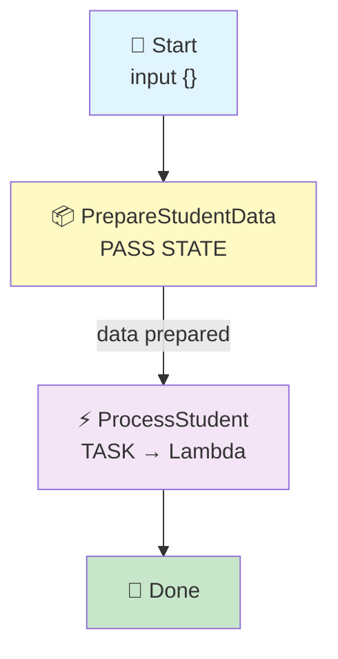
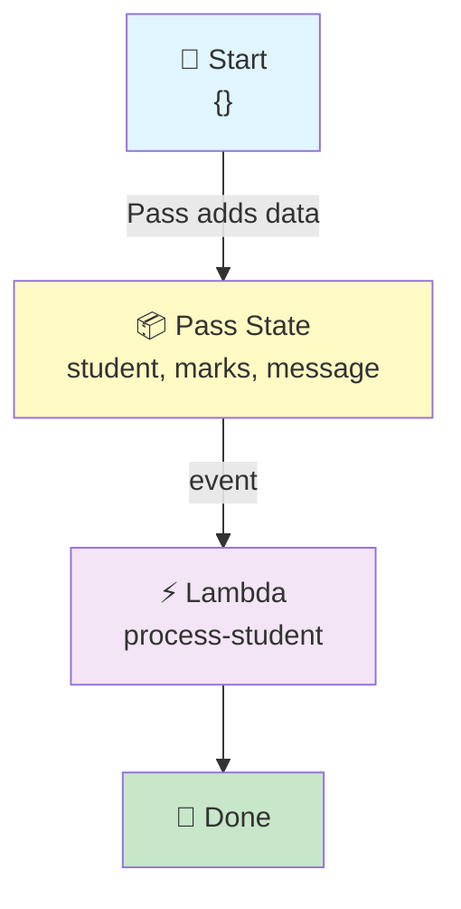

# Step Functions → Pass State → Lambda

## Pass State Prepares the Data, Then Lambda Uses It

## 🎯 Goal

We want to understand the **Pass State**.

Our pipeline:

```text
Step Functions
      ↓
   Pass State
      ↓
    Lambda
      ↓
     Done
```

### Simple meaning

> **Pass State = Prepare or pass data.**

It does **not** call Lambda. It does **not** call Glue.

It only works with **data** and sends that data to the next step.

## 🧠 What Is a Pass State?

Think of a Pass State like a **middle box**:

```text
Input
  ↓
Pass
  ↓
Output
```

It receives data. It can add or change data. Then it sends the data to the next state.

> **Easy keyword: Pass = pass data to the next step.**

## Architecture



---

## 📦 What We Need

| Service | What We Create |
| ------- | -------------- |
| IAM | Role |
| Lambda | `process-student` |
| Step Functions | `student-pass-workflow` |
| CloudWatch | Lambda logs |

## 🔐 IAM Role

We use **ONE IAM role**, and both Step Functions and Lambda share it.

### 📍 Go to: IAM Console → Roles → Create role → **Custom trust policy**

### Role Name

```text
stepfunctions-pass-demo-role
```

### Trust Policy

```json
{
    "Version": "2012-10-17",
    "Statement": [
        {
            "Sid": "",
            "Effect": "Allow",
            "Principal": {
                "Service": [
                    "states.amazonaws.com",
                    "lambda.amazonaws.com"
                ]
            },
            "Action": "sts:AssumeRole"
        }
    ]
}
```

### 🧠 What This Trust Policy Means

| Service | Why It Is There |
|---------|-----------------|
| `states.amazonaws.com` | So **Step Functions** can invoke the Lambda |
| `lambda.amazonaws.com` | So **Lambda** can run and write its logs |

> 💡 The trust policy is the **door**. The managed policies below are **what you can do after entering**.

### Attach Managed Policies

| # | Managed Policy | Its Job |
|---|----------------|---------|
| 1 | `AWSLambdaBasicExecutionRole` | Lets Lambda write logs to CloudWatch |
| 2 | `AWSLambdaRole` | Lets Step Functions invoke Lambda |

Click **Create role**.

> 💡 **Already built an earlier pipeline?** You can reuse that role instead of making a new one — just choose it from the *Use an existing role* dropdown in the next step.

---

## 🐍 Step 1: Create the Lambda

1. Go to **Lambda Console** → **Functions** → **Create function**
2. Choose: **Author from scratch**

| Setting | Value |
|---------|-------|
| Function name | `process-student` |
| Runtime | Python 3.x (select latest available) |
| Execution role | Use an existing role → `stepfunctions-pass-demo-role` |

Click **Create function**.

### 💻 Lambda Code

Open the function → **Code** → **Code source**. Replace the code with:

```python
def lambda_handler(event, context):

    print("========== LAMBDA STARTED ==========")

    print(f"Received event: {event}")

    student = event["student"]
    marks = event["marks"]
    message = event["message"]

    print(f"Student Name : {student}")
    print(f"Student Marks: {marks}")
    print(f"Message      : {message}")

    result = {
        "student": student,
        "marks": marks,
        "status": "PROCESSED",
        "message": "Student processing completed"
    }

    print(f"Returning result: {result}")

    print("========== LAMBDA FINISHED ==========")

    return result
```

Click **Deploy**.

> ⚠️ This Lambda reads **three** values from the event: `student`, `marks`, and `message`. So the event must have all three — and that is exactly what our Pass State creates. ✅

---

## 🛠️ Step 2: Create the Step Functions State Machine

1. Go to **Step Functions Console** → **State machines** → **Create state machine**
2. Choose: **Write your workflow in code**
3. Type: **Standard**

| Setting | Value |
|---------|-------|
| Name | `student-pass-workflow` |
| Execution role | Use an existing role → `stepfunctions-pass-demo-role` |

### 📝 State Machine Code

```json
{
  "StartAt": "PrepareStudentData",
  "States": {

    "PrepareStudentData": {
      "Type": "Pass",
      "Result": {
        "student": "Kshitij",
        "marks": 9,
        "message": "Data prepared by Pass State"
      },
      "Next": "ProcessStudent"
    },

    "ProcessStudent": {
      "Type": "Task",
      "Resource": "YOUR_LAMBDA_ARN",
      "End": true
    }
  }
}
```

> ⚠️ Replace `YOUR_LAMBDA_ARN` with your real Lambda ARN. Example:

```text
arn:aws:lambda:us-east-1:123456789012:function:process-student
```

Click **Create**.

---

## 🧠 Understand This Code

Don't try to remember the whole JSON. Just understand these five parts:

### 1. StartAt

```json
"StartAt": "PrepareStudentData"
```

> Start from `PrepareStudentData`.

### 2. Type Pass

```json
"Type": "Pass"
```

> This state is a **Pass** state — it only handles data, it does not call anything.

### 3. Result

```json
"Result": {
  "student": "Kshitij",
  "marks": 9,
  "message": "Data prepared by Pass State"
}
```

> The Pass state **creates this data** by itself. Nothing is called. No Lambda, no Glue — just data.

### 4. Next

```json
"Next": "ProcessStudent"
```

> After the Pass state, go to `ProcessStudent`.

### 5. Task

```json
"Type": "Task"
```

> A Task state **calls something**. Here it calls our Lambda.

---

## 📥 Step 3: Start an Execution

This is the important part. 👇

You **do not need to pass** `student` or `marks` from the Start Execution screen.

You can simply use:

```json
{}
```

Then click **Start execution**.

**Why?** Because the **Pass State creates the data itself**. So the input can be empty. ✅

### 🔄 What Happens?

You start with:

```json
{}
```

```text
        START
          ↓
         {}
          ↓
    ┌─────────────┐
    │     PASS    │
    │    STATE    │
    └──────┬──────┘
           ↓
```

The Pass state creates:

```json
{
  "student": "Kshitij",
  "marks": 9,
  "message": "Data prepared by Pass State"
}
```

Then:

```text
           ↓
       Lambda
           ↓
         Done
```



---

## 📌 What Does Lambda Receive?

Lambda receives exactly what the Pass state created:

```json
{
  "student": "Kshitij",
  "marks": 9,
  "message": "Data prepared by Pass State"
}
```

So Lambda prints:

```text
========== LAMBDA STARTED ==========

Received event:
{
    'student': 'Kshitij',
    'marks': 9,
    'message': 'Data prepared by Pass State'
}

Student Name : Kshitij
Student Marks: 9
Message      : Data prepared by Pass State

Returning result:
{
    'student': 'Kshitij',
    'marks': 9,
    'status': 'PROCESSED',
    'message': 'Student processing completed'
}

========== LAMBDA FINISHED ==========
```

You can see these logs in **CloudWatch**:

**Lambda** → `process-student` → **Monitor** → **View CloudWatch logs**

> 📌 Notice that the Pass state data has `"message": "Data prepared by Pass State"` and Lambda returns a **different** message: `"Student processing completed"`. This helps you see clearly which part made which data. ✅

---

## ⭐ Most Important Concept

There are **two different things** happening in this pipeline:

### Pass State

```text
Prepare data
     ↓
Pass data
```

### Task State

```text
Call Lambda
```

So:

```text
Step Functions
      ↓
     PASS
      ↓
 "Here is the data"
      ↓
     TASK
      ↓
 "Call Lambda"
      ↓
    Lambda
```

> **Pass = DATA. Task = ACTION.** Two separate jobs.

---

## 🆚 Choice vs Pass

Compare this with your previous pipeline:

### Choice (folder 01)

```text
Choice
   ↓
Check condition
   ↓
YES → Lambda A
NO  → Lambda B
```

> **Choice = DECISION**
> Example: `marks > 7 ?`

### Pass (this pipeline)

```text
Pass
  ↓
Prepare / pass data
  ↓
Lambda
```

> **Pass = DATA**

---

## 🧠 Easy Way to Remember All Three

| State | Easy Meaning |
| ----- | ------------ |
| **Pass** | Pass / prepare data |
| **Choice** | Make a decision |
| **Task** | Do / call something |

Remember:

```text
PASS   → DATA
CHOICE → DECISION
TASK   → ACTION
```

That's the main thing you need to understand for these three states. ✅

---

## 📊 State Comparison Table

| Question | Pass | Choice | Task |
|----------|------|--------|------|
| Does it call anything? | ❌ No | ❌ No | ✅ Yes |
| What does it do? | Makes / changes data | Picks a path | Runs something |
| Needs a `Resource`? | ❌ No | ❌ No | ✅ Yes (Lambda ARN) |
| Can it end the workflow? | ✅ Yes | ✅ Yes | ✅ Yes |
| Goes to next state? | ✅ `Next` | ✅ `Next` | ✅ `Next` or `End` |

---

## 🧪 Expected Result

| Input You Give | What Pass Creates | What Lambda Prints |
|----------------|-------------------|--------------------|
| `{}` | student, marks, message | Kshitij / 9 / Data prepared by Pass State |
| `{}` | Same every time | Same every time |

> 💡 Because the data is **fixed inside the Pass state**, every run produces the **same output**. That is the point of this pipeline — it shows that a Pass state can create data without calling anything.

---

## ⚠️ Common Mistakes

| Mistake | What Happens | Fix |
|---------|--------------|-----|
| Lambda ARN left as `YOUR_LAMBDA_ARN` | Execution fails | Paste your real ARN |
| ARN without quotes | Code will not save | Keep the `" "` around the ARN |
| Lambda code reads `event["message"]` but Pass has no `message` | `KeyError` in Lambda | Make sure the Pass `Result` has all three keys |
| Passing `{}` and expecting Lambda to fail | Lambda works fine | The Pass state supplies the data — that is the whole idea |
| Confusing Pass with Task | You expect Lambda to run in the Pass state | Pass never calls anything — Task does that |

---

## 🧩 Full Step List (Quick Reference)

| Step | What to Do |
|------|-----------|
| 1 | IAM → Roles → Create role → **Custom trust policy** |
| 2 | Paste the trust policy, attach `AWSLambdaBasicExecutionRole` + `AWSLambdaRole` |
| 3 | Role name: `stepfunctions-pass-demo-role` |
| 4 | Lambda → Create function → `process-student` (Python 3.x) |
| 5 | Execution role: existing → `stepfunctions-pass-demo-role` |
| 6 | Paste the Lambda code → **Deploy** |
| 7 | Copy the Lambda ARN |
| 8 | Step Functions → State machines → Create state machine |
| 9 | Choose **Write your workflow in code** → type **Standard** |
| 10 | Name: `student-pass-workflow` |
| 11 | Paste the state machine code and replace `YOUR_LAMBDA_ARN` |
| 12 | Execution role: existing → `stepfunctions-pass-demo-role` |
| 13 | Create the state machine |
| 14 | Start execution with input `{}` |
| 15 | The Pass state creates student / marks / message |
| 16 | The Task state calls `process-student` |
| 17 | Check CloudWatch logs → see the prepared data arrive |
| 18 | Workflow shows **Succeeded** ✅ |

---

## 🎤 Interview Explanation

**Q: "What is a Pass state in Step Functions?"**

> **"A Pass state is used to pass data to the next state. It does not call any service, and it does not perform work. In my pipeline, the workflow starts with a Pass state that creates student data — a student name, marks, and a message. That data is then passed to a Task state, which invokes a Lambda function. The Lambda reads the values that the Pass state prepared and returns a processed result. I started the execution with an empty input because the Pass state supplies the data itself. This shows the difference between a Pass state, which handles data, and a Task state, which performs an action."**

---

## ⭐ One-Line Summary

```text
Step Functions
      ↓
   Pass State        ← makes the data
      ↓
   Task State        ← calls Lambda
      ↓
    Lambda
      ↓
     Done
```

> **Main purpose: show that a Pass state prepares and passes data, and a Task state is the one that actually calls Lambda.**

---

## Summary

| Component | What It Does |
|-----------|--------------|
| **Pass State** (`PrepareStudentData`) | Creates the student data — calls nothing |
| **Task State** (`ProcessStudent`) | Calls the Lambda function |
| **Lambda** (`process-student`) | Reads the prepared data and returns a processed result |
| **CloudWatch Logs** | Shows what Lambda received from the Pass state |

This pipeline shows the **Pass state = DATA** idea — a small but important building block you will use later to shape data before sending it to other services.
