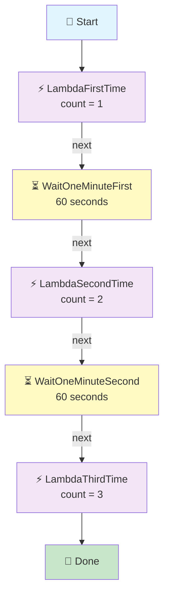

# Step Functions → Wait State → Lambda

## The Same Lambda Runs 3 Times, with a 1-Minute Wait Between Each Run

## 🎯 Goal

We want Lambda to run **3 times**, with a **1-minute wait between each run**:

```text
Step Functions
      ↓
 Lambda — 1st time
      ↓
   Wait 1 minute
      ↓
 Lambda — 2nd time
      ↓
   Wait 1 minute
      ↓
 Lambda — 3rd time
      ↓
     Done
```

### Easy Meaning

> **Wait = Pause the workflow for some time.**

It does **not** mean:

```text
"Lambda will automatically run every 1 minute."
```

Instead:

```text
Lambda
  ↓
Wait 1 minute
  ↓
Lambda
```

**Step Functions controls the timing.** ✅

## Architecture



---

## 📦 What We Need

| Service | Resource |
| ------- | -------- |
| IAM | Step Functions execution role |
| Lambda | `wait-demo-lambda` |
| Step Functions | `lambda-wait-workflow` |
| CloudWatch | Lambda logs |

> 💡 We need only **one Lambda**. Step Functions calls the same Lambda **three times**.
## 🔐 IAM Role

We use **ONE IAM role**, and both Step Functions and Lambda share it.

### 📍 Go to: IAM Console → Roles → Create role → **Custom trust policy**

### Role Name

```text
stepfunctions-wait-demo-role
```

### Trust Policy

```json
{
    "Version": "2012-10-17",
    "Statement": [
        {
            "Sid": "",
            "Effect": "Allow",
            "Principal": {
                "Service": [
                    "states.amazonaws.com",
                    "lambda.amazonaws.com"
                ]
            },
            "Action": "sts:AssumeRole"
        }
    ]
}
```

### 🧠 What This Trust Policy Means

| Service | Why It Is There |
|---------|-----------------|
| `states.amazonaws.com` | So **Step Functions** can invoke the Lambda |
| `lambda.amazonaws.com` | So **Lambda** can run and write its logs |

> 💡 The trust policy is the **door**. The managed policies below are **what you can do after entering**.

### Attach Managed Policies

| # | Managed Policy | Its Job |
|---|----------------|---------|
| 1 | `AWSLambdaBasicExecutionRole` | Lets Lambda write logs to CloudWatch |
| 2 | `AWSLambdaRole` | Lets Step Functions invoke Lambda |

Click **Create role**.

> 💡 **Already built an earlier pipeline?** You can reuse that role instead of making a new one — just choose it from the *Use an existing role* dropdown in the next step.

---

## 🐍 Step 1: Create the Lambda

1. Go to **Lambda Console** → **Functions** → **Create function**
2. Choose: **Author from scratch**

| Setting | Value |
|---------|-------|
| Function name | `wait-demo-lambda` |
| Runtime | Python 3.x (select latest available) |
| Execution role | Use an existing role → `stepfunctions-wait-demo-role` |

Click **Create function**.

### 💻 Lambda Code

Open the function → **Code** → **Code source**. Replace the code with:

```python
def lambda_handler(event, context):

    print("====================================")
    print("        LAMBDA STARTED")
    print("====================================")

    print(f"Received event: {event}")

    count = event.get("count", 0)

    print(f"Execution count received: {count}")

    if count == 1:
        print("This is the FIRST time Lambda was called by Step Functions.")

    elif count == 2:
        print("This is the SECOND time Lambda was called by Step Functions.")

    elif count == 3:
        print("This is the THIRD time Lambda was called by Step Functions.")

    else:
        print("Unknown execution count.")

    result = {
        "count": count,
        "message": f"Lambda was called {count} time(s)"
    }

    print(f"Returning result: {result}")

    print("====================================")
    print("        LAMBDA FINISHED")
    print("====================================")

    return result
```

Click **Deploy**.

> 📌 Notice: Lambda uses `event.get("count", 0)` — it just **reads** the count it is given. It does **not** count anything itself. Step Functions sends the number. ✅

---

## 🛠️ Step 2: Create the Step Functions State Machine

1. Go to **Step Functions Console** → **State machines** → **Create state machine**
2. Choose: **Write your workflow in code**
3. Type: **Standard**

| Setting | Value |
|---------|-------|
| Name | `lambda-wait-workflow` |
| Execution role | Use an existing role → `stepfunctions-wait-demo-role` |

### 📝 State Machine Code

```json
{
  "StartAt": "LambdaFirstTime",
  "States": {

    "LambdaFirstTime": {
      "Type": "Task",
      "Resource": "YOUR_LAMBDA_ARN",
      "Parameters": {
        "count": 1
      },
      "Next": "WaitOneMinuteFirst"
    },

    "WaitOneMinuteFirst": {
      "Type": "Wait",
      "Seconds": 60,
      "Next": "LambdaSecondTime"
    },

    "LambdaSecondTime": {
      "Type": "Task",
      "Resource": "YOUR_LAMBDA_ARN",
      "Parameters": {
        "count": 2
      },
      "Next": "WaitOneMinuteSecond"
    },

    "WaitOneMinuteSecond": {
      "Type": "Wait",
      "Seconds": 60,
      "Next": "LambdaThirdTime"
    },

    "LambdaThirdTime": {
      "Type": "Task",
      "Resource": "YOUR_LAMBDA_ARN",
      "Parameters": {
        "count": 3
      },
      "End": true
    }
  }
}
```

> ⚠️ Replace **all three** `YOUR_LAMBDA_ARN` values with your real Lambda ARN. Example:

```text
arn:aws:lambda:us-east-1:123456789012:function:wait-demo-lambda
```

Click **Create**.

---

## 🧠 Understand the Code

Don't try to memorise everything. Just understand these **four things**:

### 1. Task

```json
"Type": "Task"
```

> **Call Lambda.**

### 2. Wait

```json
"Type": "Wait"
```

> **Pause the workflow.**

### 3. Seconds

```json
"Seconds": 60
```

> **Wait for 60 seconds = 1 minute.**

### 4. Next

```json
"Next": "WaitOneMinuteFirst"
```

> After Lambda finishes, go to the Wait state.

> 💡 **Tip:** You can also write `"Seconds": 60` as `"Seconds": 3600` for 1 hour, or use `"Timestamp"` to wait until an exact date and time.

---

## 📊 Complete Flow

```text
START
  ↓
┌──────────────────┐
│ LambdaFirstTime  │
│      count = 1   │
└────────┬─────────┘
         ↓
┌──────────────────┐
│  WAIT 60 SECONDS │
└────────┬─────────┘
         ↓
┌───────────────────┐
│ LambdaSecondTime  │
│      count = 2    │
└─────────┬─────────┘
          ↓
┌──────────────────┐
│  WAIT 60 SECONDS │
└────────┬─────────┘
         ↓
┌──────────────────┐
│ LambdaThirdTime  │
│      count = 3   │
└────────┬─────────┘
         ↓
       DONE
```

---

## 📥 Step 3: Start an Execution

Here is something important. 👇

Because we are creating the `count` **inside the Task's `Parameters`**, you don't need to provide anything.

Start execution with:

```json
{}
```

Then click **Start execution**.

---

## 🔄 What Happens Internally?

### First

Step Functions starts `LambdaFirstTime` and sends:

```json
{
  "count": 1
}
```

Lambda prints:

```text
========== LAMBDA STARTED ==========

Received event: {'count': 1}

Execution count received: 1

This is the FIRST time Lambda was called by Step Functions.

Returning result:
{'count': 1, 'message': 'Lambda was called 1 time(s)'}

========== LAMBDA FINISHED ==========
```

Then Lambda finishes.

### Then Step Functions Waits

```text
Lambda 1
   ↓
WAIT
   ↓
60 seconds
```

During those 60 seconds:

> **Nothing else happens in this workflow.** Step Functions is simply waiting. No Lambda is running. ✅

### After 1 Minute

Step Functions calls Lambda again (`LambdaSecondTime`) and sends:

```json
{
  "count": 2
}
```

CloudWatch:

```text
========== LAMBDA STARTED ==========

Received event: {'count': 2}

Execution count received: 2

This is the SECOND time Lambda was called by Step Functions.

Returning result:
{'count': 2, 'message': 'Lambda was called 2 time(s)'}

========== LAMBDA FINISHED ==========
```

### Then Wait Again

```text
Lambda 2
   ↓
WAIT
   ↓
60 seconds
```

After another 1 minute, `LambdaThirdTime` runs with:

```json
{
  "count": 3
}
```

CloudWatch:

```text
========== LAMBDA STARTED ==========

Received event: {'count': 3}

Execution count received: 3

This is the THIRD time Lambda was called by Step Functions.

Returning result:
{'count': 3, 'message': 'Lambda was called 3 time(s)'}

========== LAMBDA FINISHED ==========
```

Then:

```text
DONE ✅
```

---

## ⏱️ Timeline

```text
00:00
  ↓
Lambda #1
  ↓
WAIT 1 minute
  ↓
01:00
  ↓
Lambda #2
  ↓
WAIT 1 minute
  ↓
02:00
  ↓
Lambda #3
  ↓
DONE
```

> The workflow takes roughly **2 minutes**, plus the Lambda run times.

| Time | What Happens |
|------|--------------|
| 00:00 | Lambda #1 runs (count = 1) |
| 00:00 → 01:00 | Wait state — nothing running |
| 01:00 | Lambda #2 runs (count = 2) |
| 01:00 → 02:00 | Wait state — nothing running |
| 02:00 | Lambda #3 runs (count = 3) |
| 02:00 | Workflow **Succeeded** ✅ |

---

## ⭐ Very Important Concept

Don't confuse these two things:

### Wait State (this pipeline)

```text
Task
 ↓
Wait 60 seconds
 ↓
Task
```

> **Pause the current workflow.**

### EventBridge Schedule (folders 03 and 04)

```text
Every 1 minute
     ↓
Start Lambda
```

> **Start something on a schedule.**

> 🔑 **The difference:** a Wait state pauses **inside one execution**, while an EventBridge schedule starts a **brand-new execution** every time.
>
> Also, a Wait state runs **only a fixed number of times** (3 here), while an EventBridge schedule **keeps going forever** until you turn it off.

---

## 🧠 Easy Way to Remember

```text
Task
 ↓
DO something

Wait
 ↓
PAUSE workflow

Task
 ↓
DO something again
```

> **One-line definition: Wait = Pause the workflow for a specified time before moving to the next state.**

---

## 🆚 State Types So Far

| State | Easy Meaning | Calls Something? |
|-------|--------------|------------------|
| **Pass** | Pass / prepare data | ❌ No |
| **Choice** | Make a decision | ❌ No |
| **Task** | Do / call something | ✅ Yes |
| **Wait** | Pause the workflow | ❌ No |

```text
PASS   → DATA
CHOICE → DECISION
TASK   → ACTION
WAIT   → TIME
```

---

## ⚠️ Common Mistakes

| Mistake | What Happens | Fix |
|---------|--------------|-----|
| Replacing only one `YOUR_LAMBDA_ARN` | Execution fails partway | Replace **all three** |
| Thinking Wait runs Lambda in the background | Nothing runs during the wait | Wait only pauses — the next Task starts after |
| Using a very small `Seconds` value to test | You may not see the wait clearly | Use 60 and watch the timeline, or 10 for a quick test |
| Confusing Wait with EventBridge rate | You expect repeated runs forever | Wait runs a fixed number of steps only |
| Expecting Lambda to count by itself | Always prints the count it was sent | Step Functions sends `count` each time |
| Total time expectation | Workflow takes ~2 min, not instant | 2 waits × 60 seconds = 120 seconds |

---

## 🧩 Full Step List (Quick Reference)

| Step | What to Do |
|------|-----------|
| 1 | IAM → Roles → Create role → **Custom trust policy** |
| 2 | Paste the trust policy, attach `AWSLambdaBasicExecutionRole` + `AWSLambdaRole` |
| 3 | Role name: `stepfunctions-wait-demo-role` |
| 4 | Lambda → Create function → `wait-demo-lambda` (Python 3.x) |
| 5 | Execution role: existing → `stepfunctions-wait-demo-role` |
| 6 | Paste the Lambda code → **Deploy** |
| 7 | Copy the Lambda ARN |
| 8 | Step Functions → State machines → Create state machine |
| 9 | Choose **Write your workflow in code** → type **Standard** |
| 10 | Name: `lambda-wait-workflow` |
| 11 | Paste the state machine code → replace **all three** `YOUR_LAMBDA_ARN` |
| 12 | Execution role: existing → `stepfunctions-wait-demo-role` |
| 13 | Create the state machine |
| 14 | Start execution with input `{}` |
| 15 | Lambda #1 runs (count = 1) |
| 16 | Wait state pauses for 60 seconds |
| 17 | Lambda #2 runs (count = 2) |
| 18 | Wait state pauses for 60 seconds |
| 19 | Lambda #3 runs (count = 3) |
| 20 | Workflow shows **Succeeded** ✅ |
| 21 | Check CloudWatch logs → see all three runs, each ~1 minute apart |

---

## 🎤 Interview Explanation

**Q: "Explain the Wait state in your Step Functions pipeline."**

> **"I created a Step Functions workflow that invokes the same Lambda function three times, with a one-minute pause between each invocation. The workflow starts with a Task state that calls the Lambda and passes a count of 1. It then goes to a Wait state with Seconds set to 60, which pauses the execution for one minute. After the wait, a second Task calls the same Lambda with count 2, followed by another Wait state of 60 seconds. A third Task calls the Lambda with count 3 and ends the workflow. I started the execution with an empty input because the count values are set in each Task's Parameters. This shows the difference between a Wait state, which pauses the current execution, and an EventBridge schedule, which starts a new execution on a timer."**

---

## ⭐ One-Line Summary

```text
Step Functions
      ↓
Lambda — 1st time
      ↓
Wait — 1 minute
      ↓
Lambda — 2nd time
      ↓
Wait — 1 minute
      ↓
Lambda — 3rd time
      ↓
Done
```

> **Main purpose: show that a Wait state pauses the workflow for a set time, and Step Functions controls the timing — Lambda just runs when it is told to.**

---

## Summary

| Component | What It Does |
|-----------|--------------|
| **Lambda** (`wait-demo-lambda`) | Reads `count` and prints which run it is |
| **Task states** (×3) | Call the same Lambda with count 1, 2, 3 |
| **Wait states** (×2) | Pause the workflow for 60 seconds each |
| **Step Functions** (`lambda-wait-workflow`) | Controls the order and the timing |
| **CloudWatch Logs** | Shows three runs, about 1 minute apart |

This pipeline shows the **Wait state = TIME** idea — a simple way to add delays between steps without keeping any Lambda running and waiting.
