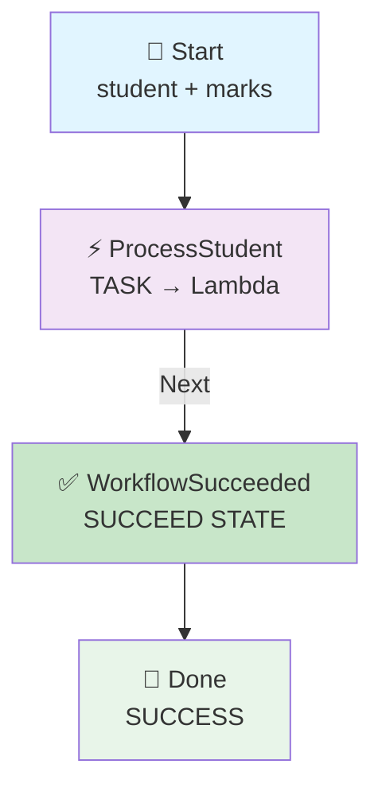
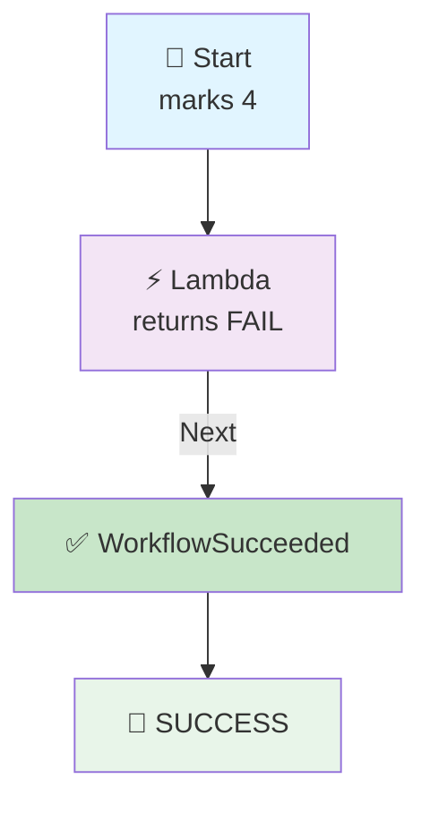

# Step Functions → Lambda → Succeed State

## The Workflow Ends Successfully — Even When the Student Fails

## 🎯 Goal

We want a workflow where:

```text
Input
  ↓
Lambda
  ↓
Succeed
  ↓
Done
```

The Lambda checks a student's marks and returns either **PASS** or **FAIL**.

But **both results end the workflow successfully**:

```text
marks = 9  →  Lambda  →  PASS  →  Succeed ✅
marks = 4  →  Lambda  →  FAIL  →  Succeed ✅
```

### 🤔 Why? The Most Important Idea

> **A student failing is NOT the same as the Step Functions workflow failing.**

The Lambda **successfully processed** the student. The answer it produced was "FAIL", but the *work itself* was done correctly.

```text
Student failing  =  a normal business result   ✅
Workflow failing =  something broke            ❌
```

## 🧠 What Is the Succeed State?

> **Succeed = End the Step Functions workflow successfully.**

It **does not**:

- ❌ Call Lambda
- ❌ Process data
- ❌ Make a decision

It simply says:

> **"Everything completed successfully."**

## Architecture



---

## 📦 What We Need

| Service | Resource |
| ------- | -------- |
| IAM | Step Functions execution role |
| Lambda | `student-result-lambda` |
| Step Functions | `student-succeed-workflow` |
| CloudWatch | Lambda logs |

> 💡 **Only ONE Lambda is needed.** For learning `Succeed`, one Lambda → Succeed is the cleanest example.

## 🔐 IAM Role

We use **ONE IAM role**, and both Step Functions and Lambda share it.

### 📍 Go to: IAM Console → Roles → Create role → **Custom trust policy**

### Role Name

```text
stepfunctions-succeed-demo-role
```

### Trust Policy

```json
{
    "Version": "2012-10-17",
    "Statement": [
        {
            "Sid": "",
            "Effect": "Allow",
            "Principal": {
                "Service": [
                    "states.amazonaws.com",
                    "lambda.amazonaws.com"
                ]
            },
            "Action": "sts:AssumeRole"
        }
    ]
}
```

### 🧠 What This Trust Policy Means

| Service | Why It Is There |
|---------|-----------------|
| `states.amazonaws.com` | So **Step Functions** can invoke the Lambda |
| `lambda.amazonaws.com` | So **Lambda** can run and write its logs |

> 💡 The trust policy is the **door**. The managed policies below are **what you can do after entering**.

### Attach Managed Policies

| # | Managed Policy | Its Job |
|---|----------------|---------|
| 1 | `AWSLambdaBasicExecutionRole` | Lets Lambda write logs to CloudWatch |
| 2 | `AWSLambdaRole` | Lets Step Functions invoke Lambda |

Click **Create role**.

> 💡 **Already built an earlier pipeline?** You can reuse that role instead of making a new one — just choose it from the *Use an existing role* dropdown in the next step.

---

## 🐍 Step 1: Create the Lambda

1. Go to **Lambda Console** → **Functions** → **Create function**
2. Choose: **Author from scratch**

| Setting | Value |
|---------|-------|
| Function name | `student-result-lambda` |
| Runtime | Python 3.x (select latest available) |
| Execution role | Use an existing role → `stepfunctions-succeed-demo-role` |

Click **Create function**.

### 💻 Lambda Code

Open the function → **Code** → **Code source**. Replace the code with:

```python
def lambda_handler(event, context):

    print("====================================")
    print("       STUDENT LAMBDA STARTED")
    print("====================================")

    print(f"Received event from Step Functions: {event}")

    student = event["student"]
    marks = event["marks"]

    print(f"Student Name : {student}")
    print(f"Student Marks: {marks}")

    print("Checking student result...")

    if marks > 7:

        status = "PASS"
        message = f"{student} passed with {marks} marks"

        print("Marks are greater than 7.")
        print("Student result: PASS")

    else:

        status = "FAIL"
        message = f"{student} failed with {marks} marks"

        print("Marks are 7 or less.")
        print("Student result: FAIL")

    result = {
        "student": student,
        "marks": marks,
        "status": status,
        "message": message
    }

    print(f"Returning result to Step Functions: {result}")

    print("====================================")
    print("       STUDENT LAMBDA FINISHED")
    print("====================================")

    return result
```

Click **Deploy**.

> 📌 **Note:** here the Lambda **does** make the PASS/FAIL decision. That is fine — the point of this pipeline is the `Succeed` state, not the branching.

---

## 🛠️ Step 2: Create the Step Functions State Machine

1. Go to **Step Functions Console** → **State machines** → **Create state machine**
2. Choose: **Write your workflow in code**
3. Type: **Standard**

| Setting | Value |
|---------|-------|
| Name | `student-succeed-workflow` |
| Execution role | Use an existing role → `stepfunctions-succeed-demo-role` |

### 📝 State Machine Code

```json
{
  "StartAt": "ProcessStudent",
  "States": {

    "ProcessStudent": {
      "Type": "Task",
      "Resource": "YOUR_LAMBDA_ARN",
      "Next": "WorkflowSucceeded"
    },

    "WorkflowSucceeded": {
      "Type": "Succeed"
    }
  }
}
```

> ⚠️ Replace `YOUR_LAMBDA_ARN` with your real Lambda ARN.

Click **Create**.

---

## 🧠 Understand This Code

### First State — Task

```json
"ProcessStudent": {
  "Type": "Task"
```

> Call Lambda.

### Next

```json
"Next": "WorkflowSucceeded"
```

> After Lambda finishes successfully, go to `WorkflowSucceeded`.

### Succeed

```json
"WorkflowSucceeded": {
  "Type": "Succeed"
}
```

> **Stop the workflow and mark it as successful.** That's it.

> 📌 Notice: there is **no** `"End": true` needed here. The `Succeed` state itself ends the workflow.

---

## 🆚 `Succeed` vs `"End": true`

Both end a workflow, but they are not the same:

| | `"End": true` | `"Type": "Succeed"` |
|---|---|---|
| Ends the workflow | ✅ Yes | ✅ Yes |
| Marked as successful | ✅ Yes | ✅ Yes |
| Can it pass data out? | ✅ Yes (the state's output) | ❌ No output |
| Can you name it clearly? | ❌ No (it is inside another state) | ✅ Yes (`WorkflowSucceeded`) |
| Best for | Ending a Task quickly | A clear, visible "success" step |

💡 Use `Succeed` when you want the workflow diagram to **show** a success step — it looks much clearer in the picture.

---

## 📥 Step 3: Start an Execution — Test PASS

Now you **do need input**, because Lambda needs `student` and `marks`.

```json
{
  "student": "Kshitij",
  "marks": 9
}
```

Click **Start execution**.

### 🔄 What Happens

```text
Input
 ↓
{"student": "Kshitij", "marks": 9}
 ↓
ProcessStudent → Lambda
 ↓
marks > 7 ?
 ↓
PASS
 ↓
WorkflowSucceeded
 ↓
SUCCESS ✅
```

Lambda returns:

```json
{
  "student": "Kshitij",
  "marks": 9,
  "status": "PASS",
  "message": "Kshitij passed with 9 marks"
}
```

Then:

```text
Succeed ✅
```

---

## 🔴 Step 4: Test FAIL

Start another execution:

```json
{
  "student": "Rahul",
  "marks": 4
}
```

Flow:

```text
Input
 ↓
Lambda
 ↓
marks > 7 ?
 ↓
NO
 ↓
FAIL
 ↓
Succeed
 ↓
SUCCESS ✅
```

Lambda returns:

```json
{
  "student": "Rahul",
  "marks": 4,
  "status": "FAIL",
  "message": "Rahul failed with 4 marks"
}
```

And Step Functions **still** shows:

```text
Workflow Succeeded ✅
```



---

## 🤔 Why Does FAIL Still End in Succeed?

This is the **most important concept** in this pipeline. There are **two different meanings of "failure"**:

### 1. Student Failure (not a workflow failure)

```text
marks <= 7
     ↓
Student = FAIL
```

But the Lambda itself worked correctly:

```text
Lambda = SUCCESS
Step Functions = SUCCESS ✅
```

### 2. Actual Workflow Failure

Suppose the Lambda **crashes**:

```text
Lambda
 ↓
Exception ❌
     ↓
Step Functions = FAILED ❌
```

In this case the workflow shows **Failed**, and the `Succeed` state is **never reached**.

### 🧠 The Rule

| What Happened | Lambda Result | Step Functions Result |
|---------------|---------------|----------------------|
| Student passed | PASS | ✅ Succeeded |
| Student failed | FAIL | ✅ Succeeded |
| Lambda threw an exception | ❌ Error | ❌ Failed |
| Lambda ARN is wrong | ❌ Error | ❌ Failed |

> 🔑 **Key point:** `Succeed` is about the **workflow**, not about the **business answer**.

---

## ☁️ Step 5: Check CloudWatch Logs

Go to: **Lambda** → `student-result-lambda` → **Monitor** → **View CloudWatch logs**

### For marks = 9

```text
====================================
       STUDENT LAMBDA STARTED
====================================

Received event from Step Functions:
{'student': 'Kshitij', 'marks': 9}

Student Name : Kshitij
Student Marks: 9

Checking student result...

Marks are greater than 7.
Student result: PASS

Returning result to Step Functions:
{
    'student': 'Kshitij',
    'marks': 9,
    'status': 'PASS',
    'message': 'Kshitij passed with 9 marks'
}

====================================
       STUDENT LAMBDA FINISHED
====================================
```

### For marks = 4

```text
====================================
       STUDENT LAMBDA STARTED
====================================

Received event from Step Functions:
{'student': 'Rahul', 'marks': 4}

Student Name : Rahul
Student Marks: 4

Checking student result...

Marks are 7 or less.
Student result: FAIL

Returning result to Step Functions:
{
    'student': 'Rahul',
    'marks': 4,
    'status': 'FAIL',
    'message': 'Rahul failed with 4 marks'
}

====================================
       STUDENT LAMBDA FINISHED
====================================
```

Then Step Functions reaches:

```text
WorkflowSucceeded
       ↓
    SUCCESS ✅
```

---

## 🆚 Choice vs Succeed

Now you can clearly see the difference:

### Your earlier Choice example (folder 01)

```text
              Choice
                ↓
          marks > 7 ?
           /       \
         YES         NO
          ↓           ↓
       Lambda A    Lambda B
       PASS         FAIL
```

> **Choice = DECIDE WHICH PATH**

### This Succeed example

```text
             Lambda
                ↓
        WorkflowSucceeded
                ↓
              DONE
```

> **Succeed = SUCCESSFULLY END THE WORKFLOW**

---

## ⭐ Easy Definition

> **Succeed state = It tells Step Functions that the workflow has completed successfully, and it stops the execution.**

### Easy keyword

```text
Succeed → SUCCESS + END
```

---

## 🧠 All the States So Far

| State | Easy Meaning | Calls Something? |
| ----- | ------------ | ---------------- |
| **Pass** | Pass / prepare data | ❌ No |
| **Choice** | Make a decision | ❌ No |
| **Task** | Do / call something | ✅ Yes |
| **Wait** | Pause the workflow | ❌ No |
| **Succeed** | Successfully end workflow | ❌ No |

```text
PASS    → DATA
CHOICE  → DECISION
TASK    → ACTION
WAIT    → TIME
SUCCEED → SUCCESS + END
```

---

## ⚠️ Common Mistakes

| Mistake | What Happens | Fix |
|---------|--------------|-----|
| Lambda ARN left as `YOUR_LAMBDA_ARN` | Execution fails | Paste your real ARN |
| Thinking FAIL means the workflow failed | Confusion about results | Lambda returning FAIL is still a **success** |
| Adding `"End": true` to the Succeed state | Code will not save — not valid | `Succeed` already ends the workflow |
| Adding `"Next"` to the Succeed state | Code will not save | `Succeed` has no next state |
| Starting with `{}` | Lambda errors — no `student` / `marks` | Send the full input |
| Expecting `Succeed` to return data | No output from that state | The Lambda's result is already saved in the execution history |

---

## 🧩 Full Step List (Quick Reference)

| Step | What to Do |
|------|-----------|
| 1 | IAM → Roles → Create role → **Custom trust policy** |
| 2 | Paste the trust policy, attach `AWSLambdaBasicExecutionRole` + `AWSLambdaRole` |
| 3 | Role name: `stepfunctions-succeed-demo-role` |
| 4 | Lambda → Create function → `student-result-lambda` (Python 3.x) |
| 5 | Execution role: existing → `stepfunctions-succeed-demo-role` |
| 6 | Paste the Lambda code → **Deploy** |
| 7 | Copy the Lambda ARN |
| 8 | Step Functions → State machines → Create state machine |
| 9 | Choose **Write your workflow in code** → type **Standard** |
| 10 | Name: `student-succeed-workflow` |
| 11 | Paste the state machine code → replace `YOUR_LAMBDA_ARN` |
| 12 | Execution role: existing → `stepfunctions-succeed-demo-role` |
| 13 | Create the state machine |
| 14 | Start execution with `{"student": "Kshitij", "marks": 9}` → **Succeeded** ✅ |
| 15 | Start execution with `{"student": "Rahul", "marks": 4}` → **Succeeded** ✅ |
| 16 | Check CloudWatch logs for both runs |
| 17 | Notice both workflows show **Succeeded** even though one student failed |

---

## 🎤 Interview Explanation

**Q: "What does the Succeed state do in Step Functions?"**

> **"A Succeed state ends the workflow and marks the execution as successful. It does not call any service and it does not process data. In my pipeline, the workflow starts with a Task state that invokes a Lambda function. The Lambda checks a student's marks and returns either PASS or FAIL. After the Lambda finishes, the workflow goes to a Succeed state, which ends the execution successfully. I tested it with a passing student and a failing student, and both executions showed as Succeeded, because the Lambda processed the student correctly in both cases. A student failing is a normal business result, not a workflow failure. The workflow would only fail if the Lambda itself threw an exception, and then the Succeed state would never be reached."**

---

## ⭐ One-Line Summary

```text
Input
  ↓
Lambda — decides PASS or FAIL
  ↓
Succeed — "workflow finished successfully"
  ↓
Done ✅
```

> **Main purpose: show that a Succeed state ends the workflow successfully, and that a FAIL *result* from Lambda is still a SUCCESSFUL *workflow*.**

---

## Summary

| Component | What It Does |
|-----------|--------------|
| **Lambda** (`student-result-lambda`) | Checks marks, returns PASS or FAIL |
| **Task State** (`ProcessStudent`) | Calls the Lambda |
| **Succeed State** (`WorkflowSucceeded`) | Ends the workflow as successful |
| **CloudWatch Logs** | Shows the Lambda result for each run |
| **Step Functions** (`student-succeed-workflow`) | Always finishes as **Succeeded** when Lambda works |

This pipeline shows the **Succeed state = SUCCESS + END** idea — and the important difference between a **business result** (FAIL) and a **workflow failure** (an error).
