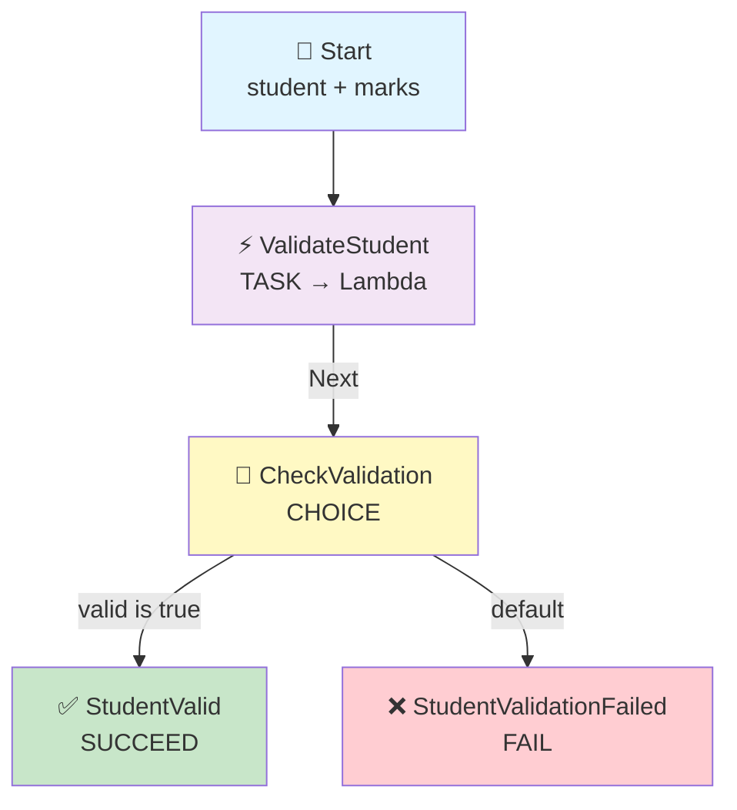
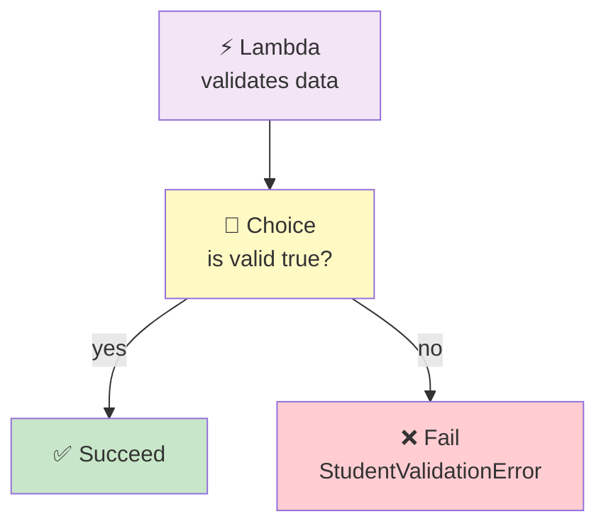

# Step Functions → Lambda → Fail State

## When Validation Goes Wrong, the Workflow Ends as FAILED

## 🎯 Goal

We want to understand the **Fail State**.

Pipeline:

```text
Step Functions
      ↓
   Lambda
      ↓
  Valid data?
    /    \
  YES     NO
   ↓       ↓
Succeed   Fail
          State
           ↓
        FAILED ❌
```

To show this clearly, we will make Lambda **validate** the student data. If the data is bad, the workflow goes to the **Fail state**.

## 🧠 What Is the Fail State?

> **Fail = Stop the workflow and mark it as failed.**

It is used when something goes wrong and we **do not** want the workflow to continue.

> **Easy keyword: Fail = ERROR + STOP**

## Architecture



In this pipeline we use **three** state types together:

| State | Job |
|-------|-----|
| **Lambda (Task)** | Validate the student data |
| **Choice** | Check whether validation passed |
| **Fail** | Stop the workflow if validation failed |

---

## 📦 What We Need

| Service | Resource |
| ------- | -------- |
| IAM | Step Functions execution role |
| Lambda | `validate-student` |
| Step Functions | `student-fail-workflow` |
| CloudWatch | Lambda logs |

## 🔐 IAM Role

We use **ONE IAM role**, and both Step Functions and Lambda share it.

### 📍 Go to: IAM Console → Roles → Create role → **Custom trust policy**

### Role Name

```text
stepfunctions-fail-demo-role
```

### Trust Policy

```json
{
    "Version": "2012-10-17",
    "Statement": [
        {
            "Sid": "",
            "Effect": "Allow",
            "Principal": {
                "Service": [
                    "states.amazonaws.com",
                    "lambda.amazonaws.com"
                ]
            },
            "Action": "sts:AssumeRole"
        }
    ]
}
```

### 🧠 What This Trust Policy Means

| Service | Why It Is There |
|---------|-----------------|
| `states.amazonaws.com` | So **Step Functions** can invoke the Lambda |
| `lambda.amazonaws.com` | So **Lambda** can run and write its logs |

> 💡 The trust policy is the **door**. The managed policies below are **what you can do after entering**.

### Attach Managed Policies

| # | Managed Policy | Its Job |
|---|----------------|---------|
| 1 | `AWSLambdaBasicExecutionRole` | Lets Lambda write logs to CloudWatch |
| 2 | `AWSLambdaRole` | Lets Step Functions invoke Lambda |

Click **Create role**.

> 💡 **Already built an earlier pipeline?** You can reuse that role instead of making a new one — just choose it from the *Use an existing role* dropdown in the next step.

---

## 🐍 Step 1: Create the Lambda

1. Go to **Lambda Console** → **Functions** → **Create function**
2. Choose: **Author from scratch**

| Setting | Value |
|---------|-------|
| Function name | `validate-student` |
| Runtime | Python 3.x (select latest available) |
| Execution role | Use an existing role → `stepfunctions-fail-demo-role` |

Click **Create function**.

### 💻 Lambda Code

Open the function → **Code** → **Code source**. Replace the code with:

```python
def lambda_handler(event, context):

    print("====================================")
    print("       VALIDATION LAMBDA STARTED")
    print("====================================")

    print(f"Received event: {event}")

    student = event.get("student")
    marks = event.get("marks")

    print(f"Student Name : {student}")
    print(f"Student Marks: {marks}")

    print("Checking student data...")

    if student is None:
        print("ERROR: Student name is missing.")

        return {
            "valid": False,
            "reason": "Student name is missing"
        }

    if marks is None:
        print("ERROR: Marks are missing.")

        return {
            "valid": False,
            "reason": "Marks are missing"
        }

    if marks < 0 or marks > 10:
        print("ERROR: Marks are invalid.")

        return {
            "valid": False,
            "reason": "Marks must be between 0 and 10"
        }

    print("Student data is valid.")

    result = {
        "valid": True,
        "student": student,
        "marks": marks,
        "message": "Student data is valid"
    }

    print(f"Returning result: {result}")

    print("====================================")
    print("       VALIDATION LAMBDA FINISHED")
    print("====================================")

    return result
```

Click **Deploy**.

### 🔍 What the Lambda Checks

| Check | If It Fails | Returns |
|-------|-------------|---------|
| Is `student` missing? | Name is missing | `valid: false` |
| Is `marks` missing? | Marks are missing | `valid: false` |
| Is `marks` less than 0 or more than 10? | Marks are invalid | `valid: false` |
| All good | Data is valid | `valid: true` |

> 📌 **Very important:** the Lambda does **not** fail — it always returns normally. It just returns `valid: false`. The **Fail state** is what marks the workflow as failed.

---

## 🛠️ Step 2: Create the Step Functions State Machine

1. Go to **Step Functions Console** → **State machines** → **Create state machine**
2. Choose: **Write your workflow in code**
3. Type: **Standard**

| Setting | Value |
|---------|-------|
| Name | `student-fail-workflow` |
| Execution role | Use an existing role → `stepfunctions-fail-demo-role` |

### 📝 State Machine Code

```json
{
  "StartAt": "ValidateStudent",
  "States": {

    "ValidateStudent": {
      "Type": "Task",
      "Resource": "YOUR_LAMBDA_ARN",
      "Next": "CheckValidation"
    },

    "CheckValidation": {
      "Type": "Choice",
      "Choices": [
        {
          "Variable": "$.valid",
          "BooleanEquals": true,
          "Next": "StudentValid"
        }
      ],
      "Default": "StudentValidationFailed"
    },

    "StudentValid": {
      "Type": "Succeed"
    },

    "StudentValidationFailed": {
      "Type": "Fail",
      "Error": "StudentValidationError",
      "Cause": "Student data validation failed"
    }
  }
}
```

> ⚠️ Replace `YOUR_LAMBDA_ARN` with your real Lambda ARN.

Click **Create**.

---

## 🧠 Understand the Flow

### Step 1 — ValidateStudent (Task)

```text
ValidateStudent
```

This is a **Task**. It calls the Lambda.

### Step 2 — The Lambda Checks the Data

If valid, Lambda returns:

```json
{
  "valid": true
}
```

If invalid, Lambda returns:

```json
{
  "valid": false,
  "reason": "Marks must be between 0 and 10"
}
```

### Step 3 — CheckValidation (Choice)

The Choice state asks:

```text
valid == true ?
```

If **YES**:

```text
StudentValid → Succeed ✅
```

If **NO** (the Default path):

```text
StudentValidationFailed → Fail ❌
```



---

## 📥 Step 3: Test Valid Data

Start execution with:

```json
{
  "student": "Kshitij",
  "marks": 9
}
```

Flow:

```text
Input
 ↓
Lambda → valid = true
 ↓
Choice
 ↓
StudentValid
 ↓
Succeed
 ↓
SUCCESS ✅
```

Lambda returns:

```json
{
  "valid": true,
  "student": "Kshitij",
  "marks": 9,
  "message": "Student data is valid"
}
```

---

## ❌ Step 4: Test Invalid Data

Start another execution:

```json
{
  "student": "Rahul",
  "marks": 15
}
```

Lambda sees `marks = 15`, but our rule says:

```text
0 ≤ marks ≤ 10
```

So Lambda returns:

```json
{
  "valid": false,
  "reason": "Marks must be between 0 and 10"
}
```

Then:

```text
Lambda
 ↓
Choice
 ↓
valid = false
 ↓
Default path
 ↓
StudentValidationFailed
 ↓
Fail State
 ↓
FAILED ❌
```

The execution now shows:

```text
Status: FAILED ❌
Error:  StudentValidationError
Cause:  Student data validation failed
```

---

## ☁️ Step 5: Check CloudWatch Logs

Go to: **Lambda** → `validate-student` → **Monitor** → **View CloudWatch logs**

### For the invalid example (marks = 15)

```text
====================================
       VALIDATION LAMBDA STARTED
====================================

Received event:
{'student': 'Rahul', 'marks': 15}

Student Name : Rahul
Student Marks: 15

Checking student data...

ERROR: Marks are invalid.

Returning:
{
    'valid': False,
    'reason': 'Marks must be between 0 and 10'
}

====================================
       VALIDATION LAMBDA FINISHED
====================================
```

> 📌 Notice: the Lambda **finished normally**. There is no Python exception. The workflow failed because of the **Fail state**, not because the Lambda crashed.

Then Step Functions moves to:

```text
StudentValidationFailed
        ↓
     Fail State
        ↓
    FAILED ❌
```

---

## 🔥 What Does the Fail State Actually Do?

```json
"StudentValidationFailed": {
  "Type": "Fail",
  "Error": "StudentValidationError",
  "Cause": "Student data validation failed"
}
```

| Part | Meaning |
|------|---------|
| `"Type": "Fail"` | This is a Fail state |
| `"Error": "StudentValidationError"` | Give the failure an **error name** |
| `"Cause": "Student data validation failed"` | Explain **why** it failed |

Then Step Functions **stops the execution** and marks it as **FAILED**. ✅

### 🔍 Why Give It an Error Name and Cause?

Because later you can **search and filter** your executions:

```text
"Which executions failed with StudentValidationError?"
"Which executions failed because marks were out of range?"
```

Without `Error` and `Cause`, every failure just looks like "Failed" and you cannot tell them apart.

> 💡 `Cause` is free text — write something a human will understand. `Error` is best treated as a short **code** you can filter on.

---

## 🆚 Succeed vs Fail

These two are opposites:

### Succeed

```text
Succeed
   ↓
SUCCESS ✅
   ↓
STOP
```

### Fail

```text
Fail
  ↓
FAILED ❌
  ↓
STOP
```

| | **Succeed** | **Fail** |
|---|---|---|
| Ends the workflow | ✅ Yes | ✅ Yes |
| Execution status | Succeeded ✅ | Failed ❌ |
| Has `Error` / `Cause` | ❌ No | ✅ Yes |
| Used when | Everything went fine | Something went wrong |

---

## ⭐ Very Important Difference

Do **not** confuse *"Lambda returned `valid: false`"* with *"the Fail state ran"*.

```text
Lambda:
"Student data is invalid."
        ↓
Choice:
"Okay, go to the Fail state."
        ↓
Fail State:
"Stop the workflow and mark it FAILED."
```

> **Lambda detects the problem. Choice chooses the path. Fail officially marks the Step Functions execution as failed and stops it.**

This is a clean separation of jobs:

| Component | Its Job |
|-----------|---------|
| **Lambda** | Detects the problem and reports it |
| **Choice** | Decides which path to take |
| **Fail** | Officially ends the workflow as FAILED |

---

## ⚠️ Common Mistakes

| Mistake | What Happens | Fix |
|---------|--------------|-----|
| Making Lambda `raise` an exception for bad data | The Task fails, and the Fail state is **skipped** | Return `valid: false` instead, so the Choice can route it |
| Forgetting the `Error` field | Failure is generic and hard to filter | Always give a clear error name |
| Forgetting the `Cause` field | You cannot tell why it failed | Add a human-readable cause |
| Adding `"Next"` to a Fail state | Code will not save — not valid | A Fail state always ends the workflow |
| Adding `"End": true` to a Fail state | Code will not save | Fail ends the workflow by itself |
| Thinking Fail is an error handler | The workflow still fails | Use `Catch` / `Retry` if you want to recover |

### 🧠 Extra Idea: What If You Want to *Recover* Instead?

If you do **not** want the workflow to fail — for example, you want to send an email about the bad data and continue — then instead of a Fail state you would use a **`Catch`** block or route to another Task.

| Goal | Use |
|------|-----|
| Stop the workflow with a clear error | **Fail state** (this pipeline) |
| Recover and continue | `Catch` + another state |
| Retry the same task | `Retry` |

---

## 🧠 Easy Way to Remember

All the states so far:

| State | Easy Meaning | Calls Something? |
| ----- | ------------ | ---------------- |
| **Pass** | Pass / prepare data | ❌ No |
| **Choice** | Make a decision | ❌ No |
| **Task** | Do / call something | ✅ Yes |
| **Wait** | Pause the workflow | ❌ No |
| **Succeed** | End successfully | ❌ No |
| **Fail** | End with failure | ❌ No |

Or even simpler:

```text
Pass    → DATA
Choice  → DECISION
Task    → ACTION
Wait    → PAUSE
Succeed → SUCCESS
Fail    → ERROR + STOP
```

---

## 🧩 Full Step List (Quick Reference)

| Step | What to Do |
|------|-----------|
| 1 | IAM → Roles → Create role → **Custom trust policy** |
| 2 | Paste the trust policy, attach `AWSLambdaBasicExecutionRole` + `AWSLambdaRole` |
| 3 | Role name: `stepfunctions-fail-demo-role` |
| 4 | Lambda → Create function → `validate-student` (Python 3.x) |
| 5 | Execution role: existing → `stepfunctions-fail-demo-role` |
| 6 | Paste the Lambda code → **Deploy** |
| 7 | Copy the Lambda ARN |
| 8 | Step Functions → State machines → Create state machine |
| 9 | Choose **Write your workflow in code** → type **Standard** |
| 10 | Name: `student-fail-workflow` |
| 11 | Paste the state machine code → replace `YOUR_LAMBDA_ARN` |
| 12 | Execution role: existing → `stepfunctions-fail-demo-role` |
| 13 | Create the state machine |
| 14 | Start execution with `{"student": "Kshitij", "marks": 9}` → **Succeeded** ✅ |
| 15 | Start execution with `{"student": "Rahul", "marks": 15}` → **Failed** ❌ |
| 16 | Check the failed execution → see `Error` and `Cause` |
| 17 | Check CloudWatch → Lambda finished normally in both runs |

---

## 🎤 Interview Explanation

**Q: "What does the Fail state do in Step Functions?"**

> **"A Fail state stops the workflow and marks the execution as failed. It takes an Error and a Cause, which describe why the workflow failed. In my pipeline, a Lambda function validates student data and returns a valid flag. A Choice state checks that flag. If the data is valid, the workflow goes to a Succeed state. If the data is invalid, it goes to a Fail state with the error StudentValidationError and a cause explaining that validation failed. The important point is that the Lambda does not throw an exception — it returns valid as false, and the Fail state is what officially fails the workflow. That way the failure is controlled and clearly labelled, and I can filter executions by the error name."**

---

## ⭐ One-Line Summary

```text
Input
  ↓
Lambda — validates the data
  ↓
Choice — is valid true?
  ↓
  ├─ YES → Succeed ✅
  └─ NO  → Fail ❌ (Error + Cause)
```

> **Main purpose: show that a Fail state ends the workflow with a clear error name and cause, so you can see exactly why it failed.**

---

## Summary

| Component | What It Does |
|-----------|--------------|
| **Lambda** (`validate-student`) | Checks the data and returns `valid: true` or `valid: false` |
| **Choice State** (`CheckValidation`) | Routes to Succeed if valid, otherwise to Fail |
| **Succeed State** (`StudentValid`) | Ends the workflow successfully |
| **Fail State** (`StudentValidationFailed`) | Ends the workflow as FAILED with an `Error` and `Cause` |
| **CloudWatch Logs** | Shows the Lambda finished normally in both cases |

This pipeline shows the **Fail state = ERROR + STOP** idea — and the important separation: **Lambda detects, Choice decides, Fail stops the workflow**.
