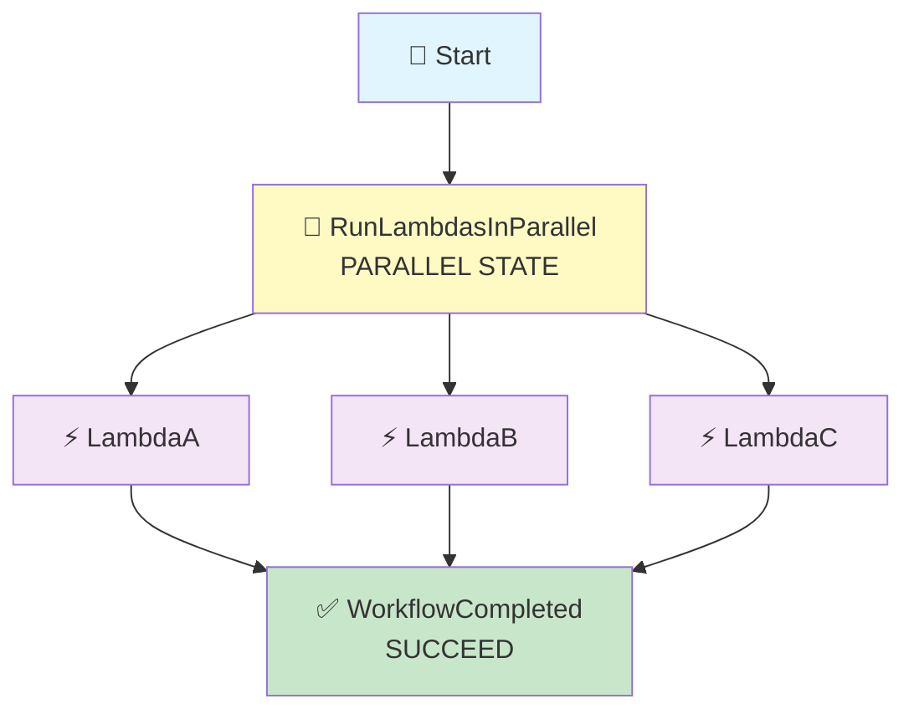

# Step Functions → Parallel State → 3 Lambdas

## Three Lambda Functions Run at the Same Time

## 🎯 Goal

We want Step Functions to call **3 different Lambda functions at the same time**:

```text
                    Step Functions
                          ↓
                       Parallel
                    /      |      \
                   ↓       ↓       ↓
             Lambda A  Lambda B  Lambda C
                   \       |       /
                    ↓      ↓       ↓
                 All completed
                       ↓
                     Done
```

### Simple Meaning

> **Parallel = Run multiple branches at the same time.**

Each Lambda prints the **current time in IST**, so you can clearly see that all three were started around the same time. ✅

## Architecture



---

## 📦 What We Need

| Service | Resource |
| ------- | -------- |
| Lambda | `lambda-a` |
| Lambda | `lambda-b` |
| Lambda | `lambda-c` |
| Step Functions | `parallel-lambda-workflow` |
| CloudWatch | Lambda logs |

> 💡 We create **3 Lambda functions**. All three can use the **same** role.

## 🔐 IAM Role

We use **ONE IAM role**, and both Step Functions and all three Lambdas share it.

### 📍 Go to: IAM Console → Roles → Create role → **Custom trust policy**

### Role Name

```text
stepfunctions-parallel-demo-role
```

### Trust Policy

```json
{
    "Version": "2012-10-17",
    "Statement": [
        {
            "Sid": "",
            "Effect": "Allow",
            "Principal": {
                "Service": [
                    "states.amazonaws.com",
                    "lambda.amazonaws.com"
                ]
            },
            "Action": "sts:AssumeRole"
        }
    ]
}
```

### 🧠 What This Trust Policy Means

| Service | Why It Is There |
|---------|-----------------|
| `states.amazonaws.com` | So **Step Functions** can invoke the Lambdas |
| `lambda.amazonaws.com` | So **Lambda** can run and write its logs |

> 💡 The trust policy is the **door**. The managed policies below are **what you can do after entering**.

### Attach Managed Policies

| # | Managed Policy | Its Job |
|---|----------------|---------|
| 1 | `AWSLambdaBasicExecutionRole` | Lets Lambda write logs to CloudWatch |
| 2 | `AWSLambdaRole` | Lets Step Functions invoke Lambda |

Click **Create role**.

> 💡 **One role is enough here.** Even though there are three Lambdas, they can all use this single role — a role is about *permissions*, not about *how many functions* exist.
>
> 💡 **Already built an earlier pipeline?** You can reuse that role instead of making a new one — just choose it from the *Use an existing role* dropdown in the next step.

---

## 🐍 Step 1: Create Lambda A

1. Go to **Lambda Console** → **Functions** → **Create function**
2. Choose: **Author from scratch**

| Setting | Value |
|---------|-------|
| Function name | `lambda-a` |
| Runtime | Python 3.x (select latest available) |
| Execution role | Use an existing role → `stepfunctions-parallel-demo-role` |

### 💻 Code

```python
from datetime import datetime
from zoneinfo import ZoneInfo


def lambda_handler(event, context):

    print("====================================")
    print("       LAMBDA A STARTED")
    print("====================================")

    print(f"Received event: {event}")

    # Get current IST time
    ist_time = datetime.now(ZoneInfo("Asia/Kolkata"))

    print(f"Lambda Name : Lambda A")
    print(f"Execution Time (IST): {ist_time.strftime('%Y-%m-%d %H:%M:%S %Z')}")

    print("Lambda A is processing the request...")

    result = {
        "lambda": "Lambda A",
        "status": "SUCCESS",
        "execution_time_ist": ist_time.strftime(
            "%Y-%m-%d %H:%M:%S %Z"
        )
    }

    print(f"Returning result: {result}")

    print("====================================")
    print("       LAMBDA A FINISHED")
    print("====================================")

    return result
```

Click **Deploy**.

---

## 🐍 Step 2: Create Lambda B

Same thing, with the name changed to `lambda-b` and every `A` changed to `B`.

| Setting | Value |
|---------|-------|
| Function name | `lambda-b` |
| Runtime | Python 3.x |
| Execution role | Use an existing role → `stepfunctions-parallel-demo-role` |

### 💻 Code

```python
from datetime import datetime
from zoneinfo import ZoneInfo


def lambda_handler(event, context):

    print("====================================")
    print("       LAMBDA B STARTED")
    print("====================================")

    print(f"Received event: {event}")

    ist_time = datetime.now(ZoneInfo("Asia/Kolkata"))

    print(f"Lambda Name : Lambda B")
    print(f"Execution Time (IST): {ist_time.strftime('%Y-%m-%d %H:%M:%S %Z')}")

    print("Lambda B is processing the request...")

    result = {
        "lambda": "Lambda B",
        "status": "SUCCESS",
        "execution_time_ist": ist_time.strftime(
            "%Y-%m-%d %H:%M:%S %Z"
        )
    }

    print(f"Returning result: {result}")

    print("====================================")
    print("       LAMBDA B FINISHED")
    print("====================================")

    return result
```

Click **Deploy**.

---

## 🐍 Step 3: Create Lambda C

| Setting | Value |
|---------|-------|
| Function name | `lambda-c` |
| Runtime | Python 3.x |
| Execution role | Use an existing role → `stepfunctions-parallel-demo-role` |

### 💻 Code

```python
from datetime import datetime
from zoneinfo import ZoneInfo


def lambda_handler(event, context):

    print("====================================")
    print("       LAMBDA C STARTED")
    print("====================================")

    print(f"Received event: {event}")

    ist_time = datetime.now(ZoneInfo("Asia/Kolkata"))

    print(f"Lambda Name : Lambda C")
    print(f"Execution Time (IST): {ist_time.strftime('%Y-%m-%d %H:%M:%S %Z')}")

    print("Lambda C is processing the request...")

    result = {
        "lambda": "Lambda C",
        "status": "SUCCESS",
        "execution_time_ist": ist_time.strftime(
            "%Y-%m-%d %H:%M:%S %Z"
        )
    }

    print(f"Returning result: {result}")

    print("====================================")
    print("       LAMBDA C FINISHED")
    print("====================================")

    return result
```

Click **Deploy**.

> 💡 **Why print the IST time?** Because it is the easiest way to *prove* all three ran together. If they ran one after another, the times would be clearly different (for example, seconds apart). If they ran in parallel, the times are almost the same. ✅

> 📌 The `zoneinfo` module needs Python 3.9 or newer. Lambda's Python 3.x runtimes are fine. If you ever see an error about `ZoneInfo`, use `pytz` instead or simply print UTC time.

---

## 🛠️ Step 4: Create the Step Functions State Machine

1. Go to **Step Functions Console** → **State machines** → **Create state machine**
2. Choose: **Write your workflow in code**
3. Type: **Standard**

| Setting | Value |
|---------|-------|
| Name | `parallel-lambda-workflow` |
| Execution role | Use an existing role → `stepfunctions-parallel-demo-role` |

### 📝 State Machine Definition

```json
{
  "StartAt": "RunLambdasInParallel",
  "States": {

    "RunLambdasInParallel": {
      "Type": "Parallel",

      "Branches": [

        {
          "StartAt": "LambdaA",
          "States": {
            "LambdaA": {
              "Type": "Task",
              "Resource": "YOUR_LAMBDA_A_ARN",
              "End": true
            }
          }
        },

        {
          "StartAt": "LambdaB",
          "States": {
            "LambdaB": {
              "Type": "Task",
              "Resource": "YOUR_LAMBDA_B_ARN",
              "End": true
            }
          }
        },

        {
          "StartAt": "LambdaC",
          "States": {
            "LambdaC": {
              "Type": "Task",
              "Resource": "YOUR_LAMBDA_C_ARN",
              "End": true
            }
          }
        }

      ],

      "Next": "WorkflowCompleted"
    },

    "WorkflowCompleted": {
      "Type": "Succeed"
    }
  }
}
```

> ⚠️ Replace **all three** placeholders with your real Lambda ARNs:

```text
YOUR_LAMBDA_A_ARN  →  arn:aws:lambda:us-east-1:123456789012:function:lambda-a
YOUR_LAMBDA_B_ARN  →  arn:aws:lambda:us-east-1:123456789012:function:lambda-b
YOUR_LAMBDA_C_ARN  →  arn:aws:lambda:us-east-1:123456789012:function:lambda-c
```

Click **Create**.

---

## 🧠 Understand the Important Part

```json
"Type": "Parallel"
```

> **Start multiple branches at the same time.**

We have **3 branches**:

| Branch | Runs |
|--------|------|
| Branch 1 | Lambda A |
| Branch 2 | Lambda B |
| Branch 3 | Lambda C |

### 🔍 Line by Line

| Part | Meaning |
|------|---------|
| `"Type": "Parallel"` | This is a Parallel state |
| `"Branches": [ ... ]` | The list of paths to run together |
| Each branch's `"StartAt"` | Where that branch begins |
| Each branch's `"End": true` | That branch is finished after its Lambda |
| `"Next": "WorkflowCompleted"` | After **all** branches finish, go to Succeed |

> 📌 **Important:** each branch is its own mini-workflow. A branch can contain several states, not just one. Here each branch is simple — just one Lambda.

---

## 🚀 Step 5: Start an Execution

You don't need any input for this example.

```json
{}
```

Click **Start execution**.

### 🔄 What Happens?

Step Functions reaches `RunLambdasInParallel` and starts all three branches:

```text
              Parallel
             /    |    \
            ↓     ↓     ↓
        Lambda A Lambda B Lambda C
```

All three branches **can execute at the same time**. ✅

---

## 🕐 Step 6: Check CloudWatch Logs

If the execution starts around `19:35:10 IST`, you might see:

### Lambda A

```text
====================================
       LAMBDA A STARTED
====================================

Received event: {}

Lambda Name : Lambda A
Execution Time (IST): 2026-09-12 19:35:10 IST

Lambda A is processing the request...

Returning result:
{
    'lambda': 'Lambda A',
    'status': 'SUCCESS',
    'execution_time_ist': '2026-09-12 19:35:10 IST'
}

====================================
       LAMBDA A FINISHED
====================================
```

### Lambda B

```text
====================================
       LAMBDA B STARTED
====================================

Received event: {}

Lambda Name : Lambda B
Execution Time (IST): 2026-09-12 19:35:10 IST

Lambda B is processing the request...

Returning result:
{
    'lambda': 'Lambda B',
    'status': 'SUCCESS',
    'execution_time_ist': '2026-09-12 19:35:10 IST'
}

====================================
       LAMBDA B FINISHED
====================================
```

### Lambda C

```text
====================================
       LAMBDA C STARTED
====================================

Received event: {}

Lambda Name : Lambda C
Execution Time (IST): 2026-09-12 19:35:11 IST

Lambda C is processing the request...

Returning result:
{
    'lambda': 'Lambda C',
    'status': 'SUCCESS',
    'execution_time_ist': '2026-09-12 19:35:11 IST'
}

====================================
       LAMBDA C FINISHED
====================================
```

> 📌 The exact seconds **can differ slightly** — that is normal. Parallel means the branches are **started together**; it does not guarantee identical timestamps. A one-second difference still proves they ran at the same time, because they are nowhere near *seconds apart in sequence*.

---

## ⭐ Very Important Concept

Suppose the branches take different times:

```text
Lambda A → takes 5 seconds
Lambda B → takes 10 seconds
Lambda C → takes 3 seconds
```

Step Functions does:

```text
             Parallel
           /    |    \
          ↓     ↓     ↓
        A 5s   B 10s  C 3s
           \     |     /
            \    |    /
             ↓   ↓   ↓
          Wait for ALL
                ↓
             Succeed
```

> **Step Functions waits until all three branches finish.** The next state starts only after the **slowest** branch is done. ✅

So the total time is about **10 seconds** (the slowest one), **not** 5 + 10 + 3 = 18 seconds.

### 🧠 That Is the Whole Point of Parallel

| Approach | Time Taken |
|----------|------------|
| One after another | 5 + 10 + 3 = **18 seconds** |
| Parallel | **~10 seconds** (slowest branch) |

---

## ⚠️ What If a Branch Fails?

If **any** branch fails, the whole Parallel state fails.

```text
Parallel
   ├── Lambda A ✅
   ├── Lambda B ❌ ← fails
   └── Lambda C ✅
          ↓
   Parallel state = FAILED ❌
```

The other branches keep running until they finish, but the Parallel state itself will fail.

> 💡 If you want to handle that, add a **`Catch`** on the Parallel state, just like a Task state. The `Error` / `Cause` from the failed branch is passed along.

---

## 🧠 Easy Way to Remember

### Normal Tasks (one after another)

```text
Lambda A
   ↓
Lambda B
   ↓
Lambda C
```

### Parallel

```text
       Parallel
      /    |    \
     A     B     C
      \    |    /
       Next Step
```

**A, B and C run together.**

---

## 🆚 Parallel vs Succeed/Fail Ending

| | **Parallel** | **Succeed / Fail** |
|---|---|---|
| Calls something? | ✅ Yes (its branches do) | ❌ No |
| Ends the workflow? | ❌ No — it has a `Next` | ✅ Yes |
| Needs a `Resource`? | ❌ No | ❌ No |
| Job | Run branches together | End the workflow |

---

## 🧩 All the States So Far

| State | Easy Meaning | Calls Something? |
| ----- | ------------ | ---------------- |
| **Pass** | Pass / prepare data | ❌ No |
| **Choice** | Make a decision | ❌ No |
| **Task** | Do / call something | ✅ Yes |
| **Wait** | Pause the workflow | ❌ No |
| **Succeed** | End successfully | ❌ No |
| **Fail** | End with failure | ❌ No |
| **Parallel** | Run branches together | ✅ Yes (via branches) |

```text
Pass     → PASS DATA
Choice   → MAKE DECISION
Task     → DO SOMETHING
Wait     → PAUSE
Succeed  → SUCCESS + END
Fail     → ERROR + STOP
Parallel → RUN TOGETHER
```

---

## ⚠️ Common Mistakes

| Mistake | What Happens | Fix |
|---------|--------------|-----|
| Replacing only one `YOUR_LAMBDA_*_ARN` | Execution fails | Replace **all three** |
| Branch missing `"End": true` | State machine will not save | Every branch needs an ending |
| Forgetting `"Next"` on the Parallel state | State machine will not save | Parallel must continue somewhere |
| Expecting identical timestamps | You may see 1 second difference | That is normal — Parallel starts them together |
| Expecting the total time to be added up | You think it is 18 seconds | It is about the **slowest** branch |
| Thinking one failed branch is ignored | The whole Parallel fails | Use `Catch` if you want to handle it |

---

## 🧩 Full Step List (Quick Reference)

| Step | What to Do |
|------|-----------|
| 1 | IAM → Roles → Create role → **Custom trust policy** |
| 2 | Paste the trust policy, attach `AWSLambdaBasicExecutionRole` + `AWSLambdaRole` |
| 3 | Role name: `stepfunctions-parallel-demo-role` |
| 4 | Lambda → Create function → `lambda-a` (Python 3.x) |
| 5 | Execution role: existing → `stepfunctions-parallel-demo-role` |
| 6 | Paste the Lambda A code → **Deploy** |
| 7 | Create `lambda-b` with the Lambda B code → **Deploy** |
| 8 | Create `lambda-c` with the Lambda C code → **Deploy** |
| 9 | Copy all three Lambda ARNs |
| 10 | Step Functions → State machines → Create state machine |
| 11 | Choose **Write your workflow in code** → type **Standard** |
| 12 | Name: `parallel-lambda-workflow` |
| 13 | Paste the definition → replace all three ARNs |
| 14 | Execution role: existing → `stepfunctions-parallel-demo-role` |
| 15 | Create the state machine |
| 16 | Start execution with `{}` |
| 17 | Watch the diagram → all three branches run at once ✅ |
| 18 | Check the three CloudWatch log groups → compare the IST times |
| 19 | Confirm the workflow reaches **Succeeded** ✅ |

---

## 🎤 Interview Explanation

**Q: "What is a Parallel state in Step Functions?"**

> **"A Parallel state allows me to execute multiple branches at the same time. In my pipeline, I used it to invoke three Lambda functions concurrently — Lambda A, Lambda B, and Lambda C. Each Lambda prints the current time in IST, so I can see in CloudWatch that all three ran at approximately the same time. Step Functions waits for all the branches to complete before moving to the next state, so the next state runs only after the slowest branch finishes. If any single branch fails, the whole Parallel state fails, and I can handle that with a Catch block if needed. I used a Succeed state after the Parallel state to end the workflow."**

---

## ⭐ One-Line Summary

```text
Step Functions
      ↓
   Parallel
   /  |  \
  A   B   C        ← all three run at the same time
   \  |  /
  Wait for all
      ↓
    Done ✅
```

> **Main purpose: show that a Parallel state runs several branches at the same time, and the next step runs only after all of them finish.**

---

## Summary

| Component | What It Does |
|-----------|--------------|
| **Lambda A / B / C** | Each prints its name and the current IST time |
| **Parallel State** (`RunLambdasInParallel`) | Starts all three branches together, waits for all to finish |
| **Succeed State** (`WorkflowCompleted`) | Ends the workflow successfully |
| **CloudWatch Logs** | Shows the near-identical IST times proving parallel execution |

This pipeline shows the **Parallel state = RUN TOGETHER** idea — the fastest way to run independent jobs at the same time instead of one after another.
