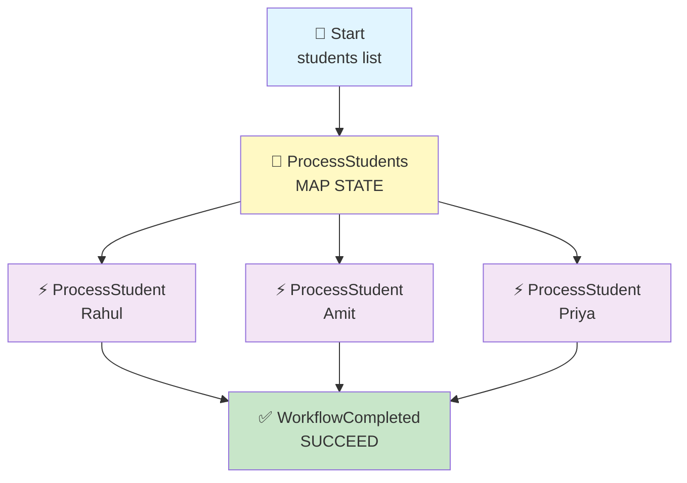
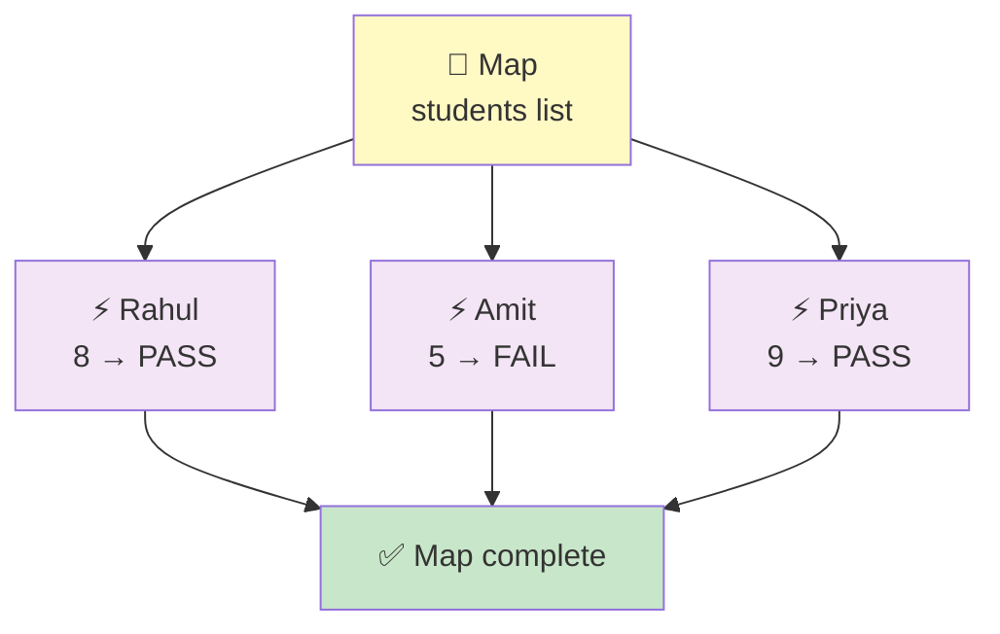

# Step Functions → Map State → Lambda

## One Lambda Runs Once for Every Student in the List

## 🎯 Goal

Suppose we receive **3 students** in one input:

```text
Rahul
Amit
Priya
```

We want Step Functions to process **each student separately**.

Instead of creating three separate paths like:

```text
Lambda → Rahul
Lambda → Amit
Lambda → Priya
```

we use **ONE Lambda + Map**:

```text
                 Step Functions
                       ↓
                      Map
                 /     |     \
                ↓      ↓      ↓
           Lambda    Lambda   Lambda
           Rahul      Amit     Priya
                 \     |     /
                  ↓    ↓    ↓
               All completed
                      ↓
                    Done
```

### Easy Meaning

> **Map = Repeat the same task for every item in a list.**

## 🧠 Simple Example

Input:

```json
{
  "students": [
    { "name": "Rahul", "marks": 8 },
    { "name": "Amit",  "marks": 5 },
    { "name": "Priya", "marks": 9 }
  ]
}
```

Map counts the items:

```text
students = 3
```

So it runs the Lambda **3 times**:

```text
Student 1 → Rahul → Lambda
Student 2 → Amit  → Lambda
Student 3 → Priya → Lambda
```

## Architecture



---

## 📦 What We Need

| Service | Resource |
| ------- | -------- |
| IAM | Step Functions execution role |
| Lambda | `process-student` |
| Step Functions | `map-student-workflow` |
| CloudWatch | Lambda logs |

> 💡 Only **one Lambda** is required. Map calls the same Lambda once per student.

## 🔐 IAM Role

We use **ONE IAM role**, and both Step Functions and Lambda share it.

### 📍 Go to: IAM Console → Roles → Create role → **Custom trust policy**

### Role Name

```text
stepfunctions-map-demo-role
```

### Trust Policy

```json
{
    "Version": "2012-10-17",
    "Statement": [
        {
            "Sid": "",
            "Effect": "Allow",
            "Principal": {
                "Service": [
                    "states.amazonaws.com",
                    "lambda.amazonaws.com"
                ]
            },
            "Action": "sts:AssumeRole"
        }
    ]
}
```

### 🧠 What This Trust Policy Means

| Service | Why It Is There |
|---------|-----------------|
| `states.amazonaws.com` | So **Step Functions** can invoke the Lambda |
| `lambda.amazonaws.com` | So **Lambda** can run and write its logs |

> 💡 The trust policy is the **door**. The managed policies below are **what you can do after entering**.

### Attach Managed Policies

| # | Managed Policy | Its Job |
|---|----------------|---------|
| 1 | `AWSLambdaBasicExecutionRole` | Lets Lambda write logs to CloudWatch |
| 2 | `AWSLambdaRole` | Lets Step Functions invoke Lambda |

Click **Create role**.

> 💡 **Already built an earlier pipeline?** You can reuse that role instead of making a new one — just choose it from the *Use an existing role* dropdown in the next step.

---

## 🐍 Step 1: Create the Lambda

1. Go to **Lambda Console** → **Functions** → **Create function**
2. Choose: **Author from scratch**

| Setting | Value |
|---------|-------|
| Function name | `process-student` |
| Runtime | Python 3.x (select latest available) |
| Execution role | Use an existing role → `stepfunctions-map-demo-role` |

### 💻 Lambda Code

```python
from datetime import datetime
from zoneinfo import ZoneInfo


def lambda_handler(event, context):

    print("====================================")
    print("       STUDENT LAMBDA STARTED")
    print("====================================")

    print(f"Received student data: {event}")

    student_name = event["name"]
    marks = event["marks"]

    # Current IST time
    ist_time = datetime.now(
        ZoneInfo("Asia/Kolkata")
    )

    print(f"Student Name : {student_name}")
    print(f"Student Marks: {marks}")
    print(
        f"Processing Time (IST): "
        f"{ist_time.strftime('%Y-%m-%d %H:%M:%S %Z')}"
    )

    print("Checking student result...")

    if marks > 7:

        status = "PASS"

        print(
            f"{student_name} has PASSED "
            f"with {marks} marks."
        )

    else:

        status = "FAIL"

        print(
            f"{student_name} has FAILED "
            f"with {marks} marks."
        )

    result = {
        "student": student_name,
        "marks": marks,
        "status": status,
        "processed_time_ist": ist_time.strftime(
            "%Y-%m-%d %H:%M:%S %Z"
        )
    }

    print(f"Returning result: {result}")

    print("====================================")
    print("       STUDENT LAMBDA FINISHED")
    print("====================================")

    return result
```

Click **Deploy**.

### 🧠 Important: What Does the Lambda Receive?

The Lambda receives **one student only**, not the whole list:

```json
{ "name": "Rahul", "marks": 8 }
```

That is the whole point of Map — it hands out **one item at a time**. So the Lambda code is simple: it handles a single student. ✅

---

## 🛠️ Step 2: Create the Step Functions State Machine

1. Go to **Step Functions Console** → **State machines** → **Create state machine**
2. Choose: **Write your workflow in code**
3. Type: **Standard**

| Setting | Value |
|---------|-------|
| Name | `map-student-workflow` |
| Execution role | Use an existing role → `stepfunctions-map-demo-role` |

### 📝 State Machine Code

```json
{
  "StartAt": "ProcessStudents",
  "States": {

    "ProcessStudents": {
      "Type": "Map",

      "ItemsPath": "$.students",

      "Iterator": {
        "StartAt": "ProcessStudent",
        "States": {

          "ProcessStudent": {
            "Type": "Task",
            "Resource": "YOUR_LAMBDA_ARN",
            "End": true
          }

        }
      },

      "Next": "WorkflowCompleted"
    },

    "WorkflowCompleted": {
      "Type": "Succeed"
    }
  }
}
```

> ⚠️ Replace `YOUR_LAMBDA_ARN` with your real Lambda ARN.

Click **Create**.

---

## 🧠 Understand the Important Parts

Don't try to remember the whole JSON. Just understand these three:

### 1. Map

```json
"Type": "Map"
```

> **Repeat this processing for every item.**

### 2. ItemsPath

```json
"ItemsPath": "$.students"
```

This is **very important**. It tells Step Functions:

> **Get the list from `students`.**

Our input contains:

```json
{
  "students": [
    { ... },
    { ... },
    { ... }
  ]
}
```

So Map takes that list and works through it, one item at a time.

### 3. Iterator

```json
"Iterator": {
```

> **What should happen to each item?**

In our example:

```text
Each student
     ↓
  Lambda
```

> 💡 **Name it well:** the Map state is called `ProcessStudents` (the whole list) and the inner state is called `ProcessStudent` (one student). That one letter difference makes the diagram easy to read. ✅

---

## 📥 Step 3: Start an Execution

Go to: **Step Functions** → `map-student-workflow` → **Start execution**

Enter:

```json
{
  "students": [
    {
      "name": "Rahul",
      "marks": 8
    },
    {
      "name": "Amit",
      "marks": 5
    },
    {
      "name": "Priya",
      "marks": 9
    }
  ]
}
```

Click **Start execution**.

---

## 🔄 What Happens?

Step Functions receives **3 students**. Map starts working through them:

```text
                 MAP
                  │
        ┌─────────┼─────────┐
        ↓         ↓         ↓
      Rahul      Amit      Priya
        ↓         ↓         ↓
     Lambda     Lambda    Lambda
        ↓         ↓         ↓
      PASS       FAIL      PASS
        \         |         /
         \        |        /
          ↓       ↓       ↓
            MAP COMPLETE
                  ↓
               Succeed
                  ↓
               DONE ✅
```



---

## ☁️ Step 4: Check CloudWatch Logs

Go to: **Lambda** → `process-student` → **Monitor** → **View CloudWatch logs**

### Rahul

```text
====================================
       STUDENT LAMBDA STARTED
====================================

Received student data:
{'name': 'Rahul', 'marks': 8}

Student Name : Rahul
Student Marks: 8
Processing Time (IST): 2026-09-12 19:40:10 IST

Checking student result...

Rahul has PASSED with 8 marks.

Returning result:
{
    'student': 'Rahul',
    'marks': 8,
    'status': 'PASS',
    'processed_time_ist': '2026-09-12 19:40:10 IST'
}

====================================
       STUDENT LAMBDA FINISHED
====================================
```

### Amit

```text
====================================
       STUDENT LAMBDA STARTED
====================================

Received student data:
{'name': 'Amit', 'marks': 5}

Student Name : Amit
Student Marks: 5
Processing Time (IST): 2026-09-12 19:40:10 IST

Checking student result...

Amit has FAILED with 5 marks.

Returning result:
{
    'student': 'Amit',
    'marks': 5,
    'status': 'FAIL',
    'processed_time_ist': '2026-09-12 19:40:10 IST'
}

====================================
       STUDENT LAMBDA FINISHED
====================================
```

### Priya

```text
====================================
       STUDENT LAMBDA STARTED
====================================

Received student data:
{'name': 'Priya', 'marks': 9}

Student Name : Priya
Student Marks: 9
Processing Time (IST): 2026-09-12 19:40:11 IST

Checking student result...

Priya has PASSED with 9 marks.

Returning result:
{
    'student': 'Priya',
    'marks': 9,
    'status': 'PASS',
    'processed_time_ist': '2026-09-12 19:40:11 IST'
}

====================================
       STUDENT LAMBDA FINISHED
====================================
```

> 📌 The exact timestamps can differ slightly. In the Step Functions console, you can open the Map state and see each item's own result — that is the easiest way to confirm all three ran.

---

## ⭐ The Most Important Difference: Parallel vs Map

This is **very important for interviews**.

### Parallel (folder 06)

You know **exactly** which branches you want:

```text
Parallel
 ├── Lambda A
 ├── Lambda B
 └── Lambda C
```

> **3 different, fixed branches.**

### Map (this pipeline)

You have a **list** of items and want the **same processing** for each:

```text
Students: [Rahul, Amit, Priya]

Map
 ├── Rahul → Same Lambda
 ├── Amit  → Same Lambda
 └── Priya → Same Lambda
```

> **Same job repeated for every item.**

### 🧠 The Big Win

If tomorrow you receive **100 students**:

```text
100 students
     ↓
    Map
     ↓
Same Lambda, run 100 times
```

You do **not** need to create 100 states by hand. That is why Map is so useful. ✅

### 🆚 Side by Side

| | **Parallel** | **Map** |
|---|---|---|
| Branches | Fixed, hand-written | One per item in a list |
| How many run? | Exactly as many as you wrote | As many as the list has |
| Each branch does | Can be different work | The **same** work |
| Input to each | The same input | One item from the list |
| Use when | You know the steps | You know the list |

---

## 🧠 Easy Way to Remember

```text
Parallel → RUN DIFFERENT BRANCHES TOGETHER
Map      → REPEAT SAME PROCESS FOR A LIST
```

Or shorter:

```text
Parallel → A + B + C
Map      → A + A + A + A + A
```

---

## 🧩 All the States So Far

| State | Easy Meaning | Calls Something? |
| ----- | ------------ | ---------------- |
| **Pass** | Pass / prepare data | ❌ No |
| **Choice** | Make a decision | ❌ No |
| **Task** | Do / call something | ✅ Yes |
| **Wait** | Pause the workflow | ❌ No |
| **Succeed** | End successfully | ❌ No |
| **Fail** | End with failure | ❌ No |
| **Parallel** | Run branches together | ✅ Yes (via branches) |
| **Map** | Repeat for each item | ✅ Yes (via items) |

```text
Pass     → PASS / PREPARE DATA
Choice   → MAKE DECISION
Task     → DO SOMETHING
Wait     → PAUSE
Succeed  → SUCCESS + END
Fail     → ERROR + STOP
Parallel → RUN MULTIPLE BRANCHES
Map      → REPEAT FOR EACH ITEM
```

---

## ⚠️ Common Mistakes

| Mistake | What Happens | Fix |
|---------|--------------|-----|
| Lambda expects the whole list | It gets one student, so `event["students"]` fails | Read `event["name"]` and `event["marks"]` directly |
| Wrong `ItemsPath` | Map finds no list and fails | It must match your key exactly — `$.students` |
| Sending the list without the wrapper key | `$.students` not found | Wrap it: `{"students": [ ... ]}` |
| Forgetting `ItemsPath` for a top-level array | Map may not find items | Add `ItemsPath: "$"` if the input **is** the array |
| Thinking Parallel and Map are the same | Wrong design choice | Parallel = fixed branches, Map = one per item |
| Expecting one Lambda per student in the console | Only one Lambda function exists | Map calls the **same** function many times |

---

## 🧩 Full Step List (Quick Reference)

| Step | What to Do |
|------|-----------|
| 1 | IAM → Roles → Create role → **Custom trust policy** |
| 2 | Paste the trust policy, attach `AWSLambdaBasicExecutionRole` + `AWSLambdaRole` |
| 3 | Role name: `stepfunctions-map-demo-role` |
| 4 | Lambda → Create function → `process-student` (Python 3.x) |
| 5 | Execution role: existing → `stepfunctions-map-demo-role` |
| 6 | Paste the Lambda code → **Deploy** |
| 7 | Copy the Lambda ARN |
| 8 | Step Functions → State machines → Create state machine |
| 9 | Choose **Write your workflow in code** → type **Standard** |
| 10 | Name: `map-student-workflow` |
| 11 | Paste the state machine code → replace `YOUR_LAMBDA_ARN` |
| 12 | Execution role: existing → `stepfunctions-map-demo-role` |
| 13 | Create the state machine |
| 14 | Start execution with the 3-student JSON input |
| 15 | Map runs the Lambda once per student |
| 16 | Check CloudWatch → three separate runs (Rahul, Amit, Priya) |
| 17 | Workflow reaches **Succeeded** ✅ |

---

## 🎤 Interview Explanation

**Q: "What is a Map state in Step Functions?"**

> **"A Map state is used to process every item in a list with the same set of steps. In my pipeline, the input contains a list of students, and I used ItemsPath to point at that list. The Map state takes each student one at a time and passes it to the Iterator, which contains a single Task state that invokes a Lambda function. The Lambda receives one student, checks the marks, and returns a PASS or FAIL result. All three students were processed, and the workflow reached a Succeed state afterwards. The important difference from a Parallel state is that Parallel runs a fixed set of branches that I write by hand, while Map runs the same processing once for each item in the collection. If the list grows to a hundred students, I don't need to change the state machine at all."**

---

## ⭐ One-Line Summary

```text
Step Functions
      ↓
     Map                      ← looks at the list
   /  |  \
Rahul Amit Priya              ← one item each
  ↓    ↓    ↓
Same Lambda, 3 times
  ↓
Succeed ✅
```

> **Main purpose: show that a Map state repeats the same work for every item in a list, so you do not have to write a separate branch for each one.**

---

## Summary

| Component | What It Does |
|-----------|--------------|
| **Lambda** (`process-student`) | Receives ONE student, checks marks, returns PASS or FAIL |
| **Map State** (`ProcessStudents`) | Takes the list from `$.students`, runs the Iterator once per item |
| **Iterator** (`ProcessStudent`) | The Task that invokes the Lambda |
| **Succeed State** (`WorkflowCompleted`) | Ends the workflow successfully |
| **CloudWatch Logs** | Shows one run per student |

This pipeline shows the **Map state = REPEAT FOR EACH ITEM** idea — the clean way to handle a **list** of items without writing one branch per item.
