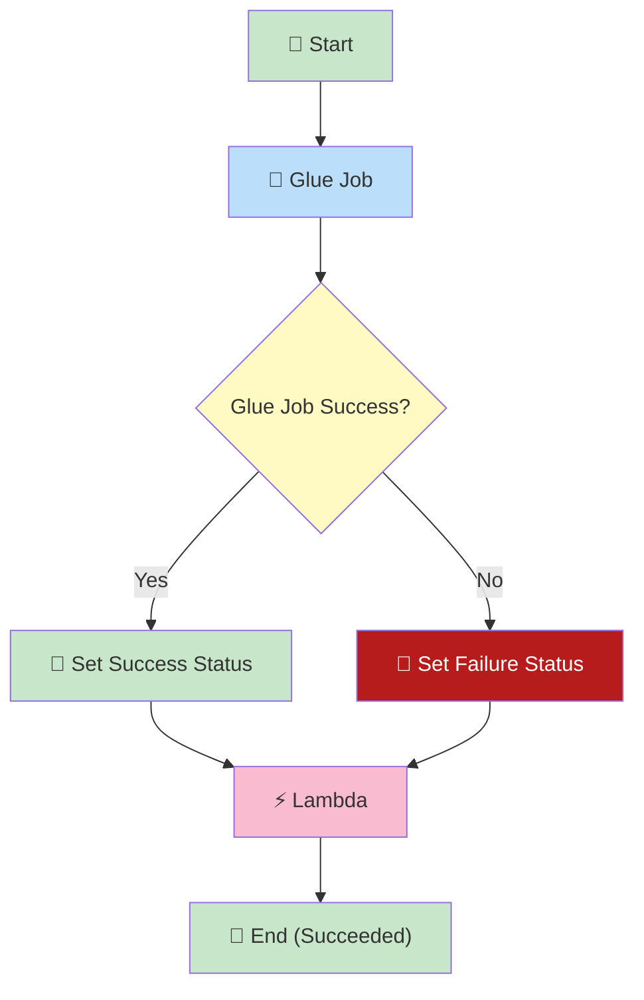
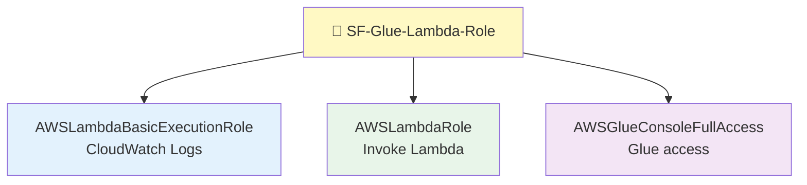
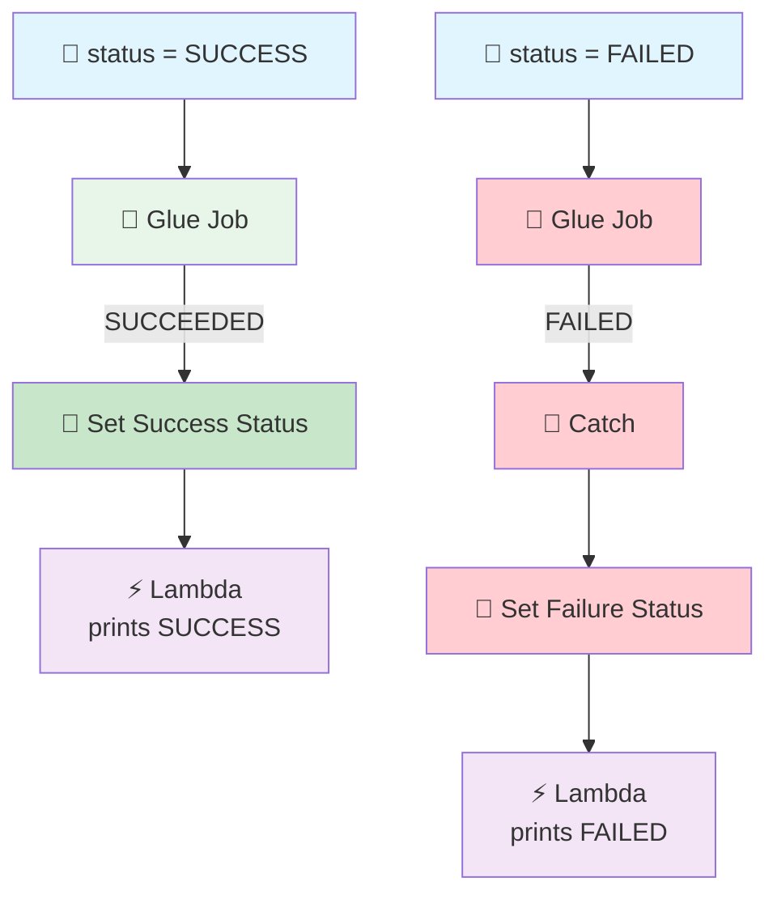

# Step Functions → Glue → Lambda Pipeline

## Step Functions Runs Glue, Waits for It, Then Sends the Result to Lambda

## 🎯 Goal

We want Step Functions to **control a Glue job**, **wait** for that Glue job to finish, and then **send the final result to Lambda**.

The execution input decides whether the Glue job should **succeed** or **fail**.

### SUCCESS Flow

```text
Step Functions
      ↓
status = SUCCESS
      ↓
Glue
      ↓
Glue succeeds
      ↓
Step Functions waits
      ↓
Lambda
      ↓
Print SUCCESS
```

### FAILED Flow

```text
Step Functions
      ↓
status = FAILED
      ↓
Glue
      ↓
Glue fails
      ↓
Step Functions catches the failure
      ↓
Lambda
      ↓
Print FAILED
```

## 🧠 The Big Idea

> **Step Functions starts Glue and WAITS for it to finish — then Lambda runs.**

Lambda does **not** run immediately. It runs **after** Glue is done. This is called running **synchronously** (`.sync`).

## 📊 Pipeline Flowchart


> 📌 **Save the flowchart in this folder as `architecture.png`** for it to show above.

Here is the same flow as a diagram that always renders:



### 🧠 Reading the Flowchart

| Step | What Happens |
|------|--------------|
| **Start** | Execution begins with the input status |
| **Glue Job** | Step Functions starts Glue and **waits** (`.sync`) |
| **Glue Job Success?** | Step Functions asks: did the Glue job finish well? |
| **Yes → Set Success Status** | A Pass state builds `{glue_job_name, status: SUCCESS}` |
| **No → Set Failure Status** | A Pass state builds `{glue_job_name, status: FAILED}` |
| **Lambda** | Runs once, with whichever payload came through |
| **End (Succeeded)** | The workflow finishes successfully |

> ⭐ **Note the ending:** both paths finish at **End (Succeeded)**. Even when Glue fails, the **workflow itself succeeds**, because `Catch` handled the failure. That is the whole point of catching the error instead of letting it break the workflow.

---

## 📦 AWS Resources We Need

| Sr. No. | AWS Service | Resource |
| ------- | ----------- | -------- |
| 1 | IAM | Common IAM role |
| 2 | Step Functions | State machine |
| 3 | Glue | Glue job |
| 4 | Lambda | Lambda function |
| 5 | CloudWatch | Logs |

---

## 🔐 Step 1: Create ONE IAM Role

For this practice project we use **one common IAM role** shared by:

```text
Step Functions
Glue
Lambda
```

### Role Name

```text
SF-Glue-Lambda-Role
```

### 📍 Go to: IAM → Roles → Create role → **Custom trust policy**

### Trusted Entities

The role must trust **three** AWS services:

```text
states.amazonaws.com
glue.amazonaws.com
lambda.amazonaws.com
```

### Trust Policy

```json
{
  "Version": "2012-10-17",
  "Statement": [
    {
      "Effect": "Allow",
      "Principal": {
        "Service": [
          "states.amazonaws.com",
          "glue.amazonaws.com",
          "lambda.amazonaws.com"
        ]
      },
      "Action": "sts:AssumeRole"
    }
  ]
}
```

### 🧠 What This Trust Policy Means

| Service | Why It Is There |
|---------|-----------------|
| `states.amazonaws.com` | So **Step Functions** can start the Glue job and invoke Lambda |
| `glue.amazonaws.com` | So the **Glue job** can run using this role |
| `lambda.amazonaws.com` | So **Lambda** can run and write its logs |

> 💡 The trust policy is the **door**. The managed policies below are **what you can do after entering**.

---

## 📜 Step 2: Attach AWS Managed Policies

**No inline policy.** We attach only AWS managed policies.

### 1. `AWSLambdaBasicExecutionRole`

```text
Lambda
   ↓
CloudWatch Logs
```

Gives Lambda the permissions it needs to write logs to CloudWatch.

### 2. `AWSLambdaRole`

```text
Step Functions
       ↓
   Invoke Lambda
```

This policy provides `lambda:InvokeFunction` — exactly what Step Functions needs to call your Lambda.

### 3. `AWSGlueConsoleFullAccess`

```text
Step Functions
       ↓
     Glue
```

Gives broad Glue permissions (including `glue:*`) and also includes some Glue-related `iam:PassRole` permissions.

### ✅ Final Managed Policies

```text
SF-Glue-Lambda-Role
│
├── AWSLambdaBasicExecutionRole
│
├── AWSLambdaRole
│
└── AWSGlueConsoleFullAccess
```



> ✅ **We are NOT creating any inline policy.**

Click **Create role**.

---

## 🧩 Step 3: Create the Glue Job

Go to **AWS Glue** → **ETL jobs** → **Create job**.

| Setting | Value |
| ------- | ----- |
| Job name | `SF-to-glue-to-lambda` |
| IAM Role | `SF-Glue-Lambda-Role` |
| Script | The Glue code below |

The Glue job receives the status from Step Functions:

```text
--status SUCCESS

--status FAILED
```

## 💻 Step 4: Glue Code

```python
import sys
from awsglue.utils import getResolvedOptions

print("===================================")
print("Glue Job Started")
print("===================================")

# Get status passed from Step Functions
args = getResolvedOptions(sys.argv, ["status"])

status = args["status"].upper()

print(f"Status received from Step Functions: {status}")

try:

    print("Processing started...")

    # ==========================================
    # SUCCESS
    # ==========================================

    if status == "SUCCESS":

        print("Step Functions requested SUCCESS")
        print("Processing completed successfully")

    # ==========================================
    # FAILURE
    # ==========================================

    elif status == "FAILED":

        print("Step Functions requested FAILED")
        print("Intentionally failing Glue job...")

        raise Exception(
            "Glue job failed as requested by Step Functions"
        )

    # ==========================================
    # INVALID STATUS
    # ==========================================

    else:

        raise Exception(
            f"Invalid status received from Step Functions: {status}"
        )

except Exception as e:

    print("===================================")
    print("Glue Job Failed")
    print("===================================")

    print(f"Error: {str(e)}")

    # Make sure Glue marks the job as FAILED
    raise

print("===================================")
print("Glue Job Completed Successfully")
print("===================================")
```

### 🔍 How the Glue Code Works

If Step Functions sends:

```text
--status SUCCESS
```

Glue does:

```text
SUCCESS
   ↓
Normal processing
   ↓
Glue SUCCEEDED ✅
```

If Step Functions sends:

```text
--status FAILED
```

Glue does:

```text
FAILED
   ↓
raise Exception()
   ↓
Glue FAILED ❌
```

> ⭐ **The `raise` is very important.** It makes the **actual Glue job status** become FAILED. If you only printed an error message without raising, Glue would still report SUCCESS and Step Functions would take the success path.

---

## ⚡ Step 5: Create the Step Functions State Machine

Go to **Step Functions** → **State machines** → **Create state machine**.

| Setting | Value |
| ------- | ----- |
| Workflow type | **Standard** |
| Option | **Write your workflow in code** |
| Name | `SF-to-glue-to-lambda-workflow` |
| Execution role | Use an existing role → `SF-Glue-Lambda-Role` |

### 📝 State Machine JSON

```json
{
  "Comment": "Step Functions runs Glue based on input status and sends result to Lambda",

  "StartAt": "Run Glue Job",

  "States": {

    "Run Glue Job": {
      "Type": "Task",

      "Resource": "arn:aws:states:::glue:startJobRun.sync",

      "Parameters": {
        "JobName": "YOUR GLUE JOB NAME",
        "Arguments": {
          "--status.$": "$.status"
        }
      },

      "ResultPath": "$.GlueResult",

      "Catch": [
        {
          "ErrorEquals": [
            "States.ALL"
          ],
          "ResultPath": "$.GlueError",
          "Next": "Set Failure Status"
        }
      ],

      "Next": "Set Success Status"
    },

    "Set Success Status": {
      "Type": "Pass",

      "Parameters": {
        "glue_job_name": "YOUR GLUE JOB NAME",
        "status": "SUCCESS"
      },

      "Next": "Send To Lambda"
    },

    "Set Failure Status": {
      "Type": "Pass",

      "Parameters": {
        "glue_job_name": "YOUR GLUE JOB NAME",
        "status": "FAILED"
      },

      "Next": "Send To Lambda"
    },

    "Send To Lambda": {
      "Type": "Task",

      "Resource": "arn:aws:states:::lambda:invoke",

      "Parameters": {
        "FunctionName": "YOUR LAMBDA FUNCTION ARN",
        "Payload.$": "$"
      },

      "End": true
    }
  }
}
```

### ⚠️ Replace the Placeholders Before Using

The JSON uses placeholders instead of hardcoded names. Replace **all three** with your own values:

| Placeholder | Where It Appears | Replace With |
|-------------|------------------|--------------|
| `YOUR GLUE JOB NAME` | `JobName` in `Run Glue Job` | Your Glue job name |
| `YOUR GLUE JOB NAME` | `glue_job_name` in both Pass states | The **same** Glue job name |
| `YOUR LAMBDA FUNCTION ARN` | `FunctionName` in `Send To Lambda` | Your real Lambda ARN |

> 📌 **Both `YOUR GLUE JOB NAME` values must be the same name.** One starts the job, and the other two just report it back to Lambda.
>
> 💡 Throughout this guide the **example** names are `SF-to-glue-to-lambda` for the Glue job and the Lambda function. If you used different names, put your own names in the placeholders above.

### 🧠 Understand the Four States

| State | Type | What It Does |
|-------|------|--------------|
| `Run Glue Job` | Task | Starts Glue and **waits** for it (`.sync`) |
| `Set Success Status` | Pass | Builds `{glue_job_name, status: SUCCESS}` |
| `Set Failure Status` | Pass | Builds `{glue_job_name, status: FAILED}` |
| `Send To Lambda` | Task | Invokes Lambda with that data |

---

## ⭐ Important: What `.sync` Does

```json
"Resource": "arn:aws:states:::glue:startJobRun.sync"
```

The `.sync` at the end means:

```text
Start Glue
    ↓
WAIT
    ↓
Glue finishes
    ↓
Continue Step Functions
```

So:

> **Lambda is NOT called immediately. Step Functions waits for Glue to finish first.** ✅

Without `.sync`, Step Functions would start the job and move on right away — Lambda would run while Glue was still working.

---

## ⭐ Passing the Status to Glue

This is the key line:

```json
"Arguments": {
  "--status.$": "$.status"
}
```

The `.$` means: **take this value from the input**.

If the execution input is:

```json
{ "status": "SUCCESS" }
```

Glue receives:

```text
--status SUCCESS
```

If the execution input is:

```json
{ "status": "FAILED" }
```

Glue receives:

```text
--status FAILED
```

> 📌 In Glue code, the leading `--` disappears — you read it as `args["status"]`. The `--` is just how Step Functions and Glue name job arguments.

---

## ⭐ How `Catch` Works

```json
"Catch": [
  {
    "ErrorEquals": ["States.ALL"],
    "ResultPath": "$.GlueError",
    "Next": "Set Failure Status"
  }
]
```

This says:

> **If any error happens in this state, do not fail the whole workflow. Save the error in `GlueError` and go to `Set Failure Status`.**

`States.ALL` means **any** error. So when Glue fails, Step Functions catches it and continues down the failure path instead of stopping. ✅

---

## 🐍 Step 6: Create the Lambda

| Setting | Value |
| ------- | ----- |
| Function name | `SF-to-glue-to-lambda` |
| Runtime | Python 3.x (select latest available) |
| Execution role | `SF-Glue-Lambda-Role` |

## 💻 Step 7: Lambda Code

```python
def lambda_handler(event, context):

    print("===================================")
    print("Lambda Started")
    print("===================================")

    print("Received event:")
    print(event)

    glue_job_name = event.get("glue_job_name")
    status = event.get("status")

    print(f"Glue Job Name : {glue_job_name}")
    print(f"Glue Job Status : {status}")

    if status == "SUCCESS":

        print("Glue Job completed successfully.")

    elif status == "FAILED":

        print("Glue Job failed.")

    else:

        print("Unknown Glue Job status.")

    print("===================================")
    print("Lambda Completed")
    print("===================================")

    return {
        "glue_job_name": glue_job_name,
        "status": status
    }
```

Click **Deploy**.

> 💡 Notice: Lambda reads `glue_job_name` and `status` — exactly the two values the **Pass** states built. That is why Step Functions uses a Pass state after Glue: to build a **clean, simple payload** for Lambda.

---

## 🧪 Step 8: Test SUCCESS

Start a Step Functions execution with:

```json
{
  "status": "SUCCESS"
}
```

### Flow

```text
Step Functions
      ↓
status = SUCCESS
      ↓
Glue
      ↓
--status SUCCESS
      ↓
Glue succeeds
      ↓
Step Functions waits
      ↓
Set Success Status
      ↓
Lambda
```

Lambda receives:

```json
{
  "glue_job_name": "SF-to-glue-to-lambda",
  "status": "SUCCESS"
}
```

Lambda prints:

```text
Glue Job Name : SF-to-glue-to-lambda
Glue Job Status : SUCCESS
Glue Job completed successfully.
```

---

## 🧪 Step 9: Test FAILED

Start **another execution** with:

```json
{
  "status": "FAILED"
}
```

### Flow

```text
Step Functions
      ↓
status = FAILED
      ↓
Glue
      ↓
--status FAILED
      ↓
Exception raised
      ↓
Glue = FAILED ❌
      ↓
Catch
      ↓
Set Failure Status
      ↓
Lambda
```

Lambda receives:

```json
{
  "glue_job_name": "SF-to-glue-to-lambda",
  "status": "FAILED"
}
```

Lambda prints:

```text
Glue Job Name : SF-to-glue-to-lambda
Glue Job Status : FAILED
Glue Job failed.
```

> ✅ Notice: the **workflow itself still SUCCEEDS**. Glue failed, Step Functions **caught** the failure and handled it. That is the point of `Catch`.

---

## ☁️ Step 10: Check CloudWatch Logs

Go to:

```text
CloudWatch
   ↓
Logs
   ↓
Log groups
   ↓
/aws/lambda/SF-to-glue-to-lambda
```

You will see the Lambda `print()` output there.

**For SUCCESS:**

```text
===================================
Lambda Started
===================================
Received event:
{'glue_job_name': 'SF-to-glue-to-lambda', 'status': 'SUCCESS'}
Glue Job Name : SF-to-glue-to-lambda
Glue Job Status : SUCCESS
Glue Job completed successfully.
===================================
Lambda Completed
===================================
```

**For FAILED:**

```text
===================================
Lambda Started
===================================
Received event:
{'glue_job_name': 'SF-to-glue-to-lambda', 'status': 'FAILED'}
Glue Job Name : SF-to-glue-to-lambda
Glue Job Status : FAILED
Glue Job failed.
===================================
Lambda Completed
===================================
```

> 💡 Also check the **Glue job run logs** (Glue → ETL jobs → `SF-to-glue-to-lambda` → Runs) to see the Glue-side messages and the raised error.

---

## 🔄 Complete Pipeline

### SUCCESS Path

```text
                 INPUT
                   │
                   ▼
          {"status":"SUCCESS"}
                   │
                   ▼
            Step Functions
                   │
                   │ --status SUCCESS
                   ▼
                 Glue
                   │
                   ▼
               SUCCEEDED
                   │
                   ▼
          Set Success Status
                   │
                   ▼
                Lambda
                   │
                   ▼
               SUCCESS ✅
```

### FAILED Path

```text
                 INPUT
                   │
                   ▼
          {"status":"FAILED"}
                   │
                   ▼
            Step Functions
                   │
                   │ --status FAILED
                   ▼
                 Glue
                   │
                   ▼
                FAILED ❌
                   │
                   ▼
                 Catch
                   │
                   ▼
          Set Failure Status
                   │
                   ▼
                Lambda
                   │
                   ▼
                FAILED
```



---

## ⚠️ Common Mistakes

| Mistake | What Happens | Fix |
|---------|--------------|-----|
| Forgetting `.sync` | Lambda runs while Glue is still working | Use `startJobRun.sync` |
| Glue code prints an error but does not `raise` | Glue reports SUCCESS, so the success path runs | Keep the `raise` |
| No `Catch` on the Glue task | The whole workflow FAILS on a Glue error | Add `Catch` with `States.ALL` |
| Lambda ARN not replaced | Execution fails with `ResourceNotFoundException` | Paste your real ARN |
| Trust policy missing `glue.amazonaws.com` | Glue job cannot use the role | Add all three services |
| Wrong job name in `Parameters` | Glue throws `EntityNotFoundException` | Match the Glue job name exactly |
| Sending `status` lowercase | Inner `else` branch raises "Invalid status" | Send `SUCCESS` or `FAILED` |

---

## 🧩 Full Step List (Quick Reference)

| Step | What to Do |
|------|-----------|
| 1 | IAM → Roles → Create role → **Custom trust policy** |
| 2 | Paste the trust policy with `states`, `glue`, `lambda` |
| 3 | Attach `AWSLambdaBasicExecutionRole`, `AWSLambdaRole`, `AWSGlueConsoleFullAccess` |
| 4 | Role name: `SF-Glue-Lambda-Role` |
| 5 | Glue → ETL jobs → Create job → `SF-to-glue-to-lambda` |
| 6 | Set job IAM role to `SF-Glue-Lambda-Role` |
| 7 | Paste the Glue code (uses `getResolvedOptions` for `status`) |
| 8 | Lambda → Create function → `SF-to-glue-to-lambda` |
| 9 | Execution role: `SF-Glue-Lambda-Role` |
| 10 | Paste the Lambda code → **Deploy** |
| 11 | Copy the Lambda ARN |
| 12 | Step Functions → State machines → Create state machine |
| 13 | Type **Standard** → write in code |
| 14 | Name: `SF-to-glue-to-lambda-workflow` |
| 15 | Paste the JSON → replace the Lambda ARN |
| 16 | Execution role: existing → `SF-Glue-Lambda-Role` |
| 17 | Create the state machine |
| 18 | Start execution with `{"status": "SUCCESS"}` ✅ |
| 19 | Start execution with `{"status": "FAILED"}` → Glue fails, Catch handles it |
| 20 | Check Lambda logs in CloudWatch for both runs |
| 21 | Check Glue run logs for both runs |

---

## 🎤 Interview Explanation

**Q: "How does Step Functions interact with Glue?"**

> **"Step Functions starts the Glue job using the Glue `.sync` integration. The `.sync` integration makes Step Functions wait until the Glue job completes. I pass the status from the Step Functions input to Glue as a job argument using the `.$` syntax. If the status is SUCCESS, Glue completes successfully. If the status is FAILED, Glue raises an exception and the job fails. Step Functions catches that failure with a Catch block on `States.ALL`, and then a Pass state builds a clean payload with the Glue job name and the final status. Finally a Lambda function is invoked with that payload. The key concept is that Step Functions waits synchronously for Glue before Lambda runs, and it handles both the success and failure paths inside a single workflow."**

---

## ⭐ One-Line Summary

```text
Step Functions
      ↓
   Glue  (.sync → wait for completion)
      ↓
  ┌───┴────┐
SUCCESS   FAILED
  ↓         ↓
  └───┬────┘
      ↓
   Lambda
```

> **Main purpose: Step Functions starts Glue, waits for it to finish, handles success and failure, and sends the final status to Lambda.**

---

## ⚠️ One IAM Point You Should Know

You asked for **managed policies only**, and the three policies above are exactly what you requested. But AWS managed policies are **broad**:

- `AWSGlueConsoleFullAccess` is designed for **full Glue console access**, not for a least-privilege execution role.
- It includes `glue:*` and some `iam:PassRole` permissions.

For **your practice / interview pipeline** this is perfectly fine and keeps IAM simple:

```text
                 SF-Glue-Lambda-Role
                         │
          ┌──────────────┼──────────────┐
          ▼              ▼              ▼
AWSLambdaBasic     AWSLambdaRole    AWSGlueConsole
ExecutionRole                        FullAccess
          │              │              │
          ▼              ▼              ▼
     CloudWatch       Invoke        Glue access
        Logs          Lambda
```

> 💡 For production, you would replace these with a **custom least-privilege policy** limited to the exact job and function you use. No inline policy is required for this practice version.

---

## Summary

| Component | What It Does |
|-----------|--------------|
| **IAM Role** (`SF-Glue-Lambda-Role`) | One role for Step Functions + Glue + Lambda (no inline policy) |
| **Glue Job** (`SF-to-glue-to-lambda`) | Reads `--status`; succeeds or raises an exception on purpose |
| **Step Functions** | Starts Glue with `.sync`, waits, catches failures, then invokes Lambda |
| **Lambda** (`SF-to-glue-to-lambda`) | Prints the Glue job name and final status |
| **CloudWatch Logs** | Shows the Lambda output and the Glue run output |

This pipeline shows **synchronous orchestration**: Step Functions controls Glue, waits for it to finish, and passes the result on — a very common pattern for real data pipelines.
