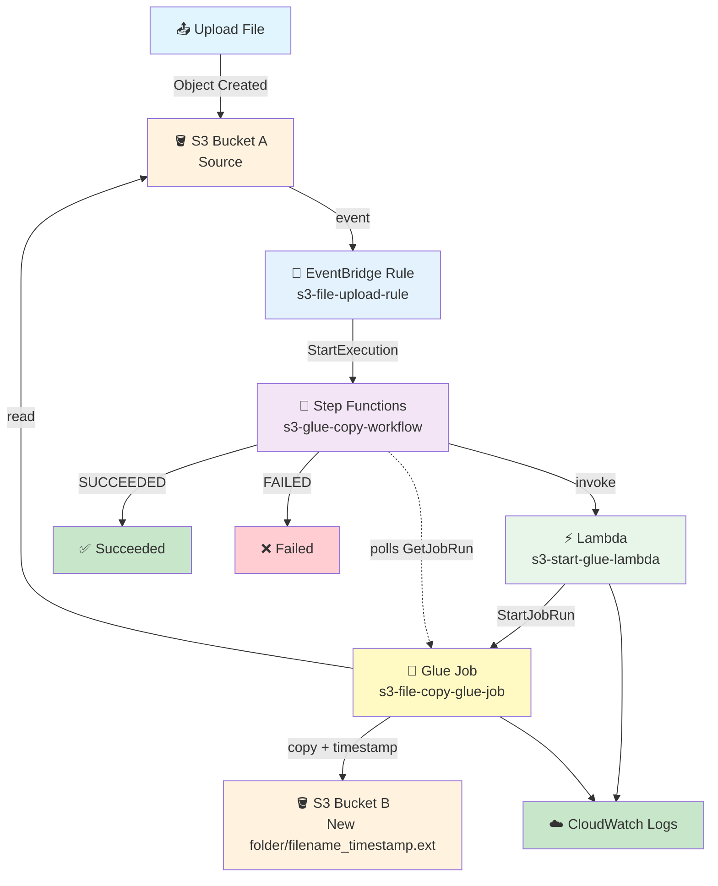

# S3 → EventBridge → Step Functions → Lambda → Glue → S3 Pipeline

## File Upload → EventBridge → Step Functions → Lambda Starts Glue → Glue Copies to Bucket B → Success or Failure

## 📁 Files in This Folder

| File | What It Is |
| ---- | ---------- |
| [lambda_function.py](lambda_function.py) | The Lambda handler — reads the S3 event and starts the Glue job, returning its run ID |
| [glue_job.py](glue_job.py) | The Glue script — copies the file from Bucket A into `New folder/` in Bucket B with an IST timestamp |
| [state_machine.json](state_machine.json) | The complete Step Functions definition — start, poll, succeed or fail |
| [trust_policy.json](trust_policy.json) | The IAM trust policy for the shared role — EventBridge, Step Functions, Lambda and Glue |
| [eventbridge_pattern.json](eventbridge_pattern.json) | The EventBridge rule's event pattern — decides which S3 events trigger the workflow |

This README explains the **theory** — how the pieces fit together and why. The code itself lives in the files above.

## 🎯 Goal

When a file is uploaded to **Bucket A**:

1. S3 generates an object-created event.
2. EventBridge matches the rule and starts a Step Functions execution.
3. Step Functions invokes Lambda.
4. Lambda starts the Glue job, handing it the bucket and object key.
5. Step Functions **polls the Glue job** until it finishes.
6. Glue reads the file from Bucket A and copies it into `New folder/` inside **Bucket B**, adding an IST timestamp to the filename.
7. If Glue succeeds, Step Functions ends in **Succeeded**. If it fails, Step Functions ends in **Failed**.

The important part is step 5: **Lambda starts the job but does not wait for it.** Waiting is Step Functions' job, and that is what makes this pipeline different from the simpler ones in this repo.

## 🏢 Why This Pipeline?

This is the full "do real work on a file that just arrived" shape:

```text
A file arrives
     ↓
Something notices
     ↓
Something orchestrates
     ↓
Something does the data work
     ↓
You can see whether it worked
```

The three pieces are deliberately separate:

```text
EventBridge       → notices the file
Step Functions    → owns the workflow, the waiting, and the outcome
Glue              → does the actual copying
```

Because Step Functions owns the outcome, one Glue failure does not silently disappear — the execution goes red and you can see exactly which run failed and why.

## 🧠 What Each AWS Service Does

| AWS Service | Its Job |
| ----------- | ------- |
| **S3 Bucket A** | Stores the uploaded file (source) |
| **S3 EventBridge setting** | Sends S3 events to EventBridge |
| **EventBridge Rule** | Filters for Object Created events from Bucket A |
| **Step Functions** | Starts the workflow, polls Glue, decides success or failure |
| **Lambda** | Starts the Glue job and returns its run ID |
| **Glue** | Copies the file to Bucket B with a timestamp |
| **S3 Bucket B** | Stores `New folder/filename_timestamp.ext` |
| **CloudWatch** | Stores the Lambda and Glue logs |
| **IAM** | One shared role for all four services |

## Architecture



---

## 🔐 IAM: One Shared Role

Four services need to act, so one shared role keeps the practice setup small:

```text
EventBridge
Step Functions
Lambda
Glue
      ↓
S3-EventBridge-SFN-Lambda-Glue-Role
```

### Step 1: Create the Role

1. Go to **IAM** → **Roles** → **Create role**
2. Select **AWS service** → **Lambda**
3. Attach the managed policies listed below
4. Role name: `S3-EventBridge-SFN-Lambda-Glue-Role`
5. Click **Create role**

### Step 2: Trust Policy

Replace the trust policy with the contents of [trust_policy.json](trust_policy.json).

| Service | Why it needs to assume the role |
| ------- | ------------------------------- |
| `events.amazonaws.com` | EventBridge starts the Step Functions execution |
| `states.amazonaws.com` | Step Functions runs the workflow and polls Glue |
| `lambda.amazonaws.com` | Lambda runs and calls `glue:StartJobRun` |
| `glue.amazonaws.com` | The Glue job runs |

### Step 3: Managed Policies

AWS managed policies only — no inline policies:

```text
S3-EventBridge-SFN-Lambda-Glue-Role
│
├── AWSLambdaBasicExecutionRole     → Lambda writes CloudWatch logs
├── AWSLambdaRole                   → Step Functions invokes Lambda
├── AmazonS3FullAccess              → Glue reads Bucket A, writes Bucket B
├── AWSGlueServiceRole              → Glue runs its job
└── AWSStepFunctionsFullAccess      → EventBridge starts the execution
```

> ⚠️ `AmazonS3FullAccess` and `AWSStepFunctionsFullAccess` are deliberately broad to keep this practice setup simple. In production, scope them to the two buckets and the one state machine.

---

## 🪣 Step 4: Create Two S3 Buckets

| Bucket | Example Name | Purpose |
| ------ | ------------ | ------- |
| Bucket A | `kshitij-bucket-a` | Where you upload files |
| Bucket B | `kshitij-bucket-b` | Where the timestamped copies land |

### Bucket B after a run

```text
kshitij-bucket-b
│
└── New folder/
      │
      └── customer_data_2026-09-15_19-35-42.csv
```

## 📁 Step 5: Enable EventBridge for Bucket A

1. Go to **S3** → `kshitij-bucket-a` → **Properties**
2. Find **Event Notifications** → **Amazon EventBridge**
3. Click **Edit** → turn ON **Send notifications to Amazon EventBridge for all events in this bucket**
4. Click **Save changes**

---

## ⚡ Step 6: Create the Lambda Function

| Setting | Value |
| ------- | ----- |
| Function name | `s3-start-glue-lambda` |
| Runtime | Python 3.x (latest available) |
| Permissions | **Use an existing role** → `S3-EventBridge-SFN-Lambda-Glue-Role` |

Copy the code from [lambda_function.py](lambda_function.py) into the Lambda code editor, replacing the default handler. Click **Deploy**.

### ⚙️ Set the Glue Job Name

The job name is **not written in the code**. Lambda reads it from an environment variable:

1. **Lambda** → `s3-start-glue-lambda` → **Configuration** → **Environment variables**
2. Add:

| Key | Value |
| --- | ----- |
| `GLUE_JOB_NAME` | your Glue job name (example: `s3-file-copy-glue-job`) |

3. **Save**

### 🧠 Why Lambda Returns the Job Run ID

```python
response = glue.start_job_run(...)

job_run_id = response["JobRunId"]

return {
    "glue_job_name": GLUE_JOB_NAME,
    "job_run_id": job_run_id,
    ...
}
```

Lambda **starts** the job and immediately returns. It does not sit and wait — a Glue job can run for minutes, and holding a Lambda open for that is wasteful and eventually hits the 15-minute limit.

But somebody has to know when the job finishes. That somebody is Step Functions, and these two values are how it finds out: the job name and run ID become the state machine's input for the next state.

---

## 🔔 Step 7: Create the EventBridge Rule

| Setting | Value |
| ------- | ----- |
| Rule name | `s3-file-upload-rule` |
| Event bus | **default** |
| Rule type | **Rule with an event pattern** |
| Event source | **AWS events** |
| Service | **Amazon S3** |
| Event type | **Object Created** |

Copy the pattern from [eventbridge_pattern.json](eventbridge_pattern.json) into the **Event pattern** box and replace `YOUR SOURCE BUCKET` with your real Bucket A name. Note the bucket name sits **inside an array** — EventBridge requires array values in patterns.

### Target

| Setting | Value |
| ------- | ----- |
| Target type | **AWS service** |
| Select target | **Step Functions state machine** |
| State machine | `s3-glue-copy-workflow` |
| Execution role | `S3-EventBridge-SFN-Lambda-Glue-Role` |

---

## 🔄 Step 8: Create the Step Functions State Machine

| Setting | Value |
| ------- | ----- |
| Name | `s3-glue-copy-workflow` |
| Type | **Standard** |
| Permissions | **Use an existing role** → `S3-EventBridge-SFN-Lambda-Glue-Role` |

Copy the definition from [state_machine.json](state_machine.json) into the **Definition** editor and replace `YOUR LAMBDA FUNCTION ARN` with your real Lambda ARN.

### 🧠 How the Polling Works

This is the interesting part of the pipeline. The workflow is:

```text
Start Glue Job          (invoke Lambda, get job_run_id)
      ↓
Wait For Glue Job       (30 seconds)
      ↓
Check Glue Job Status   (glue:getJobRun)
      ↓
Glue Job Finished?      (Choice)
      ├── SUCCEEDED → Workflow Succeeded
      ├── FAILED    → Workflow Failed
      ├── TIMEOUT   → Workflow Failed
      ├── STOPPED   → Workflow Failed
      └── anything else (RUNNING) → back to Wait
```

The `Default` branch of the Choice state is what makes it a loop. While the job is `RUNNING`, the state machine keeps going round `Wait → Check → Choice` until the status changes.

### 🔑 Keeping the Job ID While Polling

```json
"ResultPath": "$.glue_status"
```

`GetJobRun` returns a big object. `ResultPath` writes it into a `glue_status` field **instead of replacing** the state's data. That matters because the loop needs `$.glue_job_name` and `$.job_run_id` on every pass — without `ResultPath`, the first poll would overwrite them and the second iteration would have nothing to poll with.

The Choice state then reads:

```json
"Variable": "$.glue_status.JobRun.JobRunState"
```

### 🛡️ Retry and Catch

```json
"Retry": [ ... Lambda.ServiceException, Lambda.TooManyRequestsException ... ],
"Catch": [ { "ErrorEquals": ["States.ALL"], "Next": "Workflow Failed" } ]
```

- **Retry** covers a transient hiccup when invoking Lambda — it is retried automatically rather than failing the workflow.
- **Catch** catches anything else on that state (for example Lambda failing to start the job at all) and routes to `Workflow Failed` instead of crashing the execution.

Together they mean every ending is one of two visible outcomes: **Succeeded** or **Failed**.

### ⏱️ Choosing the Wait Interval

`"Seconds": 30` is a compromise. A shorter interval notices completion sooner but calls `GetJobRun` more often; a longer one is cheaper but adds up to that much delay after the job ends. For a job that runs about five minutes, 30 seconds means you find out within half a minute.

### 🔔 Adding a Notification on Failure

To be told when a run fails, insert an SNS topic between `Workflow Failed` and the end:

```text
Glue Job Finished?
      └── FAILED → Publish to SNS → Workflow Failed
```

That means changing the three failure branches to point at an SNS `Publish` task, and giving that task `"Next": "Workflow Failed"`. The `Fail` state itself cannot publish anything — it just ends the execution.

---

## 🧪 Step 9: Create the Glue Job

1. Go to **AWS Glue** → **ETL jobs** → **Create job**
2. Job name: **any name you like** — this guide uses `s3-file-copy-glue-job`
   - ⚠️ Put the **same** name in the Lambda `GLUE_JOB_NAME` environment variable
3. IAM role: `S3-EventBridge-SFN-Lambda-Glue-Role`

Copy the code from [glue_job.py](glue_job.py) into the job's script editor. Change `DESTINATION_BUCKET` at the top to your real Bucket B name.

### 🧠 This Glue Job Uses No Spark

A file copy does not need a distributed engine. This script uses plain `boto3`:

```python
s3.copy_object(
    CopySource={"Bucket": source_bucket, "Key": source_key},
    Bucket=DESTINATION_BUCKET,
    Key=destination_key
)
```

`copy_object` is a **server-side copy** — S3 moves the bytes itself, so the file never passes through the Glue job's memory and the file size is irrelevant to whether it works.

That makes this job a good fit for a **Python Shell** job type, which starts far faster than a Spark job. It works as a Spark job too, since `boto3` and `awsglue.utils` are available either way.

### ⭐ No File Extension Is Hardcoded

```python
file_name, file_extension = os.path.splitext(original_file_name)

new_file_name = f"{file_name}_{timestamp}{file_extension}"
```

The timestamp goes **between** the two halves, so whatever extension arrives is carried across:

| Uploaded to Bucket A | Copied to Bucket B as |
| -------------------- | --------------------- |
| `customer_data.csv` | `New folder/customer_data_2026-09-15_19-35-42.csv` |
| `employee_data.txt` | `New folder/employee_data_2026-09-15_19-35-42.txt` |
| `report.xlsx` | `New folder/report_2026-09-15_19-35-42.xlsx` |
| `invoice.pdf` | `New folder/invoice_2026-09-15_19-35-42.pdf` |
| `README` | `New folder/README_2026-09-15_19-35-42` |

The last row is the one people forget: a file with no extension gives an empty `file_extension`, and the result is still correct. ✅

### 🇮🇳 The IST Timestamp

```python
ist = ZoneInfo("Asia/Kolkata")
timestamp = datetime.now(ist).strftime("%Y-%m-%d_%H-%M-%S")
```

The timezone is passed explicitly, so the timestamp is India Standard Time regardless of the Glue worker's default timezone. The time part uses `-` rather than `:` because colons in S3 keys are legal but awkward in URLs and tooling.

### ❗ Why the Script Re-raises

```python
except Exception as error:
    print(f"Error : {str(error)}")
    raise
```

The `raise` is deliberate. If the script swallowed the error, the Glue run would be marked **SUCCEEDED** and Step Functions would report the workflow as successful even though the copy never happened. Re-raising makes Glue mark the run **FAILED**, which is exactly the status the polling loop is waiting to see.

---

## 🧪 Step 10: Test the Pipeline

Upload any file to **Bucket A**. No code changes needed, whatever the file type.

### 🔄 What Happens After Upload?

```text
invoice.pdf arrives in Bucket A
        ↓
S3 creates: Object Created
        ↓
EventBridge rule matches (S3 + Object Created + Bucket A)
        ↓
EventBridge starts s3-glue-copy-workflow
        ↓
Step Functions invokes Lambda with the whole event
        ↓
Lambda calls glue.start_job_run(), returns job_run_id
        ↓
Step Functions waits 30 seconds
        ↓
Step Functions calls glue:getJobRun
        ↓
Status RUNNING? → loop back and wait again
        ↓
Glue reads from Bucket A, writes New folder/invoice_2026-09-15_19-35-42.pdf
        ↓
Status SUCCEEDED → Step Functions ends Succeeded
```

### ✅ Checking the Result

- **Step Functions** → `s3-glue-copy-workflow` → **Executions** — green = Succeeded, red = Failed. Click an execution to see the state-by-state timeline and the exact input and output of each state.
- **Lambda** → `s3-start-glue-lambda` → **Monitor** → **View CloudWatch logs**

```text
==================================================
STARTING GLUE JOB
==================================================
Glue Job      : s3-file-copy-glue-job
Source Bucket : kshitij-bucket-a
Source Key    : invoice.pdf
Job Run ID    : jr_abc123...
==================================================
```

- **Glue** → **ETL jobs** → `s3-file-copy-glue-job` → **Runs**

```text
==================================================
GLUE JOB STARTED
==================================================
Job Name      : s3-file-copy-glue-job
Source Bucket : kshitij-bucket-a
Source Key    : invoice.pdf
Destination   : s3://kshitij-bucket-b/New folder/
Folder Created: New folder/
Copied        : invoice.pdf -> invoice_2026-09-15_19-35-42.pdf
==================================================
GLUE JOB COMPLETED
==================================================
```

### 🧪 Testing the Failure Path

To see the red path, temporarily break the Glue script — for example point `DESTINATION_BUCKET` at a bucket that does not exist. The run fails, the polling loop sees `FAILED`, and the execution ends at **Workflow Failed** with:

```text
Error : GlueJobFailed
Cause : The Glue job did not complete successfully. Open the Glue run and read its logs.
```

Put it back afterwards.

---

## 🆚 How This Differs From the Other Pipelines Here

This repo already has two Glue pipelines. They are all genuinely different:

| | `06` EventBridge → Lambda → Glue | `11` Step Functions → Glue → Lambda | `13` this one |
| --- | --- | --- | --- |
| Trigger | S3 upload | manual input (`{"status": ...}`) | S3 upload |
| Who starts Glue | Lambda | Step Functions (`.sync`) | Lambda |
| Who waits for Glue | nobody | Step Functions (`.sync`) | Step Functions (polling) |
| Waiting mechanism | — | native `.sync` integration | `Wait` + `GetJobRun` + `Choice` loop |
| Outcome visible? | no | yes | yes |

The interesting comparison is **`11` versus `13`**. Both wait for a Glue job, but by different means:

- **`11`** uses `arn:aws:states:::glue:startJobRun.sync`. Step Functions starts the job **and** waits in a single state, using a built-in integration that AWS maintains.
- **`13`** splits it: Lambda starts the job, and Step Functions polls with `GetJobRun` in a loop.

`.sync` is less code and is usually the better choice. The polling loop here is worth understanding because the same shape appears whenever you need to wait on something that has no `.sync` integration — a container, a third-party API, a long-running query. The `Wait → Check → Choice → loop` pattern is the general solution.

---

## ⭐ One-Line Summary

```text
A file lands in Bucket A
     ↓
EventBridge matches the rule and starts Step Functions
     ↓
Step Functions invokes Lambda with the whole event
     ↓
Lambda starts the Glue job and returns the run ID
     ↓
Step Functions waits 30s, checks the job, loops while RUNNING
     ↓
Glue copies the file into New folder/ in Bucket B with an IST timestamp
     ↓
SUCCEEDED → workflow ends green
FAILED    → workflow ends red
```

> **Main purpose: upload a file to Bucket A and have it automatically copied into `New folder/` in Bucket B with an IST timestamp, with Step Functions waiting until the Glue job finishes and reporting success or failure.**

---

## 🧩 Full Step List (Quick Reference)

| Step | What to Do |
| ---- | ---------- |
| 1 | Create IAM role `S3-EventBridge-SFN-Lambda-Glue-Role` |
| 2 | Replace its trust policy with `trust_policy.json` (events + states + lambda + glue) |
| 3 | Attach `AWSLambdaBasicExecutionRole`, `AWSLambdaRole`, `AmazonS3FullAccess`, `AWSGlueServiceRole`, `AWSStepFunctionsFullAccess` |
| 4 | Create `kshitij-bucket-a` and `kshitij-bucket-b` |
| 5 | Bucket A → Properties → Event Notifications → Amazon EventBridge → ON |
| 6 | Lambda → Create function → `s3-start-glue-lambda`, use the shared role |
| 7 | Paste `lambda_function.py` → **Deploy** |
| 8 | Add environment variable `GLUE_JOB_NAME` |
| 9 | EventBridge → Rules → Create rule → `s3-file-upload-rule` |
| 10 | Pattern: paste `eventbridge_pattern.json`, replace `YOUR SOURCE BUCKET` |
| 11 | Target: Step Functions state machine `s3-glue-copy-workflow` |
| 12 | Step Functions → Create state machine → Standard → use the shared role |
| 13 | Paste `state_machine.json`, replace `YOUR LAMBDA FUNCTION ARN` |
| 14 | Glue → ETL jobs → Create job → same name as `GLUE_JOB_NAME` |
| 15 | Paste `glue_job.py`, set `DESTINATION_BUCKET` to Bucket B |
| 16 | Upload any file to Bucket A |
| 17 | Watch the execution turn green in Step Functions |
| 18 | Check Bucket B for `New folder/filename_TIMESTAMP.ext` |
| 19 | Break `DESTINATION_BUCKET` to see the red failure path ✅ |

---

## 🎤 Interview Explanation

**Q: "Explain your S3 to EventBridge to Step Functions to Lambda to Glue pipeline."**

> **"I have two S3 buckets. EventBridge notifications are enabled on the source bucket, and an EventBridge rule matches Object Created events from it. The rule starts a Step Functions state machine, which assumes a shared IAM role trusting EventBridge, Step Functions, Lambda and Glue. The state machine's first Task invokes Lambda, forwarding the whole EventBridge event with `Payload.$: "$"`. Lambda reads the bucket and object key and calls `glue.start_job_run()`, then returns immediately with the Glue job's run ID — it doesn't block, because a Glue job can run for minutes. Step Functions then owns the waiting: it enters a Wait state, calls `glue:getJobRun` using the AWS SDK integration, and uses a Choice state on `JobRunState` to loop back to Wait while the job is RUNNING. I use `ResultPath` on the poll so the status is written alongside the job ID rather than replacing it — otherwise the second iteration would have nothing to poll with. Once the job succeeds the workflow ends in a Succeed state; FAILED, TIMEOUT or STOPPED route to a Fail state, and the Lambda Task has Retry for transient errors and a Catch that routes to failure too. The Glue job itself copies the file server-side into a `New folder/` prefix in the destination bucket, inserting an IST timestamp before the extension using `os.path.splitext`, so no file type is hardcoded. It re-raises on error so Glue marks the run FAILED, which is what the polling loop is watching for."**

---

## Summary

| Component | What It Does |
| --------- | ------------ |
| **S3 Bucket A** | Stores the uploaded file, sends events to EventBridge |
| **EventBridge Rule** (`s3-file-upload-rule`) | Filters: aws.s3 + Object Created + Bucket A |
| **Step Functions** (`s3-glue-copy-workflow`) | Invokes Lambda, polls Glue, decides success or failure |
| **Lambda** (`s3-start-glue-lambda`) | Starts the Glue job, returns its run ID, exits |
| **Glue Job** (`s3-file-copy-glue-job`) | Copies the file into `New folder/` with an IST timestamp |
| **S3 Bucket B** | Receives `New folder/filename_TIMESTAMP.ext` |
| **IAM Role** | One shared role: trust policy + five managed policies |
| **CloudWatch Logs** | Shows the Lambda and Glue output |

This pipeline shows **orchestrated long-running work**: the event starts it, Lambda kicks off the job without waiting, and Step Functions owns the waiting so the final outcome is either a green Succeeded or a red Failed — never a silent nothing.
