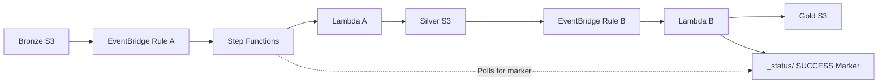

# Bronze → Silver → Gold Data Pipeline

A simple AWS event-driven pipeline that moves a file through **Bronze → Silver → Gold** using Amazon S3, EventBridge, Lambda, and Step Functions.

---

## 1. What This Pipeline Does

When you upload a file to the **Bronze S3 bucket**:

1. Amazon EventBridge detects the upload.
2. EventBridge starts the Step Functions workflow.
3. Step Functions runs **Lambda A**.
4. Lambda A copies the file from **Bronze → Silver** and adds a timestamp to the filename.
5. The new file in Silver triggers another EventBridge rule.
6. EventBridge runs **Lambda B**.
7. Lambda B copies the file from **Silver → Gold** inside a `Year/Month/Day/` folder.
8. Lambda B creates a **success marker** in the Gold bucket.
9. Step Functions detects the marker and marks the workflow as **SUCCEEDED**.

### Example

You upload:

```text
customer_data.csv
```

The final Gold location becomes:

```text
2026/09/15/customer_data_2026-09-15_19-35-42.csv
```

---

# 2. Architecture



### Simple flow

```text
Bronze S3
   ↓
EventBridge Rule A
   ↓
Step Functions
   ↓
Lambda A
   ↓
Silver S3
   ↓
EventBridge Rule B
   ↓
Lambda B
   ↓
Gold S3
   ↓
Success Marker
   ↓
Step Functions = SUCCEEDED
```

---

# 3. AWS Services Used

| Service | Purpose |
|---|---|
| **Amazon S3** | Stores files in Bronze, Silver, and Gold layers |
| **Amazon EventBridge** | Detects file creation and triggers the next component |
| **AWS Step Functions** | Starts the pipeline, runs Lambda A, and waits for completion |
| **AWS Lambda** | Performs the file-copy operations |
| **IAM** | Provides permissions to the pipeline |
| **Amazon CloudWatch** | Stores Lambda execution logs |

---

# 4. Pipeline Layers

The pipeline contains three S3 buckets.

| Layer | Purpose | Example |
|---|---|---|
| **Bronze** | Original uploaded file | `customer_data.csv` |
| **Silver** | Timestamped copy of the file | `customer_data_2026-09-15_19-35-42.csv` |
| **Gold** | Final processed location organized by date | `2026/09/15/customer_data_...csv` |

The original file in Bronze is not modified.

---

# 5. Project Files

| File | Purpose |
|---|---|
| `lambda_a.py` | Copies a file from Bronze → Silver and adds a timestamp |
| `lambda_b.py` | Copies a file from Silver → Gold and creates the success marker |
| `state_machine.json` | Step Functions workflow definition |
| `trust_policy.json` | IAM trust policy used by the pipeline role |
| `eventbridge_pattern_bronze.json` | EventBridge rule for Bronze file uploads |
| `eventbridge_pattern_silver.json` | EventBridge rule for Silver file uploads |

---

# 6. How the Pipeline Works

## Step 1 — Bronze S3 → EventBridge Rule A

EventBridge must be enabled on the Bronze bucket.

```text
Bronze S3
    ↓
New file uploaded
    ↓
EventBridge Rule A
```

### What happens?

When a file is uploaded to Bronze, S3 sends an event to EventBridge.

EventBridge Rule A checks the event and starts the Step Functions workflow.

### Configuration

In the Bronze bucket:

```text
S3
→ Bucket
→ Properties
→ Event Notifications
→ Amazon EventBridge
→ ON
```

---

## Step 2 — EventBridge Rule A → Step Functions

EventBridge Rule A starts:

```text
bronze-silver-gold-workflow
```

The complete S3 event is passed to Step Functions.

### Configuration

Set the EventBridge target to:

```text
AWS Service
→ Step Functions state machine
→ bronze-silver-gold-workflow
```

Only the Bronze upload event should start this workflow.

---

## Step 3 — Step Functions → Lambda A

Step Functions calls:

```text
bronze-to-silver
```

Lambda A receives the S3 event and copies the file from Bronze to Silver.

The Lambda ARN is configured inside:

```text
state_machine.json
```

Replace:

```text
YOUR LAMBDA A ARN
```

with the actual Lambda A ARN.

> Step Functions directly calls **Lambda A only**. It does not call Lambda B.

---

## Step 4 — Lambda A → Silver S3

Lambda A copies the original file to Silver and adds a timestamp.

### Example

Original Bronze file:

```text
customer_data.csv
```

Silver file:

```text
customer_data_2026-09-15_19-35-42.csv
```

The Silver bucket name is configured in:

```python
SILVER_BUCKET = "your-silver-bucket"
```

### Why add a timestamp?

The timestamp makes every pipeline run unique.

For example:

```text
customer_data_2026-09-15_19-35-42.csv
customer_data_2026-09-16_10-12-05.csv
```

Both files can exist without overwriting each other.

---

# 7. The Important Part — Silver Triggers Lambda B

This is the main event-driven part of the pipeline.

When Lambda A creates the file in Silver:

```text
Lambda A
   ↓
Silver S3
   ↓
EventBridge Rule B
   ↓
Lambda B
```

EventBridge is enabled on the Silver bucket.

```text
S3
→ Bucket
→ Properties
→ Event Notifications
→ Amazon EventBridge
→ ON
```

### Important

**Gold must NOT have EventBridge enabled.**

Only these buckets should have EventBridge enabled:

| Bucket | EventBridge |
|---|---|
| Bronze | ✅ ON |
| Silver | ✅ ON |
| Gold | ❌ OFF |

If Gold also triggered EventBridge, the pipeline could trigger itself repeatedly.

---

# 8. EventBridge Rule B → Lambda B

EventBridge Rule B runs:

```text
silver-to-gold
```

Lambda B receives the Silver S3 event.

### Configuration

Set the target of Rule B to:

```text
AWS Service
→ Lambda function
→ silver-to-gold
```

The Lambda B ARN belongs in **EventBridge Rule B**, not in the Step Functions state machine.

---

# 9. Lambda B → Gold S3

Lambda B copies the Silver file into the Gold bucket.

The Gold bucket is organized using:

```text
Year/Month/Day/
```

### Example

Silver:

```text
customer_data_2026-09-15_19-35-42.csv
```

Gold:

```text
2026/
└── 09/
    └── 15/
        └── customer_data_2026-09-15_19-35-42.csv
```

The Gold bucket name is configured in:

```python
GOLD_BUCKET = "your-gold-bucket"
```

---

# 10. How Step Functions Knows the Pipeline Is Finished

There is one important challenge in this architecture.

Step Functions directly calls Lambda A:

```text
Step Functions → Lambda A
```

But Lambda B is started by EventBridge:

```text
Silver → EventBridge → Lambda B
```

Therefore:

```text
Step Functions does NOT directly know when Lambda B finishes.
```

To solve this, the pipeline uses a **success marker file**.

---

# 11. Success Marker

Lambda B creates a small marker file in:

```text
_status/
```

Example:

```text
_status/customer_data_2026-09-15_19-35-42.csv_SUCCESS
```

The marker does not contain the actual data.

The **filename itself is the completion signal**.

### Workflow

```text
Step Functions
      ↓
Calls Lambda A
      ↓
Lambda A writes file to Silver
      ↓
Silver triggers EventBridge
      ↓
EventBridge runs Lambda B
      ↓
Lambda B writes file to Gold
      ↓
Lambda B creates SUCCESS marker
      ↓
Step Functions detects marker
      ↓
Workflow = SUCCEEDED
```

---

# 12. Why the Marker Contains a Timestamp

The timestamp is important because it makes the marker unique for every execution.

For example:

```text
_status/customer_data_2026-09-15_19-35-42.csv_SUCCESS
```

Suppose the marker were simply:

```text
_status/customer_data.csv_SUCCESS
```

A previous execution could leave this marker behind.

If you upload `customer_data.csv` again, Step Functions might find the old marker and incorrectly assume that the new pipeline execution has already completed.

With a timestamp:

```text
Run 1 → customer_data_2026-09-15_19-35-42.csv_SUCCESS
Run 2 → customer_data_2026-09-16_10-12-05.csv_SUCCESS
```

Each execution has its own marker.

---

# 13. Step Functions Polling

Step Functions checks the Gold bucket periodically to see whether the expected marker exists.

Example:

```text
Check 1 → Marker not found
Check 2 → Marker not found
Check 3 → Marker not found
...
Lambda B creates marker
...
Next check → Marker found
```

When the marker is found:

```text
SUCCEEDED ✅
```

If the marker is not created within the configured timeout:

```text
FAILED ❌
```

The current workflow checks approximately every **20 seconds** and fails after approximately **5 minutes** if the marker does not appear.

---

# 14. Complete Upload Flow

Here is the entire process in order:

### 1. Upload

Upload:

```text
customer_data.csv
```

to the Bronze bucket.

### 2. Bronze Event

Bronze S3 sends the upload event to EventBridge.

### 3. Start Workflow

EventBridge Rule A starts:

```text
bronze-silver-gold-workflow
```

### 4. Lambda A

Step Functions invokes:

```text
bronze-to-silver
```

### 5. Silver File

Lambda A creates:

```text
customer_data_2026-09-15_19-35-42.csv
```

in Silver.

### 6. Silver Event

Silver S3 sends the new-file event to EventBridge.

### 7. Lambda B

EventBridge Rule B invokes:

```text
silver-to-gold
```

### 8. Gold File

Lambda B creates:

```text
2026/09/15/customer_data_2026-09-15_19-35-42.csv
```

### 9. Success Marker

Lambda B creates:

```text
_status/customer_data_2026-09-15_19-35-42.csv_SUCCESS
```

### 10. Workflow Completes

Step Functions finds the marker:

```text
SUCCEEDED ✅
```

---

# 15. Final Gold Bucket Structure

After a successful execution, the Gold bucket looks like:

```text
kshitij-gold-bucket/
│
├── 2026/
│   └── 09/
│       └── 15/
│           └── customer_data_2026-09-15_19-35-42.csv
│
└── _status/
    └── customer_data_2026-09-15_19-35-42.csv_SUCCESS
```

The two important objects are:

```text
Actual file:
2026/09/15/customer_data_2026-09-15_19-35-42.csv

Success marker:
_status/customer_data_2026-09-15_19-35-42.csv_SUCCESS
```

---

# 16. Setup Guide

## Step 1 — Create the IAM Role

Create one IAM role:

```text
Bronze-Silver-Gold-Role
```

### Create the role

Go to:

```text
IAM
→ Roles
→ Create role
→ AWS service
→ Lambda
```

Use:

```text
Role name:
Bronze-Silver-Gold-Role
```

Replace the trust policy with:

```text
trust_policy.json
```

### Trusted services

The trust policy allows:

| Service | Purpose |
|---|---|
| `events.amazonaws.com` | EventBridge |
| `states.amazonaws.com` | Step Functions |
| `lambda.amazonaws.com` | Lambda |

### Managed policies

Attach:

```text
AWSLambdaBasicExecutionRole
AWSLambdaRole
AmazonS3FullAccess
AWSStepFunctionsFullAccess
```

> For a production environment, replace broad managed policies such as `AmazonS3FullAccess` with least-privilege custom policies.

---

# 17. Step 2 — Create the S3 Buckets

Create three S3 buckets.

Example:

```text
kshitij-bronze-bucket
kshitij-silver-bucket
kshitij-gold-bucket
```

You can use different names, but update the bucket names in the Lambda code and configuration files accordingly.

---

# 18. Step 3 — Enable EventBridge

Enable EventBridge only on:

```text
Bronze ✅
Silver ✅
```

Keep it disabled on:

```text
Gold ❌
```

For each required bucket:

```text
S3
→ Bucket
→ Properties
→ Event Notifications
→ Amazon EventBridge
→ Edit
→ ON
→ Save
```

---

# 19. Step 4 — Create Lambda A

Create a Lambda function:

```text
bronze-to-silver
```

Use:

```text
Runtime: Python 3.x
Role: Bronze-Silver-Gold-Role
```

Copy the code from:

```text
lambda_a.py
```

Update:

```python
SILVER_BUCKET = "your-silver-bucket"
```

Then:

```text
Create function
→ Paste code
→ Update bucket name
→ Deploy
```

---

# 20. Step 5 — Create Lambda B

Create another Lambda function:

```text
silver-to-gold
```

Use:

```text
Runtime: Python 3.x
Role: Bronze-Silver-Gold-Role
```

Copy the code from:

```text
lambda_b.py
```

Update:

```python
GOLD_BUCKET = "your-gold-bucket"
```

Then:

```text
Create function
→ Paste code
→ Update bucket name
→ Deploy
```

---

# 21. Step 6 — Create the Step Functions State Machine

Go to:

```text
Step Functions
→ State machines
→ Create state machine
```

Choose:

```text
Write workflow in code
```

Use:

```text
Name:
bronze-silver-gold-workflow

Type:
Standard

Permissions:
Use an existing role

Role:
Bronze-Silver-Gold-Role
```

Paste the contents of:

```text
state_machine.json
```

Replace:

```text
YOUR GOLD BUCKET
```

with your Gold bucket name.

There are **two occurrences**.

Also replace:

```text
YOUR LAMBDA A ARN
```

with the ARN of:

```text
bronze-to-silver
```

### Important

You should **not** add Lambda B's ARN to the state machine.

The architecture is:

```text
Step Functions → Lambda A

EventBridge → Lambda B
```

---

# 22. Step 7 — Create EventBridge Rule A

Create:

```text
bronze-object-created
```

Configuration:

```text
EventBridge
→ Rules
→ Create rule
```

Use:

```text
Name:
bronze-object-created

Event bus:
default

Rule type:
Rule with an event pattern
```

Use:

```text
eventbridge_pattern_bronze.json
```

Replace:

```text
YOUR BRONZE BUCKET
```

with your Bronze bucket name.

### Target

Set the target to:

```text
AWS Service
→ Step Functions state machine
→ bronze-silver-gold-workflow
```

---

# 23. Step 8 — Create EventBridge Rule B

Create:

```text
silver-object-created
```

Configuration:

```text
EventBridge
→ Rules
→ Create rule
```

Use:

```text
Name:
silver-object-created

Event bus:
default

Rule type:
Rule with an event pattern
```

Use:

```text
eventbridge_pattern_silver.json
```

Replace:

```text
YOUR SILVER BUCKET
```

with your Silver bucket name.

### Target

Set the target to:

```text
AWS Service
→ Lambda function
→ silver-to-gold
```

---

# 24. Configuration Checklist

Before testing, verify the following:

### S3

```text
[ ] Bronze bucket created
[ ] Silver bucket created
[ ] Gold bucket created
[ ] EventBridge enabled on Bronze
[ ] EventBridge enabled on Silver
[ ] EventBridge disabled on Gold
```

### Lambda

```text
[ ] bronze-to-silver created
[ ] silver-to-gold created
[ ] Lambda A uses the correct Silver bucket
[ ] Lambda B uses the correct Gold bucket
[ ] Both Lambdas use the correct IAM role
```

### Step Functions

```text
[ ] bronze-silver-gold-workflow created
[ ] Standard workflow selected
[ ] Correct IAM role selected
[ ] YOUR LAMBDA A ARN replaced
[ ] YOUR GOLD BUCKET replaced twice
[ ] Lambda B ARN NOT added
```

### EventBridge

```text
[ ] bronze-object-created created
[ ] Rule A points to Step Functions
[ ] silver-object-created created
[ ] Rule B points to Lambda B
```

---

# 25. Testing the Pipeline

Once everything is configured, upload any file to Bronze.

For example:

```text
customer_data.csv
```

Then check the following.

### Step Functions

Go to:

```text
Step Functions
→ bronze-silver-gold-workflow
→ Executions
```

Expected result:

```text
SUCCEEDED ✅
```

### Silver

You should see:

```text
customer_data_2026-09-15_19-35-42.csv
```

### Gold

You should see:

```text
2026/
└── 09/
    └── 15/
        └── customer_data_2026-09-15_19-35-42.csv
```

### Success Marker

You should also see:

```text
_status/
└── customer_data_2026-09-15_19-35-42.csv_SUCCESS
```

### CloudWatch

Check logs for both Lambdas:

```text
Lambda A
→ Monitor
→ View CloudWatch logs
```

and:

```text
Lambda B
→ Monitor
→ View CloudWatch logs
```

---

# 26. Testing the Failure Scenario

You can test whether Step Functions correctly detects a failed second hop.

Temporarily disable:

```text
silver-object-created
```

Then upload a new file to Bronze.

### What should happen?

Lambda A should still copy the file:

```text
Bronze → Silver
```

But Rule B is disabled, so Lambda B will not run.

Therefore:

```text
No Gold file
No SUCCESS marker
```

Step Functions keeps checking for the marker.

After approximately 5 minutes, the execution should fail with an error similar to:

```text
Error:
SuccessMarkerNotFound

Cause:
Lambda B never wrote its success marker to the Gold bucket.
```

After the test, enable Rule B again.

---

# 27. Common Questions

## Why doesn't Step Functions call Lambda B directly?

It could.

That would make the architecture simpler:

```text
Step Functions
   ↓
Lambda A
   ↓
Lambda B
```

However, this design intentionally uses an event-driven second hop:

```text
Lambda A
   ↓
Silver
   ↓
EventBridge
   ↓
Lambda B
```

The Silver bucket itself triggers the next stage.

Because Step Functions is not directly calling Lambda B, the success marker is used to tell Step Functions that the complete pipeline has finished.

---

## Why is there a `_status/` folder?

The `_status/` folder contains completion markers.

Example:

```text
_status/
└── customer_data_2026-09-15_19-35-42.csv_SUCCESS
```

It allows Step Functions to determine whether Lambda B completed successfully.

The markers also provide a simple history of completed pipeline executions.

---

## What happens if I upload the same filename twice?

That is supported.

For example:

```text
customer_data.csv
```

can be uploaded multiple times.

Each execution receives a different timestamp:

```text
customer_data_2026-09-15_19-35-42.csv
customer_data_2026-09-15_20-10-18.csv
```

Therefore, one execution does not overwrite another.

---

## Does the file extension matter?

No.

The pipeline can handle files such as:

```text
.csv
.xlsx
.pdf
.txt
```

or files without an extension.

The Lambda logic works with the filename received from S3.

---

# 28. Quick Architecture Reference

| Step | From | To | Trigger |
|---|---|---|---|
| 1 | Bronze S3 | EventBridge Rule A | File uploaded |
| 2 | EventBridge Rule A | Step Functions | Matching Bronze event |
| 3 | Step Functions | Lambda A | Workflow execution |
| 4 | Lambda A | Silver S3 | Lambda copies file |
| 5 | Silver S3 | EventBridge Rule B | File uploaded |
| 6 | EventBridge Rule B | Lambda B | Matching Silver event |
| 7 | Lambda B | Gold S3 | Lambda copies file |
| 8 | Lambda B | `_status/` marker | Lambda completes |
| 9 | Step Functions | SUCCESS | Marker detected |

---

# 29. What Each Component Does

| Component | Responsibility |
|---|---|
| **Bronze S3** | Stores the original uploaded file |
| **EventBridge Rule A** | Detects Bronze uploads and starts the workflow |
| **Step Functions** | Starts Lambda A and waits for the final success marker |
| **Lambda A** | Copies Bronze → Silver and adds a timestamp |
| **Silver S3** | Stores the timestamped file and triggers the next stage |
| **EventBridge Rule B** | Detects Silver uploads and runs Lambda B |
| **Lambda B** | Copies Silver → Gold and creates the success marker |
| **Gold S3** | Stores the final file in `Year/Month/Day/` |
| **`_status/`** | Stores success markers for completed executions |

---

# 30. Final Summary

The complete architecture is:

```text
                  EVENT-DRIVEN PIPELINE

┌─────────────┐
│ Bronze S3   │
│             │
│ Original    │
│ file        │
└──────┬──────┘
       │
       │ File uploaded
       ▼
┌─────────────────────┐
│ EventBridge Rule A  │
└──────────┬──────────┘
           │
           │ Starts
           ▼
┌─────────────────────┐
│ Step Functions      │
│                     │
│ Calls Lambda A      │
│ Waits for marker    │
└──────────┬──────────┘
           │
           ▼
┌─────────────────────┐
│ Lambda A            │
│ Bronze → Silver     │
└──────────┬──────────┘
           │
           ▼
┌─────────────┐
│ Silver S3   │
│             │
│ Timestamped │
│ file        │
└──────┬──────┘
       │
       │ File uploaded
       ▼
┌─────────────────────┐
│ EventBridge Rule B  │
└──────────┬──────────┘
           │
           ▼
┌─────────────────────┐
│ Lambda B            │
│ Silver → Gold       │
└──────────┬──────────┘
           │
           ├──────────────► Gold/YYYY/MM/DD/file
           │
           └──────────────► _status/file_SUCCESS
                                      │
                                      │
                         Step Functions detects marker
                                      │
                                      ▼
                                  SUCCEEDED ✅
```

### In one sentence

> **Bronze receives the file, EventBridge starts Step Functions, Step Functions runs Lambda A, Silver triggers Lambda B through EventBridge, Lambda B writes the final Gold file and a unique success marker, and Step Functions finishes when it detects that marker.**
