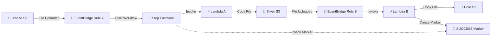

Absolutely bro 😎 — here is the **copy-paste-ready Markdown** with emojis/icons, while keeping the README clean and professional.

````md
# 🥉 Bronze → 🥈 Silver → 🥇 Gold Data Pipeline

A simple **AWS event-driven data pipeline** that moves files through three S3 layers:

**Bronze → Silver → Gold**

The pipeline uses:

- 🪣 Amazon S3
- 🚌 Amazon EventBridge
- 🔄 AWS Step Functions
- ⚡ AWS Lambda
- 🔐 AWS IAM
- 📊 Amazon CloudWatch

---

# 🎯 1. What This Pipeline Does

When you upload a file to the **Bronze S3 bucket**, the pipeline automatically moves it through Silver and finally to Gold.

### 🔄 Complete Flow

```text
📤 Upload File
     │
     ▼
🥉 Bronze S3
     │
     ▼
🚌 EventBridge Rule A
     │
     ▼
🔄 Step Functions
     │
     ▼
⚡ Lambda A
     │
     ▼
🥈 Silver S3
     │
     ▼
🚌 EventBridge Rule B
     │
     ▼
⚡ Lambda B
     │
     ▼
🥇 Gold S3
     │
     ▼
📄 Success Marker
     │
     ▼
🔄 Step Functions
     │
     ▼
✅ SUCCEEDED
````

### 📌 Example

You upload:

```text
customer_data.csv
```

The file is first stored in:

```text
🥉 Bronze
└── customer_data.csv
```

Then Lambda A creates:

```text
🥈 Silver
└── customer_data_2026-09-15_19-35-42.csv
```

Finally, Lambda B creates:

```text
🥇 Gold
└── 2026/
    └── 09/
        └── 15/
            └── customer_data_2026-09-15_19-35-42.csv
```

---

# 🏗️ 2. Architecture



---

# 🧩 3. AWS Components

| Component                 | Purpose                                          |
| ------------------------- | ------------------------------------------------ |
| 🥉 **Bronze S3**          | Stores the original uploaded file                |
| 🚌 **EventBridge Rule A** | Detects new files in Bronze                      |
| 🔄 **Step Functions**     | Starts the workflow and waits for completion     |
| ⚡ **Lambda A**            | Copies Bronze → Silver and adds timestamp        |
| 🥈 **Silver S3**          | Stores the timestamped file                      |
| 🚌 **EventBridge Rule B** | Detects new files in Silver                      |
| ⚡ **Lambda B**            | Copies Silver → Gold and creates marker          |
| 🥇 **Gold S3**            | Stores the final file by date                    |
| 📄 **SUCCESS Marker**     | Tells Step Functions that the pipeline completed |
| 🔐 **IAM**                | Provides required permissions                    |
| 📊 **CloudWatch**         | Stores Lambda logs                               |

---

# 📁 4. Project Files

| 📄 File                           | 📝 Purpose                                        |
| --------------------------------- | ------------------------------------------------- |
| `lambda_a.py`                     | ⚡ Copies Bronze → Silver and adds timestamp       |
| `lambda_b.py`                     | ⚡ Copies Silver → Gold and creates SUCCESS marker |
| `state_machine.json`              | 🔄 Step Functions workflow definition             |
| `trust_policy.json`               | 🔐 IAM trust policy                               |
| `eventbridge_pattern_bronze.json` | 🚌 EventBridge rule for Bronze                    |
| `eventbridge_pattern_silver.json` | 🚌 EventBridge rule for Silver                    |

---

# 🪣 5. S3 Bucket Structure

The pipeline contains three buckets.

| Layer         | Purpose                      | Example                                 |
| ------------- | ---------------------------- | --------------------------------------- |
| 🥉 **Bronze** | Original uploaded file       | `customer_data.csv`                     |
| 🥈 **Silver** | Timestamped copy             | `customer_data_2026-09-15_19-35-42.csv` |
| 🥇 **Gold**   | Final file organized by date | `2026/09/15/customer_data_...csv`       |

### 📌 Important

The original file in Bronze is **not modified**.

---

# 🔗 6. How the Pipeline Works

## 1️⃣ Bronze S3 → EventBridge Rule A

When a file is uploaded to Bronze:

```text
🥉 Bronze S3
      │
      │ File Uploaded
      ▼
🚌 EventBridge Rule A
```

EventBridge detects the new file and starts the Step Functions workflow.

### ⚙️ Configuration

Enable EventBridge on the Bronze bucket:

```text
S3
→ Bucket
→ Properties
→ Event Notifications
→ Amazon EventBridge
→ ON
```

---

## 2️⃣ EventBridge Rule A → Step Functions

EventBridge Rule A starts:

```text
bronze-silver-gold-workflow
```

The S3 event is passed to Step Functions.

### 🎯 Target

```text
AWS Service
→ Step Functions state machine
→ bronze-silver-gold-workflow
```

Only the Bronze upload event should start this workflow.

---

## 3️⃣ Step Functions → Lambda A

Step Functions invokes:

```text
⚡ bronze-to-silver
```

Lambda A receives the S3 event and copies the file from Bronze to Silver.

The Lambda A ARN is configured inside:

```text
state_machine.json
```

Replace:

```text
YOUR LAMBDA A ARN
```

with the actual Lambda A ARN.

### ⚠️ Important

Step Functions directly calls **Lambda A only**.

```text
🔄 Step Functions
       │
       ▼
⚡ Lambda A
```

It does **not** directly call Lambda B.

---

## 4️⃣ Lambda A → Silver S3

Lambda A copies the original file to Silver and adds a timestamp.

### 📥 Original File

```text
customer_data.csv
```

### 📤 Silver File

```text
customer_data_2026-09-15_19-35-42.csv
```

The Silver bucket is configured in:

```python
SILVER_BUCKET = "your-silver-bucket"
```

### 💡 Why Add a Timestamp?

The timestamp makes every pipeline execution unique.

For example:

```text
customer_data_2026-09-15_19-35-42.csv
customer_data_2026-09-16_10-12-05.csv
```

This prevents one execution from overwriting another.

---

# 🚌 7. Silver S3 → EventBridge Rule B

This is the important event-driven part of the pipeline.

When Lambda A creates the file in Silver:

```text
⚡ Lambda A
     │
     ▼
🥈 Silver S3
     │
     │ New File
     ▼
🚌 EventBridge Rule B
     │
     ▼
⚡ Lambda B
```

### ⚙️ Configuration

Enable EventBridge on the Silver bucket:

```text
S3
→ Bucket
→ Properties
→ Event Notifications
→ Amazon EventBridge
→ ON
```

---

# ⚠️ 8. Important: Keep EventBridge OFF on Gold

EventBridge should only be enabled on:

| Bucket    | EventBridge |
| --------- | ----------- |
| 🥉 Bronze | ✅ **ON**    |
| 🥈 Silver | ✅ **ON**    |
| 🥇 Gold   | ❌ **OFF**   |

### 🚨 Why?

If EventBridge is also enabled on Gold, files written by Lambda B could trigger additional events.

This could cause the pipeline to trigger itself repeatedly.

```text
Gold
 ↓
EventBridge
 ↓
Lambda
 ↓
Gold
 ↓
EventBridge
 ↓
Lambda
 ↓
♾️ ...
```

Therefore:

> 🥇 **Gold EventBridge must remain OFF.**

---

# ⚡ 9. EventBridge Rule B → Lambda B

EventBridge Rule B invokes:

```text
⚡ silver-to-gold
```

### 🎯 Target

```text
AWS Service
→ Lambda function
→ silver-to-gold
```

### ⚠️ Important

Lambda B is triggered by **EventBridge**, not Step Functions.

```text
🥈 Silver
     │
     ▼
🚌 EventBridge Rule B
     │
     ▼
⚡ Lambda B
```

Therefore, the Lambda B ARN does **not** belong in `state_machine.json`.

---

# 🥇 10. Lambda B → Gold S3

Lambda B copies the Silver file into the Gold bucket.

The Gold bucket uses:

```text
Year / Month / Day
```

### 📁 Example

Silver:

```text
customer_data_2026-09-15_19-35-42.csv
```

Gold:

```text
2026/
└── 09/
    └── 15/
        └── customer_data_2026-09-15_19-35-42.csv
```

The Gold bucket is configured in:

```python
GOLD_BUCKET = "your-gold-bucket"
```

---

# 📄 11. Success Marker

There is one important challenge in this architecture.

Step Functions calls Lambda A:

```text
🔄 Step Functions
       ↓
⚡ Lambda A
```

But Lambda B is triggered separately:

```text
🥈 Silver
       ↓
🚌 EventBridge
       ↓
⚡ Lambda B
```

Therefore, Step Functions does not automatically know when Lambda B has finished.

### 💡 Solution: SUCCESS Marker

Lambda B creates a small marker file in:

```text
_status/
```

Example:

```text
_status/customer_data_2026-09-15_19-35-42.csv_SUCCESS
```

The marker file does not contain the actual data.

The **filename itself acts as the completion signal**.

---

# 🔄 12. How the SUCCESS Marker Works

The complete process is:

```text
🔄 Step Functions
       │
       │ Calls Lambda A
       ▼
⚡ Lambda A
       │
       │ Writes file
       ▼
🥈 Silver S3
       │
       │ New file event
       ▼
🚌 EventBridge Rule B
       │
       ▼
⚡ Lambda B
       │
       ├──────────────► 🥇 Gold S3
       │                  │
       │                  └── Year/Month/Day/file
       │
       └──────────────► 📄 SUCCESS Marker
                              │
                              ▼
                     🔄 Step Functions
                              │
                              ▼
                         ✅ SUCCEEDED
```

---

# ⏱️ 13. Step Functions Polling

After Lambda A finishes, Step Functions waits for the SUCCESS marker.

It periodically checks the Gold bucket.

Example:

```text
🔍 Check 1 → Marker not found
🔍 Check 2 → Marker not found
🔍 Check 3 → Marker not found
        ...
⚡ Lambda B creates marker
        ...
🔍 Next check → Marker found
        ↓
   ✅ SUCCEEDED
```

The current workflow checks approximately every **20 seconds**.

If the marker does not appear within approximately **5 minutes**, the workflow fails.

---

# 🔐 14. Why the Marker Contains a Timestamp

The timestamp makes the marker unique for each execution.

### Example

```text
Run 1:
_status/customer_data_2026-09-15_19-35-42.csv_SUCCESS

Run 2:
_status/customer_data_2026-09-16_10-12-05.csv_SUCCESS
```

Each execution has its own marker.

### ❌ Without Timestamp

If the marker were:

```text
_status/customer_data.csv_SUCCESS
```

A previous execution could leave the marker behind.

When the same file is uploaded again, Step Functions might find the old marker and incorrectly think the new execution has already completed.

### ✅ With Timestamp

Every execution gets a unique marker.

This prevents that problem.

---

# 📤 15. Complete File Upload Flow

Let's follow one file from beginning to end.

### 1️⃣ Upload File

You upload:

```text
customer_data.csv
```

to:

```text
🥉 Bronze S3
```

### 2️⃣ Bronze Event

S3 sends the upload event to:

```text
🚌 EventBridge Rule A
```

### 3️⃣ Start Workflow

Rule A starts:

```text
🔄 bronze-silver-gold-workflow
```

### 4️⃣ Lambda A Runs

Step Functions invokes:

```text
⚡ bronze-to-silver
```

### 5️⃣ File Goes to Silver

Lambda A creates:

```text
🥈 customer_data_2026-09-15_19-35-42.csv
```

### 6️⃣ Silver Event

Silver S3 sends a new-file event to:

```text
🚌 EventBridge Rule B
```

### 7️⃣ Lambda B Runs

Rule B invokes:

```text
⚡ silver-to-gold
```

### 8️⃣ File Goes to Gold

Lambda B creates:

```text
🥇 Gold
└── 2026/
    └── 09/
        └── 15/
            └── customer_data_2026-09-15_19-35-42.csv
```

### 9️⃣ SUCCESS Marker

Lambda B creates:

```text
📄 _status/customer_data_2026-09-15_19-35-42.csv_SUCCESS
```

### 🔟 Workflow Completes

Step Functions finds the marker:

```text
✅ SUCCEEDED
```

---

# 🗂️ 16. Final Gold Bucket Structure

After a successful execution:

```text
🥇 kshitij-gold-bucket/
│
├── 📁 2026/
│   └── 📁 09/
│       └── 📁 15/
│           └── 📄 customer_data_2026-09-15_19-35-42.csv
│
└── 📁 _status/
    └── 📄 customer_data_2026-09-15_19-35-42.csv_SUCCESS
```

### 📌 Two Important Objects

**Actual file:**

```text
2026/09/15/customer_data_2026-09-15_19-35-42.csv
```

**Success marker:**

```text
_status/customer_data_2026-09-15_19-35-42.csv_SUCCESS
```

---

# 🚀 17. Setup Guide

Follow these steps in order.

```text
1️⃣ Create IAM Role
       ↓
2️⃣ Create S3 Buckets
       ↓
3️⃣ Enable EventBridge
       ↓
4️⃣ Create Lambda A
       ↓
5️⃣ Create Lambda B
       ↓
6️⃣ Create Step Functions
       ↓
7️⃣ Create EventBridge Rule A
       ↓
8️⃣ Create EventBridge Rule B
       ↓
9️⃣ Test Pipeline
```

---

# 🔐 18. Step 1 — Create IAM Role

Create one IAM role:

```text
Bronze-Silver-Gold-Role
```

Go to:

```text
IAM
→ Roles
→ Create role
→ AWS service
→ Lambda
```

### 📝 Role Name

```text
Bronze-Silver-Gold-Role
```

Replace the trust policy with:

```text
trust_policy.json
```

### 👥 Trusted Services

| Service                | Purpose           |
| ---------------------- | ----------------- |
| `events.amazonaws.com` | 🚌 EventBridge    |
| `states.amazonaws.com` | 🔄 Step Functions |
| `lambda.amazonaws.com` | ⚡ Lambda          |

### 📜 Managed Policies

Attach:

```text
AWSLambdaBasicExecutionRole
AWSLambdaRole
AmazonS3FullAccess
AWSStepFunctionsFullAccess
```

> ⚠️ For production environments, use least-privilege IAM policies instead of broad managed policies such as `AmazonS3FullAccess`.

---

# 🪣 19. Step 2 — Create Three S3 Buckets

Create:

```text
🥉 Bronze
🥈 Silver
🥇 Gold
```

### Example Names

```text
kshitij-bronze-bucket
kshitij-silver-bucket
kshitij-gold-bucket
```

You can use your own bucket names.

If you use different names, update them in the Lambda code and configuration files.

---

# 🚌 20. Step 3 — Enable EventBridge

Enable EventBridge only on:

```text
🥉 Bronze → ON
🥈 Silver → ON
🥇 Gold   → OFF
```

For Bronze and Silver:

```text
S3
→ Bucket
→ Properties
→ Event Notifications
→ Amazon EventBridge
→ Edit
→ ON
→ Save
```

---

# ⚡ 21. Step 4 — Create Lambda A

Create:

```text
bronze-to-silver
```

### Configuration

```text
Runtime:
Python 3.x

Role:
Bronze-Silver-Gold-Role
```

Use:

```text
lambda_a.py
```

Update:

```python
SILVER_BUCKET = "your-silver-bucket"
```

Then:

```text
Create Function
     ↓
Paste Code
     ↓
Update Bucket Name
     ↓
Deploy
```

---

# ⚡ 22. Step 5 — Create Lambda B

Create:

```text
silver-to-gold
```

### Configuration

```text
Runtime:
Python 3.x

Role:
Bronze-Silver-Gold-Role
```

Use:

```text
lambda_b.py
```

Update:

```python
GOLD_BUCKET = "your-gold-bucket"
```

Then:

```text
Create Function
     ↓
Paste Code
     ↓
Update Bucket Name
     ↓
Deploy
```

---

# 🔄 23. Step 6 — Create Step Functions State Machine

Go to:

```text
Step Functions
→ State machines
→ Create state machine
```

Choose:

```text
Write workflow in code
```

### Configuration

```text
Name:
bronze-silver-gold-workflow

Type:
Standard

Permissions:
Use an existing role

Role:
Bronze-Silver-Gold-Role
```

Paste:

```text
state_machine.json
```

### 🔧 Replace These Values

Replace:

```text
YOUR LAMBDA A ARN
```

with Lambda A's ARN.

Replace:

```text
YOUR GOLD BUCKET
```

with your Gold bucket name.

> ⚠️ `YOUR GOLD BUCKET` appears **twice** in the state machine.

### 🚨 Important

Do **not** add Lambda B's ARN.

The architecture is:

```text
🔄 Step Functions
       ↓
⚡ Lambda A

🥈 Silver
       ↓
🚌 EventBridge
       ↓
⚡ Lambda B
```

---

# 🚌 24. Step 7 — Create EventBridge Rule A

Create:

```text
bronze-object-created
```

Go to:

```text
EventBridge
→ Rules
→ Create rule
```

### Configuration

```text
Name:
bronze-object-created

Event bus:
default

Rule type:
Rule with an event pattern
```

Use:

```text
eventbridge_pattern_bronze.json
```

Replace:

```text
YOUR BRONZE BUCKET
```

with your Bronze bucket name.

### 🎯 Target

```text
AWS Service
→ Step Functions state machine
→ bronze-silver-gold-workflow
```

---

# 🚌 25. Step 8 — Create EventBridge Rule B

Create:

```text
silver-object-created
```

Go to:

```text
EventBridge
→ Rules
→ Create rule
```

### Configuration

```text
Name:
silver-object-created

Event bus:
default

Rule type:
Rule with an event pattern
```

Use:

```text
eventbridge_pattern_silver.json
```

Replace:

```text
YOUR SILVER BUCKET
```

with your Silver bucket name.

### 🎯 Target

```text
AWS Service
→ Lambda function
→ silver-to-gold
```

---

# ✅ 26. Configuration Checklist

Before testing, verify everything below.

## 🪣 S3

```text
☐ Bronze bucket created
☐ Silver bucket created
☐ Gold bucket created

☐ EventBridge enabled on Bronze
☐ EventBridge enabled on Silver
☐ EventBridge disabled on Gold
```

## ⚡ Lambda

```text
☐ bronze-to-silver created
☐ silver-to-gold created

☐ Lambda A has correct Silver bucket
☐ Lambda B has correct Gold bucket

☐ Both Lambdas use correct IAM role
```

## 🔄 Step Functions

```text
☐ bronze-silver-gold-workflow created
☐ Standard workflow selected
☐ Correct IAM role selected

☐ Lambda A ARN replaced
☐ Gold bucket name replaced twice

☐ Lambda B ARN NOT added
```

## 🚌 EventBridge

```text
☐ bronze-object-created created
☐ Rule A → Step Functions

☐ silver-object-created created
☐ Rule B → Lambda B
```

---

# 🧪 27. Testing the Pipeline

Once everything is configured, upload any file to Bronze.

Example:

```text
customer_data.csv
```

Then verify each stage.

### 🔄 Step Functions

Go to:

```text
Step Functions
→ bronze-silver-gold-workflow
→ Executions
```

Expected:

```text
✅ SUCCEEDED
```

### 🥈 Silver

Expected:

```text
customer_data_2026-09-15_19-35-42.csv
```

### 🥇 Gold

Expected:

```text
2026/
└── 09/
    └── 15/
        └── customer_data_2026-09-15_19-35-42.csv
```

### 📄 SUCCESS Marker

Expected:

```text
_status/
└── customer_data_2026-09-15_19-35-42.csv_SUCCESS
```

### 📊 CloudWatch

Check Lambda A:

```text
Lambda A
→ Monitor
→ View CloudWatch logs
```

Check Lambda B:

```text
Lambda B
→ Monitor
→ View CloudWatch logs
```

---

# 🧪 28. Testing the Failure Scenario

You can test whether Step Functions correctly detects a failed second hop.

### Step 1

Temporarily disable:

```text
🚌 silver-object-created
```

### Step 2

Upload a new file to Bronze.

### Step 3

Lambda A should still run:

```text
🥉 Bronze
   ↓
⚡ Lambda A
   ↓
🥈 Silver
```

### Step 4

Because Rule B is disabled:

```text
🥈 Silver
   ✕
🚌 EventBridge Rule B
```

Lambda B will not run.

Therefore:

```text
❌ No Gold file
❌ No SUCCESS marker
```

### Step 5

Step Functions continues checking for the marker.

After approximately 5 minutes, the workflow should fail.

Expected error:

```text
Error:
SuccessMarkerNotFound

Cause:
Lambda B never wrote its success marker to the Gold bucket.
```

### Step 6

Enable Rule B again after testing.

---

# ❓ 29. Common Questions

## ❓ Why doesn't Step Functions call Lambda B directly?

It could.

That would make the architecture simpler:

```text
Step Functions
     ↓
Lambda A
     ↓
Lambda B
```

However, this pipeline intentionally uses an **event-driven second hop**:

```text
Lambda A
     ↓
Silver
     ↓
EventBridge
     ↓
Lambda B
```

The idea is that each layer reacts to the previous layer.

Because Step Functions does not directly call Lambda B, the SUCCESS marker is used to tell Step Functions that the complete pipeline has finished.

---

## ❓ Why is there a `_status/` folder?

The `_status/` folder contains completion markers.

Example:

```text
_status/
└── customer_data_2026-09-15_19-35-42.csv_SUCCESS
```

Step Functions checks for this marker to determine whether Lambda B completed successfully.

The markers also provide a simple history of completed executions.

---

## ❓ What happens if I upload the same filename twice?

That's supported.

For example:

```text
customer_data.csv
```

can be uploaded multiple times.

Each execution gets a different timestamp:

```text
customer_data_2026-09-15_19-35-42.csv
customer_data_2026-09-15_20-10-18.csv
```

Therefore, previous executions are not overwritten.

---

## ❓ Does the file extension matter?

No.

The pipeline can handle files such as:

```text
📄 .csv
📊 .xlsx
📕 .pdf
📝 .txt
```

and files without an extension.

The Lambda logic works with the filename received from S3.

---

# 🧭 30. Quick Architecture Reference

| #   | From              | To                    | Trigger               |
| --- | ----------------- | --------------------- | --------------------- |
| 1️⃣ | 🥉 Bronze S3      | 🚌 EventBridge Rule A | File uploaded         |
| 2️⃣ | 🚌 Rule A         | 🔄 Step Functions     | Matching Bronze event |
| 3️⃣ | 🔄 Step Functions | ⚡ Lambda A            | Workflow execution    |
| 4️⃣ | ⚡ Lambda A        | 🥈 Silver S3          | Lambda copies file    |
| 5️⃣ | 🥈 Silver S3      | 🚌 EventBridge Rule B | File uploaded         |
| 6️⃣ | 🚌 Rule B         | ⚡ Lambda B            | Matching Silver event |
| 7️⃣ | ⚡ Lambda B        | 🥇 Gold S3            | Lambda copies file    |
| 8️⃣ | ⚡ Lambda B        | 📄 SUCCESS Marker     | Lambda completes      |
| 9️⃣ | 🔄 Step Functions | ✅ SUCCEEDED           | Marker detected       |

---

# 🧩 31. What Each Component Does

| Component             | Job                                                 |
| --------------------- | --------------------------------------------------- |
| 🥉 **Bronze**         | Holds the original upload                           |
| 🚌 **Rule A**         | Detects Bronze files and starts the workflow        |
| 🔄 **Step Functions** | Runs Lambda A and waits for the SUCCESS marker      |
| ⚡ **Lambda A**        | Copies Bronze → Silver and adds timestamp           |
| 🥈 **Silver**         | Holds timestamped files and triggers the next stage |
| 🚌 **Rule B**         | Detects Silver files and runs Lambda B              |
| ⚡ **Lambda B**        | Copies Silver → Gold and creates the marker         |
| 🥇 **Gold**           | Holds final files in `Year/Month/Day/`              |
| 📄 **SUCCESS Marker** | Tells Step Functions the pipeline is complete       |

---

# 🎯 32. Final Summary

The complete architecture is:

```text
                         🚀 DATA PIPELINE

┌─────────────────────┐
│ 🥉 Bronze S3        │
│                     │
│ Original File       │
└──────────┬──────────┘
           │
           │ 📤 File Uploaded
           ▼
┌─────────────────────┐
│ 🚌 EventBridge      │
│     Rule A          │
└──────────┬──────────┘
           │
           │ ▶️ Start Workflow
           ▼
┌─────────────────────┐
│ 🔄 Step Functions   │
│                     │
│ • Call Lambda A     │
│ • Wait for Marker   │
└──────────┬──────────┘
           │
           │ ⚡ Invoke
           ▼
┌─────────────────────┐
│ ⚡ Lambda A          │
│                     │
│ Bronze → Silver     │
└──────────┬──────────┘
           │
           │ 📄 Timestamped File
           ▼
┌─────────────────────┐
│ 🥈 Silver S3        │
│                     │
│ Timestamped File    │
└──────────┬──────────┘
           │
           │ 📤 File Uploaded
           ▼
┌─────────────────────┐
│ 🚌 EventBridge      │
│     Rule B          │
└──────────┬──────────┘
           │
           │ ⚡ Invoke
           ▼
┌─────────────────────┐
│ ⚡ Lambda B          │
│                     │
│ Silver → Gold       │
└──────────┬──────────┘
           │
           ├─────────────────────► 🥇 Gold S3
           │                         │
           │                         └── 📁 YYYY/MM/DD/file
           │
           └─────────────────────► 📄 SUCCESS Marker
                                      │
                                      │ 🔍 Detected
                                      ▼
                              🔄 Step Functions
                                      │
                                      ▼
                                  ✅ SUCCEEDED
```

---

# 💡 The Idea in One Line

> **📤 Bronze receives the file → 🚌 EventBridge starts Step Functions → ⚡ Lambda A copies it to Silver → 🚌 Silver triggers Lambda B → ⚡ Lambda B copies it to Gold and creates a unique SUCCESS marker → 🔄 Step Functions detects the marker and marks the pipeline as SUCCEEDED.**

---

## ⭐ Important Things to Remember

```text
🥉 Bronze → EventBridge ON
🥈 Silver → EventBridge ON
🥇 Gold   → EventBridge OFF

🔄 Step Functions → Lambda A
🚌 EventBridge    → Lambda B

📄 SUCCESS Marker → tells Step Functions that Lambda B finished

⏱️ Marker is unique because it contains a timestamp
```

**That's the entire Bronze → Silver → Gold pipeline. 🚀**

```
```
