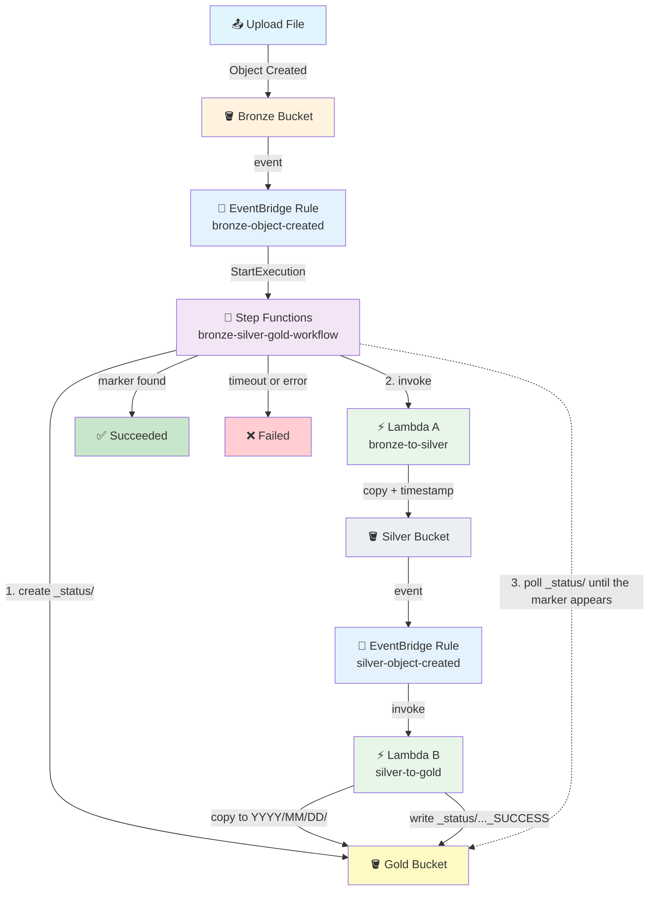

# Bronze → Silver → Gold Pipeline

## S3 (Bronze) → EventBridge → Step Functions → Lambda A → S3 (Silver) → Lambda B → S3 (Gold)

## 📁 Files in This Folder

| File | What It Is |
| ---- | ---------- |
| [lambda_a.py](lambda_a.py) | Lambda A — copies Bronze → Silver, timestamps the name, tells Step Functions which marker to watch |
| [lambda_b.py](lambda_b.py) | Lambda B — triggered by Silver's own event, copies into Gold's date folders and writes the success marker |
| [state_machine.json](state_machine.json) | The complete Step Functions definition — create the status folder, start Lambda A, poll for the marker |
| [trust_policy.json](trust_policy.json) | The IAM trust policy for the shared role — EventBridge, Step Functions and Lambda |
| [eventbridge_pattern_bronze.json](eventbridge_pattern_bronze.json) | The rule that starts the workflow when a file lands in Bronze |
| [eventbridge_pattern_silver.json](eventbridge_pattern_silver.json) | The rule that runs Lambda B when a file lands in Silver |

This README explains the **theory** — how the pieces fit together and why. The code itself lives in the files above.

## 🎯 Goal

A file dropped into **Bronze** should end up in **Gold**, filed under the date it was processed:

```text
Bronze:  customer_data.csv
              ↓   Lambda A
Silver:  customer_data_2026-09-15_19-35-42.csv
              ↓   Lambda B
Gold:    2026/09/15/customer_data_2026-09-15_19-35-42.csv
```

And Step Functions should report **SUCCESS** only once the file is genuinely in Gold — never before.

## 🤔 The Problem This Pipeline Actually Solves

The chain is easy to picture:

```text
Bronze → Silver → Gold
```

The hard part is the **middle**. Those are two separate Lambdas doing two separate copies, and only the first one is called by Step Functions:

- Step Functions calls **Lambda A** directly — that part is easy to track. It waits, it sees the return value, it knows if it threw.
- **Lambda B is not called by Step Functions at all.** It is triggered by the Silver bucket's own S3 event. By the time Lambda B runs, Step Functions has no idea it exists.

So when Lambda B finishes, Step Functions is sitting there with no way to know. If it just declared success after Lambda A returned, it would be lying — the file might never reach Gold.

**This pipeline's whole design is about closing that gap.**

## 💡 The Solution: A Success Marker in the Gold Bucket

Step Functions and Lambda B never speak to each other. Instead they agree on **a file name in advance**:

```text
Step Functions                          Lambda B
      │                                     │
      │ creates  _status/                   │
      │ in Gold                             │
      │                                     │
      │ calls Lambda A                      │
      │      │                              │
      │      └─ Lambda A returns            │
      │         status_key                  │
      │                                     │
      │ polls Gold for status_key ──────►   │ copies to Gold
      │                                     │
      │                                creates status_key
      │ ◄──── status_key now exists ────────┘
      │
      ▼
   SUCCESS
```

That is the whole trick. There is no callback, no token, no queue — just a file that one side writes and the other side watches for.

### 🔑 Why the Marker Name Has a Timestamp In It

This is the detail that makes it correct rather than almost-correct.

The marker is named after the file **Lambda A wrote to Silver**:

```python
# Lambda A
silver_key = f"{file_name}_{timestamp}{file_extension}"
status_key = f"_status/{silver_key}_SUCCESS"
```

Because Lambda A already adds a timestamp, that name is unique per run:

```text
_status/customer_data_2026-09-15_19-35-42.csv_SUCCESS
```

Now imagine the marker had been named after the **original** file instead — `_status/customer_data.csv_SUCCESS`. You upload `customer_data.csv` on Monday, it works, the marker is left behind. On Tuesday you upload `customer_data.csv` again: Step Functions checks, finds Monday's marker still sitting there, and reports **SUCCESS immediately** — before Lambda B has copied anything.

The timestamp in the name makes every run's marker unique, so an old one can never be mistaken for this one.

### 🎁 A Free Audit Trail

Markers are never deleted, so `_status/` builds up into a history of every file the pipeline has ever processed:

```text
_status/
├── customer_data_2026-09-15_19-35-42.csv_SUCCESS
├── invoice_2026-09-15_19-40-11.pdf_SUCCESS
└── report_2026-09-16_09-12-03.xlsx_SUCCESS
```

## Architecture



## 🧠 What Each AWS Service Does

| AWS Service | Its Job |
| ----------- | ------- |
| **Bronze Bucket** | Where files land — raw, untouched |
| **EventBridge (bronze rule)** | Starts the workflow when a file arrives in Bronze |
| **Step Functions** | Starts Lambda A, waits for the success marker, decides success or failure |
| **Lambda A** | Copies Bronze → Silver and timestamps the name |
| **Silver Bucket** | Holds the timestamped file, ready for the next hop |
| **EventBridge (silver rule)** | Runs Lambda B when a file arrives in Silver |
| **Lambda B** | Copies Silver → Gold into date folders and writes the success marker |
| **Gold Bucket** | The finished, date-partitioned output, plus the `_status/` markers |
| **CloudWatch** | Stores both Lambdas' logs |
| **IAM** | One shared role for EventBridge, Step Functions and both Lambdas |

## 🏅 Why Bronze, Silver, Gold?

This is the **medallion** pattern, a common way to organise a data lake:

| Layer | Meaning | Here |
| ----- | ------- | ---- |
| **Bronze** | Raw data, exactly as it arrived | the uploaded file, unchanged |
| **Silver** | Cleaned, standardised, deduplicated | timestamped name, one file per run |
| **Gold** | Business-ready, in the shape consumers query | partitioned `YYYY/MM/DD/`, ready for Athena |

Each hop is allowed to do one job and nothing else. Bronze stays a perfect record of what arrived, so if a later step is ever wrong you can rebuild it without asking anyone to re-upload.

---

## 🔐 IAM: One Shared Role

```text
EventBridge
Step Functions
Lambda A
Lambda B
      ↓
Bronze-Silver-Gold-Role
```

### Step 1: Create the Role

1. **IAM** → **Roles** → **Create role**
2. Select **AWS service** → **Lambda**
3. Attach the managed policies below
4. Role name: `Bronze-Silver-Gold-Role`

### Step 2: Trust Policy

Replace the trust policy with [trust_policy.json](trust_policy.json).

| Service | Why |
| ------- | --- |
| `events.amazonaws.com` | Both EventBridge rules start the workflow and invoke Lambda B |
| `states.amazonaws.com` | Step Functions runs the workflow |
| `lambda.amazonaws.com` | Both Lambdas run |

### Step 3: Managed Policies

```text
Bronze-Silver-Gold-Role
│
├── AWSLambdaBasicExecutionRole     → both Lambdas write CloudWatch logs
├── AWSLambdaRole                   → EventBridge invokes Lambda B
├── AmazonS3FullAccess              → read Bronze/Silver, write Silver/Gold
└── AWSStepFunctionsFullAccess      → EventBridge starts the execution
```

> ⚠️ Broad on purpose, for practice. In production, scope `AmazonS3FullAccess` to the three named buckets and replace `AWSStepFunctionsFullAccess` with a policy allowing only `states:StartExecution` on this one state machine.

---

## 🪣 Step 4: Create Three Buckets

| Bucket | Example Name | Layer |
| ------ | ------------ | ----- |
| Bronze | `kshitij-bronze-bucket` | raw input |
| Silver | `kshitij-silver-bucket` | timestamped |
| Gold | `kshitij-gold-bucket` | date-partitioned output |

### Step 5: Enable EventBridge on Two Buckets

Do this for **Bronze and Silver** (not Gold — nothing watches it):

1. **S3** → bucket → **Properties**
2. **Event Notifications** → **Amazon EventBridge** → **Edit**
3. Turn ON: **Send notifications to Amazon EventBridge for all events in this bucket**
4. **Save changes**

Gold deliberately stays off. If Gold were watched, the success marker landing there would fire an event, and you would have built a pipeline that triggers itself forever.

---

## ⚡ Step 6: Create Lambda A

| Setting | Value |
| ------- | ----- |
| Function name | `bronze-to-silver` |
| Runtime | Python 3.x (latest) |
| Permissions | **Use an existing role** → `Bronze-Silver-Gold-Role` |

Copy the code from [lambda_a.py](lambda_a.py) into the code editor, replacing the default handler. Set `SILVER_BUCKET` to your real Silver bucket name. Click **Deploy**.

Lambda A does three things:

1. Reads the Bronze bucket and key out of the event.
2. Copies the object to Silver with an IST timestamp inserted before the extension.
3. Returns `status_key` — the name of the marker it expects Lambda B to create.

```python
file_name, file_extension = os.path.splitext(original_file_name)
silver_key = f"{file_name}_{timestamp}{file_extension}"
status_key = f"{STATUS_FOLDER}/{silver_key}_SUCCESS"
```

No file extension is ever named — `.csv`, `.xlsx`, `.pdf` and files with no extension all pass through untouched.

## ⚡ Step 7: Create Lambda B

| Setting | Value |
| ------- | ----- |
| Function name | `silver-to-gold` |
| Runtime | Python 3.x (latest) |
| Permissions | **Use an existing role** → `Bronze-Silver-Gold-Role` |

Copy the code from [lambda_b.py](lambda_b.py), set `GOLD_BUCKET` to your real Gold bucket name, and **Deploy**.

Lambda B:

1. Reads the Silver bucket and key out of the event.
2. Builds a date folder from the current IST date — `2026-09-15` becomes `2026/09/15/`.
3. Copies the object into that folder in Gold.
4. **Writes the success marker** — and only after the copy has succeeded.

That ordering is the point. If `copy_object` raises, the function exits before the marker line, so no marker is written and Step Functions keeps polling until it times out. A failure to copy can never look like a success.

---

## 🔔 Step 8: Create the Bronze Rule (starts the workflow)

| Setting | Value |
| ------- | ----- |
| Rule name | `bronze-object-created` |
| Event bus | **default** |
| Rule type | **Rule with an event pattern** |

Copy [eventbridge_pattern_bronze.json](eventbridge_pattern_bronze.json) into the **Event pattern** box and replace `YOUR BRONZE BUCKET`.

**Target:** AWS service → Step Functions state machine → `bronze-silver-gold-workflow`, execution role `Bronze-Silver-Gold-Role`.

## 🔔 Step 9: Create the Silver Rule (runs Lambda B)

| Setting | Value |
| ------- | ----- |
| Rule name | `silver-object-created` |
| Event bus | **default** |
| Rule type | **Rule with an event pattern** |

Copy [eventbridge_pattern_silver.json](eventbridge_pattern_silver.json) into the **Event pattern** box and replace `YOUR SILVER BUCKET`.

**Target:** AWS service → Lambda function → `silver-to-gold`.

Two rules, two targets, two different trigger styles — that asymmetry is exactly what makes Step Functions lose sight of Lambda B.

---

## 🔄 Step 10: Create the Step Functions State Machine

| Setting | Value |
| ------- | ----- |
| Name | `bronze-silver-gold-workflow` |
| Type | **Standard** |
| Permissions | **Use an existing role** → `Bronze-Silver-Gold-Role` |

Copy [state_machine.json](state_machine.json) into the **Definition** editor. Replace both occurrences of `YOUR GOLD BUCKET` with your Gold bucket name, and `YOUR LAMBDA A ARN` with Lambda A's ARN.

### 🧠 The Workflow, State by State

```text
Create Status Folder        put _status/ into Gold
      ↓
Start Lambda A              invoke Lambda A, get status_key back
      ↓
Prepare Polling             attempt = 0
      ↓
Wait For Lambda B           wait 20 seconds
      ↓
Check For Success Marker    list Gold with Prefix = status_key
      ↓
Success Marker Found        Choice
      ├── KeyCount > 0        → Succeeded
      ├── attempt >= 15       → Timed Out (Failed)
      └── otherwise           → Increase Attempt → back to Wait
```

### 🔑 `"ResultPath": null` on the First State

```json
"ResultPath": null
```

`putObject` returns an object of its own (an ETag and so on). Without `ResultPath`, that would **replace** the state's data — and the next state, `Start Lambda A`, would receive an ETag instead of the S3 event. Lambda A would then fail on `event["detail"]`.

`"ResultPath": null` throws the result away and passes the input through untouched, so Lambda A still gets the original EventBridge event.

### 🔑 Why `listObjectsV2` and Not `headObject`

`headObject` on a missing key **raises** rather than returning a "no" — so the polling loop would have to be built out of `Catch` blocks, using exceptions as control flow.

`listObjectsV2` with a `Prefix` just returns `KeyCount: 0` when nothing matches. That lets the Choice state read a plain number:

```json
"Variable": "$.marker.KeyCount",
"NumericGreaterThan": 0
```

### 🔑 The Attempt Counter

```json
"attempt.$": "States.MathAdd($.attempt, 1)"
```

Step Functions has no arithmetic in the `Choice` state, but it does have the `States.MathAdd` intrinsic, which can be used inside a `Pass` state's `Parameters`. The counter starts at 0 in `Prepare Polling` and increments once per loop, and the Choice fails the workflow at 15.

Without that guard the loop would simply run until the execution hit Step Functions' own maximum duration — up to a year. **15 attempts × 20 seconds ≈ 5 minutes**, which is a sensible ceiling for two S3 copies.

---

## 🧪 Step 11: Test the Pipeline

Upload any file to **Bronze**.

### 🔄 What Happens After Upload?

```text
customer_data.csv arrives in Bronze
        ↓
Bronze's EventBridge rule matches
        ↓
Step Functions starts: bronze-silver-gold-workflow
        ↓
Creates the _status/ folder in Gold
        ↓
Invokes Lambda A
        ↓
Lambda A copies to Silver as customer_data_2026-09-15_19-35-42.csv
        ↓
Lambda A returns status_key = _status/customer_data_2026-09-15_19-35-42.csv_SUCCESS
        ↓
Silver's EventBridge rule fires on the new object
        ↓
Lambda B copies it to Gold/2026/09/15/
        ↓
Lambda B writes _status/customer_data_2026-09-15_19-35-42.csv_SUCCESS
        ↓
Step Functions' next poll finds the marker → SUCCEEDED ✅
```

### ✅ Checking the Result

**Gold bucket:**

```text
kshitij-gold-bucket
│
├── 2026/
│   └── 09/
│       └── 15/
│           └── customer_data_2026-09-15_19-35-42.csv
│
└── _status/
    └── customer_data_2026-09-15_19-35-42.csv_SUCCESS
```

**Step Functions** → `bronze-silver-gold-workflow` → **Executions** — green for Succeeded, red for Failed. Open an execution to see the state timeline and the input and output of every state.

**Lambda A logs** (`bronze-to-silver`):

```text
==================================================
LAMBDA A : BRONZE -> SILVER
==================================================
Bronze Bucket : kshitij-bronze-bucket
Bronze Key    : customer_data.csv
Silver Bucket : kshitij-silver-bucket
Copied        : customer_data.csv -> customer_data_2026-09-15_19-35-42.csv
Waiting For   : _status/customer_data_2026-09-15_19-35-42.csv_SUCCESS
==================================================
```

**Lambda B logs** (`silver-to-gold`):

```text
==================================================
LAMBDA B : SILVER -> GOLD
==================================================
Silver Bucket : kshitij-silver-bucket
Silver Key    : customer_data_2026-09-15_19-35-42.csv
Gold Bucket   : kshitij-gold-bucket
Copied        : customer_data_2026-09-15_19-35-42.csv -> 2026/09/15/customer_data_2026-09-15_19-35-42.csv
Marker Written: _status/customer_data_2026-09-15_19-35-42.csv_SUCCESS
==================================================
```

### 🧪 Testing the Failure Path

Disable the **Silver** rule (`silver-object-created`) so Lambda B never fires. Upload a file to Bronze.

Lambda A still succeeds and Step Functions starts polling — and keeps polling, because the marker never arrives. After about five minutes the execution goes red:

```text
Error : SuccessMarkerNotFound
Cause : Lambda B never wrote its success marker to the Gold bucket.
        Open the Lambda B logs and check the Silver bucket's event rule fired.
```

That is exactly the behaviour you want: a broken second hop shows up as a **failed workflow**, not a silent success. Re-enable the rule afterwards.

---

## 🆚 How This Differs From the Other Pipelines Here

| | `13` Glue copy | `14` this one |
| --- | --- | --- |
| Second hop started by | Lambda (called by Step Functions) | an S3 event, outside Step Functions |
| Step Functions waits by | polling Glue's `getJobRun` | polling S3 for a success marker |
| What it polls | an AWS service's own status | a file the next Lambda leaves behind |
| Failure surfaces as | Glue run `FAILED` | the marker never appearing |

Pipeline 13 could ask Glue for its status because Glue keeps one. Here the second hop is just "another Lambda that got triggered" — there is no status anywhere to ask for, so the pipeline **creates** one. The marker pattern is the general answer whenever you must wait on work that was started by an event rather than by the workflow.

---

## ⭐ One-Line Summary

```text
A file lands in Bronze
     ↓
EventBridge starts Step Functions
     ↓
Step Functions creates _status/ in Gold and calls Lambda A
     ↓
Lambda A copies Bronze → Silver, timestamping the name
     ↓
Silver's own event runs Lambda B
     ↓
Lambda B copies Silver → Gold/YYYY/MM/DD/ and writes the success marker
     ↓
Step Functions' poll sees the marker → SUCCEEDED
Marker never appears → FAILED after ~5 minutes
```

> **Main purpose: move a file from Bronze through Silver to Gold, date-partitioned, with Step Functions confirming success by finding a marker the last step left behind — so the workflow can never claim success before the data has actually arrived.**

---

## 🧩 Full Step List (Quick Reference)

| Step | What to Do |
| ---- | ---------- |
| 1 | Create IAM role `Bronze-Silver-Gold-Role` |
| 2 | Replace its trust policy with `trust_policy.json` (events + states + lambda) |
| 3 | Attach `AWSLambdaBasicExecutionRole`, `AWSLambdaRole`, `AmazonS3FullAccess`, `AWSStepFunctionsFullAccess` |
| 4 | Create Bronze, Silver and Gold buckets |
| 5 | Enable EventBridge on **Bronze** and **Silver** only |
| 6 | Lambda → `bronze-to-silver` → paste `lambda_a.py`, set `SILVER_BUCKET` |
| 7 | Lambda → `silver-to-gold` → paste `lambda_b.py`, set `GOLD_BUCKET` |
| 8 | EventBridge → rule `bronze-object-created` → pattern from `eventbridge_pattern_bronze.json` |
| 9 | Target of that rule: Step Functions `bronze-silver-gold-workflow` |
| 10 | EventBridge → rule `silver-object-created` → pattern from `eventbridge_pattern_silver.json` |
| 11 | Target of that rule: Lambda `silver-to-gold` |
| 12 | Step Functions → Create state machine → Standard → use the shared role |
| 13 | Paste `state_machine.json`, replace `YOUR GOLD BUCKET` (twice) and `YOUR LAMBDA A ARN` |
| 14 | Upload any file to Bronze |
| 15 | Watch the execution turn green in Step Functions |
| 16 | Check Gold for `YYYY/MM/DD/filename_TIMESTAMP.ext` and `_status/..._SUCCESS` |
| 17 | Disable the Silver rule and upload again to see the red timeout path ✅ |

---

## 🎤 Interview Explanation

**Q: "Explain your Bronze to Silver to Gold pipeline."**

> **"It's a medallion pipeline across three S3 buckets. EventBridge notifications are on Bronze and Silver. A file landing in Bronze fires a rule that starts a Step Functions state machine. The first state writes a `_status/` folder marker into Gold; the second invokes Lambda A, which copies the object from Bronze to Silver with an IST timestamp inserted into the filename. Lambda A returns the marker key it expects — `_status/<silver filename>_SUCCESS`.
>
> The Silver copy fires a second EventBridge rule whose target is Lambda B. That's the tricky part: Lambda B is **not** called by Step Functions, so Step Functions has no handle on it. Instead the two agree on a filename in advance. Lambda B copies the object into a `YYYY/MM/DD/` partition in Gold and then writes that marker. Step Functions polls the Gold bucket with `listObjectsV2` on the marker's prefix and succeeds when `KeyCount` is greater than zero. I use `listObjectsV2` rather than `headObject` because a missing key raises rather than returning a negative, which would mean building the loop out of Catch blocks.
>
> The marker name carries the timestamp so it's unique per run — otherwise a second upload of the same filename would find the previous run's marker and report success instantly, before Lambda B had done anything. And the timestamp is written by Lambda A but the marker by Lambda B, so neither has to talk to the other.
>
> There's a guard on the poll: a `States.MathAdd` counter in a Pass state fails the workflow after 15 attempts, about five minutes, so a broken second hop surfaces as a red execution instead of looping until Step Functions' own maximum duration. Gold has EventBridge notifications deliberately switched off — otherwise the marker landing there would trigger the pipeline again."**

---

## Summary

| Component | What It Does |
| --------- | ------------ |
| **Bronze Bucket** | Receives the raw uploaded file |
| **EventBridge (bronze)** | Starts the workflow on Object Created |
| **Step Functions** | Creates the status folder, starts Lambda A, polls Gold for the marker |
| **Lambda A** | Copies Bronze → Silver with an IST timestamp, returns the marker key |
| **Silver Bucket** | Holds the timestamped file and fires the second event |
| **EventBridge (silver)** | Runs Lambda B on Object Created |
| **Lambda B** | Copies Silver → `Gold/YYYY/MM/DD/`, then writes the success marker |
| **Gold Bucket** | Date-partitioned output plus the `_status/` audit trail |
| **IAM Role** | One shared role: trust policy + four managed policies |

This pipeline shows **completing an event-driven hop**: when the next step runs on someone else's event and the workflow cannot see it, the two sides agree on a filename in advance — and the workflow trusts nothing until it sees that file.
