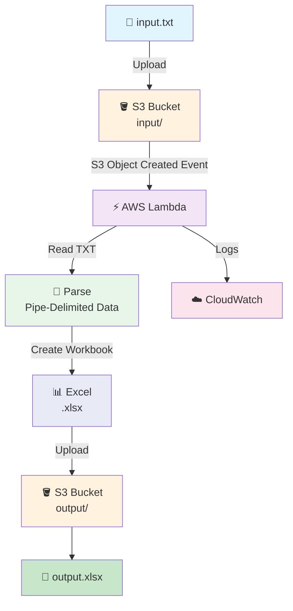
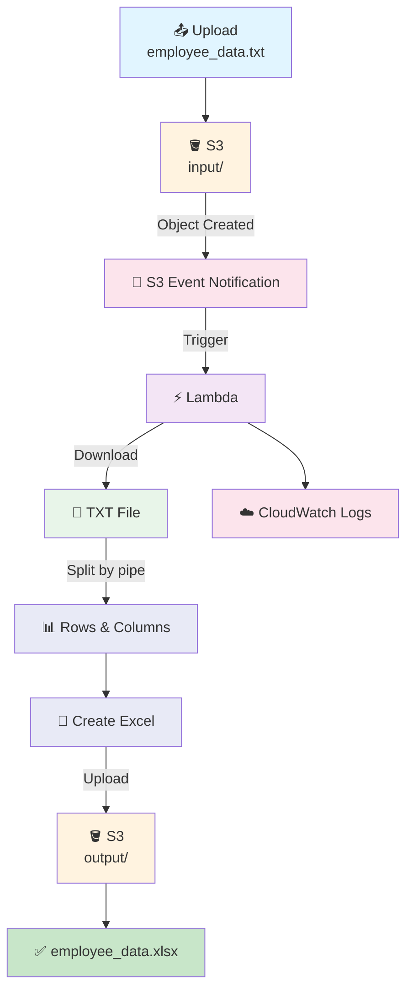

# 📄 TXT → Excel Pipeline

`1 TXT file → Lambda → 1 Excel file`

Lambda reads a **pipe-delimited TXT file** from the `input/` folder in S3, converts it into an **Excel `.xlsx` file**, and saves the Excel file into the `output/` folder.

---

## 📁 Files in This Folder

| File | What It Is |
| ---- | ---------- |
| [01) README.md](01)%20README.md) | Complete explanation of the TXT → Excel pipeline |
| [lambda_function.py](lambda_function.py) | Lambda function that reads TXT from S3 and creates an Excel file |
| [trust_policy.json](trust_policy.json) | IAM trust policy that allows Lambda to assume its execution role |
| [input/input.txt](input/input.txt) | Sample pipe-delimited TXT file used as input |

---

# 🎯 Goal

The goal is to build a simple serverless data-conversion pipeline:

```text
📄 TXT File
     ↓
🪣 S3 input/
     ↓
⚡ AWS Lambda
     ↓
📊 Convert TXT → Excel
     ↓
🪣 S3 output/
     ↓
📗 Excel File
```

### Example

Input:

```text
input/employee_data.txt
```

Lambda converts it into:

```text
output/employee_data.xlsx
```

So:

```text
1 TXT file → 1 Excel file
```

---

# 🏗️ Architecture



---

# 📌 AWS Resources We Need

We need the following AWS resources:

| Resource | Purpose |
| -------- | ------- |
| 🪣 S3 Bucket | Stores input TXT and output Excel files |
| ⚡ Lambda | Converts TXT into Excel |
| 🔐 IAM Role | Gives Lambda permission to access S3 and CloudWatch |
| ☁️ CloudWatch | Stores Lambda execution logs |

---

# 🪣 1. Create S3 Bucket

1. Open **AWS Management Console**
2. Search for **S3**
3. Open **Amazon S3**
4. Click **Create bucket**
5. Enter a globally unique bucket name

Example:

```text
txt-excel-lambda-demo
```

6. Select your required AWS Region
7. Keep the remaining settings as default for this practice project
8. Click **Create bucket**

---

# 📂 2. Create Input and Output Folders

Inside the S3 bucket, create two folders:

```text
txt-excel-lambda-demo
│
├── input/
│
└── output/
```

### Important

The Lambda trigger will monitor **only the `input/` folder**.

The `output/` folder will contain the generated Excel files.

This is important because Lambda writes the Excel file into `output/`.

If the trigger monitored the entire bucket, uploading the Excel file could trigger Lambda again.

So:

```text
input/  → Trigger Lambda ✅

output/ → No Lambda trigger ❌
```

---

# 📄 3. Upload the Input TXT File

Use the provided:

```text
input/input.txt
```

Upload it into the S3 `input/` folder.

The final structure should look like:

```text
txt-excel-lambda-demo
│
├── input/
│   └── input.txt
│
└── output/
```

You can rename `input.txt` to something more meaningful, for example:

```text
employee_data.txt
```

Then:

```text
txt-excel-lambda-demo
│
├── input/
│   └── employee_data.txt
│
└── output/
```

---

# 📝 4. Input TXT File Format

The TXT file uses the **pipe (`|`) character as the delimiter**.

Example:

```text
Employee_ID|Employee_Name|Department|Salary|Joining_Date
101|Rahul Sharma|Data Engineering|85000|2024-01-15
102|Priya Mehta|Analytics|78000|2024-03-10
103|Amit Kumar|Cloud Engineering|92000|2023-11-20
104|Neha Singh|Data Science|88000|2024-02-05
105|Vikram Patel|DevOps|95000|2023-09-18
```

The first line is treated as the **Excel header**.

The remaining lines become Excel rows.

### TXT

```text
Employee_ID|Employee_Name|Department|Salary|Joining_Date
101|Rahul Sharma|Data Engineering|85000|2024-01-15
102|Priya Mehta|Analytics|78000|2024-03-10
```

### Excel

| Employee_ID | Employee_Name | Department | Salary | Joining_Date |
| ----------- | ------------- | ---------- | -----: | ------------ |
| 101 | Rahul Sharma | Data Engineering | 85000 | 2024-01-15 |
| 102 | Priya Mehta | Analytics | 78000 | 2024-03-10 |

---

# ⚡ 5. Create the Lambda Function

1. Open **AWS Management Console**
2. Search for **Lambda**
3. Open **AWS Lambda**
4. Click **Functions**
5. Click **Create function**
6. Select **Author from scratch**

Use:

| Setting | Value |
| ------- | ----- |
| Function name | `txt-to-excel` |
| Runtime | Python 3.x |
| Architecture | `x86_64` |
| Permissions | Create a new role with basic Lambda permissions |

Click:

**Create function**

---

# 🔐 6. IAM Permissions

The Lambda execution role needs two managed policies for this practice project.

Attach these **AWS managed policies**:

### 1. `AmazonS3FullAccess`

Allows Lambda to:

```text
Read files from S3
Write files to S3
Access S3 objects
```

### 2. `AWSLambdaBasicExecutionRole`

Allows Lambda to write logs to:

```text
Amazon CloudWatch Logs
```

So the Lambda execution role should have:

```text
Lambda Execution Role
│
├── AmazonS3FullAccess
└── AWSLambdaBasicExecutionRole
```

> ⚠️ For this practice project, `AmazonS3FullAccess` keeps the setup simple. In a production environment, it is better to use a least-privilege policy that allows access only to the required bucket/prefix.

---

# 🔑 7. Lambda Trust Policy

The Lambda execution role needs a trust relationship that allows the Lambda service to assume the role.

The trust policy is available in:

[trust_policy.json](trust_policy.json)

It contains:

```json
{
  "Version": "2012-10-17",
  "Statement": [
    {
      "Effect": "Allow",
      "Principal": {
        "Service": [
          "lambda.amazonaws.com"
        ]
      },
      "Action": "sts:AssumeRole"
    }
  ]
}
```

### Important

The **trust policy** answers:

> "Who is allowed to assume this IAM role?"

The managed policies answer:

> "What is the Lambda allowed to do after assuming the role?"

So:

```text
Trust Policy
     ↓
Lambda can assume the role

Managed Policies
     ↓
Lambda can access S3 + CloudWatch
```

---

# 📦 8. Install `openpyxl`

Lambda's default Python runtime does **not** include `openpyxl`.

Our Lambda code uses `openpyxl` to create the `.xlsx` file.

Therefore, `openpyxl` must be available to Lambda through either:

* A Lambda Layer
* A deployment package containing `openpyxl`

### Option A — Build the layer on Windows (simplest)

`openpyxl` is **pure Python** (its only dependency, `et_xmlfile`, is pure Python too). There are no compiled extensions, so the layer can be built on Windows without Docker.

In Git Bash:

```bash
mkdir -p /d/openpyxl-layer/python
pip install --no-cache-dir -t /d/openpyxl-layer/python openpyxl
cd /d/openpyxl-layer && zip -r openpyxl-layer.zip python
```

Then in Lambda:

```text
Lambda
 ↓
Layers
 ↓
Create layer
 ↓
Upload openpyxl-layer.zip
 ↓
Compatible architectures: x86_64
 ↓
Compatible runtimes: the Python version you are using
 ↓
Create
```

Finally attach the layer to the function:

```text
txt-to-excel
 ↓
Layers
 ↓
Add a layer
 ↓
Custom layers
 ↓
openpyxl-layer
```

### Option B — Build the layer with Docker (matches `D:\lambda-layer-build`)

If you prefer the same reproducible, container-built approach used for the pandas/numpy layers, run the pip install inside the Lambda image instead:

```bash
docker run --rm --platform linux/amd64 --entrypoint /bin/sh \
  -v "/d/openpyxl-layer/python:/var/task/python" \
  public.ecr.aws/lambda/python:3.12 \
  -c "pip install --no-cache-dir --only-binary=:all: -t /var/task/python openpyxl"
```

> 📌 The `python/` folder must be the **zip root**. Do not zip the `python` folder itself.

> ⚠️ Match the layer's runtime to the function's runtime. A layer built for Python 3.12 attached to a Python 3.11 function will fail at import time.

---

# 💻 9. Lambda Code

Open the Lambda function and replace the default code with the code from:

[lambda_function.py](lambda_function.py)

The Lambda function does the following:

```text
1. Receive S3 event
        ↓
2. Get bucket name
        ↓
3. Get TXT file name
        ↓
4. Download TXT from S3
        ↓
5. Read pipe-delimited data
        ↓
6. Create Excel workbook
        ↓
7. Upload .xlsx to output/
        ↓
8. Print result in CloudWatch
```

---

# 🔗 10. Connect S3 → Lambda

Now configure S3 to trigger Lambda.

Go to:

```text
S3
 ↓
Your Bucket
 ↓
Properties
 ↓
Event notifications
 ↓
Create event notification
```

Create the notification with:

| Setting | Value |
| ------- | ----- |
| Event notification name | `txt-file-upload` |
| Prefix | `input/` |
| Suffix | `.txt` |
| Event type | All object create events |
| Destination | Lambda function |
| Lambda | `txt-to-excel` |

### Why use Prefix and Suffix?

We only want Lambda to run for TXT files inside `input/`.

```text
input/employee_data.txt
        ↓
      Lambda ✅
```

But:

```text
output/employee_data.xlsx
        ↓
      Lambda ❌
```

And:

```text
input/image.jpg
        ↓
      Lambda ❌
```

---

# 🧪 11. Test the Pipeline

Make sure the S3 bucket contains:

```text
txt-excel-lambda-demo
│
├── input/
│   └── employee_data.txt
│
└── output/
```

Now upload:

```text
employee_data.txt
```

to:

```text
input/
```

---

# 🔄 12. What Happens After Upload?



The final S3 structure becomes:

```text
txt-excel-lambda-demo
│
├── input/
│   └── employee_data.txt
│
└── output/
    └── employee_data.xlsx
```

---

# ☁️ 13. Check CloudWatch Logs

After the Lambda executes:

1. Open **AWS Lambda**
2. Open:

```text
txt-to-excel
```

3. Go to **Monitor**
4. Click **View CloudWatch logs**

Or:

```text
CloudWatch
 ↓
Logs
 ↓
Log groups
 ↓
/aws/lambda/txt-to-excel
```

You should see messages similar to:

```text
Received file: input/employee_data.txt
TXT file downloaded successfully.
Rows written to Excel: 6
Excel file created successfully: s3://txt-excel-lambda-demo/output/employee_data.xlsx
```

---

# ✅ 14. Verify the Excel File

Go back to:

```text
S3
 ↓
txt-excel-lambda-demo
 ↓
output/
```

You should see:

```text
employee_data.xlsx
```

Download and open the file.

The data should appear as proper Excel rows and columns.

---

# 🧠 How the Pipeline Works

The complete flow is:

```text
📄 employee_data.txt
        ↓
🪣 S3 input/
        ↓
🔔 S3 Event Notification
        ↓
⚡ AWS Lambda
        ↓
📖 Read TXT
        ↓
🔀 Split using "|"
        ↓
📊 Create Excel Workbook
        ↓
📗 employee_data.xlsx
        ↓
🪣 S3 output/
```

---

# 📌 Important Points

### 1️⃣ Lambda is event-driven

You don't manually run Lambda.

Uploading the TXT file automatically triggers it.

### 2️⃣ Input and output are separated

```text
input/  → Input files

output/ → Generated Excel files
```

### 3️⃣ Pipe is the delimiter

The Lambda expects:

```text
Column1|Column2|Column3
Value1|Value2|Value3
```

### 4️⃣ Output filename

If input is:

```text
input/employee_data.txt
```

output becomes:

```text
output/employee_data.xlsx
```

### 5️⃣ Avoid recursive triggers

The S3 trigger listens only to:

```text
input/
```

while Lambda writes to:

```text
output/
```

Therefore, the generated Excel file doesn't trigger Lambda again.

### 6️⃣ Values land in Excel as text

`csv.reader` returns **strings**, so `Salary` and `Joining_Date` are written as text, not as numbers or dates.

Excel may show a green "number stored as text" warning on the Salary column.

To fix it for real workloads, convert the values before writing:

```python
worksheet.append(row)   # all text

# vs. typed values
def convert(value):
    try:
        return int(value)
    except ValueError:
        return value

worksheet.append([convert(cell) for cell in row])
```

### 7️⃣ Object keys arrive URL-encoded

S3 gives the key with spaces encoded as `+` and other characters percent-encoded.

That is why the code runs the raw key through `unquote_plus()`:

```python
input_key = unquote_plus(raw_key)
```

Without it, a file named `employee data.txt` would be requested as `employee+data.txt` and `get_object` would fail with `NoSuchKey`.

---

# 📊 Final Architecture

```text
                    ┌──────────────────────┐
                    │   📄 TXT File        │
                    │ employee_data.txt    │
                    └──────────┬───────────┘
                               │
                               ▼
                    ┌──────────────────────┐
                    │ 🪣 S3 Bucket         │
                    │      input/          │
                    └──────────┬───────────┘
                               │
                         S3 Event
                               │
                               ▼
                    ┌──────────────────────┐
                    │ ⚡ AWS Lambda        │
                    │    txt-to-excel      │
                    └──────────┬───────────┘
                               │
                        Convert TXT
                          to Excel
                               │
                               ▼
                    ┌──────────────────────┐
                    │ 🪣 S3 Bucket         │
                    │      output/         │
                    └──────────┬───────────┘
                               │
                               ▼
                    ┌──────────────────────┐
                    │ 📗 Excel File        │
                    │ employee_data.xlsx   │
                    └──────────────────────┘
```

---

# 📝 Summary

| Component | What It Does |
| --------- | ------------ |
| **S3 `input/`** | Stores incoming TXT files |
| **S3 Event Notification** | Detects new `.txt` files |
| **AWS Lambda** | Reads TXT and converts it to Excel |
| **openpyxl** | Creates the `.xlsx` workbook |
| **S3 `output/`** | Stores generated Excel files |
| **CloudWatch** | Stores Lambda execution logs |
| **AmazonS3FullAccess** | Allows Lambda S3 access |
| **AWSLambdaBasicExecutionRole** | Allows Lambda to write CloudWatch logs |

### 🎯 Final Flow

```text
1 TXT file
     ↓
S3 input/
     ↓
Lambda
     ↓
1 Excel file
     ↓
S3 output/
```

**This is the complete TXT → Excel serverless pipeline.**

---

## One important Lambda setting

Because the handler file is named:

```text
lambda_function.py
```

and the function is:

```python
lambda_handler
```

the Lambda **Handler** should be:

```text
lambda_function.lambda_handler
```
