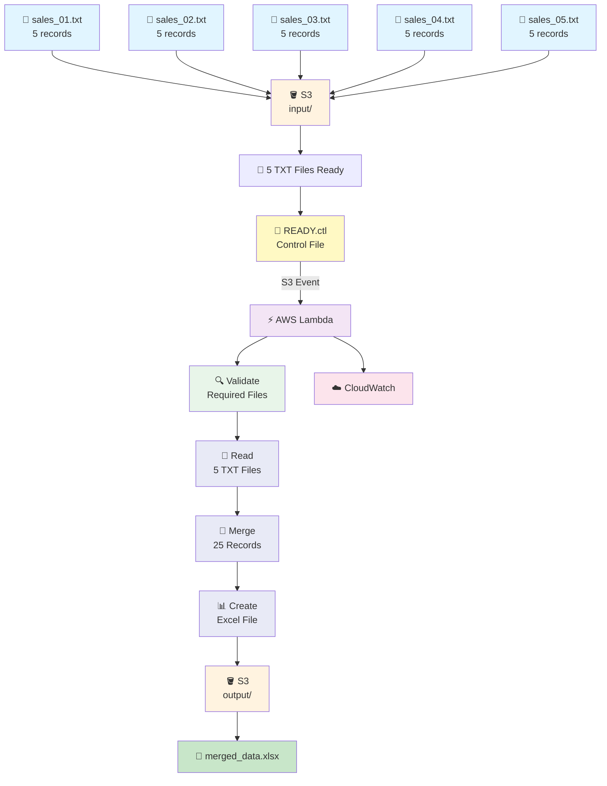

# 📄 Multiple TXT → Merge → Excel Pipeline

`5 TXT files × 5 records → .ctl → Lambda → merged Excel`

We introduced the **`.ctl` control-file approach**, so Lambda starts the actual processing only after all input files are ready.

---

## 📁 Files in This Folder

| File | What It Is |
| ---- | ---------- |
| [01) README.md](01)%20README.md) | Complete explanation of the multiple TXT → Excel pipeline |
| [lambda_function.py](lambda_function.py) | Lambda function that validates the control file, reads all TXT files, merges them, and creates one Excel file |
| [trust_policy.json](trust_policy.json) | IAM trust policy that allows Lambda to assume its execution role |
| [input/sales_01.txt](input/sales_01.txt) | Input TXT file containing records 101–105 |
| [input/sales_02.txt](input/sales_02.txt) | Input TXT file containing records 106–110 |
| [input/sales_03.txt](input/sales_03.txt) | Input TXT file containing records 111–115 |
| [input/sales_04.txt](input/sales_04.txt) | Input TXT file containing records 116–120 |
| [input/sales_05.txt](input/sales_05.txt) | Input TXT file containing records 121–125 |
| [input/READY.ctl](input/READY.ctl) | Control file that tells Lambda all input files are ready for processing |

---

# 🎯 Goal

The goal is to process multiple TXT files together and create **one merged Excel file**.

We have:

```text
5 TXT files
×
5 records per file
=
25 total records
```

Lambda should **not** start processing when each TXT file arrives.

Instead, we upload all 5 TXT files first.

After all 5 TXT files are uploaded, we upload:

```text
READY.ctl
```

The `.ctl` file acts as a **control signal**.

Its purpose is:

> "All required input files should now be ready. Start the pipeline."

---

# 🏗️ Architecture



---

# 📌 AWS Resources We Need

| Resource | Purpose |
| -------- | ------- |
| 🪣 S3 Bucket | Stores input TXT files, control file, and output Excel |
| ⚡ Lambda | Reads and merges the TXT files |
| 🔔 S3 Event Notification | Triggers Lambda when `.ctl` file arrives |
| 🔐 IAM Role | Gives Lambda permission to access S3 and CloudWatch |
| ☁️ CloudWatch | Stores Lambda execution logs |

---

# 🪣 1. Create S3 Bucket

1. Open **AWS Management Console**
2. Search for **S3**
3. Open **Amazon S3**
4. Click **Create bucket**
5. Enter a globally unique bucket name

Example:

```text
multiple-txt-excel-demo
```

6. Select your required AWS Region
7. Keep the remaining settings as default for this practice project
8. Click **Create bucket**

---

# 📂 2. Create Input and Output Folders

Inside the bucket create:

```text
multiple-txt-excel-demo
│
├── input/
│
└── output/
```

The `input/` folder will contain:

```text
input/
├── sales_01.txt
├── sales_02.txt
├── sales_03.txt
├── sales_04.txt
├── sales_05.txt
└── READY.ctl
```

The `output/` folder will contain:

```text
output/
└── merged_data.xlsx
```

---

# 📄 3. Input TXT Files

We have **5 TXT files**.

Each file contains exactly **5 records**.

Therefore:

```text
sales_01.txt → 5 records
sales_02.txt → 5 records
sales_03.txt → 5 records
sales_04.txt → 5 records
sales_05.txt → 5 records
```

Total:

```text
5 × 5 = 25 records
```

> 📌 In the sample files provided, each file carries a **different** `Employee_ID` range (`101–105`, `106–110`, `111–115`, `116–120`, `121–125`).
>
> That way the merged Excel file contains **25 distinct records** instead of the same 5 records repeated 5 times — which makes it obvious at a glance that the merge actually worked.

---

# 📝 4. TXT File Format

All TXT files use the pipe character:

```text
|
```

as the delimiter.

Example — `sales_01.txt`:

```text
Employee_ID|Employee_Name|Department|Salary|Joining_Date
101|Rahul Sharma|Data Engineering|85000|2024-01-15
102|Priya Mehta|Analytics|78000|2024-03-10
103|Amit Kumar|Cloud Engineering|92000|2023-11-20
104|Neha Singh|Data Science|88000|2024-02-05
105|Vikram Patel|DevOps|95000|2023-09-18
```

The first line is the header.

The next 5 lines are the records.

### ⚠️ Every file must have the same header

Lambda takes the header from the **first file only** (`sales_01.txt`) and writes one header row to Excel.

The header rows of `sales_02.txt` … `sales_05.txt` are read and then **discarded**.

So if one file has a different column order, the merge will silently produce a misaligned Excel file. Keep all five headers identical.

---

# 📂 5. Upload the Five TXT Files

Upload all five files into:

```text
input/
```

Upload:

```text
sales_01.txt
sales_02.txt
sales_03.txt
sales_04.txt
sales_05.txt
```

After uploading them, the S3 structure should be:

```text
multiple-txt-excel-demo
│
├── input/
│   ├── sales_01.txt
│   ├── sales_02.txt
│   ├── sales_03.txt
│   ├── sales_04.txt
│   └── sales_05.txt
│
└── output/
```

---

# ⚠️ Important: Do NOT Upload `.ctl` Yet

At this point, **do not upload `READY.ctl`**.

First make sure all five TXT files are present.

The order is:

```text
1. sales_01.txt
2. sales_02.txt
3. sales_03.txt
4. sales_04.txt
5. sales_05.txt
6. READY.ctl   ← Upload this LAST
```

---

# 📄 6. What Is a `.ctl` File?

`.ctl` means **control file**.

It is not the actual data file.

It is simply a signal that tells the pipeline:

```text
"All expected input files are ready.
You can start processing."
```

For this project we use:

```text
READY.ctl
```

The contents can simply be:

```text
READY
```

The important part is the **`.ctl` extension**.

Lambda never reads the contents of the control file — it only reads the **key name** from the S3 event. So the body could be empty and the pipeline would still work.

---

# 💡 Why Use a Control File?

Imagine the five files arrive at different times:

```text
10:00 AM → sales_01.txt
10:02 AM → sales_02.txt
10:05 AM → sales_03.txt
10:10 AM → sales_04.txt
10:15 AM → sales_05.txt
```

If Lambda were triggered by every TXT file, Lambda could start five times.

That is not what we want.

We want:

```text
sales_01.txt ─┐
sales_02.txt ─┤
sales_03.txt ─┤
sales_04.txt ─┤
sales_05.txt ─┘
       ↓
 All files ready
       ↓
 READY.ctl
       ↓
    Lambda
       ↓
  One Excel
```

Therefore, the Lambda trigger listens only for:

```text
READY.ctl
```

---

# ⚡ 7. Create Lambda Function

1. Open **AWS Management Console**
2. Search for **Lambda**
3. Open **AWS Lambda**
4. Click **Functions**
5. Click **Create function**
6. Select **Author from scratch**

Use:

| Setting | Value |
| ------- | ----- |
| Function name | `multiple-txt-to-excel` |
| Runtime | Python 3.x |
| Architecture | `x86_64` |
| Permissions | Create a new role with basic Lambda permissions |

Click:

**Create function**

---

# 🔐 8. IAM Permissions

The Lambda execution role needs these two AWS managed policies:

### 1. `AmazonS3FullAccess`

Allows Lambda to:

```text
Read TXT files from S3
Read the control file
Write the Excel file to S3
```

### 2. `AWSLambdaBasicExecutionRole`

Allows Lambda to write logs to:

```text
Amazon CloudWatch Logs
```

The role should therefore have:

```text
Lambda Execution Role
│
├── AmazonS3FullAccess
└── AWSLambdaBasicExecutionRole
```

> ⚠️ These broad permissions are convenient for this practice project. In production, use a least-privilege S3 policy restricted to the required bucket and prefixes.
>
> Note that `head_object` (the existence check) is authorised by `s3:GetObject`, **not** by `s3:ListBucket`. A least-privilege policy that grants only `s3:ListBucket` will make every file look "missing".

---

# 🔑 9. Lambda Trust Policy

The trust policy is available in:

[trust_policy.json](trust_policy.json)

It allows the Lambda service to assume the IAM role.

```json
{
  "Version": "2012-10-17",
  "Statement": [
    {
      "Effect": "Allow",
      "Principal": {
        "Service": [
          "lambda.amazonaws.com"
        ]
      },
      "Action": "sts:AssumeRole"
    }
  ]
}
```

Remember:

```text
Trust Policy
     ↓
Who can assume the role?

Managed Policies
     ↓
What can the role do?
```

---

# 📦 10. Install `openpyxl`

The Lambda function uses:

```text
openpyxl
```

to create the Excel `.xlsx` file.

`openpyxl` must therefore be included in the Lambda deployment package or provided through a Lambda Layer.

Make sure the Lambda environment has:

```text
openpyxl
```

available before testing.

> 📎 The step-by-step layer build instructions are in the sibling folder **[01)txt to excel](../01)txt%20to%20excel/01)%20README.md)** — `openpyxl` is pure Python, so the layer can be built with a plain `pip install -t python openpyxl` and does not need Docker.

---

# 💻 11. Lambda Code

Open the Lambda function and replace the default code with the code from:

[lambda_function.py](lambda_function.py)

The Lambda performs these steps:

```text
1. Receive READY.ctl S3 event
        ↓
2. Verify control file
        ↓
3. Check all 5 TXT files exist
        ↓
4. Download all 5 TXT files
        ↓
5. Read pipe-delimited data
        ↓
6. Merge all records
        ↓
7. Create Excel workbook
        ↓
8. Upload merged_data.xlsx
        ↓
9. Print result to CloudWatch
```

---

# 🔗 12. Connect S3 → Lambda

Go to:

```text
S3
 ↓
Your Bucket
 ↓
Properties
 ↓
Event notifications
 ↓
Create event notification
```

Create:

| Setting | Value |
| ------- | ----- |
| Event notification name | `control-file-trigger` |
| Prefix | `input/` |
| Suffix | `.ctl` |
| Event type | All object create events |
| Destination | Lambda function |
| Lambda | `multiple-txt-to-excel` |

### Important

The trigger is configured for:

```text
input/
```

and:

```text
.ctl
```

Therefore:

```text
input/sales_01.txt
        ↓
Lambda ❌

input/sales_02.txt
        ↓
Lambda ❌

input/sales_03.txt
        ↓
Lambda ❌

input/sales_04.txt
        ↓
Lambda ❌

input/sales_05.txt
        ↓
Lambda ❌

input/READY.ctl
        ↓
Lambda ✅
```

### The suffix filter is case-sensitive

S3 object filters match case-sensitively, so `READY.CTL` would **not** trigger the function, and `ready.ctl` is fine but `READY.Ctl` is not.

Stick to lowercase `.ctl`.

---

# 🧪 13. Test the Pipeline

First upload these five files:

```text
input/
├── sales_01.txt
├── sales_02.txt
├── sales_03.txt
├── sales_04.txt
└── sales_05.txt
```

Do NOT upload the control file yet.

Verify all five files exist.

Then upload:

```text
input/READY.ctl
```

---

# 🔄 14. What Happens?

When `READY.ctl` is uploaded:

```text
📄 READY.ctl
      ↓
🪣 S3 input/
      ↓
🔔 S3 Event Notification
      ↓
⚡ Lambda
      ↓
🔍 Check 5 required TXT files
      ↓
📖 Read sales_01.txt
📖 Read sales_02.txt
📖 Read sales_03.txt
📖 Read sales_04.txt
📖 Read sales_05.txt
      ↓
🔀 Merge
      ↓
25 records
      ↓
📊 Create Excel
      ↓
🪣 S3 output/
      ↓
📗 merged_data.xlsx
```

---

# 📊 15. Merged Output

The five TXT files contain:

```text
5 records
+
5 records
+
5 records
+
5 records
+
5 records
```

Therefore:

```text
Total = 25 records
```

The Excel file will contain:

```text
25 data rows
+
1 header row
```

So the Excel worksheet will have **26 rows total**, including the header.

---

# 📗 16. Expected Output

The final S3 structure will be:

```text
multiple-txt-excel-demo
│
├── input/
│   ├── sales_01.txt
│   ├── sales_02.txt
│   ├── sales_03.txt
│   ├── sales_04.txt
│   ├── sales_05.txt
│   └── READY.ctl
│
└── output/
    └── merged_data.xlsx
```

The Excel file will contain the 25 records in file order:

| Employee_ID | Employee_Name | Department | Salary | Joining_Date |
| ----------- | ------------- | ---------- | -----: | ------------ |
| 101 | Rahul Sharma | Data Engineering | 85000 | 2024-01-15 |
| … | … | … | … | … |
| 105 | Vikram Patel | DevOps | 95000 | 2023-09-18 |
| 106 | Ananya Iyer | Data Engineering | 81000 | 2024-04-02 |
| … | … | … | … | … |
| 125 | Harsh Agarwal | DevOps | 99000 | 2024-08-16 |

---

# ☁️ 17. Check CloudWatch Logs

After Lambda executes:

1. Open **AWS Lambda**
2. Open:

```text
multiple-txt-to-excel
```

3. Go to **Monitor**
4. Click **View CloudWatch logs**

Or:

```text
CloudWatch
 ↓
Logs
 ↓
Log groups
 ↓
/aws/lambda/multiple-txt-to-excel
```

You should see messages similar to:

```text
Control file received: s3://multiple-txt-excel-demo/input/READY.ctl
Checking required input files...
Found: input/sales_01.txt
Found: input/sales_02.txt
Found: input/sales_03.txt
Found: input/sales_04.txt
Found: input/sales_05.txt
All required files are available.
Reading: input/sales_01.txt
sales_01.txt: 5 records
sales_02.txt: 5 records
sales_03.txt: 5 records
sales_04.txt: 5 records
sales_05.txt: 5 records
Total records merged: 25
Excel file created successfully: s3://multiple-txt-excel-demo/output/merged_data.xlsx
```

---

# ⚠️ 18. What If a TXT File Is Missing?

The Lambda checks whether all five required TXT files exist.

For example:

```text
input/
├── sales_01.txt
├── sales_02.txt
├── sales_03.txt
├── sales_04.txt
└── sales_05.txt  ❌ Missing
```

Then:

```text
READY.ctl
     ↓
Lambda
     ↓
Check files
     ↓
sales_05.txt missing
     ↓
❌ Stop processing
```

No Excel file should be created.

CloudWatch shows:

```text
Missing: input/sales_05.txt
Required input files are missing.
Missing file: input/sales_05.txt
```

And the function returns:

```json
{
  "statusCode": 400,
  "message": "Required input files are missing.",
  "missing_files": ["input/sales_05.txt"]
}
```

This is one of the main advantages of the control-file approach.

### What Lambda does *not* do

Returning `statusCode: 400` does **not** raise an exception, so the invocation is recorded as **successful** by Lambda — it is not counted as a function error and it does not appear in the error rate metric.

If you want a missing file to be visible as a failure, raise instead of returning:

```python
raise FileNotFoundError(f"Missing required files: {missing_files}")
```

### Note on retries

S3 → Lambda invocations are **asynchronous**. For an async invocation that actually fails (throws), Lambda retries **twice** by default, with the event going to a dead-letter queue or on-failure destination if configured.

Because this code *returns* on a missing file rather than raising, those automatic retries never happen. So if `READY.ctl` lands a few seconds before the last TXT file finishes uploading, the batch is simply skipped — it will not self-correct.

Two ways to make that robust if you need it in production:

```text
Option A → raise on missing files, and let the 2 async retries cover the race
Option B → add a short retry/back-off loop that re-checks the files a few times
```

---

# 🧠 19. Why `.ctl` Is Useful

Without a control file:

```text
TXT 1 → Lambda
TXT 2 → Lambda
TXT 3 → Lambda
TXT 4 → Lambda
TXT 5 → Lambda
```

Lambda may execute multiple times.

With a control file:

```text
TXT 1 ─┐
TXT 2 ─┤
TXT 3 ─┤
TXT 4 ─┤
TXT 5 ─┘
        ↓
    READY.ctl
        ↓
      Lambda
        ↓
   One processing run
```

This is commonly useful in batch-processing workflows where files arrive independently and a separate signal indicates that the batch is complete.

---

# 🛡️ 20. Avoid Recursive Lambda Trigger

Lambda reads:

```text
input/
```

and writes:

```text
output/
```

The S3 event notification only watches:

```text
input/*.ctl
```

Therefore the generated Excel file:

```text
output/merged_data.xlsx
```

does not trigger Lambda again.

---

# 📌 21. Important Points

### 1️⃣ Five TXT files

The pipeline expects:

```text
sales_01.txt
sales_02.txt
sales_03.txt
sales_04.txt
sales_05.txt
```

The list is **hard-coded** in `REQUIRED_FILES` at the top of `lambda_function.py`. To process a different batch size, edit that list.

### 2️⃣ Five records per file

```text
5 TXT files × 5 records = 25 records
```

### 3️⃣ `.ctl` triggers Lambda

The TXT files do not trigger Lambda.

Only:

```text
READY.ctl
```

triggers Lambda.

### 4️⃣ Lambda validates the batch

Lambda checks that all five required TXT files exist before processing.

### 5️⃣ One Excel output

All 25 records are merged into:

```text
output/merged_data.xlsx
```

### 6️⃣ You must re-upload `READY.ctl` for every batch

This is the most common point of confusion with this pattern.

The S3 trigger fires on **object created** events only — and there is no event type for "object overwritten in the same way as before".

So for the second batch:

```text
1. Upload new sales_01.txt … sales_05.txt   (overwrite) → no trigger ✅ correct
2. Upload READY.ctl again                   (overwrite) → triggers Lambda ✅
```

Uploading `READY.ctl` again **does** fire the event, because overwriting an object is still a `PutObject`. But there is a real trap:

```text
Old READY.ctl still sitting in input/
        ↓
Someone uploads only sales_03.txt (a correction)
        ↓
Nothing happens ❌
```

The stale `.ctl` is never re-created, so no trigger fires. If you want each batch to be self-contained, either:

```text
Delete READY.ctl after processing, or
Include a batch ID in the control-file name (READY_2026-09-16.ctl)
```

### 7️⃣ The output file is overwritten each run

`output_key` is the fixed string `output/merged_data.xlsx`, so every run replaces the previous result. There is no history.

If you need to keep every run, include a timestamp instead:

```python
from datetime import datetime

run_id = datetime.utcnow().strftime("%Y%m%dT%H%M%SZ")

output_key = f"output/merged_data_{run_id}.xlsx"
```

S3 keeps every version anyway if bucket versioning is switched on.

### 8️⃣ The `head_object` check costs 5 calls

Checking existence with `head_object` per file means 5 extra API calls before the 5 `get_object` downloads.

For a fixed known list of files it is fine. If the batch size grows, one `list_objects_v2` call is cheaper:

```python
response = s3.list_objects_v2(Bucket=bucket_name, Prefix=input_prefix)

found = {obj["Key"] for obj in response.get("Contents", [])}

missing_files = [
    f"{input_prefix}{name}" for name in REQUIRED_FILES
    if f"{input_prefix}{name}" not in found
]
```

### 9️⃣ Only "file missing" is treated as missing

The `try/except` around `head_object` catches `ClientError` specifically and only treats `404` / `NoSuchKey` / `NotFound` as a missing file.

Any other error — access denied, throttling, KMS failure — is **re-raised** so the invocation is correctly marked as failed.

A bare `except Exception:` would have reported an `AccessDenied` as "file missing", which sends you hunting for a data problem that does not exist.

### 🔟 Values land in Excel as text

As in pipeline 01, `csv.reader` returns **strings**, so `Salary` is written as text rather than a number. See `01)txt to excel` for the `convert()` fix.

---

# 🧩 Complete Pipeline

```text
                 INPUT FILES

sales_01.txt ─┐
sales_02.txt ─┤
sales_03.txt ─┤
sales_04.txt ─┤
sales_05.txt ─┘
       │
       ▼
   🪣 S3 input/
       │
       │
       │  READY.ctl
       │      │
       │      ▼
       │   🔔 S3 Event
       │      │
       └──────┤
              ▼
        ⚡ AWS Lambda
              │
              ▼
       🔍 Validate 5 Files
              │
              ▼
        📖 Read TXT Files
              │
              ▼
        🔀 Merge Records
              │
              ▼
        📊 Create Excel
              │
              ▼
       🪣 S3 output/
              │
              ▼
      📗 merged_data.xlsx
```

---

# 📊 Summary

| Component | What It Does |
| --------- | ------------ |
| **5 TXT files** | Provide the input data |
| **S3 `input/`** | Stores TXT and `.ctl` files |
| **READY.ctl** | Signals that the batch is ready |
| **S3 Event Notification** | Triggers Lambda only for `.ctl` |
| **AWS Lambda** | Validates, reads, merges and converts the data |
| **openpyxl** | Creates the Excel workbook |
| **S3 `output/`** | Stores the merged Excel file |
| **CloudWatch** | Stores Lambda execution logs |
| **AmazonS3FullAccess** | Allows Lambda to access S3 |
| **AWSLambdaBasicExecutionRole** | Allows Lambda to write CloudWatch logs |

---

# 🎯 Final Flow

```text
5 TXT files
     ↓
5 × 5 records
     ↓
All files uploaded
     ↓
READY.ctl
     ↓
S3 Event
     ↓
Lambda
     ↓
Validate files
     ↓
Merge 25 records
     ↓
Excel
     ↓
output/merged_data.xlsx
```

**This is the complete Multiple TXT → Merge → Excel pipeline using a `.ctl` control-file approach.**

---

## One important Lambda setting

Because the handler file is named:

```text
lambda_function.py
```

and the function is:

```python
lambda_handler
```

the Lambda **Handler** should be:

```text
lambda_function.lambda_handler
```
