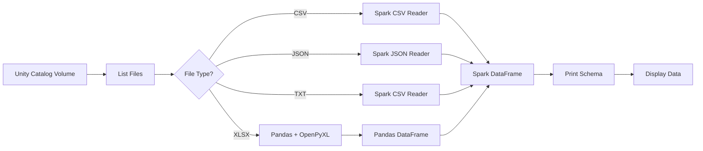

# 📌 Databricks — Read Multiple File Formats from Unity Catalog Volume

## 📁 Files in This Folder

| File | What It Is |
| ---- | ---------- |
| [01) README.md](01)%20README.md) | Complete explanation of the multi-format read notebook |
| [notebook.py](notebook.py) | The full Databricks notebook code — each `# COMMAND ----------` block is one cell |

> 📌 This folder is the **Databricks side only**. There is no AWS component here — no Lambda, no trust policy. The notebook reads whatever files are already sitting in the Unity Catalog Volume.

---

## 1. Purpose

The purpose of this pipeline is to **read different file formats dynamically** from a Databricks Unity Catalog Volume.

It supports:

* CSV
* JSON
* TXT
* XLSX / Excel

The notebook automatically checks the file extension and uses the appropriate reader.

### Pipeline Flow



---

## 2. Prerequisite

For Excel files, we need the `openpyxl` library.

### Cell 1 — Install OpenPyXL

```python
%pip install openpyxl
```

---

## 3. Restart Python

After installing the library, restart the Python environment.

### Cell 2 — Restart Python

```python
%restart_python
```

> This ensures that the newly installed `openpyxl` package is available to the notebook.

---

## 4. Import Required Libraries

This goes in **Cell 3**, together with everything below.

```python
import pandas as pd
```

---

## 5. Define Input Path

The files are stored inside a **Unity Catalog Volume**.

Also in **Cell 3**.

```python
path = "/Volumes/lambda-to-databricks/default/structured-2026"
```

---

## 6. List All Files

We use `dbutils.fs.ls()` to get all files available in the Volume.

Also in **Cell 3**.

```python
files = dbutils.fs.ls(path)
```

---

# 7. Complete Notebook Code

### Cell 3 — Main Processing Logic

The full notebook code lives in:

[notebook.py](notebook.py)

The notebook is **three cells** in total:

```text
Cell 1 → %pip install openpyxl
Cell 2 → %restart_python
Cell 3 → imports + input path + list files + the processing loop
```

Only the `%pip` install and the Python restart need their own cells.

Everything else — imports, the volume path, listing the files, and the whole
`for` loop — runs as one single cell.

`notebook.py` holds all three in order, separated by `# COMMAND ----------` blocks, so it can be pasted into Databricks cell by cell or imported as notebook source.

---

## 8. What This Pipeline Does

| Step | Action                                         |
| ---- | ---------------------------------------------- |
| 1    | Install `openpyxl` for Excel support           |
| 2    | Restart Python                                 |
| 3    | Import Pandas                                  |
| 4    | Define Unity Catalog Volume path               |
| 5    | List all files from the Volume                 |
| 6    | Loop through each file and identify its format |
| 7    | Read the file using the appropriate reader     |
| 8    | Print schema and display the data              |

### 🎯 Interview Explanation

> **"I created a dynamic Databricks notebook that reads multiple file formats from a Unity Catalog Volume. The notebook lists all files, identifies the file type based on the extension, and dynamically uses the appropriate reader. I use Spark for CSV, JSON and TXT files, while Excel files are read using Pandas with OpenPyXL and then converted into a Spark DataFrame. Finally, I print the schema and display the data."**
