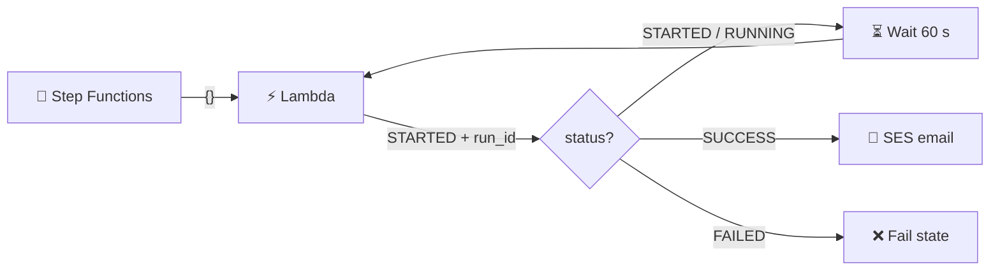

# Step Functions → Lambda → Databricks

## Step Functions Starts a Databricks Job, Waits, Checks the Status, Then Emails on Success

## 📁 Files in This Folder

| File | What It Is |
| ---- | ---------- |
| [lambda_function.py](lambda_function.py) | Starts the Databricks job, checks its status, sends the SES email on success |
| [state_machine.json](state_machine.json) | Step Functions loop — invoke Lambda, Choice on `status`, Wait 60 s, invoke again |
| [email.html](email.html) | HTML email template with `{{JOB_ID}}` and `{{RUN_ID}}` placeholders |
| [email.css](email.css) | Styling injected into the HTML `<head>` at runtime |
| [trust_policy.json](trust_policy.json) | IAM trust policy for **both** Step Functions and Lambda |

## 🎯 Goal

One Lambda and a Step Functions loop:

```text
Step Functions → Lambda → STARTED + run_id
      ↓
Wait 60 seconds
      ↓
Step Functions → Lambda (run_id) → RUNNING → wait again
      ↓
repeats until SUCCESS or FAILED
      ↓
SUCCESS → HTML email sent ✅     FAILED → state machine fails ❌
```

The `run_id` is what makes the loop work — Step Functions hands it back to Lambda each round, so Lambda knows whether to **start** a job or **check** one.

## Architecture



## 🔐 Step 1: IAM Role

IAM → Roles → Create role → **Custom trust policy** → paste [trust_policy.json](trust_policy.json).

One role is used by **both** services:

```json
"Service": ["states.amazonaws.com", "lambda.amazonaws.com"]
```

Attach these managed policies:

| Policy | Why |
|--------|-----|
| `AmazonSESFullAccess` | Lets Lambda send the email |
| `AWSLambdaBasicExecutionRole` | Lets Lambda write CloudWatch logs |
| `AWSLambdaRole` | Lets Step Functions invoke Lambda |

Role name: `stepfunctions-lambda-databricks-role`

> ⚠️ Databricks needs **no** IAM permission — Lambda calls it over HTTPS with the Databricks token.

## 🐍 Step 2: Create the Lambda

Lambda → Functions → Create function → **Author from scratch**

| Setting | Value |
|---------|-------|
| Function name | `SF-lambda-databricks` |
| Runtime | Python 3.x |
| Permissions | Use an existing role → `stepfunctions-lambda-databricks-role` |

The code opens `email.html` and `email.css` from disk, so the function needs **three** files — not one:

1. Paste [lambda_function.py](lambda_function.py) into the existing `lambda_function.py`
2. In the console editor: right-click the function folder → **New File** → name it `email.html` → paste [email.html](email.html)
3. Same for `email.css` → paste [email.css](email.css)
4. Click **Deploy** and confirm the file tree lists all three files

> 📌 `BASE_DIR = os.path.dirname(__file__)` points at the function root, so the templates load from next to the code. If a file is missing you get `FileNotFoundError: email.html`.

> 💡 No layer is needed — the code uses the built-in `urllib` and `boto3`.

## 💻 Step 3: Replace the Config Block

At the top of [lambda_function.py](lambda_function.py):

```python
DATABRICKS_HOST  = "YOUR DATABRICKS HOST"     # no https://, e.g. dbc-xxxx.cloud.databricks.com
DATABRICKS_TOKEN = "YOUR DATABRICKS TOKEN"    # dapi...
JOB_ID           = YOUR DATABRICKS JOB ID     # number from the job URL
```

Also check the SES block:

| Constant | Meaning |
|----------|---------|
| `REGION` | SES region, e.g. `us-east-1` |
| `SENDER` | Verified SES sender identity |
| `RECIPIENTS` | Verified recipient(s) — required while in the SES sandbox |

> 🔐 Prefer an environment variable or Secrets Manager for the token instead of hardcoding it.
>
> ⚠️ The Lambda will not run until all three placeholder values are replaced.

## 🧠 How the Loop Works

Step Functions calls the **same** Lambda repeatedly, changing the payload:

| Invocation | Payload | Lambda does | Returns |
|-----------|---------|-------------|---------|
| 1 | `{}` (no `run_id`) | `POST /api/2.2/jobs/run-now` | `STARTED` + `run_id` |
| 2 | `{"run_id": ...}` | `GET /api/2.2/jobs/runs/get?run_id=...` | `RUNNING` / `SUCCESS` / `FAILED` |
| 3+ | same | check again | until the job terminates |

The `status` field drives the Choice state:

| `status` | Next state |
|----------|-----------|
| `STARTED` / `RUNNING` | `Wait 1 Minute` → invoke Lambda again |
| `SUCCESS` | `Job Completed Successfully` (Succeed) |
| `FAILED` | `Job Failed` (Fail) |
| anything else | `Default` → `Job Failed` |

Lifecycle values treated as *still running*: `QUEUED`, `PENDING`, `RUNNING`, `BLOCKED`, `WAITING_FOR_REPAIR`, `TERMINATING`.

Success is exactly `life_cycle_state == "TERMINATED"` **and** `result_state == "SUCCESS"`.

> 💡 Step Functions does the waiting, not Lambda — each invocation finishes in seconds and the 60-second pause costs nothing.

## 📧 When Is the Email Sent?

Only on success — `send_success_email()` is called inside the `SUCCESS` branch:

- `email.html` is loaded, then `email.css` is injected before `</head>` → one self-contained HTML email
- `{{JOB_ID}}` and `{{RUN_ID}}` are replaced with the real values
- SES gets `Source=SENDER`, `Destination.ToAddresses=RECIPIENTS`, plus an HTML body and a plain-text fallback

A failed run sends **no** email in this design — the execution ends in the `Fail` state with `DatabricksJobFailed`.

## 🧩 Step 4: Create the State Machine

Step Functions → State machines → Create state machine → **Write your workflow in code** → type **Standard**

Paste [state_machine.json](state_machine.json).

> ⚠️ Replace `"FunctionName": "YOUR LAMBDA ARN"` with the ARN of your `SF-lambda-databricks` function.

| Setting | Value |
|---------|-------|
| Name | `SF-databricks-monitor` |
| Type | Standard |
| Execution role | `stepfunctions-lambda-databricks-role` |

Two lines make the loop work:

- `"Payload.$": "$"` — passes the **whole** state input to Lambda, so `run_id` goes back with it
- `"OutputPath": "$.Payload"` — unwraps the Lambda response so `$.status` is top level for the Choice state

Default JSONPath is used, so the task uses `Parameters` (not `Arguments`).

## 🧪 Step 5: Test

Start execution with input:

```json
{}
```

Timeline:

```text
t = 0:00  Lambda → STARTED (run_id 123...)
t = 1:00  Lambda → RUNNING
t = 2:00  Lambda → RUNNING
t = 3:00  Lambda → SUCCESS → email sent ✅
```

Verify: the execution graph shows `Invoke Databricks Lambda → Check Job Status → Wait 1 Minute` repeating, then **Succeeded**; CloudWatch shows every invocation; the HTML email arrives.

## ⚠️ Common Mistakes

| ❌ Mistake | ✅ Fix |
|-----------|-------|
| `No such file or directory: email.html` | Create `email.html` + `email.css` in the console editor, then **Deploy** |
| Email never arrives | Verify sender **and** recipients in SES (sandbox mode) |
| `Email address is not verified` | Verify the identity in the **same** region as `REGION` |
| `401 Unauthorized` | Bad or expired Databricks token |
| `404 Not Found` | Wrong host or `job_id` |
| Execution fails on the first state | `FunctionName` ARN not replaced |
| Loops forever | Job never terminates — check the run in Databricks |
| Job finished but no email | `result_state` must be `SUCCESS`, not just `TERMINATED` |

## 🎤 Interview Explanation

> **"I built a Step Functions workflow that starts a Databricks job through a Lambda and then monitors it. The first invocation sends an empty payload, so Lambda calls the Run Now API and returns STARTED with a run_id. A Choice state looks at the status: STARTED or RUNNING goes to a 60-second Wait state and invokes the same Lambda again, this time with the run_id, so Lambda calls the runs/get endpoint and reports the lifecycle state. When the job terminates with SUCCESS, Lambda loads an HTML template, injects the CSS, replaces the job and run placeholders and sends the email with SES; on failure the workflow ends in a Fail state. The waiting is done by Step Functions instead of sleeping inside Lambda, so Lambda is only running when it is actually calling the API."**

## Summary

| Component | What It Does |
|-----------|--------------|
| **IAM Role** (`stepfunctions-lambda-databricks-role`) | One role for both services (SES + logs + invoke) |
| **Lambda** (`SF-lambda-databricks`) | Starts the job, polls its state, sends the email on success |
| **Step Functions** (`SF-databricks-monitor`) | Loops Lambda with a 60-second Wait until the job ends |
| **SES** | Sends the HTML email built from `email.html` + `email.css` |
| **CloudWatch Logs** | Shows every start, check, state and message ID |

Step Functions controls **when** to check, Lambda does the **API calls**, Databricks does the **data work**, and SES reports the **outcome**.
